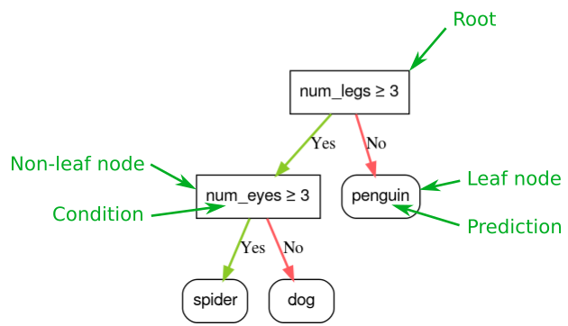
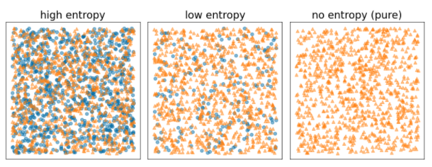
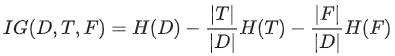
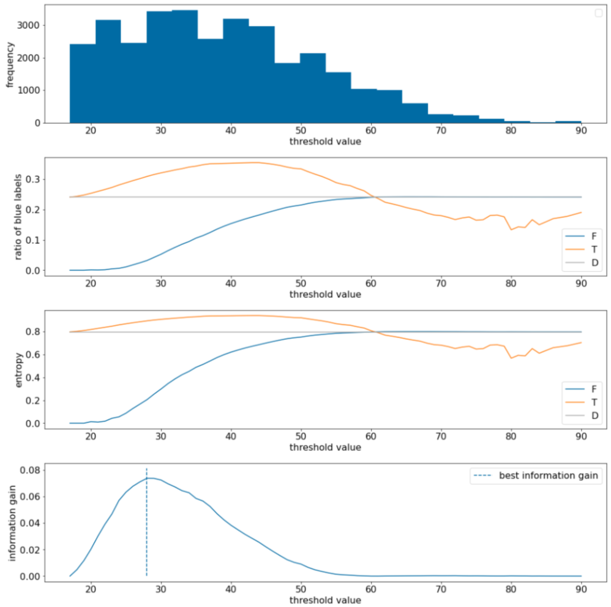

## Introduction

Decision forests are a family of interpretable machine learning algorithms that excel with tabular data. Decision forests can perform:

- Classification
- Regression
- Ranking
- Anomaly detection
- Uplift modeling.

Decision forests provide the following benefits:

- They are **easier to configure** than neural networks. Decision forests have **fewer hyperparameters**; furthermore, the hyperparameters in decision forests provide **good defaults**.
- They **natively handle** numeric, categorical, and missing features. This means you can write far less preprocessing code than when using a neural network, saving you time and reducing sources for error.
- They often give **good results out of the box**, are robust to noisy data, and have interpretable properties.
- They infer and train on **small datasets (< 1M examples) much faster** than neural networks.

&rarr; Decision forests are highly effective for modeling tabular data, making them a primary choice for datasets commonly found in spreadsheets, CSV files, or databases.

## Decision Trees

Decision forest models are composed of decision trees. Decision forest learning algorithms (like random forests) rely, at least in part, on the learning of decision trees.

A **decision tree** model uses a hierarchical structure of conditions to route an example from the root to a leaf node, where the leaf's value represents the prediction. The predictions can be both a specific class or numeric values (regression).



#### Types of conditions

- An **axis-aligned condition** involves only a single feature. i.e. num_legs>=2
- An **oblique condition** involves multiple features. i.e. num_legs ≥ num_fingers

    While oblique splits offer greater power, they come at the cost of increased training and inference expenses compared to axis-aligned conditions.
- Conditions can be **binary (two outcomes)** or **non-binary** (more than two outcomes), with binary decision trees being more common due to reduced overfitting.
- **Threshold conditions**, comparing a feature to a threshold, are the most frequently used type of condition in decision trees.

## Growing decision trees

### General Idea

The optimal training of a decision tree is an NP-hard problem. Therefore, training is generally done using heuristics. 

Most algorithms used to train decision trees work with a **greedy divide and conquer strategy**. The algorithm starts by creating a single node (the root) and recursively grows the tree by selecting the "best" condition at each node.

At each node, all the possible conditions are evaluated and scored. The algorithm selects the "best" condition, that is, the condition with the highest score. This routine is called the **splitter**.
- The choice of splitter algorithm depends on factors such as feature type, task, condition type, and regularization criteria.
- The score maximized by the splitter depends on the task. For example:
    - **Information gain** and **Gini** are commonly used for classification.
    - **Mean squared error** is commonly used for regression.

When no satisfying conditions are found, the node becomes a leaf. The leaf prediction is determined as the most representative label value in the examples.

### Exact splitter for binary classification

The simplest splitter algorithm for decision trees uses a threshold on a numerical feature to divide data into two groups, aiming to improve label separation.

**Information gain**, based on Shannon entropy, quantifies the improvement in label separation achieved by a split, with higher values indicating better splits.

- **Entropy is a measure of disorder**. For a binary label, high entropy means labels in the examples are quite balanced, and a low entropy means the labels in the examples are pure.

    $H(X) = -p \cdot log p - q \cdot log q = -p \cdot log p - (1-p) log (1-p)$, where $p$ is the ratio of positive label values in examples $X$
    
      

- $IG(D,T,F)$ is the information gain of splitting D into T and F, that is, the entropy delta between $D$ and $\{T,F\}$ weighted by the number of examples.

      

Example - threshold condition of a single numerical feature $x$

 

- The algorithm efficiently finds the optimal threshold by sorting feature values and testing midpoints between consecutive values, with a time complexity of O(n log n).

- Decision tree training with this splitter, applied to each node and feature, has a time complexity of O(m n log² n), where 'm' is the number of features and 'n' is the number of training examples.

- This algorithm is insensitive to the scale or distribution of feature values, eliminating the need for feature normalization or scaling before training.

Code example: Compute the information gain of the following split

|Node	| # of positive examples	| # of negative examples |
|-----|----|----|
|parent node |	10	| 6
|first child |	8	| 2
|second child |	2	| 4


```
# Positive label distribution
p_parent = 10 / (10+6) # = 0.625
p_child_1 = 8 / (8+2) # = 0.8
p_child_2 = 2 / (2+4) # = 0.3333333

# Entropy
h_parent = -p_parent * log(p_parent) - (1-p_parent) * log(1-p_parent) # = 0.6615632
h_child_1 = ... # = 0.5004024
h_child_2 = ... # = 0.6365142

# Ratio of example in the child 1
s = (8+2)/(10+6)
f_final = s * h_child_1 + (1-s) * h_child_2 # = 0.5514443

information_gain = h_parent - f_final # = 0.1101189
```

### Overfitting and regularization

To limit overfitting a decision tree, apply one or all of the following regularization criteria while training the decision tree:

- Set a **maximum depth**: Prevent decision trees from growing past a maximum depth, such as 10.
- Set a **minimum number of examples in leaf**: A leaf with less than a certain number of examples will not be considered for splitting.
- **Prune** the decision tree: selectively removing (**pruning**) certain branches. A common solution is to use a validation dataset. If removing a branch improves the quality of the model on the validation dataset, then the branch is removed.

### Variable importance

Because different variable importances inform about different aspects of the models, looking at several variable importances at the same time is informative.

- Model-agnostic 
    - **permutation variable importances**: evaluates the increase in the prediction error of a model after permuting the feature's values.
    - **SHAP (SHapley Additive exPlanations)**: explain individual predictions or model-wise interpretation.

        Ordinarily expensive to compute but can be speeded-up significantly for decision forests, so it is a good way to interpret decision forests.
- Decision tree specific
  - sum of the split score with a given variable
  - number of nodes with a given variable
  - average depth of the first occurrence of a feature across all the tree paths.

If a feature is important according to all the variable importances, this feature is likely important. 

If a feature has a high "number of nodes" variable importance and a small "permutation" variable importance, then this feature might be hard to generalize and can hurt the model quality. i.e. this can happen when a feature is just an example identifier with no information to generalize.

## Random Forests (RF)

A random forest (RF) is an ensemble of decision trees in which each decision tree is trained with a specific random noise.

### 1. Bagging (bootstrap aggregating)

**Core Idea**: Train many models **independently** on different random versions of the data, then average them.

**How it works**:
1. Bootstrap sampling: Randomly sample the training data **with replacement** to create many datasets.
2. Train a model on each sample: Usually decision trees.
3. Aggregate predictions: Regression → average. Classification → majority vote

**What problem it solves**: 

Bagging mainly reduces variance (model instability). In other words, adding more trees cannot cause RF to overfit. The model just stops improving at some point.

### 2. Attribute sampling

Instead of looking for the best condition over all available features, only a random subset of features are tested at each node. 

The ```ratio of attribute sampling``` is an important regularization hyperparameter. Many random forest implementations test, by default, 1/3 of the features for regression and sqrt(number of features) for classification.

### 3. Disabling decision tree regularization

Individual decision trees in a pure random forest are trained **without pruning**. This produces overly complex trees with poor predictive quality, but ensembling the trees produces more accurate overall predictions.

- Note: Often, reducing aggressively the variance of individual decision trees (for example, by limiting their depth) improves the predictive quality of individual decision trees but degrades the predictive accuracy of the random forest.

- The two sources of randomness (bagging and attribute sampling) ensure the relative independence between the decision trees. This independence corrects the overfitting of the individual decision trees. Consequently, the ensemble is not overfitted. 

In practice, limiting the maximum depth and minimum number of observations per leaf is beneficial. By default, many random forests use the following defaults:
- ```maximum depth``` of ~16
- ```minimum number of observations per leaf``` of ~5.

#### Out-of-bag evaluation

Because the decision trees of a random forest are not pruned, **training a random forest does not require a validation dataset**. In practice, and especially on small datasets, models should be trained on all the available data. 

Most random forests use a technique called out-of-bag-evaluation (OOB evaluation) to evaluate the quality of the model, like built-in cross-validation for bagging models. It uses the data that **was NOT sampled** when training each tree to estimate performance.

**How it works**: For each data point, only use the decision **trees that did not see the example** during training to make and average their predictions.

#### Pros and Cons


## Gradient Boosted Decision Trees

#### Intuition

Gradient boosting creates a strong predictive model by iteratively combining multiple weak models, typically decision trees.

In each iteration, a new weak model is trained to predict the "errors" of the current strong model, and then added to the strong model to improve its accuracy.

**What is Boosting**

Build many weak models **sequentially**, where each new model focuses on correcting the mistakes of previous ones. It reduces bias first, in contrast to bagging which reduces variance.

**Gradient Boosting (GBM) Procedure**

The procedure involves two types of models:

- a "weak" machine learning model, which is typically a decision tree.
- a "strong" machine learning model, which is composed of multiple weak models.

At each step, train a new weak model $f_i$ to predict the **gradient of the loss** function. Then update the strong model's prediction: $F_{i+1}=F_i - vf_i$

- Shrinkage $v$ in gradient boosting is analogous to learning rate in neural networks. Shrinkage controls how fast the strong model is learning. A smaller value helps limit overfitting. 

This operation repeats until a stopping criterion is met, such as a maximum number of iterations or if the (strong) model begins to overfit as measured on a separate validation dataset.

**Why this is huge**: Works with any differentiable loss, MSE for regression, log loss for classification, ranking, survival, etc.

### XGBoost: Extreme Gradient Boosting

It’s still gradient boosting, but now regularized, second-order, optimized version.

| Feature                                    | Why it matters                     |
| ------------------------------------------ | ---------------------------------- |
| **Second-order gradients** (Hessian)       | Faster, more accurate optimization to leaf and tree structures |
| **Regularization (L1/L2 on leaf weights)** | Controls overfitting               |
| **Shrinkage (learning rate)**              | Stability                          |
| **Column subsampling**                     | Like RF, reduces variance          |
| **Handling missing values**                | Learns default directions          |
| **Parallelization**                        | Much faster                        |
| **Tree pruning**                           | Avoids overly deep trees           |

- Added regularization term to objective function:

    $
    \Omega(f) = \gamma T + \frac{1}{2}\lambda \sum_{j=1}^{T} w_j^2 + \alpha \sum_{j=1}^{T} |w_j|
    $

Gradient boosted trees, unlike random forests, are susceptible to overfitting and may require regularization and early stopping techniques using a validation dataset.

Common regularization parameters for gradient boosted trees include:

- The maximum depth of the tree ```max_depth```.
- The shrinkage rate ```eta```.
- The ratio of attributes tested at each node.
- L1 ```reg_alpha``` and L2 ```reg_lambda``` coefficient on the loss (XGBoost and LightGBM).
- Minimum gain to create a split ```gamma``` $\gamma$

Note that decision trees generally grow **much shallower than random forest** models. By default, gradient boosted trees trees in TF-DF are grown to depth 6. Because the trees are shallow, the **minimum number of examples per leaf** has little impact and is generally not tuned.

### LightGBM

**Key invovation: Leaf-wise growth**

Unlike XGBoost which employs level-wise tree growth and grows balanced trees, it allows trees to grow asymmetrically deeper with different number of leaves, hence often making more accurate predictions.

As a tradeoff, leaf-wise strategy can cause overfit on small datasets unless tuned.

Other major enhancements:

| Feature                                     | What it does                 |
| ------------------------------------------- | ---------------------------- |
| **Histogram-based splits**                  | Huge speedup                 |
| **GOSS** (Gradient-based One-Side Sampling) | Keeps large-gradient samples |
| **EFB** (Exclusive Feature Bundling)        | Combines sparse features     |
| **Very memory efficient**                   | Great for big data           |

**Regularization Techniques**:

- Objective function: L1/L2 penalty on leaf weights, same as XGBoost
- Tree growth: use **hard constraints on tree shapes** to prevent overfitting
- Data level:
    - GOSS keeps large-gradient samples and random subset of small-gradient ones. It acts like importance sampling regularization.
    - EFB: bundles sparse features and reduces dimensional noise.


| Goal                    | XGBoost            | LightGBM                      |
| ----------------------- | ------------------ | ----------------------------- |
| L2 leaf shrinkage       | `reg_lambda`       | `lambda_l2`                   |
| L1 sparsity             | `reg_alpha`        | `lambda_l1`                   |
| Penalize new splits     | `gamma`            | *(none directly equivalent)*  |
| Limit tree size         | `max_depth`        | `num_leaves` (more important) |
| Prevent tiny leaves     | `min_child_weight` | `min_data_in_leaf`            |
| Sampling regularization | subsample          | `bagging_fraction`, **GOSS**  |

In summary: 

XGBoost regularizes mainly through objective penalties (L1/L2/γ), while LightGBM relies more on structural constraints (num_leaves, min_data_in_leaf) and data sampling tricks (GOSS) to control overfitting.