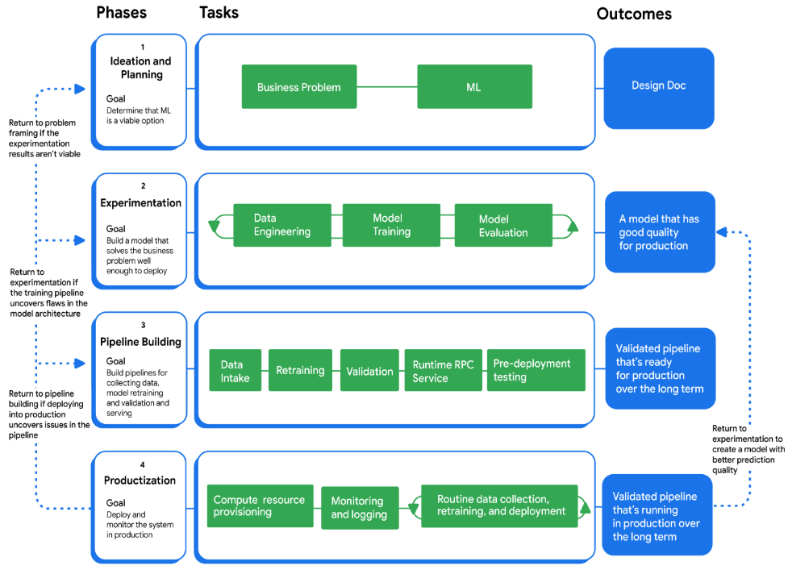
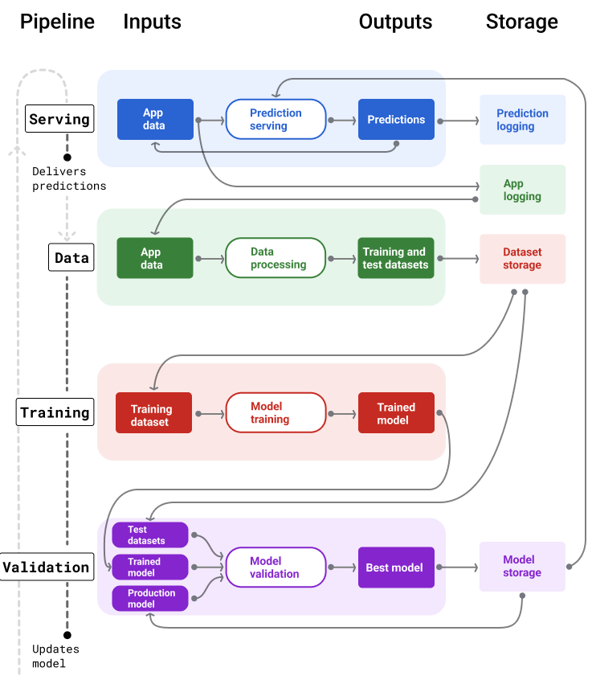
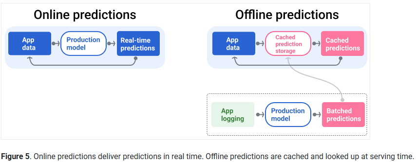

### End-to-end ML workflow

 

1. Ideation and planning

    **Goal**: To determine if ML is the best solution to your problem.
    
    **Tasks**: Analyze the business problem to understand your project's constraints and requirements 
        
     - it can take a long time to understand the data and metrics required for a production-ready system.

    **Outcome**: A design doc outlining how to solve a problem with a ML solution to communicate on dependencies and set the stakeholders' expectations. 

2. Experimentation

    **Goal**: To build a model that solves the business problem.
    
    **Tasks**: Experiment with features, hyperparameters, and model architectures.

    **Outcome**: A model with good enough quality to put into production.

    - new-to-ML practitioners often underestimate the challenges of designing and implementing the appropriate experimentation tooling and processes.

3. Pipeline building and productionization

    **Goal**: To build and implement the infrastructure for scaling, monitoring, and maintaining models in production.
    
    **Tasks**: Build pipelines to automate many of the tasks (data processing, model training & serving) for keeping up-to-date models in production.

    **Outcome**: Validated ML pipelines.

#### Working with stakeholders

ML projects projects require **early and consistent** collaboration with stakeholders who have varying levels of involvement and expectations. 

As early as possible, do the following:
- Define the expected deliverables for each project phase
  - **Design doc**: explain the problem, proposed solution and potential risks. It functions as a way to receive feedback and address questions/concerns from the stakeholders.
  - **Experimental results**: communicate the outcomes from the experimental phase.
    - results from experiments with their hyperparameters and metrics
  - **Production-ready implementation**. A full pipeline for training and serving your model is the key deliverable. At this phase, create documentation for future engineers that explain modeling decisions, deployment and monitoring specifics, and data peculiarities.
- Establish clear communication channels and involve all necessary teams, including those requiring approval, for efficient project execution.
- Proactively communicate the **unique complexities and potential challenges** inherent in ML projects to manage stakeholder expectations and ensure project success.

#### Establish Team Practices thru Process Documentation

How to make SQL maintainable and reusable: DBT

How to set up model monitoring 

### Ideation and Planning

#### 1. Problem framing

  - State the business goal for the product you are developing or refactoring.
  - Determine whether the goal can be solved using predictive ML, generative AI, or a non-ML solution.
    - The non-ML solution is the benchmark you'll use to determine whether ML is a good use case for your problem.
    - Compare **quality, cost and maintenance** 
  - Frame the problem in ML terms
    - Define the ideal business outcome and the model's goal.
    - Identify the output you need from model
    - Define business and model metrics for success

#### 2. Feasibility Evaluation

  - Data availability
    - Verify you have the data required to train a model if you're using a predictive ML approach.
    - Consider **quantity, direct or proxy labels, feature availability at serving time, regulations on data usage**
  - Problem difficulty
    - Has a similar problem already been solved? 
    - Is the nature of the problem difficult? Any human benchmarks for the task
    - Are there potentially bad actors to exploit or misuse the model?
  - Prediction quality
    - How would the model predictions impact your users? What's the cost of making mistakes? i.e. fraud detection vs recommendation system
  - Technical requirements
    - Latency: How fast do predictions need to be served?
    - Queries per second (QPS). What are the QPS requirements?
    - RAM usage. What are the RAM requirements for training and serving?
    - Platform. Where will the model run: Online (queries sent to RPC server), WebML (inside a web browser), ODML (on a phone or tablet), or offline (predictions saved in a table)?
    - Retraining frequency
    - Interpretability. Will predictions need to be interpretable? 
  - Cost
    - Human costs: how many people for how long
    - Machine costs: compute and memory requirements, GPU quota if needed
    - Inference cost: Will the model need to make real-time inferences that cost more than the revenue generated?

#### 3. Project planning

  ML projects are characteristically non-linear and have varying degrees of uncertainty, which makes planning hard. They require an **iterative approach** and an **experimental mindset**.

  Recommended strategies for planning ML work:
  - **Time box the work**: Set clear timeframes to complete tasks or attempt a particular solution. i.e. allocate 2 weeks to get the data / try a simple model / try a neural net. at the end of each timeframe you will have more info to determine if continuing to apply resources is worthwhile.
  - **Scope down the project requirements and make iterative improvements**: If an ML solution appears promising but isn't a critical feature for your product or service, scope back its requirements. i.e. start with some simple solution for this quarter, and make incremental improvements over a longer time horizon to reach impactful solutions.
  - **Intern or new hire project**: Directing and guiding an intern or a new hire to attempt an ML solution can be a good way to begin exploring a new space with unknown outcomes. 

  With any strategy, it's wise to fail fast. Attempt approaches with the lowest costs, but potentially the highest payoff, first.

### Experimentation

- **Determine baseline performance**. Start by establishing a baseline metric. The baseline acts as a measuring stick to compare experiments against.
- **Make single, small changes.** Make only a single, small change at a time, for example, to the hyperparameters, architecture, or features. If the change improves the model, that model's metrics become the new baseline to compare future experiments against.
- **Record the progress of the experiments.** 
  
  It's crucial to track all experimental results, including unsuccessful ones, to understand which approaches work and which don't.

- Teams should **establish clear experimentation practices**, including defining artifacts, coding standards, reproducibility measures, and tracking methods.
- Plan for **handling wrong predictions** early on, potentially by incorporating user feedback for model improvement.
- Consider **building parts of the final pipeline** alongside experimentation to facilitate a smoother transition to production.

### Pipeline Building

 

At a very general level, here's how the pipelines keep a fresh model in production:

1. First, a model goes into production, and the **serving pipeline** starts delivering predictions.
   
    

2. The **data pipeline** immediately begins collecting data to generate new training and test datasets.

3. Based on a schedule or a trigger, the **training and validation pipelines** train and validate a new model using the datasets generated by the data pipeline.

4. When the validation pipeline confirms the new model isn't worse than the production model, the new model gets deployed.

5. This process repeats continuously.

### Productionization

#### Provision compute resources for your pipelines (DevOps Team)

#### Implement logging, monitoring, and alerting

| Pipeline   | Monitor |
|------------|---------|
| **Serving** | • Skews or drifts in the serving data compared to the training data • Skews or drifts in predictions • Data type issues, like missing or corrupted values • Quota usage • Model quality metrics  **Note:** Calculating a production model's quality differs from training‑time evaluation. In production, you often lack ground truth, so you need custom monitoring metrics that act as proxies for quality (e.g., percentage of emails marked as spam). Monitoring changes in proxy metrics is usually more insightful than looking at raw numbers. |
| **Data** | • Skews and drifts in feature values • Skews and drifts in label values • Data type issues, like missing or corrupted values • Quota usage rate • Quota limit about to be reached |
| **Training** | • Training time • Training failures • Quota usage |
| **Validation** | • Skew or drift in the test datasets  • Model quality metrics|
