## Working with Numerical Data

### 1. Normalization

- Goal: transform features to be on a similar scale.
- Why
  - Helps models converge more quickly during training. When different features have different ranges, gradient descent can "bounce" and slow convergence. That said, more advanced optimizers like Adagrad and Adam protect against this problem by changing the effective learning rate over time.
  - Helps models infer better predictions. When different features have different ranges, the resulting model might make somewhat less useful predictions.
  - Helps avoid the "NaN trap" when feature values are very high. NaN is an abbreviation for not a number. When a value in a model exceeds the floating-point precision limit, the system sets the value to NaN instead of a number. When one number in the model becomes a NaN, other numbers in the model also eventually become a NaN.
  - Helps the model learn appropriate weights for each feature. Without feature scaling, the model pays too much attention to features with wide ranges and not enough attention to features with narrow ranges.

| **Normalization technique** | **Formula** | **When to use** | **Example** |
|-----------------------------|-------------|------------------| --|
| **Linear scaling (MinMaxScaler)** | $x' = \frac{x - x_{\min}}{x_{\max} - x_{\min}}$ | When the feature is mostly uniformly distributed across range. **Flat-shaped** | Age |
| **Z-score scaling (StandardScaler)** | $x' = \frac{x - \mu}{\sigma}$ | When the feature is normally distributed (peak close to mean) or somewhat normal within the bulk of its range. **Bell-shaped** | Net Worth |
| **Log scaling** | $x' = \log(x)$ | When the feature distribution is heavily right skewed and values are non-negative. **Heavy Tail-shaped** | Book Sales | 
| **RobustScaler**  | $x' = \frac{x-median}{IQR}$ | when the feature contains significant outliers that would otherwise skew the mean and std. | net worth |
| **Clipping** | If $x > \text{max}$, set $x' = \text{max}$ <br> If $x < \text{min}$, set $x' = \text{min}$ | When the feature contains extreme outliers. It can be combined with other methods like z-score scaling | Net Worth |
---

#### Playbook for L1 Logistic

For Logistic Regression with L1 (Lasso) regularization, normalization/transform choices matter a lot because L1 penalizes coefficients by magnitude. If features are on different scales, the penalty is effectively “uneven”.

| **Group** | **Skewness (asymmetry)** | **Excess Kurtosis (outlier-prone)** | **Non-Negative** | **Transform** | **Scaler** |
|-----------------------------|-------------|------------------| --|--| --|
| Near-normal / symmetric continuous features | [-1,1] | < 1 or 2 |  | None | ```StandardScaler```|
| Heavy tails/outliers but symmetric | [-1,1] | >=1 or 2 |  | None | ```RobustScaler```|
| Strong right-skewed, non-negative (counts, amounts) | >1 | Any | Yes | ```log1p``` | ```StandardScaler``` or ```RobustScaler``` (depends on kurtosis)  |
| Strong right-skewed with negatives  | >1 | Any | No | ```PowerTransformer(method="yeo-johnson")``` | ```StandardScaler``` or ```RobustScaler``` (depends on kurtosis)  |
| Strong left-skewed  | <-1 | Any | Any | ```PowerTransformer(method="yeo-johnson")``` | ```StandardScaler``` or ```RobustScaler``` (depends on kurtosis)  |


- **Why Log transform**: log compresses extremes, makes the feature “more linear” in log-odds, and reduces coefficient instability.

- **Why Yeo–Johnson**: Yeo–Johnson is a strong default because it works with negatives and often improves linear separability for logistic regression.

### 2. Binning (or Bucketing)

- Goal: group different numerical subranges into bins or buckets.

- Binning is a good alternative to scaling or clipping when either of the following conditions is met:
  - The overall **linear relationship between the feature and the label is weak** or nonexistent.
  - When the feature values are clustered.

- Example: number of shoppers (label) vs temprature (feature)

  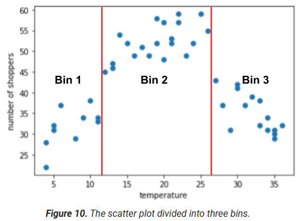   

  | Bin Number | Range | Feature Vector |
  |-----------------------------|-------------|------------------|
  | 1 | 4-11 | [1, 0, 0] |
  | 2 | 12-26 | [0, 1, 0] |
  | 3 | 27-36 | [0, 0, 1] |

- Determining the number of bins
  - A model can only learn the association between a bin and a label if there are **enough examples in that bin**.
  - Binning increases the number of features through one-hot encoding

- **Quantile Bucketing**: creates bucketing boundaries such that number of examples in each bucket is exactly or nearly equal. 

  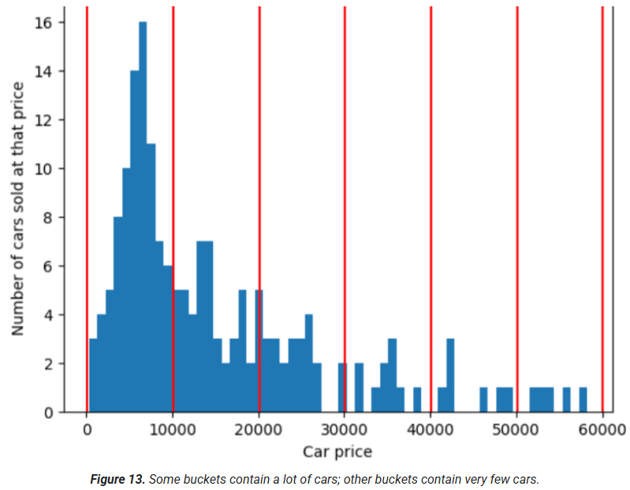 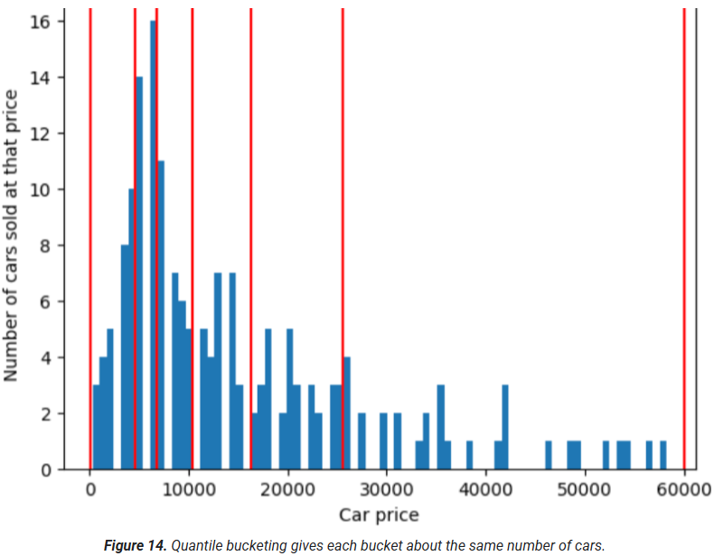 

  Equal intervals vs Quantiles:
  - Bucketing with equal intervals works for many data distributions. For **skewed data**, however, try quantile bucketing. 
  - Equal intervals give extra information space to the long tail while compacting the large torso into a single bucket. 
  - Quantile buckets give extra information space to the large torso while compacting the long tail into a single bucket.
  
### 3. Scrubbing

Like sorting good apples from bad, ML engineers spend significant time cleaning data by removing or fixing bad examples to improve dataset quality.

You can use programs or scripts to identify and handle any of these common data problems:
- **omitted values**
- **duplicate examples**
- **out-of-range values**
- **Bad labels**: i.e. A human evaluator mislabels a picture of an oak tree as a maple.
  
  &rarr; Once detected, you typically "fix" examples that contain bad features or bad labels by removing them from the dataset or imputing their values. 

  &rarr; When labels are generated by multiple people, we recommend statistically determining whether each rater generated equivalent sets of labels. Perhaps one rater was a harsher grader than the other raters or used a different set of grading criteria?

#### Qualities of good numerical features

- **Clearly named**: Each feature should have a clear, sensible, and obvious meaning to any human on the project.
- **Checked and tested for bad data or outliers**
- **Imputation with sensible values**: avoiding "magic values" that create discontinuities; instead, use separate boolean features or new discrete values to indicate missing data.

  Example: 
  - Not Recommended: impute missing watch time as -1 and let the model confuse what that means to watch a movie backwards in time
  - Recommended: impute the missing watch time as 0, create a boolean feature is_watch_time_in_seconds_defined that indicates whether watch time value is supplied

### 4. Polynomial transforms

Polynomial transforms involve raising an existing feature to a power, often informed by domain knowledge, such as physical laws involving squared terms.

**Synthetic features**, created using polynomial transforms, enable linear models to represent non-linear relationships by introducing new features based on existing ones.

If you transform a feature in a way that changes its scale, you should consider experimenting with normalizing it as well. Normalizing after transforming might make the model perform better. 

## Working with Categorical Data

Categorical data has a specific set of possible values. For example:
- The different species of animals in a national park
- The names of streets in a particular city
- Whether or not an email is spam
- The colors that house exteriors are painted
- Binned numbers
  
**Encoding** means converting categorical or other data to numerical vectors that a model can train on. This conversion is necessary because models can only train on floating-point values; models can't train on strings such as "dog" or "maple". 

### Low number of categories

#### 1. One-hot encoding
Each category is represented by a vector (array) of N elements, where N is the number of categories. 

Exactly one of the elements in a one-hot vector has the value 1.0; all the remaining elements have the value 0.0.

```python
skleran.preprocessing.OneHotEncoder(min_frequency=0.01, sparse_output=False)  # bucket needs to have at least 1% of sample
```

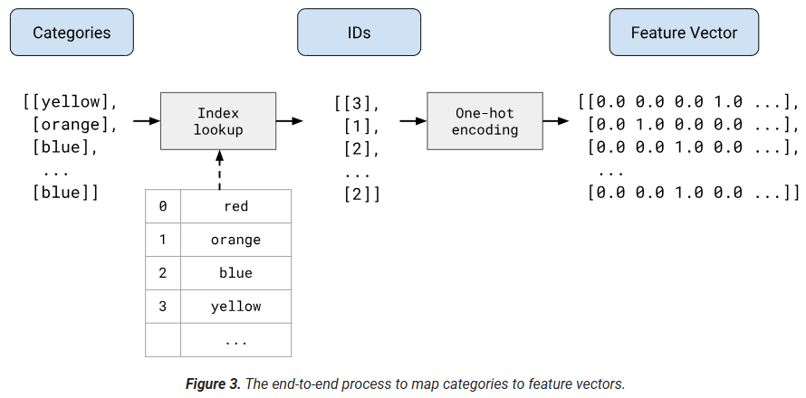

- **Sparse representation**

  Categorical features are usually sparse features whose values are predominately zero or empty. 

  Sparse representation means storing only the position(s) of nonzero elements in a sparse feature. 
  
  i.e. the one-hot vector for "Blue" is: ```[0, 0, 1, 0, 0, 0, 0, 0]```. The sparse representation for the preceding one-hot vector is: ```2```, which consumes far less memory than the eight-element one-hot vector. 

  You shouldn't pass a sparse representation as a direct feature input to a model. Instead, you should convert the sparse representation into a one-hot representation before training on it.

- **Multi-hot encoding**: multiple values can be 1.0. The sparse representation of a multi-hot encoding stores the positions of all the nonzero elements. For example, the sparse representation of a car that is both "Blue" and "Black" is 2, 5.

- Outliers in categorical data

   Lump the rare outliers into a single "catch-all" category called **out-of-vocabulary (OOV)**. In other words, all the outliers are binned into a single outlier bucket. The system learns a single weight for that outlier bucket.

#### 2. Target Encoding (Mean Encoding)

Replace category with the average target value for that category. 

**Cross validation is a must to prevent from target leakage**. Data is split into K folds, and the target mean for a category in a specific fold is computed using only data from remaining K-1 folds. It ensures each row's encoding excludes its own target value.

It requires **smoothing** which mixes the global target mean with the target mean conditioned on the value of the category.

```python
skleran.preprocessing.TargetEncoder(smooth='auto', cv=5)  # bucket needs to have at least 1% of sample
```

#### 3. Weight of Evidence Encoding (WoE)

Weight of Evidence (WoE) is a supervised encoding method used mainly in **credit risk modeling** and **logistic regression** and binary classification in general.

It converts a categorical (or binned numerical) feature into a continuous number that reflects how strongly each category is associated with the positive vs negative class (binary classification).

WoE measures how strongly a category separates the two classes:

- Good outcome (e.g., non‑default)
- Bad outcome (e.g., default)

Each category is encoded by comparing the proportion of goods in that category vs
the proportion of bads in that category.

This comparison is expressed as a **log‑odds ratio**.

**Formula**: For a category i, $\text{WoE}_i=$ = $\ln($ % Good Outcomes / % Bad Outcomes $)$ 

**Interpretation**:

| WoE value        | Meaning |
|------------------|---------|
| WoE > 0          | Category is associated with more bads (higher risk) |
| WoE = 0          | Category has no discriminatory power |
| WoE < 0          | Category is associated with more goods (lower risk) |
| Larger \|WoE\|   | Stronger predictive signal |

Relationship to **Information Value (IV)**:
- WoE is often used with Information Value (IV), which measures a feature’s overall predictive power.
- $IV=\sum($ % of non-events $-$ % of events $)$ $\times WOE$
  
  | IV        | Predictive Power Rule of Thumb|
  |------------------|---------|
  | $<0.02$       | unpredictive / useless |
  | $0.02 - 0.1$     | Weak |
  | $0.1 - 0.3$        | Medium |
  | $>0.5$   | Strong |

```python
from category_encoders.woe import WOEEncoder

from sklearn.pipeline import Pipeline
from sklearn.linear_model import LogisticRegression

# Note: WOEEncoder() doesn't support cv internally. It has to be passed as part of model pipeline for CV evaluation during param tuning and model iterations.

preprocess = ColumnTransformer(
    transformers=[
        ("woe",WOEEncoder(
                cols=cat_cols,
                smoothing=0.5,
                handle_unknown="value",
                handle_missing="value"
            ),
            cat_cols),
        ("num",
            StandardScaler(),
            num_cols)
    ],
    remainder="drop"   # explicit is better than implicit
)

pipe = Pipeline([
    ("preprocess", preprocess),
    ("model", LogisticRegression(max_iter=1000))
])

# For scoring, refit on full training data and save the pipeline
pipe.fit(X_train, y_train)
joblib.dump(pipe, "credit_model_pipeline.joblib")
```

Pros:
- Unlike one‑hot encoding, WoE produces a single numeric column, avoiding multicollinearity.
- Works for Categorical and Numerical Features (binning is critical)
- Feature value interpretation: 
  - Higher WoE → higher risk contribution
  - Lower WoE → safer segment
Cons:
- zero count problem: If a category has zero goods or bads WoE becomes infinite.
  - Fixes: merge rare categories, laplace smoothing (add small constants)

Replace category with its count or proportion.

### Embeddings (high-dimensional categorical features)

Some categorical features have a high number of dimensions, such as words in english with ~500K categories, us postal codes with 42K categories, last names in Germany with 850K values.

**Embeddings** substantially reduce the number of dimensions, which benefits models in two important ways:

- The model typically trains faster.
- The built model typically infers predictions more quickly. That is, the model has lower latency.

#### 2.1 Common issues with categorical data

Unlike Numerical data which is often recorded by scientific instruments, Categorical data, on the other hand, is often categorized by human or by ML models. Who decides on categories and labels, and how they make those decisions, affects the reliability and usefulness of that data.

- Human-labeled data, known as "gold labels," is generally preferred for training due to its higher quality, but it's essential to check for human errors and biases.

  **Inter-rater agreement**: the difference between human raters' decisions, measured by the following ways:
  - Cohen's kappa and variants
  - Intra-class correlation (ICC)
  - Krippendorff's alpha

- Machine-labeled data, or "silver labels," can introduce biases or inaccuracies, necessitating careful quality checks and awareness of potential common-sense violations.
- Pitfalls of sparse data representations
  - **Number of weights**. Large input vectors mean a huge number of weights for a neural network. With M entries in your one-hot encoding, and N nodes in the first layer of the network after the input, the model has to train MxN weights for that layer.
  - **Number of datapoints**. The more weights in your model, the more data you need to train effectively.
  - **Amount of computation**. The more weights, the more computation required to train and use the model. It's easy to exceed the capabilities of your hardware.
  - **Amount of memory**. The more weights in your model, the more memory that is needed on the accelerators that train and serve it. Scaling this up efficiently is very difficult.
  - **Difficulty of supporting on-device machine learning (ODML)**. If you're hoping to run your ML model on local devices (as opposed to serving them), you'll need to be focused on making your model smaller, and will want to decrease the number of weights.

  &rarr; High-dimensionality in categorical data increases training complexity and costs, leading to techniques like embeddings for dimensionality reduction.

#### 2.2 Embedding space

Embeddings are low-dimensional representations of high-dimensional data, often used to capture semantic relationships between items.

Embeddings place similar items closer together in the embedding space, allowing for efficient machine learning on large datasets.

The distance between points in an embedding space represents the relative similarity between the corresponding items.

#### 2.3 Real-world embedding spaces

Real-world embeddings are d-dimensional (For word embeddings, d is often 256, 512, or 1024), can encode complex relationships, like those between countries and their capitals, allowing models to detect patterns.

Embeddings will usually be specific to the task, and differ from each other when the task differs.


#### 2.4 Obtaining embeddings

Embeddings can be created using dimensionality reduction techniques like PCA or by training them as part of a neural network.

**Training an embedding within a neural network** allows customization for specific tasks, where the embedding layer learns optimal weights to represent data in a lower-dimensional space.

- In general, you can create a hidden layer of size d in your neural network that is designated as the embedding layer, where d represents both the number of nodes in the hidden layer and the number of dimensions in the embedding space. 
- This embedding layer can be combined with any other features and hidden layers. 

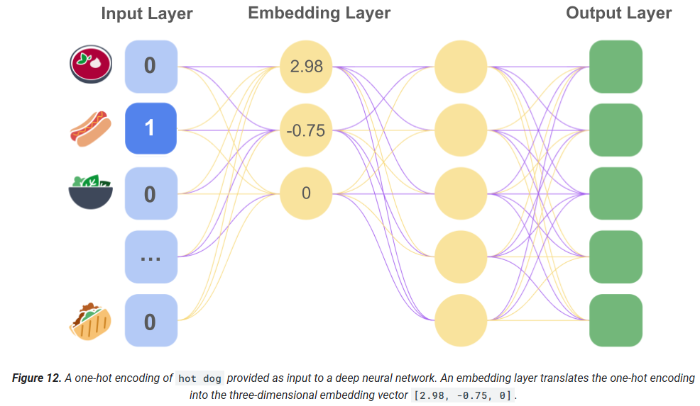


#### 2.5 Static embeddings

While embeddings differ from task to task, one task has some general applicability: predicting the context of a word. Models trained to predict the context of a word assume that words appearing in similar contexts are semantically related. It turns out that embeddings based on semantic similarity work well for many general language tasks.

**word2vec** trains on a corpus of documents to obtain a single global embedding per word regardless of contexts. When each word or data point has a single embedding vector, this is called a **static embedding**. One limitation of it is that words can mean different things in different contexts.

#### 2.6 Contextual embeddings

Contextual embeddings allow a word to be represented by multiple embeddings that incorporate information about the surrounding words as well as the word itself.

Models that create contextual embeddings (one vector per word per sentence):

- **ELMo** models: the static embedding is aggregated with embeddings taken from other layers, which encode front-to-back and back-to-front readings of the sentence.
- **BERT** models mask part of the sequence that the model takes as input.
- **Transformer** models use a self-attention layer to weight the relevance of the other words in a sequence to each individual word. They also add the relevant column from a positional embedding matrix (see positional encoding) to each previously learned token embedding, element by element, to produce the input embedding that is fed into the rest of the model for inference. This input embedding, unique to each distinct textual sequence, is a contextual embedding.

### 3. Feature crosses

Feature crosses are created by crossing (taking the Cartesian product of) two or more categorical or bucketed features of the dataset to capture interactions and nonlinearities within a dataset.

Feature crosses can be particularly effective when guided by domain expertise, but using neural networks can automate the process of discovering valuable combinations.

Overuse of feature crosses with sparse features should be avoided, as it can lead to excessive sparsity in the resulting feature set.

## Handling Datasets

### 1. Proxy Labels
- **Direct labels**, which are labels identical to the prediction your model is trying to make.
- **Proxy labels**, which are labels that are similar—but not identical—to the prediction your model is trying to make. For example, a person subscribing to Bicycle Bizarre magazine probably—but not definitely—owns a bicycle.

### 2. Dividing the dataset

Most common practice is to split into 3 subsets:
- A training set that the model trains on.
- A test set for evaluation of the trained model.
- A validation set performs the initial testing on the model as it is being trained.

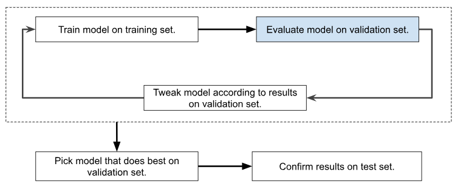

Use the validation set to evaluate results from the training set. After repeated use of the validation set suggests that your model is making good predictions, use the test set to double-check your model.

Note: test sets and validation sets still "wear out" with repeated use. That is, the more you use the same data to make decisions about hyperparameter settings or other model improvements, the less confidence that the model will make good predictions on new data. For this reason, it's a good idea to collect more data to "refresh" the test set and validation set. Starting anew is a great reset.

In summary, a good test set or validation set meets all of the following criteria:
- Large enough to yield statistically significant testing results.
- Representative of the dataset as a whole. In other words, don't pick a test set with different characteristics than the training set.
- Representative of the real-world data that the model will encounter as part of its business purpose.
- Zero examples duplicated in the training set.

In practice, for a small dataset, using **cross-validation** would be preferable as it would compute more accurate evaluation metric values.

### 3. Class imbalance

Imbalanced datasets occur when one label (majority class) is significantly more frequent than another (minority class), potentially hindering model training on the minority class.

Accuracy is usually a poor metric for assessing a model trained on a class-imbalanced dataset.

  | Imbalance Ratio | Event Rate | Typical Risk | Solution | 
  |-----------------------------|-------------|------------------| ----------|
  | < 3:1 | Mild: 25-50% | Accuracy looks good but recall/precision is off; Decision threshold is suboptimal | Use the right metrics and tune the decision threshold 
  | 3-10:1 | Moderate: 10-25%, segment prediction | loss favors majority, minority gradients get washed out (poor recall) | class weighted loss, optinoally light undersampling
  | 10-50:1 | High: 2-10%, conversion / churn modeling | Model ignores minority | 1) must-have class weights or custom loss, 2) resampling to 5-10:1, 3) tree based models
  | > 50:1 | Severe: <2%, Rare adversarial event like fraud | Class collapse, it's detection problem not classificaction | reframe problem, two-stage models, hard negative mining

As imbalance increases, you should move away from pure classification.

#### Data-level Techniques
- **Undersample** the majority (preferred)
  - When to use: huge dataset and majority class dominates (comuptational inefficiency).
  - Risk: losing important majority class information.
  
  ```python
  from imblearn.under_sampling import RandomUnderSampler
  sampler = RandomUnderSampler(sampling_strategy=0.1, random_state=42, replacement=False) # 1:10 minority: majority
  ```
- **Oversample** the minority: random, SMOTE, etc.
  - When to use: you have too few minority samples.
  - SMOTE (Synthetic Minority Over-sampling Technique): Creates synthetic samples by interpolating between close minority points.
    - rarely recommended: amplify noise, only used when minority class is well-clustered
  
  - Risk: overfitting if synthetic samples are too similar.
- Sampling should happen **after** train-test split and only to training data.

#### Loss-level Techniques
- **Class weighting**: assign different penalities to minority / majority samples in loss function
  - When to use
    - it is cost sensitive (fraud, safety, medical): false negatives >> false positives
    - you need probabilistic outputs: preserve true data distribution compared to resampling methods
    - dataset is not huge (can afford full data)
  - Common **two-step technique** for huge data:
    - Step 1: Undersample the majority in training only
      -  downsampling improves the batch training stability and efficiency, at a cost of introducing a **prediction bias** by showing the model an artificial world where the classes are more balanced than in the real world.
    - Step 2: Upweight the majority class to correct the bias
      - w_majority = 1/sampling_rate; w_minority = 1
      - This means treating the loss on a majority class example more harshly than the loss on a minority class example 
- **Specialized loss functions**
  - **Focal loss** (popular in DL): dynamically downweights easy majority examples and focuses on hard minority ones based on model confidence
    - When to use: high or severe imbalance (<10%), easy examples can dominate gradients.

#### Model-level Techniques

- **Tree-based models** are robust to imbalance - Why?
  - Split criterion is local
    - Tree splits try to optimize impurity reduction (Gini, entropy or loss) and impurity is computed **locally within a node** instead of across the full dataset.
  - Rare classes can still "win" the splits if they are locally separable.
  - Ensemble method like boosting gives more attention to harder examples that are misclassified, like an implicit class weighting.

  Root cause: Tree models don't rely on gradient descents to incrementally update parameters and minimize the global loss. It is free from the problem of majority examples dominating the gradients.

- **Two-stage models**: reframe the problem as ranking / filtering instead of classification


#### Evaluation-level Techniques

- Do NOT use accuracy
- Use these instead:
  - Precision
  - Recall
  - F1-score
  - ROC-AUC (good for global performance)
  - PR-AUC (Precision-Recall AUC) ← BEST when extreme imbalance
  - Confusion matrix

### 4. Feature Selection

#### Univariate Feature Selection

1. Variance Threshold: Removes features with very low variance.
    - ```sklearn.feature_selection.VarianceThreshold(threshold=0.0)```
2. **Chi-Square Test**: Measures dependence between a categorical feature and a categorical target
     - Tests whether observed frequencies differ from expected frequencies
     - Assumes: 
       - Large enough sample size; 
       - Features only in **Non‑negative integer** values (i.e. boolean or frequency).
     - ```sklearn.feature_selection.chi2```


3. ANOVA F-test: Compares the means of a numeric feature across classes.
     - Tests whether at least one class mean differs significantly
     - Assumptions: 
       - Normally distributed features (approximate)
       - Homogeneity of variances (less strict in practice)
     - ```from sklearn.feature_selection import f_classif, f_regression```

Even if we set a low per‑test error rate (e.g. α = 0.05), testing many features independently causes the total number and probability of false positives to grow quickly.

Example: among 10K features with a significance level of 0.05, expect ~500 false positives.

&rarr; Choose appropriate selection criteria based on how p-values are controlled for multiple testing.

- ```SelectFpr(score_func=f_classif, alpha=0.05)```: 
  - Select features where p_value< alpha
  - Controls the FPR per test, equivalent to no multiple-testing correction.
  - Most lenient, good for exploratory analysis
- ```SelectFdr(score_func=f_classif, alpha=0.05)``` - False Discovery Rate (Benjamini–Hochberg): 
  - Controls the **expected proportion of false positives among selected features**.
  - Selection criteria: $E[$ false positives/selected features $]<=\alpha$
  - Among selected features, at most $\alpha$ are false positives.
  - Scales well to high-dimensional data (text, geomics). Best suited when you want many features but controlled noise.
- ```SelectFwe(score_func=f_classif, alpha=0.05)``` - **Family-Wise Error Rate (Bonferroni)**:
  - Controls the probability of at least one false positive
  - Selection criteria: $p < \alpha/N$ where N is the number of features.
  - This means the probability of any false positive is <=$\alpha$.
  - Very conservative, low statistical power, might be suited for scientific or regulatory settings.


## Model Generalization

### 1. Overfitting

Overfitting occurs when a model performs well on training data but poorly on new, unseen data.

A model is considered to generalize well if it accurately predicts on new data, indicating it hasn't overfit.

Overfitting can be detected by observing diverging loss curves for training and validation sets on a generalization curve:

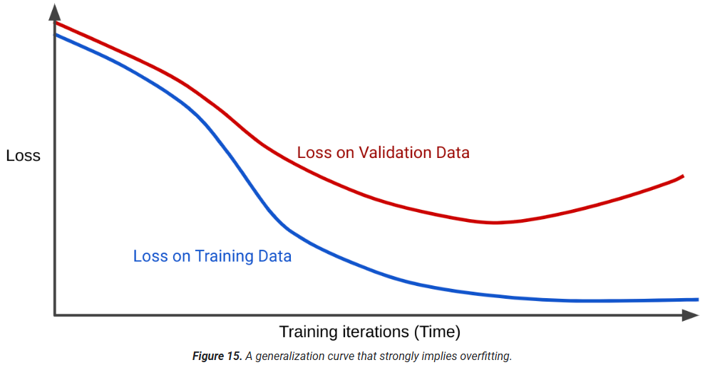

Very broadly speaking, overfitting is caused by one or both of the following problems:
- The training set **doesn't adequately represent** real life data (or the validation set or test set).
- The model is **too complex**.

#### Generalization conditions

Training a model that generalizes well implies the following dataset conditions:
- Examples must be **independently and identically distributed**, which is a fancy way of saying that your examples **can't influence each other**.
- The dataset is **stationary**, meaning the dataset doesn't change significantly over time.
- The dataset partitions have the **same distribution**. That is, the examples in the training set are statistically similar to the examples in the validation set, test set, and real-world data.

#### Common Issues in loss curves

1. Oscillating loss curve

    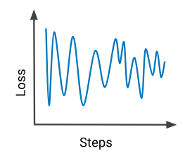

    How to fix:
    - Reduce the learning rate when debugging a training problem.
    - Check the data against a data schema to detect bad examples and remove them from training.
    - Reduce the training set to a tiny number of trustworthy examples, and gradually add more to discover which examples cause the loss to oscillate.

2. Loss curve with a sharp jump

    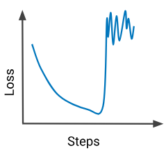

    Possible reasons:
    - The input data contains one or more NaNs—for example, a value caused by a division by zero.
    - Sometimes, due to improper shuffling of batches, a batch might contain a lot of outliers.

3. Test loss diverges from training loss

    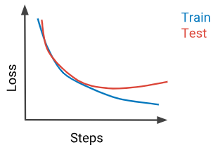

    The model is overfitting the training set. Possible solutions:
    - Make the model simpler by reducing the number of features.
    - Increase the regularization rate
    - Ensure the training and test set are statistically equivalent.

4. Loss curve gets stuck

    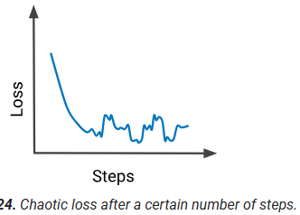

    The training set is not shuffled well. For example, a training set that contains 100 images of dogs followed by 100 images of cats may cause loss to oscillate as the model trains. Ensure that you shuffle examples sufficiently.

### 2. Model Complexity

Simpler models often generalize better to new data than complex models, even if they perform slightly worse on training data.

Bias-variance trade-off:

- Bias: error from a model being too simple (underfitting). It misses patterns in the data
- Variance: error from a model being too complex and sensitive to noise (overfitting).

As model complexity increases, bias decreases but variance increases.
Good models find the sweet spot that minimizes total error.

#### Complexity-based Regularization

**Regularization** techniques help prevent overfitting by **penalizing model complexity** during training. 

There are two common ways to quantify model complexity:

- **L1 Regularition (Lasso penalty)**: penalizes weights in proportion to the **sum of the absolute value** of the weights. 
  
  - Added term: $\lambda \sum_j |\theta_j|$ 
  - Drive the weights of irrelevant or barely relevant features to exactly 0, effectively removing features from the model.
  
  &rarr; “Make the model simpler by zeroing out unimportant features.”
- **L2 Regularition (Ridge penalty)**: penalizes weights in proportion to the **sum of the squares** of the weights. 

  - Added term: $\lambda \sum_j \theta_j^2$
  
  - Shrink outlier weights (those with high positive or low negative values) closer to 0 but not quite to 0. Features with values very close to 0 remain in the model but don't influence the model's prediction very much.
  
  &rarr; “Keep all features but shrink their influence.”

#### Early stopping: an alternative regularization

It doesn't involve a calculation of complexity. It simply means ending training before the model fully converges to prevent overfitting.

For example, you end training when the loss curve for the validation set starts to increase (slope becomes positive). Although early stopping usually increases training loss, it can decrease test loss.

#### Regularization in Tree-based Models


### 3. ML Fairness

#### Bias Prevention

- **Training data representation**: does it represent real-world prevalence to avoid bias? Data skew, where certain groups are under- or over-represented, can introduce bias and should be addressed.
- **Missing feature values** and unexpected outliers: certain key characteristics of your dataset are missing not at random and under-represented.

- **Removal of sensitive features**: protected classes like gender, race, marital status etc.

#### Bias Evaluation

Aggregate model performance metrics like precision, recall, and accuracy can hide biases against minority groups. Fairness in model evaluation involves ensuring equitable outcomes across different demographic groups.

Fairness Metrics:
- **Demographic parity**: promotes equal representation across demographic groups. 
  i.e. equal admission rate across race irregardless of different qualification prevalence. 
  
  It does not take the distribution of ground truths for each demographic group into consideration.
  - Disparate Impact: $\frac{P(\hat{Y} = 1 \mid D = \text{group 1})}{P(\hat{Y} = 1 \mid D = \text{group 2})}$
  - Statistical Parity: $P(\hat{Y} = 1 \mid D = \text{group 1}) - P(\hat{Y} = 1 \mid D = \text{group 2})$

- **Equal Opportunity**: ensure model is equally successful at predicting the preferred label across groups. i.e. qualified individuals have an equal chance of being accepted, regardless of their demographic group.

  It is the TPR Difference between groups: $P(\hat{Y} = 1 \mid Y=1, D = \text{group 1}) - P(\hat{Y} = 1 \mid Y=1, D = \text{group 2})$

  It focuses on error rates for a single class and thus is designed for use cases where there is a clear-cut preferred label. 
  
  If it's equally important that the model predict both the positive class ("qualified for admission") and negative class ("not qualified for admission") for all demographic groups, it may make sense to instead use the metric **equalized odds**, which enforces both **true positive rate** (TP/P) and **false negative rate** (FN/P) should be the same for all groups.

- **Counterfactual fairness**: identify individual-level biases, by comparing predictions for similar individuals, differing only in a sensitive attribute like demographic group.

  Particularly useful when datasets lack complete demographic information for all examples but contain it for a subset.

- **Probablistic Fairness w/o sensitive classes**

  **Core problem**: How can we measure racial bias in a model when we don’t know people’s race?

  **What we know**: 
  - Zip code is a weak hint (“proxy”) for race, giving a probabilistic clue of racial composition.
  - The model’s performance (e.g., TPR, FPR) can be averaged inside each zip code
  
  **Core assumption**: The performance measure in a zip code is roughly the weighted average of the performance for each racial group, using the zip code’s racial proportions.

  **The model**: run a simple regression where

  - X = racial composition of the zip code (e.g., % White)
  - Y = model metric for the zip code (e.g., TPR)

  This regression estimates how the model metric changes as the racial makeup changes. The coefficients are estimated racial disparity on model metrics (e.g., difference in TPR between White and Non‑White borrowers).

  - WOLS is used instead of plain OLS so that:
    - zip codes with more people count more
    - zip codes with few people don’t distort the results

  **Summary**: The method estimates race bias by regressing model performance metrics (TPR, FNR etc) against the racial makeup of each zip code, using zip-code-level averages and census proportions to infer how the model treats different racial groups—even without individual race labels.


#### Bias Mitigation Techniques

- **Augmenting the training data**: collecting additional data to address missing, incorrect, or skewed data. but it can be infeasible due to data availability or resource constraints.
- **Adjusting the model's loss function**
  - **MinDiff** aims to balance the errors for two different slices of data (male/female students versus nonbinary students) by adding a penalty for differences in the prediction distributions for the two groups.
  - **Counterfactual Logit Pairing (CLP)** aims to ensure that changing a sensitive attribute of a given example doesn't alter the model's prediction for that example. i.e. if two examples have identical feature values except for gender, CLP will penalize the discrepancies in their predictions.
  
  &rarr; MinDiff addresses bias by aligning score distributions for two subgroups. CLP tackles bias by ensuring that individual examples are not treated differently solely because of their subgroup membership.