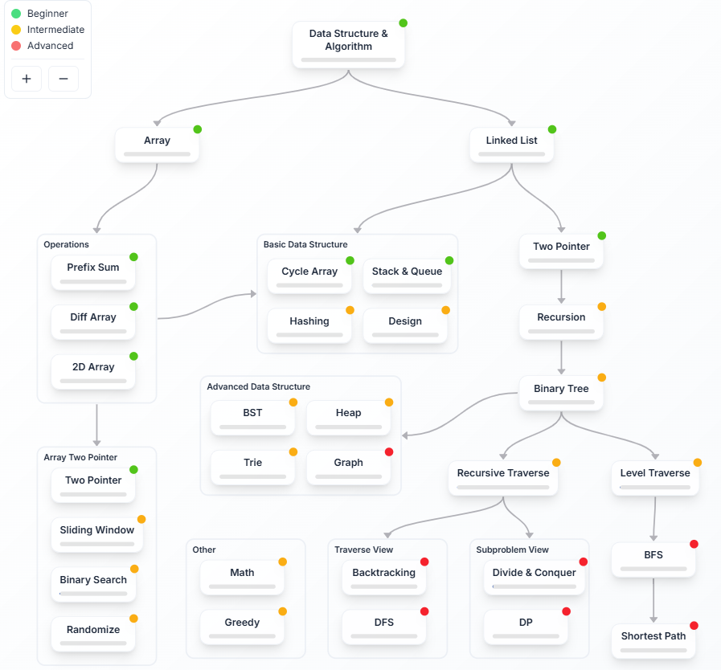
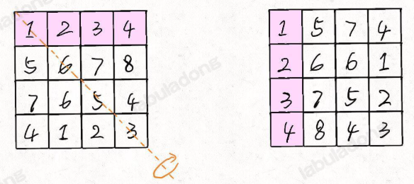
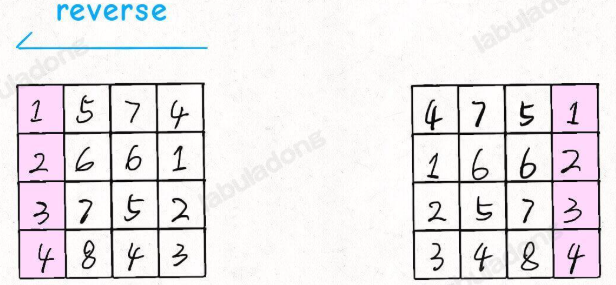
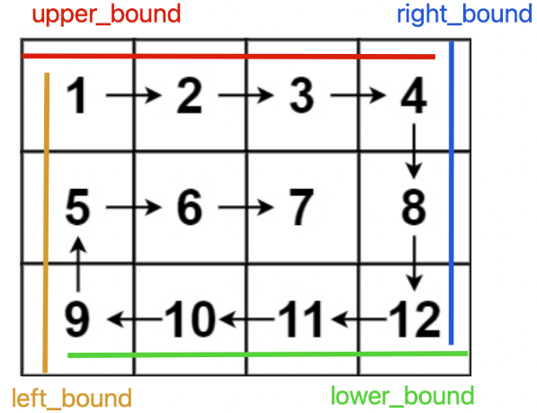
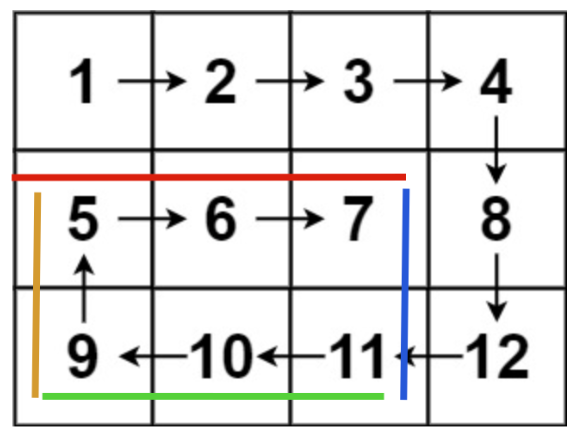

### Roadmap


## Prefix Sum

Computational method used to speed up queries about the sum of elements within any range of an array. The core idea is a space-for-time tradeoff: by spending linear time to pre-process an array, you can answer subsequent range sum queries in constant time.

#### Key Considersations

1. Initialize the prefix sum array with length n+1 and pad 0 at index 0
2. Develop the transition equation (simplified form of DP)

- ID Array

```Python
class NumArray:
    # 前缀和数组
    def __init__(self, nums: List[int]):
        # 输入一个数组，构造前缀和
        # preSum[0] = 0，便于计算累加和
        self.preSum = [0] * (len(nums) + 1)
        # 计算 nums 的累加和
        for i in range(1, len(self.preSum)):
            self.preSum[i] = self.preSum[i - 1] + nums[i - 1]

    # 查询闭区间 [left, right] 的累加和
    def sumRange(self, left: int, right: int) -> int:
        return self.preSum[right + 1] - self.preSum[left]

```

- 2D Array

```Python
class NumMatrix:
    # preSum[i][j] 记录矩阵 [0, 0, i-1, j-1] 的元素和
    def __init__(self, matrix: List[List[int]]):
        m = len(matrix)
        n = len(matrix[0])
        if m == 0 or n == 0:
            return
        # 构造前缀和矩阵
        self.preSum = [[0] * (n + 1) for _ in range(m + 1)]
        for i in range(1, m + 1):
            for j in range(1, n + 1):
                # 计算每个矩阵 [0, 0, i, j] 的元素和
                self.preSum[i][j] = (self.preSum[i - 1][j] + self.preSum[i][j - 1] +
                                     matrix[i - 1][j - 1] - self.preSum[i - 1][j - 1])

    # 计算子矩阵 [x1, y1, x2, y2] 的元素和
    def sumRegion(self, x1: int, y1: int, x2: int, y2: int) -> int:
        # 目标矩阵之和由四个相邻矩阵运算获得
        return (self.preSum[x2 + 1][y2 + 1] - self.preSum[x1][y2 + 1] -
                self.preSum[x2 + 1][y1] + self.preSum[x1][y1])

```

#### Limitations of Prefix Sum

1. The prefix sum technique assumes the original array nums is **immutable**.

    If an element in the original array changes, the values in the preSum array that come after it become invalid. You would need to re-calculate the preSum array, which takes \(O(n)\) time and offers no significant advantage over a standard brute-force solution.

2. The prefix sum technique **only applies to scenarios with an inverse operation**. i.e. from x+6=10 we know x=10-6; or from x*6=12 then x=12/6. In some scenarios i.e. max(x,8)=8 we cannot derive x.

To solve both of these problems, you need a more advanced data structure. The most common solution is a **segment tree**.

#### Problem Type 1 - Prefix Sum

[304. Range Sum Query 2D - Immutable](https://leetcode.com/problems/range-sum-query-2d-immutable/description/)

#### Problem Type 2 - Prefix Product

[238. Product of Array Except Self](https://leetcode.com/problems/product-of-array-except-self/description/)

[1352. Product of the Last K Numbers](https://leetcode.com/problems/product-of-the-last-k-numbers/description/)

#### Problem Type 3 - Prefix Sum + Hashmap

Use prefix sum + hashmap when you need to:
- Find subarrays/intervals fulfilling a target sum/property
- Do it in linear time
- Require instant lookup of previous sums/first positions

[525. Contiguous Array](https://leetcode.com/problems/contiguous-array/description/)

[560. Subarray Sum Equals K](https://leetcode.com/problems/subarray-sum-equals-k/description/)

[974. Subarray Sums Divisible by K](https://leetcode.com/problems/subarray-sums-divisible-by-k/description/)


### Difference Array

The Prefix Sum Technique is mainly used when the **original array does not change**, and you need to quickly find the sum of any interval. 

Another technique, Difference Array, is mainly used when you need to **frequently increase or decrease the values in a range** of the original array.

#### Intuition

Instead of modifying every single element in a given range, which is O(N), we can **build a diff array** just like the prefix sum using a preSum array. The diff array will record only the changes at the beginning and end of each range. This enables quick increase/decrease over a range of elements.

#### How it Works

1. **Create the difference array**: First, create a new array, diff, of the same size as the original array, but initialized with zeros.
   
    

   ```Python
   diff = [0] * len(nums)
    # Construct the difference array
    diff[0] = nums[0]
    for i in range(1, len(nums)):
        diff[i] = nums[i] - nums[i - 1]
   ```
2. **Mark the boundaries**: For each range update operation (e.g., adding a value v to all elements from index l to r):
    1. Add v to diff[i] to mark the beginning of the change. ```diff[l]+=v```
    2. Subtract v from diff[r+1] to "cancel out" the effect of the update after the range ends. ```diff[r+1]-=v```
    3. If r+1 is outside the array bounds, this step can be skipped.

    

    ```Python
    def increment(i: int, j: int, val: int) -> None:
        self.diff[i] += val
        if j + 1 < len(self.diff):
            self.diff[j + 1] -= val
   ```
3. **Compute the final array**: After all range updates have been applied to the diff array, compute its prefix sum. The prefix sum of the diff array gives you the final, updated version of the original array.

    ```Python
    res = [0] * len(diff)
    # construct the result array based on the difference array
    res[0] = diff[0]
    for i in range(1, len(diff)):
        res[i] = res[i - 1] + diff[i]
   ```
#### Problem Variation

[1094. Car Pooling](https://leetcode.com/problems/car-pooling/description/)

## Tricks to Traverse 1D/2D Array

#### Reverse 1D Array

 ```Python
# reverse a list with extra O(N) space
mylist = mylist[::-1] 

# reverse a list in place
 def reverse(s: list, l, r):
     while l<r:
         s[l], s[r] = s[r], s[l]
         l+=1
         r-=1
```
[151. Reverse Words in a String](https://leetcode.com/problems/reverse-words-in-a-string/)


#### Rotate Matrix Clockwise/Counterclockwise

- Clockwise 90-degree rotation for **square matrix** using linear algebra

    Transpose and then reflect:

     
      
- Counterclockwise 90-degree rotation: **Reflect and then transpose**

- Non-square matrices cannot be rotated in place as its shape change from (m,n) to (n,m).

[48. Rotate Image](https://leetcode.com/problems/rotate-image/description/)

#### Spiral Traversal of a Matrix

Key idea: 
- Follow the order of right-down-left-up to traverse the matrix
- Define and shrink the boundaries of untraversed region with variables.

 
  

[54. Spiral Matrix](https://leetcode.com/problems/spiral-matrix/)


## Two Pointer Techniques

In arrays, there are no actual pointers, but we can treat indices as pointers in an array. This allows us to apply the two-pointer technique to arrays as well.

The left-right pointers move toward each other or away from each other; the fast-slow pointers move in the same direction, with one moving faster than the other.

### Fast-slow pointers

#### 1. in-place array modification

- Iterate through the array with the fast pointer and check the element at the fast pointer's position
- Pass valid elements to the slow pointer's position and increment the slow pointer by 1 to prepare for the next valid element.

   ```Python
    def removeElement(self, nums: List[int], val: int) -> int:
        fast, slow = 0, 0
        while fast < len(nums): # iteration of fast pointer to the end
            if nums[fast] != val: # find valid element
                nums[slow] = nums[fast] # can be in-place copy / swap
                slow += 1
            fast += 1
        return slow
  ```
[26. Remove Duplicates from Sorted Array](https://leetcode.com/problems/remove-duplicates-from-sorted-array/)

[80. Remove Duplicates from Sorted Array II](https://leetcode.com/problems/remove-duplicates-from-sorted-array-ii/description/)

[88. Merge Sorted Array](https://leetcode.com/problems/merge-sorted-array/)

#### 2. Sliding Window

### Left-right pointers


[977. Squares of a Sorted Array](https://leetcode.com/problems/squares-of-a-sorted-array/description/)


#### 1. Binary Search


#### 2. nSum Problem

[167. Two Sum II - Input Array Is Sorted](https://leetcode.com/problems/two-sum-ii-input-array-is-sorted/description/)

#### 3. Reversing an Array


#### 4. Palindrome Check

[5. Longest Palindromic Substring](https://leetcode.com/problems/longest-palindromic-substring/description/)
