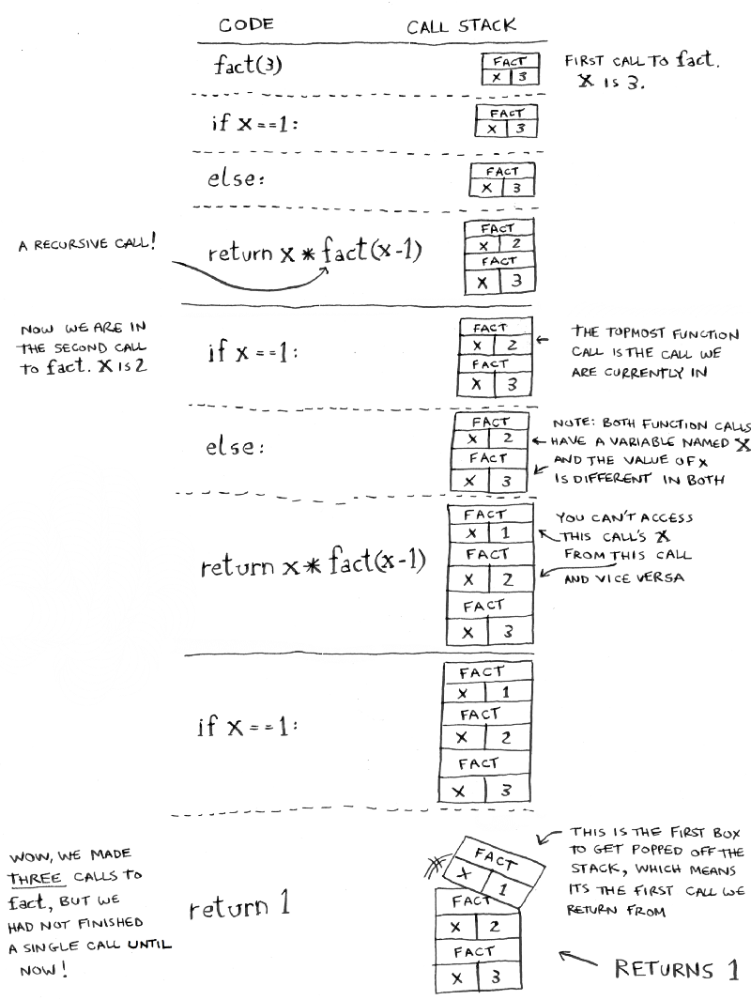
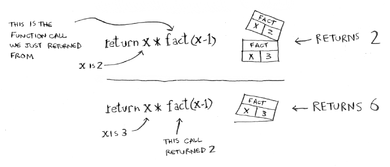
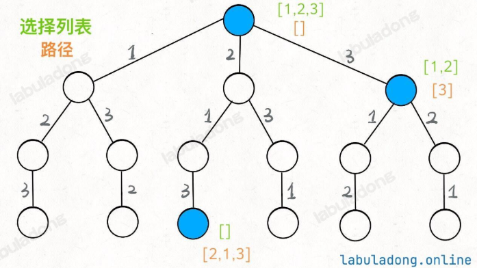
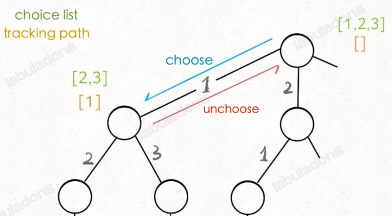
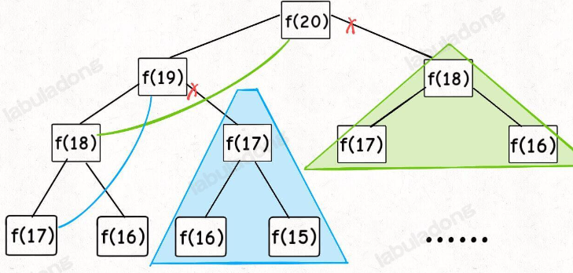
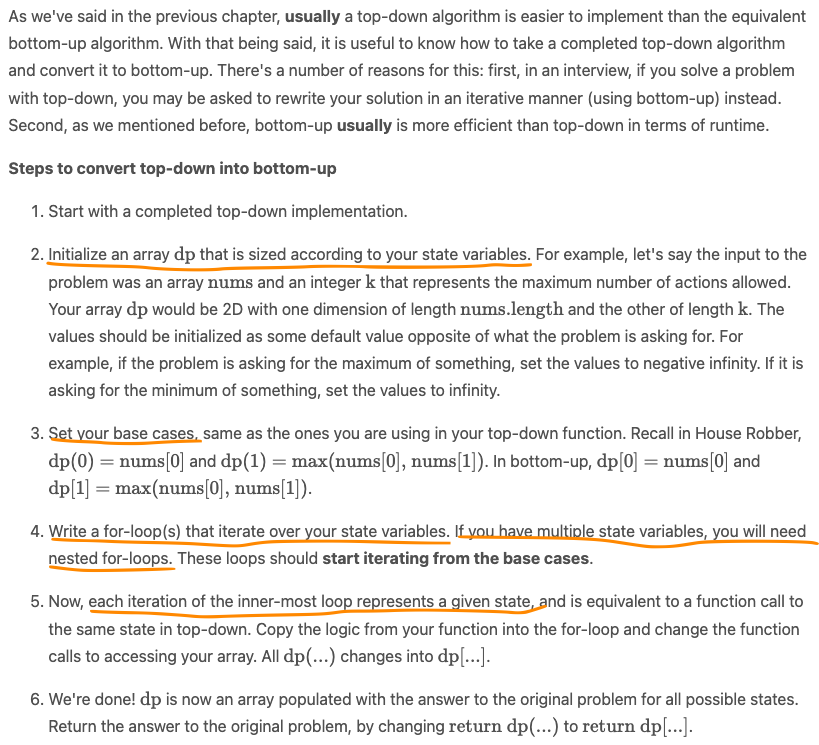
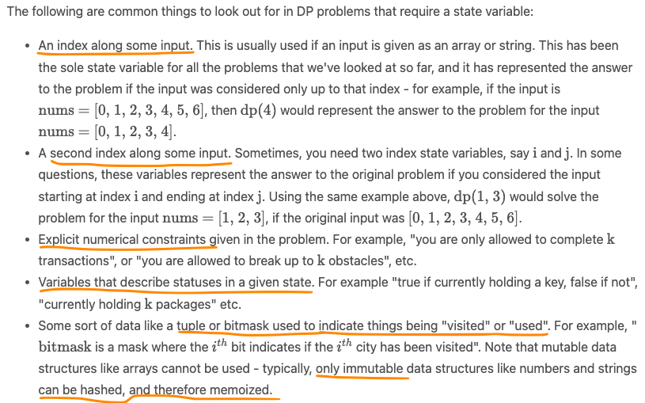
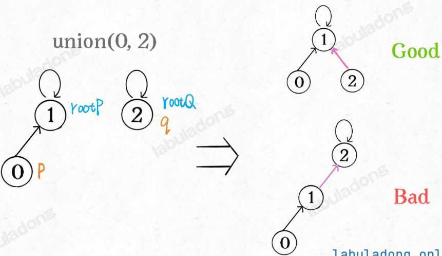
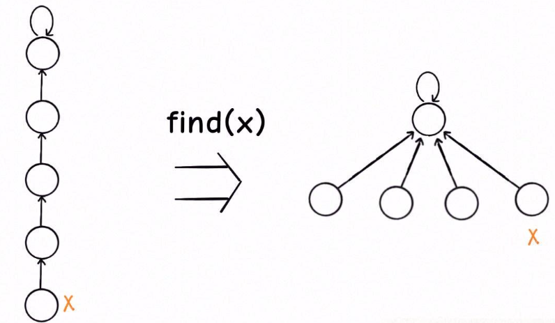

### 1. Foundamental Ideas

- All data structures are transformations of arrays (sequential storage) and linked lists (linked storage).

- The key aspects of data structures are traversal and access, which include basic operations like addition, deletion, search, and modification.

- All algorithms are based on exhaustive search.

- The key to exhaustive search is no omissions and no redundancies. Mastering the algorithm framework ensures no omissions; effectively utilizing information ensures no redundancies.

#### 1.1 Storage Methods of Data Structures

There are only two storage methods for data structures: arrays (sequential storage) and linked lists (linked storage).

**Queues and stacks** can be implemented using either linked lists or arrays. Using arrays requires handling resizing issues; using linked lists avoids this but requires more memory space to store node pointers.

The two storage methods for **graph structures** are adjacency lists and adjacency matrices. An adjacency list is essentially a linked list, and an adjacency matrix is a two-dimensional array. 

A **hash table** maps keys into a large array using a hash function. To resolve hash collisions, the 
chaining method employs linked list characteristics, making operations simple but requiring additional space for pointers. The linear probing method utilizes array characteristics for continuous addressing, eliminating the need for pointer storage but making operations slightly more complex.

In tree structures, an array-based implementation is a "heap", as a heap is a complete binary tree. Using arrays for storage eliminates the need for node pointers, and operations are relatively simple, as seen in applications like binary heaps. More common tree structures (incomplete trees) use a linked list-based implementation.

#### 1.2 Basic Operations of Data Structures

For any data structure, its basic operations are simply traversal + access, which can be further detailed as: add, delete, search, and update.

From a high-level perspective, there are only two forms of traversal + access for various data structures: linear and non-linear. Linear traversal is typically represented by for/while iteration, while non-linear traversal is represented by recursion. 

- Array traversal

```Python
def traverse(arr: List[int]):
    for i in range(len(arr)):
        # iterate over arr[i]
```

- Linked list traversal

```Python
class ListNode:
    def __init__(self, val):
        self.val = val
        self.next = None

def traverse(head: ListNode):
  # initialize the pointer for loop below
  p = head
  while p is not None:
    # iteratively access p.val
    p = p.next

def traverse(head: ListNode):
  # recursively access head.val
  traverse(head.next)
```

- Binary tree traversal

```Python
class TreeNode:
    def __init__(self, val=0, left=None, right=None):
        self.val = val
        self.left = left
        self.right = right

def traverse(root: TreeNode):
  traverse(root.left)
  traverse(root.right)
```
- N-ary tree traversal / Graph traversal

```Python
class TreeNode:
    def __init__(self, val=0, children=None):
        self.val = val
        self.children = List[TreeNode]

def traverse(root: TreeNode):
  for child in root.children:
    traverse(child)
```

#### 1.3 Recursion

"Loops may achieve a performance gain for your program. Recursion may achieve a performance gain for your programmer." There's no performance benefit to using recursion. Loops are sometimes better for performance.

Recursion is when a function calls itself. Every recursive function has **two cases: the base case and the recursive case**. The base case is when the function doesn't call itself  so it doesn't go into an infinite loop.

A stack is a simple data structure with only two actions: push and pop. Push is to add a new item to the top, and pop is to remove the topmost item and read it. 

In the context of calling a function, computers use a stack internally called the **call stack** to save variables for nested function calls. When you call a function from another function, the 2nd function call is placed on top of the call stack and the 1st function is paused in a partially completed state. All the varibles for the 1st function are still stored in memory. You return back to the 1st function after you're done with the 2nd function call (it is poped out of the call stack).

The call stack can get very large and takes up too much memory. At that point, you can rewrite your code to use a loop instead. Or consider advanced techniques like tail recursion.

A resursive example:
```Python
def fact(x):
    if x ==1:
        return 1
    else:
        return x*fact(x-1)

fact(3)
```




### 2. Overview of Double-Pointer Techniques

Whenever you have a sorted array, you should think of the two-pointer technique.

- Fast-slow pointers for linked lists
   1. Merge/split linked lists
   2. Find the k-th node in a singly linked list
   3. Detecting cycles or interactions


- Fast-slow pointers for arrays
    1. In-place array modification: remove duplicates, remove elements, move zeros, etc.
    2. Sliding window: mainly used to solve subarray problems, such as finding the longest/shortest subarray that meets a specific condition.

- Common techniques using Left amd Right Pointers 
  1. Binary search: finding a target in an array; finding the left/right bound of the target.
  2. Sum of n numbers: sort the array, use left/right pointers to get the sum, recursion on n-1 sum.
  3. Reverse array
  4. Palindrome check: A palindrome is a string that reads the same forwards and backwards. It's closely related to the concept of left-right pointers. In the palindromic substring problem, the pointers can expand outwards from the center. 

### 3. Binary Search

Applicable problems: finding a target in an array; finding the left/right bound of the target.

#### 3.1 Binary Search Framework

- when calculating mid, we need to prevent overflow. left + (right-left) //2, instead of (left + right)//2.
- Pay attention to the two versions of "search interval" and the termination condition of the while loop. 
  - Initialized right = len(nums)-1 determines:
    - a closed interval [left, right]
    - **while left <= right** terminates when left> right, that is, the search interval [right+1, right] being empty.
    - update left = mid + 1, right = mid - 1. Because the new search intervals are [left, mid-1] and [mid+1, right] 
  - Initialized right = len(nums), which is not a valid index, determines:
    -  an open interval [left, right)  
    - **while left < right** terminate when left = right, that is, the search interval [left, left) being empty.
    - update left = mid+1, right = mid. Because the new search intervals are [left, mid) and [mid+1, right)
- Notice the scenario when the target is not found. Add checks for nums[left] == target and index validity to return -1 when necessary.

```Python
# Find a number: closed interval version
def binarysearch(nums, target):
  left, right = 0, len(nums)-1

  while left <= right:
    mid = left + (right-left)//2
    if nums[mid]==target:
      return mid
    elif nums[mid] > target:
      right = mid-1
    elif nums[mid] < target:
      left = mid+1

# Find a number: open interval version
def binarysearch(nums, target):
  left, right = 0, len(nums)

  while left < right:
    mid = left + (right-left)//2
    if nums[mid]==target:
      return mid
    elif nums[mid] > target:
      right = mid
    elif nums[mid] < target:
      left = mid+1
```

#### 3.2 Binary search for the left boundary

If target does not exist, the binary search for the left boundary returns the smallest index greater than target. For example, given nums = [2,3,5,7] and target = 4, the left_bound function returns 2, because the element 5 is the smallest element greater than 4.

```Python
def left_bound(nums, target):
  left, right = 0, len(nums)-1

  while left <= right:
    mid = left + (right-left)//2
    if nums[mid] == target:
      # target exists, narrow the right boundary
      right = mid - 1
    elif nums[mid] > target:
      right = mid - 1
    elif nums[mid] < target:
      left = mid + 1
  
  # check if the target exists:
  # 1) if out of bound, target doesn't exist
  if left < 0 or left >= len(nums):
      return -1
  # 2) if nums[left] is target
  if nums[left] == target:
    return left
  else:
    return -1

```

#### 3.3 Binary search for the right boundary

If target does not exist, the binary search for the right boundary returns the largest index that is less than target. For instance, if nums = [2,3,5,7] and target = 4, the right_bound function returns 1 because the element 3 is the largest element less than 4.

```Python
def right_bound(nums, target):
  left, right = 0, len(nums)-1

  while left <= right:
    mid = left + (right-left)//2
    if nums[mid] == target:
      # target exists, narrow the left boundary
      left = mid + 1
    elif nums[mid] > target:
      right = mid - 1
    elif nums[mid] < target:
      left = mid + 1

  # while loop ends when left = right+1 = mid + 1. right bound should be left-1 = right.
  if right <0 or right>=len(nums):
    return -1
  
  return right if nums[right]== target else -1
```
### 4. Backtracking

#### 4.1 What is the backtracking algorithm? 

Abstractly speaking, solving a backtracking problem is actually the process of traversing a decision tree, where each leaf node contains a valid answer. If you **traverse the whole tree and collect the answers at the leaf nodes**, you will get all valid solutions.

At any node in the backtracking tree, you only need to consider three things:

1. **Path**: the choices you have already made.
2. **Choice List**: the choices you can make at this point.
3. **End Condition**: the condition for reaching the bottom of the decision tree where you cannot make any more choices.

The general framework for backtracking in code is as follows:

```Python
result = []
def backtrack(path, choices):
    if end condition is met:
        # add the entire path to the results at the end 
        result.add(path)
        return
    
    for choice in choices:
        ### make a choice: record the path, and update choice set (if needed)
        path.add(choice) # record the path
        
        backtrack(path, choices)
        # undo choice: reset the path and choice set as needed
        path.pop()
```

The core concept is **recursion within a for loop, making a choice before the recursive call and undoing the choice after the call**. It is quite simple. 

- Permutation problem as an example

  Backtracking can be used to explore all possible permutation of numbers [1,2,3]:

  

  The backtrack function we define acts like a pointer, traversing this tree while correctly maintaining each node's attributes. When it reaches a leaf node, the **"path" constitutes a permutation**.

  Notice that the pre and post-order actions in backtracking algorithm are **inside** the for loop. This is one difference from DFS. By making a choice before the recursive call and undoing it afterward, we can correctly manage the choice list and path for each node.

   

#### 4.2 Difference with Dynamic Programming

Both dynamic programming and backtracking algorithms abstract problems into tree structures at their core and traverse with recursion, but their approaches are entirely different:

- Recursion Function

  - In backtracking, we **traverse the binary tree once to get the answer**. As a result the function signature ```backtrack()``` generally acts as a pointer and has no return value. We rely on updating external variables to compute results.
  - In dynamic programming, we **decompose the problem to calculate the answer**. As such, the function signature  ```dp()``` usually has a return value, which is the result of the sub-problem's computation.

- High Time Complexity

  Backtracking algorithm is **purely brute-force enumeration, generally with high complexity**. In the permutation example, the  time complexity cannot be lower than O(N!) because exhaustive traversal of the entire decision tree is unavoidable. In the end, you must enumerate N! permutation results.
  
  This is different from dynamic programming, which can be optimized through solving overlapping subproblems.

#### 4.3 Difference with DFS

Backtracking algorithm and the commonly mentioned DFS (Depth-First Search) algorithm can basically be considered the same: they are both used as a traversal pointer and do not return values. That is, ```return``` is just to end the recursion and we use external variables to record results.

 **Their difference is only in the details**:

- The difference is about **whether "make a choice" and "undo a choice" are inside or outside the for loop**. In DFS, it is outside. In backtracking, it is inside.

- Why is there this difference? We need to understand it together with the binary tree structure. DP, DFS, and backtracking can all be seen as extensions of binary tree problems. The difference is what they focus on:
  - Dynamic Programming (DP) is about breaking down problems (divide and conquer). It focuses on the return value of the **"subtree"**. It is optimized with memorization.
  - Backtracking is about traversal. It focuses on the **"branches" between nodes**.
  - DFS is also about traversal. It focuses on **one "node" at a time**.

```Python
# The DFS algorithm puts the logic of "making a choice" and "undoing a choice" outside the for loop
def dfs(root):
    if root is None:
        return 
    # make a choice
    print("enter node %s" % root)
    for child in root.children:
        dfs(child)
    # undo a choice
    print("leave node %s" % root)

# The backtracking algorithm puts the logic of "making a choice" and "undoing a choice" inside the for loop
def backtrack(root):
    if root is None:
        return
    for child in root.children:
        # make a choice
        print("I'm on the branch from %s to %s" % (root, child))
        backtrack(child)
        # undo a choice
        print("I'll leave the branch from %s to %s" % (child, root))
```


### 5. Dynamic Programming

#### 5.1 DP Overview
Dynamic Programming (DP) is a programming paradigm that can systematically and efficiently explore all possible solutions to a problem. As such, it is capable of solving a wide variety of problems that often have the following characteristics:

- The problem can be broken down into "**overlapping subproblems**" - smaller versions of the original problem that are re-used multiple times.
- The problem has an "**optimal substructure**" - an optimal solution can be formed from optimal solutions to the overlapping subproblems of the original problem.

Using Fibonacci sequence as an example, If you wanted to find the n-th Fibonacci number F(n), you can break it down into smaller subproblems - find 
F(n−1) and F(n−2) instead. Then, adding the solutions to these subproblems together gives the answer to the original question, F(n−1)+F(n−2)=F(n), which means the problem has **optimal substructure**, since a solution F(n) to the original problem can be formed from the solutions to the subproblems. 
These subproblems are also **overlapping** - for example, we would need F(4) to calculate both F(5) and F(6).

#### Comparison with Divide and Conquer

In contrast, greedy problems have optimal substructure, but not overlapping subproblems. **Divide and conquer algorithms break a problem into subproblems, but these subproblems are independent of one another and not overlapping** (which is why DP and divide and conquer are commonly mistaken for one another).
So generally speaking, divide and conquer approaches can be parallelized while dynamic programming approaches cannot be (easily) parallelized. 

DP not only aids us in solving complex problems, but it also greatly improves the time complexity compared to brute force solutions. For example, the brute force solution for calculating the Fibonacci sequence has exponential time complexity, while the dynamic programming solution will have linear time complexity because it reuses the results of subproblems rather than recalculating the results for previously seen subproblems. 

#### 5.2 Two ways of implememtation: Bottom-up (tabulation), top-down (memoization)

1. Bottom-up (tabulation) is implemented with iteration and starts at the base cases. 
   
2. Top-down is implemented with recursion and made efficient with memoization. To avoid duplicated calculation for overlapping subproblems, we store the result of a function call, usually in a hashmap or an array, so that when the same function call is made again, we can simply return the memorized result.

```Python
# Bottom-up starts at the base cases and use them to calculate further states
def fib(N: int) -> int:
    if N == 0:
        return 0
    dp = [0] * (N + 1)
    # base case
    dp[0] = 0
    dp[1] = 1
    # 状态转移
    for i in range(2, N + 1):
        dp[i] = dp[i - 1] + dp[i - 2]

    return dp[N]

# Top-down with memo

def fib(N: int) -> int:
    # 备忘录全初始化为 0
    memo = [0] * (N + 1)
    # 进行带备忘录的递归
    return dp(memo, N)

# 带着备忘录进行递归
def dp(memo: List[int], n: int) -> int:
    # base case
    if n == 0 or n == 1: 
      return n
    # 已经计算过，不用再计算了
    if memo[n] != 0: 
      return memo[n]
    memo[n] = dp(memo, n - 1) + dp(memo, n - 2)
    return memo[n]

```
#### Which is better?
Any DP algorithm can be implemented with either method, and there are reasons for choosing either over the other. However, each method has one main advantage that stands out:

- A bottom-up implementation's runtime is usually faster, as iteration does not have the overhead that recursion does.
- A top-down implementation is usually much easier to write. This is because with recursion, the ordering of subproblems does not matter, whereas with tabulation, we need to go through a logical ordering of solving subproblems.

When converting a top-down solution to a bottom-up solution, we can still use the same base case(s) and the same recurrence relation. However, bottom-up dynamic programming solutions iterate over all of the states (starting at the base case) such that all the results necessary to solve each subproblem for the current state have already been obtained before arriving at the current state. So, to convert a top-down solution into a bottom-up solution, we must first find a logical order in which to iterate over the states.

#### 5.3 When to use DP

- The first characteristic that is common in DP problems is that the problem will ask for the **optimum value (maximum or minimum) of something, or the number of ways there are to do something**. 

  - What is the minimum cost of doing...
  - What is the maximum profit from...
  - How many ways are there to do...
  - What is the longest possible...
  - Is it possible to reach a certain point...

But the above is not sufficient to tell if a problem should be solved with DP. The next characteristic will help us determine whether a problem should be solved using a greedy algorithm or dynamic programming. 

- The second characteristic that is common in DP problems is that **future "decisions" depend on earlier decisions**. 

Deciding to do something at one step may affect the ability to do something in a later step. This characteristic is what makes a greedy algorithm invalid for a DP problem - we need to factor in results from previous decisions.

In general, if the problem has constraints that cause decisions to affect other decisions, such as using one element prevents the usage of other elements, then we should consider using dynamic programming to solve the problem. 

#### 5.4 Framework for DP Problems

1. Define state variables: In a DP problem, a state is a set of variables that are relevant and can sufficiently describe a scenario. 
    
    i.e. For climbing stairs, the state variable would be the current step we are on.

2. Define a function (top-down recursive approach) or data structure (bottom-up iterative approach) that will compute the answer to the problem for every given state. 
    
    i.e. For climbing stairs, we can have a function dp(i) or an array dp[i] to return the number of ways to climb the i-th step.

3. Define a recurrence relation to transition between states. Notice the choices to make at each state and how to calculate target value under each choice.

    i.e. For climbing stairs, the number of ways we can climb to the i-th step is dp(i) = dp(i-1) + dp(i-2).

4. Define base cases, so that our recurrence relation doesn't go on infinitely.

    i.e. what would be the answer of dp(i) without using dynamic programming when i = 0, 1, 2.

```Python
# Top down memorization implementation
def climbStairs(n):
  def dp(i):
    """A function that returns the answer to the problem for a given state."""
    if i <=2:
      return i
    
    if i not in memo:
      memo[i] = dp(i-1) + dp(i-2)
    
    return memo[i]

  memo = {}
  return dp(n)

# Bottom up implementation

def climbStairs(n):

  if n == 1:
    return 1
  
  dp = (n+1) *[0]

  dp[1] = 1
  dp[2] = 2

  for i in range(3, n+1):
    dp[i] = dp[i-1] + dp[i-2]
  
  return dp[n]
```

#### Top-down and bottom-up conversion


#### 5.5 Multidimensional DP

The dimensions of a DP algorithm refer to the number of state variables used to define each state. Typically, the more dimensions a DP problem has, the more difficult it is to solve.



In problems where calculating a state is O(1), their time and space complexities are the same and directly tie to the number of states.

#### 5.6 Common Patterns in dp

- Iteration in the recurrence relation: Instead of choosing from a static number of options, we usually add a for-loop to iterate through a dynamic number of options and choose the best one.

[300. Longest Increasing Subsequence](https://leetcode.com/problems/longest-increasing-subsequence/description/)

[322. Coin Change](https://leetcode.com/problems/coin-change/description/)

- State transition by inaction: if we are trying to maximize or minimize a score for example, sometimes the best option is to "do nothing", which leads to two states having the same value. The actual recurrence relation would look something like 
dp(i, j) = max(dp(i - 1, j), ...).

[188. best-time-to-buy-and-sell-stock-iv](https://leetcode.com/problems/best-time-to-buy-and-sell-stock-iv/description/)

- State reduction: The best advice is to try and think if any of the state variables are related to each other, and if an equation can be created among them. If a problem does not require iteration, there is usually some form of state reduction possible.

- Improving space complexity: Whenever you notice that values calculated by a DP algorithm are only reused a few times and then never used again, try to see if you can save on space by replacing an array with some variables. A good first step for this is to look at the recurrence relation to see what previous states are used. For example, in Fibonacci, we only refer to the previous two states, so all results before 
n - 2 can be discarded.

- Counting DP: another common class of DP problems is to ask for the number of distinct ways to do sth. With counting DP, the recurrence relation typically just sums the results of multiple states together. 

[518. Coin Change II](https://leetcode.com/problems/coin-change-ii/description/)

#### 5.7 Kadane's algorithm

It is used to find the maximum sum subarray given an array of numbers in O(n) time and O(1) space. Its implementation is a very simple example of dynamic programming, and the efficiency of the algorithm allows it to be a powerful tool in some DP algorithms.

```Python
# Given an input array of numbers "nums"
def maxSubarraySum(nums):
  best = float('-inf')
  current = 0
  for num in nums:
    current = max(current + num, num)
    best = max(best, current)

  return best
```

[Best Time to Buy and Sell Stock (121)](https://leetcode.com/problems/best-time-to-buy-and-sell-stock/description/)

[Maximum Subarray (53)](https://leetcode.com/problems/maximum-sum-circular-subarray/description/)


### 6. Divide and Conquer (D&C)

D&C works by breaking down a problem into smaller and saller pieces. There are two steps: 1) Figure out the base case. 2) Divide or decrease your problem until it becomes the base case. If you are using D&C on a list, the base case is probably an empty array or an array with one element.

#### 6.1 Quicksort: an efficient sorting algorithm based on D&C


#### 6.2 Why O($n*log(n)$) for average case?

1. Each level of recursion requries scanning through all elements to place them in the correct subarray. Therefore partitioning step requires linear time O(n).
2. each function call split the array approximately in half, creating a tree structure of recursive calls with about log(n) levels. In other words, **the recursion depth (the height of the call stack) is O($log(n)$)**.
3. In total, time complexity is operations per level * number of levels.

| Variation |	Time Complexity | Space Complexity |
| -------- | ------- | ------- |
| Best Case |	O(n log n) |	O(log n) |
| Average Case |	O(n log n) |	O(log n) |
| Worst Case |	O(n^2) |	O(n) |

Space complexity is measured by the height of the call stack.

#### 6.3 Revisiting Big 0 notation

In practical applications constants in Big O could matter sometimes, i.e. when input sizes are relatively small or when algorithms in comparison have similar complexity. For instance, both merge sort and quicksort have O(n*log n) time complexity, but quicksort often outperforms due to a smaller constant factor (no need for extra memory allocation in place).

### 7. Graph Algorithms

#### 7.1 Union-Find

Union-Find algorithm is designed to solve "dynamic connectivity" problems. Simply put, dynamic connectivity means connecting nodes in a graph. It has three properties:
- Reflexivity: Node p is connected to itself.
- Symmetry: If node p is connected to q, then q is also connected to p.
- Transitivity: If node p is connected to q, and q is connected to r, then p is connected to r.

1. Naive Version of Union-Find with time complexity O(N):

```Python
class UF:
  # initialized such as all the nodes are disconnected
  def __init__(self, n: int):
      # 一开始互不连通
      self._count = n
      # 父节点指针初始指向自己
      self.parent = [i for i in range(n)]

  # Find the parent or root node of a node x
  def find(self, x):
      # 根节点的 parent[x] == x
      while self.parent[x] != x:
          x = self.parent[x]
      return x

  # connect two nodes
  def union(self, p, q):
      rootP = self.find(p)
      rootQ = self.find(q)
      if rootP == rootQ:
          return
      # 将两棵树合并为一棵
      self.parent[rootP] = rootQ
      # parent[rootQ] = rootP 也一样

      # 两个分量合二为一
      self._count -= 1

  # if two nodes share the same root node they are connected 
  def connected(self, p: int, q: int) -> bool:
      root_p = self.find(p)
      root_q = self.find(q)
      return root_p == root_q

```
The time complexity of Union-Find depends on the `find()` implementation, as `connected()` and `union()` both call it. The time complexity of `find()` essentially depends on the depth and the balance of the tree structure after union.

 

One option is to optimize the tree structure by tracking the depth of each subtree, so that it is balanced with a depth of around $log(N)$. 

Another more extreme option is called path compression.

- Path compression

  For dynamic connectivity problems, we often don't really care about the tree structures, but **only care about the root node**. This allows us to compress the tree depth to a constant of 1, letting the tree root to be the parent node of all the nodes. In this case, `find()` just takes O(1).

    

Optimized Union-Find algorithm with path compression:

```Python
class UF:
    # omit the same part .....

    # version 1: path compression to O(1) 
    def find(self, x: int) -> int:
        if self.parent[x] != x:
            self.parent[x] = self.find(self.parent[x])
        return self.parent[x]

    # version 2: path compression to a tree of depth 2 
    def find(self, x: int) -> int:
        while self.parent[x] != x:
          # move child node up by two levels
            self.parent[x] = self.parent[self.parent[x]]
        return self.parent[x]

```


#### 7.2 Weighted Graph and Dijkstra's algorithm

Breadth-first search is used to calculate the shortest path for an unweighted graph. Dijkstra's algorithm is used to calculate the **shortest path for a weighted graph**.

#### What is Dijkstra's algorithm?

Dijkstra's algorithm solves the shortest-path problem for any weighted, directed graph with non-negative weights.

- Four steps:
  1) Find the cheapest node you can get to at the least amount of cost
  2) check whether there's a cheaper path to the neighbors of that node. If so, update their costs (costs for all nodes are initialized as positive infinity).
  3) Repeat until you've done this for every node in the graph.
  4) Calculate the final path.


- Dijkstra's works only when all the weights are non-negative. This is to ensure that once a node has been visited, its optimal distance cannot be improved. This property is especially important to enable Dijkstra's algorithm to act in a greedy manner by always selecting the next most promising node.
  
- If you have negative weights, use the Bellman-Ford algorithm.

- depending on how it is implemented and what data structures are used, the time complexity is typically O(E*log(V)) which is competitive against other shortest path algorithms.

#### Implementation


