### 1. Big O Notation

Algorithm speed is not measured in seconds, but in growth of the number of operations. 

Big O notation is special notation that tells you how fast an algorithm is. It lets you compare the number of operations needed in the **worst case scenario**. 

Algorithm run times grow at different rates as the number of elements for operations increases. Here are 5 common big O run times:
- O(log n), also known as log time, example: binary search.
- O(n), also known as linear  time. Example: simple search.
- O(n*log n), example: a fast sorting algorithm, like quicksort
- O($n^2$), example: a slow sorting algorithm, like selection sort.
- O(n!), or factorial time. example: a really slow algorithm, like the traveling salesperson.

Constants in big O notation is ignored. For example, if an algorithm runtime takes $O(1/2*n^2)$ it will be just $O(n^2)$.


### 2. Array and Linked List

Using an array means all the items are stored contiguously in memory. With linked lists, Items can be anywhere in memory and each item stores the address of the next item in the list.

#### 2.1 Array (Sequential Storage)

A "static array" is a block of continuous memory space, and we can access the elements in this memory space through indexing. This is the original form of an array. "dynamic arrays" are built on top of static arrays by programming languages to make them easier to use. They add commonly used APIs such as push, insert, remove, etc. Languages like Python and JavaScript do not offer definitions for static arrays.

Array's superpower of "random access": Given any array index, I can directly obtain the corresponding element's value in O(1) time. This is because I can calculate the target element's memory address using the starting address and the index. The memory addressing time in computers can be considered O(1), so the time complexity for random access in arrays is O(1).

The primary functions of data structures are Create, Read, Update, and Delete (CRUD), and nothing else. Time complexities for operations on static arrays are as follows:

- Addition / Create:
  - Appending an element at the end: O(1).
  - Inserting an element in the middle (not at the end): O(N).
- Deletion:
  - Removing an element from the end: O(1).
  - Removing an element from the middle (not at the end): O(N).
- Access: Given a specific index, retrieving the value of the element at that index has a time complexity of O(1).
- Update: Given a specific index, modifying the value of the element at that index has a time complexity of O(1).

The underlying structure of dynamic arrays is still a static array, but it automatically handles resizing and encapsulates operations like adding, deleting, searching, and modifying, making it more convenient for us to use.

```Python
# create a dynamic array
# no need to explicitly specify the array size, it will automatically expand and shrink based on the actual number of stored elements
arr = []

for i in range(10):
    # append elements to the end, time complexity O(1)
    arr.append(i)

# insert elements in the middle, time complexity O(N)
# insert element 666 at index 2
arr.insert(2, 666)

# insert elements at the beginning, time complexity O(N)
arr.insert(0, -1)

# delete the last element, time complexity O(1)
arr.pop()

# delete elements in the middle, time complexity O(N)
# delete the element at index 2
arr.pop(2)

# query elements by index, time complexity O(1)
a = arr[0]

# modify elements by index, time complexity O(1)
arr[0] = 100

# find index by element value, time complexity O(N)
index = arr.index(666)
```
#### 2.2 Linked list (Chain Storage)

#### 2.2.1 Introduction
The elements of a linked list can be scattered throughout memory. Using next and prev pointers in each node, these scattered memory blocks are linked together to form a chain-like structure.

Pros: it improves memory utilization efficiency; nodes can be connected when needed and removed when not needed.

Cons: Since elements are not adjacent, if you want to access the 3rd element in a linked list, you have to start at the head node and follow the next pointers until you reach the 3rd node.


Below is an example of a singly linked list. Notice the last node always points to null, meaning there're no more reference nodes afterwards.

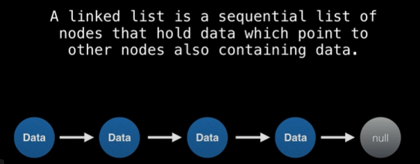

- Where are linked lists used?

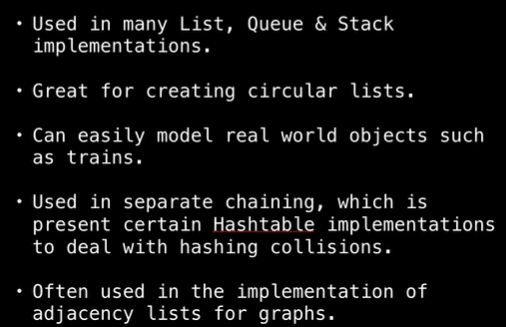

- Terminology

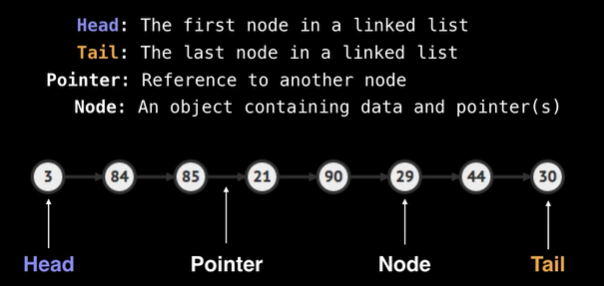
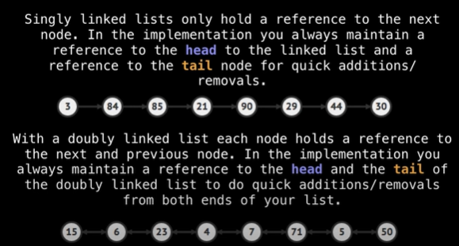

#### 2.2.2 Basic Operations of Singly Linked Lists

1. Create a singly linked list from an array

```Python
# singly linked list node
class ListNode:
    def __init__(self, x):
        self.val = x
        self.next = None

# input an array and convert it to a singly linked list
def createLinkedList(arr: 'list[int]') -> 'ListNode':
  if arr is None or len(arr) ==0:
    return None
  
  head = ListNode(arr[0])
  cur = head # traverse the linked list without losing reference to the head
  for i in range(1, len(arr)):
    cur.next = ListNode(arr[i]) # link the new element
    cur = cur.next # move pointer to the next node until finishing the entire list
  return head

```

2. Search / Modify the singly linked list

```Python
# create a singly linked list
head = createLinkedList([1, 2, 3, 4, 5])

# traverse the singly linked list
p = head
while p is not None:
  print(p.val)
  p = p.next
```

3. Inserting a new element at the head

```Python
newhead = ListNode(1)
newhead.next = head
head = newhead
```
4. Inserting a new element at the end
```Python
p = head
while p.next is not None:
  p = p.next
p.next = ListNode(6)
```
5. Inserting a new element in the middle: locate the predecessor node of the insertion position, then use this predecessor to insert

```Python
head = createLinkedList([1, 2, 3, 4, 5])

p = head
for i in range(2):
  p = p.next
new_node = ListNode(6)
new_node.next = p.next
p.next = new_mode
# now the linked list becomes 1 -> 2 -> 3 -> 6 -> 4 -> 5
```
6. Deleting a node: first locate the predecessor node and then set the next pointer to the node following the one to be deleted.

```Python
head = createLinkedList([1, 2, 3, 4, 5])

p = head
# to delete the 4th node
for i in range(2):
  p = p.next
p.next = p.next.next

# now the linked list becomes 1 -> 2 -> 3 -> 5
```
7. Deleting a node at the end
```Python
head = createLinkedList([1, 2, 3, 4, 5])

p = head
while p.next.next is not None:
  p = p.next
p.next = None

# now the linked list becomes 1 -> 2 -> 3 -> 4
```
8. Deleting a node at the head
```Python
head = createLinkedList([1, 2, 3, 4, 5])
head = head.next

# now the linked list becomes  2 -> 3 -> 4 -> 5
```
#### 2.2.3 Basic Operations of Doubly Linked Lists

1. Create a doubly linked list from an array

```Python
# doubly linked list node
class DoublyListNode:
    def __init__(self, x):
        self.val = x
        self.next = None
        self.prev= None

# input an array and convert it to a singly linked list
def createDoublyLinkedList(arr: 'list[int]') -> Optional[DoublyListNode]:
  if arr is None or len(arr) ==0:
    return None
  
  head = DoublyListNode(arr[0])
  cur = head # traverse the linked list without losing reference to the head

  for i in range(1, len(arr)):
    new_node = DoublyListNode(arr[i]) 
    cur.next = new_node 
    new_node.prev = cur 
  
  return head
```
2. Traversing/Searching/Modifying a Doubly Linked List: we can start either from tail or head

```Python
# create a doubly linked list
head = createDoublyLinkedList([1, 2, 3, 4, 5])

# traverse from head to tail
p = head
while p:
  tail = p
  p = p.next

# traverse from tail to head
while p:
  p = p.prev
```
3. Insertion
```Python
# create a doubly linked list
head = createDoublyLinkedList([1, 2, 3, 4, 5])

### insert at the head
new_head = DoublyListNode(0)
new_head.next = head
head.prev = new_head
head= new_head

### insert at the tail
tail = head
# first, move to the last node of the list
while tail.next is not None:
    tail = tail.next
newNode = DoublyListNode(6)
tail.next = newNode
newNode.prev = tail
# update the tail node reference
tail = newNode

### insert a new node 66 after the 3rd node
p = head
for i in range(2):
  p = p.next
# asseble the new node
new_node = DoublyListNode(66)
new_node.next = p.next
new_node.prev = p

# insert the new node
p.next.prev = new_node
p.next = new_node

# now the linked list becomes 1 -> 2 -> 3 -> 66 -> 4 -> 5
```
4. Deletion
```Python
head = createDoublyLinkedList([1, 2, 3, 4, 5])

### Delete at the head
toDelete = head # Store the current head node in toDelete so you can clear its pointers later
# assemble the new head
head = head.next
head.prev = None

toDelete.next = None # clear the pointer of the deleted node

### Delete at the tail
p = head
# find the tail node
while p.next is not None:
    p = p.next
# now p is pointing to the tail node
# remove the tail node from the linked list
p.prev.next = None
# it's a good practice to break all pointers of the deleted node
p.prev = None

### Delete the 4th node
head = createDoublyLinkedList([1, 2, 3, 4, 5])
p = head
# first find the 3rd node
for i in range(2):
  p = p.next
# put aside the node to be removed
toDelete = p.next
# remove toDelete from the list
p.next = toDelete.next
p.next.prev = p
# good practice to set toDelete's next and prev pointers to null (optional)
toDelete.next = None
toDelete.prev = None
# now the list becomes 1 -> 2 -> 3 -> 5
```

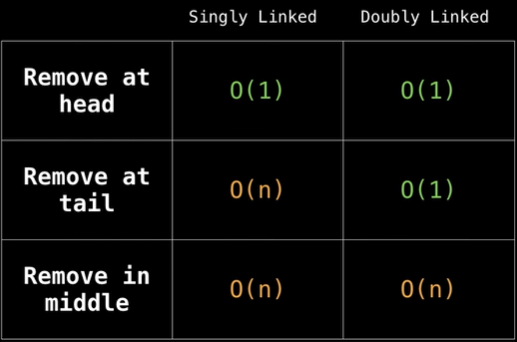

#### 2.3 Array vs Linked List Comparison

Run times for reading, insertion, and deletion: 

|          | Arrays  | Lists   |
| -------- | ------- | ------- |
| Reading  | O(1)    | O(n)    |
| Insertion| O(n)    | O(1)*    |
| Deletion | O(n)    | O(1)*    |

*assuming you can instantly access the to be deleted/inserted.

- Arrays are faster at reads, while linked lists are faster at ubserts and deletes.
- Arrays allow random access, while linked lists only allow sequential access, reading the elements one by one starting at the first.

### 3. Queue and Stack

Both queues and stacks are data structures with "restricted operations." This means, compared to basic arrays and linked lists, the APIs they provide are not complete.

A queue allows elements to be added at the back and removed from the front, while a stack allows elements to be added and removed from the top. A queue is a "first in, first out" data structure, while a stack is a "last in, first out" data structure.

#### 3.1 Implementation with Linked List
- Stack 
```Python
from collections import deque

# Implement stack using linked list as underlying data structure
# Python's deque is a double-ended linked list. We can treat the tail of the doubly linked list as the top of the stack. 
class MyLinkedStack:
    def __init__(self):
        self.list = deque()

    # Add element to the top of the stack, time complexity O(1)
    def push(self, e):
        self.list.append(e)

    # Pop element from the top of the stack, time complexity O(1)
    def pop(self):
        return self.list.pop()

    # Peek at or view the top element of the stack, time complexity O(1)
    def peek(self):
        return self.list[-1]

    # Return the number of elements in the stack, time complexity O(1)
    def size(self):
        return len(self.list)


if __name__ == "__main__":
    stack = MyLinkedStack()
    stack.push(1)
    stack.push(2)
    stack.push(3)
    print(stack.pop())
    print(stack.peek())
    print(stack.size())
```

- Queue

```Python
# deque is a doubly linked list in Python
from collections import deque

# use a linked list as the underlying data structure to implement the queue

class MyLinkedQueue:
    def __init__(self):
        self.list = deque()

    # insert an element at the end of the queue, time complexity O(1)
    def push(self, e):
        self.list.append(e)

    # remove an element from the head of the queue, time complexity O(1)
    def pop(self):
        return self.list.popleft()

    # view the element at the head of the queue, time complexity O(1)
    def peek(self):
        return self.list[0]

    # return the number of elements in the queue, time complexity O(1)
    def size(self):
        return len(self.list)

if __name__ == "__main__":
    queue = MyLinkedQueue()
    queue.push(1)
    queue.push(2)
    queue.push(3)
    print(queue.peek()) # 1
    print(queue.pop()) # 1
    print(queue.pop()) # 2
    print(queue.peek()) # 3
```
The code above essentially treats the tail of the doubly linked list as the end of the queue and the head as the front of the queue. The complexity of adding or removing elements at both the head and tail of a doubly linked list is O(1), meeting the requirements of the queue API.

#### 3.2 Implementation with Array

```Python
# Implement stack using array as the underlying data structure
class MyArrayStack:
    def __init__(self):
        self.list = []

    # Add element to the top of the stack, time complexity O(1)
    def push(self, e):
        self.list.append(e)

    # Pop element from the top of the stack, time complexity O(1)
    def pop(self):
        return self.list.pop()

    # Peek at the top element of the stack, time complexity O(1)
    def peek(self):
        return self.list[-1]

    # Return the number of elements in the stack, time complexity O(1)
    def size(self):
        return len(self.list)

# Implement queue using array as the underlying data structure

class MyArrayQueue:
    def __init__(self):
        self.arr = []

    def push(self, t):
        self.arr.append(t)

    def pop(self):
        return self.arr.pop(0)

    def peek(self):
        return self.arr[0]

    def size(self):
        return len(self.arr)
```

#### 3.3 Deque Implementation

The main distinction of a deque (double-ended queue), compared to a standard queue (FIFO - First In First Out queue), is that it offers additional operations: insertion and removal of elements at both the head and the tail.

```Python
# Use Python's deque to simulate a doubly linked list
from collections import deque

class MyListDeque:
    def __init__(self):
        self.deque = deque()

    # insert element at the front, time complexity O(1)
    def add_first(self, e):
        self.deque.appendleft(e)

    # insert element at the back, time complexity O(1)
    def add_last(self, e):
        self.deque.append(e)

    # remove element from the front, time complexity O(1)
    def remove_first(self):
        return self.deque.popleft()

    # remove element from the back, time complexity O(1)
    def remove_last(self):
        return self.deque.pop()

    # peek at the front element, time complexity O(1)
    def peek_first(self):
        return self.deque[0]

    # peek at the back element, time complexity O(1)
    def peek_last(self):
        return self.deque[-1]

# usage example
my_deque = MyListDeque()

my_deque.add_first(1)
my_deque.add_first(2)
my_deque.add_last(3)
my_deque.add_last(4)

print(my_deque.remove_first())  # 2
print(my_deque.remove_last())  # 4
print(my_deque.peek_first())  # 1
print(my_deque.peek_last())  # 3
```

### 4. Hash Table

#### 4.1 How are data stored

A hash table (also known as hash maps, maps, dictionaries, and associative arrays) stores data using a hash function to compute an index (or key) where the data will be stored in an array. It can be understood as an enhanced version of an array.

- Hash Function: This function takes a key (like a string or number) and converts it into an integer index. The goal is to distribute keys uniformly across the array.
  - A hash function has to consistently return the same output for the same input.
- Array Storage: The hash table uses an array to store the key-value pairs. The index generated by the hash function determines where the data is placed in the array.


#### 4.2 Performance and Use Cases

Ideally, hash tables provide average-case constant time complexity O(1) for search, insert, and delete operations. It doesn't mean instant. It means the time taken will stay the same, regardless of how big the hash table is.

Because the underlying structure of a hash table is an array operation, The primary time complexity comes from calculating the index using the hash function and resolving hash collisions. As long as the complexity of the hash function is O(1) and hash collisions are resolved reasonably, the complexity of adding, deleting, searching, and updating remains O(1).

|          | Hash Table  | Arrays  | Linked Lists   |
| -------- | ------- | ------- | ------- |
| Search  | O(1)    | O(1)    | O(n)    |
| Insertion| O(1)    | O(n)    | O(1)    |
| Deletion | O(1)    | O(n)    | O(1)    |

- Hash tables are great for catching duplicates.
- Only immutable objects can be stored as hashtable keys, i.e. string, integer. Arrays are mutable and thus cannot be keys. A changing key may cause accidental loss of the value. 
- The traversal order of a hash table changes. This is because of capacity expansion when they reach a certain load factor, where the indices calculated by the hash function change.


```Python
if book.get("jenny"): # check if a key is in the hash 
  pass
else:
  book["jenny"] = 123
```

Real world applications include website caching, DNS resolution.

#### 4.3 Collisions and Resolutions

Sometimes, different keys may hash to the same index (a collision). This would significantly degrade the performance of the hash table. The hash table must search through the entries stored at that index. This can turn a constant time operation O(1) into a linear time operation O(n), especially if many keys collide.

Hash collisions are inevitable because the hash function essentially maps an infinite space to a finite index space, so different keys are bound to map to the same index.

There are strategies to handle this, such as:

- Separate Chaining: Each array index points to a linked list of entries that hash to the same index.
- Open Addressing (linear probing): If a collision occurs, the algorithm searches for the next available index in the array.

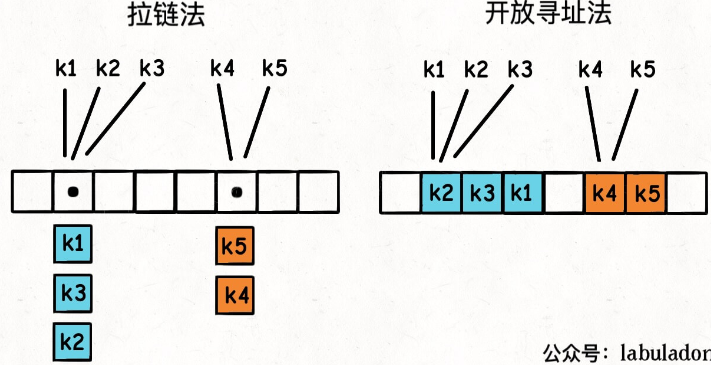

While chaining and linear probing methods can resolve hash collisions, they may lead to performance degradation. To avoid frequent collisions, we need:
- a low load factor (number of key-value pairs in hash table/ length of the underlying array). Resize and allocate more memory when the load facor is greater than 0.7 ( capacity expansion).
- a good hash function that distributes values in the array evenly.

### 5. Binary Tree Structure and Traversal

#### 5.1 Common Types of Binary Trees

- Terminology
```
    1
   / \
  2   3
 /   / \
4   5   6
   /     \
  7       8
```
  1) Nodes directly connected below a node are called child nodes, and those directly connected above are called parent nodes. 

  2) The topmost node with no parent is called the root node, and the bottommost nodes with no children, such as 4, 7, and 8, are called leaf nodes.
  3) The number of nodes from the root to the bottommost leaf node is referred to as the maximum depth/height of the binary tree.

- Perfect Binary Tree: every level is fully filled, and the entire tree resembles an equilateral triangle. Its node  count is simply $2^h - 1$, where the depth is h. 

  
- Complete Binary Tree: all levels are fully filled except possibly the last, and all nodes are as far left as possible.
  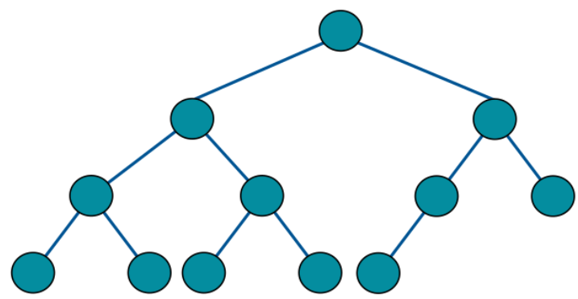
  - a perfect binary tree is a special case of a complete binary tree.
  - A characteristic of complete binary trees is that their nodes are compactly arranged, and if we number the nodes from left to right, top to bottom, there is a clear pattern in the indices of parent and child nodes.
  - At least one of the subtrees of a complete binary tree is a perfect binary tree. This property is useful in algorithm problems
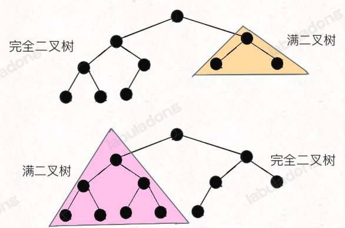
- Binary Search Tree (BST): For each node in the tree, the value of **every node in its left subtree is less than the value of the node**, and the value of every node in its right subtree is greater than the value of the node. Simply put, "left small, right large." 
```
    7
   / \
  4   9
 / \   \
1   5   10
```
For example, the value of **all nodes in the left subtree** of node 7 (not only its child node) is less than 7, and the value of all nodes in the right subtree is greater than 7.

BSTs are very commonly used data structures. Because of the "left small, right large" property, we can quickly find a particular node or all nodes within a specific range in a BST.

#### 5.2 Implementing Binary Trees

```Python
class TreeNode:
  def __init__(self, x: int):
    self.val = x
    self.left = None
    self.right = None

root = TreeNode(1)
root.left = TreeNode(2)
root.right = TreeNode(3)
root.left.left= TreeNode(4)
root.right.left = TreeNode(5)
root.right.right = TreeNode(6)

# The constructed binary tree looks like this:
#     1
#    / \
#   2   3
#  /   / \
# 4   5   6
```

Above is a common implementation, but binary trees can also be implemented with hash tables (adjacency list in graph theory), recursive trees generated from function stack, or even arrays based on specific scenarios.

In summary: 
- The binary tree itself is a relatively simple fundamental data structure, but many complex data structures are built upon it, such as red-black trees (binary search trees), multi-way trees, binary heaps, graphs, trie, disjoint set union, and segment trees, among others.
- A binary tree is not just a data structure; it also represents a recursive way of thinking. All recursive algorithms, such as backtracking, BFS, and dynamic programming, essentially abstract specific problems into a tree structure.

#### 5.3 Binary Tree Recursive/Level Traversal

#### 5.3.1 Recursive Traversal / Depth-First Search (DFS)

```Python
class TreeNode:
  def __init__(self, x: int):
    self.val = x
    self.left = None
    self.right = None

def traverse(root: TreeNode):
  if root is None:
    return
  # pre-order position
  traverse(root.left)
  # in-order position
  traverse(root.right)
  # post-order position
```
The traversal order of the traverse function is to keep moving to the left child node until it encounters a null pointer and can't go further, then it tries to move one step to the right child node; then it tries moving left again, repeating this cycle. If both left and right subtrees are done, it returns to the parent node.

The order in which the traverse function visits nodes is fixed. However, the effect can vary depending on where you write the code within the traverse function. 
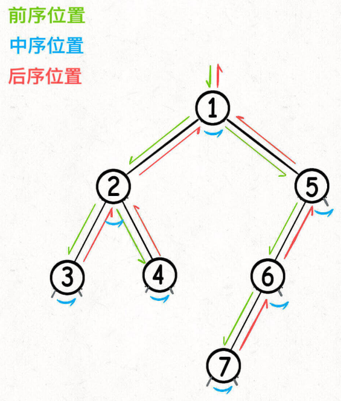


The Inorder Traversal of a BST is ordered. This is an importatnt property to solve some problems.

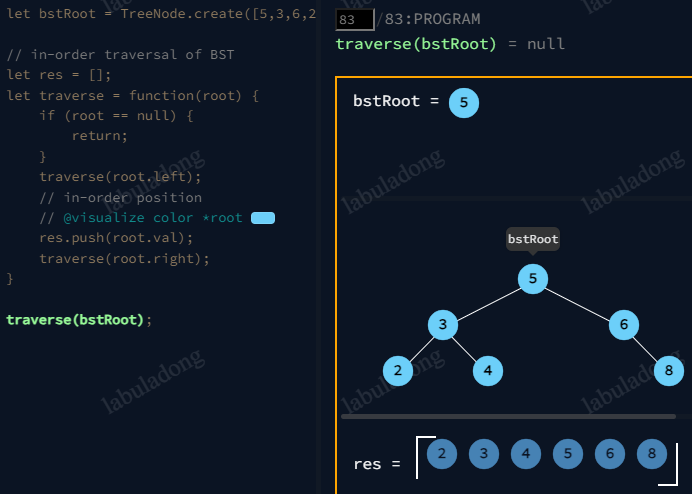

#### 5.3.2 Level Order Traversal / Breadth-First Search (BFS) 

Level order traversal means traversing the tree level by level. This traversal method requires the use of a queue, and depending on different needs, there are mainly three different ways to write it.

1. Single loop method
```Python
from collections import deque

def levelOrderTraverse(root):
  if root is None:
    return
  q = deque()
  q.append(root)
  while q:
    cur = q.popleft()
    print(cur.val)
    if cur.left is not None:
      q.append(cur.left)
    if cur.right is not None:
      q.append(cur.right)
```
Pros: simplicity
Cons: it doesn't allow tracking which levelof the current node is on, which is often required to calculate the minimum depth of a binary tree.

2. Double loop method: most common way of performing level order traversal as it records the level of each node.

```Python
from collections import deque

def levelOrderTraverse(root):
  if root is None:
    return
  q = deque()
  q.append(root)
  # record the current depth being traversed (root node is considered as level 1)
  depth = 1
  while q:
    sz = len(q)
    for i in range(sz):
      cur = q.popleft()
      # visit cur node and know its depth
      print(f"depth = {depth}, val = {cur.val}")

      # add cur's left and right children to the queue
      if cur.left is not None:
        q.append(cur.left)
      if cur.right is not None:
        q.append(cur.right)
    depth +=1
```
Make sure to save the queue length sz before starting the loop. Because the queue length changes during the loop,  you can't use q.size() directly as the loop condition.

3. Advanced variation tracking path weights (or depth) 

```Python
### add a state class to method 1 to allow each node to maintain its own path weight sum.
class State:
    def __init__(self, node, depth):
        self.node = node
        self.depth = depth

def levelOrderTraverse(root):
  if root is None:
    return
  q = deque()
  q.append(State(root,1))

  while q:
    cur = q.popleft()
    # visit cur node and know its depth
    print(f"depth = {cur.depth}, val = {cur.node.val}")

   # add cur's left and right children to the queue
   if cur.node.left is not None:
     q.append(State(cur.node.left, cur.depth+1))
   if cur.node.right is not None:
     q.append(State(cur.node.right, cur.depth+1))

```

With this approach, each node has its own depth variable, which is the most flexible and can meet all BFS algorithm needs. However, defining an additional State class can be cumbersome, so it's usually sufficient to use the second approach unless necessary.

### 5.3.3 DFS versus BFS

1. BFS is often used to find the shortest path:

Due to the level-by-level traversal logic of BFS, the path taken when the target node is first encountered is the shortest path. The algorithm may not need to traverse all nodes to finish early. DFS can also be used to find the shortest path, but it must traverse all nodes to obtain the shortest path.

2. DFS is commonly used to find all paths:

both traversal algorithms can be used. However, the code for BFS to find all paths is more complex, whereas the code for DFS is more straightforward. DFS naturally traverses the tree branch by branch from left to right, with each branch representing a path. Hence, DFS is inherently suitable for finding all paths. To use BFS to find all paths, it requries storing the path taken to reach it, similar to the method 3 above. 

#### 5.4 N-ary Tree Recursive/Level Traversal

In a nutshell, a multi-way tree structure is an extension of the binary tree structure. A node in an n-ary tree looks like this, where each node has an arbitrary number of child nodes:

```Python
class Node:
    def __init__(self, val: int):
        self.val = val
        self.children = []
```
Similar to binary trees, there are two methods: recursive traversal (DFS) and level-order traversal (BFS).

- Recursive Traversal
```Python
def traverse(root):
  if root is None:
    return
  # pre-order position
  for child in root.children:
    traverse(child)
  # post-order position
```
The only difference is that an n-ary tree does not have an in-order position, because there may be multiple nodes, making the concept of an in-order position meaningless.

- Level-order Traversal

```Python
### Method 1
from collections import deque

def levelOrderTraverse(root):
  if root is None:
    return
  q = deque()
  q.append(root)
  while q:
    cur = q.popleft()
    print(cur.val)
    for child in cur.childern:
      q.append(child)

### Method 2 that records the depth of nodes

from collections import deque

def levelOrderTraverse(root):
  if root is None:
    return
  q = deque()
  q.append(root)
  depth =1
  while q:
    sz = len(q)
    for i in range(sz):
      cur = q.popleft()
      # visit the cur node and know the level it is on
      print(f"depth = {depth}, val = {cur.val}")
      for child in cur.childern:
        q.append(child)
    depth += 1

### Method 3 that adapts to edges with different weights
class State:
  def __init__(self,node,depth):
    self.node = node
    self.depth = depth

def levelOrderTraverse(root):
  if root is None:
    return
  q = deque()
  q.append(State(root,1))
  while q:
    state = q.popleft()
    cur = state.node
    # visit the cur node and know the level it is on
    print(f"depth = {state.depth}, val = {cur.val}")
    for child in cur.childern:
      q.append(State(child, state.depth+1))
```

#### 5.5 Binary Search Tree

A binary search tree is a special type of binary tree structure, mainly used in TreeMap and TreeSet.

The characteristics of a Binary Search Tree (BST), namely, "left smaller, right larger": For each node in the tree, the value of **every node in its left subtree** must be smaller than the value of this node, and the value of **every node in its right subtree** must be larger than the value of this node.

```
    7
   / \
  4   9
 / \   \
1   5   10
```

Similar to binary search, by using the "left smaller, right larger" characteristic of a BST, you can quickly locate the target node. The ideal time complexity is the height of the tree, O(logN), whereas a regular binary tree traversal function requires O(N) time to traverse all nodes.

#### 5.5.1 Implementation Principles of TreeMap

TreeMap has a similar structure to HashMap, both storing key-value pairs. The HashMap stores key-value pairs in a table array, while TreeMap stores key-value pairs in the nodes of a binary search tree.

```Python
class TreeNode:
    def __init__(self, key: K, value: V):
        self.key = key
        self.value = value
        self.left = None
        self.right = None
```
In addition to the standard methods for adding/updating (put), querying (get), deleting (remove), TreeMap structure can support many additional methods, mainly related to the comparison of the keys.

- First, the `get` method compares the target key with the current node’s key to decide whether to move left or right, which allows half of the nodes to be excluded in one go, resulting in a complexity of `O(logN)`.

- As for the `put`, `remove`, and `containsKey` methods, they also use the `get` method to locate the node where the target key resides first, and then perform some pointer operations. The complexity for these operations is also `O(logN)`.

- The `floorKey` and `ceilingKey` methods are used to find the maximum or minimum key that is less than or equal to / greater than or equal to a given key. The implementation of these methods is similar to that of the `get` method. The only difference is that when the target key is not found, the `get` method returns a null pointer, whereas the `ceilingKey` and `floorKey` methods return the key closest to the target key, similar to an upper or lower bound.

- The `rangeKeys` method takes an input range `[low, hi]` and returns all the keys within this range. The implementation of this method leverages the properties of a BST (Binary Search Tree) to improve search efficiency:
    - If the key of the current node is less than `low`, then the entire left subtree of the current node is also less than `low` and does not need to be searched.
    - If the key of the current node is greater than `hi`, then the entire right subtree of the current node is greater than `hi` and also does not need to be searched.

- The `firstKey` method is used to find the smallest key, and the `lastKey` method is used to find the largest key. These can be easily implemented by utilizing the left-small, right-large property of the BST:
  - Starting from the root of the BST and continuously moving left will eventually lead to the smallest non-null node, which is the smallest key.
  - Similarly, continuously moving right will eventually lead to the largest non-null node, which is the largest key.
```
    7
   / \
  4   9
 / \   \
1   5   12
 \      /
  2    11
```

- The `keys` method returns all keys, and the result is ordered. This takes advantage of the characteristic of BST (Binary Search Tree) in-order traversal, where the results are naturally ordered.

- The `selectKey` method finds the key ranked as k (from smallest to largest, starting at 1), and the `rank` method finds the rank of the target key. For example, in the BST below, `selectKey(3)` returns 5 because 5 is the third smallest key, and `rank(9)` returns 5 because 9 is ranked fifth.
  ```
      7
     / \
    4   9
   / \   \
  1   5   10
  ```
  - One straightforward approach for `selectKey` method is to use the ordered characteristic of in-order traversal in a BST. During the in-order traversal, the k-th node encountered is the node ranked as k. However, this approach has a time complexity of `O(k)` because you need to traverse at least k nodes using in-order traversal.

  - A more ingenious method is to add additional fields to the binary tree nodes to record extra information. With this modification, `selectKey` can use this `size` field to quickly exclude subtrees, achieving a complexity of `O(logN)`.
  ```Python
  class TreeNode:
      def __init__(self, key: K, value: V):
          self.key = key
          self.value = value
          self.size = 1
          self.left = None
          self.right = None
  ```
  ```
      7
     / \
    4   9
   / \   \
  1   5   10

  keys [1, 4, 5, 7, 9, 10]
  rank  1  2  3  4  5  6
  size  1  3  1  6  2  1
  ```
  - The `rank` method can also utilize this `size` field. For example, if you call `rank(9)` to find out the rank of node 9, the root node 7 knows that its left subtree has 3 nodes, so including itself, it accounts for 4 nodes, making its rank 4. Then, node 7 can recursively call `rank(9)` on the right subtree to find the rank of node 9 within the right subtree. Adding 4 to that result gives the rank of node 9 in the entire tree. 
  - Of course, this increases the complexity of maintaining the tree since the `size` field needs to be updated whenever nodes are inserted or deleted.

#### 5.5.2 BST Performance

The previous text stated that the complexity is the depth of the tree `O(logN)` (where `N` is the total number of nodes), but this comes with a condition: the binary search tree must be "balanced," meaning that the depth difference between the left and right subtrees should not be too large. 

If the search tree is unbalanced, such as in an extreme case where all nodes only have right subtrees and no left subtrees, the binary search tree essentially degenerates into a linked list. 
```
1
 \
  2
   \
    3
     \
      4
       \
        5
```
In this situation, the depth of the tree equals the number of nodes `O(N)`. Although this tree still meets the definition of a BST, its performance degrades to that of a linked list, with all complexities becoming `O(N)`.

In summary, the performance of a binary search tree depends on its depth, and the depth depends on the balance of the tree. Therefore, in practical applications, `TreeMap` needs to automatically maintain the balance of the tree to avoid performance degradation.

#### 5.6 Binary Heap and Priority Queue

#### 5.6.1 What is a Heap

a Heap is a special type of binary tree that meets the following criteria:
    1) Is a complete binary tree;
    2) The value of each node must be no greater than (or no less than) the value of its child nodes.

- Two kinds of heaps: 

      Max Heap: Each node in the Heap has a value no less than its child nodes. Therefore, the top element (root node) has the largest value in the Heap.

      Min Heap: Each node in the Heap has a value no larger than its child nodes. Therefore, the top element (root node) has the smallest value in the Heap.

  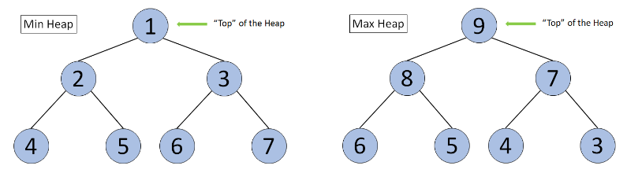

- Heap operations

Insertion/Push first happens to the bottom leftmost node to fulfil the requirement of complete binary tree. The new element then "swims"/gets swapped to the proper parent node that satisfy the heap requirements.

  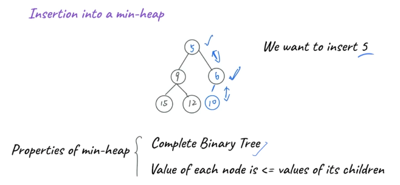

Deletion/Pop means removing the “top” element from the Heap. After deleting the element, the property of Heap should remain unchanged. To do so, we:
    1) first delete the top element
    2) move the bottom right element to the top of the heap to construct a new complete binary tree
    3) exchange/"sink" the top element with the smallest/largest child node until it suffice the node value requirement.
  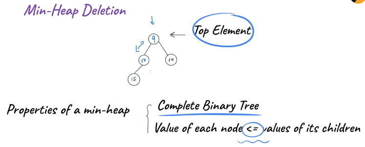

#### 5.6.2 Heap Implementation with arrays
- Why arrays instead of linked lists?
  - Linked lists require storing node pointers which takes larger memory footprint.
  - Push/pop can be achieved in O(1) time using arrays, compared to traversing the linked list in O(N).
- Elements in the Heap can be stored in the array in the form of a complete binary tree.

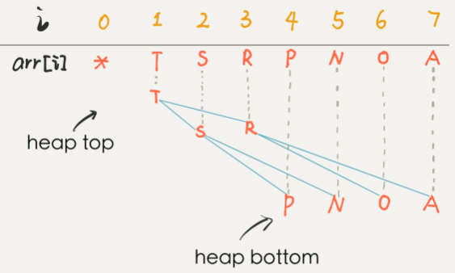
- Implementing "Min Heap" 
```python
class MinHeap:
    def __init__(self, heapSize):
        # Create a complete binary tree using an array
        # Then use the binary tree to construct a Heap
        self.heapSize = heapSize
        # the number of elements is needed when instantiating an array
        # heapSize records the size of the array
        self.minheap = [0] * (heapSize + 1)
        # realSize records the number of elements in the Heap
        self.realSize = 0

    def parent(self, index):
    # Parent node of the newly added element
    # Note if we use an array to represent the complete binary tree
    # and store the root node at index 1
    # index of the parent node of any node is [index of the node / 2]
      return index //2
    
    def left(self, index):
    # index of the left child node is [index of the node * 2]
      return index*2
    
    def right(self, index):
    # index of the right child node is [index of the node * 2 + 1]
      return index*2+1
    
    def swap(self, i, j):
      self.minheap[i], self.minheap[j] = self.minheap[j], self.minheap[i]

    # Get the top element of the Heap
    def peek(self):
        return self.minheap[1]
    
    def swim(self, index):
      # while current node is lower than parent
      while (self.minheap[index] < self.minheap[self.parent(index)] and index > 1):
          self.swap(self.parent(index), index)
          index = self.parent(index)

    def sink(self, index):
      # while current node is not a leaf node
      while (index <= self.realSize // 2):
          # If current node is larger than the left or right child
          # its value needs to be exchanged with the smaller value
          # of the left and right child
          if (self.minheap[index] > self.minheap[self.left(index)] or self.minheap[index] > self.minheap[self.right(index)]):
              if self.minheap[self.left(index)] < self.minheap[self.right(index)]:
                  self.swap(self.left(index), index)
                  index = left
              else:
                  self.swap(self.right(index), index)
                  index = right
          else:
              break
    # Function to add an element
    def add(self, element):
        self.realSize += 1
        # If the number of elements in the Heap exceeds the preset heapSize
        # print "Added too many elements" and return
        if self.realSize > self.heapSize:
            print("Added too many elements!")
            self.realSize -= 1
            return
        # Add the element into the array
        self.minheap[self.realSize] = element
        # Index of the newly added element
        index = self.realSize

        # If the newly added element is smaller than its parent node, it needs to swim to the parent node
        self.swim(index)
    
    # Delete the top element of the Heap
    def pop(self):
        # If the number of elements in the current Heap is 0,
        # print "Don't have any elements" and return a default value
        if self.realSize < 1:
            print("Don't have any element!")
            return sys.maxsize
        else:
            # When there are still elements in the Heap
            # self.realSize >= 1
            removeElement = self.minheap[1]
            # Put the last element in the Heap to the top of Heap
            self.minheap[1] = self.minheap[self.realSize]
            self.realSize -= 1
            # sink the top element 
            self.sink(1)
            return removeElement
    
    # return the number of elements in the Heap
    def size(self):
        return self.realSize
    
    def __str__(self):
        return str(self.minheap[1 : self.realSize + 1])
        
if __name__ == "__main__":
      # Test cases
        minHeap = MinHeap(5)
        minHeap.add(3)
        minHeap.add(1)
        minHeap.add(2)
        # [1,3,2]
        print(minHeap)
        # 1
        print(minHeap.peek())
        # 1
        print(minHeap.pop())
        # 2
        print(minHeap.pop())
        # 3
        print(minHeap.pop())
        minHeap.add(4)
        minHeap.add(5)
        # [4,5]
        print(minHeap)
```
- Existing library **heapq** for leetcode problems

Heapify means converting a group of data into a Heap. Its time and space complextity are both O(N).

heapq doesn't directly construct a max heap. We need to multiply each element by -1.

heapq uses zero-based indexing and stores the root node at 0 insteaf of the 1.

```Python
import heapq

# construct a minheap with initial values, O(N)
minHeap = [1,2,3]
heapq.heapify(minHeap)

# construct a maxheap
maxHeap = [-x for x in minHeap]
heapq.heapify(maxHeap)

# insert an element, O(log N)
heapq.heappush(minHeap, 5)
heapq.heappush(maxHeap, -1*5)

# get the top element, O(1)
minHeap[0]
-1*maxHeap[0]

# delete top element, O(log N)
heapq.heappop(minHeap)
heapq.heappop(maxHeap)

# get the length of a heap, O(1)
len(minHeap)
len(maxHeap)
```
#### 5.6.3 Applications of Heap

A heap is a data structure that supports dynamic sorting. Dynamic sorting means we can continuously add or remove elements from the data structure, and it will automatically adjust the positions of the elements so that we can retrieve them in order. This is something that regular sorting algorithms cannot achieve.

There are only two commonly used data structures capable of dynamic sorting:
1. **Priority Queue** (implemented using a binary heap as the underlying structure).
2. **Binary Search Tree**.

Binary search trees are more versatile; anything a priority queue can do, a binary search tree can also handle. However, the API and implementation of a priority queue are simpler compared to a binary search tree. Therefore, for problems that can be solved with a priority queue, it is unnecessary to use a binary search tree.

- What is a priority queue

**Priority queue** is an abstract data type similar to a regular queue or stack data structure in which each element additionally has a "priority" associated with it. In a priority queue, an element with high priority is served before an element with low priority.

A common misconception is that a Heap is the same as a Priority Queue, which is not true. **A priority queue is an abstract data type, while a Heap is a data structure. Therefore, a Heap is not a Priority Queue, but a way to implement a Priority Queue.**

There are multiple ways to implement a Priority Queue, such as array and linked list. However, these implementations only guarantee O(1) time complexity for either insertion or deletion, while the other operation will have a time complexity of O(N). On the other hand, implementing the priority queue with Heap will allow both insertion and deletion to have a time complexity of O(logN).

- Other applications

1. Heap Sort - refer to the notes for sorting algorithms

2. Top K Problem: use the heap data structure to obtain top K's largest/smallest elements.
    - time complexity: O(K log N + N)
    - space complexity: O(N)
    - Solution of the Top K largest elements:
      1. Construct a Max Heap.
      2. Add all elements into the Max Heap.
      3. Traversing and deleting the top element (using pop() or poll() for instance), and store the value into the result array T.
      4. Repeat step 3 until we have removed the K largest elements.

3. The K-th Element: use the heap data structure to obtain the K-th largest/smallest element.


### 6. Graph Structure and Traversal

#### 6.1 What is a Graph (network)

A graph models how different things are connected to each other, such as social networks. They are made up of nodes and edges.

```Python
class Vertex:
    def __init__(self, id: int):
        self.id = id
        self.neighbors = []
```
A graph structure is an extension of the multi-ary tree structure.

In a tree structure, a parent node can only point to child nodes, and there are no child-to-parent links, nor links between sibling nodes. In contrast, a graph has fewer restrictions, allowing nodes to interconnect, forming a complex network structure.

- Types of graphs
  1. A directed graph has arrows and the relationship follows the direction of the arrow. 
      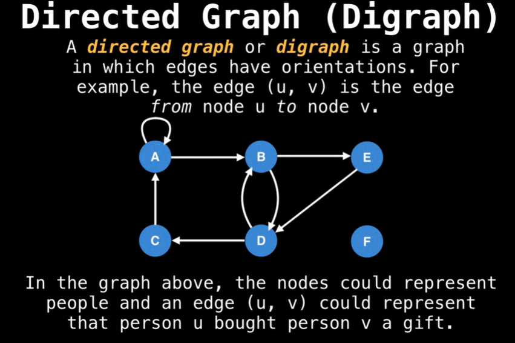
      - A tree is a special type of graphs, where no edges ever point back. 
        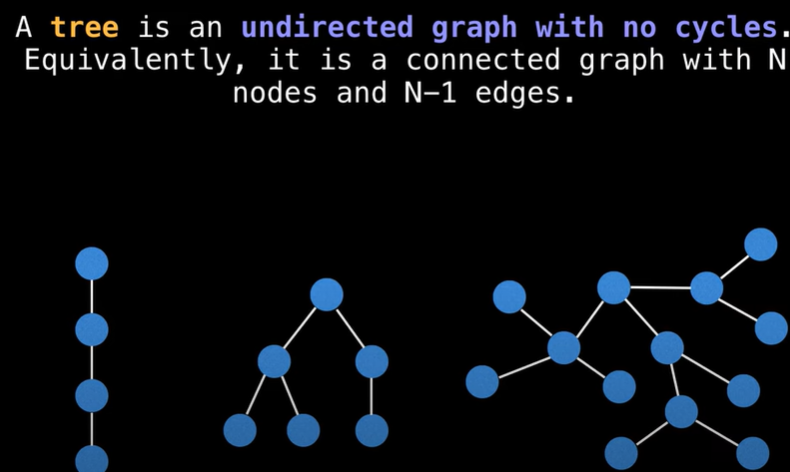
        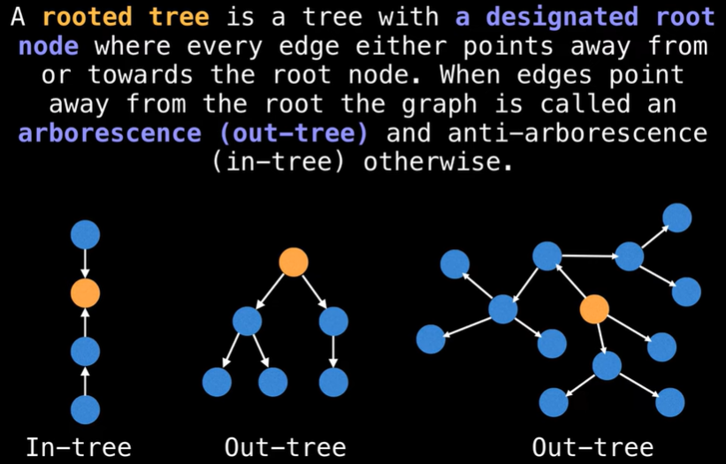
      - Directed Acyclic Graphs (DAGs): commonly used to model tasks that have dependencies. Topological sort is a way to get a list of ordered tasks out of the graph.
        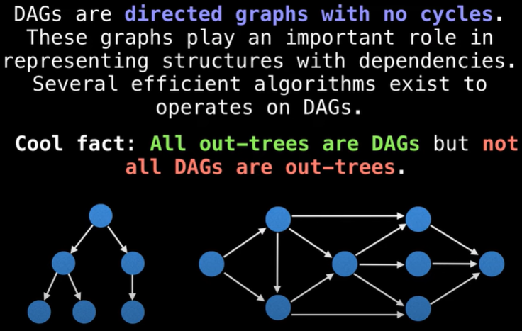
  2. An undirected graph doesn't have any arrows and the relationship goes both ways, that is, both nodes are neighbors of each other.
    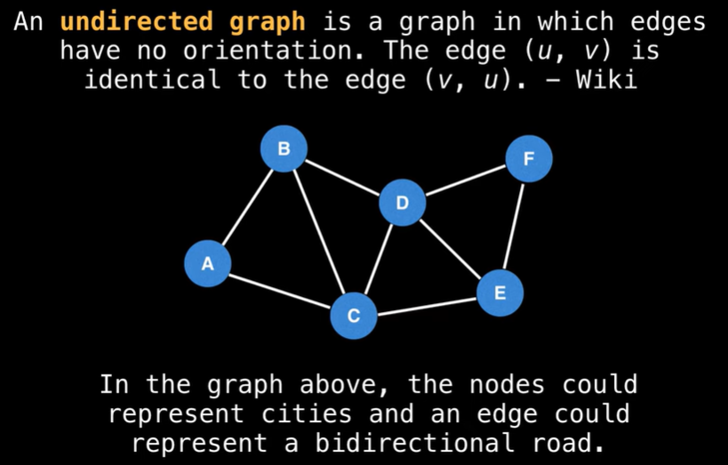
  3. Weighted graphs
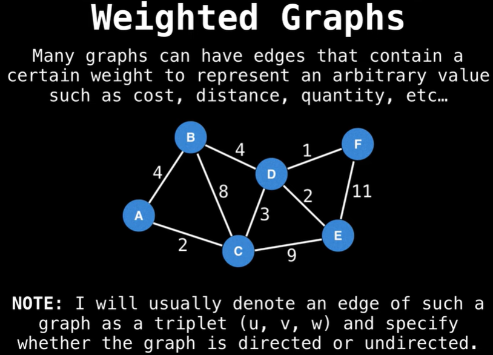

- Runtime Notation
  - V denotes the number of vertices (nodes)
  - E denotes the number of edges

- The concept of *degree* specific to graph theory

In an *undirected graph*, the degree refers to the number of edges connected to each node. Since the edges in a *directed graph* have a direction, the degree of each node in a directed graph is further divided into *indegree* and *outdegree*.

- Graph Representation in data structures
  1. Adjacency Matrix: the simplest representation
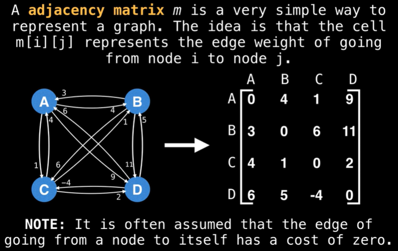
     - Prons: 
       1) space efficient for representing dense graphs
       2) Edge weight looup is O(1)
       3) Simplest representation
     - Cons:  
       1) requires O($V^2$) space
       2) Iterating over all edges takes O($V^2$) time.

  2. Adjaceny List
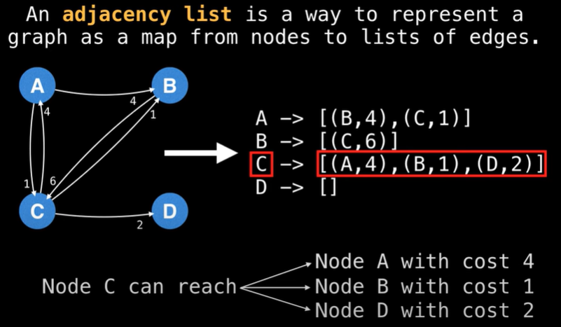

      ```Python
      graph = {}
      graph["A"] = [("B",4), ("C",1)]
      graph["B"] = [("C",6)]
      graph["D"] = []
      ```
     - Pros: 
       1) space efficient for representing sparse graphs： O(V+E)
       2) Iterating over all edges is efficient
     - Cons:  
       1) Less space efficient for denser graphs
       2) Edge weight lookup is O(E)
       3) Slightly more complex
  3. Edge List
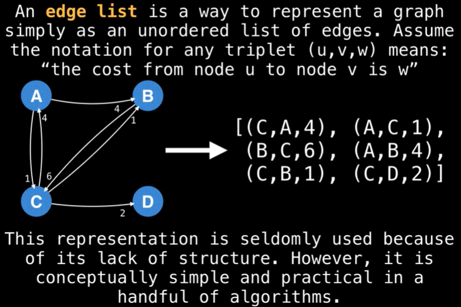 
     - Same pros and cons as above

In summary, we need to analyze the space complexity of the two storage methods. For a graph with `V` nodes and `E` edges, the space complexity of an adjacency list is `O(V + E)`, while the space complexity of an adjacency matrix is `O(V^2)`.

Thus, if a graph has `E` much smaller than `V^2` (a *sparse graph*), the adjacency list will save more space compared to the adjacency matrix. Conversely, if `E` is close to `V^2` (a *dense graph*), the space usage of the two will be similar.

The greatest advantage of the adjacency matrix lies in its mathematical power. Some subtle properties of the graph can be revealed through sophisticated matrix operations.

#### 6.2 Graph Structure Depth-First Search (DFS) and Breadth-First Search (BFS)

Graph traversal is an extension of N-ary Tree Traversal. The main traversal methods are Depth-First Search (DFS) and Breadth-First Search (BFS). 

**The only difference is that tree structures do not have cycles, but graph structures might, so we need to mark visited nodes to prevent infinite loops in cycles.**

Specifically, when traversing all "nodes" of a graph, use a `visited` array (or hashmap) to mark nodes at the pre-order position. When traversing all "paths" of a graph, use an `onPath` array to mark nodes at the pre-order position and unmark them at the post-order position.

If the problem states that the graph has no cycles, then graph traversal is exactly the same as N-ary tree traversal. No need to use `visited` or `onPath`. 

#### 6.2.1 Depth First Search

1. Traversing all the nodes with 'visited' dictionary:
```Python
# 加权有向图的通用实现（邻接表）
class WeightedDigraph:
    
    # 存储相邻节点及边的权重
    class Edge:
        def __init__(self, to: int, weight: int):
            self.to = to
            self.weight = weight

    def __init__(self, n: int):
        # 我们这里简单起见，建图时要传入节点总数，这其实可以优化
        # 比如把 graph 设置为 Map<Integer, List<Edge>>，就可以动态添加新节点了
        self.graph = [[] for _ in range(n)]

    # 增，添加一条带权重的有向边，复杂度 O(1)
    def addEdge(self, from_: int, to: int, weight: int):
        self.graph[from_].append(self.Edge(to, weight))

    # 删，删除一条有向边，复杂度 O(V)
    def removeEdge(self, from_: int, to: int):
        self.graph[from_] = [e for e in self.graph[from_] if e.to != to]

    # 查，判断两个节点是否相邻，复杂度 O(V)
    def hasEdge(self, from_: int, to: int) -> bool:
        for e in self.graph[from_]:
            if e.to == to:
                return True
        return False

    # 查，返回一条边的权重，复杂度 O(V)
    def weight(self, from_: int, to: int) -> int:
        for e in self.graph[from_]:
            if e.to == to:
                return e.weight
        raise ValueError("No such edge")
    
    # 上面的 hasEdge、removeEdge、weight 方法遍历 List 的行为是可以优化的
    # 比如用 Map<Integer, Map<Integer, Integer>> 存储邻接表
    # 这样就可以避免遍历 List，复杂度就能降到 O(1)

    # 查，返回某个节点的所有邻居节点，复杂度 O(1)
    def neighbors(self, v: int):
        return self.graph[v]

def traverse(graph, s, visited):
  # base case
  if s <0 or s >= len(graph):
    return
  # If a node has been visited, return. This is to prevent infinite loop
  if visited[s]:
    return
  visited[s] = True
  print("visit", s)
  # pre-order position
  for edge in graph.neighbors(s):
    traverse(graph, edge.to, visited)
  # post-order position
```

2. Traversing all the paths with 'onPath' array

For tree structures, traversing all *paths* and traversing all *nodes* is essentially the same. However, for graph structures, there is a slight difference between traversing all *paths* and traversing all *nodes*.

In a tree structure, since parent nodes only point to child nodes, the path from the root node `root` to any target node `targetNode` is unique. In other words, after traversing all the nodes of a tree once, you will inevitably find the unique path from `root` to `targetNode`. 

For graph structures, however, the path from a starting point `src` to a target node `dest` may not be unique. We need an `onPath` array to mark a node as being visited when entering it (in the *preorder position*) and remove the mark when exiting it (in the *postorder position*). This ensures that all paths in the graph are traversed, allowing us to find all paths from `src` to `dest`.
  - Why do we need to remove the markin onPath?
  Ans: For graph strucutres, we sometimes need to visit the same node multiple times in order to find all the paths.
 
```python

onpath = [False] * len(graph)
path = []

def traverse(graph, src, dest):
  # base case
  if src <0 or src >= len(graph):
    return
 
  if onpath[src]:
    return
  # pre-order position
  onpath[src] = True
  path.append(src)
  if src == dest:
    print(f"find path: {path}")
  for edge in graph.neighbors(src):
    traverse(graph, edge.to, dest)
  # post-order position
  path.pop()
  onpath[src] = False
```

The algorithm for traversing all paths has a relatively high time complexity. In most cases, we might not need to exhaustively enumerate all paths but only need to find one path that meets certain conditions. In such scenarios, we can use a `visited` array to prune the search, excluding some paths that do not meet the conditions in advance and thereby reducing the complexity.

For example, in *topological sorting*, we will discuss how to determine whether a graph contains a cycle. This process uses both the `visited` and `onPath` arrays for pruning. While traversing all paths, if a node `s` is marked as `visited`, it means that all paths starting from node `s` have already been traversed previously. If no cycle was found during the previous traversal, traversing it again now will certainly not find a cycle either. Therefore, we can prune directly here and skip further traversal of node `s`.

Comapred to BFS, DFS is more efficient for problems where exploring all possible solutions, pathfinding that does not require the shortest path, and depth-first exploration (e.g., finding the deepest nodes, cycle detection, or backtracking problems) is needed.

#### 6.2.2 Breadth-First Search (BFS)

- Two types of questions BFS helps to answer:
  1) Is there a path from one node to another?
  2) What is the shortest path from one node to another?


- How it works: 
  
      The search radiates out from the starting point. First-degree connections are added to the search list **before** second-degree connections. The search list is essentially a data structure called **queue**. The search stops when a target is found or the search queue becomes empty.
- Keeping only unique elements in a search queue
  
      When nodes can appear in multiple connections (i.e. two persons are friends of each other or mutual friends exist in a network), mark the nodes that have been searched to prevent from doing unnecessary (sometimes infinite) searches.

- Queue Overview

      Queues are similar to stacks in the sense that there are only two operations: enqueue (adding) and dequeue (polling).

      Queue is a FIFO data structure: First In, First Out. Stack is a LIFO data structure: Last In, First Out.

    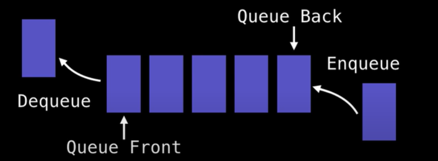

BFS of a graph structure is essentially a level-order traversal of a multi-way tree, with the addition of a `visited` array to avoid revisiting nodes.

```Python
from collections import deque
### Method 1: not tracking the depth
def bfs(graph, s):
  visited = [False] * len(graph)
  q = deque()
  q.append(s)
  visited[s] = True
  while q:
    cur = q.popleft()
    print(f"visit {cur}")
    for e in graph.neighbors(cur):
      if not visited[e.to]:
        q.append(e.to)
        visited[e.to] = True

### Method 2 that records the steps
def bfs(graph, s):
  visited = [False] * len(graph) 
  q = deque()
  q.append(s)
  visited[s] = True
  step =1
  while q:
    sz = len(q)
    for i in range(sz):
      cur = q.popleft()
      # visit the cur node and know the level it is on
      print(f"visit {cur} at step {step}")
      for e in graph.neighbors(cur):
        if not visited[e.to]:
          q.append(e.to)
          visited[e.to] = True
    step += 1

### Method 3 that records the sum of path weights from s
class State:
  def __init__(self,node, weight):
    self.node = node
    self.weight = weight

def bfs(graph,s):
  visited = [False] * len(graph) 
  q = deque()
  q.append(State(s,0))
  visited[s] = True
  while q:
    state = q.popleft()
    cur = state.node
    weight = state.weight
    # visit the cur node and know the level it is on
    print(f"visit {cur} with path weight {weight}")
    for edge in graph.neighbors(cur):
      if not visited[edge.to]:
        q.append(State(edge.to, weight+edge.weight))
        visited[edge.to] = True
```

For a *weighted graph*, since each edge has a different weight, the number of traversal steps can no longer represent the length of the shortest path. Therefore, each node needs to maintain its path weight sum using a custom `State` class. The most typical example of this is *Dijkstra's single-source shortest path algorithm*.

