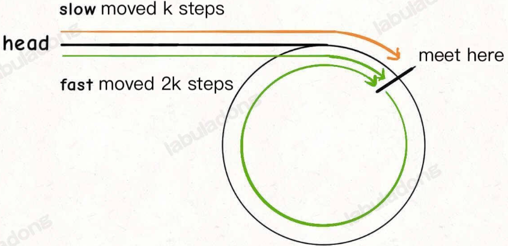

### Linked list Implementation

Key Considerstaions:
1. Maintain reference to both head and tail nodes
   
   This allows you to add elements to the end of a singly or doubly linked list in O(1)
   
2. Dummy head and tail nodes
   
   When should we use a dummy (virtual head) node?
   
   Quick Answer: **When you need to create a new linked list, you can use a dummy node to make edge cases easier.**

   For doubly linked lists, a dummy head node and a dummy tail node are established, and these nodes exist whether the list is empty or not. This approach prevents null pointer issues and simplifies handling many edge cases.

   ```dummyHead <-> 1 <-> 2 <-> dummyTail```

   For singly linked lists, a dummy head node simplifies some operations, but a dummy tail node is not very useful.

3. Does deleting elements in a linked list also lead to memory leaks?

   ```python
   # head node of the singly linked list is head = 1 -> 2 -> 3 -> 4 -> 5
   head = head.next
   # now head = 2 -> 3 -> 4 -> 5
   ```

    In Python and Java, garbage collector determines whether an object should be reclaimed based on whether it is still referenced by other objects. It does not care if the object itself still points to other nodes. Unreferenced nodes like node 1 here will be reclaimed, so you don't have to set all pointers in the deleted node to null. 

4. Element Insertion

    Find the predecessor and the successor of the node to insert. If the node is to be inserted at head, its predecessor is a sentinel head. If the node is to be inserted at the tail, its successor is a sentinel tail. Bidirectional traversal can be faster.

    ```python
    def addAtIndex(self, index: int, val: int) -> None:
        """
        Add a node of value val before the index-th node in the linked list. If index equals to the length of linked list, the node will be appended to the end of linked list. If index is greater than the length, the node will not be inserted.
        """
        # If index is greater than the length, 
        # the node will not be inserted.
        if index<0 or index > self.size:
            return
        
        # Find predecessor and successor of the node to be added
        if index < self.size - index:
            pred = self.head
            for _ in range(index):
                pred = pred.next
            succ = pred.next
        else:
            succ = self.tail
            for _ in range(self.size - index):
                succ = succ.prev
            pred = succ.prev
        
        # Insertion itself
        self.size += 1
        to_add = ListNode(val)
        to_add.prev = pred
        to_add.next = succ
        pred.next = to_add
        succ.prev = to_add
   ```
[707. Design Linked List](https://leetcode.com/problems/design-linked-list/description/)


### Two Pointer Technique for Linked List


#### 1. Merge k Sorted Linked Lists


[143. Reorder List](https://leetcode.com/problems/reorder-list/)

#### 2. Decompose a Singly Linked List

If we want to attach nodes from the original list to a new list instead of creating new nodes, it is often necessary to break the link between the nodes in the original list to prevent from forming cycles. 

[86. Partition List](https://leetcode.com/problems/partition-list/description/)

#### 3. The k-th Node from the End of a Singly Linked List

- **Idea**: Maintain two pointers and update one with a delay of k steps.

    Use dummy head as needed.

[19. Remove Nth Node From End of List](https://leetcode.com/problems/remove-nth-node-from-end-of-list/description/)

[82. Remove Duplicates from Sorted List II](https://leetcode.com/problems/remove-duplicates-from-sorted-list-ii/submissions/1796723748/)

#### 4. Check if a Linked List has a cycle

- **Idea**: Every time the slow pointer slow moves one step, the fast pointer fast moves two steps. If fast can reach the end of the list, then there is no cycle. If fast meets slow while moving, then fast must be running in a circle, so the list has a cycle.

- **Why choose k=2**: once both pointers are in the cycle, the relative speed of f with respect to s is k-1. This means at each iteration the fat pointer gets k-1 steps closer to the slow one. k=2 i the only universal choice that guarantees a meeting regardless of the cycle length.

- **Find the cycle start**: 

    
      
    
    Once fast and slow pointers meet, set one of them to head and move both at the same speed. After k-m steps they will meet at the start of the cycle.

[142. Linked List Cycle II](https://leetcode.com/problems/linked-list-cycle-ii/description/)

#### 5. Check the Interaction of Linked Lists

- **Idea**: The key is to find a way so that p1 and p2 can reach the intersection node c1 at the same time.

    So, we can let p1 travel list A, then switch to list B after reaching the end. Similarly, let p2 travel list B, then switch to list A. In this way, it is as if the two lists are joined together.

    By doing this, p1 and p2 will enter the common part at the same time, and reach the intersection node c1 together:

    
       

    If there is no intersection, the c1 node is null, and the algorithm will return null.

[160. Intersection of Two Linked Lists](https://leetcode.com/problems/intersection-of-two-linked-lists/description/)