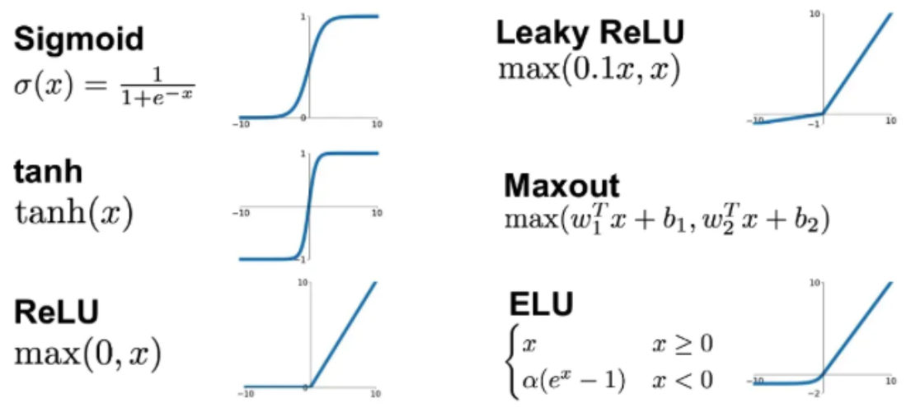
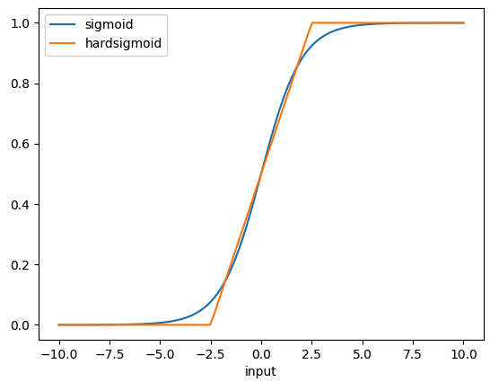
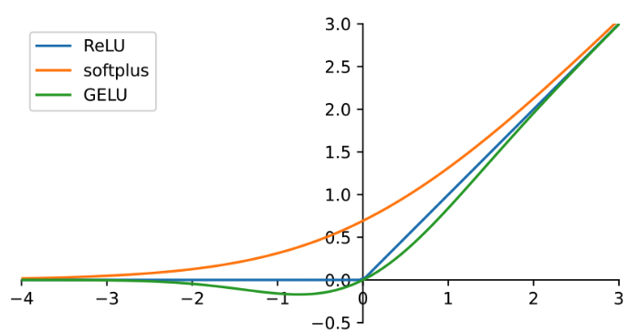

## 🔑 Common Activation Functions

An activation function is a mathematical function within a neural network that introduces non-linearity to determine a neuron's output based on its weighted inputs. 

- Why non-linear?

    By applying this non-linear transformation, it allows the neural network to **learn complex curves, boundaries, patterns and relationships** in data, which would be impossible with only linear operations. That’s what makes deep networks powerful as universal function approximators. Without activation functions, a deep neural network would simply behave as a simple linear regression model, limiting its ability to solve real-world problems.



1. **Sigmoid (Logistic)**

   $$
   \sigma(z) = \frac{1}{1 + e^{-z}}
   $$

   * **Range**: (0, 1)
   * **Use case**: Binary classification (probabilities). Popular in early neural nets and perceptrons.
   - **Gradient**: $\sigma'(z) = \sigma(z)\cdot(1-\sigma(z))$
   
        The gradient is highest near ( z = 0 ) and decreases as ( z ) moves away from 0 in either direction.
   * **Issues**: Saturates at extremes (gradients vanish), not zero-centered.

---
2. **Hard Sigmoid**

    The Hard Sigmoid is a piecewise linear approximation of the sigmoid activation function. It's computationally more efficient than the standard sigmoid function while maintaining similar characteristics. This function is particularly useful in neural networks where computational efficiency is crucial.

    $$
    HardSigmoid(x) = \begin{cases} 
    0 & \text{if } x \leq -2.5 \\ 
    0.2x + 0.5 & \text{if } -2.5 < x < 2.5 \\ 
    1 & \text{if } x \geq 2.5 
    \end{cases}
    $$

    - **Output Range:** The output is always bounded in the range $[0, 1]$
    - **Gradient:** The gradient is 0.2 in the linear region and 0 in the saturated regions
    - **Pros**: Computational efficiency compared to standard sigmoid


     

---
3. **Softmax**

    The softmax function is a generalization of the sigmoid function and is used in the output layer of a neural network model that handles multi-class classification tasks.
   $$
   f(z_i) = \frac{e^{z_i}}{\sum_j e^{z_j}}
   $$

   * **Range**: Each output in (0,1), sums to 1.
   * **Use case**: Final layer for multi-class classification.
   - Pros: It transforms scores into probabilities, making them easier to interpret and useful for classification tasks.

    ```python
    import math
    def softmax(scores: list[float]) -> list[float]:
        exp_scores = [math.exp(score) for score in scores]
        sum_exp_scores = sum(exp_scores)
        probabilities = [round(score / sum_exp_scores, 4) for score in exp_scores]
        return probabilities
    ```
---

4. **ReLU (Rectified Linear Unit)**

   $$
   f(z) = \max(0, z)
   $$

   * **Range**: \[0, ∞)
   * **Use case**: Default for hidden layers in modern networks.
   - **Gradient**: The gradient is 1 for positive values of z and 0 for non-positive values. This means the function is linear for positive inputs and flat (zero gradient) for negative inputs.
   * **Pros**: Computationally efficient, sparse activations, avoids vanishing gradient (for $z>0$).
   * **Issues**: "Dead ReLUs" (neurons stuck at 0 if weights update badly).

---

5. **Leaky ReLU**

    Variant of the ReLU function used in neural networks. It **addresses the "dying ReLU" problem** by allowing the propagation of a small, non-zero gradient when the input is negative. This small slope for negative inputs helps keep the function active and prevents neurons from becoming inactive.

   $$
   f(z) = \begin{cases} 
   z & z > 0 \\ 
   \alpha z & z \leq 0 
   \end{cases}
   $$

   * **Range**: (–∞, ∞)
   - $\alpha$ is a fixed small constant chosen manually
   - **Gradient**: The gradient is 1 for positive values of z and α for non-positive values. This allows the function to remain active even for negative inputs, unlike ReLU, where the gradient is zero for negative inputs.
   * **Use case**: Fixes "dying ReLU" by allowing a small negative slope.
   * **Pros**: Keeps gradient alive for negative inputs.
    
    ```python
    def leaky_relu(z: float, alpha: float = 0.01) -> float|int:
        return z if z > 0 else alpha * z
    ```
---
6. **PReLU (Parametric ReLU)**


   $$
   f(z) = \begin{cases} 
   z & z > 0 \\ 
   \alpha z & z \leq 0 
   \end{cases}
   $$

    - Looks the same, but $\alpha$ is learnable — a parameter trained with backpropagation.
    - **Adaptive Slope**: Instead of fixing the slope, the network decides how much “leak” is optimal. Can adapt differently per layer or even per neuron.
    - **Pros**: helps prevent the "dying ReLU" problem, more flexible than Leaky ReLU and can improve model performance through learned parameter.

---
7. **GELU (Gaussian Error Linear Unit)**

    GELU **keeps negatives nonlinearly** (probabilistically), which is smoother and seems to align better with gradient-based optimization in very deep networks.

    $$
    \text{GELU}(x) = x \cdot \Phi(x)
    $$

    where $\Phi(x)$ is the **CDF of the standard normal distribution**, which can be written in terms of erf:

    $$
    \Phi(x) = \frac{1}{2}\left(1 + \text{erf}\!\Big(\frac{x}{\sqrt{2}}\Big)\right)
    $$

    The **error function**, $\text{erf}(x)$, is a special function defined as:

    $$
    \text{erf}(x) = \frac{2}{\sqrt{\pi}} \int_0^x e^{-t^2} \, dt
    $$

    * It measures the probability that a normally distributed random variable (mean 0, variance 0.5) falls within $[-x, x]$.
    * Closely tied to the Gaussian distribution and diffusion equations.

    In practice, people often use the tanh-based approximation:

    $$
    \text{GELU}(x) \approx 0.5x \left(1 + \tanh\!\Big(\sqrt{\tfrac{2}{\pi}} (x + 0.0447x^3)\Big)\right)
    $$

     

    * **Range**: (–∞, ∞)
    * **Shape**: Smoothly interpolates between 0 and $x$.
    * **Intuition**: Instead of a hard cutoff (like ReLU), it *softly gates* inputs, multiplying them by a probability that they’re positive under a Gaussian.

   - **Gradient**: 

        $$
        \text{GELU}'(x) = \Phi(x) + x \cdot \phi(x).
        $$
        
        where $\phi(x)$ is the standard normal **PDF**:

        $$
        \phi(x) = \frac{1}{\sqrt{2\pi}} e^{-x^2/2}.
        $$

        * At **large positive $x$** → $\Phi(x) \to 1$, $\phi(x)\to 0$, so gradient → 1 (like ReLU).
        * At **large negative $x$** → $\Phi(x)\to 0$, $\phi(x)\to 0$, so gradient → 0 (like ReLU).
        * Near **zero** → gradient is smooth between 0 and 1 (unlike ReLU’s hard jump). 
   * **Use case**: default in Transformers (BERT paper reported better performance with GELU vs ReLU).
   - **Pros**: compared to ReLU, captures small negatives and hence allows richer representations, stable, smoothness helps optimization. 
   * **Cons**: more expensive than ReLU.

    ```python
    import numpy as np
    from scipy.special import erf

    # method 1: error function
    def GeLU(x: np.ndarray) -> np.ndarray:
        cdf_scores = 0.5*(1+erf(x/np.sqrt(2)))
        scores = np.round(x*cdf_scores,4)
        return scores
    # method 2: tanh approximation
    def GeLU(x: np.ndarray) -> np.ndarray:
        return np.round(0.5 * x * (1 + np.tanh(np.sqrt(2 / np.pi) * (x + 0.044715 * np.power(x, 3)))),4)
    ```


---
8. **Tanh (Hyperbolic Tangent)**

   $$
   f(z) = \tanh(z) = \frac{e^z - e^{-z}}{e^z + e^{-z}}
   $$

   * **Range**: (–1, 1)
   - **Gradient**: $f'(z)=1-tanh^2(z)$. Gradients vanish when |z| is large.
   * **Use case**: Older networks (very common before ReLU, especially in RNNs); often better than sigmoid because outputs are zero-centered.
   * **Issues**: prone to vanishing gradients &rarr; largely replaced by ReLU-family activations in modern deep nets.


## ⚖️ Differences in Behavior

* **Output Range**:

  * Sigmoid → (0,1)
  * Tanh → (–1,1)
  * ReLU → \[0,∞)
  * Leaky ReLU → (–∞,∞)
  * Softmax → probability simplex

* **Gradient Flow**:

  * Sigmoid/Tanh → can vanish for large |z|.
  * ReLU → gradient is 0 for negative z, but strong for positive z.
  * Leaky ReLU → never fully zero gradient.

* **Computational Cost**:

  * ReLU is fastest (just a comparison).
  * Sigmoid and Tanh require exponentials.

- Evolution Timeline

    Sigmoid (first) → Tanh (better gradients) → ReLU (deep training possible) → GELU/Swish (smooth, stable in huge models).
---
