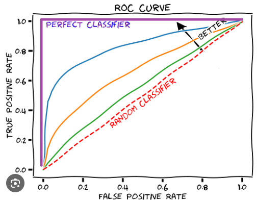
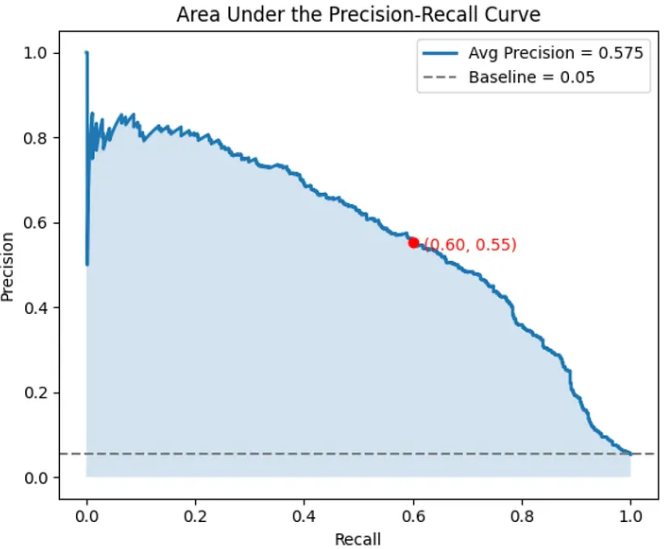
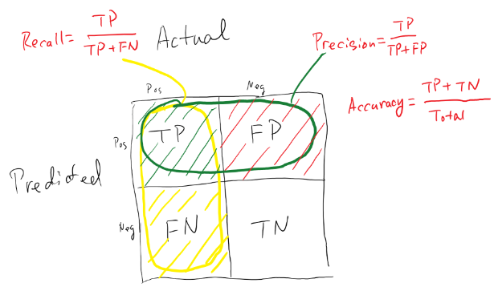

## Classification

### Threshold-Free

#### Area Under the ROC Curve (AUC)



AUC is influenced by the probability ranking result only, and it is not related to the setting of the classification threshold.


#### Area under Precision-Recall Curve (AUPRC) / Average Precision

AUPRC measures **how well the model balances precision and recall** across thresholds. The Precision Recall curve **does not care about True Negatives**. 

For imbalanced data, a large quantity of True Negatives usually overshadows the effects of changes in other metrics like False Positives. The AUCPR will be much more sensitive to True Positives, False Positives, and False Negatives than AUC. As such, AUPRC is recommended over AUC for highly imbalanced data. 

The baseline of AUPRC is equal to the fraction of positives.



### Threshold Dependent



- **Recall (sensitivity) / True Positive Rate**: Out of all the positive classes, how much we predicted correctly.

- **Precision**: Out of all the positive classes we have predicted, how many are actually positive.

- **F score**: helps to measure Recall and Precision at the same time using Harmonic Mean. 

    $F-score = 2*recall*precision / (recall + precision)$

- **False Positive Rate (Type I Error)**: FPR = FN / N = FN / (FP+TN). The proportion of all truly negative cases that the test wrongly identifies as positive.

## Competing Risk Analysis (Multi-Class Survival Analysis)

### 1. Standard Condordance Index (C-Index)

- Idea: It measures how well a model ranks patients by risk i.e. patients who lived longer should have been assigned a lower risk than patients who lived less long. 
- Steps of calculation for a specific event type
    1. **Generate predicted risk scores**: Obtain a single, overall predicted risk score for the event of interest from your chosen model.
    2. **Identify comparable pairs**: For a pair of subjects (i, j) to be comparable for Event Type 1:

        One subject (e.g., subject i) must have experienced Event Type 1.

        The other subject (e.g., subject j) must either:
        - Experience Event Type 1 at a later time.
        - Be censored at a later time than the event time of subject i.
        - Experience a competing event at a later time than the event time of subject i.
        - **Important consideration**: Subjects who experience a competing event before the time of the event of interest for the other subject are typically excluded from this comparison for that specific event type.
    3. **Count concordant/discordant pairs**: A pair is concordant if the subject with the higher predicted risk score for Event Type 1 is the one who experienced Event Type 1 earlier (among comparable pairs).
    4. **Calculate the C-index**: Similar to the single-event scenario, the C-index is the proportion of concordant pairs (plus 0.5 for indeterminate pairs) out of all comparable pairs.

- Implentation

    ```sksurv.metrics.concordance_index_censored```

    ```sksurv.metrics.concordance_index_ipcw```

    Output: One scalar for each of the event type
- Limitations
    - Biased if the distribution of censoring times in your test data is different from the true population distribution. i.e. overly optimistic with high censoring in the test set. 
  
        &rarr; IPCW version addresses this by using inverse probability of censoring weights obtained from training data.
    - In the case that censoring is not random or relate to people's characteristics (informative censoring), there will be selection bias. None of the two above address this.
  
    - It implicitly assumes the **risk ordering is static** and only evaluates ranking at the start (time 0). It assumes covariants influence survival in a time-invariant way (proportional hazards).

### 2. Time-dependent C-index

$C^{td}$-index extends the C-index by evaluating concordance **at each time point**:

$$C_{td} = P\big(\hat{F}_k(s_i \mid x_i) > \hat{F}_k(s_i \mid x_j) \;\big|\; s_i < s_j \big)$$

where $\hat{F}_k$ is the estimated cumulative incidence function (CIF) for cause k.

It checks whether the person who experienced the event earlier had a higher predicted event probability by that time. And it can properly capture time-varying and non-linear risk patterns.

- Steps of calculation for a specific event type

    1. **Generate time-dependent risk predictions**: Your model should output time-specific risk predictions for each event type (e.g., the cumulative incidence function, CIF). This means for each subject, you have a predicted risk of experiencing Event Type 1 by time \(t\).
    2. **Identify comparable pairs at time \(t\)**: For a given time \(t\), a pair of subjects \((i,j)\) is considered comparable if:
    
        1) Subject \(i\) experienced Event Type 1 by time \(t\) ($T_{i}\le t$ and Event Type is 1).
        
        2. Subject \(j\) did not experience Event Type 1 by time \(t\) ($T_{j}\gt t$ for Event Type 1, or experienced a competing event after $T_{i}$, or was censored after $T_{i}$. 

    3. **Count concordant/discordant pairs**: A pair is concordant if the subject with the higher predicted risk of Event Type 1 by time \(t\) is the one who actually experienced Event Type 1 by time \(t\).
    4. **Calculate the C'-index**: The time-dependent C-index at time \(t\) is the proportion of concordant pairs (plus 0.5 for indeterminate pairs) out of all comparable pairs at time \(t\)

- Implentation

```Python
import numpy as np
from lifelines import KaplanMeierFitter
def CensoringProb(Y, T):

    T = T.reshape([-1]) # (N,) - np array
    Y = Y.reshape([-1]) # (N,) - np array

    kmf = KaplanMeierFitter()
    kmf.fit(T, event_observed=(Y==0).astype(int))  # censoring prob = survival probability of event "censoring"
    G = np.asarray(kmf.survival_function_.reset_index()).transpose()
    G[1, G[1, :] == 0] = G[1, G[1, :] != 0][-1]  #fill 0 with ZoH (to prevent nan values)
    
    return G

### C(t)-INDEX CALCULATION: this account for the weighted average for unbaised estimation
def weighted_c_index(T_train, Y_train, Prediction, T_test, Y_test, Time):
    '''
        This is a cause-specific c(t)-index
        - Prediction      : The risk predictions for the test set at Time.  (higher --> more risky)
        - T_test   : The observed survival times from the test set.
        - Y_test   : The event indicator from the test set.
            > 1: death
            > 0: censored (including death from other cause)
        - Time            : time of evaluation (time-horizon when evaluating C-index)
    '''
    # estimate the censoring distribution from training data
    G = CensoringProb(Y_train, T_train) # [2, M] G[0,:] are the time points; G[1,:] are the estimated probabilities of being uncensored

    N = len(Prediction) # number of subjects in the test set.
    
    # initialized as (N,N) matrices to track pairs of subjects 
    A = np.zeros((N,N)) # event time comparison
    Q = np.zeros((N,N)) # risk comparison, multiply with A to track concordance
    N_t = np.zeros((N,N)) # time relevance mask

    Num = 0 # numerator of C-index: sum of weighted concordant pairs
    Den = 0 # denomenator of C-index: sum of weighted comparable pairs

    for i in range(N):

        # Calculate inverse prob of censoring weight for subject i:

        # find the index of the first time point in KM censoring curve G[0,:] >= i's event/censoring time
        tmp_idx = np.where(G[0,:] >= T_test[i])[0]

        if len(tmp_idx) == 0:
            W = (1./G[1, -1])**2
        else:
            # G[1, tmp_idx[0]] retrieves the est prob of being uncensored up to T_test[i]
            W = (1./G[1, tmp_idx[0]])**2

        # set the IPCW weight for all pairs (i,j) where T_test[i] < T_test[j] in A
        A[i, np.where(T_test[i] < T_test)] = 1. * W
        # identifies pairs in Q where the model predicts i is at higher risk
        Q[i, np.where(Prediction[i] > Prediction)] = 1. # give weights
        
        # masking by eval horizon: only subjects that have events within the time horizon are considered for comparison
        if (T_test[i]<=Time and Y_test[i]==1):
            N_t[i,:] = 1.
    
    # element-wise multiplication
    Num  = np.sum(((A)*N_t)*Q) # sum over concordant and relevant pairs
    Den  = np.sum((A)*N_t) # sum over all comparable pairs

    if Num == 0 and Den == 0:
        result = -1 # not able to compute c-index!
    else:
        result = float(Num/Den)

    return result
```

 - Interpretation: 

   - $C_{td}$=0.5 &rarr; model is no better than random guessing at time t
   - $C_{td}$ in [0.5-0.7] &rarr; some moderate discriminative power
   - $C_{td}$ >0.7 &rarr;strong discriminative accuracy
   - $C_{td}$=1.0 &rarr; Perfect ranking, every part who had an earlier event was assigned higher risk.

- Advantages
  - Because this index does not depend on a single fixed time, it provides an appropriate assessment for situations in which the influence of covariates on survival varies over time (in other words, risks are non-proportional over time).
  - Can generate a curve and compare models graphically, allowing a more comprehensive evaluation for a model's discriminative ability over time.
- Limitations
  - In the case that censoring is not random or relate to people's characteristics (informative censoring), there will be selection bias. 