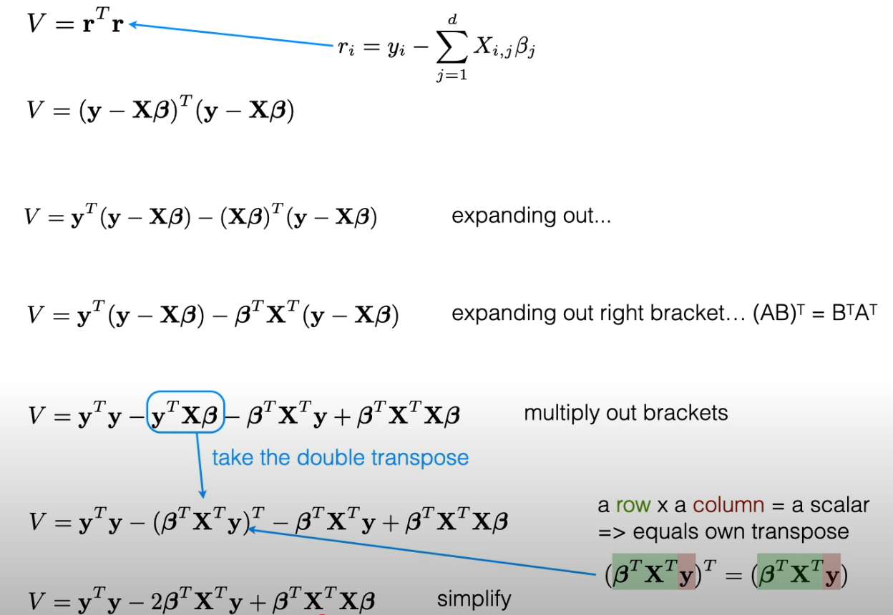

## 1. Solving Ordinary Least Squares (OLS) linear regression

### 1.1 Problem setup (matrix notation)

* Data:

  * $X \in \mathbb{R}^{m \times n}$: design matrix (each row is a training example, first column can be ones for intercept and in this case n+1).
  * $y \in \mathbb{R}^{m \times 1}$: target vector.
* Parameters: $\theta \in \mathbb{R}^{n \times 1}$.
* Model prediction:

  $$
  \hat{y} = X\theta
  $$


### 1.2 Cost function (least squares)

We want to minimize the mean squared error (MSE):

$$
J(\theta) = \frac{1}{2m} \|X\theta - y\|^2
= \frac{1}{2m} (X\theta - y)^\top (X\theta - y).
$$

(The factor $\tfrac{1}{2m}$ is just convention: makes gradient simpler.)

This is a scalar. Minimizing $J(\theta)$ finds the ordinary least squares solution.

### 1.3 Normal Equation Solution


 
 

#### NumPy implementation

```python
import numpy as np
def linear_regression_normal_equation(X: list[list[float]], y: list[float]) -> list[float]:
	# Your code here, make sure to round
    X = np.asarray(X) # (m,n)
    y = np.asarray(y).reshape(-1,1) # (m,1)

    # method 1: solve()
    theta = np.linalg.solve(X.T@X, X.T@y) 

    # method 2: inv()
    theta = np.linalg.inv(X.T.dot(X)).dot(X.T).dot(y)
    theta = np.round(theta,4).flatten().tolist()
	return theta


```

#### Practical notes (invertibility, stability, regularization)

* **Singular / ill-conditioned**: If columns of $X$ are linearly dependent or nearly so, $X^\top X$ may be singular or ill-conditioned. $X^\top X$ may not be invertible. Don’t blindly use `inv`.
* **Use `solve` or `pinv`**:

  * `np.linalg.solve(X.T@X, X.T@y)` solves the linear system more stably than inverting explicitly.
  * `np.linalg.pinv(X).dot(y)` (Moore–Penrose pseudo-inverse) is robust: it returns the least-norm solution even when $X^\top X$ is singular.
* **Regularization (Ridge)**: to stabilise and prevent overfitting, add $\lambda I$:

  $$
  \theta = (X^\top X + \lambda I)^{-1} X^\top y.
  $$

  If you don’t want to penalize the bias (intercept), set the first diagonal element of the regularizer to 0.
* **Complexity**: computing $(X^\top X)^{-1}$ costs about $O(n^3)$ where $n$ is number of features. For large $n$ prefer iterative methods (gradient descent) or factorization (QR, SVD).

---

#### General NumPy implementation with Regularization

```python
import numpy as np

def normal_equation(X, y, add_intercept=True, reg=0.0):
    """
    Solve linear regression via the normal equation.
    X: (m, d) feature matrix (without intercept column)
    y: (m,) or (m,1) target vector
    add_intercept: if True, adds a column of ones as first column
    reg: ridge regularization strength (lambda). If 0.0, no regularization.
         Note: intercept is NOT regularized.
    Returns theta: shape (n, ) where n = d + 1 if add_intercept else d
    """
    X = np.asarray(X)
    y = np.asarray(y).reshape(-1, 1)  # (m,1)

    if add_intercept:
        X = np.column_stack((np.ones(X.shape[0]), X))  # (m, n)
    # Normal matrix
    XtX = X.T @ X            # (n, n)
    Xty = X.T @ y            # (n, 1)

    n = XtX.shape[0]
    if reg and reg > 0.0:
        # regularize but do NOT regularize the intercept (first diag element)
        reg_mat = reg * np.eye(n)
        if add_intercept:
            reg_mat[0, 0] = 0.0
        XtX_reg = XtX + reg_mat
    else:
        XtX_reg = XtX

    # Try a stable solve; fallback to pseudo-inverse if necessary
    try:
        theta = np.linalg.solve(XtX_reg, Xty)   # robust linear solve
    except np.linalg.LinAlgError:
        # singular — use pseudo-inverse
        theta = np.linalg.pinv(XtX_reg) @ Xty

    return theta.ravel()  # return 1D array
```


### 1.4 Gradient Descent Solution

We start from the cost function

$$
J(\theta)=\frac{1}{2m}\|X\theta-y\|_2^2
=\frac{1}{2m}(X\theta-y)^\top (X\theta-y).
$$

Let $r(\theta)=X\theta-y$ (the residual vector). Then

$$
J(\theta)=\frac{1}{2m}\,r(\theta)^\top r(\theta).
$$

Use the chain rule for vector derivatives. The derivative of $\tfrac{1}{2}\,r^\top r$ w\.r.t. $r$ is $r$. Then $\frac{\partial{r}}{\partial\theta} = X$. So

$$
\nabla_\theta J(\theta)
= \frac{1}{2m}\cdot 2X^\top r(\theta)
= \frac{1}{m} X^\top (X\theta - y).
$$
- Why $X^T$?

    - Intuition: X maps parameters θ to predictions Xθ. When we go backward (from loss back to parameters), we need to “reverse” this mapping. That reversal naturally uses $X^T$.
    - $X^T$ maps the gradient back from residual-space (m-dim) to parameter-space (n-dim) 


That yields the desired result:

$$
\boxed{\nabla_\theta J(\theta)=\frac{1}{m}X^\top (X\theta-y).}
$$

This is the vector of partial derivatives (one per coefficient).


#### Gradient descent update rule

Gradient descent updates parameters in the **opposite** direction of the gradient:

$$
\theta \; \leftarrow \; \theta - \alpha \,\nabla_\theta J(\theta)
$$

Substitute gradient:

$$
\theta \; \leftarrow \; \theta - \alpha \cdot \frac{1}{m} X^\top (X\theta - y)
$$

where:

* $\alpha > 0$ is the learning rate,
* $\frac{1}{m} X^\top (X\theta - y)$ is the gradient.

#### Element-wise (for intuition)

For each coefficient $\theta_j$:

$$
\theta_j \; \leftarrow \; \theta_j - \alpha \cdot \frac{1}{m} \sum_{i=1}^m \Big( (x^{(i)} \cdot \theta - y^{(i)}) \, x^{(i)}_j \Big)
$$

* $x^{(i)}$ = $i$-th training row vector,
* $x^{(i)}_j$ = feature $j$ of sample $i$.

So each weight is nudged by how much that feature contributes to prediction error.


#### NumPy code skeleton

```python
import numpy as np

def gradient_descent(X, y, lr=0.01, epochs=1000, add_intercept=True):
    """
    Solve linear regression via batch gradient descent.
    X: (m, d) feature matrix
    y: (m,) target vector
    lr: learning rate
    epochs: number of iterations
    """
    m = X.shape[0]
    y = y.reshape(-1, 1)

    if add_intercept:
        X = np.column_stack([np.ones(m), X])  # add bias column

    n = X.shape[1]
    theta = np.zeros((n, 1))  # init weights

    for _ in range(epochs):
        # predictions
        y_pred = X @ theta # (m,1)
        # gradient
        grad = (1/m) * (X.T @ (y_pred - y))
        # update
        theta -= lr * grad

    return theta.ravel()
```


#### Variants

* **Batch gradient descent** (above): uses all data each update.
* **Stochastic gradient descent (SGD):** updates on one sample at a time.
* **Mini-batch GD:** compromise between the two.


✅ **Final takeaway formula (for coding):**

$$
\theta \; \leftarrow \; \theta - \alpha \cdot \frac{1}{m} X^\top (X\theta - y)
$$

Quick dimensional sanity check

* $X$ is $m\times n$, $\theta$ is $n\times1$, $y$ is $m\times1$.
* $X\theta-y$ is $m\times1$. Multiplying by $X^\top$ ($n\times m$) gives $n\times1$ — same shape as $\theta$. ✅
---

## 2. Solving Ridge regression (L2 regularization)

### 2.1 — Objective Function and Gradient Descent

#### Notation (same as before)
* $X\in\mathbb{R}^{m\times n}$ data matrix (rows = examples). If you want intercept, add a column of ones.
* $y\in\mathbb{R}^{m}$ target vector (use column vector $m\times1$ in algebra).
* $\theta\in\mathbb{R}^n$ parameters.
* Cost (base MSE): $J(\theta)=\frac{1}{2m}\|X\theta-y\|^2$.
* Learning rate: $\alpha$.
* Regularization strength: $\lambda$ (nonnegative).

#### Objective function:

$$
J_{\text{ridge}}(\theta) = \frac{1}{2m}\|X\theta - y\|^2 + \lambda\|\theta\|_2^2
$$

* Added term: $\lambda \|\theta\|_2^2 = \lambda \sum_j \theta_j^2$.
  (Usually the intercept is not penalized.)

* Closed form solution exists:

$$
\hat{\theta}_{\text{ridge}} = (X^\top X + \lambda I)^{-1}X^\top y.
$$

* **Effect:** Shrinks coefficients toward zero (but never exactly zero).
  Helps when predictors are correlated, reduces variance, improves stability.

* Geometric picture: constraint region is a circle/ellipse ($L_2$ ball).


**Gradient** (for all coefficients including intercept; then we’ll remove reg for intercept):

$$
\nabla_\theta J_{\text{ridge}}
= \frac{1}{m}X^\top (X\theta - y) + \lambda\theta.
$$

**Gradient descent update:**

$$
\theta \leftarrow \theta - \alpha\left(\frac{1}{m}X^\top(X\theta-y) + \boxed{\lambda\theta}\right).
$$

**If you do not regularize intercept** ($\theta_0$), implement by setting the regularization term for index 0 to zero.

### 2.2 **NumPy implementation (batch GD):**

```python
import numpy as np

def ridge_gd(X, y, lr=0.01, epochs=1000, reg=1.0, add_intercept=True):
    X = np.asarray(X)
    y = np.asarray(y).reshape(-1,1)
    m = X.shape[0]
    if add_intercept:
        X = np.column_stack([np.ones(m), X])
    n = X.shape[1]
    theta = np.zeros((n,1))

    for _ in range(epochs):
        pred = X @ theta                # (m,1)
        grad = (1/m) * (X.T @ (pred - y))  # (n,1)
        # regularization (do not regularize intercept)
        reg_vec = reg * theta
        if add_intercept:
            reg_vec[0,0] = 0.0
        grad += reg_vec
        theta -= lr * grad
    return theta.ravel()
```

**Notes:** ridge also has a closed-form: $\theta=(X^\top X + \lambda I)^{-1}X^\top y$ (skip first diagonal if not regularizing intercept).


## 3. Lasso regression (L1 regularization)

### 3.1 Problem and Objective

Another common setup where the bias term needs to be explicitly updated:

* Data: $X \in \mathbb{R}^{m \times d}$, $y \in \mathbb{R}^m$.
* Parameters: weights $\theta \in \mathbb{R}^d$, bias (intercept) $b \in \mathbb{R}$.
* Predictions: $\hat y = X\theta + b$.
* Residual: $e = X\theta + b - y$ (exactly same as ridge and OLS, with explicit bias term).
* Learning rate: $\alpha$.
* Regularization strength: $\lambda$ (nonnegative).

Cost function:

$$
J(\theta,b) = \frac{1}{2m}\|e\|^2 + \lambda\|\theta\|_1.
$$

- Bias is **not penalized**.

* Added term: $\|\theta\|_1 = \sum_j |\theta_j|$.

- The $L_1$ term is **not differentiable** at zero → you use subgradient methods, coordinate descent, or **proximal gradient** (ISTA / FISTA). 

* No closed form — must solve via iterative methods (coordinate descent, subgradient methods).

* **Effect:** Some coefficients are forced to *exactly zero* → performs **feature selection**.

* Geometric picture: constraint region is a diamond ($L_1$ ball). Corners of the diamond align with axes, encouraging sparse solutions.

### 3.2 Gradient Descent Methods for L1 Term

#### 1. Subgradient Descent

* Gradient w\.r.t. $w$:

$$
g_{\theta} = \frac{1}{m} X^\top e + \boxed{\lambda\,\text{sign}(\theta)}.
$$

* Gradient w\.r.t. $b$:

$$
g_b = \frac{1}{m}\sum_i e_i.
$$

* Update:

$$
\theta \leftarrow \theta - \alpha g_{\theta}, \quad b \leftarrow b - \alpha g_b.
$$

⚠️ Produces approximate zeros, may converge slowly.

#### 2. Proximal gradient (ISTA) update (Preferred)

1. take a gradient step for the smooth MSE part:

    $$
    z_{\theta} = \theta - \alpha \cdot \frac{1}{m} X^\top e,\quad 
    z_b = b - \alpha \cdot \frac{1}{m}\sum_i e_i.
    $$

2. apply the proximal operator for $\ell_1$ (soft-thresholding) on weights and leave the bias term as is:

   $$
   \theta_j \leftarrow S_{\alpha \lambda}(z_j)
   $$

   where the soft-threshold operator $S_{\tau}$ is:

   $$
   S_{\tau}(z) = \begin{cases}
     z - \tau & \text{if } z > \tau,\\
     0        & \text{if } |z|\le \tau,\\
     z + \tau & \text{if } z < -\tau.
   \end{cases}
   $$

    Equivalent to:

    $$
    w_j \leftarrow \text{sign}(z_j)\cdot \max(|z_j| - \alpha \lambda, 0).
    $$

    $$
    b \leftarrow z_b \quad (\text{no shrinkage}).
    $$

✅ Produces exact zeros, faster and more stable than subgradient.

- **Why this works:** ISTA solves the composite minimization (smooth + nonsmooth convex) by alternating gradient and proximal steps; it converges (sublinear). FISTA is faster (accelerated).


| Method                                       | How L1 handled                                                         | Pros                                        | Cons                                           |
| -------------------------------------------- | ---------------------------------------------------------------------- | ------------------------------------------- | ---------------------------------------------- |
| **Subgradient descent**          | Uses $\text{sign}(w)$ as a valid subgradient                           | Simple to implement, looks like standard GD | Converges slowly, may not yield exact sparsity |
| **Proximal gradient (ISTA/FISTA)**  | Uses soft-thresholding as the proximal operator                        | Produces exact zeros, faster convergence    | Slightly more complex conceptually             |
| **Coordinate descent**                       | Updates each weight by solving 1D Lasso exactly (soft-threshold again) | Very efficient, standard in libraries like scikit-learn      | Harder to code from scratch for large-scale    |

### 3.3 Numpy Implementation

**NumPy implementation (Subgradient):**

```python
def lasso_subgradient_with_bias(X, y, lam=1.0, lr=0.01, max_iter=10000, tol=1e-6):
    '''
    lam: regularization paramter
    tol: gradient threshold
    '''
    X, y = np.asarray(X), np.asarray(y).reshape(-1, 1)
    m, n = X.shape
    w = np.zeros(n)
    b = 0.0

    for _ in range(max_iter):
        pred = X @ w + b
        err = pred - y # (m, 1) the direction pred - y is important and if flip the the gradients would need to flop sign as well.

        grad_w = (X.T @ err) / m + am  * np.sign(w)
        grad_b = np.sum(err) / m

        w_new = w - lr * grad_w
        b_new = b - lr * grad_b

        if np.linalg.norm(w_new - w) < tol and abs(b_new - b) < tol:
            break
        w, b = w_new, b_new

    return w.ravel(), float(b)
```
**NumPy implementation (ISTA / proximal GD):**

```python
def soft_threshold(z, tau):
    return np.sign(z) * np.maximum(np.abs(z) - tau, 0.0)

def lasso_proximal_gd(X, y, lr=0.01, epochs=1000, reg=1.0, add_intercept=True):
    X = np.asarray(X)
    y = np.asarray(y).reshape(-1,1)
    m = X.shape[0]
    if add_intercept:
        X = np.column_stack([np.ones(m), X])
    n = X.shape[1]
    theta = np.zeros((n,1))
    tau = lr * reg  # threshold parameter

    for _ in range(epochs):
        pred = X @ theta
        grad = (1/m) * (X.T @ (pred - y))   # gradient of MSE part
        z = theta - lr * grad               # gradient step
        # apply soft-threshold to non-intercept terms
        if add_intercept:
            theta[0,0] = z[0,0]            # do not shrink intercept
            theta[1:,0] = soft_threshold(z[1:,0], tau)
        else:
            theta[:,0] = soft_threshold(z[:,0], tau)
    return theta.ravel()
```

**Alternative / notes:**

* Coordinate descent (scikit-learn's Lasso uses it for small/medium problems) is often faster and exact for Lasso.
* For stability, standardize features (zero mean, unit variance) before Lasso; then unscale coefficients afterwards.
* Choose `lr` (step-size) carefully. For proximal GD, a safe step-size is $\alpha < 1/L$ where $L$ is the Lipschitz constant of the gradient of the quadratic part; for MSE it is $L = \frac{1}{m}\lambda_{\max}(X^\top X)$. In practice, inspect convergence or use backtracking / small lr (e.g., 1e-3–1e-1 depending on X scale).


#### Side-by-side comparison

| Method            | Regularizer | Closed-form? | Coefficients       | Use case                                           |
| ----------------- | ----------- | ------------ | ------------------ | -------------------------------------------------- |
| Linear regression | None        | ✅ Yes        | Unconstrained      | Baseline, but unstable with multicollinearity (design matrix is singular)      |
| Ridge regression  | L2 norm     | ✅ Yes        | Shrunk, never zero (shrinkage) | Stabilizes coefficients, handles multicollinearity |
| Lasso regression  | L1 norm     | ❌ No    (L1 norm nondifferentiable at 0)     | Some exactly zero (sparsity)  | Feature selection, sparse models                   |

Intuition

* **Linear regression:** “fit as close as possible.”
* **Ridge** is shrinkage: “fit close, but don’t let coefficients get too large.”
* **Lasso** is sparsity + shrinkage: “fit close, but only keep a few features active.”
* Both are regularized versions of linear regression, adding a penalty to discourage overly complex models.


## 4. Elastic Net Regression (Hybrid of Ridge and Lasso)

Elastic Net Regression combines both L1 (Lasso) and L2 (Ridge) regularization techniques to overcome the limitations of using either regularization method alone. It's particularly useful when dealing with datasets that have many correlated features.

## What is Elastic Net?

Elastic Net addresses two main issues:
- **Lasso's limitation**: When features are highly correlated, Lasso tends to select only one feature from a group of correlated features arbitrarily
- **Ridge's limitation**: Ridge regression doesn't perform feature selection (coefficients approach zero but never become exactly zero)

The goal of Elastic Net is to minimize the objective function:

$$J(w, b) = \underbrace{\frac{1}{2n} \sum_{i=1}^n\left( y_i - \left(\sum_{j=1}^pX_{ij}w_j+b\right)\right)^2}_{\text{MSE Loss}} + \underbrace{\alpha_1 \sum_{j=1}^p |w_j|}_{\text{L1 Regularization}} + \underbrace{\alpha_2 \sum_{j=1}^p w_j^2}_{\text{L2 Regularization}}$$

Where:
* The first term is the **Mean Squared Error (MSE) Loss**: $\frac{1}{2n} \sum_{i=1}^n\left( y_i - \left(\sum_{j=1}^pX_{ij}w_j+b\right)\right)^2$
* The second term is the **L1 Regularization** (Lasso penalty): $\alpha_1 \sum_{j=1}^p |w_j|$
* The third term is the **L2 Regularization** (Ridge penalty): $\alpha_2 \sum_{j=1}^p w_j^2$
* $\alpha_1$ controls the strength of L1 regularization
* $\alpha_2$ controls the strength of L2 regularization

## Step-by-Step Implementation Guide

### 1. Initialize weights $w_j$ and bias $b$ to 0

### 2. Make Predictions
At each iteration, calculate predictions using:
$$\hat{y}_i = \sum_{j=1}^pX_{ij}w_j + b$$

Where:
- $\hat{y}_i$ is the predicted value for the $i$-th sample
- $X_{ij}$ is the value of the $i$-th sample's $j$-th feature
- $w_j$ is the weight associated with the $j$-th feature

### 3. Calculate Residuals
Find the difference between actual and predicted values: $error_i = \hat{y}_i - y_i$

### 4. Update Weights and Bias Using Gradients

**Gradient with respect to weights:**
$$\frac{\partial J}{\partial w_j} = \frac{1}{n} \sum_{i=1}^nX_{ij}(\hat{y}_i - y_i) + \alpha_1 \cdot \text{sign}(w_j) + 2\alpha_2 \cdot w_j$$

**Gradient with respect to bias:**
$$\frac{\partial J}{\partial b} = \frac{1}{n} \sum_{i=1}^n(\hat{y}_i - y_i)$$

**Update rules:**
$$w_j = w_j - \eta \cdot \frac{\partial J}{\partial w_j}$$
$$b = b - \eta \cdot \frac{\partial J}{\partial b}$$

Where $\eta$ is the learning rate.

### 5. Check for Convergence
Repeat steps 2-4 until convergence. Convergence is determined by evaluating the L1 norm of the weight gradients:

$$||\nabla w||_1 = \sum_{j=1}^p \left|\frac{\partial J}{\partial w_j}\right|$$

If $||\nabla w||_1 < \text{tolerance}$, stop the algorithm.

### 6. Return the Final Weights and Bias

## Key Parameters

- **alpha1**: L1 regularization strength (promotes sparsity)
- **alpha2**: L2 regularization strength (handles correlated features)
- **learning_rate**: Step size for gradient descent
- **max_iter**: Maximum number of iterations
- **tol**: Convergence tolerance
Path
## Key Differences from Lasso and Ridge

1. **Lasso (L1 only)**: Tends to select one feature from correlated groups, can be unstable with small sample sizes
2. **Ridge (L2 only)**: Keeps all features but shrinks coefficients, doesn't perform feature selection
3. **Elastic Net (L1 + L2)**: Combines benefits of both - performs feature selection while handling correlated features better than Lasso alone

The balance between L1 and L2 regularization is controlled by the `alpha1` and `alpha2` parameters, allowing you to tune the model for your specific dataset characteristics.