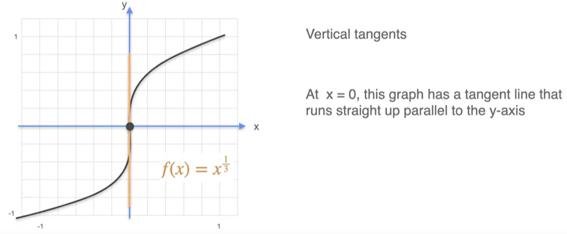
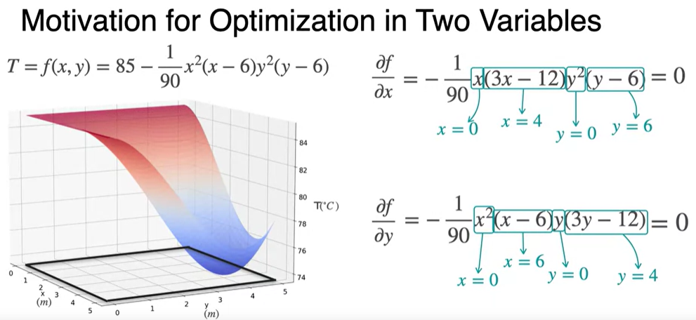
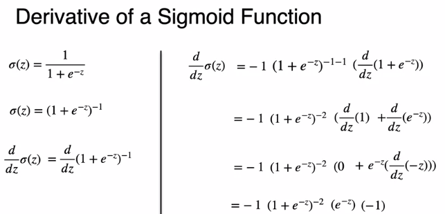

### 1. Derivatives

Derivatives are used to maximize or minimize functions, which is crucial when finding the best model to fit data. 

#### 1.1 Intuition/Analogy

**Average velocity** is the total distance traveled divided by the total time taken, while **instantaneous velocity** is the velocity at a specific moment in time.

Given a table of values showing the distance traveled every five seconds for one minute, we can calculate the average velocity in a given interval, b ut we cannot determine the velocity at a specific instant without more refined measurements. **By taking even finer intervals, we can further improve our estimate of the velocity at a specific instant.** This leads us to the concept of the derivative.

#### 1.2 Derivatives and Tangents

The **instantaneous rate of change**, also known as the derivative, measures how fast the relation between two variables is changing at any point. The derivative of a function at a point is precisely the **slope of the tangent line at that point ($dx/dt$)**.

When finding the maximum or minimum in a function, these points occur where the derivative is zero or where the tangent line is horizontal.

#### 1.3 Some Common Derivatives

1. Lines: For f(x) = ax + b, f'(x) = a, where a is the slope and b is the y-intercept.

2. Quadratics: 

3. Higher degree polynomials:

4. Other power functions:

For a function $f(x) = x^n$, where n is a constant exponent, then the derivative of this function is given by: $f'(x) = n*x^{n-1}$

5. Trigonometric functions:
   
   For $f(x) = sin(x)$, $f'(x) = cos(x)$  
   For $f(x) = cos(x)$, $f'(x) = -sin(x)$ 

#### 1.4 Inverse Function and its Derivative

Let f be a function that maps elements from a set A to a set B. The inverse function of f, denoted as $f^{-1}$, is a function that maps elements from set B back to set A, such that for every element y in set B, if f(x) = y, then $f^{-1}(y) = x$. 

In other words, the inverse function undoes the action of the original function, allowing us to retrieve the original input from the output.

#### 1.5 Exponential and logarithm functions

**Euler's number e** is a special number in mathematics that appears in various branches and can be defined in different ways. One way to define it is by the numerical value 2.71828182, etc. 

Another way is using the expression $(1+1/n)^n$. The more we increase n, the closer this expression converges to the number e, which is approximately 2.71828182. One example of n is the number of times a bank assign interests.

- If $f(x) = e^x$, then $f'(x) = e^x$. The derivative of the exponential function is itself.

The **logarithm** of a number x is the exponent to which the base e (Euler's number) must be raised to obtain x. It is denoted as log(x) or ln(x) for the natural logarithm.

The exponential function $e^x$ and the logarithmic function $log(x)$ are inverses of each other. This means that if we reflect one function about the line y = x, we get the other function.
- If $f(x) = log(x)$, then $f'(x) = 1/x$.
  

#### 1.6 Existence of derivatives

A differentiable function is a function that **has a derivative at every point** in its domain. In other words, a differentiable function is one for which you **can find the slope of the tangent line at any point on the function's graph**. If a function is differentiable, it means that it is smooth and has no abrupt changes or discontinuities.

Examples of different types of non-differentiable functions:

1. functions with corners or cusps

2. functions with jump discontinuities

3. functions with vertical tangents (vertical has no well-defined slope, rise can be any number while run is 0)

#### 1.7 Properties of the derivative

1. Scalar multiplication: 
   if $f=cg$, where c is a constant, then $f'=cg'$.
2. Sum rule:
   if $f=g+h$, then $f'=g'+h'$.

3. Product rule (like hitting a hammer on each element):
   if $f=gh$, then $f'=g'h+gh'$.
4. Chain rule based on two notations:
   
   e.g. If $f(x) = e^{2x}$, then $f(x) = g(2x)$, $f'(x)=2e^{2x}$. 

#### 1.8 Differentiation Methods in Python
1. Symbolic Differentiation with SymPy: 
   
   Symbolic computation deals with the computation of mathematical objects that are represented exactly, not approximately. For differentiation it would mean that the output will be somehow similar to if you were computing derivatives by hand using rules (analytically). Thus, symbolic differentiation can produce exact derivatives. 
   
   Cons - unefficiently slow computations and very complicated function as an output (expression swell) when there is a "jump" in the derivative

2.  Numerical Differentiation with NumPy :  
   This method does not take into account the function expression. The only important thing is that the function can be evaluated in the nearby points $x$ and $x+\Delta x$, where $\Delta x$ is sufficiently small. Then $\frac{df}{dx}\approx\frac{f\left(x + \Delta x\right) - f\left(x\right)}{\Delta x}$, which can be called a **numerical approximation** of the derivative.  
   Cons -  1) inaccurate at the points where there are "jumps" of the derivative; 2)  slow speed and requires function evalutation every time.

3. Automatic Differentiation:  
   It breaks down the function into common functions ( 𝑠𝑖𝑛,  𝑐𝑜𝑠,  𝑙𝑜𝑔, power functions, etc.), and constructs the computational graph consisting of the basic functions. Then the chain rule is used to compute the derivative at any node of the graph. It is the most commonly used approach in machine learning applications and neural networks, as the computational graph for the function and its derivatives can be built during the construction of the neural network, saving in future computations.  
   **Autograd** and **JAX** are the most commonly used in the frameworks to build neural networks.

Computational efficiency: automatic > symbolic > numerical

### 2. Optimization

The main application of derivatives in machine learning is optimization. You want to find the model that best fits your dataset, and derivatives help you calculate an error function that tells you how far you are from an ideal model.

When you want to optimize a function, whether maximizing or minimizing it, and the function is differentiable at every point, then it is true that the candidates for maximum and minimum are those points for which the derivative is zero. These candidates are called local minima and the absolute minimum is called the global minimum.  

#### 2.1 Optimization of Squared Loss

Square loss is a **common loss function used in regression** problems, where the goal is to predict a continuous value. In square loss, the difference between the predicted value and the actual value is squared. The objective is to minimize the average squared difference between the predicted and actual values.

#### 2.2 Optimization of Log-loss

Log loss, also known as cross-entropy loss, is commonly used as a cost function in classification problems. It is particularly useful when dealing with binary classification tasks, where the goal is to classify instances into one of two classes.  

Coin flipping game as an example:

Regular derivative method is computationally complex.

Taking the logarithm of the probability function is shown to be a simpler way to find the optimal value. 

- Maximizing the logarithm of a function is equivalent to maximizing the original function itself.
- $log(xy)=log(x)+log(y)$
- $log(x^n) = nlog(x)$
- The negative of the logarithm of the probability function, $-G(p)$, is called the log loss. This is because $G(p)$ is a negative number when p is between 0 and 1. Keeping logloss a positive value is more intuitive. 
- To maximize the original function $g(p)$, we need to minimize $-G(p)$.

### 3. Gradients - related to functions with two or more variables

#### 3.1 Tangent plane
The tangent plane is a plane that represents the slope of a function at a specific point.  
  
To calculate the tangent plane, you need to fix one variable and calculate the tangent line, then fix the other variable and calculate another tangent line. These two lines intersect to form the tangent plane.  
  

#### 3.2 Partial Derivatives
If we have a function of more than two variables, we can take partial derivatives with respect to each variable. Partial derivative with respect to X is intuitively the slope of the tangent line when treating y as a constant. 
 

 
 

#### 3.3 Gradient

The gradient is a **vector that contains all the partial derivatives** of a function with respect to its variables. It is denoted by the symbol nabla f and represents the slopes of the tangent plane formed by the function. 

 

#### 3.4 Finding Maximum and Minimum 

For a function with two or more variables, the **minimum/maximum point occurs when all partial derivatives are equal to zero**. Like how we use derivatives to find the minimum, we set all partial derivatives to zero and solve the system of equations to find the minimum or maximum points. 
 

 
Then check each candidate individually to determine if it is the minimum point.
  

#### 3.5 Optimization using Gradients - Analytical Method

Linear Regression with powerline example:
 

In linear regression, the cost function is a measure of how well the model fits the data. It quantifies the difference between the predicted values and the actual values of the target variable. The most commonly used cost function in linear regression is the sum of squares, also known as the mean squared error. By minimizing the sum of squares, we are finding the line that best fits the data points, as it reduces the overall error between the predicted values and the actual values. This line represents the optimal solution for the linear regression problem, and it can be used to make predictions on new data points.

### 4. Gradient Descent

Some optimization functions are hard to solve analytically.

Instead of trying different directions, we can get smarter using a method called gradient desscent. 

#### 4.1. Optimization using gradient descent in one variable
The key idea is to **use the derivative of the function to determine the direction and magnitude of the step** towards the minimum. 

- By subtracting the slope from the current point, we can move closer to the minimum. 
- The learning rate, denoted as alpha, determines the size of the step taken. A smaller learning rate ensures smaller steps, providing more stability and accuracy in finding the minimum. 

- The gradient descent algorithm iteratively updates the current point by subtracting the learning rate multiplied by the derivative at that point. 
- This process is repeated until the steps taken become negligible, indicating that the minimum has been reached. 

#### 4.2 Limitations of gradient descent

1. There's no rule or definite method to find the best learning rate.

   The learning rate is a crucial parameter in machine learning that determines how quickly a model learns from the data. Finding the right learning rate can be challenging, as a rate that is too large may cause the model to miss the minimum, while a rate that is too small may result in slow convergence or failure to reach the minimum. 

2. Local Minima: Gradient descent, a commonly used optimization algorithm, may encounter the problem of getting stuck in local minima. Local minima are points that appear to be the minimum but are not the global minimum. To overcome this issue, running the gradient descent algorithm multiple times with different starting points can help find a good solution.

#### 4.3 Optimization using gradient descent in two variables

The algorithm starts with an initial position defined by two coordinates, $x_0$ and $y_0$. We calculate the gradient, which is the vector of partial derivatives with respect to x and y, and **move in the direction of the negative gradient**. This step is repeated until we are close enough to the minimum point. 

- Normalization helps to increase the efficiency: 
  
   - When original arrays X and Y have different units, the cost function will be much steeper. Then you would need to take a significantly smaller learning rate  𝛼
 , and the algorithm will require thousands of iterations to converge instead of a few dozens.  
   - To make gradient descent algorithm efficient, you need to bring them to the same units. A common approach to it is called normalization: substract the mean value of the array from each of the elements in the array and divide them by standard deviation (a statistical measure of the amount of dispersion of a set of values).  
   - When making predictions you need to normalize the inputs and denormalize the output as well.

#### 4.4 Common libraries for linear regression

1. np.Polynomial.fit and pass in a degree of 1, minimising the sum of squared errors. 
2. from sklearn.linear_model import LinearRegression

### 5. Optimization in Neural Networks
#### 5.1 Regression with Perceptron

A perceptron is the fundamental unit of a neural network. It is a mathematical model inspired by the way neurons work in the human brain. A perceptron takes multiple inputs, multiplies them by corresponding weights, and combines them to produce an output.

Key differences between perceptron and linear regression: 
- Activation Function: A perceptron uses an activation function to introduce non-linearity to the model. The activation function determines the output based on the input sum.
- Output: A perceptron can output continuous or discrete values, used for both classification and regression tasks.  
Overall, a perceptron is a more flexible and versatile model compared to a traditional linear regression model.  

- We square the errors to consider negative and positive errors equally.
- In machine learning, we also multiply it by a half. The reason is really more cosmetic because in reality, when you take the derivative, then you get a lingering two. We put a 1/2 there to cancel with that two and then we have less numbers to keep track on.  
  

By repeating this process, we can find optimal values for the weights and bias that result in a model with a small error.

  

#### 5.2 Training process for a simple Neural Network

  

Weight (𝑤) and bias (𝑏) are the parameters that will get updated when you train the model. They are initialized to some random values or set to 0 and updated as the training progresses.  

1. **Forward propagation** - calculate predicted output for all training samples: $Z=  w X + b$    , $\hat{Y}= Z$
2. For each training example, measure the difference between original values 𝑦(𝑖) and predicted values 𝑦̂ (𝑖) with the **loss function**: $𝐿(𝑤,𝑏)=1/2*(𝑦̂(𝑖)−𝑦(𝑖))^2$
3. Take an average of the loss function values for each of the training examples, which will be the **cost function**:

$$\mathcal{L}\left(w, b\right)  = \frac{1}{2m}\sum_{i=1}^{m} \left(\hat{y}^{(i)} - y^{(i)}\right)^2.$$

4. **Backward propagation**: calculate the adjustments for the weight and bias, minimizing the cost function.  
     

The general methodology to build a neural network is to:
1. Define the neural network structure ( # of input units, # of hidden units, etc).
2. Initialize the model's parameters.
3. Define a cost function
4. Loop (until the cost function stops decreasing):
   - Implement forward propagation (calculate the perceptron output)
   - Compute the cost
   - Implement backward propagation (calculate  gradients to get the required corrections for the parameters)
   - Update parameters.
5. Make predictions.
 
#### 5.3 Classification with Perceptron

The activation function transforms the continuous output of the prediction function into a binary or categorical prediction. In classification problems, the sigmoid function is commonly used as the activation function to convert the weighted sum into a probability value.
  

 The derivative of the sigmoid function is sigmoid times 1 minus sigmoid, which makes it easy to calculate and useful in various machine learning algorithms.
  
  

The log loss function measures the error between the predicted value (y-hat) and the actual value (y) in a classification problem. It calculates the logarithm of the predicted value if the actual value is 1, and the logarithm of the complement of the predicted value if the actual value is 0. 

The log loss function penalizes larger differences between the predicted and actual values, assigning a larger loss value when they are far apart and a smaller loss value when they are close to each other. 

  

#### 5.4 Classification with a Neural Network

 
 

Backpropagation is a method that involves calculating derivatives using the chain rule and using them to update the weights and biases of the neural network. 

 
 

### 6. Newton's Method

#### 6.1 Introduction

An optimization technique that can be used to find the zeros of a function. 

It can also be used for optimization by finding the zeros of the derivative of the function we want to minimize. By finding the zeros of the derivative, we are able to approximate the minimum of the function. 

#### 6.2 Second Derivative

The second derivative is the derivative of a derivative and it helps us determine if a point is a maximum or minimum in optimization problems by providing information about the curvature of a function. One example is acceleration, which is the rate of change of velocity with respect to time. 

If the second derivative is positive at a particular point, it indicates that the function is concave up at that point. In this case, if the first derivative is zero at that point, it suggests that the point is a **local minimum**.

 If the second derivative is negative at a particular point, it indicates that the function is concave down at that point. If the first derivative is zero at that point, it suggests that the point is a **local maximum**. 

#### 6.3 Hessian Matrix

Hessian matrix is a matrix containing second derivatives. 

Symmetry: The Hessian matrix is symmetric, which means that the order of differentiation does not matter. The second partial derivative with respect to x and y is the same as the second partial derivative with respect to y and x.

The Hessian matrix can provide information about the concavity or convexity of a function. If all the eigenvalues of the Hessian matrix are positive, then the function is convex. If all the eigenvalues are negative, then the function is concave.

#### 6.4 Newton's Method for two variables

Fast convergence: Newton's method converges to the minimum or maximum of a function quickly compared to gradient descent. However it can be **sensitive to the initial guess**. If the initial guess is far from the optimal solution or falls into a region with poor convergence properties, the method may fail to converge or converge to a local minimum or maximum instead of the global one.

Computational Complexity: The method involves calculating and inverting the Hessian matrix, which can be computationally expensive, especially for functions with a large number of variables.

### 7. Coding helps

For dot product
- method 1: * or np.multiply() perform element-wise multiplication; np.sum() sum up.
- method 2: np.dot directly returns the sum of vector product.  
  
For matrix multiplication, use @ for Python 3.5 or above, and np.matmul for earlier versions.