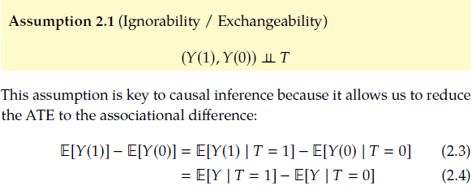

### 0. Motivation: Causation in Observational studies

Sometimes we can't always randomize treatment, i.e. for ethical reasons, infeasibility (macro-economic problems), impossibility. How do we measure causal effect in observational studies?

**Solution: block confounding association by controling for the right set of variables W.**

$E[Y(t)] = E[Y|T=t]=E_wE[Y|t,w]$


For example - treatment observations with Simpson's Paradox

- Treatment B's survival rate is higher overall. However when breaking down the patients by conditions, treatment A has a higher survival rate under each condition.
- This is due to the fact that patients' condition influences doctor's decision on treatments. Condition is a confounding variable.
- True causal effect has to be estimated based on the probabilities of different conditions.


### 1. Correlation doesn't imply causaltion, so what does imply causation?


Notation of Potential Outcomes:

- $Y_i(0)$ is the potential outcome for unit i without the treatment. 
- $Y_i(1)$ is the potential outcome for unit i with the treatment.


#### 1.1 **Individual treatment effect (ITE)**: measures the causal effect of a treatment on a specific individual. 
   
   $ITE_i = Y_i(1) - Y_i(0)$

**Fundamental problem of causal inference**:

We can never observe the same unit with and without treatment. We call the potential outcome that happened *factual* and the one that didn't happen *counterfactual*. We can never observe the individual treatment effect.

#### 1.2 **Average Treatment Effect**

- average treatment effect across all individuals. Given the fundamental problem of causal inference, it is typically estimated using techniques like RCT, matching, regression, inverse probability weighting, etc.

$ATE = E[Y_i(1) - Y_i(0)]=E[Y(1)]-E[Y(0)]$ (causal difference)

- When there is confounding, we can't just look at the difference between conditional expectations due to confounding assotiation:

$ATE\neq E[Y|T=1]-E[Y|T=0]$ (latter is called associational difference)

#### 1.3 What assumptions would make ATE simply reduces to the associational difference?
  - **Ignorability / Exchangeability**: $(Y(1), Y(0))\perp\kern-5pt\perp T$
  
    Intuitively, exchangeability means the treatment groups are comparable in all relevant aspects other than the treatment, so that if we were to exchange the treatments for two groups the expected value of potential outcomes remain the same. T has no causal parents.

  - **Identifiability**: a causal quantity (i.e. $E[Y(t)]$) is identifiable if we can compute it from a purely statistical quantity (i.e. $E[Y|t]$). 
  - Ignorability/exchangeability assumption is what makes a causal effect identifiable. 
  
    


#### 1.4 RCT can make the ignorability realistic
- In practice, we can make this assumption realistic by running randomized experiments, which force the treatment to not be caused by anything but a coin toss. 


#### 1.5 Breaking down Ignorability: 4 main assumptions for (causal quantity) identificability
  1) **Conditional Exchangeability / Conditional Ignorability / Unconfoundedness**: $(Y(1), Y(0))\perp\kern-5pt\perp T | X$
  
 - Intuition: if we condition on relevant confounding variables (common cause of T and Y), then maybe the subgroups will be exchangeable.

 - Identification of **Conditional Average Treatment Effect**: $CATE = E[Y(1)-Y(0)|X]$

    CATE measures the expected treatment effect for a specific subgroup defined by characteristics X.

    

 - Untestable nature: The main reason for moving from exchangeability to conditional exchangeability was that it seemed like a more realistic assumption. However, we often cannot know for certain if conditional exchangeability holds.

    Fortunately, that is not a problem in randomized experiments. Unfortunately, it is something that we must always be conscious of in observational data. Intuitively, the best thing we can do is to observe and fit as many covariates into - as possible to try to ensure unconfoundedness.

2) **Positivity/Overlap**: For all values of covariates x present in the population of interest (i.e. x such that P(X=x)>0), 
   
   $0<P(T=1|X=x)<1$
   
 - Positivity Intuition: if we have a positivity violation, that means that within some subgroup of the data, everyone always receives treatment or everyone always receives the control. It wouldn’t make sense to be able to estimate a causal effect of treatment vs. control in that subgroup since we see only treatment or only control. We never see the alternative in that subgroup.

 - Overlap Inuition: we want the covariate distribution of the treatment group $P(X|T=1)$ to overlap with the covariate distribution of the control group $P(X|T=0)$. 
   
3) **No interference**: my outcome is unaffected by anyone else’s treatment. Rather, it is only a function of my own treatment. Common violations could come from network effect.

4) **Consistency**: If the treatment is T, then the observed outcome Y is the potential outcome under T.

     $T=t => Y=Y(t)$ that is, $Y=Y(T)$

     Note that T is a random variable corresponding to the observed treatment, whereas t is a specific treatment value. Y(t) is the potential outcome for a specific treatment value, and Y(T) is for the actual value of treatment that we observe.

     This is sometimes referred to as “no multiple versions of treatment.” The treatment received by people under the same group should be consistent/identical. 

#### 1.6 The Adjustment Formula for Identifying ATE


Practical Considerations:
  
- **The Positivity-Unconfoundedness Tradeoff (Curse of Dimensionality)**: increasing the dimension of covariates could lead to a higher chance of satisfying unconfoundedness. However as the subgroups get smaller, there is a higher chance of violating positivity (which means the whole subgroup will either have treatment or control).

- What would happen with a severe posivitiy violation?
  
    Extrapolation error: Models will be forced to extrapolate in regions where no actual training observations are available ($P(T=1,X=x)=0, P(T=0,X=x)=0$) when they are used in the adjustment formula in place of the corresponding conditional expectations.

    

#### 1.7 ATE Estimation with an Example
- Terminologies

Causal estimand contains the potential outcome notation, whereas statistical estimand doesn't contain this conceptual notation but just have conditional expectations.

- An example with continuous outcome


  Method 1: Based on the adjustment formula, we can estimate ATE by taking the empirical mean over X.
  
  ```Python
  from sklearn.linear_model import LinearRegression
  Xt = df[['sodium', 'age', 'proteinuria']]
  y = df['blood_pressure']
  model = LinearRegression()
  model.fit(Xt, y)
  Xt1 = pd.DataFrame.copy(Xt)
  Xt1['sodium'] = 1
  Xt0 = pd.DataFrame.copy(Xt)
  Xt0['sodium'] = 0
  ate_est = np.mean(model.predict(Xt1) - model.predict(Xt0))
  print('ATE estimate:', ate_est)
  ```
  Method 2: take the coefficient of linear regression in front of T as the ATE estimate. 
  Severe limitation however is that it assumes the causal effect is the same for all individuals.

  ```Python
  Xt = df[['sodium', 'age', 'proteinuria']]
  y = df['blood_pressure']
  model = LinearRegression()
  model.fit(Xt, y)
  ate_est = model.coef_[0]
  print('ATE estimate:', ate_est)
  ```

### 2. Flow of Association and Causation in Graphs

#### 2.1 Graph Terminology

A graph is a collection of nodes (also called “vertices”) and edges that connect the nodes. A directed graph’s edges go out of a parent node and into a child node, with the arrows signifying which direction the edges are going. 

Two nodes are said to be **adjacent** if they are connected by an edge. 

A **path** in a graph is any sequence of adjacent nodes, regardless of the direction of the edges that join them. i.e. A->C->B.
A **directed path** is a path that consists of directed edges that are all directed in the same direction. i.e. A->C->D


If there is a directed path that starts at node X and ends at node Y, then X is an ancestor of Y, and  is a descendant of X.We will denote descendants of X by de(X). i.e. A is an ancestor of B, D, C.


The graphs we focus on for causal inference are mostly Dircted Acyclic Graph (DAGs), which are dirceted graphs without cycles.

If two parents X and Y share some child Z, but there is no edge connecting
X and Y, then X -> Z <- Y is known as an **immorality**.

#### 2.2 Bayesian Networks

- Intuition: 
  In general it takes exponential number of parameters to model the joint data association, whcih becomes intractable when n increases.

  
  An intuitive way to more efficiently model many variables together in a joint distribution is to only model local dependencies (i.e. if we have reasons to believe X4 only depends on X3). 

  Given a probability distribution and a corresponding DAG, we can formalize the specification of independencies with **local Markov assumption**.

- What are assumptions in 
- **Local Markov Assumption**: Given its parents in the DAG, A node X is independent of all its non-descendants.
  
  

- Bayesian Network Factorization: also known as the chain rule for Bayesian networks or Markov compatibility. For example, if P factorizes according to G, then P and G are Markov compatible. 

  

  Local Markov assumption and Bayesian network factorization are essentially equivalent.

- **Minimality assumption**: Stronger assumption on top of local Markov

  
  Local Markov assumption only gives us info about the independencies in P that a DAG implies and says nothing about the adjacent nodes. To get this guaranteed dependence between adjacent nodes, we will generally assume a slightly stronger assumption than the local Markov assumption: minimality.

  Because removing edges in a Bayesian network is equivalent to adding independencies, the minimality assumption is equivalent to saying that we can’t remove any more edges from the graph. In a sense, every edge is“active.”

Bayesian networks are the main probabilistic graphical model that causal graphical models (causal Bayesian networks) inherit most of their properties from.
  
#### 2.3 Causal Graphs

- What is a cause?
  
      A variable X is said to be a cause of a variable Y if Y can change in response to changes in X.
- Strict Causal Edges Assumption: 
  
      In a directed graph, every parent is a direct cause of all its children.

  In contrast, the non-strict causal edges assumption would allow for some parents to not be causes of their children. It would just assume that children are not causes of their parents. This allows us to draw graphs with extra edges to make fewer assumptions, just like we would in Bayesian networks, where more edges means fewer independence assumptions.
- Assumption Flowchart
  

  Note that the 2nd part of minimality is baked into Causal Edges Assumption already.

#### 2.4 Graphical building blocks

  

1. Chains and Folks

     - Chains and forks share the same set of dependences and independences. 
  
      In both structures, X1 and X2, X2 and X3 are dependent given minimal assumption. There are also association flows between X1 and X3, that is they are statistically dependent. 

      

     - Conditioning blocks the flow of association in chains and forks.
  
      When we condition on X2 in both graphs, it blocks the flow of association from X1 to X3. they become independent of each other. This is because of the local Markov assumption; each variable can locally depend on only its parents.

      

     - Proof of conditional independence in chains
    
    

2. Immoralities

   - In contrast to chains and forks, **in an immorality X1 and X3 are independent of each other**. Think of them simply as unrelated events that happen, which happen to both contribute to some common effect.
   - By the way, the common child in an immorality structure is called a **collider**. Because we have a collider on the path connecting X1 and X3, association does not flow through the path. This time the path is not blocked by conditioning; it is blocked by a collider.
  
    
  
   - Conditioning on the collider will unblock the association flow of its parents.
  
        
   - Conditioning on descendants of a collider also induces association in between the parents of the collider. Because there is a dircet causal path from the collider to its descendants, if we learn sth abouta  collider's descendant we usually also learn sth about the collider itself. In other words, a descendant of a collider can be thought of as a proxy for that collider.


#### 2.5 d-separation

  
  

 - **Global Markov assumption**: Given that probability distribution P is Markov with respect to some graph G, d-separation in graph G implies conditional independence in distribution P. It is equivalent to the local Markov assumption and are just jointly called Markov assumption.
 - In other words, We can tell if two nodes are not associated (no association flows between them) by whether or not they are d-separated.

- Examples of d-separation: conditioning on selected variables to block paths.
  
  
  Conditioning on W2 or W3 works the same.
  Conditioning on X1 blocks the path caused by conditioning on the collider X2.

#### 2.6 Flow of Association and Causation

Association flows along all unblocked paths and they are sysmetric (going with both directions). In causal graphs, causation flows along directed paths (asymmetric).

  

- d-separation implies that association is causation. 
  
  How can we ensure that the association we measure is causation, say, for measuring the causal effect of T on Y?
  
  We can do that by ensuring there is no non-causal association flowing between T and Y, that is, to make sure that T and Y are d-separated. 

### 3. Causal Models

  

#### 3.1 The do-operator and inerventional distribution

  

- In the regular notation for probability,we have conditioning, but that isn’t the same as intervening. Conditioning on T = t just means that we are restricting our focus to the subset of the population to those who received treatment t.
- In contrast, an intervention would be to take the whole population and give everyone treatment t.
- Math operator for intervention: $do(T=t)$ or shorthand $do(t)$

  

- Interventional distributions such as $P(Y|do(t))$ are conceptually quite different from the observational distribution P(Y) or P(Y, T, X). The former is obtained post intervention.
- If we can reduce an expression Q with *do* (causal estimand) to one without *do* (statistical estimand) in it, then Q is said to be *identifiable*.
  - When there's no confounding, $P(y|do(t))$ can be reduced to $P(y|t)$ through identification.
  - When there're confounders, the identified statistical estimand can be quite complex like below.
  
  

#### 3.2 Causal Mechanisms and Modularity Assumption

We can refer to the **causal mechanism** that generates $X_i$ as the condtional distribution of $X_i$ given all of its causes: $P(x_i|pa_i)$.

  

Intuition: In order to get many causal identification results, the main assumption we will make is that **interventions are local**. More specifically, we will assume that intervening on a variable $X_i$ only changes the causal mechanism for $X_i$; it does not change the causal mechanisms that generate any other variables. In this sense, **the causal mechanisms are modular**. Other names that are used for the modularity property are *independent mechanisms, autonomy, and invariance*.

  

1. If the i-th node is not in the intervention set, then the conditional probability of that node stays the same.
2. If the i-th node is in the intervention set, then the probability of that node is set by intervention.

- Manipulated graphs

Under the modularity assumption, the causal graph for interventional distributions is simply the same graph that was used for the observational joint distribution, but with all of the edges to the intervened node(s) removed. This is because the probability for the intervened factor has been set to 1, so we can just ignore that factor.
  

  

#### 3.3 Truncated Factorization

Modularity assumption and Markov assumption together gives us *causal Bayesian networks*.

  
  

Example Application:


Above example shows clearly how association is not causation. The difference between $P(y|do(t))$ and $P(y|t)$ is the difference between P(x) and P(x|t).

#### 3.4 Backdoor Adjustment


