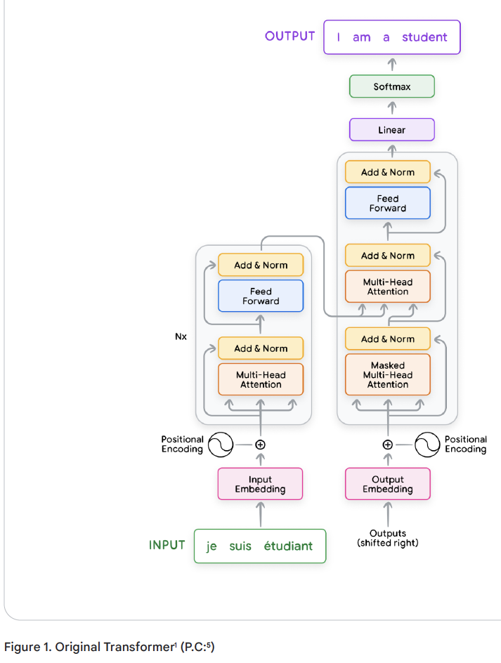
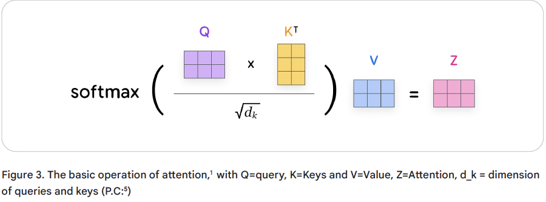
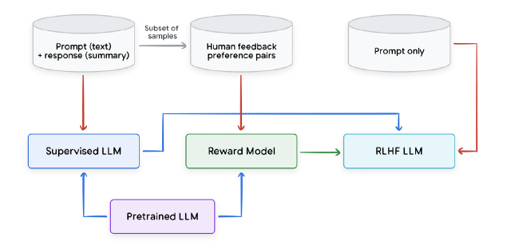
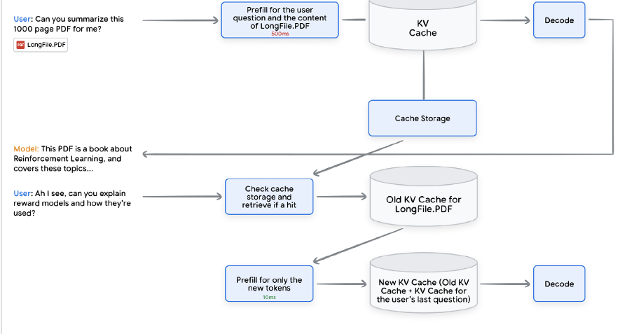

### LLMs and Transformer Architecture

A language model predicts the probability of a sequence of words. Commonly, when given a prefix of text, a language model assigns probabilities to subsequent words. 

Before the invention of transformers1, recurrent neural networks (RNNSs) were the popular approach for modeling sequences. In particular, “long short-term memory” (LSTM) and “gated recurrent unit” (GRU) were common architectures. The sequential nature of RNNs makes them compute-intensive and hard to parallelize during training (though recent work in state space modeling is attempting to overcome these challenges).

Transformers, on the other hand, are a type of neural network that can process sequences
of tokens in parallel thanks to the self-attention mechanism. This means that transformers
can better model long-term contexts and are easier to parallelize than RNNs. This makes
them significantly faster to train, and more powerful compared to RNNs for handling longterm
dependencies in long sequence tasks.

#### Transformer Overview

The original transformer architecture consists of two parts: an encoder and a
decoder. The encoder converts the input text (e.g., a French sentence) into a representation,
which is then passed to the decoder. The decoder uses this representation to generate the
output text (e.g., an English translation) autoregressively.

The transformer consists of multiple layers, which can be sub-divided into the input, hidden and output layers.
- The input layer (e.g., Input/Output Embedding) is the layer where the raw data enters the
network. Input embeddings are used to represent the input tokens to the model. Output
embeddings are used to represent the output tokens that the model predicts.
- Output layer (e.g., Softmax) is the final layer that produces the output of the network.
- The hidden layers (e.g., Multi-Head Attention) are between the input and output layers and are
where the magic happens!

#### Input preparation and embedding

1. Normalization (optional): Standardizes text by removing redundant whitespace, accents, etc.
2. Tokenization: Breaks the sentence into words or subwords and maps them to integer token IDs from a vocabulary.
3. Embedding: Converts each token ID to its corresponding high-dimensional vector,
typically using a lookup table. 
4. Positional Encoding: Adds information about the position of each token in the sequence
to help the transformer understand word order.

#### Multi-head Attention

Self-attention is a crucial mechanism in transformers; it enables them to focus on specific parts of the input sequence relevant to the task at hand and to capture long-range dependencies within sequences more effectively
than traditional RNNs.

1. Creating queries, keys, and values: Each input embedding is multiplied by three learned weight matrices (Wq, Wk, Wv) to generate query (Q), key (K), and value (V) vectors. These are like specialized representations of each word.
    - Query: The query vector helps the model ask, “Which other words in the sequence are
relevant to me?”
    - Key: The key vector is like a label that helps the model identify how a word might be
relevant to other words in the sequence.
    - Value: The value vector holds the actual word content information.

2. Calculating scores: Scores are calculated to determine how much each word should
‘attend’ to other words. This is done by taking the dot product of the query vector of one
word with the key vectors of all the words in the sequence.

3. Normalization: The scores are divided by the square root of the key vector dimension (dk)
for stability, then passed through a softmax function to obtain attention weights. These
weights indicate how strongly each word is connected to the others.

4. Weighted values: Each value vector is multiplied by its corresponding attention weight.
The results are summed up, producing a context-aware representation for each word.

Power of diversity: Multi-head attention employes multiple sets of Q, K, V weight matrices. They run in parallel, each head potentially focusing on different aspects of the input relationshsips. The outputs from each head are concatenated and linearly transformed, giving the model a richer representation of the input sequence.

#### Layer normalization and residual connections

Multi-head attention module and feed-forward layer both employ layer normalization and residual connections, which is the Add and Norm layer. Add corresponds to the residual connection and Norm corresponds to layer normalization. 

Layer normalization computes the mean and variance of the activations to normalize the activations in a given layer. This is typically performed to reduce covariate shift as well as improve gradient flow to yield faster convergence during training as well as improved overall performance.

Residual connections propagate the inputs to the output of one or more layers. This has the effect of making the optimization procedure easier to learn and also helps deal with vanishing and exploding gradients.

#### Feedforward layer

This layer applies a position-wise transformation to the data, independently for each position in the sequence. It typically consists of 2 linear transformations with a non-linear activation function, such as ReLU or GELU, in between. This  structure adds further representational power to the model.

#### Encoder and Decoder

The encoder has a primary function to process the input sequence into a continuous representation that holds contextual info for each token. The output from the encoder is a series of embedding vectors Z representing the entire input sequence.

The decoder is tasked with generating an output sequence based on the context provided by the encoder's output Z. It operates in a token-bytoken fashion, beginning with a start-of-sequence token. This iterative process continues until the decoder predicts an end-of-sequence token, thereby completing the output sequence generation.

The decoder layers employ two types of attention mechanisms: masked self-attention and encoder-decoder cross-attention. 
- Masked self-attention ensures that each position can only attend to earlier positions in the output sequence, preserving the auto-regressive property. This is crucial for preventing the decoder from having access to future tokens in the output sequence. 
- The encoder-decoder cross-attention mechanism
allows the decoder to focus on relevant parts of the input sequence, utilizing the contextual
embeddings generated by the encoder. 

#### Training the transformer

A typical transformer training loop consists of several parts: 
- First, batches of input sequences are sampled from a training dataset. For each input sequence, there is a corresponding target sequence. In unsupervised pre-training, the target sequence is derived from the input sequence itself. 
- The batch of input sequences is then fed into the transformer. The transformer generates predicted output sequences. 
- The difference between the predicted and target sequences is measured using a loss function (often crossentropy
loss)11. Gradients of this loss are calculated, and an optimizer uses them to update the transformer’s parameters. 
This process is repeated until the transformer converges to a certain level of performance or until it has been trained on a pre-specified number of tokens.

There are different approaches to formulating the training task for transformers depending on the architecture used:
1. Decoder-only models are typically pre-trained on the language modeling task. The target sequence for the decoder is simply a shifted version of the input sequence.
2. Encoder-only models like BERT are often pre-trained by corrupting the input sequence in some way and having the model try to reconstruct it. One such approach is masked language modeling (MLM).
3. Encoder-decoder models like the original transformer are trained on sequence-to-sequence supervised tasks such as translation, question-answering, and summarization. They could also be trained in an unsupervised fashion by converting other tasks into sequence-to-sequence format.

An additional factor to consider during training is the ‘context length’. This refers to the number of previous tokens the model can ‘remember’ and use to predict the next token in the sequence. Longer context lengths allow the model to capture more complex relationships and dependencies within the text, potentially leading to better performance. However, longer contexts also require more computational resources and memory, which can slow down
training and inference. Choosing an appropriate context length involves balancing these trade-offs based on the specific task and available resources.

### LLM Training Stages

1. Pre-training: foundational stage where an LLM is trained on large,
diverse, and unlabelled text datasets where it’s tasked to predict the next token given the previous context. The goal of this stage is to leverage a large, general distribution of data and to create a model that is good at sampling from this general distribution.

2. Full Fine-tuning / Instruction-tuning / Supervised Fine-tuning (SFT): SFT involves training an LLM on a set of task-specific demonstration datasets where its performance is also measured across a set of domain-specific tasks. It can also serve the purpose of helping the LLM improve its behavior to be safer, less toxic, more conversational, and better at following instructions.

    In this setting, each data point consists of an input (prompt) and a demonstration (target response). For example, questions (prompt) and answers (target response), translations from one language (prompt) to another language (target response), a document to summarize (prompt), and the corresponding summary (target response).

3. Reinforcement Learning from Human Feedback (RLHF): Typically occurs after performing SFT as a second stage of fine-tuning. It enables an LLM to better align with human-preferred responses (i.e. making its responses more helpful, truthful, safer, etc.).

Above shows a typical RLHF pipeline where a Reward model is initialized and finetuned on preference pairs. Once an RM has been trained, it’s then used by a Reinforcement Learning (RL) policy gradient algorithm, which further finetunes a previously instruction-tuned LLM to generate responses that are better aligned with human preferences.

4. Parameter Efficient Fine-Tuning (PEFT)

At a high-level, PEFT approaches append a significantly smaller set of weights (e.g., on the order of thousands of parameters) that are used to ‘perturb’ the pre-trained LLM weights. The perturbation has the effect of fine-tuning the LLM to perform a new task or set of tasks. This has the benefit of training a significantly smaller set of weights, compared to traditional fine-tuning of the entire model.

- Low-Rank Adaptation (LoRA): 
    - It uses two smaller matrices to approximate the original weight matrix update instead of fine-tuning the whole LLM.
    - This technique freezes the original weights and trains these update matrices, significantly reducing resource requirements with minimum additional inference latency.
    - improved variants such as QLoRA,48 which uses quantized weights for even
greater efficiency
    - plug-and-play - train a LoRA module that specializes in one task and easily replace it with another LoRA module trained on a different task.

- Soft prompting: a technique for conditioning frozen large language models with
learnable vectors instead of hand-crafted text prompts. These vectors, called soft
prompts, are optimized on the training data and can be as few as five tokens, making them parameter-efficient and enabling mixed-task inference.

- Adapter-based Fine-Tuning: employs small modules, called adapters, to the pretrained model. Only the adapter parameters are trained, resulting in significantly fewer parameters than traditional SFT.

### Using LLMs

#### Prompt Engineering

Few-shot prompting: This is when you provide the LLM with a task description, as well as a few (e.g. three to five) carefully chosen examples, that will help guide the LLM’s response.

Zero-shot prompting: This is when you provide the LLM directly with a prompt with
instructions.

Chain-of-thought prompting: This technique aims to improve performance on complex
reasoning tasks. Rather than simply asking the LLM a question, you provide a prompt
that demonstrates how to solve similar problems using step-by-step reasoning.

#### Sampling Techniques and Parameters

- Greedy search: Selects the token with the highest probability at each step. This is the simplest option but it can lead to repetitive and predictable outputs.
- Random sampling: Selects the next token according to the probability distribution, where each token is sampled proportionally to its predicted probability. This can produce more surprising and creative text, but also a higher chance of nonsensical output.
- Temperature sampling: Adjusts the probability distribution by a temperature parameter. Higher temperatures promote diversity, lower temperatures favor high-probability tokens.
- Top-K sampling: Randomly samples from the top K most probable tokens. The value of K controls the degree of randomness.
- Top-P sampling (nucleus sampling): Samples from a dynamic subset of tokens whose
cumulative probability adds up to P. This allows the model to adapt the number of potential candidates depending on its confidence, favoring more diversity when uncertain and focusing on a smaller set of highly probable words when confident.
- Best-of-N sampling: Generates N separate responses and selects the one deemed best according to a predetermined metric (e.g., a reward model or a logical consistency check).

### Accelerating Inference

Some optimization techniques can have an impact on the
model’s output. Therefore we will split the methods into two types: output-approximating and output-preserving.

#### Output-approximating methods

- Quantization: Quantization is the process of decreasing the numerical
precision in which weights and activations are stored, transferred and operated upon. The default representation of weights and activations is usually 32 bits floating numbers, with quantization we can drop the precision to 8 or even 4 bit integers.
    - reduce the memory footprint of the model, reduce the communication overhead of weights and activations in a distributed inference setup, faster arithmetic operations.
    - impact on quality can be very mild to non-existent depending on the use
case and model
    - Quantization can be either applied as an inference-only operation, or it can be incorporated into the training (referred to as Quantisation Aware Training QAT).

- Distillation: a set of training techniques that targets improving the quality of a smaller model
(the student) using a larger model (the teacher).
    1. data distillation or model compression: use a large model which was trained on the data we have to generate
more synthetic data to train the smaller student model, the increase in data volume will help
move the the student further along the quality line compared to only training on the original
data.
    2. knowledge distillation: align the output token distribution
of the student model to that of the teacher’s, this can be much more sample efficient than
data distillation.
    3. On-policy distillation: leverages feedback from the teacher model on each sequence generated by the student in a reinforcement learning setup.

#### Output-preserving methods: guaranteed to be quality neutral

- Flash Attention: optimizes the attention calculation by making the attention algorithm IO Aware, particularly trying to minimize the amount of data we move between the slow HBM (high bandwidth memory) to the faster memory tier (SRAM/VMEM) in TPUs and GPUs.

- Prefix Caching: 
    - One of the most compute intensive, and thus slowest, operations in LLM inference is calculating the attention key and value scores (a.k.a KV) for the input we’re passing to the LLM, this operation is often referred to as prefill. The final output of prefill is what is termed KV Cache. This cache is vital during the decoding phase which produces the output tokens, the KV cache allows us to avoid recalculating attention scores for the input on each autoregressive decode step.
    - Prefix Caching refers to the process of caching the KV Cache itself between subsequent inference requests in order to reduce the latency and cost of the prefill operation.

     

- Speculative Decoding: 
    - The first phase of LLM inference, known as **prefill**, is compute bound due to large matrix operations on many tokens occurring in parallel. The second phase, known as **decode**, is generally memory bound as tokens are auto-regressively decoded one at a time.
    - It is to use a much smaller secondary model (often referred to as the drafter) to run ahead of the main model and predict more tokens. (e.g. 4 tokens ahead). This will happen very quickly as the drafter is much faster and smaller than the main model. 
    - We then use the main model to **verify the hypotheses of the drafter in parallel** for each of the 4 steps (i.e. the first token, the first two tokens, the first 3 tokens and finally all 4 tokens), and we then select the accepted hypothesis with the maximum number of tokens.

