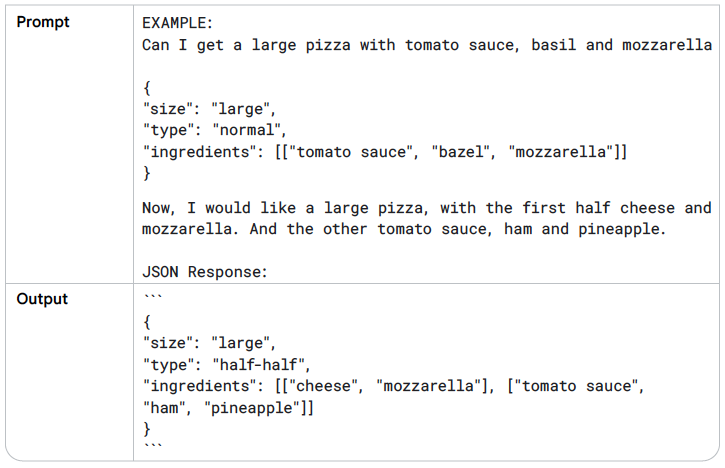

### LLM Output Configuration

- output length: the number of tokens to generate in a response.

Reducing the output length of the LLM doesn’t cause the LLM to become more stylistically
or textually succinct in the output it creates, it just causes the LLM to stop predicting more
tokens once the limit is reached. If your needs require a short output length, you’ll also
possibly need to engineer your prompt to accommodate.
Output length restriction is especially important for some LLM prompting techniques, like
ReAct, where the LLM will keep emitting useless tokens after the response you want.

- Sampling Controls

LLMs predict probabilities for what the
next token could be, with each token in the LLM’s vocabulary getting a probability. Those
token probabilities are then sampled to determine what the next produced token will be.
Temperature, top-K, and top-P are the most common configuration settings that determine
how predicted token probabilities are processed to choose a single output token.

Temperature: controls the degree of randomness in token selection. Lower temperatures
are good for prompts that expect a more deterministic response, while higher temperatures
can lead to more diverse or unexpected results.

Top-K sampling selects the top K most likely tokens from the model’s predicted distribution. The higher top-K, the more creative and varied the model’s output.

Top-P sampling selects the top tokens whose cumulative probability does not exceed a certain value (P). Values for P range from 0 (greedy decoding) to 1 (all tokens in the LLM’s vocabulary).

As a general starting point,
1) a temperature of .2, top-P of .95, and top-K of 30 will give you relatively coherent results that can be creative but not excessively so. 
2) If you want especially creative results, try starting with a temperature of .9, top-P of .99, and top-K of 40.

3) And if you want less creative results, try starting with a temperature of .1, top-P of .9, and top-K of 20.

4) Finally, if your task always has a single correct answer (e.g., answering a math problem), start
with a temperature of 0.

### Prompting techniques

#### 1. Zero-shot: only provides a description of a task and some text for the LLM to get started with. This input could be anything: a question, a start of a story, or instructions.

The table format as used below is a great way of documenting prompts. Your prompts will
likely go through many iterations before they end up in a codebase, so it’s important to keep
track of your prompt engineering work in a disciplined, structured way.

When zero-shot doesn’t work, you can provide demonstrations or examples in the prompt, which leads to “one-shot” and “few-shot” prompting.

#### 2. One-shot & few-shot

Examples are especially useful when you want to steer the model to a certain output structure or pattern. The number of examples you need for few-shot prompting depends on a few factors, including the complexity of the task, the quality of the examples, and the capabilities of the generative AI (gen AI) model you are using. 

As a general rule of thumb, you should use at least three to five examples for few-shot prompting. However, you may need to use more examples for more complex tasks, or you may need to use fewer due to the input length
limitation of your model.

#### 3. System, contextual and role prompting

System, contextual and role prompting are all techniques used to guide how LLMs generate text, but they focus on different aspects:
- **System prompting** sets the overall context and purpose for the language model. It
defines the ‘big picture’ of what the model should be doing, like translating a language,
classifying a review etc.
    - can be useful for generating output that meets specific requirements, like returning JSON objects to force the model to create a structure and limit hallucinations.
    - can also be really useful for safety and toxicity. To control the output, simply
add an additional line to your prompt like: ‘You should be respectful in your answer.

- **Contextual prompting** provides specific details or background information relevant to
the current conversation or task, which is dynamic. It helps the model to understand the nuances of what’s
being asked and tailor the response accordingly.

- **Role prompting** assigns a specific character or identity for the language model to adopt.
This helps the model generate responses that are consistent with the assigned role and its
associated knowledge and behavior. 
    - For example, you could role prompt a gen AI model to be a book editor, a kindergarten
teacher, or a motivational speaker. Once the model has been assigned a role, you can then
give it prompts that are specific to that role.
    - Frames the model’s output style and voice. It adds a layer of specificity and personality. Here are some styles you can choose from which I find effective: Confrontational, Descriptive, Direct, Formal, Humorous, Influential, Informal, Inspirational, Persuasive

#### 4. Step-back prompting

prompting the LLM to first consider a general question related to the specific task at hand, and then feeding the
answer to that general question into a subsequent prompt for the specific task. This ‘step
back’ allows the LLM to activate relevant background knowledge and reasoning processes
before attempting to solve the specific problem.

#### 5. Chain of Thought (CoT)

Prompt LLMs to generate intermediate reasoning steps. You can combine it with few-shot prompting to get better results on more complex tasks that require reasoning before responding as it’s a challenge with a zero-shot
chain of thought.

Chain of thought appears to improve robustness when moving between different LLM versions. Which means the
performance of your prompt should drift less between different LLMs than if your prompt does not use reasoning chains.

As a matter of fact, LLMs often struggle with mathematical tasks and can provide incorrect answers – even for a task as simple as multiplying two numbers. This is because they are trained on large volumes of text and math
may require a different approach.

Chain of thought can be useful for various use-cases. Think of code generation, for breaking down the request into a few steps, and mapping those to specific lines of code. Or for creating synthetic data when you have some kind of seed like “The product is called XYZ, write a description guiding the model through the assumptions you would make based on the product given title.” Generally, any task that can be solved by ‘talking through is a good
candidate for a chain of thought. If you can explain the steps to solve the problem, try chain of thought.

#### 6. Self-consistency

#### 7. Tree of Thoughts (ToT)

#### 8. ReAct (Reason & Act)

#### 9. Automatic Prompt Engineering

#### 10. Code Prompting

### Best Practices

