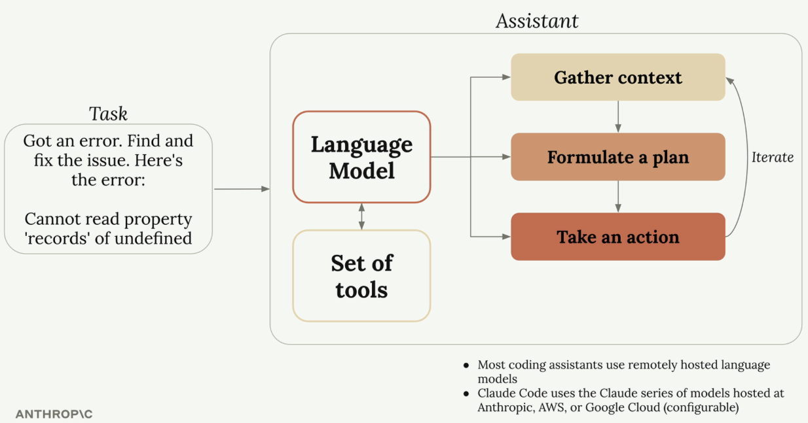
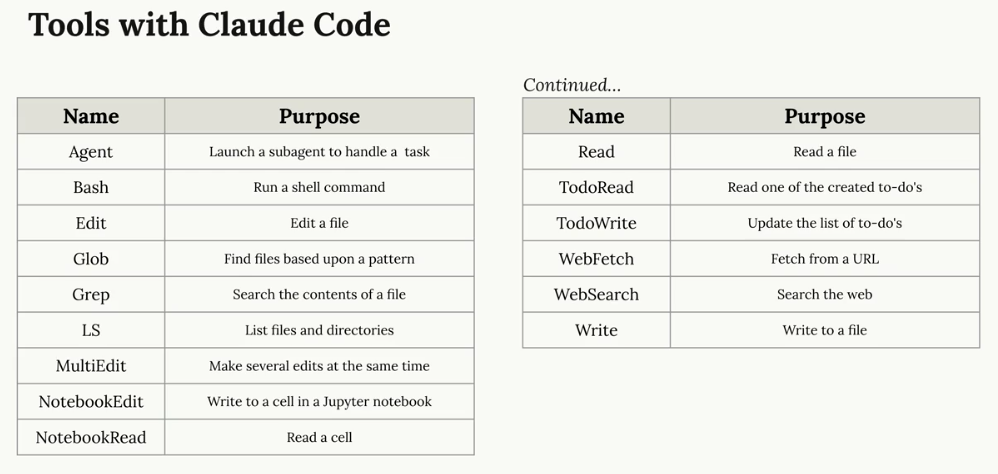
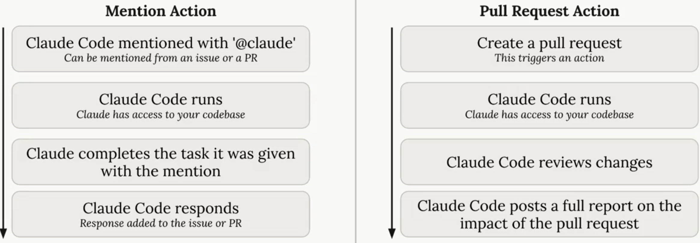
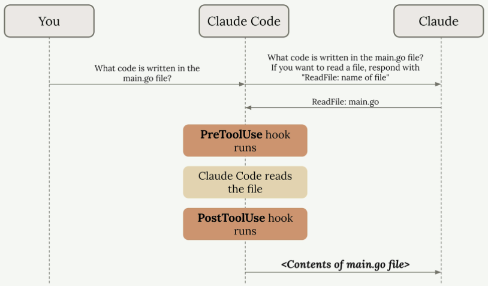
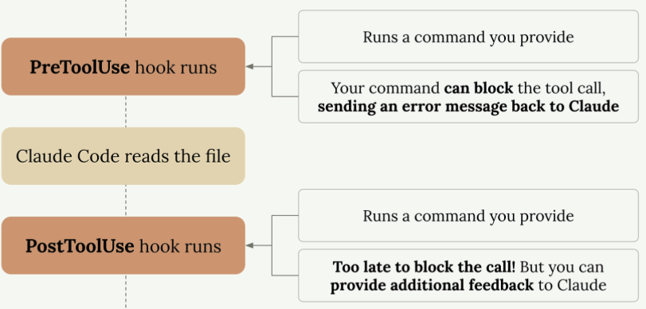
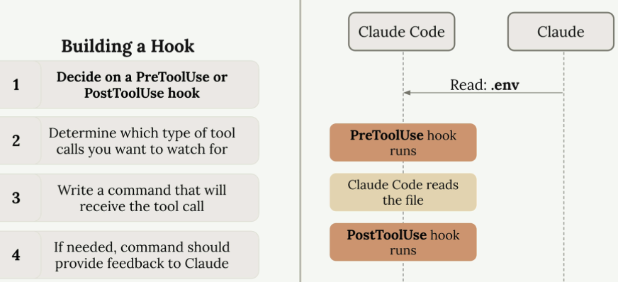
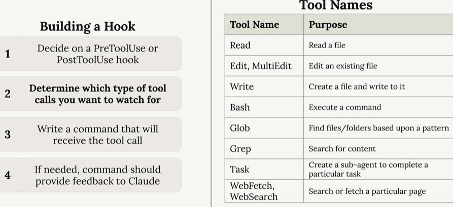

### What is a coding assistant?



When you send a request to a coding assistant, it automatically adds instructions to your message that teach the language model how to request actions. For example, it might add text like: "If you want to read a file, respond with 'ReadFile: name of file'"

Here's the complete flow:
- You ask: "What code is written in the main.go file?"
- The coding assistant adds tool instructions to your request
- The language model responds: "ReadFile: main.go"
- The coding assistant reads the actual file and sends its contents back to the model
- The language model provides a final answer based on the file contents



Additionally, one can integrate various MCP servers for more functionality.


### Setup

- Global installation in a terminal (resolved permission error)

```bash
# First, save a list of your existing global packages for later migration
npm list -g --depth=0 > ~/npm-global-packages.txt

# Create a directory for your global packages
mkdir -p ~/.npm-global

# Configure npm to use the new directory path
npm config set prefix ~/.npm-global

# Note: Replace ~/.bashrc with ~/.zshrc, ~/.profile, or other appropriate file for your shell
echo 'export PATH=~/.npm-global/bin:$PATH' >> ~/.bashrc

# Apply the new PATH setting
source ~/.bashrc

# Now reinstall Claude Code in the new location
npm install -g @anthropic-ai/claude-code

# Optional: Reinstall your previous global packages in the new location
# Look at ~/npm-global-packages.txt and install packages you want to keep
```
- Configuration in Cursor
```bash
echo 'export PATH=$PATH:/Users/chenhuizhang/.npm-global/bin' >> ~/.bash_profile

source ~/.bash_profile
```
- Local installation in terminal every time: ```npx @anthropic-ai/claude-code``` 

### Practical Techniques

#### Adding context

1. Initialize Claude in the project folder with the ```/init``` command

    It will tell Claude to scan the codebase, create a summary and write the summary to the CLAUDE.md file. This file is included in every request.

    The CLAUDE.md file serves two main purposes:

    - Guides Claude through your codebase, pointing out important commands, architecture, and coding style
    - Allows you to give Claude specific or custom directions

    3 Common CLAUDE.md File Locations:
    - CLAUDE.md - Generated with /init, committed to source control, shared with other engineers
    - CLAUDE.local.md - Not shared with other engineers, contains personal instructions and customizations for Claude
    - ~/.claude/CLAUDE.md - Used with all projects on your machine, contains instructions that you want Claude to follow on all projects

2. Adding custom instructions:
    - directly to CLAUDE.md file
    - Use ```#``` command to enter "memory mode" - this lets you edit your CLAUDE.md files intelligently. 

3. File Mentions with ```@```: to look at specific files, use the @ symbol followed by the file path. This automatically includes that file's contents in your request to Claude.
4. Referencing files in CLAUDE.md using the same ```@``` syntax: particularly useful for files that are relevant to many aspects of your project, i.e. DB schema.

#### Making changes

1. Use screenshots for precise communication: When you want to modify a specific part of your interface, take a screenshot, and paste it into Claude using **Ctrl+V** (not **Cmd+V** on macOS). 

2. Planning mode: adding breadth to Claude's task exploration

    For more complex tasks that require extensive research across your codebase, you can enable Planning Mode. This feature makes Claude do thorough exploration of your project before implementing changes.

    Enable Planning Mode by pressing **Shift + Tab** twice (or once if you're already auto-accepting edits). In this mode, Claude will:

    - Read more files in your project
    - Create a detailed implementation plan
    - Show you exactly what it intends to do
    - Wait for your approval before proceeding
    
    This gives you the opportunity to review the plan and redirect Claude if it missed something important or didn't consider a particular scenario.

3. Thinking Modes

    Claude offers different levels of reasoning through "thinking" modes. These allow Claude to spend more time reasoning about complex problems before providing solutions.

    The available thinking modes include:

    - "Think" - Basic reasoning
    - "Think more" - Extended reasoning
    - "Think a lot" - Comprehensive reasoning
    - "Think longer" - Extended time reasoning
    - "Ultrathink" - Maximum reasoning capability

    Each mode gives Claude progressively more tokens to work with, allowing for deeper analysis of challenging problems.

When to Use Planning vs Thinking: These two features handle different types of complexity.
    
Planning Mode is best for:

- Tasks requiring broad understanding of your codebase
- Multi-step implementations
- Changes that affect multiple files or components

Thinking Mode is best for:

- Complex logic problems
- Debugging difficult issues
- Algorithmic challenges

You can combine both modes for tasks that require both breadth and depth. Just keep in mind that both features consume additional tokens, so there's a cost consideration for using them.

#### Controlling Context

1. Interrupting Claude with Escape

    Sometimes Claude starts heading in the wrong direction or tries to tackle too much at once. You can press the Escape key to stop Claude mid-response, allowing you to redirect the conversation.

    This is particularly useful when you want Claude to focus on one specific task instead of trying to handle multiple things simultaneously. For example, if you ask Claude to write tests for multiple functions and it starts creating a comprehensive plan for all of them, you can interrupt and ask it to focus on just one function at a time.

2. Combining Escape with Memories

    One of the most powerful applications of the escape technique is fixing repetitive errors. When Claude makes the same mistake repeatedly across different conversations, you can:

    - Press Escape to stop the current response
    - Use the # shortcut to add a memory about the correct approach
    - Continue the conversation with the corrected information

3. Rewinding Conversations

    During long conversations, you might accumulate context that becomes irrelevant or distracting. For instance, if Claude encounters an error and spends time debugging it, that back-and-forth discussion might not be useful for the next task.

    You can rewind the conversation by **pressing Escape twice**. This shows you all the messages you've sent, allowing you to *jump back to an earlier point and continue from there*. This technique helps you:

    - Maintain valuable context (like Claude's understanding of your codebase)    
    - Remove distracting or irrelevant conversation history
    - Keep Claude focused on the current task

4. Context Management Commands

    - ```/compact``` summarizes your entire conversation history while preserving the key information Claude has learned. This is ideal when:

        - Claude has gained valuable knowledge about your project
        - You want to continue with related tasks
        - The conversation has become long but contains important context

    Use compact when Claude has learned a lot about the current task and you want to maintain that knowledge as it moves to the **next related** task.

    - ```/clear``` completely removes the conversation history, giving you a fresh start. This is most useful when:

        - You're switching to a **completely different, unrelated task**
        - The current conversation context might confuse Claude for the new task
        - You want to start over without any previous context

#### Custom Commands for Automation

Claude Code comes with built-in commands that you can access by typing a forward slash, but you can also create your own custom commands to automate repetitive tasks you run frequently.

To create a custom command, you need to set up a specific folder structure in your project:

1. Find the **.claude** folder in your project directory
2. Create a new directory called **commands** inside it
3. Create a new markdown file with your desired command name (like **audit.md**)
4. Add specific instructions in the md file


The filename becomes your command name - so audit.md creates the ```/audit``` command. After creating your command file, you **must restart** Claude Code for it to recognize the new command.

- Example: Audit Command that audits project dependencies for vulnerabilities

    It will do 3 things: 

        1. Runs npm audit to find vulnerable installed packages
        2. Runs npm audit fix to apply updates
        3. Runs tests to verify the updates didn't break anything

- Commands with Arguments

    Custom commands can accept arguments using the $ARGUMENTS placeholder. This makes them much more flexible and reusable.

    For example, a write_tests.md command might contain:

    ```
    Write comprehensive tests for: $ARGUMENTS

    Testing conventions:
    * Use Vitests with React Testing Library
    * Place test files in a __tests__ directory in the same folder as the source file
    * Name test files as [filename].test.ts(x)
    * Use @/ prefix for imports

    Coverage:
    * Test happy paths
    * Test edge cases
    * Test error states
    ```

    You can then run this command with a file path:

    ```/write_tests the use-auth.ts file in the hooks directory```

    The arguments don't have to be file paths - they can be any string you want to pass to give Claude context and direction for the task.

Custom commands are particularly useful for project-specific workflows like running test suites, deploying code, or generating boilerplate following your team's conventions.

#### MCP servers with Claude Code

You can extend Claude Code's capabilities by adding MCP (Model Context Protocol) servers. These servers run either remotely or locally on your machine and provide Claude with new tools and abilities it wouldn't normally have.

One of the most popular MCP servers is **Playwright**, which gives Claude the **ability to control a web browser**. This opens up powerful possibilities for **web development workflows**. For example, it provides tools to open the browser, run code in the browser, navigate to an address and click on the screen.

- Installing the Playwright MCP Server

    ```claude mcp add playwright npx @playwright/mcp@latest```

    This command does two things:
    - Names the MCP server "playwright"
    - Provides the command that starts the server locally on your machine

- Managing Permissions

    When you first use MCP server tools, Claude will ask for permission each time. If you get tired of these permission prompts, you can pre-approve the server by editing your settings.

    Open the ```.claude/settings.local.json``` file and add the server to the allow array:

    ```json
    {
    "permissions": {
        "allow": ["mcp__playwright"],
        "deny": []
    }
    }
    ```

    Note the double underscores in mcp__playwright. This allows Claude to use the Playwright tools without asking for permission every time.

- Practical Example: Improving Component Generation

    Here's a real-world example of how the Playwright MCP server can improve your development workflow. Instead of manually testing and tweaking prompts, you can have Claude:

    1. Open a browser and navigate to your application
    2. Generate a test component
    3. Analyze the visual styling and code quality
    4. Update the generation prompt based on what it observes
    5. Test the improved prompt with a new component

    For instance, you might ask Claude to:

        "Navigate to localhost:3000, generate a basic component, review the styling, and update the generation prompt at @src/lib/prompts/generation.tsx to produce better components going forward."

    Claude will use the browser tools to interact with your app, examine the generated output, and then modify your prompt file to encourage more original and creative designs.

    The key advantage is that Claude can see the actual visual output, not just the code, which allows it to make much more informed decisions about styling improvements.

- Exploring Other MCP Servers

    Playwright is just one example of what's possible with MCP servers. The ecosystem includes servers for:

    -  Database interactions
    - API testing and monitoring
    - File system operations
    - Cloud service integrations
    - Development tool automation

#### Github Integration

Claude Code offers an official GitHub integration that lets Claude run inside GitHub Actions. This integration provides two main workflows: mention support for issues and pull requests, and automatic pull request reviews.

- Setting Up the Integration

    To get started, run ```/install-github-app``` in Claude. This command walks you through the setup process:

    - Install the Claude Code app on GitHub
    - Add your API key
    - Automatically generate a pull request with the workflow files

    The generated pull request adds two GitHub Actions to your repository. Once merged, you'll have the workflow files in your `.github/workflows` directory.

- Default GitHub Actions

    

    - Mention Action: You can mention Claude in any issue or pull request using `@claude`. When mentioned, Claude will:

        - Analyze the request and create a task plan
        - Execute the task with full access to your codebase
        - Respond with results directly in the issue or PR
    
    - Pull Request Action
    
        Whenever you create a pull request, Claude automatically:

        - Reviews the proposed changes
        - Analyzes the impact of modifications
        - Posts a detailed report on the pull request

- Customizing the Workflows

    After merging the initial pull request, you can customize the workflow files to fit your project's needs. Here's how to enhance the mention workflow:

    - Adding Project Setup: Before Claude runs, you can add steps to prepare your environment

    ```
    - name: Project Setup
      run: |
        npm run setup
        npm run dev:daemon
    ```
    - Custom Instructions: Provide Claude with context about your project setup

    ```
    custom_instructions: |
        The project is already set up with all dependencies installed.
        The server is already running at localhost:3000. Logs from it
        are being written to logs.txt. If needed, you can query the
        db with the 'sqlite3' cli. If needed, use the mcp__playwright
        set of tools to launch a browser and interact with the app.
    ```

    - MCP Server Configuration: You can configure MCP servers to give Claude additional capabilities
    ```json
        mcp_config: |
            {
                "mcpServers": {
                    "playwright": {
                        "command": "npx",
                        "args": [
                            "@playwright/mcp@latest",
                            "--allowed-origins",
                            "localhost:3000;cdn.tailwindcss.com;esm.sh"
                            ]
                        }
                    }
            }
    ```
    - Tool Permissions

        When running Claude in GitHub Actions, you must explicitly list all allowed tools. This is especially important when using MCP servers. 

        ```
        allowed_tools: "Bash(npm:*),Bash(sqlite3:*),mcp__playwright__browser_snapshot,mcp__playwright__browser_click,..."
        ```

        Unlike local development, there's no shortcut for permissions in GitHub Actions. Each tool from each MCP server must be individually listed.

The GitHub integration transforms Claude from a development assistant into an automated team member that can handle tasks, review code, and provide insights directly within your GitHub workflow.

### Hooks and the SDK

#### Introducing hooks

Hooks allow you to run commands before or after Claude attempts to run a tool. They're incredibly useful for implementing automated workflows like running code formatters after file edits, executing tests when files change, or blocking access to specific files.



Hook Configuration: Hooks are defined in Claude settings files. You can add them to:

- Global - ```~/.claude/settings.json``` (affects all projects)
- Project - ```.claude/settings.json``` (shared with team)
- Project (not committed) - ```.claude/settings.local.json``` (personal settings)

You can write hooks by hand in these files or use the ```/hooks``` command inside Claude Code.

There are two types of hooks:

- PreToolUse hooks - Run before a tool is called. They include a matcher that specifies which tool types to target:

    ```json
    "PreToolUse": [
        {
            "matcher": "Read",
            "hooks": [
            {
                "type": "command",
                "command": "node /home/hooks/read_hook.ts"
            }
            ]
        }
    ]
    ```

    Before the 'Read' tool is executed, this configuration runs the specified command. Your command receives details about the tool call Claude wants to make, and you can:

    - Allow the operation to proceed normally
    - Block the tool call and send an error message back to Claude

- PostToolUse hooks - Run after a tool is called. Here's an example that triggers after write, edit, or multi-edit operations:

    ```json
    "PostToolUse": [
        {
            "matcher": "Write|Edit|MultiEdit",
            "hooks": [
            {
                "type": "command", 
                "command": "node /home/hooks/edit_hook.ts"
            }
            ]
        }
    ]
    ```
  

- Practical applications of Hooks:

    - Code formatting - Automatically format files after Claude edits them
    - Testing - Run tests automatically when files are changed
    - Access control - Block Claude from reading or editing specific files
    - Code quality - Run linters or type checkers and provide feedback to Claude
    - Logging - Track what files Claude accesses or modifies
    - Validation - Check naming conventions or coding standards

The key insight is that hooks let you extend Claude Code's capabilities by integrating your own tools and processes into the workflow. PreToolUse hooks give you **control over what Claude can do**, while PostToolUse hooks let you **enhance what Claude has done**.

#### Defining Hooks

- Creating a hook involves four main steps:

      

- Available Tools: Claude Code provides several built-in tools that you can monitor with hooks.

    To see exactly which tools are available in your current setup, you can ask Claude directly for a list. This is especially useful since the available tools can change when you add custom MCP servers.

     

