### 3.1 How expressive are GNNs

Recap on GNNs: Key idea is that nodes aggregate information from their neighbors using neural networks.

#### 3.1.1 Motivation: How powerful are GNNs?

Many GNN models have been proposed (e.g.,
GCN, GAT, GraphSAGE, design space). 
- What is the expressive power (ability to distinguish different graph structures) of these GNN models? 
- How to design a maximally expressive GNN model?

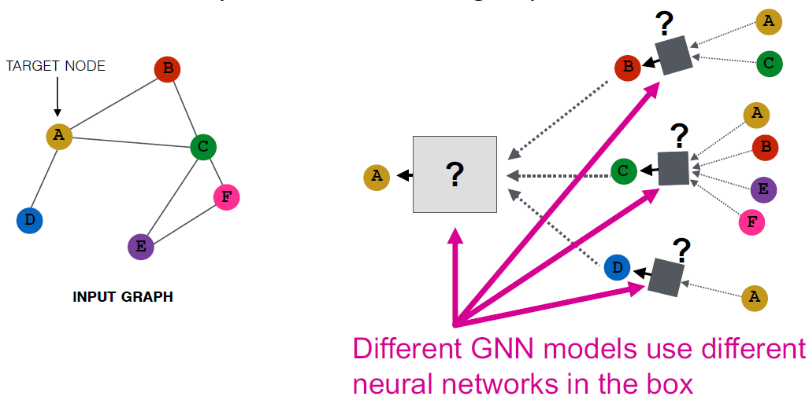 

- GCN (mean-pool) [Kipf and Welling ICLR 2017]: Element-wise mean pooling + Linear + ReLU non-linearity
- GraphSAGE (max-pool) [Hamilton et al. NeurIPS 2017]: MLP + element-wise max-pooling

#### 3.1.2 Local Neighborhood Structures

We use node same/different colors to represent nodes with same/different features. For example, the graph below assumes all the nodes share the same feature.

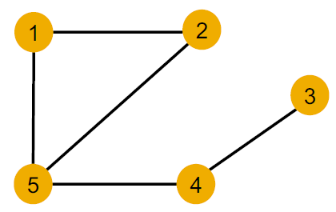 

We specifically consider local neighborhood structures around each node in a graph.
- Nodes 1 and 5 have different neighborhood structures because they have
different node degrees. 
- Nodes 1 and 4 both have the same node degree of 2. However, they still have different neighborhood structures because **their neighbors have different node degrees**.
- Node 1 and 2 have the **same** neighborhood structures because they are **symmetric within the graph**.

    Node 1 has neighbors of degrees 2 and 3. 
    
    Node 2 has neighbors of degrees 2 and 3.
    
    And even if we go a step deeper to 2nd hop neighbors, both nodes have the same degrees (Node 4 of degree 2)

Key question: Can GNN node embeddings distinguish different node’s local neighborhood structures? If so, when? If not, when will a GNN fail?

#### 3.1.3 Computational Graph: How a GNN captures local neighborhood structures

In each layer, a GNN aggregates neighboring node embeddings. 

A GNN generates node embeddings through a computational graph defined by the neighborhood. 

Ex: Nodes 1 and 2’s computational graphs. (2-layer GNN)

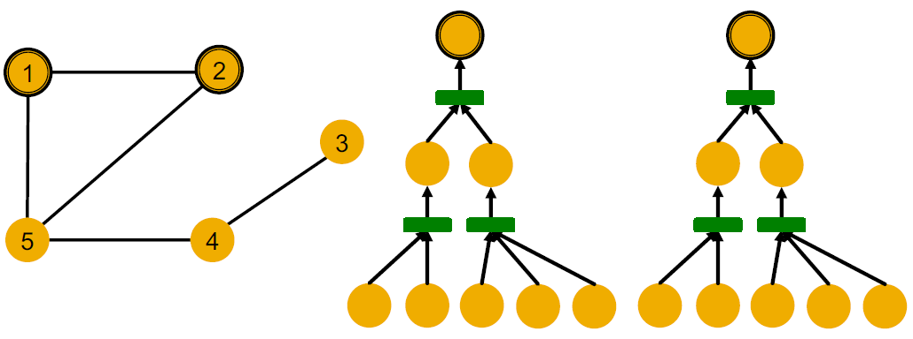  

Note: GNN does not care about node ids, it just aggregates features vectors of different nodes.

A GNN will generate the same embedding for nodes 1 and 2 because:
- Computational graphs are the same.
- Node features (colors) are identical.

As a result, GNN won’t be able to distinguish nodes 1 and 2. 

In general, different local neighborhoods define different computational graphs. Computational graphs are identical to **rooted subtree structures** around each node, defined by recursively unfolding neighboring nodes from the root nodes.

GNN‘s node embeddings capture rooted subtree structures. **Most expressive GNN maps different rooted subtrees into different node embeddings** (represented by different colors).

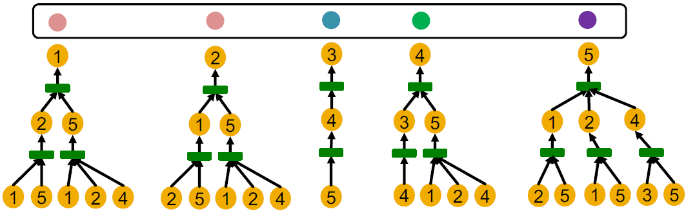  

#### 3.1.4 How Expressive is a GNN?

Recall: Injective Function $f: X$ &rarr; $Y$ is injective if it maps different elements into different outputs. $f$ retains all the info about input.

Most expressive GNN should **map subtrees to the node embeddings injectively**:

- Subtrees of the same depth can be recursively characterized from the leaf nodes to the root nodes.
- If each step of GNN’s aggregation can **fully retain the neighboring information**, the generated node embeddings can distinguish different rooted subtrees.
- In other words, most expressive GNN would use an **injective neighbor aggregation
function** at each step, in order to map different neighbors to different embeddings.

In summary:

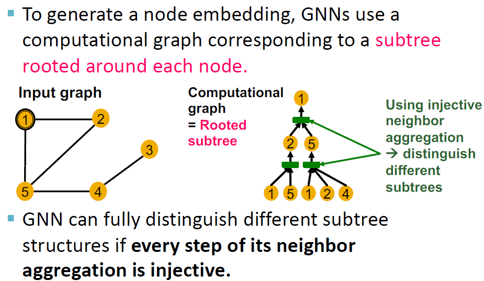  

### 3.2 Designing the Most Powerful GNNs

#### 3.2.1 Expressive Power of GNNs: Neighbor Aggregation

Key observation: Expressive power of GNNs can be characterized by that of neighbor
aggregation functions they use.
- A more expressive aggregation function leads to a more expressive a GNN.
- Injective aggregation function leads to the most expressive GNN.

Neighbor Aggregation can be abstracted as a **function over a multi-set** (a set with repeating elements).

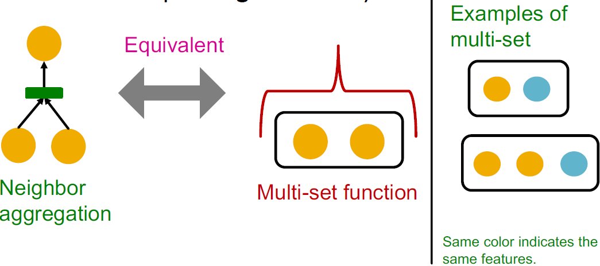 

We analyze aggregation functions of two popular GNN models:

- GCN (mean-pool) [Kipf and Welling ICLR 2017]
  - Element-wise mean pooling over neighboring node features
  - Take element-wise mean, followed by linear function and ReLU activation, i.e., max(0, 𝑥).
  
  Failure case: GCN’s aggregation function **cannot distinguish different multi-sets with the same color proportion**.

    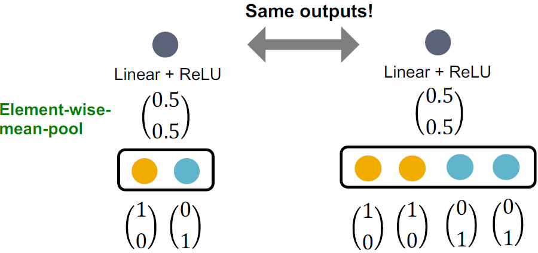  

- GraphSAGE (max-pool) [Hamilton et al. NeurIPS 2017]: 
  - Apply an MLP, then take element-wise max over neighboring node features
  - Failure case: GraphSAGE’s aggregation function **cannot distinguish different multi-sets with the same set of distinct colors**.

  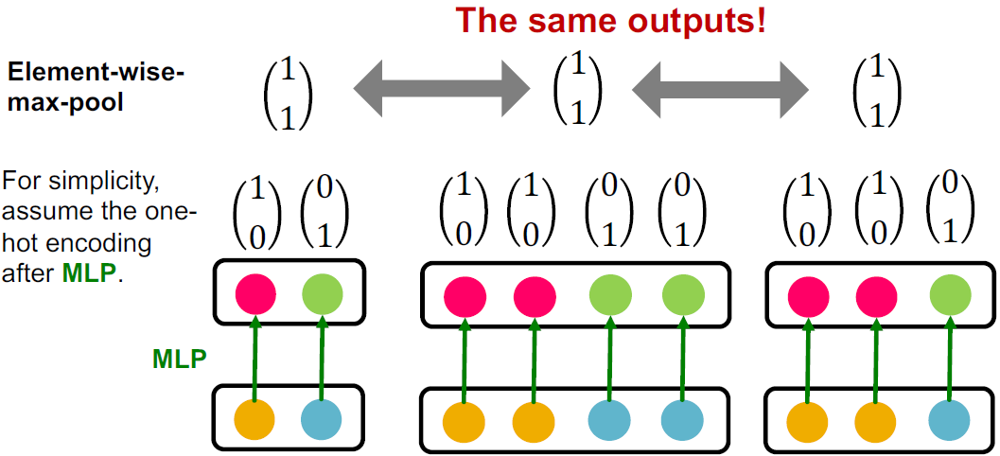 

Main takeaways:
- Expressive power of GNNs can be characterized by that of the neighbor aggregation function.
- Neighbor aggregation is a function over multi-sets (sets with repeating elements)
- GCN and GraphSAGE’s aggregation functions fail to distinguish some basic multi-sets; hence **not injective**.
- Therefore, GCN and GraphSAGE are not maximally powerful GNNs.

#### 3.2.2 Injective Multi-Set Function

Theorem [Xu et al. ICLR 2019]: any injective multi-set function can be expressed as

  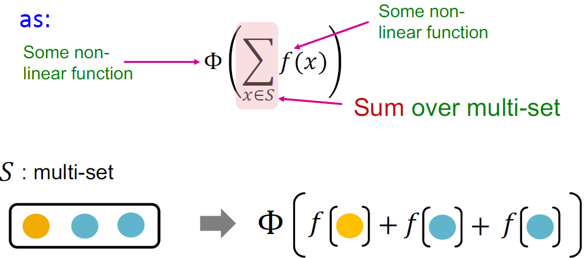 

How to model 𝜱 and 𝒇 in $𝜱(Σ_{𝒙∈𝑺} 𝒇(𝒙))$ ?

- We use a Multi-Layer Perceptron (MLP)
- Universal Approximation Theorem [Hornik et al., 1989]: 

    1-hidden-layer MLP with sufficiently large hidden dimensionality and appropriate non-linearity 𝜎(⋅) (including ReLu and sigmoid) can **approximate any continuous function to an arbitrary accuracy**.

  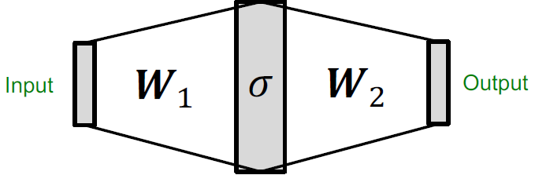 

We have arrived at a neural network that can model any injective multiset function:

  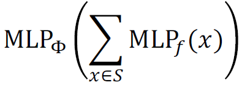 

- In practice MLP hidden dimensionality of 100 to 500 is sufficient.

#### 3.2.3 Most Expressive GNN: Graph Isomorphism Network (GIN)

Graph Isomorphism Network (GIN) [Xu et al. ICLR 2019]: Apply an MLP, **element-wise sum**, followed by another MLP.

   

  - GIN‘s neighbor aggregation function is injective. No failure cases!
  - GIN is THE most expressive GNN in the class of message-passing GNNs!
  - The key is to use element-wise sum pooling, instead of mean-/max-pooling.

#### Relation to WL Graph Kernel

We now describe the full model of GIN by relating it to WL graph kernel (traditional way of obtaining graph-level features).

Recall: Color refinement algorithm in WL kernel.
- Given: A graph 𝐺 with a set of nodes 𝑉.
- Assign an initial color $c^{(0)}(v)$ to each node $v$
- Iteratively refine node colors by

  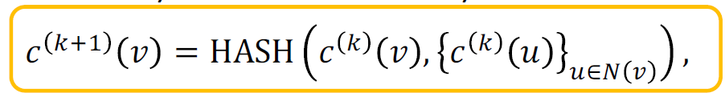 

    Where HASH maps different inputs to different colors.
- After K steps of color refinement, $c^{(K)}(v)$ summarizes the structure of K-hop neighborhood.

Example of color refinement given 2 graphs:

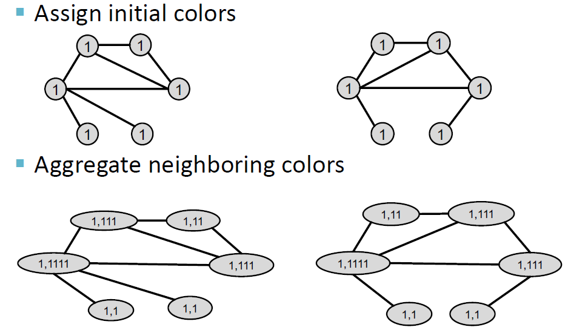 
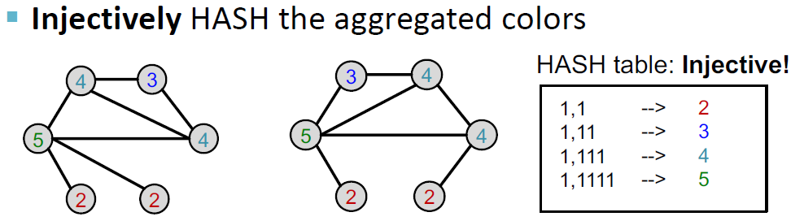

- Process continues until a stable coloring is reached
- Two graphs are considered **isomorphic** if they have the same set of colors.

#### The Complete GIN Model
GIN uses a neural network to model the injective HASH function. Specifically, we will model the injective function over the tuple:

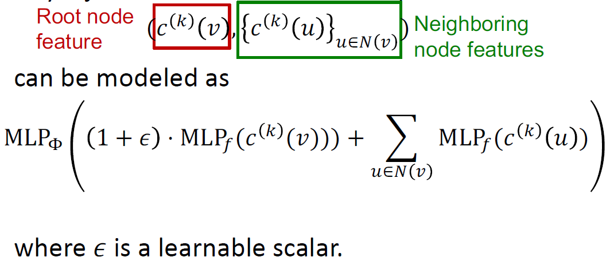

- If input feature $c^{(0)}(v)$ is represented as one-hot, direct summation is injective.
- We only need Φ to ensure the injectivity.

    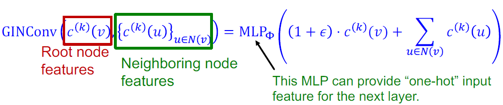

GIN’s node embedding updates given A graph 𝐺 with a set of nodes 𝑉:
- Assign an initial color $c^{(0)}(v)$ to each node $v$
- Iteratively update node vectors by

  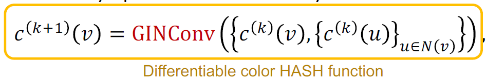  

    Where GINConv maps different inputs to different embeddings.
- After K steps of GIN iterations, $c^{(K)}(v)$ summarizes the structure of K-hop neighborhood.

GIN can be understood as differentiable neural version of the WL graph Kernel:

|    |Update Target|Update function|
|-|-|-|
|WL Graph Kernel|Node colors (one-hot)|HASH|
|GIN|Node embeddings (low-dim vectors)| GINConv|

Advantages of GIN over the WL graph kernel are:
- Node embeddings are low-dimensional; hence, they can capture the fine-grained similarity of different nodes.
- Parameters of the update function can be learned for the downstream tasks.

Because of the relation between GIN and the WL graph kernel, their expressive is exactly the same. If two graphs can be distinguished by GIN, they can be also distinguished by the WL kernel, and vice versa.

WL kernel has been both theoretically and empirically shown to distinguish most of the realworld graphs [Cai et al. 1992]. Hence, GIN is also powerful enough to distinguish most of the real graphs!

Can expressive power of GNNs be improved?
- There are basic graph structures that existing GNN framework cannot distinguish, such as difference in cycles.
  
  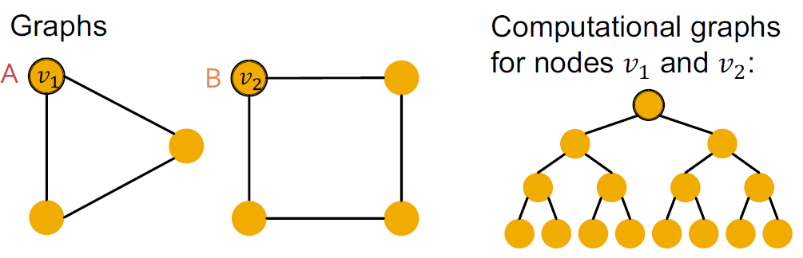  

- GNNs’ expressive power can be improved to resolve the above problem. [You et al. AAAI 2021, Li et al. NeurIPS 2020]