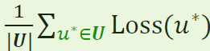
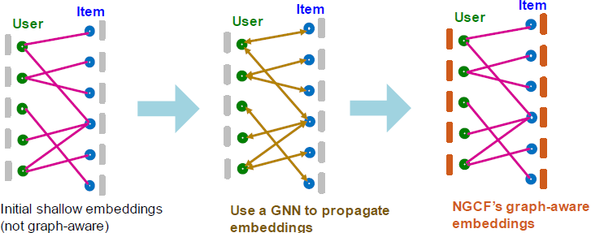

### 7.1 Recommender Systems

- Preliminary of Recommendation

    Information Explosion in the era of Internet:
  - 10K+ movies in Netflix
  - 12M products in Amazon
  - 70M+ music tracks in Spotify
  - 10B+ videos on YouTube
  - 200B+ pins (images) in Pinterest

    Personalized recommendation (i.e., suggesting a small number of interesting items for each user) is critical for users to effectively explore the content of their interest.

#### 7.1.1 Task and Evaluation

- Recommender System as a Graph

    Recommender system can be naturally modeled as a **bipartite graph**:
    - A graph with two node types: users and items.
    - Edges connect users and items: 
      - Indicates user-item interaction (e.g., click, purchase, review etc.)
      - Often associated with timestamp (timing of the interaction).

- Recommendation Task

    Given past user-item interactions, Predict new items each user will interact in the future.
    
    → Can be cast as **link prediction** problem: Predict new user-item interaction edges given the past edges.

    → For 𑢠∈ 𝑼, 𑣠∈ 𝑽, we need to get a real-valued score 𝑓(𝑢, 𝑣). For example, 𝑓(𝑢, 𝑣) = $z_u \cdot z_v$

- Modern Recommender System

    Problem: Cannot evaluate **𝑓(𝑢, 𝑣)** for every user 𝑢 – item 𝑣 pair.

    Solution: 2-stage process

    - Candidate generation (cheap, fast)
    - Ranking (slow, accurate)

     

- Top-K Recommendation

    For each user, we recommend 𝐾 items.
    - For recommendation to be effective, 𝑲 needs to be much smaller than the total number of items (up to billions)
    - 𝐾 is typically in the order of 10—100.
  
    The goal is to include as many **positive items** as possible in the top-𝐾 recommended items.
    - Positive items = Items that the user will interact with in the future.

    Evaluation metric: Recall@𝐾 (defined next)

- Evaluation metric: **Recall@𝐾**

    For each user 𝒖,
    - Let 𝑃𝑢 be a set of positive items the user will interact in the future.
    - Let 𝑅𝑢 be a set of items recommended by the model.
        - In top-𝐾 recommendation, |𝑅𝑢| = 𝐾.
        - Items that the user has already interacted are excluded.

          

    **Recall@𝑲 for user 𝒖 is |𝑷𝒖 ∩ 𝑹𝒖| / |𝑷𝒖|**.
    - Higher value indicates more positive items are recommended in top-𝐾 for user 𝑢.

    The final Recall@𝐾 is computed by averaging the recall values across all users.

#### 7.1.2 Embedding-Based Models

- Notation:
  - 𝑼: A set of all users
  - 𝑽: A set of all items
  - 𝑬: A set of observed user-item interactions
    - 𝑬 = {(𝑢, 𝑣) | 𝑢 ∈ 𝑼, 𝑣 ∈ 𝑽, 𝑢 interacted with 𝑣}

- Score Function

    To get the top-𝐾 items, we need a score function for user-item interaction:
    - For 𝑢 ∈ 𝑼, 𝑣 ∈ 𝑽, we need to get a real-valued scalar score(𝑢, 𝑣).
    - 𝑲 items with the largest scores for a given user 𝑢 (excluding already interacted items) are then recommended.

       

    For 𝐾 = 2, recommended items for user 𝑢 would be {𝑣1, 𝑣3} .

- Embedding-Based Models

    We consider embedding-based models for scoring user-item interactions:
    - For each user 𝑢 ∈ 𝑼, let $𝒖 ∈ ℝ^𝐷$ be its 𝐷-dimensional embedding.
    - For each item 𝑣 ∈ 𝑽, let $𝒗 ∈ ℝ^𝐷$ be its 𝐷-dimensional embedding.
    - Let $𝑓_𝜃(⋅,⋅): ℝ^𝐷 × ℝ^𝐷 → ℝ$ be a parametrized function.
    - Then, $score(u,v)=𝑓_𝜃(u,v)$

- Training Objective

    Embedding-based models have three kinds of parameters:
    - An encoder to generate user embeddings {𝒖}$_{𝑢∈𝑈}$
    - An encoder to generate item embeddings {𝒗}$_{𝑣∈𝑉}$ 
    - Score function $𝑓_𝜃(⋅,⋅)$

    Training objective: Optimize the model parameters to achieve high recall@𝐾 on *seen (i.e., training)* user-item interactions
  
    → We hope this objective would lead to high recall@𝐾 on *unseen (i.e., test)* interactions.

- Surrogate Loss Functions

    The original training objective (recall@𝐾) is **not differentiable**.
    - Cannot apply efficient gradient-based optimization

    Two **surrogate loss functions** are widely-used to enable efficient gradient-based optimization:
    - Binary Loss
    - Bayesian Personalized Ranking (BPR) loss

    Surrogate losses are **differentiable** and should **align well with the original training objective**.

- Binary Loss: Binary classification of **positive/negative** edges using $𝜎(𝑓_𝜃(𝒖, 𝒗))$

    Define positive/negative edges:
    - A set of positive edges 𝑬 (i.e., observed/training user-item interactions)
    - A set of negative edges $𝑬_{𝐧𝐞𝐠} = \{(𝑢, 𝑣) | (𝑢, 𝑣) ∉ 𝐸, 𝑢 ∈ 𝑼, 𝑣 ∈ 𝑽\}$

    Define sigmoid function: 
    - Maps real-valued scores into binary likelihood scores, i.e., in the range of [0,1].

     

    → Binary loss pushes the scores of positive edges higher than those of negative edges.
    - This aligns with the training recall metric since positive edges need to be recalled.

- Issue with Binary Loss

    In the binary loss, the scores of **ALL** positive edges are pushed higher than those of **ALL** negative edges.

    This would unnecessarily penalize model predictions even if the training recall metric is perfect.

    Let’s consider the simplest case:
    - Two users, two items
    - Metric: Recall@1.
    - A model assigns the score for every user-item pair (as shown in the right).

      

    Training Recall@1 is 1.0 (perfect score), because $𝑣_0$ (resp. $𝑣_1$) is correctly recommended to $𝑢_0$ (resp. $𝑢_1$).

    However, the **binary loss would still penalize the model prediction** because the negative $(𝑢_1 , 𝑣_0)$ edge gets the higher score than the positive edge $(𝑢_0 , 𝑣_0)$ .

    - Key insight: The binary loss is **non-personalized** in the sense that the positive/negative edges are **considered across ALL users at once**.
    - However, the recall metric is inherently **personalized (defined for each user)**.

    → The non-personalized binary loss is overly-stringent
for the personalized recall metric.

    → Lesson learned: Surrogate loss function should be defined in a **personalized** manner.
    - For each user, we want the scores of positive items to be higher than those of the negative items
    - **We do not care about the score ordering across users**.

    → **Bayesian Personalized Ranking (BPR)** loss achieves this!

- Bayesian Personalized Ranking (BPR) Loss: 
  - Personalized surrogate loss that aligns better with the recall@K metric.

    Note: The term “Bayesian” is not essential to the loss definition. The original paper [Rendle et al. 2009] considers the Bayesian prior over parameters (essentially acts as a parameter regularization), which we omit here.

    For each user $𝑢^∗ ∈ 𝑼$, define the **rooted positive/negative edges** as
    - Positive edges rooted at $𝑢^∗$: $𝑬(𝑢^∗) ≡ \{(𝑢^∗, 𝑣) | (𝑢^∗, 𝑣) ∈ 𝑬\}$
    - Negative edges rooted at $𝑢^∗$: $𝑬_{neg}(𝑢^∗) ≡ \{(𝑢^∗, 𝑣) | (𝑢^∗, 𝑣) ∈ 𝑬_{neg}\}$

  - Training objective: For each user $𝑢^∗$, we want the scores of rooted positive edges $𝑬(𝑢^∗)$ to be higher than those of rooted negative edges $𝑬_{neg}(𝑢^∗)$.
  - BPR Loss for user $𝑢^∗$:

      

  - Final BPR Loss:   

  - Mini-batch training for the BPR loss:

    In each mini-batch, we sample a subset of users $𝑼_{mini} ⊂ 𝑼$.
    - For each user $𝑢^∗ ∈ 𝑼_{mini}$ , we sample one positive item $𝑣_{pos}$ and a set of sampled negative items $𝑉_{neg} = \{𝑣_{neg}\}$ .
  
          

    The mini-batch loss is computed as

    

- Why Embedding Models Work?

    - Underlying idea: Collaborative filtering
      - Recommend items for a user by collecting preferences of many other similar users.
      - Similar users tend to prefer similar items.

         

    - Key question: How to capture similarity between users/items?

    - Embedding-based models can capture similarity of users/items!
      - Low-dimensional embeddings cannot simply memorize all user-item interaction data.
      - Embeddings are forced to **capture similarity between users/items to fit the data**.
      - This allows the models to make effective prediction on unseen user-item interactions.

- This Lecture: GNNs for Recsys

    1. Neural Graph Collab. Filtering (NGCF) [Wang et al. 2019]
    2. LightGCN [He et al. 2020]
        - Improve the conventional collaborative filtering models (i.e., shallow encoders) by explicitly modeling graph structure using GNNs.
        - Assumes no user/item features.
    3. PinSAGE [Ying et al. 2018]
        - Use GNNs to generate high-quality embeddings by simultaneously capturing rich node attributes (e.g., images) and the graph structure.

#### 7.1.3 Neural Graph Collaborative Filtering

- Conventional Collaborative Filtering

    Conventional collaborative filtering model is based on shallow encoders:
    - No user/item features.
    - Use shallow encoders for users and items:
      - For every 𝑢 ∈ 𝑼 and 𝑣 ∈ 𝑽, we prepare shallow learnable embeddings $𝒖, 𝒗 ∈ ℝ^𝐷$.
    - Score function for user 𝑢 and item 𝑣 is $𝑓_𝜃(𝒖, 𝒗) ≡ 𝒛_𝒖^𝑇𝒛_𝒗$.

    Limitations of Shallow Encoders:
    - The model itself does **not explicitly capture graph structure**
      - The graph structure is **only implicitly** captured in the training objective.
    - Only the **first-order graph structure** (i.e., edges) is captured in the training objective.
      - **High-order** graph structure (e.g., 𝐾-hop paths between two nodes) is **not explicitly captured**.

- GNN Motivation

    We want a model that…
    - **explicitly captures graph structure** (beyond implicitly through the training objective)
    - captures **high-order graph structure** (beyond the first-order edge connectivity structure)

    → GNNs are a natural approach to achieve both!

    - Neural Graph Collaborative Filtering (NGCF) [Wang et al. 2019]
    - LightGCN [He et al. 2020]
      - A simplified and improved version of NGCF

- NGCF Framework

    Key idea: Use a GNN to generate graph-aware user/item embeddings.

      

    Given: User-item bipartite graph.
    - Prepare shallow learnable embedding for each node.
    - Use multi-layer GNNs to propagate embeddings along the bipartite graph.
      - High-order graph structure is captured.
    - Final embeddings are explicitly graph-aware!

    Two kinds of learnable params are jointly learned:
    - Shallow user/item embeddings
    - GNN’s parameters

- Initial Node Embeddings

    Set the shallow learnable embeddings as the initial node features:
    - For every user 𝑢 ∈ 𝑼, set $𝒉_𝑢^{(0)}$ as the user’s shallow embedding.
    - For every item 𝑣 ∈ 𝑽, set $𝒉_v^{(0)}$ as the item’s shallow embedding.

- Neighbor Aggregation

  Iteratively update user and item node embeddings using neighboring embeddings.

    $h^{k+1}_v=COMBINE(h^{k}_v,AGGR(\{h^{k}_u \}_{u\isin N(v)}))$

    $h^{k+1}_u=COMBINE(h^{k}_u,AGGR(\{h^{k}_v \}_{v\isin N(u)}))$

    High-order graph structure is captured through iterative neighbor aggregation.

    Different architecture choices are possible for AGGR and COMBINE.
    - AGGR() can be MEAN()
    - COMBINE(x,y) can be RELU(Linear(Concat(x,y)))
  
- Final Embeddings and Score Function

    After 𝐾 rounds of neighbor aggregation, we get the **final user/item embeddings** $h^{k}_u$ and $h^{k}_v$.

    For all 𑢠∈ 𝑼, 𑣠∈ 𝑽, we set 𝑢 ← $h^{k}_u$, 𝑣 ← $h^{k}_v$.

    Score function is the inner product $score(𝑢, 𝑣) = 𝑢^T𝑣$

- Summary
  - Conventional collaborative filtering uses shallow user/item embeddings.
    - The embeddings do not explicitly model graph structure.
    - The training objective does not model high-order graph structure.
  - NGCF uses a GNN to propagate the shallow embeddings.
    - The embeddings are explicitly aware of highorder graph structure.

#### 7.1.4 LightGCN

- Motivation

    NGCF jointly learns two kinds of parameters:
    - Shallow user/item embeddings
    - GNN’s parameters

    Observation: Shallow learnable embeddings are already quite expressive.
    - They are learned for every (user/item) node.
    - Most of the parameter counts are in shallow embeddings when 𝑁 (#nodes) ≫ 𝐷 (embedding dimensionality)
      - Shallow embeddings: 𝑂(𝑁𝐷).
      - GNN: $𝑂(𝐷^2)$.
    - The GNN parameters may not be so essential for performance

    Can we simplify the GNN used in NGCF (e.g., remove its learnable parameters)?
    - Answer: Yes!
    - Bonus: Simplification improves the recommendation performance!

    Overview of the idea:
    - Adjacency matrix for a bipartite graph
    - Matrix formulation of GCN
    - Simplification of GCN by removing non-linearity
    - Related: SGC for scalable GNN [Wu et al. 2019]

- Adjacency and Embedding Matrices

    - Adjacency matrix of a (undirected) bipartite graph.
    - Shallow embedding matrix

      

- Matrix formulation of GCN

    Recall: The diffusion matrix of C&S

    - Let $D=Diag(d_1, ..., d_N)$ be the degree matrix of 𝑨.
    - Define the normalized diffusion matrix as $\tilde{A}=D^{-1/2}AD^{-1/2}$
    - Let $𝑬^{(𝑘)}$ be the embedding matrix at 𝑘-th layer.
    - Each layer of GCN’s aggregation can be written in a matrix form: $𝑬^{(𝑘+1)}=ReLU(\tilde{A} 𝑬^{(𝑘)}W^{(𝑘)})$
    -  Neighbor aggregation first ($\tilde{A} 𝑬^{(𝑘)}$) and then learnable linear transformation ($W^{(𝑘)}$)

     

- Simplifying GCN

    - Removing ReLU non-linearity significantly simplifies GCN!
      -  $𝑬^{(𝑘+1)}=\tilde{A} 𝑬^{(𝑘)}W^{(𝑘)}$ 
      - Original idea from SGC [Wu et al. 2019]
      - The final node embedding matrix is given as

      

      - Similar to C&S that diffuses soft labels along the graph:

       

    - Algorithm: Apply $𝑬 ← \tilde{A} 𝑬$ for 𝐾 times.
      - Each matrix multiplication diffuses the current embeddings to their one-hop neighbors.
      - Note: $\tilde{A}^K$ is dense and never gets materialized. Instead, the above iterative matrix-vector product is used to compute $\tilde{A}^KE$.
    - Multi-Scale Diffusion

        Embeddings can be diffused at multiple hop scales:

        $a_0E^{(0)}+a_1E^{(1)}+a_2E^{(2)}+ ... + a_KE^{(K)}$

        - $a_0E^{(0)}=a_0\tilde{A}E^{(0)}$ acts as a self-connection (that is omitted in the definition $\tilde{A}$)
        - The coefficients, $𝛼_0 , … , 𝛼_𝐾$ , are hyper-parameters.
        - For simplicity, LightGCN uses the uniform coefficient, i.e., $𝛼_𝐾=1/(K+1)$ for k = 0, ... K.
- LightGCN: Model Overview

    - Given:
      - adjacency matrix A
      - initial learnable embedding matrix E

      Obtain normalized Adj. matrix $\tilde{A}$:

        

    - Iteratively diffuse embedding matrix 𝑬 using $\tilde{A}$:

        For 𝑘 = 0 … 𝐾 − 1,

         
    - Average the embedding matrices at different scales:

          

    - Score function: Use user/item vectors from $𝑬_{final}$ to score user-item interaction

          

- LightGCN: Intuition and Comparison

    - Question: Why does the simple diffusion propagation work well?

        Answer: The diffusion directly encourages the embeddings of similar users/items to be similar.
        - Similar users share many common neighbors (items) and are expected to have similar future preferences (interact with similar items).

    - The embedding propagation of LightGCN is closely related to GCN/C&S.

        Recall: GCN/C&S (neighbor aggregation part)

         

        - Self-loop is added in the neighborhood definition.

        LightGCN uses the same equation **except that**
        - Self-loop is not added in the neighborhood definition.
        - Final embedding takes the average of embeddings from all the layers: $h_v = 1/(K+1)\sum^K_{k=0}h^{(k)}_v$
    - LightGCN and MF Comparison

        - Both LightGCN and shallow encoders **learn a unique embedding for each user/item**.
        - The difference is that LightGCN uses the **diffused** user/item embeddings for scoring.
        - LightGCN performs better than shallow encoders but are also more computationally expensive due to the additional diffusion step.
          - The final embedding of a user/item is obtained by aggregating embeddings of its multi-hop neighboring nodes.

    - Summary
        - LightGCN simplifies NGCF by **removing the learnable parameters of GNNs**.
        - **Learnable parameters are all in the shallow input node embeddings**.
          - Diffusion propagation only involves matrix-vector multiplication.
          - The simplification leads to better empirical performance than NGCF.

#### 7.1.4 PinSAGE

- PinSAGE: Pin Embedding
  - Unifies visual, textual, and graph information.
  - The largest industry deployment of a Graph Convolutional Networks: tens of billions of nodes and edges
  - Huge Adoption across Pinterest
  - Works for fresh content and is available in a few seconds after pin creation

- PinSage graph convolutional network:
    - Goal: Generate embeddings for nodes in a large-scale Pinterest graph containing billions of objects
    - Key Idea: Borrow information from nearby nodes
      - E.g., bed rail Pin might look like a garden fence, but gates and beds are rarely adjacent in the graph
      - Pin embeddings are essential to various tasks like Pin recommendations, classification, ranking.
      - Services like “Related Pins”, “Search”, “Shopping”, “Ads”

     

    - Task: Recommend related pins to users

        Learn node embeddings $𝑧_𝑖$ such that $𝑑(𝑧_{𝑐𝑎𝑘𝑒1}, 𝑧_{𝑐𝑎𝑘𝑒2}) < 𝑑(𝑧_{𝑐𝑎𝑘𝑒1}, 𝑧_{sweater})$

    - Training Data: 1+B repin pairs
        - From Related Pins surface
        - Capture semantic relatedness
        - Goal: Embed such pairs to be “neighbors”

        Example positive training pairs (Q,X): 
        
        

- Methods for Scaling Up

    In addition to the GNN model, the PinSAGE paper introduces several methods to scale the GNN to a billion-scale recommender system (e.g., Pinterest).
    - Shared negative samples across users in a mini-batch

        Recall: In BPR loss, for each user $𝑢_∗ ∈ 𝑼_{mini}$, we sample one positive item $𝑣_{pos}$ and a set of sampled negative items $𝑽_{neg} = 𝑣_{neg}$.

        Using more negative samples per user improves the recommendation performance, but is also expensive.
        - We need to generate $|𝑼_{mini}| ⋅ |𝑽_{neg}|$ embeddings for negative nodes.
        - We need to apply $|𝑼_{mini}| ⋅ |𝑽_{neg}|$ GNN computational graphs, which is expensive.

        Key idea: We can share the same set of negative samples $𝑽_{neg} = 𝑣_{neg}$ **across all users** $𝑼_{mini}$ in the mini-batch.

        This way, we only need to generate $|𝑽_{neg}|$ embeddings for negative nodes.
        
        &rarr; This saves the node embedding generation computation **by a factor of $|𝑼_{mini}|$**! Empirically, the performance stays similar to the non-shared negative sampling scheme.

    - Hard negative samples

        Challenge: Industrial recsys needs to make **extremely fine-grained predictions**.
        - #Total items: Up to billions.
        - #Items to recommend for each user: 10 to 100.

        Issue: The shared negative items are randomly sampled from all items
        - Most of them are “**easy negatives**”, i.e., a model does not need to be fine-grained to distinguish them from positive items.
        - We need a way to sample “**hard negatives**” to force the model to be fine-grained!

        **For each user node**, the hard negatives are item nodes that are close (but not connected) to the user node in the graph

        Hard negatives for user 𝑢 ∈ 𝑼 are obtained as follows:
        - Compute personalized page rank (PPR) for user 𝑢.
        - Sort items in the descending order of their PPR scores.
        - Randomly sample item nodes that are ranked high but not too high, e.g., 2000th —5000th.
          - Item nodes that are close but not too close (connected) to the user node.
        - The hard negatives for each user are used in addition to the shared negatives.

        Negative Sampling: (q, p) positive pairs are given but various methods to sample negatives to form (q, p, n)
        - Distance Weighted Sampling (Wu et al., 2017): Sample negatives so that query-negative distance distribution is approx U[0.5, 1.4]

        

    - Curriculum learning

        Idea: Include more and more hard negative samples for each epoch

         

        Key insight: It is effective to **make the negative samples gradually harder** in the process of training.

        At 𝑛-th epoch, we add 𝑛 − 1 hard negative items.
        - #(Hard negatives) gradually increases in the process of training.

        &rarr; The model will gradually learn to make finergrained predictions.

    - Mini-batch training of GNNs on a large-graph (to be covered in the future lecture)
- PinSAGE Summary

  - PinSAGE uses GNNs to generate high-quality user/item embeddings that **capture both the rich node attributes and graph structure**.
  - The PinSAGE model is effectively trained using sophisticated **negative sampling strategies**.
  - PinSAGE is successfully deployed at Pinterest, a billion-scale image content recommendation service.
  - Uncovered in this lecture: How to scale up GNNs to large-scale graphs. Will be covered in a later lecture.