### 8.1 Deep Generative Models for Graphs

Graph generation problem: We want to generate realistic graphs, using graph generative models

 

Step 1: Properties of real-world graphs - A successful graph generative model should fit
these properties

Step 2: Traditional graph generative models - Each come with different assumptions on the graph
formulation process

Step 3: Deep graph generative models - Learn the graph formation process from the data (This lecture!)

Deep Graph Encoders:

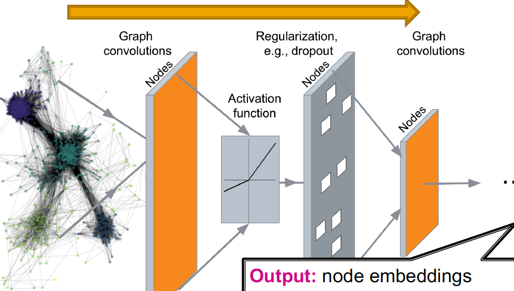  

Deep Graph Decorders:

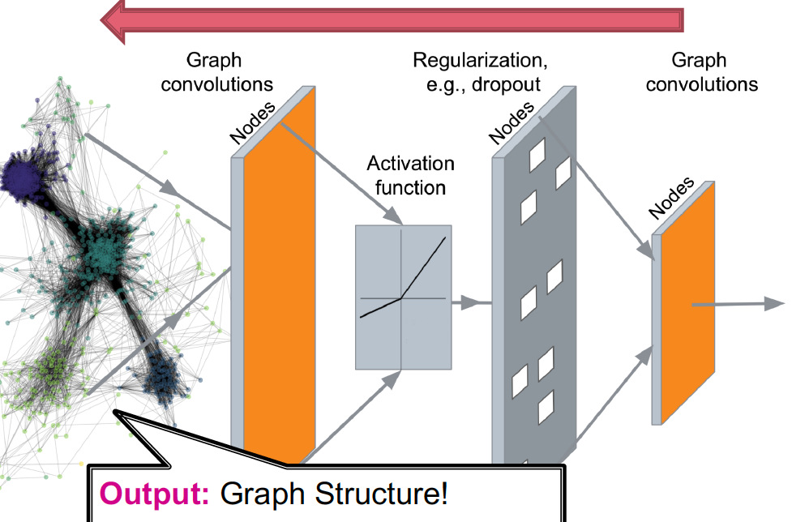 

#### 8.1.1 ML for Graph Generation

Graph Generation Tasks:
- Task 1: Realistic graph generation
    - Generate graphs that are **similar to a given set of graphs** [Focus of this lecture]
    - Goal: Given graphs sampled from $p_{data}(G)$
        - Learn the distribution $p_{model}(G)$
        - Sample from $p_{model}(G)$

- Task 2: Goal-directed graph generation
    - Generate graphs that **optimize given objectives/constraints** E.g., Drug molecule generation/optimization

Graph Generative Models Basics:

- Setup: Assume we want to learn a generative model from a set of data points (i.e., graphs) {$x_i$}
    - $p_{data}(x)$ is the data distribtion, which is never known to us, but we have sampled $x_i ~ p_{data}(x)$
    - $p_{model}(x;\theta)$ is the model, parametrized by $\theta$, that we use to approximate $p_{data}(x)$
- Goal:
    1. Make $p_{model}(x;\theta)$ close to $p_{data}(x)$ (Density Estimation)
        - Key Principle: Maximum Likelihood
        - Fundamental approach to modeling distributions: 

            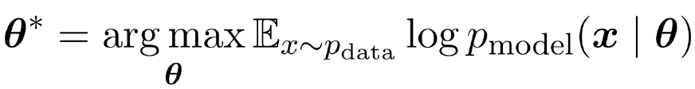  

            Find parameters $\theta^*$, such that for observed data points $x_i$ ~ $p_{data}$, $\sum_ilogp_{model}(x_i;\theta^*)$ has the highest value, among all possible choices of $\theta$

            &rarr; That is, find the model that is most likely to have generated the observed data x

    2. Make sure we can sample from $p_{model}(x;\theta)$ (Sampling)

        The most common approach:
        
        - (1) Sample from a simple noise distribution $z_i$ ~ N(0,1)

        - (2) Transform the noise $z_i$ via $f(⋅)$: $x_i=f(z_i;\theta)$

        Then $x_i$ follows a complex distribution

        Q: How to design $f(⋅)$?

        A: Use Deep Neural Networks, and train it using the data we have!

Auto-regressive models:
- $p_{model}(x;\theta)$ is used for both density estimation and sampling (our two goals)
    - Other models like Variational Auto Encoders (VAEs), Generative Adversarial Nets (GANs) have 2 or more models, each playing one of the roles

- **Idea: Chain rule**: Joint distribution is a product of conditional distributions

    - $p_{model}(x;\theta) = \prod^n_{t=1}p_{model}(x_t|x_1, ..., x_{t-1};\theta)$
    - E.g., $x$ is a vector, $x_t$ is the t-th dimension; $x$ is a sentence, $x_t$ is the t-th word.
    - In our case $x_t$ will be the t-th action (add node, add edge)

#### 8.1.2 Graph RNN: Generating Realistic Graphs

Graph RNN Idea: Generating graphs via sequentially adding nodes and edges

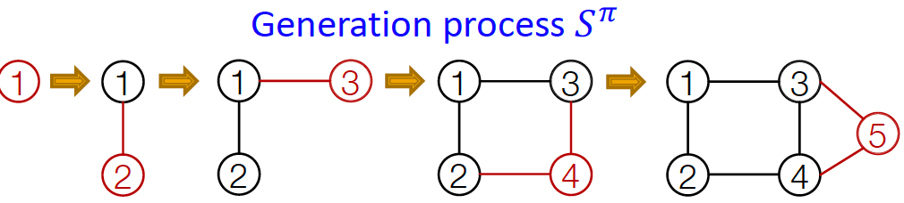   

[GraphRNN: Generating Realistic Graphs with Deep Auto-regressive Models](https://cs.stanford.edu/people/jure/pubs/graphrnn-icml18.pdf). J. You, R. Ying, X.
Ren, W. L. Hamilton, J. Leskovec. International Conference on Machine Learning (ICML), 2018.

Model Graphs as Sequences:
- Graph G with node ordering π can be uniquely mapped into a sequence of node and edge additions $S^π$

    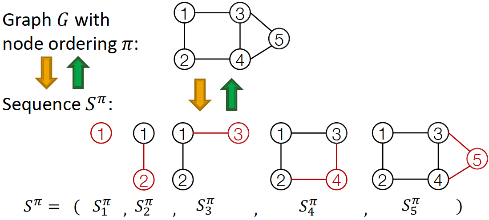  

    The sequence $S^π$ has two levels (S is a sequence of sequences):
    - Node-level: at each step, a new node is added. 
    - Edge-level: at each step, add a new edge between existing nodes

        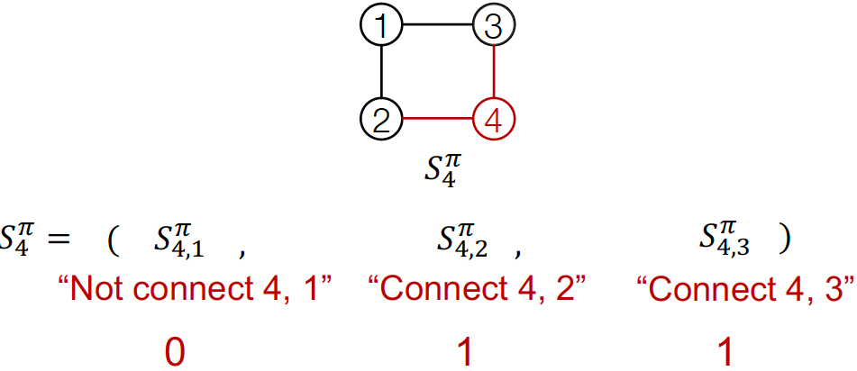  

        Each Node-level step is an edge-level sequence 

- Summary: A graph + a node ordering = A sequence of sequences
- Node ordering is randomly selected (we will come back to this)

    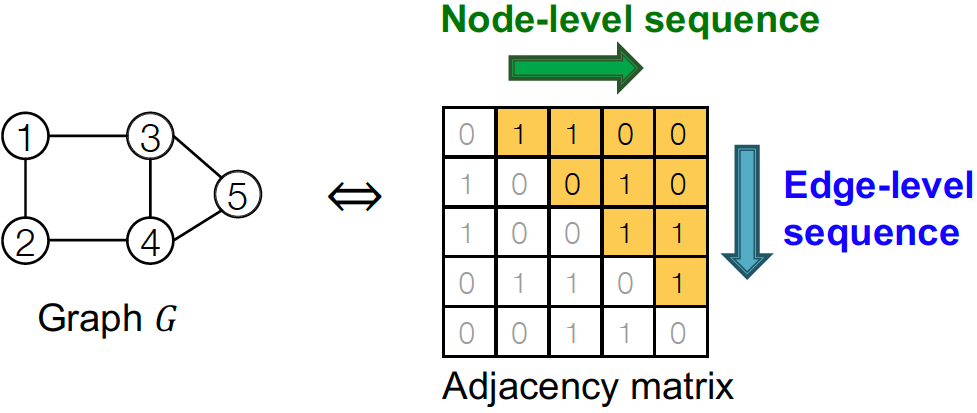  

- Need to model two processes:
    1) Generate a state for a new node (Node-level sequence)
    2) Generate edges for the new node based on its state (Edge-level sequence)

    Approach: Use Recurrent Neural Networks (RNNs) to model these processes!

Background: Recurrent NNs
- RNNs are designed for sequential data
    - RNN sequentially takes input sequence to update its hidden states
    - The hidden states summarize all the information input to RNN
    - The update is conducted via RNN cells

    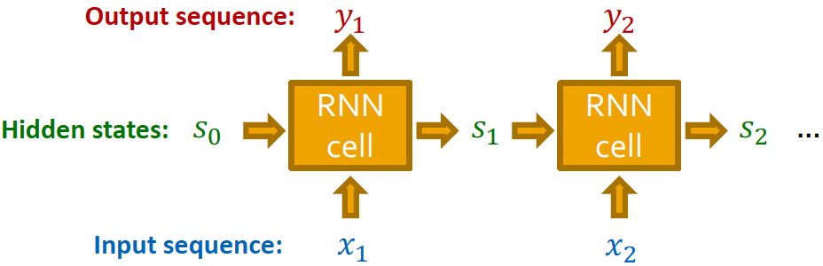 

    - $s_t$: State of RNN after step t
    - $x_t$: Input to RNN at step t
    - $y_t$: Output of RNN at step t
- RNN cell: $W,U,V$ Trainable parameters
    1. Update hidden state: $s_t=\sigma(W\cdot x_t+U\cdot s_{t-1})$
    2. Output prediction: $y_t=V\cdot s_t$

    More expressive cells: GRU, LSTM, etc.

Graph RNN: Two levels of RNN
- GraphRNN has a node-level RNN and an edge-level RNN
- Relationship between the two RNNs:
    - Node-level RNN generates the initial state for edge-level RNN
    - Edge-level RNN sequentially predict if the new node will connect to each of the previous node

    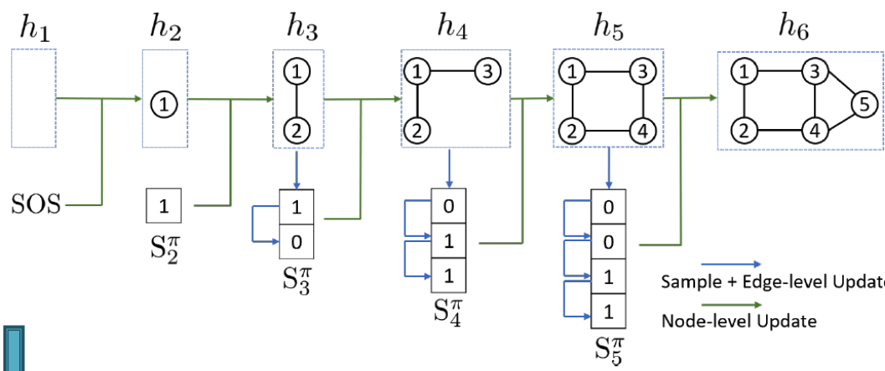  

    
RNN for Sequence Generation
- How to generate a sequence with RNN?

    A: Let $x_{t+1}=y_t$! (Use the previous output as input)

- How to initialize the input sequence?

    A: Use **start of sequence token (SOS)** as the initial input
    - SOS is usually a vector with all zero/ones
- When to stop generation?

    A: Use **end of sequence token (EOS)** as an extra RNN output
    - If output EOS=0, RNN will continue generation
    - If output EOS=1, RNN will stop generation

    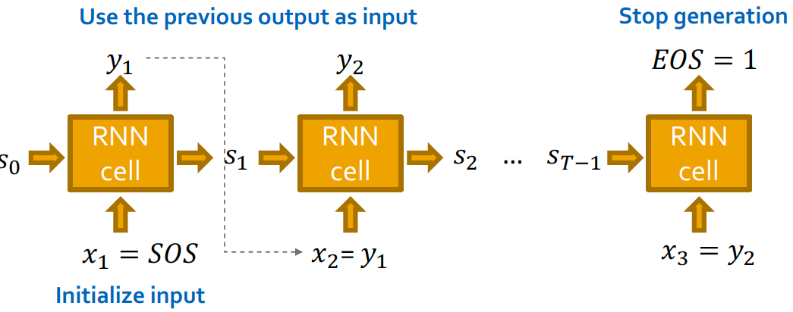  

    &rarr; This is good, but this model is deterministic

- Remember our goal: Use RNN to model $\prod^n_{k=1}p_{model}(x_t|x_1,...,x_{t-1};\theta)$

    - Let $y_t=p_{model}(x_t|x_1,...,x_{t-1};\theta)$.
    - Then we need to sample $x_{t+1}$ from $y_t:x_{t+1}$~$y_t$
        - Each step of RNN outputs a p**robability of a single edge**
        - We then sample from the distribution, and feed sample to next step

    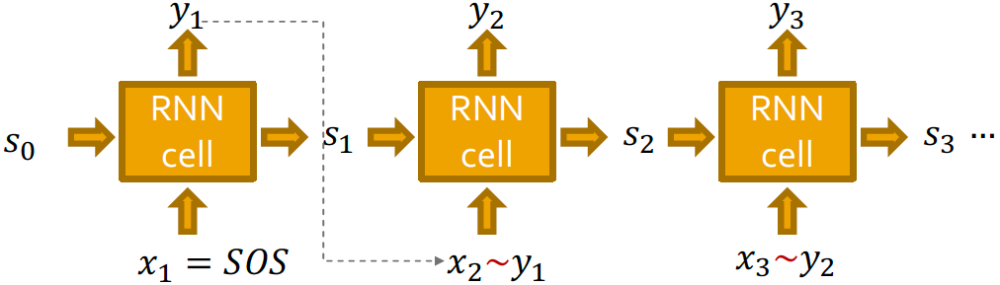  

RNN at Test Time

- Suppose we already have trained the model  
    - $y_t$ is a scalar, following a Bernoulli distribution
    - 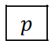 means value 1 has prob. p, value 0 has prob. 1-p

    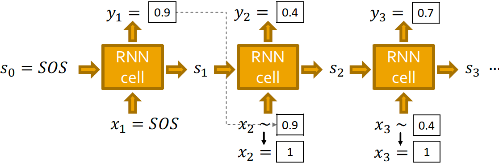      

    How do we use training data $x_1, x_2,...,x_n$?

RNN at Training Time

- We observe a sequence $y^∗$ of edges [1,0,…]
- **Principle: Teacher Forcing** - Replace input and output by the real sequence

    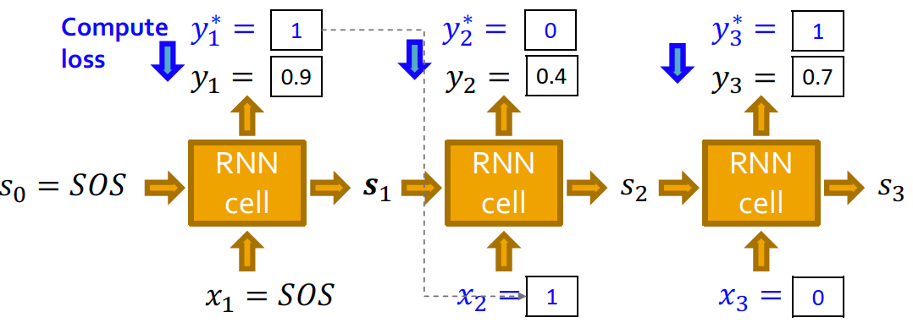  

- Loss $L$: Binary cross entropy
- Minimize: $L=-[y_1^*log(y_1)+(1-y_1^*)log(1-y_1)]$
    - if $y_1^*=1$, we minimize $-log(y_1)$, making $y_1$ higher
    - if $y_1^*=0$, we minimize $-log(1-y_1)$, making $y_1$ lower
    - This way $y_1$ is fitting the data samples $y_1^*$
- Remember: $y_1$ is computed by RNN, this **loss will adjust RNN parameters accordingly**, using back propagation!

Putting Things Together

- Our Plan:
    1) Add a new node: We run Node RNN for a step, and use it output to initialize Edge RNN
    2) Add new edges for the new node: We run Edge RNN to predict if the new node will connect to each of the previous node
    3) Add another new node: We use the last hidden state of Edge RNN to run Node RNN for another step
    4) Stop graph generation: If Edge RNN outputs EOS at step 1, we know no edges are connected to the new node. We stop the graph generation.

- Training
    1. Start the node RNN. Assuming Node 1 is in the graph, now adding Node 2.
    2. Edge RNN predicts how Node 2 connects to Node 1

        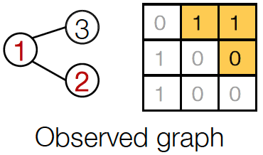 
        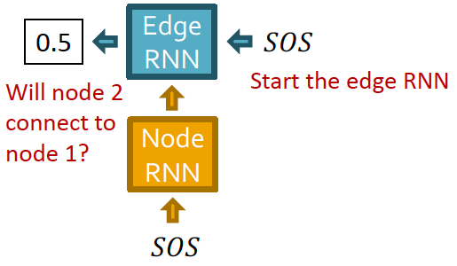   

    3. Update Node RNN using Edge RNN's hidden state

        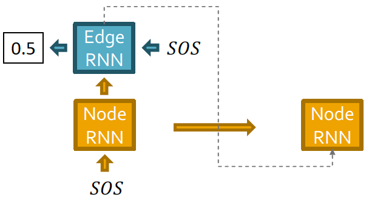  

    4. Edge RNN predicts how Node 3 tries to connects to Nodes 1, 2

        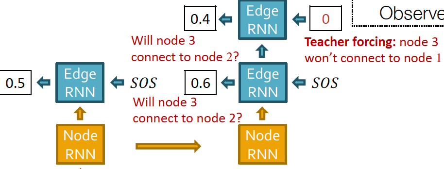 

    5. Update Node RNN using Edge RNN's hidden state

        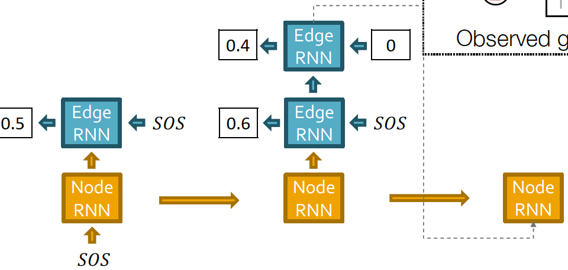  

    6. Stop generation since we know node 4 won’t connect to any nodes

        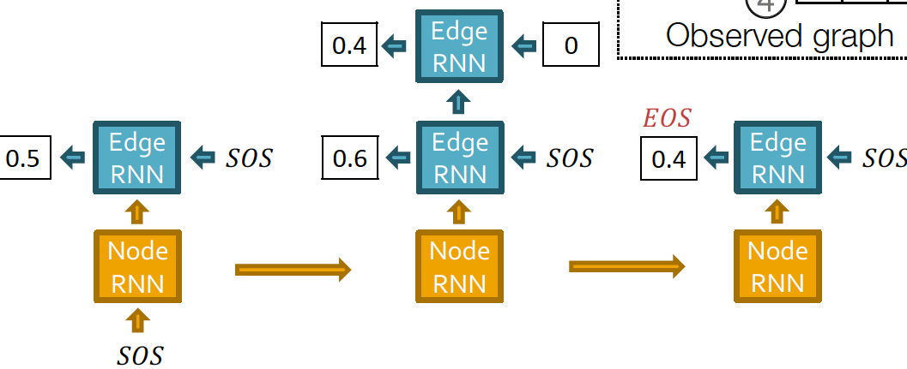  
    7. For each prediction, we get supervision from the ground truth
    8. **Backprop through time**: Gradients are accumulated across time steps

        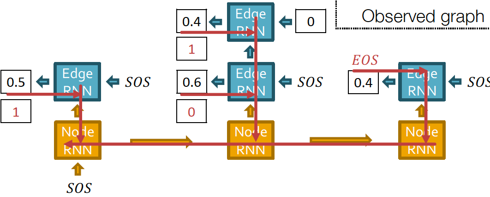  

- Testing
    1) Sample edge connectivity based on predicted distribution
    2) Replace input at each step by GraphRNN’s own predictions

- Quick Summary
    - Generate a graph by generating a two level sequence
    - Use RNN to generate the sequences
    - Next: Making GraphRNN tractable, proper evaluation

#### 8.1.3 Scaling up & Evaluating Graph Generation

Issue: Tractability

- Any node can connect to any prior node
- Too many steps for edge generation
    - Need to generate full adjacency matrix
    - Complex too-long edge dependencies

    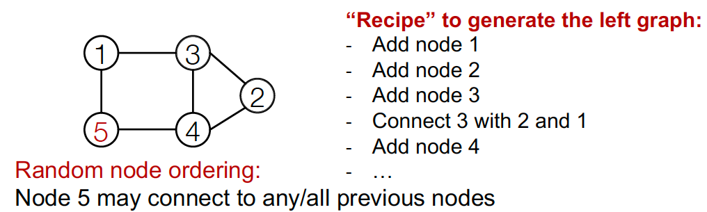   

    How do we limit this complexity?

Solution: Tractability via BFS

- Breadth-First Search node ordering

     

    - Since Node 4 doesn’t connect to Node 1
    - We know all Node 1’s neighbors have already been traversed
    - Therefore, Node 5 and the following nodes will never connect to node 1
    - We only need memory of 2 “steps” rather than n − 1 steps

- Benefits:
    - Reduce possible node orderings: From O(n!) to number of distinct BFS orderings
    - Reduce steps for edge generation: Reducing number of previous nodes to look at

    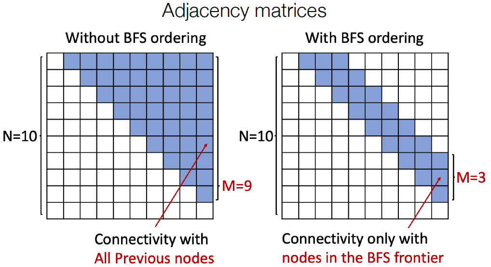  

Evaluating Generated Graphs

- Task: Compare two sets of graphs and define similarity metrics for graphs
- Solution
    1. Visual similarity

    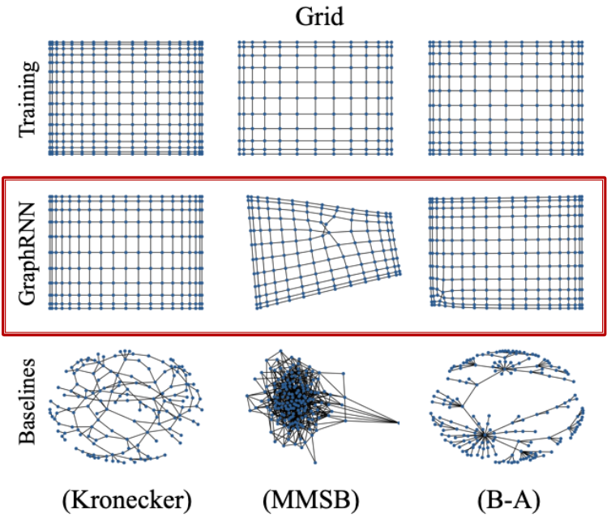  
    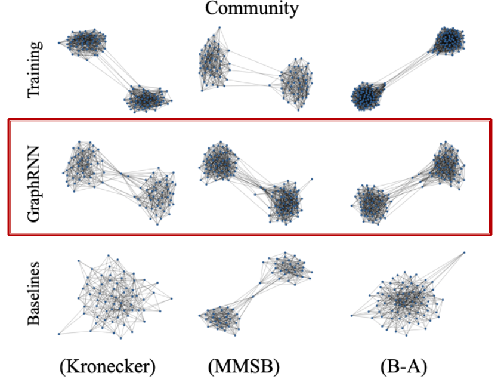  

    Issue: Direct comparison between two graphs is hard (isomorphism test is NP)!
    
    Solution: Compare graph statistics!

    2. Graph statistics similarity

    
        Typical Graph Statistics:
        - Degree distribution (Deg.)
        - Clustering coefficient distribution (Clus.)
        - Orbit count statistics (Orbit)

        Note: Each statistic is a probability distribution

        Step 1: How to compare **two graph statistics**
        - **Earth Mover Distance (EMD)**: Compare **similarity between 2 distributions**
        - Intuition: Measure the minimum effort that move earth from one pile to the other
        
            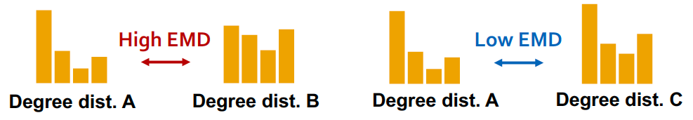  

        Step 2: How to comapre **sets oF graph statistics**
        - **Maximum Mean Discrepancy (MMD)** based on EMD
        - Compare **similarity between 2 sets**, based on the similarity between set elements

             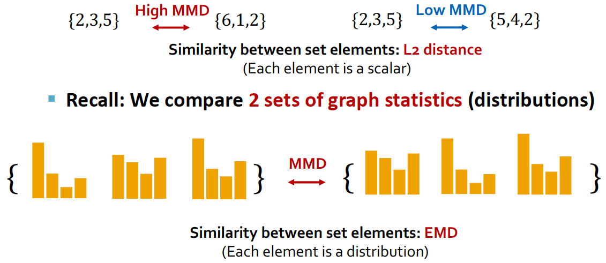

    Example:

     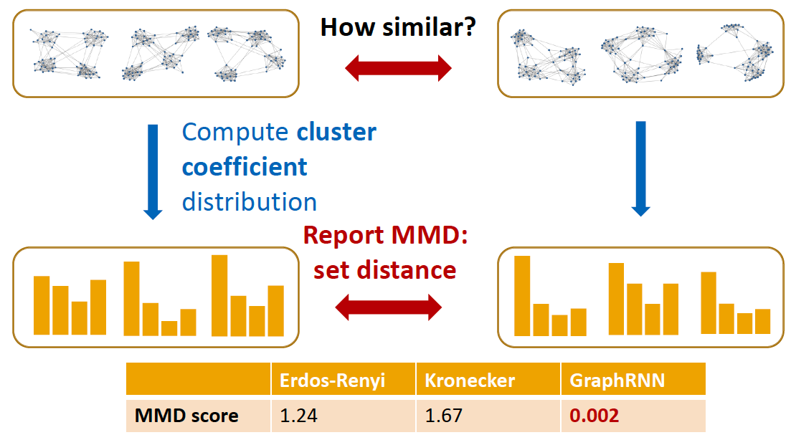 

#### 8.1.4 Applicaitons of Deep Graph Generative Models

Application: Drug Discovery

- Question: Can we learn a model that can generate valid and realistic molecules with optimized property scores?
- [Graph Convolutional Policy Network for Goal-Directed Molecular Graph Generation](https://cs.stanford.edu/people/jure/pubs/gcpn-neurips18.pdf). J. You, B. Liu, R. Ying, V. Pande, J. Leskovec. Neural Information Processing Systems (NeurIPS), 2018

     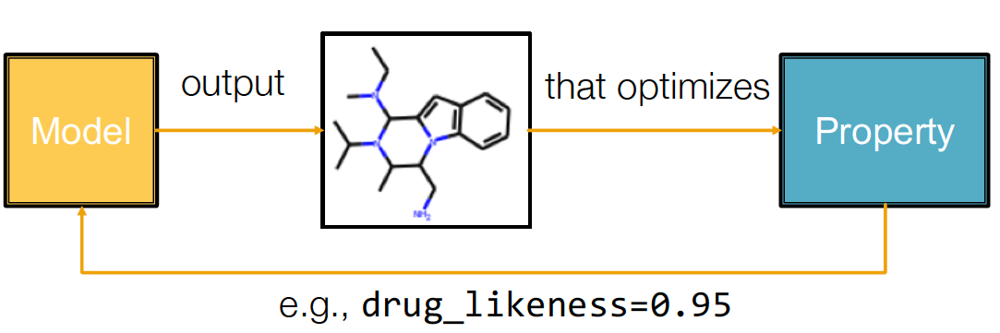 

Goal-Directed Graph Generation
- Generating graphs that:
    - Optimize a given objective (High scores)
        - e.g., drug-likeness
    - Obey underlying rules (Valid)
        - e.g., chemical validity rules
    - Are learned from examples (Realistic)
        - Imitating a molecule graph dataset
        - We have just covered this part
- Challenge: objectives like drug-likeness are governed by physical law, which are assumed to be unknown to us.
- Idea: Reinforcement Learning (RL)

    A ML agent **observes** the environment, takes an **action** to interact with the environment, and receives positive or negative **reward**
    
    The agent then **learns from this loop**

    Key idea: Agent can directly learn from environment, which is a **blackbox** to the agent

- Solution: Graph Convolutional Policy Network (GCPN)

    Key component of GCPN:
    - Graph Neural Network captures graph structural information
    - Reinforcement learning guides the generation towards the desired objectives
    - Supervised training imitates examples in given datasets

- GCPN vs GraphRNN
    - Commonality:
        - Generate graphs sequentially
        - Imitate a given graph dataset
    - Main Differences:
        - GCPN uses **GNN** to predict the generation action
            - Pros: GNN is more expressive than RNN
            - Cons: GNN takes longer time to compute than RNN
        - GCPN further uses RL to direct graph generation to our goals
            - RL enables goal-directed graph generation
    
    - Sequential graph generation
        - GraphRNN: predict action based on **RNN hidden states**

        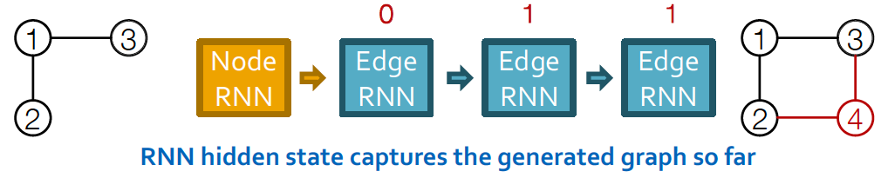 

        - GCPN: predict action based on **GNN node embeddings**

        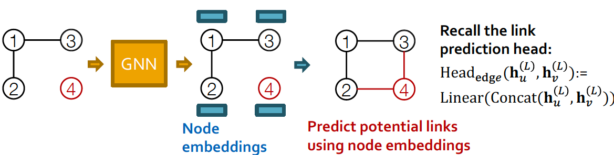 

- Overview of GCPN

      

    (a) Insert nodes

    (b,c) Use GNN to predict which nodes to connect
    
    (d) Take action (check chemical validity)
    
    (e, f) Compute reward

    - How do we set rewards?
        - Step reward: Learn to take valid action
            - At each step, assign small positive reward for valid action
        - Final reward: Optimize desired properties
            - At the end, assign positive reward for high desired property
        - Reward = Final reward + Step reward
    
    - How do we train?

    1. Supervised training: Train policy by **imitating the action** given by real observed graphs. Use
gradient.
        - We have covered this idea in GraphRNN
    2. RL training: Train policy to optimize rewards. Use standard **policy gradient** algorithm
        - Refer to any RL course, e.g., CS234

        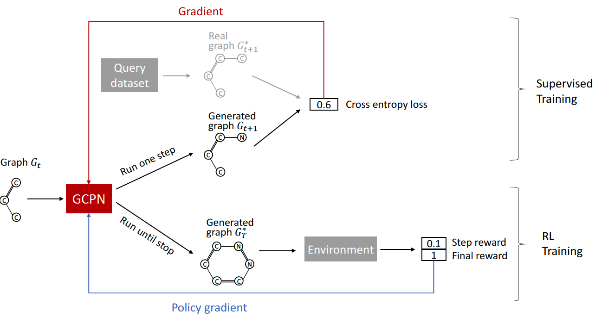   

- Qualitative Results

    Property optimization: Generate molecules with high specified property score

       

    Constrained optimization: Edit a given molecule for a few steps to achieve higher property score

    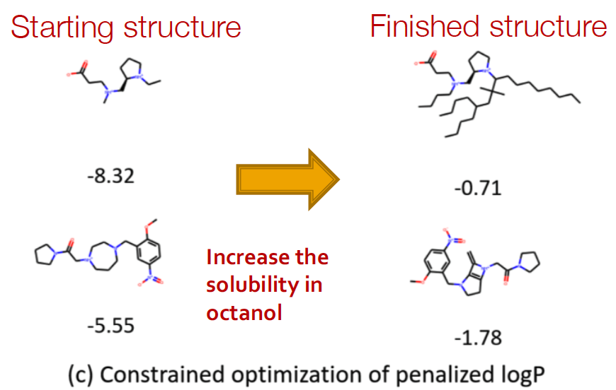 

#### Summary of Graph Generation

- Complex graphs can be successfully generated via sequential generation using deep learning
- Each step a decision is made based on hidden state, which can be
    - Implicit: vector representation, decode with RNN
    - Explicit: intermediate generated graphs, decode with GCN
- Possible tasks:
    - Imitating a set of given graphs
    - Optimizing graphs towards given goals 