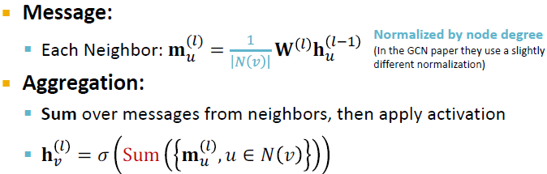

### 2.1 Graph Neural Netowrks (GNNs)

- Node Embeddings Recap: Map nodes to 𝑑-dimensional embeddings such that similar nodes in the graph are embedded close together.

    
    

- Recap: Shallow Encoders

    Simplest encoding approach: encoder is just an embedding-lookup. ENC(v) = $z_v$ = $Z \cdot v$

    
    

    Limitations of shallow embedding methods:
     

- Today: Deep Graph Encoders   

    **ENC(v) = multiple layers of non-linear transformations based on graph structure.**

    Note: all the deep encoders can be combined with node similarity functions defined in the Lecture 3.
     

    Tasks on Networks:
    - Node classification: predict the type of a given node
    - Link prediction: predict whether two nodes are linked
    - Community detection: identify densely linked clusters of nodes
    - Network similarity: how similar are two (sub)networks

#### 2.1.1 Basics of Deep Learning

Supervised learning: we are given input 𝒙, and the goal is to predict label 𝒚. 

Input x can be: vectors of real numbers, sequences (natural language), matrices (images), graphs (potentially with node and edge features).

 

- Multi-layer Perceptron (MLP): each layer of MLP conbines linear transformation and non-linearity.
  
     

    Suppose x is 2-dimensional, with entries x1 and x2:
    
     

- Summary

     

#### 2.1.2 Deep Learning for Graphs

Problem Setup:

- A Naive Approach: Join adjacency matrix and features. Feed them intoa deep neural net.

       

    Issues with this idea:
  - O(|V|) parameters
  - Not applicable to graphs of different sizes
  - Sensitive to node ordering

- Idea: Convolutional Netowrks

         

    Goal is to generalize convolutions beyonod simple lattices leveraging node features/attributes (i.e. text, images).

    But for real-world graphs, there is no fixed notion of locality or sliding window on the graph. Graph is permutation invariant.

- Permutation Invariance

    Graph does not have a canonical order of the nodes! We can have many different order plans.

       

    **Graph and node representations should be the same for order plan 1 and 2.**

      

      

- Permutation Equivariance

    For node representation, consider we learn a function $f$ that maps a graph $G=(A,X)$ to a matrix of shape (m,d).

    If the output vector of a node at the same position in the graph remains unchanged for any order plan, we say $f$ is **permutation equivariant**.

     

     

- GNN Overview

    GNNs consist of multiple permutation equivariant/invariant functions.

     

    Other neural network architectures i.e. MLPs are not permutation invariant/equivariant. Changing the order of the input leads to different outputs. This explains why the naive MLP approach fails for graphs.

     

    Therefore, we need to design GNNs that are permutation invariant/equivariant by passing and aggregating information from neighbors.

#### 2.1.3 Graph Convolution Networks

General Idea: Node's neighborhood defines a computation graph. Learn how to propagate information across the graph to comupte node features.

 

- Aggregate Neighbors

    Key idea: Generate node embeddings based on local network neighborhoods. Information is aggregated from their neighbors using neural networks.

     

        

- Deep Model: Many Layers

    Model can be of arbitrary depth:
    - Nodes have embeddings at each layer
    - Layer 0 embedding of node $v$ is its input features $x_v$
    - Layer-k embedding gets info from nodes that are k hops away
  
      

- Neighborhood Aggreagation: Key distinctions are in how different approaches aggregate info across the layers.

    Basic approach: average info from neighbors and apply a neural network.

      

    The invariance and equivariance properties for a GCN:
    - Given a node, the GCN that computes its embedding is permutation invariant.

      

    - Considering all nodes in a graph, GCN computation is permutation equivariant.

     

- Training the Model: Model Parameters

    $h^k_v$: the hidden representation of node $v$ at layer $k$
    - $W_k$: weight matrix for neighborhood aggregation
    - $B_k$: weight matrix for transforming hidden vector of self

     

    We can feed these embeddings into any loss function and run SGD to train the weight parameters.

- Training the Model: Matrix Formulation
  
  Many aggregations can be performed efficiently by (sparse) matrix operations.

     
     

    Note: not all GNNs can be expressed in matrix form, when aggregation function is complex.
- Training the Model: Loss function

     
    
  - Unsupervised Training: "Similar" nodes have similar embeddings

    

  - Supervised Training: Directly train the model for a supervised task 
  
    i.e. node classification on safe or toxic drug using cross entropy loss

  

- Model Design Overview

    1. Define a neighborhood aggregation function
    2. Define a loss function on the embeddings
    3. Train on a set of nodes, i.e. a batch of compute graphs
    4. Generate embeddings for nodes as needed, even for nodes we never trained on.

- Inductive Capability
    - The same aggregation parameters are shared for all nodes. 
    - The number of model parameters is sublinear in |V| and we can generalize to unseen nodes.
  
    

    - New Nodes: Many application settings constantly encounter previously unseen nodes, i.e. Reddit, YouTube, Google Scholar. So we need to generate new embeddings "on the fly".
    
    - New Graphs: Inductive node embedding also allows generalizing to entirely unseen graphs. i.e. train on protein interaction graph from model organism A and generate embeddings on newly collected data about organism B.

#### 2.1.3 GNNs subsume CNNs

How do GNNs compare to prominent architectures such as Convolutional Neural Nets?

   

  

Key difference is that, we can learn different $W^u_l$ for different "neighbor" $u$ for pixel $v$ on the image. The reason is we can pick an order for the 9 neighbors using **relative position** to the center pixel: {(-1,-1). (-1,0), (-1, 1), …, (1, 1)}

CNN can be seen as a special GNN with fixed neighbor size and ordering:
- The size of the filter is pre-defined for a CNN.
- The advantage of GNN is it processes arbitrary graphs with different degrees for each node.
- CNN is not permutation invariant/equivariant. Switching the order of pixels will leads to different outputs.

### 2.2 GNN Design Space

#### 2.2.1 A General Perspective on GNNs

#### 2.2.2 Designing a Single Layer of a GNN

- Classical GNN Layers: GCN

    
    

- Classical GNN Layers: GraphSAGE

    

    Message is computed within the AGG()

    Two-stage aggregation:
    1. Aggregate from node neighbors: $h^{(l)}_{n(v)}=AGG({h^{(l-1)}_u, u \in N(v)})$
    2. Further aggregate over the node itself: $h^{(l)}_v=\sigma(W{(l)} \cdot CONCAT(h^{(l-1)}_v, h^{(l)}_{N(v)}))$
   
   Neighbor Aggregation Methods:
   - Mean: Take a weighted average of neighbors
  
            

   - Pool: Transform neighbor vectors and apply symmetric vector function Mean or Max
  
         

    - LSTM: Apply LSTM to reshuffled of neighbors

         

    L2 Normalization: optionally, apply L2 normalization to $h^{(l)}_v$ at every layer

    

    - Without $l_2$ normalization, the embedding vectors have different scales ($l_2$-norm) for vectors
    - In some cases (not always), normalization of embedding results in performance improvement
    - After $l_2$ normalization, all vectors will have the same $l_2$-norm.

- Classical GNN Layers: Graph Attention Networks (GAT)

    

    In GCN/GraphSAGE, $\alpha_{vu}=1/|N(v)|$ is the weighting factor (importance) of node $u$'s message to node $v$.
    - $\alpha_{vu}$ is defined explicitly based on the structural properties of the graph (node degree)
    - All neighbors $u \in N(v)$ are equally important to node $v$
  
    Can we do better than simple neighborhood aggregation? 
    
    -> GAT however assumes not all node's neighbors are equally important.
    - Attention is inspired by cognitive attention. The attention $\alpha_{vu}$ focuses on the important parts of the input data and fades out the rest.
    - Idea: the NN should devote more computing power on that small but important part of the data
    - Which part of the data is more important depends on the context and is learned through training.
  
    Can we let weighting factors $\alpha_{vu}$ to be learned?
    - Idea: Compute embedding $h^{(l)}_v$ of each node in the graph following an **attention strategy**:
      - Nodes attend over their neighborhoods' message
      - Implicitly specify different weights to different nodes in a neighborhood
    
    Attention Mechanism:
    - Let $\alpha_{vu}$ be computed as a byproduct of an attention mechanism $\alpha$
    - $\alpha$ computes attention coefficients $e_{vu}$ across pairs of nodes $u, v$ based on their messages:
  
          

    - Normalize $e_{vu}$ into the **final attention weight $\alpha_{vu}$**

          

    - Weighted sum based on the final attention weight $\alpha_{vu}$

         
    
    What is the form of attention mechanism $\alpha$?

    - This approach is agnostic to the choice of $\alpha$.

          
    
    - Parameters of $\alpha$ are trained jointly: learn the param together with weight matrices (i.e. other param of the NN $W^{(l)}$) in an end-to-end fashion.

    **Multi-head attention**: Stabilize the learning process of attention mechanism.
    - Create multiple attention scores (each replica with a different set of parameters):

           
    
    - Outputs are aggregated by concatenation or summation: $h^{(l)}_v=AGG(h^{(l)}_v[1], h^{(l)}_v[2], h^{(l)}_v[3])$
  
    Benefits of Attention Mechanism:

    - Key benefit: Allows for (implicitly) specifying different importance values ($\alpha_{vu}$) to different neighbors
    - Computationally efficient:
      - Computation of attentional coefficients can be parallelized across all edges of the graph
      - Aggregation may be parallelized across all nodes
    - Storage efficient:
      - Sparse matrix operations do not require more than $O(V + E)$ entries to be stored
      - Fixed number of parameters, irrespective of graph size
    - Localized:
      - Only attends over local network neighborhoods
    - Inductive capability:
      - It is a shared edge-wise mechanism
      - It does not depend on the global graph structure
  
    GAT Example: Cora Citation Net

    

- GNN Layer in Practice

    In practice, these classic GNN layers are a great starting point. We can often get better performance by considering a general GNN layer design. Concretely, we can include **modern deep learning modules** that proved to be useful in many domains.

    Many modern deep learning modules can be incorporated into a GNN layer:

     

  Batch Normalization:
  - Goal: Stabilize neural networks training
  - Idea: Given a batch of inputs (node embeddings)
    - Re-center the node embeddings into zero mean
    - Re-scale the variance into unit variance

   

   Dropout:
   - Goal: Regularize a NN to prevent overfitting
   - Idea:
     - During training: with some probability p, randomly set neurons to ero (turn off)
     - During testing: Use all the neurons for computation

    - In GNN, dropout is applied to the linear layer in the message function
  
    

    Activation (Non-linearity):

    

    Summary: 
    - Modern DL modules can be included into a GNN layer for better performance.
    - Designing novel GNN layers is still an active research frontier.
    - Suggested resources: You can explore diverse GNN designs or try out your own ideas in [GraphGym](https://github.com/snap-stanford/GraphGym)

#### 2.2.3 Stacking Layers of a GNN

The Standard way: Stacking GNN layers sequentially

Input: Initial raw node features $X_v$

Output: Node embeddings $h^{(l)}_v$ after L GNN layers

- The Over-smoothing Problem: When stacking many GNN layers, all the node embeddings converge to the same value. This is bad because we want to use node embeddings o differentiate nodes.

- Receptive Field of a GNN: 
  - Receptive field: The set of nodes that determine the embedding of a node of interest
  - In a K-layer GNN, each node has a receptive field of K-hop neighborhood.

  

  - Receptive field overlaps for two nodes: The shared neighbors quickly grows when we increase the number of hops.   

- Why does over-smoothing happen?

    - We knew the embedding of a node is determined by its receptive field. If two nodes have highly-overlapped receptive fields, then their embeddings are highly similar.
    - Stack many GNN layers -> nodes will have highly overlapped receptive fields -> node embeddings will be highly similar -> suffer from the oversmoothing problem

- Design GNN Layer Connectivity

    Lession 1: Be cautious when adding GNN layers
    - Unlike neural networks in other domains (CNN for image classification), adding more GNN layers do not always help.
    - Step 1: Analyze the necessary receptive field to solve your problem, i.e. by computing the diameter of the graph
    - Step 2: Set number of GNN layesr L to be a bit more than the receptive field we like. **Don't set L to be unecessarily large!**
  
    How to make a shallow GNN more expressive?
    - Solution 1: increase the expressive power within each GNN layer.
      - In our previous examples, each transformation or aggregation function only include one linear layer.
      - We can make them be deep neural network.

       
    - Solution 2: Add layers that do not pass messages
      - A GNN doesn't necessarily only contain GNN layers. i.e. we can add MLPlayers (applied to each node) before and after GNN layers, as pre-process and post-process layers.

       

    Lesson 2: In cases your problem still requires many GNN layers, add **skip connections** in GNNs
    - From over-smoothing observation, node embeddings in earlier GNN layers sometimes can better differentiate nodes.
    - Solution: We can increase the impact of earlier layers on the final node embeddings **by adding shortcuts in GNN**.

       

    - Why does skip connections work?
      - Intuition: it creates a mixture of models
      - N skip connections leads to $2^N$ possible paths. Each path could have up to N modules.
      - We automatically get **a mixture of shallow GNNs and deep GNNs**.

        

    - Example: GCN with Skip Connections

        

    - Other Options of Skip Connections
      - Directly skip to the last layer. The final layer directly aggregates from all the node embeddings in the previous layers.

             
 

### 2.3 GNN Training Pipeline

#### 2.3.1 Graph Augmentation for GNNs

- Why Augment Graphs?

    Our assumption so far has been raw input graph = computational graph. However, therea re reasons for breaking this assumption:
    - Features: the input graph lacks features
    - Graph structure:
      - too sparse -> inefficient message passing
      - too dense -> message passing is too costly
      - too large -> cannot fit the computational graph into a GPU
  
    It's unlikely that the input graph happens to be the optimal copmutation graph for embeddings.

- Graph Augmentation Approaches

#### 2.3.2 Training GNNs

#### 2.3.3 Setting up GNN Prediction Tasks