### 2.1 Graph Neural Netowrks (GNNs)

- Node Embeddings Recap: Map nodes to 𝑑-dimensional embeddings such that similar nodes in the graph are embedded close together.

    
    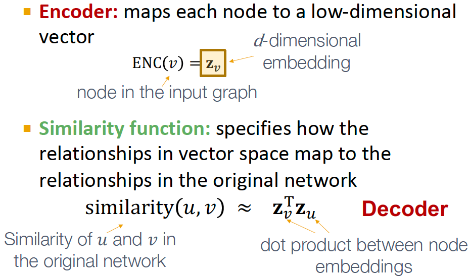

- Recap: Shallow Encoders

    Simplest encoding approach: encoder is just an embedding-lookup. ENC(v) = $z_v$ = $Z \cdot v$

    
    

    Limitations of shallow embedding methods:
    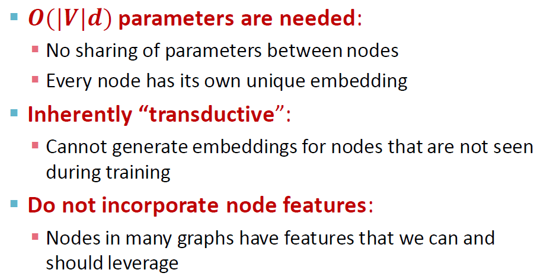 

- Today: Deep Graph Encoders   

    **ENC(v) = multiple layers of non-linear transformations based on graph structure.**

    Note: all the deep encoders can be combined with node similarity functions defined in the Lecture 3.
    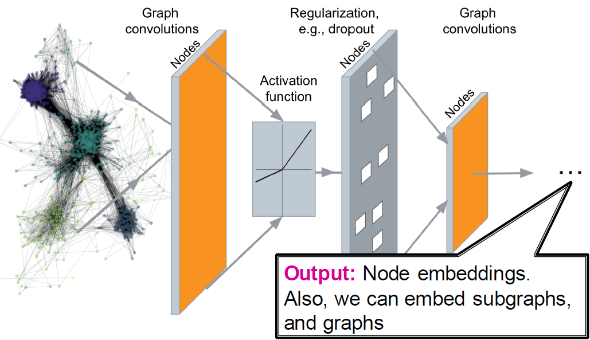 

    Tasks on Networks:
    - Node classification: predict the type of a given node
    - Link prediction: predict whether two nodes are linked
    - Community detection: identify densely linked clusters of nodes
    - Network similarity: how similar are two (sub)networks

#### 2.1.1 Basics of Deep Learning

Supervised learning: we are given input 𝒙, and the goal is to predict label 𝒚. 

Input x can be: vectors of real numbers, sequences (natural language), matrices (images), graphs (potentially with node and edge features).

 

- Multi-layer Perceptron (MLP): each layer of MLP conbines linear transformation and non-linearity.
  
     

    Suppose x is 2-dimensional, with entries x1 and x2:
    
     

- Summary

     

#### 2.1.2 Deep Learning for Graphs

Problem Setup:

- A Naive Approach: Join adjacency matrix and features. Feed them intoa deep neural net.

    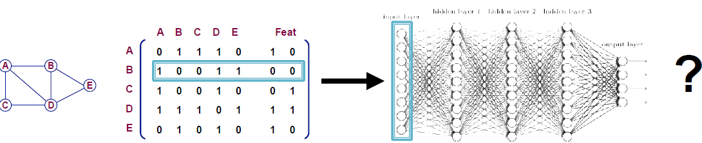   

    Issues with this idea:
  - O(|V|) parameters
  - Not applicable to graphs of different sizes
  - Sensitive to node ordering

- Idea: Convolutional Netowrks

    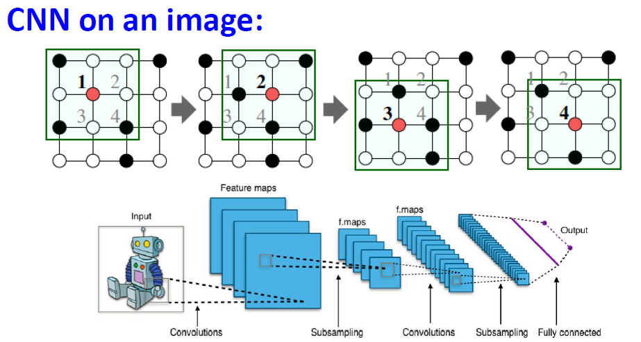     

    Goal is to generalize convolutions beyonod simple lattices leveraging node features/attributes (i.e. text, images).

    But for real-world graphs, there is no fixed notion of locality or sliding window on the graph. Graph is permutation invariant.

- Permutation Invariance

    Graph does not have a canonical order of the nodes! We can have many different order plans.

    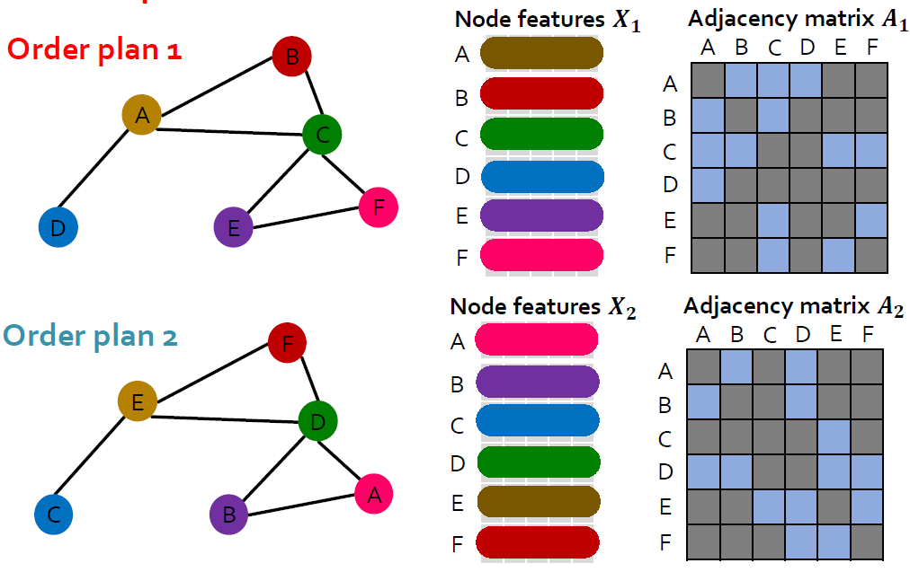   

    **Graph and node representations should be the same for order plan 1 and 2.**

    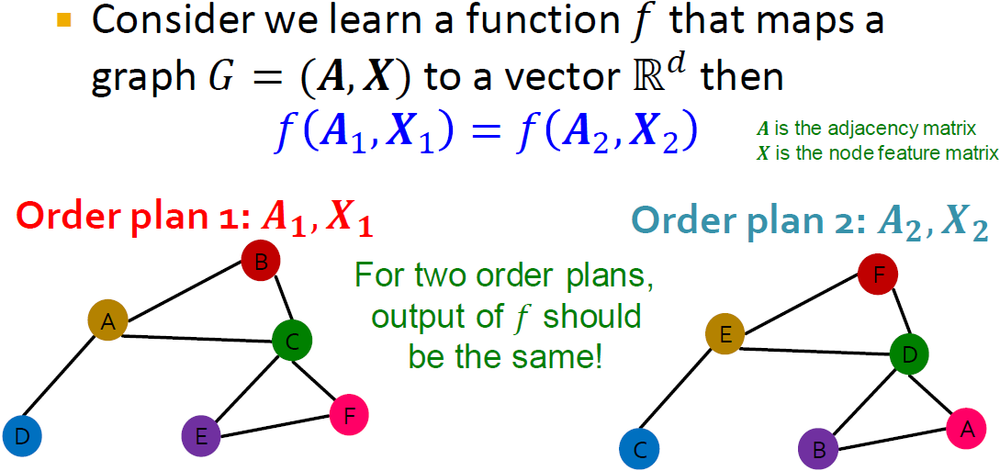  

    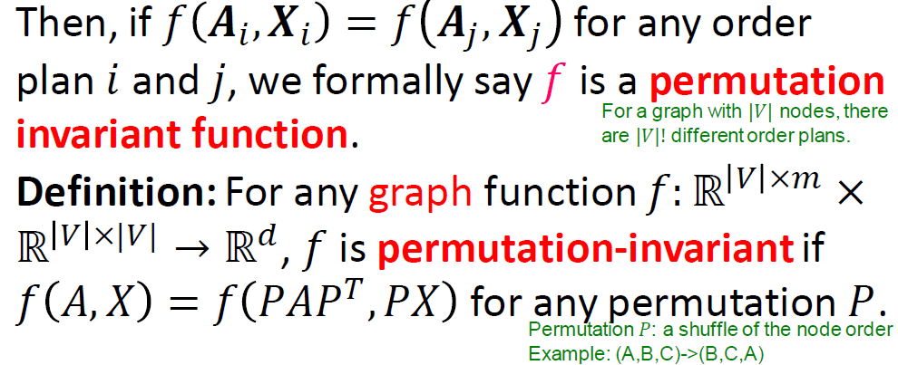  

- Permutation Equivariance

    For node representation, consider we learn a function $f$ that maps a graph $G=(A,X)$ to a matrix of shape (m,d).

    If the output vector of a node at the same position in the graph remains unchanged for any order plan, we say $f$ is **permutation equivariant**.

     

     

- GNN Overview

    GNNs consist of multiple permutation equivariant/invariant functions.

    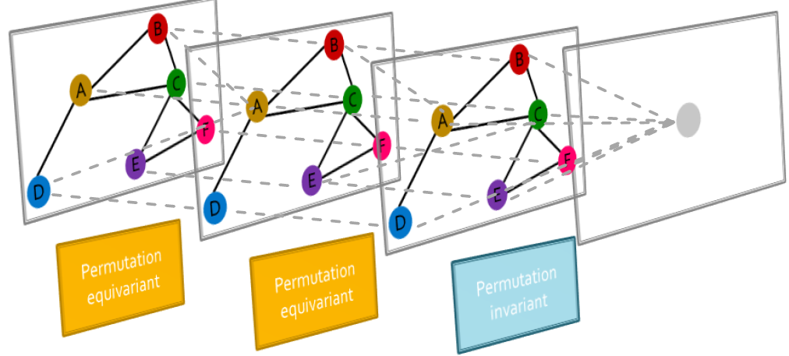 

    Other neural network architectures i.e. MLPs are not permutation invariant/equivariant. Changing the order of the input leads to different outputs. This explains why the naive MLP approach fails for graphs.

     

    Therefore, we need to design GNNs that are permutation invariant/equivariant by passing and aggregating information from neighbors.

#### 2.1.3 Graph Convolution Networks

General Idea: Node's neighborhood defines a computation graph. Learn how to propagate information across the graph to comupte node features.

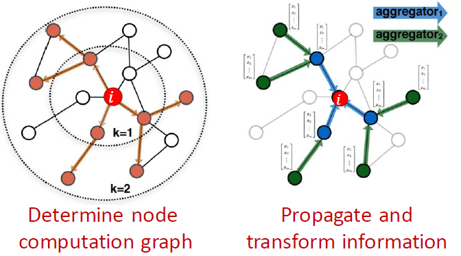 

- Aggregate Neighbors

    Key idea: Generate node embeddings based on local network neighborhoods. Information is aggregated from their neighbors using neural networks.

    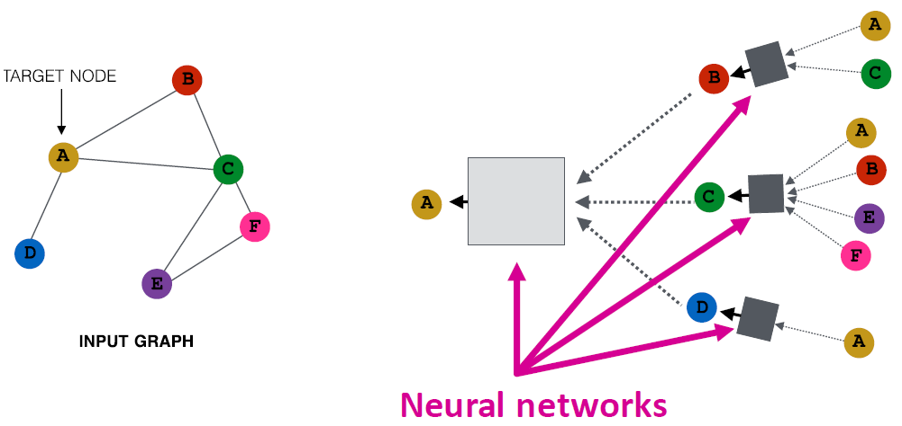 

        

- Deep Model: Many Layers

    Model can be of arbitrary depth:
    - Nodes have embeddings at each layer
    - Layer 0 embedding of node $v$ is its input features $x_v$
    - Layer-k embedding gets info from nodes that are k hops away
  
      

- Neighborhood Aggreagation: Key distinctions are in how different approaches aggregate info across the layers.

    Basic approach: average info from neighbors and apply a neural network.

      

    The invariance and equivariance properties for a GCN:
    - Given a node, the GCN that computes its embedding is permutation invariant.

      

    - Considering all nodes in a graph, GCN computation is permutation equivariant.

     

- Training the Model: Model Parameters

    $h^k_v$: the hidden representation of node $v$ at layer $k$
    - $W_k$: weight matrix for neighborhood aggregation
    - $B_k$: weight matrix for transforming hidden vector of self

     

    We can feed these embeddings into any loss function and run SGD to train the weight parameters.

- Training the Model: Matrix Formulation
  
  Many aggregations can be performed efficiently by (sparse) matrix operations.

     
     

    Note: not all GNNs can be expressed in matrix form, when aggregation function is complex.
- Training the Model: Loss function

     
    
  - Unsupervised Training: "Similar" nodes have similar embeddings

  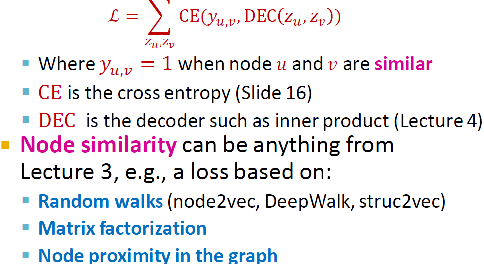  

  - Supervised Training: Directly train the model for a supervised task 
  
    i.e. node classification on safe or toxic drug using cross entropy loss

  

- Model Design Overview

    1. Define a neighborhood aggregation function
    2. Define a loss function on the embeddings
    3. Train on a set of nodes, i.e. a batch of compute graphs
    4. Generate embeddings for nodes as needed, even for nodes we never trained on.

- Inductive Capability
    - The same aggregation parameters are shared for all nodes. 
    - The number of model parameters is sublinear in |V| and we can generalize to unseen nodes.
  
    

    - New Nodes: Many application settings constantly encounter previously unseen nodes, i.e. Reddit, YouTube, Google Scholar. So we need to generate new embeddings "on the fly".
    
    - New Graphs: Inductive node embedding also allows generalizing to entirely unseen graphs. i.e. train on protein interaction graph from model organism A and generate embeddings on newly collected data about organism B.

#### 2.1.3 GNNs subsume CNNs

How do GNNs compare to prominent architectures such as Convolutional Neural Nets?

   

  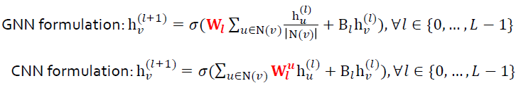

Key difference is that, we can learn different $W^u_l$ for different "neighbor" $u$ for pixel $v$ on the image. The reason is we can pick an order for the 9 neighbors using **relative position** to the center pixel: {(-1,-1). (-1,0), (-1, 1), …, (1, 1)}

CNN can be seen as a special GNN with fixed neighbor size and ordering:
- The size of the filter is pre-defined for a CNN.
- The advantage of GNN is it processes arbitrary graphs with different degrees for each node.
- CNN is not permutation invariant/equivariant. Switching the order of pixels will leads to different outputs.

### 2.2 GNN Design Space

#### 2.2.1 A General Perspective on GNNs

#### 2.2.2 Designing a Single Layer of a GNN

#### 2.2.3 Stacking Layers of a GNN

### 2.3 GNN Training Pipeline

#### 2.3.1 Graph Augmentation for GNNs

#### 2.3.2 Training GNNs

#### 2.3.3 Setting up GNN Prediction Tasks