### 2.1 Graph Neural Netowrks (GNNs)

- Node Embeddings Recap: Map nodes to 𝑑-dimensional embeddings such that similar nodes in the graph are embedded close together.

    
    

- Recap: Shallow Encoders

    Simplest encoding approach: encoder is just an embedding-lookup. ENC(v) = $z_v$ = $Z \cdot v$

    
    

    Limitations of shallow embedding methods:
     

- Today: Deep Graph Encoders   

    **ENC(v) = multiple layers of non-linear transformations based on graph structure.**

    Note: all the deep encoders can be combined with node similarity functions defined in the Lecture 3.

     

    Tasks on Networks:
    - Node classification: predict the type of a given node
    - Link prediction: predict whether two nodes are linked
    - Community detection: identify densely linked clusters of nodes
    - Network similarity: how similar are two (sub)networks

#### 2.1.1 Basics of Deep Learning

Supervised learning: we are given input 𝒙, and the goal is to predict label 𝒚. 

Input x can be: vectors of real numbers, sequences (natural language), matrices (images), graphs (potentially with node and edge features).

 

- Multi-layer Perceptron (MLP): each layer of MLP conbines linear transformation and non-linearity.
  
     

    Suppose x is 2-dimensional, with entries x1 and x2:
    
    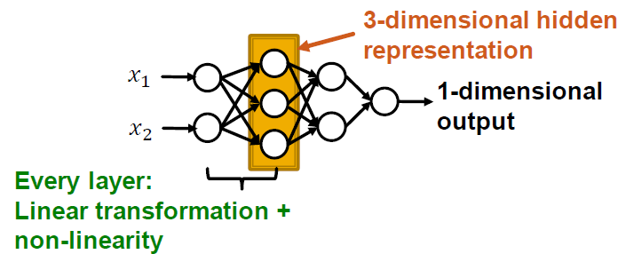 

- Summary

    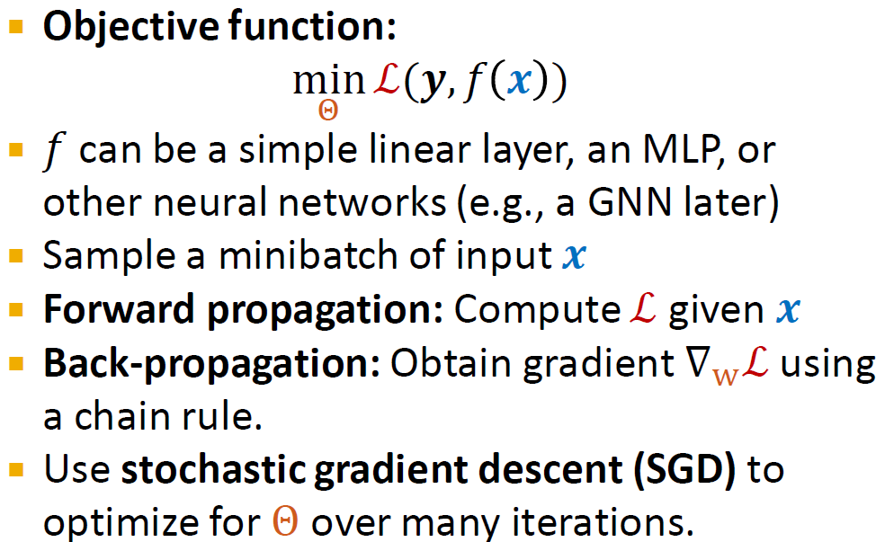 

#### 2.1.2 Deep Learning for Graphs

Problem Setup:

- A Naive Approach: Join adjacency matrix and features. Feed them intoa deep neural net.

       

    Issues with this idea:
  - O(|V|) parameters
  - Not applicable to graphs of different sizes
  - Sensitive to node ordering

- Idea: Convolutional Netowrks

         

    Goal is to generalize convolutions beyonod simple lattices leveraging node features/attributes (i.e. text, images).

    But for real-world graphs, there is no fixed notion of locality or sliding window on the graph. Graph is permutation invariant.

- Permutation Invariance

    Graph does not have a canonical order of the nodes! We can have many different order plans.

       

    **Graph and node representations should be the same for order plan 1 and 2.**

      

      

- Permutation Equivariance

    For node representation, consider we learn a function $f$ that maps a graph $G=(A,X)$ to a matrix of shape (m,d).

    If the output vector of a node at the same position in the graph remains unchanged for any order plan, we say $f$ is **permutation equivariant**.

     

     

- GNN Overview

    GNNs consist of multiple permutation equivariant/invariant functions.

     

    Other neural network architectures i.e. MLPs are not permutation invariant/equivariant. Changing the order of the input leads to different outputs. This explains why the naive MLP approach fails for graphs.

     

    Therefore, we need to design GNNs that are permutation invariant/equivariant by passing and aggregating information from neighbors.

#### 2.1.3 Graph Convolution Networks

General Idea: Node's neighborhood defines a computation graph. Learn how to propagate information across the graph to comupte node features.

 

- Aggregate Neighbors

    Key idea: Generate node embeddings based on local network neighborhoods. Information is aggregated from their neighbors using neural networks.

     

        

- Deep Model: Many Layers

    Model can be of arbitrary depth:
    - Nodes have embeddings at each layer
    - Layer 0 embedding of node $v$ is its input features $x_v$
    - Layer-k embedding gets info from nodes that are k hops away
  
    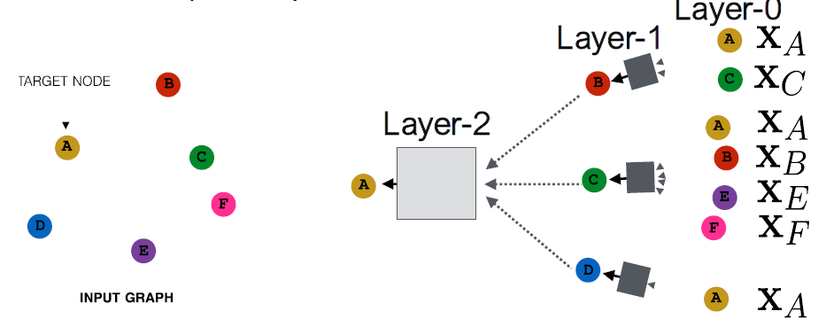  

- Neighborhood Aggreagation: Key distinctions are in how different approaches aggregate info across the layers.

    Basic approach: average info from neighbors and apply a neural network.

      

    The invariance and equivariance properties for a GCN:
    - Given a node, the GCN that computes its embedding is permutation invariant.

    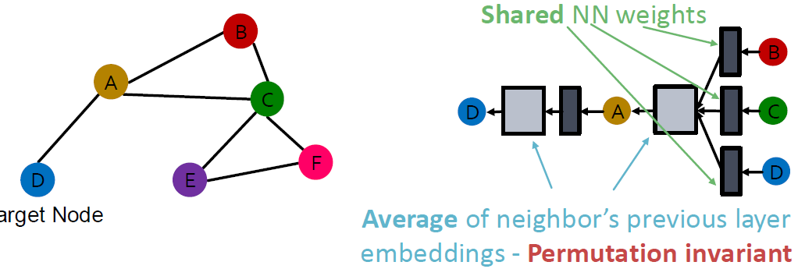  

    - Considering all nodes in a graph, GCN computation is permutation equivariant.

     

- Training the Model: Model Parameters

    $h^k_v$: the hidden representation of node $v$ at layer $k$
    - $W_k$: weight matrix for neighborhood aggregation
    - $B_k$: weight matrix for transforming hidden vector of self

     

    We can feed these embeddings into any loss function and run SGD to train the weight parameters.

- Training the Model: Matrix Formulation
  
  Many aggregations can be performed efficiently by (sparse) matrix operations.

     
     

    Note: not all GNNs can be expressed in matrix form, when aggregation function is complex.
- Training the Model: Loss function

    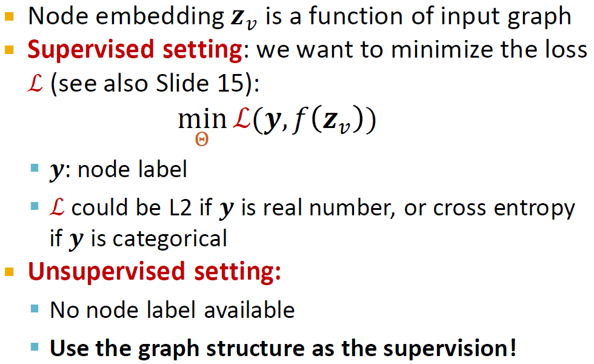 
    
  - Unsupervised Training: "Similar" nodes have similar embeddings

    

  - Supervised Training: Directly train the model for a supervised task 
  
    i.e. node classification on safe or toxic drug using cross entropy loss

  

- Model Design Overview

    1. Define a neighborhood aggregation function
    2. Define a loss function on the embeddings
    3. Train on a set of nodes, i.e. a batch of compute graphs
    4. Generate embeddings for nodes as needed, even for nodes we never trained on.

- Inductive Capability
    - The same aggregation parameters are shared for all nodes. 
    - The number of model parameters is sublinear in |V| and we can generalize to unseen nodes.
  
    

    - New Nodes: Many application settings constantly encounter previously unseen nodes, i.e. Reddit, YouTube, Google Scholar. So we need to generate new embeddings "on the fly".
    
    - New Graphs: Inductive node embedding also allows generalizing to entirely unseen graphs. i.e. train on protein interaction graph from model organism A and generate embeddings on newly collected data about organism B.

#### 2.1.3 GNNs subsume CNNs

How do GNNs compare to prominent architectures such as Convolutional Neural Nets?

  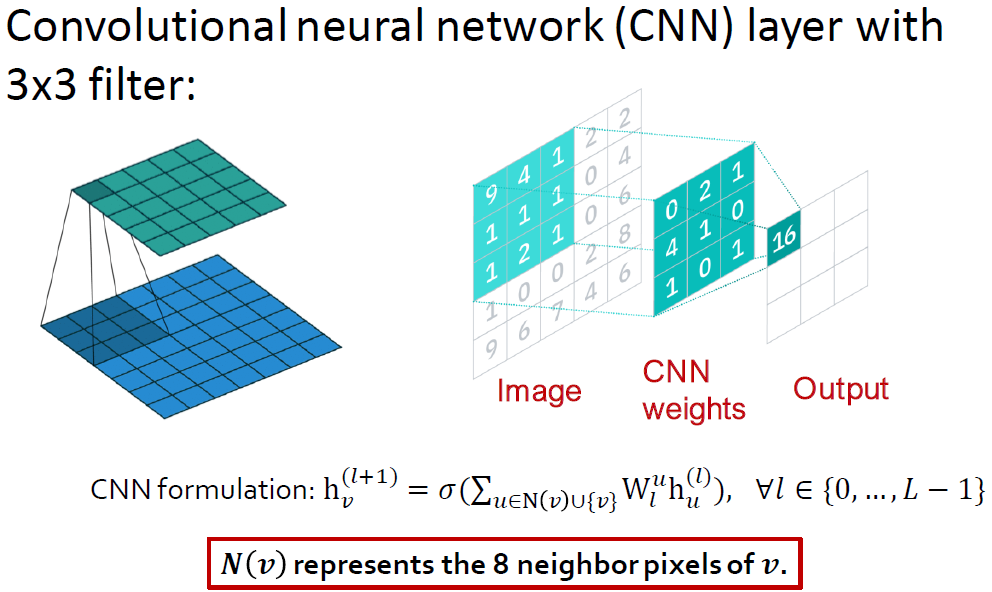 

  

Key difference is that, we can learn different $W^u_l$ for different "neighbor" $u$ for pixel $v$ on the image. The reason is we can pick an order for the 9 neighbors using **relative position** to the center pixel: {(-1,-1). (-1,0), (-1, 1), …, (1, 1)}

CNN can be seen as a special GNN with fixed neighbor size and ordering:
- The size of the filter is pre-defined for a CNN.
- The advantage of GNN is it processes arbitrary graphs with different degrees for each node.
- CNN is not permutation invariant/equivariant. Switching the order of pixels will leads to different outputs.

### 2.2 GNN Design Space

#### 2.2.1 A General Perspective on GNNs

A General GNN Framework: 

1. GNN Layer = Message + Aggregation
    - Different instantiations under this perspective
    - GCN, GraphSAGE, GAT, ...

2. Layer connectivity: Connect GNN layers into a GNN
    - Stack layers sequentially
    - Ways of adding skip connections

3. Graph augmentation: raw input graph != computational graph
    - Graph feature augmentation
    - Graph structure augmentation

4. Learning objective: How do we train a GNN
    - Supervised/Unsupervised objectives
    - node/Edge/Graph level objectives

#### 2.2.2 Designing a Single Layer of a GNN

Idea of a GNN Layer:
- Compress a set of vectors into a single vector
- Two step process: Message + Aggregation

 

- Message Computation

    Intuition: Each node will create a message, which will be sent to other nodes later.

     

    Example: A linear layer $m^{(l)}_u=W^{(l)}h^{(l-1)}_u$. This is to multiply node features with weight matrix $W^{(l)}$.

- Aggregation

    Intuition: Each node will aggregate the messages from node $v$'s neighbors

    

    Example: Sum, Mean, or Max aggregator
    - $h^{(l)}_v=Sum({m^{(l)}_u,u \in N(v)})$

    Issue: Info from node $v$ itself could get lost.
    - Computatin of $h^{(l)}_v$ does not directly depend on $h^{(l-1)}_v$
    - **Solution: Include $h^{(l-1)}_v$ when computing $h^{(l)}_v$**

    

- Putting things together

    

- Classical GNN Layers: GCN

    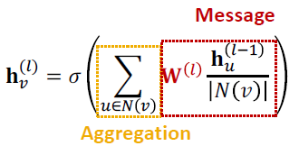
    

- Classical GNN Layers: GraphSAGE

    

    Message is computed within the AGG()

    Two-stage aggregation:
    1. Aggregate from node neighbors: $h^{(l)}_{n(v)}=AGG({h^{(l-1)}_u, u \in N(v)})$
    2. Further aggregate over the node itself: $h^{(l)}_v=\sigma(W{(l)} \cdot CONCAT(h^{(l-1)}_v, h^{(l)}_{N(v)}))$
   
   Neighbor Aggregation Methods:
   - Mean: Take a weighted average of neighbors
  
            

   - Pool: Transform neighbor vectors and apply symmetric vector function Mean or Max
  
        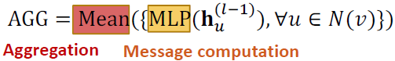 

    - LSTM: Apply LSTM to reshuffled of neighbors

         

    L2 Normalization: optionally, apply L2 normalization to $h^{(l)}_v$ at every layer

    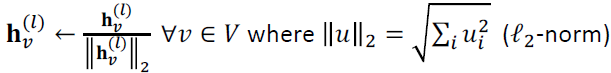

    - Without $l_2$ normalization, the embedding vectors have different scales ($l_2$-norm) for vectors
    - In some cases (not always), normalization of embedding results in performance improvement
    - After $l_2$ normalization, all vectors will have the same $l_2$-norm.

- Classical GNN Layers: Graph Attention Networks (GAT)

    

    In GCN/GraphSAGE, $\alpha_{vu}=1/|N(v)|$ is the weighting factor (importance) of node $u$'s message to node $v$.
    - $\alpha_{vu}$ is defined explicitly based on the structural properties of the graph (node degree)
    - All neighbors $u \in N(v)$ are equally important to node $v$
  
    Can we do better than simple neighborhood aggregation? 
    
    -> GAT however assumes not all node's neighbors are equally important.
    - Attention is inspired by cognitive attention. The attention $\alpha_{vu}$ focuses on the important parts of the input data and fades out the rest.
    - Idea: the NN should devote more computing power on that small but important part of the data
    - Which part of the data is more important depends on the context and is learned through training.
  
    Can we let weighting factors $\alpha_{vu}$ to be learned?
    - Idea: Compute embedding $h^{(l)}_v$ of each node in the graph following an **attention strategy**:
      - Nodes attend over their neighborhoods' message
      - Implicitly specify different weights to different nodes in a neighborhood
    
    Attention Mechanism:
    - Let $\alpha_{vu}$ be computed as a byproduct of an attention mechanism $\alpha$
    - $\alpha$ computes attention coefficients $e_{vu}$ across pairs of nodes $u, v$ based on their messages:
  
          

    - Normalize $e_{vu}$ into the **final attention weight $\alpha_{vu}$**

          

    - Weighted sum based on the final attention weight $\alpha_{vu}$

        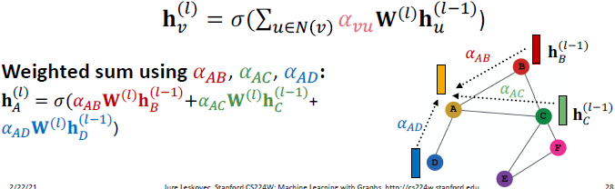 
    
    What is the form of attention mechanism $\alpha$?

    - This approach is agnostic to the choice of $\alpha$.

          
    
    - Parameters of $\alpha$ are trained jointly: learn the param together with weight matrices (i.e. other param of the NN $W^{(l)}$) in an end-to-end fashion.

    **Multi-head attention**: Stabilize the learning process of attention mechanism.
    - Create multiple attention scores (each replica with a different set of parameters):

           
    
    - Outputs are aggregated by concatenation or summation: $h^{(l)}_v=AGG(h^{(l)}_v[1], h^{(l)}_v[2], h^{(l)}_v[3])$
  
    Benefits of Attention Mechanism:

    - Key benefit: Allows for (implicitly) specifying different importance values ($\alpha_{vu}$) to different neighbors
    - Computationally efficient:
      - Computation of attentional coefficients can be parallelized across all edges of the graph
      - Aggregation may be parallelized across all nodes
    - Storage efficient:
      - Sparse matrix operations do not require more than $O(V + E)$ entries to be stored
      - Fixed number of parameters, irrespective of graph size
    - Localized:
      - Only attends over local network neighborhoods
    - Inductive capability:
      - It is a shared edge-wise mechanism
      - It does not depend on the global graph structure
  
    GAT Example: Cora Citation Net

    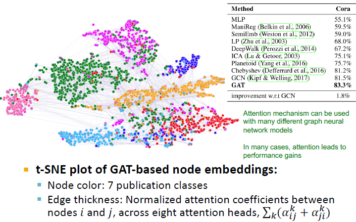

- GNN Layer in Practice

    In practice, these classic GNN layers are a great starting point. We can often get better performance by considering a general GNN layer design. Concretely, we can include **modern deep learning modules** that proved to be useful in many domains.

    Many modern deep learning modules can be incorporated into a GNN layer:

     

  Batch Normalization:
  - Goal: Stabilize neural networks training
  - Idea: Given a batch of inputs (node embeddings)
    - Re-center the node embeddings into zero mean
    - Re-scale the variance into unit variance

  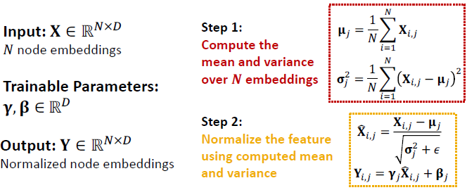 

   Dropout:
   - Goal: Regularize a NN to prevent overfitting
   - Idea:
     - During training: with some probability p, randomly set neurons to ero (turn off)
     - During testing: Use all the neurons for computation

    - In GNN, dropout is applied to the linear layer in the message function
  
    

    Activation (Non-linearity):

  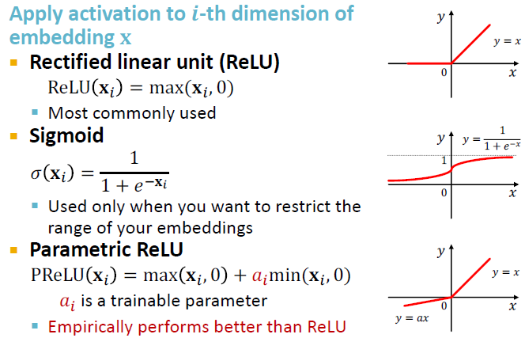  

    Summary: 
    - Modern DL modules can be included into a GNN layer for better performance.
    - Designing novel GNN layers is still an active research frontier.
    - Suggested resources: You can explore diverse GNN designs or try out your own ideas in [GraphGym](https://github.com/snap-stanford/GraphGym)

#### 2.2.3 Stacking Layers of a GNN

The Standard way: Stacking GNN layers sequentially

Input: Initial raw node features $X_v$

Output: Node embeddings $h^{(l)}_v$ after L GNN layers

- The Over-smoothing Problem: When stacking many GNN layers, all the node embeddings converge to the same value. This is bad because we want to use node embeddings o differentiate nodes.

- Receptive Field of a GNN: 
  - Receptive field: The set of nodes that determine the embedding of a node of interest
  - In a K-layer GNN, each node has a receptive field of K-hop neighborhood.

  

  - Receptive field overlaps for two nodes: The shared neighbors quickly grows when we increase the number of hops.   

- Why does over-smoothing happen?

    - We knew the embedding of a node is determined by its receptive field. If two nodes have highly-overlapped receptive fields, then their embeddings are highly similar.
    - Stack many GNN layers -> nodes will have highly overlapped receptive fields -> node embeddings will be highly similar -> suffer from the oversmoothing problem

- Design GNN Layer Connectivity

    Lession 1: Be cautious when adding GNN layers
    - Unlike neural networks in other domains (CNN for image classification), adding more GNN layers do not always help.
    - Step 1: Analyze the necessary receptive field to solve your problem, i.e. by computing the diameter of the graph
    - Step 2: Set number of GNN layesr L to be a bit more than the receptive field we like. **Don't set L to be unecessarily large!**
  
    How to make a shallow GNN more expressive?
    - Solution 1: increase the expressive power within each GNN layer.
      - In our previous examples, each transformation or aggregation function only include one linear layer.
      - We can make them be deep neural network.

       
    - Solution 2: Add layers that do not pass messages
      - A GNN doesn't necessarily only contain GNN layers. i.e. we can add MLPlayers (applied to each node) before and after GNN layers, as pre-process and post-process layers.

       

    Lesson 2: In cases your problem still requires many GNN layers, add **skip connections** in GNNs
    - From over-smoothing observation, node embeddings in earlier GNN layers sometimes can better differentiate nodes.
    - Solution: We can increase the impact of earlier layers on the final node embeddings **by adding shortcuts in GNN**.

      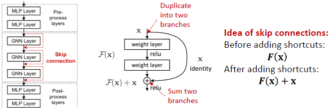 

    - Why does skip connections work?
      - Intuition: it creates a mixture of models
      - N skip connections leads to $2^N$ possible paths. Each path could have up to N modules.
      - We automatically get **a mixture of shallow GNNs and deep GNNs**.

        

    - Example: GCN with Skip Connections

        

    - Other Options of Skip Connections
      - Directly skip to the last layer. The final layer directly aggregates from all the node embeddings in the previous layers.

             
 

### 2.3 GNN Training Pipeline

#### 2.3.1 Graph Augmentation for GNNs

- Why Augment Graphs?

    Our assumption so far has been raw input graph = computational graph. However, there're reasons for breaking this assumption:
    - Features: the input graph lacks features
    - Graph structure:
      - too sparse -> inefficient message passing
      - too dense -> message passing is too costly
      - too large -> cannot fit the computational graph into a GPU
  
    It's unlikely that the input graph happens to be the optimal copmutation graph for embeddings.

- Graph Augmentation Approaches

  - Input graph lacks features -> feature augmentation
  - Graph Structure augmentation:
    - too sparse -> Add virtual nodes/edges
    - too dense -> Sample neighbors when doing message passing
    - too large -> Sample subgraphs to compute embeddings

- Feature Augmentation on Graphs

  Why do so? 
  
  Reason 1: Input graph does not have node  features. This is common when we only have the adjacency matrix.

  Standard approaches:
  1. Assign constant values to nodes
  2. Assign unique IDs to nodes. These IDs are converted into one-hot vectors.
   
          

       

  Reason 2: Certain structures are  hard to learn by GNN.
  
  i.e. Cycle count feature:
  - Can GNN learn the length of a cycle that $v_1$ resides in?
  - Unfortunately no.
  - $v_1$ cannot differentiate which graph it resides in, because all the ndes in the graph have degree of 2.
  - The computational graphs will be the same binary tree.

   

  Solution: We can use cycle count as augmented node features.

   

  Other commonly used augmented features:
  - node degree
  - clustering coefficient
  - pagerank
  - centrality
  - ...

- Add Virtual Nodes/Edges for sparse graphs

  1. Add virtual edges

       - Common approach: Connect 2-hop neighbors via virtual edges
       - Intuition: Instead of using adj. matrix A for GNN computation, use $A+A^2$
       - Use cases: Bipartite graphs i.e. author-to-papers. 2-hop virtual edges make an author-author collaboration graph.

  2. Add virtual nodes

      The virtual node connects to all the nodes in the graph
      - Suppose in a sparse graph two nodes have shortest path distance of 10
      - After adding the virtual nodes, all the nodes will have a distance of 2.

      Benefit: Greatly improves message passing in sparse graphs

- Node Neighborhood Sampling for dense graphs

  Previously, all the nodes are used for message passing.

  New idea: Randomly sample a node's neighborhood for message passing.
    - i.e. we can randomly choose 2 neighbors to pass messages in a given layer. 

      

    - In expectation, we get embeddings similar to the case whre all the neighbors are used.

  Benefits: Greatly reduces computational costs; allows for scaling to large graphs. In practice it works great. 

#### 2.3.2 Training GNNs

GNN Training Pipeline:

GNN Prediction Heads: different task levels (node/edge/graph) require different prediction heads.

- Node-level Prediction: We can directly make prediction using node embeddings!

  After GNN computation, we have d-dim node embeddings: ${h^{(L)}_v∈ℝ^d,∀v∈G}$

  Suppose we want to make k-way prediction:
  - Classification: classify among k categories
  - Regression: regress on k targets

  

- Edge-level prediction: Make prediction using pairs of node embeddings 

  Suppose we want to make k-way prediction:

  - $\hat{y}_{uv}=Head_{edge}(h^{(L)}_u, h^{(L)}_v)$
  
  What are the options for $Head_{edge}(h^{(L)}_u, h^{(L)}_v)$?

  1. Concatenation + Linear: we have seen this in graph attention

     - $\hat{y}_{uv}=Linear(Concat(h^{(L)}_u, h^{(L)}_v))$ 
  
      Here Linear() will map 2d-dimensional embeddings (since we concatenated embeddings) to k-dim embeddings (k-way prediction)  

       

  2. Dot product: 
       - $\hat{y}_{uv}=(h^{(L)}_u)^Th^{(L)}_v$
       - this approach only applies to 1-way prediction, i.e. link prediction - predicting the existence of an edge.  
       - Applying to k-way prediction:

         

- Graph-level prediction: Make prediction using all the node embeddings in our graph

    - $\hat{y}_{G}=Head_{graph}({h^{(L)}_v∈ℝ^d,∀v∈G})$
    - $Head_{graph}$ is similar to AGG() in a GNN layer!
    - These options work great for small graphs:
      - Global mean pooling: $\hat{y}_{G}=Mean({h^{(L)}_v∈ℝ^d,∀v∈G})$
      - Global max pooling: $\hat{y}_{G}=Max({h^{(L)}_v∈ℝ^d,∀v∈G})$
      - Global sm pooling: $\hat{y}_{G}=Sum({h^{(L)}_v∈ℝ^d,∀v∈G})$

    - Issue: Global pooling over a large graph will lose info.

      Toy example: we use 1-dim node embeddings
      - Node embeddings for G1: {−1,−2, 0, 1, 2}
      - Node embeddings for G2: {−10,−20, 0, 10, 20}
      - Clearly G1 and G2 have very different node embeddings. Their strucutres should be different.
      - If we do glbal sum pooling: $\hat{y}_{G1}=0$, $\hat{y}_{G2}=0$ -> Wr cannot differentiate them!

    - Solution: Hierarchical Global Pooling (aggregate all the node embeddings hierarchically)

      Toy example: we will aggregate via ReLu(Sum())
      - First separately aggregate the first 2 nodes and last 3 nodes
      - Aggregate again to make the final prediciton

       

    - Hierarchical Pooling in Practice: **DiffPool idea**

      - Hierarchically pool node embeddings

        

      - Leverage 2 independent GNNs at each level
        - GNN A: Compute node embeddings
        - GNN B: Compute the cluster that a node belongs to
      - For each pooling layer
        - Use clustering assignments from GNN B to aggregate node embeddings generated by GNN A
        - Create a single new node for each cluster, maintaining edges between clusters to generate a new pooled network
      - GNNs Aand B at each level can be executed in parallel
      - Jointly train GNN A and B

- Where does ground truth come from: supervised labels vs unsupervised signals

  - Supervised learning: labels come from external sources.
    - Node labels $y_v$: in a citation network, which subject area does a node belong to.
    - Edge labels $y_{uv}$: in a transaction network, whether an edge is fraudulent
    - Graph labels $y_G$: among molecular graphs, the drug likeness of graphs

    Advice: Reduce your ask to node/edge/graph labels, since they are easy to work with. e.g. we knew some nodes form a cluster. We can treat the cluster that a node belongs to as a node label.
  - Unsupervised learning: Signals come from graphs themselves
    - Sometimes we only have a graph, without any external labels
    - The solution: self-supervised learning. Find supervision signals within the graph. i.e.
      - Node-level $y_v$: node statistics such as clustering coefficient, PageRank, ...
      - Edge-level $y_{uv}$: link prediction - hide the edge between two nodes and predict if there should be a link.
      - Graph labels $y_G$: graph statistics i.e. predict if two graphs are isomorphic

- How do we compute the final loss?

  Settings for GNN Training: 
  - we have N data points, each data point can be a node/edge/graph.
  - We wil use prediction $\hat y^{(i)}$ and label $y{(i)}$ to refer predicitons at all levels

  Classificaiton Loss:
  - Cross Entropy (CE): very common loss function in classification
  - K-way prediciton for i-th data point:

       

  Regression Loss:
  - We often use Mean Squared Error (MSE) a.k.a. L2 loss
  - K-way regression for data point (i):

       

- How do we measure the success of a GNN?

  Evaluation Metrics: Regression
  - Root mean square error (RMSE): 
  - Mean absolute error (MAE):  

  Evaluation Metrics: Classification
  - Multi-class classification: we simply report the accuracy

    $1[argmax(\hat y^{(i)})=y^{(i)}]/N$
  - Binary classification
    - Metrics sensitive to classification threshold
      - Accuracy
      - Precision/Recall
      - If the range of prediciton is [0,1] we will use 0.5 as threshold

       

    - Metrics Agnostic to threshold
      - ROC AUC: area under the ROC curve. The probability that a classifier will rank a randomly chosen positive instance higher than a randomly chosen negative one.

      ROC Curve: captures the tradeoff in TPR and FPR as the classification threshold is varied for a binary classifier.

            

#### 2.3.3 Setting up GNN Prediction Tasks

- How do we split our dataset into train/validation/test?

  - Fixed Split: split the dataset once
    - Training set: used for optimizing GNN parameters
    - Validation set: develop model/hyperparameters
    - Test set: held out until we report final performance

  - Random split: we will randomly split our dataset into training/validation/test, and report average performance over different random seeds.
- Why Splitting a graph dataset is special
    - data points are not independent. i.e. nodes will participate in message passing and affect other connected nodes' embedding.
    - Solution 1 - Transductive setting: training / validation / test
sets are on the same graph.

      - Input graph can be observed in all the dataset splits. We will **only split the (node) labels**. Only applicable to node/edge prediction tasks.
      - At training time, we compute embeddings using the entire graph and train using node 1&2's labels
      - At validation time, we compute embeddings using the entire graph, and evaluate on node 3&4's labels.
      - 

        

    - Solution 2 - Inductive setting: training / validation / test sets
are on different graphs.
      - Break the edges between splits to get multiple graphs. applicable to node/edge/graph tasks.
      - Now we have 3 graphs that are independent.
      - At training time, compute embeddings using the graph over node 1&2, and train using their labels
      - At validation time, compute embeddings using the graph over node 3&4, and evaluate on node 3&4's labels

        

- Data Split Examples
  
  - Graph Classification 
  
    Only the inductive setting is well defined for graph classification, because we have to test on unseen graphs.

  - Link Prediction

    Link prediction is an unsupervised / self-supervised task. We need to create the labels and dataset splits on our own.

    Concretely, we need to hide some edges from the GNN and the let the GNN predict if the edges exist.

    We will split edges twice:
    1. Assign 2 types of edges in the original graph
         - Message edges: used for GNN message passing
        - Supervision edges: use for computing objectives

        After step 1 only message edges will remain in the graph. Supervision edges are used as supervision for edge predictions made by the model and will not be fed into GNN.

     2. Split edges into train / validation / test

        Option 1: Inductive link prediciton split
        - Suppose we have a dataset of 3 graphs. Each inductive split will contain an independent graph
        - In train or val or test set, each graph will have 2 types of edges: message + supervision edges

          

        Option 2: Transductive link prediction split (usually default setting)
        - Suppose we have a dataset of 1 graph. By definition of “transductive”, the entire graph can be observed in all dataset splits
        - But since edges are both part of graph structure and the supervision, we need to hold out validation / test edges.
        - To train the training set, we further need to hold out supervision edges for the training set

          

        Why do we use growing number of edges?
        - After training, supervision edges are known to GNN. Therefore, an ideal model should use supervision edges in message passing at validation time. The same applies to the test time.

          

        Note: Link prediction settings are tricky and complex. You may find papers do link prediction differently. But if you follow our reasoning steps, this should be the right way to implement link prediction.

        Luckily, we have full support in [DeepSNAP](https://github.com/snap-stanford/deepsnap) and [GraphGym](https://github.com/snap-stanford/GraphGym)

GNN Trainig Pipeline:

 
