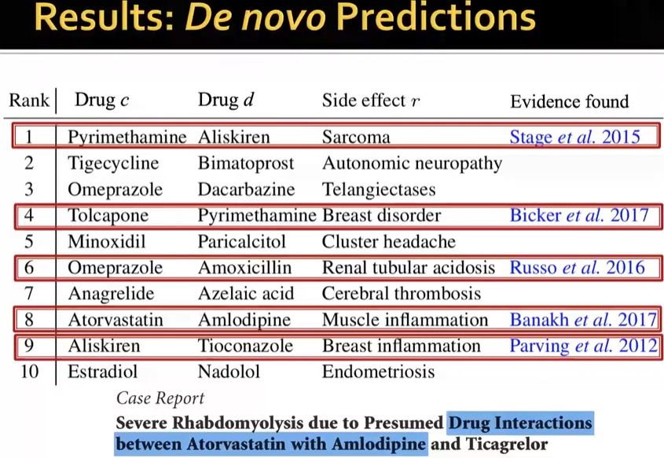

### Motivation: Why Graphs

#### Type of graphs

- Networks or Natural graphs
  
  
- Graphs as a representation

  

Main question: How do we take advantage of relational structure for better prediction?

Challenges: Modern DL toolbox is designed for simple sequences and grids, making it difficult to process graphs/networks.

  

This Course: 
- How can we develop neural networks that are much more broadly applicable?

  
- Representation learning: How do we design the architecture end to end without needing to do feature engineering?
  
  
  Intuitively, representation learning is to learn a function that maps nodes to d-dimensional embeddings such that similar ndoes in the netowrk are embedded close together.
  
  

Course outlines:

### Applications of Graph ML

#### Different types of ML Tasks

  
   

#### Node-level ML Tasks

Example - Protein Folding: Computationally predict a protein's 3D structure based solely on its amino acid sequence.

   

  DeepMind's AlphaFold impoved the accuracy by 30%.
  Key Idea of making this breakthrough is to represent the underlying protein sequence as a graph.

   

#### Edge-level ML Tasks

Example 1 - Recommender Systems

   

  Many online e-commerce companies use this approach of graph representation learning in their recommender systems.

  Key insights: Learn how to embed/represent nodes of this graph such that related nodes are embedded closer to each other than nodes that are not related.

   

Example 2 - Drug Side Effects

Many patients take multiple drugs to treat complex or co-existing diseases:
  - 46% of people ages 70-79 take more than 5 drugs
  - Many patients take more than 20 drugs to treat heart disease, depression, insomnia, etc.

Task: Given a pair of drugs predict adverse side effects.

  

  What we know: 
  - Drugs target different proteins. 
  - When different proteins come together there could be interactions evidenced from biology experiments.
  - The side effects between drugs (links) are nortoriously imcomplete and have a lot of missing values.
  
The question becomes: Can we impute/predict the missing edges between drugs to tell us side effects if a person takes two drugs simutanously?

  

#### Subgraph-level ML Tasks

Example - Traffic Prediction via GNN
  - Nodes: Road segments
  - Edges: Connectivity between road segments

  

#### Graph-level ML Tasks

Example - Drug Discovery

Antibiotics are small molecular graphs:
- Nodes: Atoms
- Edges: Chemical bonds.

Graph Classification Task: Predict which molecules biologist should prioritize on experimenting.

  

Graph generation: generate new molecules with desirable properties

  

### Choice of Graph Representation

#### Choice of Graphs

- Components of a Network

  

  A graph is a common language of relationships.

- Choice of the proper network representation of a given domain/problem determines our ability
to use networks successfully:
  - In some cases there is a unique, unambiguous representation
  - In other cases, the representation is by no means unique
  - The way you assign links will determine the nature of the question you can study
  
- Directed vs Undirected Graphs

  

  - Node Degrees: the number of edges adjacent to a given node
  - in-degree and out-degree for directed graphs
  
  

- **Bipartite Graph**: nodes can be divided into two disjoint sets U and V such that every link connects a node in U to one in V. U and V are independent sets.

  

  With a bipartite graph in the middle we can project the network in two ways (left and right). These are called **folded/projected graphs**. 
  
  We use only the nodes from one side for projection. The link represents that there are at least one neighnor in common between a pair of nodes. This is useful when having multiple types of nodes in a graph.

  

#### Representing Graphs

1. Adjacency Matrix
   
    Note that for a directed graph the matrix is not symmetric.

    
    

    Tha max number of edges for a node is N-1, but in reality the node degree is extermely small.

  2. Edge List: common in deep learning, but very hard to do any graph manipulation or analysis. i.e. even computing a degree of a node is non-trivial.
   
      

3. Adjacency List
    
    

#### Node and Edge Attributes

Possible options:
- Weight (e.g., frequency of communication)
- Ranking (best friend, second best friend…)
- Type (friend, relative, co-worker)
- Sign: Friend vs. Foe, Trust vs. Distrust
- Properties depending on the structure of the rest of the graph: Number of common friends

For example, mutigraph can represent phone calls or transactions.

#### Connectivity of Undirected Graphs

The adjacency matrix of a disconnected network with several components can be written in a block- diagonal form, so that nonzero elements are confined to squares, with all other elements being zero:

#### Connectivity of Directed Graphs

- **Strongly connected directed graph** has a path from each node to every other node and vice versa (e.g., A-B path and B-A path) i.e. like a cycle.
- **Weakly connected directed graph** is connected if we disregard the edge directions.

  

- **Strongly connected components (SCCs)** can be identified, but not every node is part of a nontrivial strongly connected component.
  - In-component: nodes that can reach the SCC
  - Out-component: nodes that can be reached from the SCC.

  