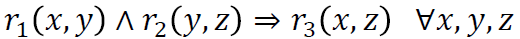
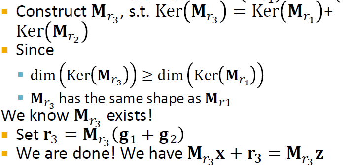

### 5.1 ML with Heterogeneous Graphs

- So far we only handle graphs with one edge type
- How to handle graphs with multiple nodes or edge types (a.k.a heterogeneous graphs)?
- Goal: Learning with heterogeneous graphs
  - Relational GCNs
  - Heterogeneous Graph Transformer
  - Design space for heterogeneous GNNs

#### 5.1.1 Heterogeneous Graphs

- Motivation: A graph could have multiple types of nodes and edges.

    Example: 2 types of nodes (paper, author) + 2 types of edges (cite, like) → 8 possible **relation types (node start, edge, node_end)** !

     

    - We use **relation type to describe an edge** (as opposed to edge type)
    - Relation type better captures the interaction between nodes and edges

- Definition: A heterogeneous graph is defined as $G=(V,R,T,E)$
  - Nodes $v_i \in V$ with node types $T(v_i)$
  - Relations with relation types $(v_i,e,v_j) \in R$ and edge types $e \in E$

- Examples
  1. Biomedical Knowledge Graphs: (fulvestrant, Treats, Breast Neoplasms)

     

  2. Event Graphs: (UA689, Origin, LAX)

      

  3. E-Commerce Graph
       - Node types: User, Item, Query, Location, ...
       - Edge types (interactions): Purchase, Visit, Guide, Search, ...
       - Different node type's features spaces can be different!

       

  4. Academic Graph
       - Node types: Author, Paper, Venue, Field, ...
       - Edge types: Publish, Cite, ...
       - Benchmark dataset: **Microsoft Academic Graph**
  
        

- Observation: We can also treat types of nodes and edges as features

    Example: Add a one-hot indicator for nodes and edges
  - Append feature [1, 0] to each “author node”; Append feature [0, 1] to each “paper node”
  - Similarly, we can assign edge features to edges with different types
  - Then, a heterogeneous graph reduces to a standard graph

- When do we need a heterogeneous graph?

    Case 1: Different node/edge types **have different shapes of features**
    - An “author node” has 4-dim feature, a “paper node” has
5-dim feature
    
    Case 2: We know different relation types
**represent different types of interactions**
    - (English, translate, French) and (English, translate, Chinese) require different models

    Ultimately, heterogeneous graph is a more expressive graph representation
    - Captures different types of interactions between entities

    But it also comes with costs:
    - More expensive (computation, storage)
    - More complex implementation

    There are many ways to convert a heterogeneous graph to a standard graph (that is, a homogeneous graph).

#### 5.1.2 Relational GCN (RGCN)

Recap:

 

We start with a directed graph with one relation. How do we run GCN and update the representation of the target node A on this graph?

 

We will extend GCN to handle heterogeneous graphs with multiple edge/relation types.

- What if the graph has multiple relation types?

    Idea: Use different neural network weights for different relation types.

     

    Keep the computational graph structure the same, except that we will learn different weights based on relation types.

      

    Another view: consider the heterogenous graph as N different standard graphs, where one particular graph stores the connectivity of one particular relation type. We learn a set of neural networks for each relation type from the same input hetero graph!

    

- Relational GCN: Definition

    

    How to write this as Message + Aggregation?
    - Message: 
      - Each neighbor of a given relation: $m^{(l)}_{(u,r)}=1/c_{(u,r)}W^{(l)}_rh^{(l)}_u$, normalized by node degree of the relation $c_{(u,r)}=|N^r_v|$.
      - Self-loop (transformation of the node itself): $m^{(l)}_v=W^{(l)}_0h^{(l)}_v$
    - Aggregation: Sum over messages from neighbors and self-loop under the same relation type, and also sum over all the relation types, then apply activation
    
      

- RGCN Scalability
  - Each relation has L matrices: $W^{(1)}_r,W^{(2)}_r,...W^{(L)}_r$
  - The size of each $W^{(l)}_r$ is $𝑑^{(𝑙+1)} × 𝑑^{(𝑙)}$, where $𝑑^{(𝑙)}$ is the hidden dimension in layer l. This essentially projects the input dim $𝑑^{(𝑙)}$ to output dim $𝑑^{(𝑙+1)}$.

    → Rapid growth of the number of parameters w.r.t number of relations! Overfitting becomes an issue!
  - Two methods to regularize the weights $W^{(l)}_r$ (reduce the number of param for each relation type)
    1. Use block diagonal matrices
    2. Basis/Dictionary learning 
   
- Block Diagonal Matrices

    key insight: the graphs are rarely fully connected, so the weights shouldn't be dense. Make the weights sparse!

    Use **block diagnonal matrices for $W_r$** so that only the block diagonal entires are non-zero.

    

    If use 𝐵 low-dimensional matrices, then # param reduces from $𝑑^{(𝑙+1)} × 𝑑^{(𝑙)}$ to $B × 𝑑^{(𝑙+1)}/B × 𝑑^{(𝑙)}/B$

- Basis Learning

    Key insight: Share weights across different relations!

    Represent the matrix of each relation as a **linear combination of basis transformations**

    $W_r = \sum_{b=1}^Ba_{rb} \cdot V_b$, where $V_b$ is shared across all relations
    - $V_b$ are the basis matrices
    - $a_{rb}$ is the importance weight of matrix $V_b$

    Now each relation only needs to learn $[a_{rb}]_{b=1}^B$ which is B scalars.

- Examples

  1. Entity/Node Classification

    Goal: Predict the label of a given node

    RGCN uses the representation of the final layer:
    - If we predict the class of node A from k classes
    - Take the final layer (prediction head): $h^{(L)}_A \in \mathbb{R}^k$, each item in $h^{(L)}_A$ represents the probability of that class

  2. Link Prediction

    Link prediction split: graph is split with 4 categories of edges (training message / training supervision / validation / test)

    Every edge also has a relation type, this is independent of the 4 categories.
    
    In a heterogeneous graph, the homogeneous graphs formed by every single relation also have the 4 splits.

      

- RGCN for Link Prediction

    Assume (𝑬, 𝒓𝟑 , 𝑨) is training supervision edge, all the other edges are training message edges.
    
    Use RGCN to score (𝑬, 𝒓𝟑 , 𝑨):

     

    - Take the final layer embeddings of E and A: $h^{(L)}_E$ and $h^{(L)}_A \in \mathbb{R}^d$ 
    - Relation-specific score function $f_r: \mathbb{R}^d \times \mathbb{R}^d$ → $\mathbb{R}$
    - Example link prediction head using linear transformation: $f_{r_1}(h_E,h_A)=h^T_EW_{r_1}h_A$, $W_{r_1} \in \mathbb{R}^{d \times d}$
  
    Training:

    - Negative sampling helps to define the classification tasks correctly: manually create some edges that do not exist.

     
    
    3. Use GNN model to score negative edge
    4. Optimize a standard cross entropy loss: 
       - Maximize the score of training supervision edge
       - Minimize the score of negative edge

          
    
    Evaluation: Use training message edges & training supervision edges to predict validation edges. Validation time as an example, same at the test time.

     

    - Reciprocal Rank Metric

     

- Benchmark for Heterogeneous Graphs

    [ogbn-mag](https://ogb.stanford.edu/docs/nodeprop/) from Microsoft Academic Graph (MAG)
    - 4 types of entities: Papers (736k nodes), Authors (1.1.m nodes), Institutions (9k nodes), Fields of study (60k nodes)

     

    - 4 directed relations:
      - An author is affiliated with an institution
      - An author writes a paper
      - A paper cites a paper
      - A paper has a topic of a field of study

    - Prediction task
      - Each paper has a 128-dimensional word2vec feature vector
      - Given the content, references, authors, and author affiliations
from ogbn-mag, predict the venue of each paper
      - 349-class classification problem due to 349 venues considered
    - Time-based dataset splitting
      - Training set: papers published before 2018
      - Test set: papers published after 2018
    - Benchmark results

         

        SOTA method: SeHGNN
        - ComplEx (Next lecture) + Simplified GCN (Lecture 17)

- Summary of RGCN

    - Relational GCN, a graph neural network for heterogeneous graphs
    - Can perform entity classification as well as link prediction tasks.
    - Ideas can easily be extended into RGNN (RGraphSAGE, RGAT, etc.)
    - Benchmark: ogbn-mag from Microsoft Academic Graph, to predict paper venues

#### 5.1.3 Heterogeneous Graph Transformer

Recap: 

 

- Motivation: GAT is unable to represent different node & different edge types

  Introduce a set of neural networks for each relation type is **too expensive** for attention
  
  Recall: relation describes (node_s, edge, node_e)

- Basics: Attention in Transformer

  HGT uses Scaled Dot-Product Attention (same as proposed in Transformer)

   

- Heterogeneous Mutual Attention

  Recall: Applying GAT to a homogeneous graph, where $H^{(l)}$ is the l-th layer representation.

   

  Innovation: Decompose heterogeneous attention to **node- and edge-type dependent attention mechanism**

     

  - 3 node weight matrices, 2 edge weight matrices
  - Without decomposition: 3*2*3=18 relation types -> 18 weight matrices (suppose all relation types exist)

  Heterogeneous Mutual Attention Definition: 

   

  - Each relation (𝑇(s), 𝑅(e), 𝑇(t)) has a distinct set of **projection weights**
    - T(s): type of node s, R(e): type of edge e.
    - T(s) & T(t) parameterize K_Linear$_{T(s)}$ & Q_Linear$_{T(t)}$, which further return Key and Query vectors K(s) and Q(t)
    - Edge type R(e) directly parameterizes $W_{R(e)}$
  - Attention head for each relation type is a dot product of K and Q.

- More Details on HGT

  A full HGT layer:  

  There're multiple options of the aggregation function like summation.

  Similar to attention computation, HGT also **decomposes weights** with node & edge types in the **message computation**

    

- HGT vs R-GCN: Performance

  Benchmark: ogbn-mag from Microsoft Academic Graph, to predict paper venues

    

  Thanks to the weight decomposition over node & edge types, HGT uses **much fewer parameters**, even though the attention computation is expensive,
while **performs better than R-GCN**.
  

#### 5.1.4 Design Space for Heterogenous GNNs

How do we extend the general GNN design space to heterogeneous graphs?

1. Heterogeneous message computation

     - Observation: A node could receive multiple types of messages. Num of message type = Num of relation type.
     - Idea: Create a different message function for each relation type

    - $m^{(l)}_u=MSG^{(l)}_r(h^{(l-1)}_u), r=(u,e,v)$ is the relation type between node u that sends the message, edge type e, and node v that receive the message.
    - Example: A linear layer $m^{(l)}_u=W^{(l)}_rh^{(l-1)}_u$

2. Heterogeneous Aggregation

     - Observation: Each node could receive multiple types of messages from its neighbors, and multiple neighbors may belong to each message type.
     - Idea: We can define a 2-stage message passing

         

        Given all the messages sent to a node,
        - Within each message type, aggregate the messages that belongs to the edge type with $AGG^{(l)}_r$
        - Aggregate across the edge types with $AGG^{(l)}_{all}$
    - Example: $h^{(l)}_v=Concat(Sum(m^{(l)}_u, u \in N_r(v)))$

3. Heterogeneous GNN Layers

     

  Heterogeneous pre/post-process layers:
  - MLP layers should be **with respect to each node type**, since the output of GNN are node embeddings of different types
  - $h^{(l)}_v=MLP_{T(v)}(h^{(l)}_v)$, where $T(v)$ is the type of node v.
  
  Other successful GNN designs are also encouraged for heterogeneous GNNs: skip connections, batch/layer normalization, …

4. Heterogeneous Graph Manipulation

    Graph Feature manipulation:
     - 2 Common Options: compute graph statistics (i.e. node degree) within each relation type, or across the full graph (ignoring the relation types)

    Graph Structure manipulation:
     - Neighbor and subgraph sampling are also common for heterogeneous graphs
     - 2 Common options: sampling within each relation type (ensure neighbors from each type are covered), or sample across the full graph.

5. Heterogeneous Prediction Heads

    Node-level predictions:  

    Edge-level prediction: $\hat y_{uv}=Head_{edge,r}(h^{(L)}_u,h^{(L)}_v)=Linear_r(Concat(h^{(L)}_u,h^{(L)}_v))$
    
    Graph-level prediction: $\hat y_G=AGG(Head_{graph,i}(\{h^{(L)}_v \in \mathbb{R}^d, \forall T(v)=i\}))$
    
In summary, Heterogeneous GNNs extend GNNs by separately modeling node/relation types + additional AGG.

### 5.2 Knowledge Graph Embeddings

#### 5.2.1 Motivation

- Knowledge in graph form capture entities, types, and relationships:
  - Nodes are entities, labeleld with their types
  - Edges between two nodes capture relationships between entities
  - KG is an example of a heterogeneous graph

- Example: Bibliographic Networks
  - Node types: paper, title, author, cnoference, year
  - Relation types: pubWhere, pubYear, hasTitle, hasAuthor, cite

     

- Example: Bio Knowledge Graphs
  - Node types: drug, disease, adverse event, protein, pathways
  - Relation types: has_func, causes, assoc, treats, is_a

   

- KG in Practice
  - Google Knowledge Graph
  - Amazon Product Graph
  - Facebook Graph API
  - IBM Watson
  - Microsoft Satori
  - Project Hanover/Literome
  - LinkedIn Knowledge Graph
  - Yandex Object Answer
- Applications
  - Serving information i.e. Bing search
  - Question answering and conversation agents
- KG Datasets
  - Publicly available KGs: FreeBase, Wikidata, Dbpedia, YAGO, NELL, etc.
  - Common characteristics:
    - Massive: millions of nodes and edges
    - Incomplete: Many true edges are missing

  Given a massive KG, enumerating all the possible facts is intractable! Can we predict plausible But missing links?

  - Example: Freebase

    - ~80 million entities, ~38K relation types, ~3 billion facts/triples

    - 93.8% of persons from Freebase have no place of birth and 78.5% have no nationality!
    - Researchers use a **complete** subset of Freebase (Datasets: FB15k/FB15k-237) to learn KG models.

       

- KG Completion Task: Given an enormous KG, can we complete the KG?
  
  For a given (head, relation), we predict missing tails. (Note this is slightly different from link prediction task)

   

- Recap: "Shallow" Encoding - encoder is just an embedding-lookup

    

- KG Representation
  - Edges in KG are represented as **triples (ℎ, 𝑟, 𝑡)**
  - head (ℎ) has relation 𝑟 with tail (𝑡)

  Key idea: 
  - Model entities and relations in the embedding/vector space $ℝ^𝑑$.
    - Associate entities and relations with **shallow embeddings** (no GNNs)
    - **Note we do not learn a GNN here!**
    - This is because KG usually doesn't have node features. All the info are in the relations.
  - Given a true triple (ℎ, 𝑟, 𝑡), the goal is that the embedding of (ℎ, 𝑟) should be close to the embedding of 𝑡.
    - How to embed (ℎ, 𝑟)?
    - How to define closeness?

- Different Models

  We are going to learn about different KG embedding models (shallow/transductive embs). They are:
  - based on different geometric intuitions
  - capture different types of relations (have different expressivity)

   

#### 5.2.2 Knowledge Graph Completion: TransE

- TransE - Translation Intuition: 
  
  For a triple $(h,r,t)$, $\mathbf{h,r,t} \in \mathbb{R}^d$, $\mathbf{h+r} \approx t$ if the given fact is true else $\mathbf{h+r} \neq t$ (embedding vectors will appear in boldface)

  Scoring Function: $f_r(h,t)=-||\mathbf{h+r-t}||$

    

- TransE: Contrastive/Triplet Loss
  
   

- Connectivity Patterns in KG

  Relations in a heterogeneous KG have different properties:
  - **Symmetry**: If the edge (ℎ, "Roommate", 𝑡) exists in KG, then the edge (𝑡, "Roommate", ℎ) should also exist.
  - **Inverse relation**: If the edge (ℎ, "Advisor", 𝑡) exists in KG, then the edge 𝑡, "Advisee", ℎ should also exist.

  Can we categorize these relation patterns? → 4 Relation Patterns:
  1. **Symmetric (Antisymmetric)** Relatons:  

      Symmetric Example: Family, Roommate; Antisymmetric: Hypernym
  
  2. **Inverse** Relatons: $𝑟_2(ℎ, 𝑡) ⇒ 𝑟_1(𝑡, ℎ)$

      Example: (Advisor, Advisee)
  
  3. **Composition (Transitive)** Relations:   

      Example: My mother’s husband is my father.

  4. **1-to-N** relations: $𝑟(ℎ, 𝑡_1), 𝑟(ℎ, 𝑡_2), … , 𝑟(ℎ, 𝑡_𝑛)$ are all True.

      Example: 𝑟 is “StudentsOf”

- Is TransE expressive enough to model these patterns?

  TransE **can** model:
  - antisymmetric relations: 𝐡 + 𝐫 = 𝐭, but 𝐭 + 𝐫 ≠ 𝐡

  - inverse relations: $𝐡 + 𝐫_𝟐 = 𝐭$, we can set $𝐫_1 = −𝐫_2$
  - composition relations: $𝐫_3 = 𝐫_1 + 𝐫_2$

     
       
       

  TransE **cannot** model:
  - symmetric relations, only if $r=0, h=t$

     
  
  - 1-to-N relations: $𝐭_1$ and $𝐭_2$ will map to the same vector, although they are different entities

      

#### 5.2.3 Knowledge Graph Completion: TransR

TransE models translation of any relation in the **same** embedding space. Can we design a new space for each relation and do translation in **relation-specific space**?

TransR: model entities as vectors in the entity space $ℝ^𝑑$ and model each relation as vector in relation space 𝐫 ∈ $ℝ^𝑘$ with $𝐌_𝑟 ∈ ℝ^{𝑘×𝑑}$ as the **projection matrix**.

    

TransR can model:

- Symmetric Relations in TransR

  $𝑟(ℎ, 𝑡) ⇒ 𝑟(𝑡, ℎ)$ i.e. Family, Roommate

  Note: different symmetric relations may have different $M_r$

     

- Antisymmetric Relations 

    i.e. Hypernym

     

- 1-to-N Relations

  Example: (h, r, t1) and (h, r, t2) exist in the KG.

    

- Inverse Relations

  $𝑟_2(ℎ, 𝑡) ⇒ 𝑟_1(𝑡, ℎ)$ i.e. (Advisor, Advisee)

    

- Composition Relations

    i.e. My mom's husband is my dad.

  High-level intuition: TransR models a triple with linear functions, so they are chainable.

  Background - Kernel space of a matrix M: $h\in Ker(M)$, then $Mh=0$

    

    

     

#### 5.2.4 Knowledge Graph Completion: DistMult

So far: The scoring function $𝑓_𝑟 (ℎ, 𝑡)$ is **negative of L1 / L2 distance** in TransE and TransR.

Another line of KG embeddings adopt **bilinear modeling**.

DistMult: Entities and relations using vectors in $ℝ^𝑘$

- Score function: $𝑓_𝑟 (ℎ, 𝑡)$ =< 𝐡, 𝐫, 𝐭 > = $\sum_{𝑖} 𝐡_𝑖 ⋅ 𝐫_𝑖 ⋅ 𝐭_𝑖$

  Intuition: can be viewed as a **cosine similarity** between $h⋅r$ and $t$, where $h⋅r$ is defined as $\sum_{𝑖} 𝐡_𝑖 ⋅ 𝐫_𝑖$

  Example:     

Distmult can model:

- 1-to-N Relations: 

   

- Symmetric Relations: $𝑓_𝑟 (ℎ, 𝑡)$ =< 𝐡, 𝐫, 𝐭 > = $\sum_{𝑖} 𝐡_𝑖 ⋅ 𝐫_𝑖 ⋅ 𝐭_𝑖$ = < t, 𝐫, h >=$𝑓_𝑟 (t, h)$

DistMult **cannot** model:

-  antisymmetric relations

    𝑟(ℎ, 𝑡) and 𝑟(𝑡, ℎ) always have same score!

- Inverse Relations

  If it does model inverse relations: 
  
  

  But semantically this does not make sense: The embedding of “Advisor” should not be the same with “Advisee”.

- Composition Relations

  Intuition: DistMult defines a hyperplane for each (head, relation), the union of the hyperplane induced by multihops of relations, e.g., (𝑟1, 𝑟2), cannot be expressed using a single hyperplane.

  Detailed derivation:
  - Pick one y s.t. $𝑓_{𝑟_1} (x, y)$ > 0, e.g. $y_2$. Then $y_2 ⋅ r_2$ defines a new hyperplane.
  - Pick another y s.t. $𝑓_{𝑟_1} (x, y)$ > 0, e.g. $y_3$. Then $y_3 ⋅ r_2$ defines another new hyperplane.
  - Combine both hyperplanes together, then for all 𝑧 in the shadow area, there exists 𝑦 ∈ {$y_2$ , $y_3$} , s.t., $𝑓_{𝑟_2}(𝑦, 𝑧) > 0$
  - According to the composition relations, we also want $𝑓_{𝑟_3}(𝑥, 𝑧) > 0$, ∀𝑧 ∈ {shadow area}. However, this area inherently cannot be expressed by a single hyperplane defined by $𝑥 ⋅ 𝑟_3$, no matter what $𝑟_3$ is.

  
   
   

#### 5.2.5 Knowledge Graph Completion: ComplEx

Based on Distmult, ComplEx embeds entities and relations in **Complex vector space**

ComplEx: model entities and relations using vectors in $ℂ^𝑘$

   

- Score function: $𝑓_𝑟 (ℎ, 𝑡)$ = $Re(\sum_{𝑖} 𝐡_𝑖 ⋅ 𝐫_𝑖 ⋅ 𝐭_𝑖)$

   

ComplEx can model:
- Antisymmetric Relations

  The model is expressive enough to learn 
  
   

  Due to the asymmetric modeling using complex conjugate.

- Symmetric Relations

  When Im(r) = 0, we have

   

- Inverse Relations

       

- ComplEx share the same property with DistMult
  - Cannot model composition relations
  - Can model 1-to-N relations

#### 5.2.6 Knowledge Graph Embeddings in Practice

- Expressiveness of Different KG Completion Methods:

   

1. Different KGs may have drastically different relation patterns!
2. There is not a general embedding that works for all KGs, use the table to select models
3. Try TransE for a quick run if the target KG does not have much symmetric relations
4. Then use more expressive models, e.g., ComplEx, RotatE (TransE in Complex space)

- Summary of Knowledge Graph

  - Link prediction / Graph completion is one of the prominent tasks on knowledge graphs
  - Introduce TransE / TransR / DistMult / ComplEx models with different embedding
space and expressiveness
  - Next: Reasoning in KG

### 5.3 Reasoning over Knowledge Graphs

- Recap: KG Completion Task - For a given (head, relation), we predict missing tails. (Note this is slightly different from link prediction task)

   

- Goal: How to perform multi-hop reasoning over KGs, i.e. answering complext queries on an incomplete massive KG?

- Reasoning over KGs
  - Answering multi-hop queries
    - Path Queries
    - Conjunctive Queries
  - Query2box

#### 5.3.1 Reasoning in KGs using Embeddings

Example KG: Biomedicine
 
 

- Predictive Queries on KG

|Query Types|Examples: Natural Language Question | Query|
|-------------|---------|------|
|One-hop Queries|What adverse event is caused by Fulvestrant?| (e:Fulvestrant, (r:Causes))|
|Path Queries|What protein is associated with the adverse event caused by Fulvestrant?|(e:Fulvestrant, (r:Causes, r:Assoc))|
|Conjunctive Queries|What is the drug that treats breast cancer and caused headache?|(e:BreastCancer, (r:TreatedBy)), (e:Migraine, (r:CausedBy))|

In this lecture, we only focus on answering queries on a KG! The notation will be detailed next.

 

- Predictive One-hop Queries

  We can formulate knowledge graph completion problems as answering one-hop queries.

  KG completion: Is link (ℎ, r, t) in the KG? &rarr; One-hop query: Is t an answer to query (ℎ, (r))?

  For example: What side effects are caused by drug Fulvestrant?

- Path Queries

  - Generalize one-hop queries to path queries by **adding more relations on the path**.
  - An n-hop path query q can be represented by $q=(v_a,(r_1,...,r_n))$. where $v_a$ is an "anchor" entity.
  - answeres are denoted by $[[q]]_G$
  - Query plan of path queries is a chain:

     

  - Example: What proteins are *associated* with adverse events *caused* by *Fulvestrant*?
    - $v_a$ is e:Fulvestrant
    - $(r_1,r_2)$ is (r:Causes, r:Assoc)
    - Query: (e:Fulvestrant, (r:Causes, r:Assoc))

     
    
    - Given a KG, how to answer a path query?

      Answer path queries by traversing KG: 

      Start from the anchor node “Fulvestrant” and traverse the KG by the relation “Causes”, we reach entities {“Brain Bleeding”, “Short of Breath”, “Kidney Infection”, “Headache”}.

        
- However, KGs are incomplete

  Answering queries seems easy: Just traverse the graph. But, KGs are notoriously incomplete: Many relations between entities are missing or are incomplete. 
  
  For example, we lack all the biomedical knowledge. Enumerating all the facts takes non-trivial time and cost, we cannot hope that KGs will ever be fully complete.

  &rarr; Due to KG incompleteness, one is not able to identify all the answer entities

       

- Can KG Completion Help?

  Can we first do KG completion and then traverse the completed (probabilistic) KG?

  - No! The “completed” KG is a dense graph!
  - Most (h,r,t) triples (edge on KG) will have some nonzero probability.
  - Time complexity of traversing a dense KG is exponential as a function of the path length L: $O(d^L_{max})$

- Task: Predictive Queries 
  
  We need a way to answer path-based queries over an incomplete knowledge graph. We want our approach to implicitly impute and account for the incomplete KG.

  &rarr; Generalization of the link prediction task

#### 5.3.2 Answering Predictive Queries on KGs

- Key Idea: Embed queries! Traverse KG in Vector Space.

  - Generalize TransE to multi-hop reasoning.
  - Recap: TransE translate h to t using r with score function $f_r(h,t)=-||\mathbf{h+r-t}||$.
  - Another way to interpret this is:
    - Query embedding q = h + r
    - Goal: query embedding q is close to the answer embedding t &rarr; $f_q(t)=-||\mathbf{q-t}||$

  - Given a path query $q = (v_a, (r_1, ..., r_n))$, we can embed the query following the query plan: $q = v_a + r_1 + ... + r_n$

     

    The embedding process only involves vector addition, independent of # entities in the KG!

- Insights
  - We can train TransE to optimize knowledge graph completion objective (Lecture 10)
  - Since **TransE can naturally handle compositional relations**, it can handle path queries by translating in the latent space for multiple hops using addition of relation embeddings.
  - For **DistMult / ComplEx**, since they cannot handle compositional relations, they **cannot** be easily extended to handle path queries.

- Conjunctive Queries

  Can we answer more complex queries with logic conjunction operation?

  - Example: What are drugs that cause Short of Breath and treat diseases associated with protein ESR2?

    ((e:ESR2, (r:Assoc, r:TreatedBy)), (e:Short of Breath, (r:CausedBy)))

    Query Plan: 

       
  - How do we answer the Conjunctive Queries by KG traversal? 
    - Traverse KG from the 1st anchor "ESR2" by relation “Assoc”, we reach a set of entities {“Lung Cancer”, “Breast Cancer”}
    - Traverse from the set of entities {“Lung Cancer”, “Breast Cancer”} by relation TreatedBy, we reach a set of entities {“Paclitaxel”, “Arimidex”, “Fulvestrant”}
    - Traverse from the second anchor “Short of Breath” by relation “CausedBy”, we reach a set of entities {“Fulvestrant”, “Ketamin”, “Paclitaxel”}
    - We take interscetion between the two sets and get the answers {“Fulvestrant”, “Paclitaxel”}

     
      
       

  - However, if the link between ESR2 and Breast Cancer is missing, we cannot find Fulvestrant to be an answer.

      How can we use embeddings to implicitly impute the missing (ESR2, Assoc, Breast Cancer)?

       

      Intuition: ESR2 interacts with both BRCA1 and ESR1. Both proteins are associated with breast cancer.

       

      1. Each intermediate node represents a set of entities, how do we represent it? 
      2. How do we define the intersection operation in the latent space?

#### 5.3.3 Query2Box: Reasoning over KGs using Box Embeddings

- Box Embeddings: Embed queries with **hyper-rectangles (boxes)**
  
  𝐪 = (𝐶𝑒𝑛𝑡𝑒𝑟(𝑞), 𝑂𝑓𝑓𝑠𝑒𝑡(𝑞))

    

- Key Insight: **Intersection of boxes is well-defined!**

  When we traverse the KG to find the answers, each step produces a set of reachable entities. How can we better model these sets?

  Boxes are a **powerful abstraction**, as we can project the center and control the offset to model the set of entities enclosed in the box.

- Embed Queries with Box Embedding

  Things to figure out:
  - **Entity embeddings** (# params: d|V|): Entities are seen as zero-volume boxes
  - **Relation embeddings** (# params 2d|R|): Each relation takes a box and produces a new box
  - **Intersection operator 𝒇**: New operator, inputs are boxes and output is a box. Intuitively models intersection of boxes.

  where d is out_degree, |V| is # entities, and |R| is # relations.

  - Projection Operator $\mathcal{P}$

    Intuition: take the current box as input and use the relation embedding to project and expand the box.

    $\mathcal{P}$: Box x Relation &rarr; Box, "x" (cross) means the projection operator is a relation from any box to a new box
    - $Cen(q')=Cen(q)+Cen(r)$
    - $Off(q')=Off(q)+Off(r)$

    In the prior example, we use projection operator following the query plan:

      

    How do we take intersection of boxes? 

  - Geometric Intersection Operator $\mathcal{J}$: Take multiple boxes as input and produce the intersection box.

    Intuition: 
    - The center of the new blox should be **“close”** to the
centers of the input boxes. 
    - The offset (box size) should **shrink** (since the size of the intersected set is smaller than the size of all the input set)

      

      

    In the prior example, we use box intersection operator:

      

  - Entity-to-Box Distance

    How do we define the score function $f_q(v)$ (negative distance)?

    &rarr; $f_q(v)$ captures inverse distance of a node $v$ as answer to $q$

    Given a query box $q$ and entity embedding (box) $v$, $d_{box}(q,v)=d_{out}(q,v)+\alpha\cdot d_{in}(q,v)$ where $0<\alpha<1$.

    Intuition: if the point is enclosed in the box, the distance should be
**downweighted**.

       

- Extending to Union Operator

  Can we embed complex queries with union? e.g. What drug can treat breast cancer **or** lung cancer?

  **Conjunctive queries + disjunction** is called Existential Positive First-order (EPFO) queries. We’ll refer to them as **AND-OR** queries.

  Can we also design a disjunction operator and embed AND-OR queries in low-dimensional vector space?

  &rarr; No! Intuition: Allowing union over arbitrary queries requires **high-dimensional** embeddings!

  Example 1: Given 3 queries with answer sets $[[q_1]]=\{v_1\}$, $[[q_2]]=\{v_2\}$,$[[q_3]]=\{v_3\}$, If we allow union operation, can we embed them in a two-dimensional plane?

       

  For 3 points, 2-dimension is okay! How about 4 points?

       

  Conclusion: Given any *M* conjunctive queries $q_1,...,q_M$ with **non-overlapping** answers, we need dimensionality of Θ(M) to handle all OR
queries.
  - For real-world KG, such as FB15k, we find M ≥ 13,365, where |V| = 14,951.
  - Remember, this is for arbitrary OR queries.

- Embedding AND-OR Queries

  Since we cannot embed AND-OR queries in lowdimensional space, can we still handle them?

  Key Idea: take all unions out and only do union **at the last step**!

   

  - Disjunctive Normal Form: Any AND-OR query can be transformed into
equivalent DNF, i.e., disjunction of conjunctive queries.

    Given any AND-OR query $q$, $q=q_1$ V $q_2$ V ... V $q_m$ where $q_i$ is a conjunctive query.

    Now we can first embed all $q_i$ and then aggregate at the last step!

  - Distance between entity embedding and a DNF $q=q_1$ V $q_2$ V ... V $q_m$ is defined as: $d_{box}(q,v)=min(d_{box}(q_1,v),...,d_{box}(q_m,v))$

    Intuition: 
    - As long as $v$ is the answer to one conjunctive query $q_i$, then $v$ should be the answer to $q$
    - As long as $v$ is close to one conjunctive query $q_i$, then $v$ should be close to $q$ in the embedding space.

  - The process of embedding any AND-OR query $q$:
    1. Transform $q$ to equivalent DNF $q_1$ V $q_2$ V ... V $q_m$
    2. Embed $q_i$ to $q_m$
    3. Calculate the (box) distance $d_{box}(q,v)$
    4. Take the minimum of all distance
    5. The final score $f_q(v)=-d_{box}(q,v)$

- How to Train Query2box

  - Overview and Intuition (similar to KG completion):

    Given a query embedding $q$, maximize the score $f_q(v)$ for answers $v \in [[q]]$ and minimize the score $f_q(v')$ for answers $v' \notin [[q]]$
  - Trainable parameters:
  
