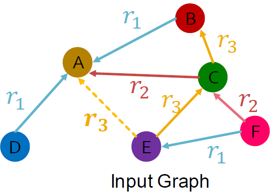
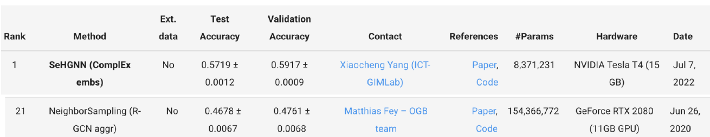

### 5.1 ML with Heterogeneous Graphs

- So far we only handle graphs with one edge type
- How to handle graphs with multiple nodes or edge types (a.k.a heterogeneous graphs)?
- Goal: Learning with heterogeneous graphs
  - Relational GCNs
  - Heterogeneous Graph Transformer
  - Design space for heterogeneous GNNs

#### 5.1.1 Heterogeneous Graphs

- Motivation: A graph could have multiple types of nodes and edges.

    Example: 2 types of nodes (paper, author) + 2 types of edges (cite, like) → 8 possible **relation types (node start, edge, node_end)** !

     

    - We use **relation type to describe an edge** (as opposed to edge type)
    - Relation type better captures the interaction between nodes and edges

- Definition: A heterogeneous graph is defined as $G=(V,R,T,E)$
  - Nodes $v_i \in V$ with node types $T(v_i)$
  - Edge types $e \in E$
  - Relations with relation types $(v_i,e,v_j) \in E$

- Examples
  1. Biomedical Knowledge Graphs: (fulvestrant, Treats, Breast Neoplasms)

     

  2. Event Graphs: (UA689, Origin, LAX)

      

  3. E-Commerce Graph
       - Node types: User, Item, Query, Location, ...
       - Edge types: Purchase, Visit, Guide, Search, ...
       - Different node type's features spaces can be different!

       

  4. Academic Graph
       - Node types: Author, Paper, Venue, Field, ...
       - Edge types: Publish, Cite, ...
       - Benchmark dataset: Microsoft Academic Graph
  
        

- Observation: We can also treat types of nodes and edges as features

    Example: Add a one-hot indicator for nodes and edges
  - Append feature [1, 0] to each “author node”; Append feature [0, 1] to each “paper node”
  - Similarly, we can assign edge features to edges with different types
  - Then, a heterogeneous graph reduces to a standard graph

- When do we need a heterogeneous graph?

    Case 1: Different node/edge types have different shapes of features
    - An “author node” has 4-dim feature, a “paper node” has
5-dim feature
    
    Case 2: We know different relation types
represent different types of interactions
    - (English, translate, French) and (English, translate, Chinese) require different models

    Ultimately, heterogeneous graph is a more expressive graph representation
    - Captures different types of interactions between entities

    But it also comes with costs:
    - More expensive (computation, storage)
    - More complex implementation

    There are many ways to convert a heterogeneous graph to a standard graph (that is, a homogeneous graph).

#### 5.1.2 Relational GCN (RGCN)

 

We will extend GCN to handle heterogeneous graphs with multiple edge/relation types

We start with a directed graph with one relation. How do we run GCN and update the representation of the target node A on this graph?

 

- What if the graph has multiple relation types?

    Use different neural network weights for different relation types.

     

      

    Introduce a set of neural networks for each relation type!

    

- Relational GCN: Definition

    

    How to write this as Message + Aggregation?
    - Message: 
      - Each neighbor of a given relataion: $m^{(l)}_{(u,r)}=1/c_{(u,r)}W^{(l)}_rh^{(l)}_u$, normalized by node degree of the relation $c_{(u,r)}=|N^r_v|$.
      - Self-loop: $m^{(l)}_v=W^{(l)}_0h^{(l)}_v$
    - Aggregation: Sum over messages from neighbors and self-loop, then apply activation
    
      

- Scalability
  - Each relation has L matrices: $W^{(1)}_r,W^{(2)}_r,...W^{(L)}_r$
  - The size of each $W^{(l)}_r$ is $𝑑^{(𝑙+1)} × 𝑑^{(𝑙)}$, where $𝑑^{(𝑙)}$ is the hidden dimension in layer l.

    → Rapid growth of the number of parameters w.r.t number of relations! Overfitting becomes an issue!
  - Two methods to regularize the weights $W^{(l)}_r$
    1. Use block diagonal matrices
    2. Basis/Dictionary learning
   
- Block Diagonal Matrices

    key insight: make the weights sparse!

    Use block diagnonal matrices for $W_r$

    

    If use 𝐵 low-dimensional matrices, then # param reduces from $𝑑^{(𝑙+1)} × 𝑑^{(𝑙)}$ to $B × 𝑑^{(𝑙+1)}/B × 𝑑^{(𝑙)}/B$

- Basis Learning

    Key insight: Share weights across different relations!

    Represent the matrix of each relation as a **linear combination of basis transformations**

    $W_r = \sum_{b=1}^Ba_{rb} \cdot V_b$, where $V_b$ is shared across all relations
    - $V_b$ are the basis matrices
    - $a_{rb}$ is the importance weight of matrix $V_b$

    Now each relation only needs to learn $[a_{rb}]_{b=1}^B$ which is B scalars.

- Examples

  1. Entity/Node Classification

    Goal: Predict the label of a given node

    RGCN uses the representation of the final layer:
    - If we predict the class of node A from k classes
    - Take the final layer (prediction head): $h^{(L)}_A \in \mathbb{R}^k$, each item in $h^{(L)}_A$ represents the probability of that class

  2. Link Prediction

    Link prediction split: graph is split with 4 categories of edges (training message / training supervision / validation / test)

    Every edge also has a relation type, this is independent of the 4 categories.
    
    In a heterogeneous graph, the homogeneous graphs formed by every single relation also have the 4 splits.

      

- RGCN for Link Prediction

    Assume (𝑬, 𝒓𝟑 , 𝑨) is training supervision edge, all the other edges are training message edges.
    
    Use RGCN to score (𝑬, 𝒓𝟑 , 𝑨):

     

    - Take the final layer of E and A: $h^{(L)}_E$ and $h^{(L)}_A \in \mathbb{R}^d$ 
    - Relation-specific score function $f_r: \mathbb{R}^d \times \mathbb{R}^d$ → $\mathbb{R}$
      - one example $f_{r_1}(h_E,h_A)=h^T_EW_{r_1}h_A$, $W_{r_1} \in \mathbb{R}^{d \times d}$
  
    Training:

     
    
    1. Use GNN model to score negative edge
    2. Optimize a standard cross entropy loss: 
       - Maximize the score of training supervision edge
       - Minimize the score of negative edge

          
    
    Evaluation: Use training message edges & training supervision edges to predict validation edges. Validation time as an example, same at the test time.

     

     

- Benchmark for Heterogeneous Graphs

    [ogbn-mag](https://ogb.stanford.edu/docs/nodeprop/) from Microsoft Academic Graph (MAG)
    - 4 types of entities: Papers (736k nodes), Authors (1.1.m nodes), Institutions (9k nodes), Fields of study (60k nodes)

     

    - 4 directed relations:
      - An author is affiliated with an institution
      - An author writes a paper
      - A paper cites a paper
      - A paper has a topic of a field of study

    - Prediction task
      - Each paper has a 128-dimensional word2vec feature vector
      - Given the content, references, authors, and author affiliations
from ogbn-mag, predict the venue of each paper
      - 349-class classification problem due to 349 venues considered
    - Time-based dataset splitting
      - Training set: papers published before 2018
      - Test set: papers published after 2018
    - Benchmark results

         

        SOTA method: SeHGNN
        - ComplEx (Next lecture) + Simplified GCN (Lecture 17)

- Summary of RGCN

    - Relational GCN, a graph neural network for heterogeneous graphs
    - Can perform entity classification as well as link prediction tasks.
    - Ideas can easily be extended into RGNN (RGraphSAGE, RGAT, etc.)
    - Benchmark: ogbn-mag from Microsoft Academic Graph, to predict paper venues

#### 5.1.3 Heterogeneous Graph Transformer

 

- Motivation: GAT is unable to represent different node & different edge types

  Introduce a set of neural networks for each relation type is too expensive for attention
  
  Recall: relation describes (node_s, edge, node_e)

- Basics: Attention in Transformer

  HGT uses Scaled Dot-Product Attention (proposed in Transformer)

   

- Heterogeneous Mutual Attention

  Recall: Applying GAT to a homogeneous graph, where $H^{(l)}$ is the l-th layer representation.

   

  Innovation: Decompose heterogeneous attention to Node- and edge-type dependent attention mechanism

     

  - 3 node weight matrices, 2 edge weight matrices
  - Without decomposition: 3*2*3=18 relation types -> 18 weight matrices (suppose all relation types exist)

  Heterogeneous Mutual Attention Definition: 

   

  - Each relation (𝑇(s), 𝑅(e), 𝑇(t)) has a distinct set of **projection weights**
    - T(s): type of node s, R(e): type of edge e.
    - T(s) & T(t) parameterize K_Linear$_{T(s)}$ & Q_Linear$_{T(t)}$, which further return Key and Query vectors K(s) and Q(t)
    - Edge type R(e) directly parameterizes $W_{R(e)}$

- More Details on HGT

  A full HGT layer:  

  Similarly, HGT **decomposes weights** with node & edge types in the **message computation**

    

- HGT vs R-GCN: Performance

  Benchmark: ogbn-mag from Microsoft Academic Graph, to predict paper venues

    

  Thanks to the weight decomposition over node & edge types, HGT uses much fewer parameters, even though the attention computation is expensive,
while performs better than R-GCN
  

#### 5.1.4 Design Space for Heterogenous GNNs

How do we extend the general GNN design space to heterogeneous graphs?

1. Heterogeneous message computation

     - Observation: A node could receive multiple types of messages. Num of message type = Num of relation type.
     - Idea: Create a different message function for each relation type

    - $m^{(l)}_u=MSG^{(l)}_r(h^{(l-1)}_u), r=(u,e,v)$ is the relation type between node u that sends the message, edge type e, and node v that receive the message.
    - Example: A linear layer $m^{(l)}_u=W^{(l)}_rh^{(l-1)}_u$

2. Heterogeneous Aggregation

     - Observation: Each node could receive multiple types of messages from its neighbors, and multiple neighbors may belong to each message type.
     - Idea: We can define a 2-stage message passing

         

        Given all the messages sent to a node,
        - Within each message type, aggregate the messages that belongs to the edge type with $AGG^{(l)}_r$
        - Aggregate across the edge types with $AGG^{(l)}_{all}$
    - Example: $h^{(l)}_v=Concat(Sum(m^{(l)}_u, u \in N_r(v)))$

3. Heterogeneous GNN Layers

     

  Heterogeneous pre/post-process layers:
  - MLP layers **with respect to each node type**, since the output of GNN are node embeddings
  - $h^{(l)}_v=MLP_{T(v)}(h^{(l)}_v)$, where $T(v)$ is the type of node v.
  
  Other successful GNN designs are also encouraged for heterogeneous GNNs: skip connections, batch/layer normalization, …

4. Heterogeneous Graph Manipulation

    Graph Feature manipulation:
     - 2 Common Options: compute graph statistics (i.e. node degree) within each relation type, or across the full graph (ignoring the relatino types)

    Graph Structure manipulation:
     - Neighbor and subgraph sampling are also common for heterogeneous graphs
     - 2 Common options: sampling within each relatino type (ensure neighbors from each type are covered), or sample across the full graph.

5. Heterogeneous Prediction Heads

    Node-level predictions:  

    Edge-level prediction: $\hat y_{uv}=Head_{edge,r}(h^{(L)}_u,h^{(L)}_v)=Linear_r(Concat(h^{(L)}_u,h^{(L)}_v))$
    
    Graph-level prediction: $\hat y_G=AGG(Head_{graph,i}(\{h^{(L)}_v \in \mathbb{R}^d, \forall T(v)=i\}))$
    
In summary, Heterogeneous GNNs extend GNNs by separately modeling node/relation types + additional AGG.

### 5.2 Knowledge Graph Embeddings

#### 5.2.1 Motivation

- Knowledge in graph form capture entities, types, and relationships:
  - Nodes are entities, labeleld with their types
  - Edges between two nodes capture relationships between entities
  - KG is an example of a heterogeneous graph

- Example: Bibliographic Networks
  - Node types: paper, title, author, cnoference, year
  - Relation types: pubWhere, pubYear, hasTitle, hasAuthor, cite

     

- Example: Bio Knowledge Graphs
  - Node types: drug, disease, adverse event, protein, pathways
  - Relation types: has_func, causes, assoc, treats, is_a

   

- KG in Practice
  - Google Knowledge Graph
  - Amazon Product Graph
  - Facebook Graph API
  - IBM Watson
  - Microsoft Satori
  - Project Hanover/Literome
  - LinkedIn Knowledge Graph
  - Yandex Object Answer
- Applications
  - Serving information i.e. Bing search
  - Question answering and conversation agents
- KG Datasets
  - Publicly available KGs: FreeBase, Wikidata, Dbpedia, YAGO, NELL, etc.
  - Common characteristics:
    - Massive: millions of nodes and edges
    - Incomplete: Many true edges are missing

  Given a massive KG, enumerating all the possible facts is intractable! Can we predict plausible But missing links?

  - Example: Freebase

    - ~80 million entities, ~38K relation types, ~3 billion facts/triples

    - 93.8% of persons from Freebase have no place of birth and 78.5% have no nationality!
    - Researchers use a **complete** subset of Freebase (Datasets: FB15k/FB15k-237) to learn KG models.

       

- KG Completion Task: Given an enormous KG, can we complete the KG?
  
  For a given (head, relation), we predict missing tails. (Note this is slightly different from link prediction task)

   

- Recap: "Shallow" Encoding - encoder is just an embedding-lookup

    

- KG Representation
  - Edges in KG are represented as **triples (ℎ, 𝑟, 𝑡)**
  - head (ℎ) has relation 𝑟 with tail (𝑡)

  Key idea: 
  - Model entities and relations in the embedding/vector space $ℝ^𝑑$.
    - Associate entities and relations with **shallow embeddings**
    - **Note we do not learn a GNN here!**
  - Given a true triple (ℎ, 𝑟, 𝑡), the goal is that the embedding of (ℎ, 𝑟) should be close to the embedding of 𝑡.
    - How to embed ℎ, 𝑟 ?
    - How to define closeness?

- Different Models

  We are going to learn about different KG embedding models (shallow/transductive embs). They are:
  - based on different geometric intuitions
  - capture different types of relations (have different expressivity)

   

#### 5.2.2 Knowledge Graph Completion: TransE

- TransE - Translation Intuition: 
  
  For a triple $(h,r,t)$, $\mathbf{h,r,t} \in \mathbb{R}^d$, $\mathbf{h+r} \approx t$ if the given fact is true else $\mathbf{h+r} \neq t$ (embedding vectors will appear in boldface)

  Scoring Function: $f_r(h,t)=-||\mathbf{h+r-t}||$

    

- TransE: Contrastive/Triplet Loss
  
   

- Connectivity Patterns in KG

  Relations in a heterogeneous KG have different properties:
  - **Symmetry**: If the edge (ℎ, "Roommate", 𝑡) exists in KG, then the edge (𝑡, "Roommate", ℎ) should also exist.
  - **Inverse relation**: If the edge (ℎ, "Advisor", 𝑡) exists in KG, then the edge 𝑡, "Advisee", ℎ should also exist.

  Can we categorize these relation patterns? → 4 Relation Patterns:
  1. **Symmetric (Antisymmetric)** Relatons:  

      Symmetric Example: Family, Roommate; Antisymmetric: Hypernym
  
  2. **Inverse** Relatons: $𝑟_2(ℎ, 𝑡) ⇒ 𝑟_1(𝑡, ℎ)$

      Example: (Advisor, Advisee)
  
  3. **Composition (Transitive)** Relations:   

      Example: My mother’s husband is my father.

  4. **1-to-N** relations: $𝑟(ℎ, 𝑡_1), 𝑟(ℎ, 𝑡_2), … , 𝑟(ℎ, 𝑡_𝑛)$ are all True.

      Example: 𝑟 is “StudentsOf”

- Is TransE expressive enough to model these patterns?

  TransE **can** model:
  - antisymmetric relations: 𝐡 + 𝐫 = 𝐭, but 𝐭 + 𝐫 ≠ 𝐡

  - inverse relations: $𝐡 + 𝐫_𝟐 = 𝐭$, we can set $𝐫_1 = −𝐫_2$
  - composition relations: $𝐫_3 = 𝐫_1 + 𝐫_2$

     
       
       

  TransE **cannot** model:
  - symmetric relations, only if $r=0, h=t$

     
  
  - 1-to-N relations: $𝐭_1$ and $𝐭_2$ will map to the same vector, although they are different entities

      

#### 5.2.3 Knowledge Graph Completion: TransR

#### 5.2.4 Knowledge Graph Completion: DistMult

#### 5.2.5 Knowledge Graph Completion: ComplEx

#### 5.2.6 Knowledge Graph Embeddings in Practice

### 5.3 Reasoning over Knowledge Graphs

#### 5.3.1 Reasoning in KGs using Embeddings

#### 5.3.2 Answering PRedictive Queries on KGs

#### 5.3.3 Query2Box: Reasoning over KGs using Box Embeddings