### 4.1 Motivating Node Classification

Main question: Given a network with labels on some nodes, how do we assign labels to all other nodes in the network?

Example: In a network, some nodes are fraudsters, and some other nodes are fully trusted. How do you find the other fraudsters and trustworthy nodes?

Node embeddings (from random walks, GNN) is a method to solve this problem. Are there **alternative solutions based on the network topology**?

Problem Setting: Transductive node classification (also called semi-supervised node classification) - Given labels of some nodes, predict labels of unlabeled nodes.

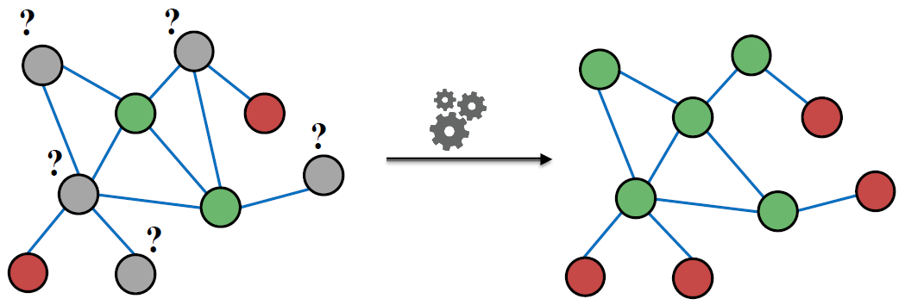  

**Label propagation** is an alternative framework. Intuition is that correlations exist in networks. Connected nodes tend to share the same label.

#### Corelations in Networks

Observation: Behaviors of nodes are correlated across the links of the network. i.e. Nearby nodes have the same color (belonging to the same class).

Two explanations for why behaviors of nodes in networks are correlated:

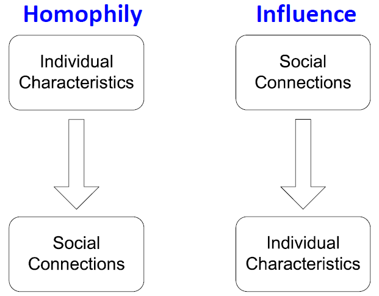  

- Homophily: The tendency of individuals to associate and bond with similar others.
  - “Birds of a feather flock together”
  - It has been observed in a vast array of network studies, based on a variety of
attributes (e.g., age, gender, organizational role, etc.)
  - Example: online social network, where people with the same interest are more closely connected due to homophily.
    - nodes=people
    - edge=frendship
    - node color=interests (sports, arts, etc.) 
- Influence: Social connections can influence the individual characteristics of a person.
  - Example: I recommend my musical preferences to my friends, until one of them grows to like my same favorite genres!

#### How do we leverage node correlations in networks?

Semi-supervised Learning: Given graph with few labeled nodes, find class of remaining nodes.
- Main assumption: There is homophily in the network, that is, connected nodes tend to share the same label.
- Example task:
  - Let 𝑨 be a 𝑛×𝑛 adjacency matrix over 𝑛 nodes
  - Let $Y=[0,1]^𝑛$ be a vector of labels: $Y_v$=1 belongs to Class 1; $Y_v$=0 belongs to Class 0. There are unlabeled node needs to be classified.
  - Each node $v$ has a feature vector $f_v$
  - Task: Predict $P(Y_v)$ given all features and the network

- We will look at 3 techniques today:
  - Label propagation
  - Correct & Smooth
  - Masked label prediction

### 4.2 Label Propagation

Idea: Propagate node labels across the network. Class probability of node $v$, $P(Y_v)$, is a weighted average of class probabilities of its neighbors.
- For labeled nodes 𝑣, initialize label $𝑌_𝑣$ with ground truth label $𝑌_𝑣^*$
- For unlabeled nodes , initialize $𝑌_𝑣$=0.5
- Update each unlabeled node v's label. The math:

    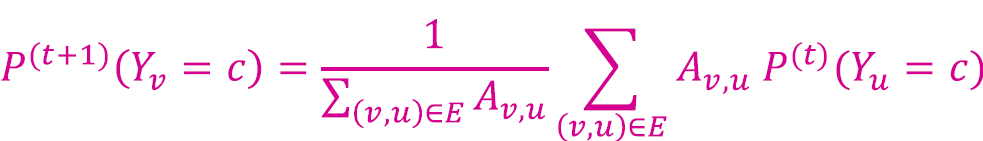   

    If edges have strength/weight information, $𝐴_{𝑣,𝑢}$ can be the edge weight between 𝑣 and 𝑢.

    $P(Y_v=c)$ is the probability of node 𝑣having label 𝑐

- Repeated the update until convergence or until maximum number of iterations is reached.
  
  Intuition of convergence: Stop iterating when all nodes have reached a static value. Applying label propagation does not change labels anymore.

  Convergence criteria: $|P^{(t)}(Y_v)-P^{(t-1)}(Y_v)|\leq𝜖$ for all nodes $v$. Here 𝜖 is the convergence threshold.

Example: Initialization

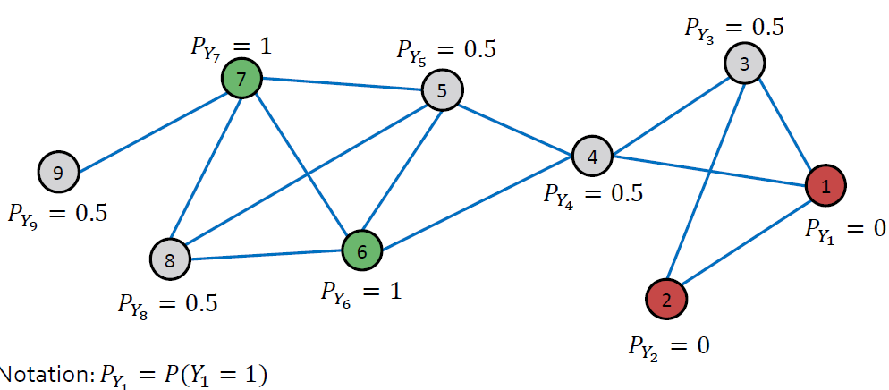 

- Update for the 1st Iteration:
    
    Node 3: $N_3$ = {1,2,4} &rarr; $𝑃(𝑌_3)=(0+0+0.5)/3=0.17$

    Node 4: $N_4$ = {1,3,5,6} &rarr; $𝑃(𝑌_4)=(0+0.5+0.5+1)/4=0.5$

    Note that we update based on the scores in the previous iteration. After Iteration 1 of updating all the unlabeled nodes:

    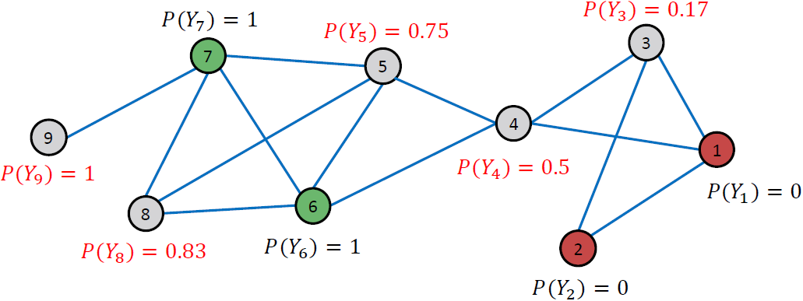  

- After 2nd iteration

    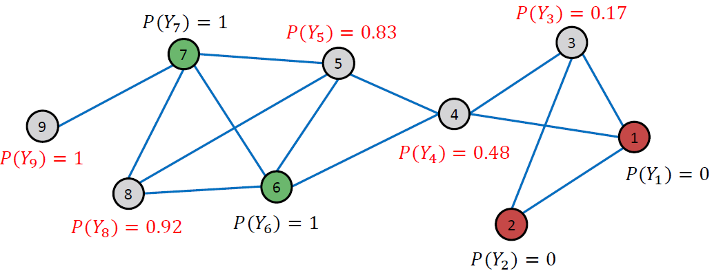  

- After 3rd iteration

      

- After 4th iteration

    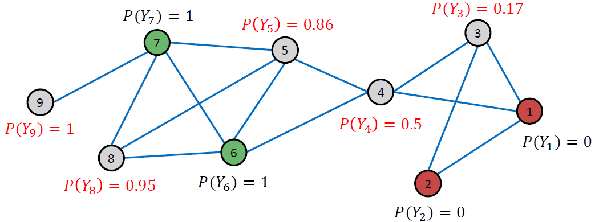  

- Convergence: All scores stabilize after 4 iterations. We therefore predict
  - Node 4, 5, 8, 9 belongs to class 1 ($P(Y_v)$>0.5)
  - Node 3 belong to class 0.

  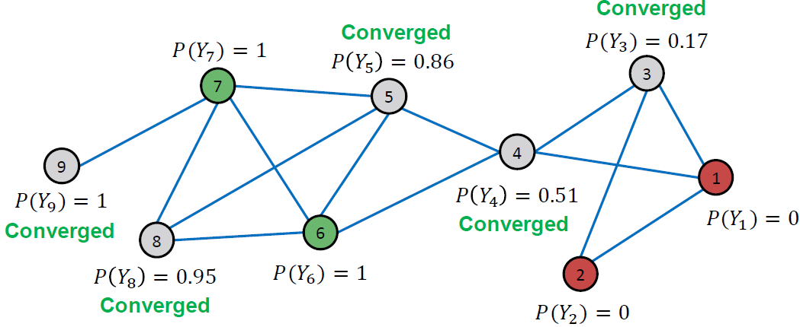  

#### Label Propagation Applications
- Document classification
  - Nodes: documents
  - Edges: document similarity (e.g. word overlap)
- Twitter polarity classification
  - Nodes: users, tweets, words, hashtags, emoji
  - Edges [users &rarr; users] Twitter follower graph;
  - Edges [users &rarr; tweets] creation;
  - Edges [tweets &rarr; words/hashtags/emoji]
- Spam and fraud detection

#### Label Propagation Summary

- Method: Iteratively update probabilities of node belonging to a label class based on its neighbors
- Issues:
  - Convergence may be very slow and not guaranteed
  - does not use node attributes
- Can we improve the idea of label propagation to leverage attribute/feature information?

### 4.3 Node Classification: Correct & Smooth

Correct & Smooth (C&S) is a recent state of the art node classification method. It tops the [OGB leaderboard](https://ogb.stanford.edu/docs/leader_nodeprop/)!

C&S Motivations:

||Label Propagation| GNN |
|-|-|-|
|Modeling assumption|connected nodes have similar labels|labels only depend on neighbor features|
|Reason why works| homophily a.k.a. associativity| these neighbor features are sometimes very informative|
|Efficiency| FAST: few sparse matrix-vector products | SLOW: many parameters, irregular computation|
|Improvement|Why not use additional info or features? | Why not assume labels are correlated?|

#### GNNs make uncorrelated predictions

It uses labels to train the weights of a model. Given a trained model, predictions for different nodes are independent/uncorrelated. In contrast, LP directly uses the labels in predictions.

  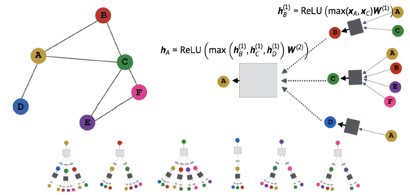  

  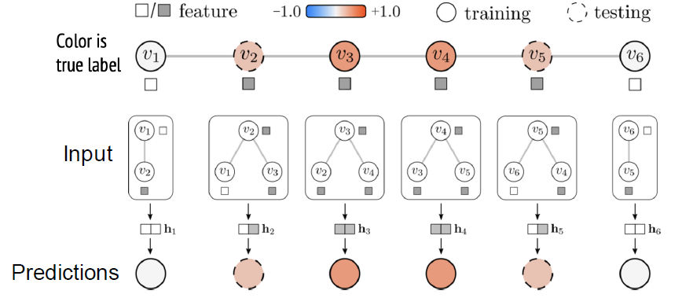  

1. Form local neighborhoods.
2. Combine features to get a representation $h_v$ at node 𝑣.
3. Predict outcome given representation (learn params with train data).

**If node features are overwhelmingly predictive**, making uncorrelated predictions for each node is OK.

Uncorrelated GNN predictions can be **catastrophic in simple cases when features are only mildly predictive**.

  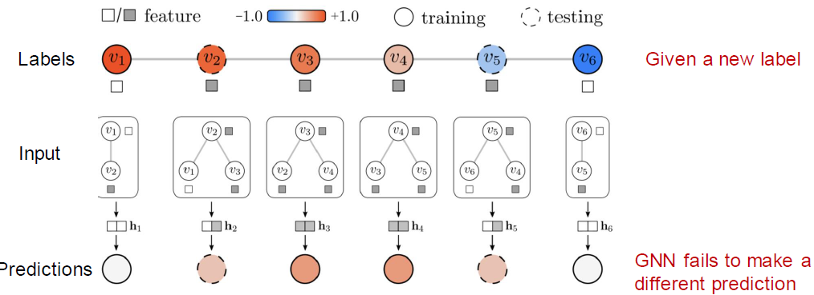   

- Big problem! Features are no longer super predictive.
- LP (ignoring features) would work much better.

#### Correct & Smooth

Setting: A partially labeled graph and features over nodes.

3-step procedure:
1. Train base predictor that predict soft labels over all nodes
  
    Labeled nodes are used for training/validation data

    Base predictor can be simple: Linear model/Multi-layer-perceptron (MLP) over node features, or a full GNN.
  
    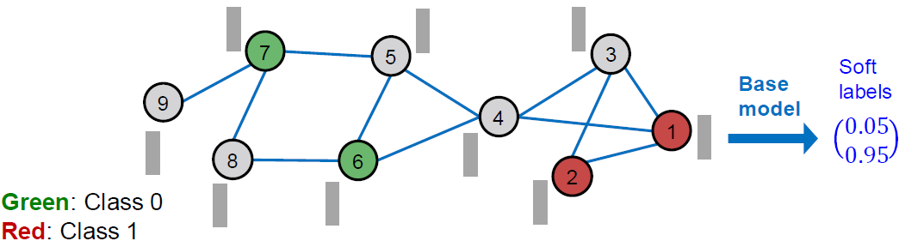  

2. Use the base predictor to predict soft labels (class probabilities) of all nodes

    We expect these soft labels to be decently accurate.

    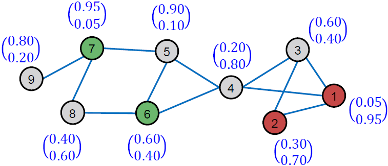  

3. **Post-process the soft predictions using graph structure** to obtain the final predictions of all nodes

    Correct Step:
    - Intuition: The degree of the errors of the soft labels are biased. We need to correct for the error bias.

      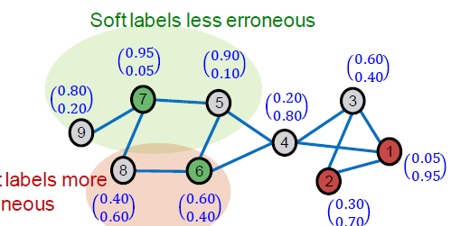 

    - Key idea: we expect **errors in the base prediction to be positively correlated along edges** in the graph. In other words, an error at node
𝑢 increases the chance of a similar error at neighbors of 𝑢. Thus, we should “spread” such uncertainty over the graph.  
      
    - Computation Procedure:
    1) Compute training errors of nodes: ground-truth label minus soft label. Defined as 0 for unlabeled nodes.
      
        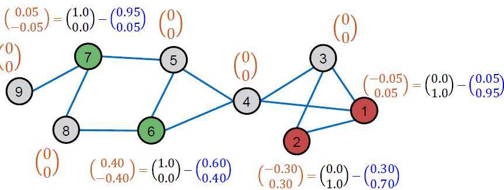 
      
    2) Obtain **Normalized diffusion matrix &Atilde; $=D^{-1/2}AD^{-1/2}$**
        
        Let $A$ be the adjacency matrix, &Atilde; be the diffusion matrix.
     
        - Add self-loop to the adjacency matrix A, i.e. $A_{ii} = 1$ 
        - Let $D=Diag(d_1, ..., d_N)$ be the degree matrix.
      
        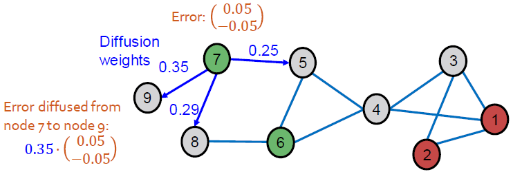  

        Theoretical Motivation for &Atilde;:
        - All the eigenvalues &lambda;'s are in the range of [-1,1].
        - The largest eigenvalue is always 1.
        - Output of &Atilde;x (i.e. in error diffusion) is normalized.

        Intuitions for &Atilde;:
        - If i and j are connected, the weight &Atilde;$_{ij}$ is $1/$&radic;$d_i$&radic;$d_j$.
        - Large if i and j are connected only with each other
        - Small if i and j are connected also connected with many other nodes.

      3) Diffuse training errors $E^{(0)}$ along the edges:

           $E^{(t+1)}$ &larr; $(1-a)$ &sdot; $E^{(t)}+a$ &sdot; &Atilde; $E^{(t)}$

           Assmuption: Prediction erros are similar for nearby nodes.

           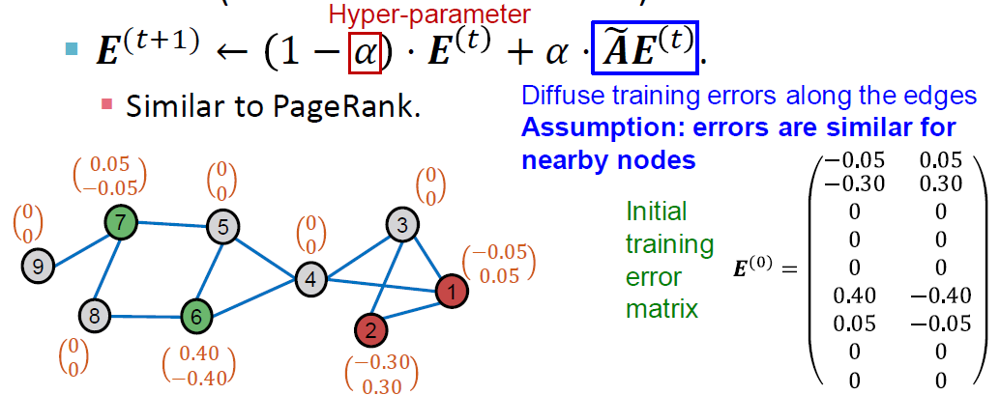 

           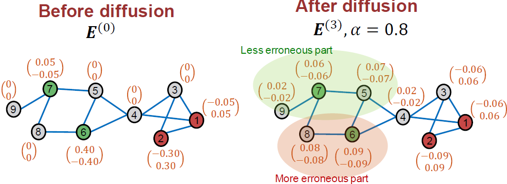
        
      4) Add the scaled diffused training errors into the predicted soft labels

          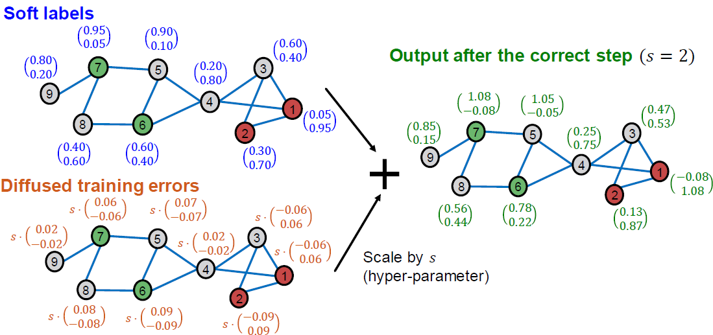     

    Smooth Step:
    - Intuition: The predicted soft labels may not be smooth over the graph. We need to smoothen the soft labels.

      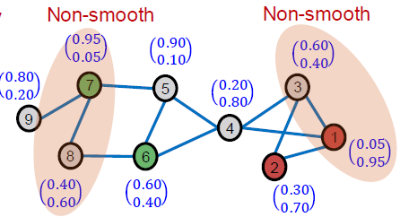  

      Note: for training nodes, we use the ground-truth hard labels instead of the soft labels.
    - Computation Procedure
      - Diffuse label $Z^{(0)}$ along the graph structure

      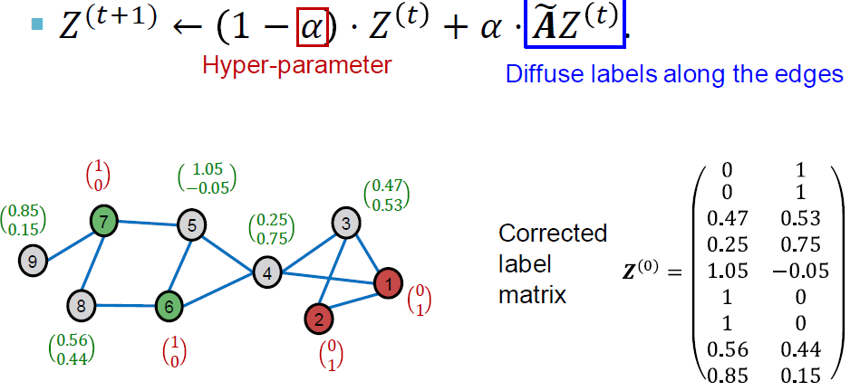

      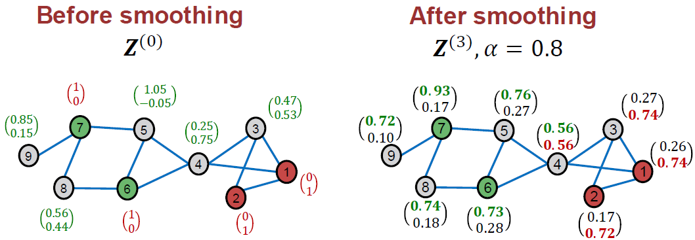 

      The final class prediction of C&S is the class with the maximum $𝒁^{(𝟑)}$ score.

      Note: The $𝒁^{(𝟑)}$ scores do not have direct probabilistic interpretation (e.g., not sum to 1 for each node), but larger scores indicate the classes are more likely.

Our toy example shows that C&S successfully improves base model performance using
graph structure. On real world datasets, C&S can significantly improves the performance of the base model (e.g. MLP).

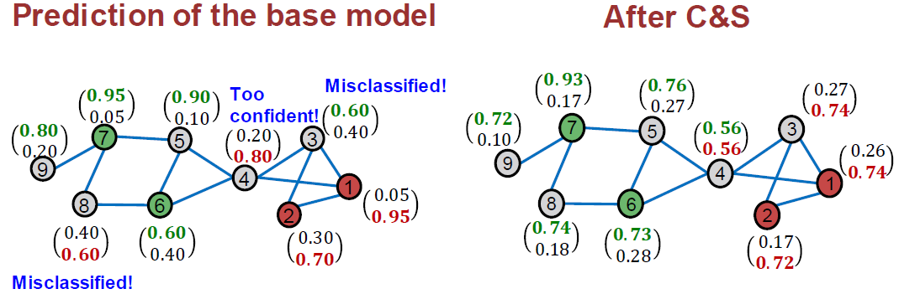

Summary:

- Correct & Smooth (C&S) uses graph structure to post process the soft node labels predicted by any base model.
- Correction step: Diffuse and correct for the training errors of the base predictor.
- Smooth step: Smoothen the prediction of the base predictor (a variant of label propagation).
- C&S can be combined with GNNs
- C&S achieves strong performance on semi-supervised node classification.

### 4.4 Masked Label Prediction

Inspired from BERT objective in NLP, an alternative approach to explicitly include node label information (works with GNN).

BERT Pretraining strategy: masked word prediction

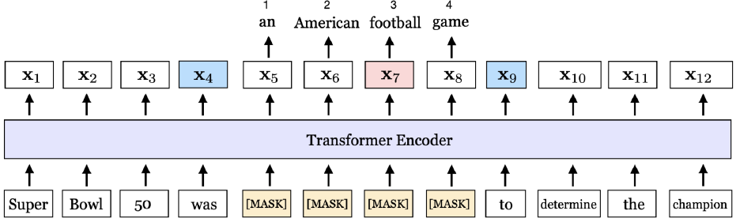

Idea: Treat labels as additional features. Concatenate the node label matrix 𝑌 with the node feature matrix 𝑋.

ML Setting: : Use partially observed labels $\hat𝑌$ to predict the remaining unobserved labels.
- Training: First corrupt $\hat𝑌$ into $\tilde{Y}$ by randomly masking a portion of node labels to zeros, then use $[X, \tilde{Y}]$ to predict the masked node labels.
- Inference: Employ all $\hat𝑌$ to predict the remaining unlabeled nodes (in the validation/test set).
- Similar to link prediction, also a self-supervised task.

#### Lecture Summary

3 ideas that **explicitly use labels** when making predictions on graphs:

- Label propagation: Directly propagate known labels to all the nodes
- Correct & Smooth: First define a base predictor, then correct and smooth the predictions with label propagation
- Masked label prediction: Construct a self supervised ML task, let graph ML
model to propagate label information

3 Frameworks to approach ML tasks on graphs:
1. Node embeddings
   
   Embed nodes into Euclidean space, and use distance metric in embedding space to approximate node similarity.

2. Graph Neural Networks

    Iterative neighborhood aggregation

3. Label Propagation

    Inductive bias: homophily

    Explicitly incorporate label info when making predictions

