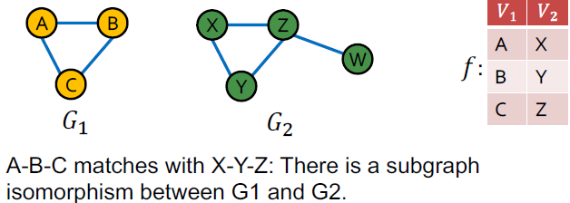

### 6.1 Frequent Subgraph Mining with GNNs

Building Blocks of Networks - Subgraphs:

They have the power to **characterize and discriminate** networks.

  

Plan for Today:
1. Subgraphs and motifs
    - Definition
    - Determining Motif Significance
  2. Neural Subgraph Representations
  3. Mining Frequent Motifs

#### 6.1.1 Subgraphs and motifs

Given graph $G=(V, E)$, two ways to formalize "network building blocks":
- Def 1: **Node-induced subgraph** (or "induced subgraph"): Take subset of the nodes and all edges induced by the nodes.
  
  $G^′ = (V^′, E^′)$ is a node induced subgraph iff
  - $V' \subset V$
  - $E' = \{(u,v) \isin E | u, v \isin V'\}$
  - $G'$ is the subgraph of G **induced by $V'$**

- Def 2. **Edge-induced subgraph** (or "non-induced subgraph" or just "subgraph"): Take subset of the edges and all corresponding nodes.

  $G^′ = (V^′, E^′)$ is an edge induced subgraph iff
  - $E' \subset E$
  - $V' = \{v \isin V | (u, v) \isin E'$ for some $u \}$

The best definition depends on the domain! For example:
- Chemistry: node-induced (functional groups)
- Knowledge graphs: Often edge-induced (focus is on edges representing logical relations)

The preceding definitions define subgraphs when V′ ⊆ V and E′ ⊆ E, i.e. nodes and edges are taken from the original graph G. 

- What if V′ and E′ come from a totally different graph? e.g.

     

    We would like to say that $G_1$ is “contained in” $G_2$

- Graph Isomorphism

    - Problem: Check whether two graphs are identical.

    - $G_1 = (V_1, E_1)$ and $G_2 = (V_2, E_2)$ are **isomorphic** if there exists a bijection $f: V_1 → V_2$ such that $(u, v) ∈ E_1$ iff $(f(a), f(b)) ∈ E_2$
    - $f$ is called the isomorphisim:

          

    - We do not know if graph isomorphism is NP-hard, nor is any polynomial algorithm found for solving graph isomorphism.

- Subgraph Isomorphism
    - $G_2$ is **subgraph-isomorphic** to $G_1$ if some subgraph of $G_2$ is isomorphic to $G_1$
    - We also commonly say $G_1$ is a subgraph of $G_2$
    - We can use either the node-induced or edge-induced
    - This problem is NP-hard

    

- Case Example of Subgraphs

   All non-isomorphic, connected, undirected graphs of size 4:

   

   All non-isomorphic, connected, directed graphs of size 3:

     

- Network Motifs: “recurring, significant patterns of interconnections”

    How to define a network motif:
    - Pattern: Small (node-induced) subgrpah
    - Recurring: Found many times, i.e., with high frequency
    - Significant: More frequent than expected, i.e., in randomly generated graphs?

      

    Why do we need Motifs?
    - Help us understand how graphs work
    - Help us make predictions based on presence or lack of presence in a graph dataset
  
    Examples:
    - Feed-forward loops: found in networks of neurons, where they neutralize “biological noise”
    - Parallel loops: found in food webs
    - Single-input modules: found in gene control networks

       
     
    

- Subgraph Frequency

    Let $G_Q$ be a small graph and $G_T$ be a target graph dataset.

  1. Graph-level Subgraph Frequency Definition: Frequency of $G_Q$ in $G_T$

       - number of unique subsets of nodes $V_T$ of $G_T$ for which the subgraph of $G_T$ induced by the nodes $V_T$ is isomorphic to $G_Q$ 

         

    Let $G_Q$ be a small graph, $v$ be a node in $G_Q$ (the "anchor") and $G_T$ be a target graph dataset.

  2. Node-level Subgraph Frequency Definition:

        - The number of nodes $u$ in $G_T$ for which some subgraph of $G_T$ is isomorphic to $G_Q$ and the isomorphism maps $u$ to $v$

        - Let $(G_Q, v)$ be called a **node-anchored** subgraph
        - Robust to outliers
  
          
    
    What if the dataset contains **multiple graphs**, and we want to compute frequency of subgraphs in the dataset?

    Idea: Treat the dataset as a giant graph $G_T$ with disconnected components corresponding to individual graphs.

- Defining Motif Significance

    To define significance we need to have a null model (i.e., point of comparison)

    Key idea: Subgraphs that **occur in a real network much more often** than in a **random** network have functional significance

     

    - Defining Random Graphs
  
        Erdős–Rényi (ER) random graphs $G_{n,p}$: undirected graph on $n$ nodes where each edge $(u, v)$ appears i.i.d. with probability $p$

        Can be disconnected: 

         

    - New Model: Configuration Model
      - Goal:  Generate a random graph with a given **degree sequence $k_1, k_2, … k_N$**
      - Useful as a “null” model of networks: We can compare the real network $G^{real}$ and a “random” $G^{rand}$ which has the same degree sequence as $G^{real}$
  
        

    - Alternative for Spokes: Switching
      - Start from a given graph G
      - Repeat **the switching step** $Q \cdot|E|$ times:
        - Select a pair of edges A &rarr; B, C &rarr; D at random
        - **Exchange** the endpoints to give A &rarr; D, C &rarr; B
        - Exchange edges only if no multiple edges or self-edges are generated
      - Result: A randomly rewired graph with the same node degrees and randomly rewired edges
      - Q is chosen large enough (e.g. Q = 100) for the process to converge.

- Evaluating Motif Significance
  - Z-score $Z_i$ captures statistical significance of motif i:

    $Z_i = (N^{real}_i-\bar{N^{rand}_i})/std(N^{rand}_i)$
    - $N^{real}_i$ is # of motif i in graph $G^{real}$
    - $N^{rand}_i$ is average # of motif i in random graph instances
  
    For each subgraph, z-score metric is capable of classifying the subgraph “significance”:
    - Negative values indicate **under-representation**
    - Positive values indicate **over-representation**

  - **Network significance profile (SP)**: $SP_i = Z_i/\sqrt{\sum_{j}Z^2_j}$
    - SP is a vector of normalized Z-scores, with values for all subgraph types.
    - The dimension depends on number of motifs considered
    - SP emphasizes relative significance of subgraphs:
      - Important for comparison of networks of different sizes
      - Generally, larger graphs display higher Z-scores

  - Compare profiles of different graphs with random graphs:
    - Regulatory network (gene regulation)
    - Neuronal network (synaptic connections)
    - World Wide Web (hyperlinks between pages)
    - Social network (friendships)
    - Language networks (word adjacency)

    

  - Summary: Detecting Motifs

      Intuition: Motifs are overrepresented in a network when compared to random graphs.
    - Step 1: **Count subgraphs i** in the given graph ($G^{real}$)
    - Step 2: **Generate random graphs** with similar statistics (e.g. number of nodes, edges, degree sequence), and count subgraphs in the random graph
      - Null model: Each $G^{rand}$ has the same #(nodes), #(edges) and degree distribution as $G^{real}$.
    - Step 3: **Use statistical measures** like Z-score to evaluate
how significant is each motif
        -  $Z_i = (N^{real}_i-\bar{N^{rand}_i})/std(N^{rand}_i)$
        -  **High Z-score**: Subgraph i is a **network motif of G**

- Summary
    - Subgraphs and motifs are the building blocks of graphs
    - Subgraph isomorphism and counting are NP-hard
    - Understanding which motifs are frequent or significant in a dataset gives insight into the unique characteristics of that domain
    - Use random graphs as null model to evaluate the significance of motif via Z-score

#### 6.1.2 Neural Subgraph Matching

- Subgraph Matching

    Given: large target graph (can be disconnected) and query graph (connected)

    Decode: Is query graph a subgraph in the target graph?

     

- Isomorphism as an ML Task

    - Intuition: Exploit the **geometric shape** of embedding space to capture the properties of subgraph isomorphism

    - Idea: Use GNN to predict subgraph isomorphism

    - Task Setup: Consider a **binary** prediction: Return True if query is isomorphic to a subgraph of the target graph, else return False

     

- Neural Architecture for Subgraphs

  1. We are going to work with **node-anchored definitions**
  2. We are going to work with **node-anchored neighborhoods**
  3. Use GNN to obtain representations of u and v
  4. Predict if node u’s neighborhood is isomorphic to node v’s neighborhood

     

    - Why Anchor?

        Recall node-level frequency definition: The number of nodes $u$ in $G_T$ for which some subgraph of $G_T$ is isomorphic to $G_Q$ and the isomorphism maps $u$ to $v$

        We can compute embeddings for $u$ and $v$ using GNN, then use embeddings to decide if neighborhood of $u$ is isomorphic to subgraph of neighborhood of $v$.

        We not only predict if there exists a mapping, but also identify corresponding nodes ($u$ and $v$)!

- Decomposing $G_T$ into Neighborhoods

   For each node in $G_T$:
   - Obtain a **k-hop neighborhood** around the anchor
   - Can be performed using **breadth-first search** (BFS)
   - The depth k is a hyper-parameter (e.g. 3). Larger depth results in more expensive model

   Same procedure applies to $G_Q$, to obtain the neighborhoods.

   We embed the neighborhoods using a GNN, by computing the **embeddings for the anchor** nodes in their respective neighborhoods.

- Order Embedding Space

    - Intuition: subgraph is to the lower-left of its supergraph (in 2D)
    - Idea: Map graph A to a point $z_A$ into a highdimensional (e.g. 64-dim) embedding space, such that $z_A$ is **non-negative in all dimensions**

      

    - Why Order Embedding Space?

      **Subgraph isomorphism relationship** can be nicely encoded in order embedding space.
      - Transitivity: if $G_1$ is a subgraph of $G_2$, $G_2$ is a
subgraph of $G_3$, then $G_1$ is a subgraph of $G_3$
      - Anti-symmetry: if $G_1$ is a subgraph of $G_2$, and $G_2$ is
a subgraph of $G_1$, then $G_1$ is isomorphic to $G_2$
      - Closure under intersection: the trivial graph of 1 node is a subgraph of any graph
      - All properties have their counter-parts in the order embedding space

       

- Order Constraint

    We use a GNN to learn to embed neighborhoods and preserve the order embedding structure.

    What loss function should we use, so that the learned order embedding reflects the subgraph relationship?

    &rarr; We design loss functions based on the **order constraint**:

    - Order constraint specifies the ideal order embedding
property that reflects subgraph relationships
    - We specify the order constraint to **ensure that the subgraph properties are preserved** in the order embedding space

         

    - Loss Function: GNN Embeddings are learned by minimizing a **max-margin loss**
      - Let $E(G_q, G_t)=\sum_{i=1}^D(max(0, z_q[i]-z_t[i]))^2$ be the "margin" between $G_q$ and $G_t$
      - To learn the correct order embeddings, we want to learn $z_q$, $z_t$ such that
        - $E(G_q, G_t)=0$ when $G_q$ **is** a subgraph of $G_t$
        - $E(G_q, G_t)>0$ when $G_q$ **is not** a subgraph of $G_t$
        
         

- Training Neural Subgraph Matching

    - Overview
      - Construct training examples ($G_q$, $G_t$) where half the time, $G_q$ is a subgraph of $G_t$, and the other half, it is not.
      - Train on these examples by minimizing the following **max-margin loss**:
        - For positive examples: Minimize $E(G_q, G_t)$ when $G_q$ is a subgraph of $G_t$
        - For negative examples: Minimize $max(0, \alpha − E(G_q, G_t))$
        - Max-margin loss prevents the model from learning the degenerate strategy of moving embeddings further and further apart forever
    - Training Example Construction

      Need to generate training queries $G_Q$ and targets $G_T$ from the dataset $G$:
      - Get $G_T$ by choosing a random anchor $v$ and taking all nodes in $G$ within distance K from $v$ to be in $G_T$
      - Use **BFS sampling** to get $G_Q$. Sample induced subgraph of $G_T$:
        - Initialize $S = \{v\} , V = ∅$
        - Let $N(S)$ be all neighbors of nodes in $S$. At every step, sample 10% of the nodes in $N(S)/V$ and place them in $S$. Place the remaining nodes of $N(S)$ in $V$.
        - After K steps, take the subgraph of $G$ induced by $S$ anchored at $q$
      - For negative examples ($G_Q$ not subgraph of $G_T$), “corrupt” $G_Q$ by adding/removing nodes/edges so it’s no longer a subgraph

          

    - How many training examples to sample?
      - At every iteration, we sample new training pairs
      - Benefit: Every iteration, the model sees different subgraph examples
      - Improves performance and avoids overfitting – since there are exponential number of possible subgraphs to sample from
    - How deep is the BFS sampling?
      - A hyper-parameter that trades off runtime and performance
      - Usually use 3-5, depending on size of the dataset

- Subgraph Predictions on New Graphs

    Given: query graph $G_q$. anchored at node $q$, target graph $G_t$ anchored at node $t$

    Goal: output whether the query is a node anchored subgraph of the target

    Procedure: 
    - If $E(G_q, G_t)< \epsilon$, predict "True"; else "False"
    - $\epsilon$ a hyper-parameter

    To check if $G_Q$ is isomorphic to a subgraph of $G_T$, repeat this procedure for all $q ∈ G_Q$, $t ∈ G_T$. Here $G_q$ is the neighborhood around node $q ∈ G_Q$.

- Summary
  - Neural subgraph matching uses a machine learning based approach to learn the NP-hard problem of subgraph isomorphism
    - Given query and target graph, it embeds both graphs into an
order embedding space
    - Using these embeddings, it then computes $E(G_q, G_t)$ to
determine whether query is a subgraph of the target
  - Embedding graphs within an **order embedding space** allows subgraph isomorphism to be efficiently represented and tested by the relative positions of graph embeddings

#### 6.1.3 Finding Frequent Subgraphs

Finding the most frequent size-k motifs requires solving two challenges:
1. Enumerating all size-k connected subgraphs &rarr; Combinatorial explosion of number of possible patterns
2. Counting #(occurrences of each subgraph type) &rarr; Counting subgraph frequency is NP-hard

 

- Why is it Hard?

    - Just knowing if a certain subgraph exists in a graph is a hard computational problem! Subgraph isomorphism is NP-complete.

    - Computation time grows exponentially as the size of the subgraphs increases.
      - Feasible motif size for traditional methods is relatively small (3 to 7)

- Solution with Representation Learning
    - Combinatorial explosion &rarr; organize the search space

        Solution: Don't enumerate subgraphs but construct a size-k subgraph incrementally
        - Note: We are only interested in high frequency subgraphs
    - Subgraph isomorphism &rarr; prediction using GNN

        Solution: Use GNN to "predict" the frequency of the subgraph

- Problem Setup: Frequent Motif Mining
    - Target graph (dataset) $G_T$, size parameter $k$
    - Desired number of results $r$
    - Goal: Identify, among all possible graphs of $k$ nodes, the $r$ graphs with the highest frequency in $G_T$.
    - We use the node-level definition: The number of nodes $u$ in $G_T$ for which some subgraph of $G_T$ is isomorphic to $G_Q$ and the isomorphism maps $u$ to $v$ 

- SPMiner Overview
  - SPMiner: a neural model to identify frequent motifs
  - Key Idea: 
    - Decompose input graph $G_T$ into neighborhoods
    - Embed neighborhoods into an order embedding space
    - Key benefit of order embedding: We can quickly find out the frequency of a given subgraph $G_Q$

      

- Motif Frequency Estimation

    - Given: Set of subgraphs (“node-anchored neighborhoods”) ) $G_N$$_i$ of $G_T$ (sampled randomly)
    - Key idea: Estimate frequency of $G_Q$ by counting the number of $G_N$$_i$ such that their embeddings $z_N$$_i$ satisfy $z_Q$ ≤ $z_N$$_i$
    - Consequence of the order embedding space property

      

- SPMiner Search Procedure

    - Initial step: Start by randomly picking a starting node $u$ in the target graph. Set $S = \{u\}$

         

    - Iteratively: Grow a motif by iteratively choosing a neighbor of a node in $S$, and adding that node to $S$ We want to grow motifs to find larger motifs!

          

    - Termination: Upon reaching a desired motif size, take the subgraph of the target graph induced by $S$

           

    - How to pick which node to add at each step?

        - Total violation of a subgraph G: number of neighborhoods
that do not contain G.
            - The number of neighborhoods $G_N$$_i$ that do **not** satisfy $z_Q$ ≤ $z_N$$_i$
            - Minimizing total violation = maximizing frequency
        - Greedy strategy (heuristic): At every step, add the node that results in the **smallest total violation**

- Example Results 
  - Small Motifs

    - Ground truth: find most frequent 10 motifs in dataset by brute-force exact enumeration (expensive)
    - Question: Can the model identify frequent motifs?
    - Result: The model identifies 9 and 8 of the top 10 motifs, respectively.

    

  - Experiments on Large Motifs
    - Question: how do the frequencies of the identified motif compare?
    - Result: SPMiner identifies motifs that appear 10-100x more frequently than the baselines

     

- Summary
  - Subgraphs and motifs are important concepts that provide insights into the structure of graphs. Their counts can be used as features for nodes and graphs.
  - We covered neural approaches to prediction subgraph isomorphism relationship.
  - Order embeddings have desirable properties and can be used to encode subgraph relations
  - Neural embedding-guided search in order embedding space can enable ML model to identify motifs much more frequent than existing methods

### 6.2 Community Structure in Networks

#### 6.2.1 Community Detection in Networks

#### 6.2.2 Network Communities

#### 6.2.3 Louvain Algorithm

#### 6.2.4 Detecting Overlapping Communities