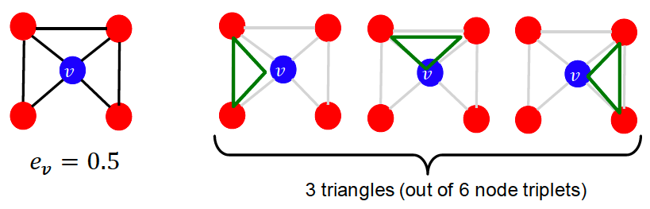
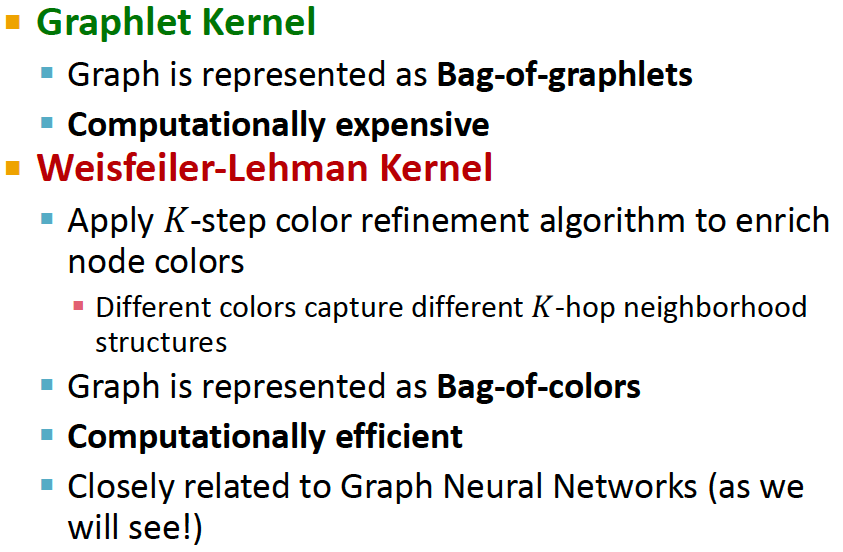
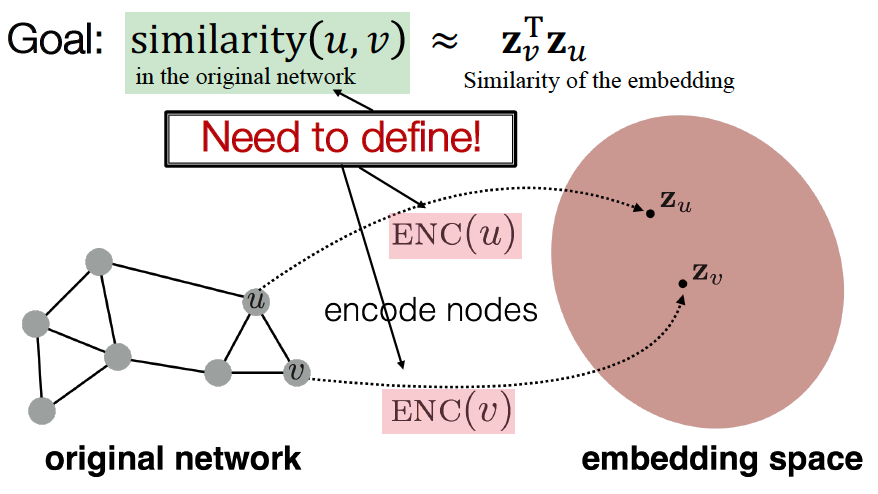
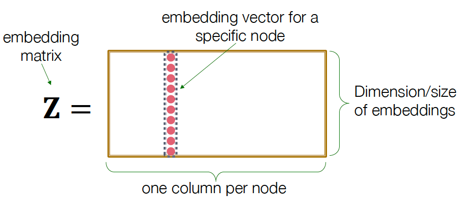
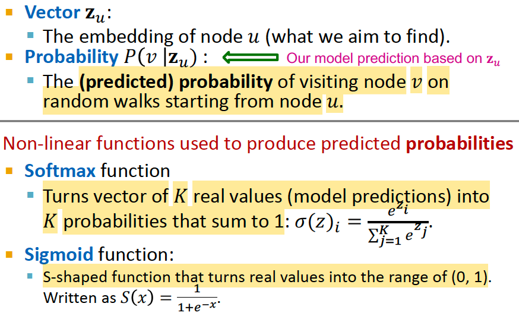
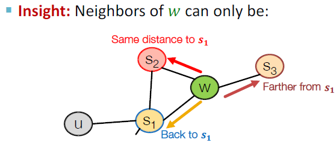
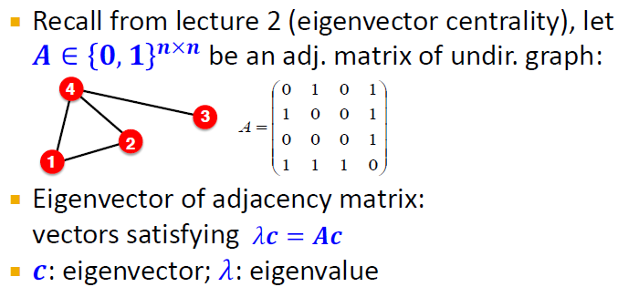
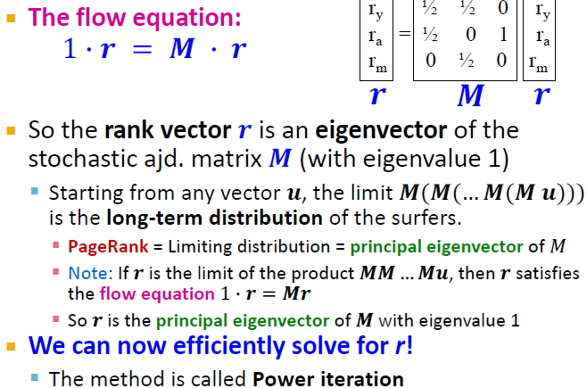

### 1.1 Traditional Feature-based Methods

Using effective features over graphs is the key to achieving good test performance.
Traditional ML pipeline uses hand-designed features.
In this lecture, we overview the traditional features for:
- Node-level prediction
- Link-level prediction
- Graph-level prediction

For simplicity, we focus on undirected graphs.

  
  

Goal: Make predictions for a set of objects

Design choices:
- Features: d-dimensional vectors
- Objects: Nodes, edges, sets of nodes, entire graphs
- Objective function: What task are we aiming to solve?

### Node-level Tasks and Features

Goal: Characterize the structure and position of a node in the network.

- **Node degree $k_v$**: number of edges the node has (treating all neighboring nodes equally)
  

    Node degree counts the neighboring nodes without capturing their importance.
- **Node centrality $c_v$**: takes the node importance in a graph into account. Different ways to model importance:
    - Eigenvector centrality
    - Betweenness centrality
    - Closeness centrality
    - etc....

  
  
  

- **Clustering Coefficient $e_v$**: measures how connected a node v's neighboring nodes are.
  

- Graphlets

    Observation: Clustering coefficient counts the #(triangles) in the ego-network.

    

    We can generalize the above by counting #(pre-specified subgraphs, i.e. graphlets).

    

    **Graphlet Degree Vector (GDV)**: counts #(graphlets) that a node touches.

    In comparison, Degree counts #(edges) that a node touches. Clustering coefficient counts #(triangles) that a node touches.

    

    Considering graphlets on 2 to 5 nodes we get:
    - Vector of 73 coordinates is a signature of a node that describes the topology of node's neighborhood.
    - Captures its interconnectivities out to a distance of 4 hops.

    Graphlet degree vector provides a measure of a **node's local network topology**:
    - Comparing vectors of two nodes provides a more detailed measure of local topological similarity than node degrees or clustering coefficient.

- Feature Summary
    - Importance-based features: capture the importance of a nodel in a graph. i.e. node degree, node centrality.
        
        Useful for predicting influential nodes in a graph. i.e. predicting celebrity users in a social network.
    - Structure-based features: capture topological properties of local neighborhood around a node.
        - node degree: number of neighboring nodes
        - clustering coefficient: how connected neighboring nodes are
        - graphlet degree vector: counts the occurrences of different graphlets
    
        Useful for predicting a particular role a node plays in a graph i.e. predicting protein functionality in a protein-protein interaction network.

### Link Prediction Task and Features

Goal: Predict new links based on existing links.

At test time, all node pairs (no existing links) are ranked and top K node pairs are predicted.

The key is to design features for a pair of nodes.

#### Methodology - Link Prediction via Proximity

1. For each pair of nodes (x,y) compute score c(x,y). i.e. c(x,y) could be the # of common neighbors of x and y.
2. Sort pairs (x,y) by the decreasing score c(x,y)
3. Predict top n pairs as new links
4. See which of these links actually appear in $G[t_1,t'_1]$

#### Link-level Features

- Distance-based features

    

    Limitation: does not capture how neighborhood overlaps.
- Local Neighborhood Overlap

    

    Limitation of local neighborhood features:
    
    - Metric is always 0 if the 2 nodes do not have any neighbors in common. However the 2 nodes may still potentially be connected in the future.
    - Global neighborhood overlap metrics resolve the limitation by considering the entire graph.

    

- Global neighborhood overlap: uses global graph structure to score two nodes

    **Katz index**: count the # of paths of all lengths between a given pair of nodes.

    How to compute #paths between two nodes: 
    
    - Use **powers of the graph adjacency matrix**
    - $A_{uv}$ specifies #paths of length 1 (direct neighborhood) between u and v.
    - $A^2_{uv}$ specifies #paths of length 2 (neighbor of neighbor) between u and v.
    - $A^l_{uv}$ specifies #paths of length l.

    
    
    

### Graph-Level Features and Graph Kernels

Goal: We want features that characterize the structure of an entire graph.

Kernel methods are widely-used for traditional ML for graph-level prediction.

Idea: Design kernels instead of feature vectors.

Graph Kernels: Measure similarity between two graphs.
- Graphlet Kernel [1]
- Weisfeiler-Lehman Kernel [2]
- Other kernels are also proposed in the literature (beyond the scope of this lecture)
    - Random-walk kernel
    - Shortest-path graph kernel
    - And many more…

Key Idea of Graph Kernel: Bag-of-* as the feature vector

- Graphlet Features

    Key idea: Count the number of different graphlets in a graph.

    Note: Definition of graphlets here is slightly different from node-level features.

    - Nodes in graphlets do not need to be connected (allows for isolated nodes)
    - The graphlets here are not rooted.

    
    

- Graphlet Kernel

    

    Limitations: Counting graphlets is expensive!
    - Counting size-k graphlets for a graph with size n by enumeration takes $n^k$.
    - This is unavoidable in the worst-case since subgraph isomorphism test (judging whether a graph is a subgraph of another graph) is NP-hard.
    - If a graph’s node degree is bounded by d, an $O(nd^{k-1})$ algorithm exists to count all the graphlets of size k.

- Weisfeiler-Lehman Kernel

    

    **Color Refinement**

    
    
    
    

    After color refinement, WL kernel counts number of nodes with a given color.
    

    The WL kernel value is computed by the inner product of the color count vectors:
    

    WL kernel is computationally efficient

    - The time complexity for color refinement at each step is linear in #(edges), since it involves aggregating neighboring colors.
    
    When computing a kernel value, only colors appeared in the two graphs need to be tracked.
    
    - Thus, #(colors) is at most the total number of nodes.
    
    Counting colors takes linear-time w.r.t. #(nodes). In total, time complexity is linear in #(edges).

- Graph-level feature summary

    

### 1.2 Node Embeddings

#### 1.2.1 Graph Representation Learning

Goal: Efficient task-independent feature learning for machine learning with graphs to alleviate the need to do feature engineering every single time.

Task: map nodes into an embedding space
- Similarity of embeddings between nodes indicates their similarity in the network.
- Encode network information
- Potentially used for many downstream predictions

#### 1.2.2 Encoder-Decoder Framework

Setup: Assume we have a graph G, where
- V is the vertex set
- A is the adjacency matrix (assume binary)
- For simplicity: no node features or extra info is used.

Goal: encode nodes so that similarity in the embedding space (i.e. dot product) approximates similarity in the graph.

1. Encoder maps from nodes to embeddings
2. Define a node similarity function (i.e., a measure of similarity in the original network)
3. Decoder DEC maps **from embeddings to the similarity score**
4. Optimize the parameters of the encoder so that similarity in the embedding space (i.e. dot product) approximates similarity in the graph.

    
    

- "Shallow" Encoding - Simplest encoding approach: encoder is just an embedding-lookup.
        
    ENC(v) = $z_v$ = $Z \cdot v$

    
    

    Each node is assigned a unique embedding vector. i.e. we directly optimize the embedding of each node.

    Many methods: DeepWalk, node2vec

Encoder + Decoder Framework Summary:
- Shallow encoder: embedding lookup
- Parameters to optimize: Z which contains node embeddings $z_u$ for all nodes u ∈ V
- We will cover deep encoders (GNNs) in Lecture 6
- Decoder: based on node similarity.
- Objective: maximize $z^T_vz_u$ for node pairs (u, v) that are similar

Key choice of methods - How to define node simiarlity?
- Should two nodes have a similar embedding if they...
    - are linked?
    - share neighbors?
    - have similar "structural roles"?
- We will learn node similarity definition that uses **random walks**, and how to optimize embeddings for such a similarity measure.

Note on Node Embeddings:
- This is **unsupervised/self-supervised** way of learning node embeddings
    - We are not utilizing node labels
    - We are not utilizing node features
    - The goal is to directly estimate a set of coordinates of a node so that some aspect of the network structure (captured by DEC) is preserved
- These embeddings are **task independent**
    - They are not trained for a specific task but can be used for any task.

#### 1.2.3 Random Walk Approaches

Notation

Random Walk: 

$z^T_vz_u$ is essentially the probability that u and v co-occur on a random walk over the graph

Random-Walk Embeddings: 

Why Random Walks?
- Expressivity: Flexible stochastic definition of node similarity that incorporates both local and higher-order neighborhood information.

    Idea: if random walk starting from node u visits v with high probability, u and v are similar (high-order multi-hop info)
- Efficiency: Do not need to consider all node pairs when training; only need to consider pairs that co-occur on random walks.

Feature Learning as Optimization:

- Intuition: Find embedding of nodes in d-dimensional space that preserves similarity
- Idea: Learn node embedding such that nearby nodes are close together in the network
- "Nearby nodes" is defined as the neighborhood of u obtained by some random walk strategy R: $N_R(u)$ 
- Given node u, we want to learn feature representations that predict the nodes in its random walk neighborhood $N_R(u)$

    

Random Walk Optimization:
1. Run **short fixed-length random walks** starting from each node u in the graph using
some random walk strategy R
2. For each node u, collect $N_R(u)$, the multiset of nodes visited on random walks starting from u.
3. Optimize embeddings such that: given node u, predict its neighbors $N_R(u)$

    
       
        
         

    The normalization term from the softmax is the culprit… can we approximate it?

    Solution: negative sampling

- **Negative Sampling**: allows for quick likelihood calculation.

     

    New formulation corresponds to using a logistic regression (sigmoid func.) to distinguish the target node 𝑣 from nodes $𝑛_𝑖$ sampled from background distribution $𝑃_𝑣$.

     

    More at [word2vec Explained: Deriving Mikolov et al.’s Negative-Sampling Word-Embedding Method](https://arxiv.org/pdf/1402.3722)

- Objective function optimization: 

     

    **Stochastic Gradient Descent (SGD)**: Instead of evaluating gradients over all examples, evaluate it for each individual training example.

       

- How should we randomly walk? 

    So far we have described how to optimize embeddings given a random walk strategy R. 
    What strategies should we useto run random walks?

    - Simplest idea: Just run fixed-length, unbiased random walks starting from each node. 
    - The issue is that such notion of similarity is too constrained

    How can we genralize this? -> node2vec

- Overview of **node2vec**

    Goal: Embed nodes with similar network neighborhoods close in the feature space.

    We frame this goal as a maximum likelihood optimization problem, independent to the downstream prediction task.

    Key observation: Compared to rigid notions, flexible notion of network neighborhood $N_R(u)$ of node u leads to rich node embeddings.

    Idea: use **flexible, biased random walks that can trade off between local and global views of the network** to generate diverse network neighborhood $N_R(u)$ of node u.

- Biased Walks

      

    Biased fixed-length random walk R that given a node u generates neighborhood $N_R(u)$ have
    
    Two parameters:
    - Return parameter p: return back to the previous node
    - In-out parameter q: moving outwards (DFS) vs inwards (BFS). Intuitively, q is the "ratio" of BFS vs. DFS.

    Illustration of Biased 2nd-order random walks:
    - Idea: Remember where the walk came from
    - Ramdam walk just traversed edge (s1, w) and is now at w. Where to go next?
  
        
        
        

- node2vec algorithm
  
  1. Compute random walk probabilities
  2. Simulate r random walks of length l starting from each node u.
  3. Optimize the node2vec objective using Stochastic Gradient Descent
   
    Computational Advantages:
    - Linear-time complexity
    - All 3 steps are individually parallelizable
    
    More at [node2vec: Scalable Feature Learning for Networks](https://cs.stanford.edu/%7Ejure/pubs/node2vec-kdd16.pdf)

- Node Embedding Summary

    Core idea: Embed nodes so that distances in embedding space reflect node similarities in the original network.

    Different notions of node similarity:
    - Naive: similar if 2 nodes are connected
    - Neighborhood overlap
    - Random walk approaches - generally more efficient
  
    No one method wins in all cases. E.g., node2vec performs better on node classification while alternative methods perform better on link prediction. More at [Graph Embedding Techniques, Applications, and Performance: A Survey](https://arxiv.org/pdf/1705.02801)

    In general: Must choose definition of node similarity that matches your application!

#### 1.2.4 Embedding Entire Graphs

Goal: Want to embed a subgraph or an entire graph G. Graph embedding: $z_G$.

  

Example Tasks: Classifying toxic vs. non-toxic molecules; Identifying anomalous graphs.

- Approach 1: (Simple but Efficient) Embed nodes and sum/avg them

    1) Run a standard graph embedding technique on the (sub)graph G.

    2) Then **sum (or average) the node embeddings** in the graph G.
   
         

- Approach 2: Introduce a "virtual node" that spans the (sub)graph and then embed that node.
  
    

- Approach 3: Anonymous Walk Embeddings

    States in **anonymous walks** correspond to the index of the **first time** we visited the node in a random walk.

    Anonymous means that it is agnostic to the identity of the nodes visited.

       
    

  The number of anonymous walks grows exponentially:
  - There are 5 anon. walks $w_i$ of length 3: $w_1=111$, $w_2=112$, $w_3=121$, $w_4=122$, $w_5=123$

     

  Simple use of Anonymous Walks:
    - Simulate anonymous walks $w_i$ of l steps and record their counts.
    - **Represent the graph as a prob distribution over these walks**
    - For example: 
      - Set l = 3
      - Then we can represent the graph as a 5-dim vector, since there are 5 anonymous walks $w_i$ of length 3.
      - $Z_G[i]$ = probability of anonymous walk $w_i$ in G.
  
  Embedding Idea 1: Sample the anon. walks and represent the graph as **fraction of times each anon walk occurs**.
    - Sampling Anonymous Walks: 
      - Generate independently a set of m random walks.
      - Represent the graph as a probability distribution over these walks
      - How many random walks m do we need?
  
     

  Embedding Idea 2: Learn graph embedding together with anonymous walk embeddings.  
  - Learn Walk Embeddings
    - Idea: Embed walks subject to the next walk can be predicted.

     
     
     

- More advanced graog embedding approaches in later chapters, such as:
  
  Hierarchical Embeddings: hierarchically cluster nodes in graphs, and sum/avg the node embeddings according to these clusters.

      

#### How to Use Embeddings $Z_i$ of nodes: 

- Clustering/community detection: Cluster points $z_i$
- Node classification: Predict label of node i based on $z_i$
- Link prediction: Predict edge (i,j) based on ($z_i$, $z_j$), where we can concatenate, average, product, or take a difference between the embeddings.
      
- Graph classification: graph embedding $z_G$ via aggregating node embeddings or anonymous random walks. Predict label based on graph embedding $z_G$.
  
### 1.3 Link Analysis: PageRank, Random Walks, and Embeddings

Treating a graph as a matrix allows us to:
- Determine node importance via random walk (PageRank)
- Obtain node embeddings via matrix factorization (MF)
- View other node embeddins (i.e. node2vec) as MF

#### 1.3.1 PageRank (aka the Google Algorithm)

Example: The Web as a Directed Graph

  

In early days the web links were navigational. Toay many links are transactional - used not to navigate from page to page, but to post, comment, like, buy ...

- Ranking Nodes on the Graph

    All webpages are not equally important. There is large diversity in the web graph node connectivity. Hence we can rank the pages using the web graph link structure.

- Link Analysis Algorithms: to compute the importance of nodes in a graph, such as
  - PageRank
  - Personalized PageRank (PPR)
  - Random Walk with Restarts
  
- Idea: Links as Votes
  - Page is more important if it has more links (incoming or outgoing). 
  - Links from important pages count more
  - Recursive question
  
- PageRank: The "Flow" Model
  
  A "vote" from an important page is worth more:
  - Each link's vote is proportional to the importance of its source page
  - If page i with importance $r_i$ has $d_i$ out-links, each link gets $r_i$/$d_i$ votes
  - Page j's own importance $r_j$ is the sum of the votes on its in-links
  
  A page is important if it is pointed to by other important pages:

  - Define  "rank" $r_j$ for node j: 
  
    $r_j$=$\sum_{i}^{j}r_i/d_i$, where $d_i$ is the out-degree of node i

     

- PageRank: Matrix Formulation
  - Stochastic adjacency matrix M: distribution of out-links per page (column)
  - Rank vector r: one entry per page
  - flow equation: $r=M\cdot r$
  
   
  

- Connection to Random Walk

    Imagine a random web surfer:
    - at any time t surfer is on some page i
    - at time t+1 the surfer follows an out-link from i uniformly at random
    - ends up on some page j linnked from i
    - process repeats indefinitely
  
  Let:
  - p(t) be the vector whose i-th coordinate is the prob that the surfer is at page i at time t.
  - p(t) is a probability distribution over pages

   Where is the surfer at time t+1?
   - $p(t+1) = M\cdot p(t)$
  
  Suppose the random walk reaches a state $p(t+1) = M\cdot p(t) = p(t)$ then p(t) is **stationary distribution** of a ranom walk.

  Our original rank vector r satisfies $r=M\cdot r$. So r is a stationary distribution for the random walk.

- Eigenvector Formulation: to efficiently solve for r

        

    Note: PageRank is defined for directed graphs, whereas eigenvector centrality is for undirected graphs.

      

- PageRank Summary
  - Measures importance of nodes in a graph using the link structure of the web
  - Models a random web surfer using the *stochastic adjacency matrix M*
  - PageRank solves $r=M\cdot r$ where r can be viewed as both the *principle eigenvector of M* and as *the stationary distribution of a random walk* over the graph

#### 1.3.2 PageRank: How to solve?

Given a web graph with N nodes, where the nodes are pages an edges are hyperlinks, we use an iterative procedure - Power Iteration.

Two Problems:

- **Spider traps**: all out-links are within the group, eventually absorbing all importance.
  
    

    Spider-traps are not a problem, but With traps PageRank scores are not what we want.

    Solution: Never get stuck in a spider trap by teleporting out of it in a finite number of steps
    
    - At each time step, the ranom surfer has two options.
      - With prob. $\beta$ follow a link at random
      - With prob. $1-\beta$ jump to a random page
      - Common values for $\beta$ are in the range 0.8 to 0.9
    - **Surfer will teleport out of spider trap within a few time steps**
  
     
  
- **Dead ends**: Some pages have no out-links, causing importance to "leak out".
  
    

    Dead-ends are a problem. The matrix is not column stochastic, so our initial assumptions are not met.

    Solution: Make matrix column stochastic by always teleporting when there is nowhere else to go.

    - Teleports: Follow random teleport links wih total probability 1 from dead ends
    - Adjust matrix accordingly
  
    

- PageRank equation with Random Teleports (Google's solution that does it all):

    $r_j=$$\sum_{i}^{j}\beta r_i/d_i+(1-\beta)1/N$

    This formulation assumes that M has no dead ends. We can either preprocess matrix M to remove all dead ends or explicitly follow random teleport links with probability 1.0 from dead-ends.

    
    

- Summary
  - PageRank solves for $r=Gr$ and can be efficiently computed by power iteration of the stochastic adjacency matrix G.
  - Adding random uniform teleportattion solves issues of dead-ends and spider traps.

#### 1.3.3 Random Walk with Restarts and Personalized PageRank

Example: Recommendation Baseed on Bipartite User-Item Graph

Given a bipartite graph representing user and item interactions (i.e. purchase), what items should we recommend to a user who interacts with item Q?

Intuition: if items Q and P are interacted by similar users, recommend P when user interacts with Q.

- Node proximity Measurements

    Which is more related A,A', B,B' or C,C'?

       
  
- Idea: Random Walks with Restart
  - Every node has some importance. Importance gets evenly split among all edges and pushed to the neighbors
  - Given a set of query_nodes, we simulate a random walk:
    - Make a step to a random neighbor and record the visit (visit count)
    - With probability $\alpha$, restart the walk at one of the query_nodes
    - The nodes with the highest visit count have highest proximity to the query_nodes
  
      

  - Why is this a good solution?
  
    Because the "proximity" considers:
    - Multiple connections
    - Multiple paths
    - Direct and indirect connections
    - Degree of the node

- Summary: Page Rank Variants

    PageRank:
    - Ranks nodes by "importance"
    - Teleports to any node in the network with uniform probability:
  
        S=[0.1, 0.1, 0.1, 0.1, 0.1, 0.1, 0.1, 0.1, 0.1, 0.1]

    - Can be efficiently computed by power iteration of adjacency matrix
  
    Topic-Specific PageRank aka Personalzied PageRank:
    - Ranks proximity of nodes to the teleport nodes S
    - Teleports to a specific set of nodes
    - Nodes can have different probabilities of the surfer landing:
  
        S=[0.1, 0, 0, 0.2, 0, 0, 0.5, 0, 0, 0.2]
    - Can be efficiently computed by random walk
  
    Random Walks with Restarts:
    - Answer "What is most related item to Item Q?"
    - Topic-Specific PageRank where teleport is always to the same node i.e. back to the starting node {Q}:
  
        S=[0, 0, 0, 0, 1, 0, 0, 0, 0, 0, 0]
    
  
#### 1.3.4 Matrix Factorization and Node Embeddings

Node embedding recall:

  

- Connection to Matrix Factorization:

  - Simplest node similarity: Nodes u, v are similar if they are connected by an edge.
  - This means $z^T_vz_u=A_{u,v}$, which is the (u,v) entry of the graph adjacency matrix A.
  - Therefore: $Z^T\cdot Z=A$

      

- Matrix Factorization
  - The embedding dimension d (number of rows in Z) is much smaller than number of nodes n.
  - Exact factorization $A=Z^T\cdot Z$ is generally not possible.
  - However we can learn Z approximately.
  
    

- Random Walk-based Similarity

    DeepWalk and node2vec have a more complex node similarity definition based on random walks. They can also be formulated as matrix factorization.

    DeepWalk is equivalent to matrix factorization of the following complex matrix expression:

   

- Limitations of node embeddings via matrix factorization and random walks (i.e. DeepWalk and node2vec)

    1. Cannot obtain embeddings for nodes not in the training set. Need to recopmute all node embeddings.
   
         
    2. Cannot capture structural similarity: 
   
         

        Node 1 amd 11 are structurally similar - part of one triangle, degree 2. However they ahve very different embeddings.
        It's unlikely a random walk will reach node 11 from node 1. 
    
    3. Cannot utilize node, edge and graph features

         

    Solution to these limitations: Deep Representation Learning and Graph Neural Networks