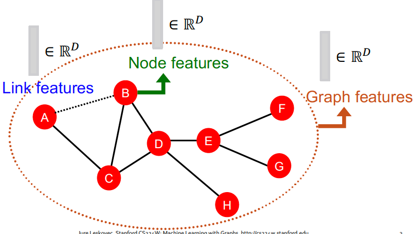
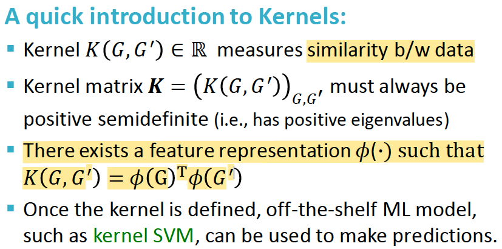
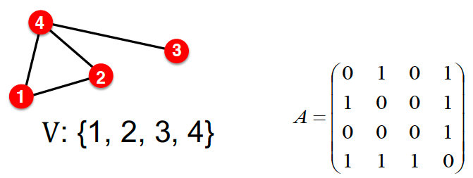
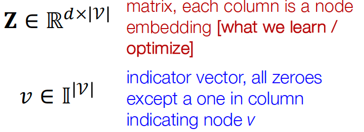
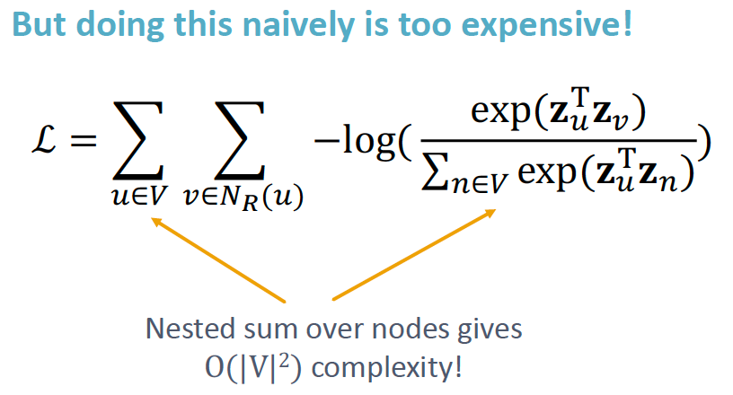

### 1.1 Traditional Feature-based Methods

Using effective features over graphs is the key to achieving good test performance.
Traditional ML pipeline uses hand-designed features.
In this lecture, we overview the traditional features for:
- Node-level prediction
- Link-level prediction
- Graph-level prediction

For simplicity, we focus on undirected graphs.

  
  

Goal: Make predictions for a set of objects

Design choices:
- Features: d-dimensional vectors
- Objects: Nodes, edges, sets of nodes, entire graphs
- Objective function: What task are we aiming to solve?

### Node-level Tasks and Features

Goal: Characterize the structure and position of a node in the network.

- **Node degree $k_v$**: number of edges the node has (treating all neighboring nodes equally)
  

    Node degree counts the neighboring nodes without capturing their importance.
- **Node centrality $c_v$**: takes the node importance in a graph into account. Different ways to model importance:
    - Eigenvector centrality
    - Betweenness centrality
    - Closeness centrality
    - etc....

  
  
  

- **Clustering Coefficient $e_v$**: measures how connected a node v's neighboring nodes are.
  

- Graphlets

    Observation: Clustering coefficient counts the #(triangles) in the ego-network.

    

    We can generalize the above by counting #(pre-specified subgraphs, i.e. graphlets).

    

    **Graphlet Degree Vector (GDV)**: counts #(graphlets) that a node touches.

    In comparison, Degree counts #(edges) that a node touches. Clustering coefficient counts #(triangles) that a node touches.

    

    Considering graphlets on 2 to 5 nodes we get:
    - Vector of 73 coordinates is a signature of a node that describes the topology of node's neighborhood.
    - Captures its interconnectivities out to a distance of 4 hops.

    Graphlet degree vector provides a measure of a **node's local network topology**:
    - Comparing vectors of two nodes provides a more detailed measure of local topological similarity than node degrees or clustering coefficient.

- Feature Summary
    - Importance-based features: capture the importance of a nodel in a graph. i.e. node degree, node centrality.
        
        Useful for predicting influential nodes in a graph. i.e. predicting celebrity users in a social network.
    - Structure-based features: capture topological properties of local neighborhood around a node.
        - node degree: number of neighboring nodes
        - clustering coefficient: how connected neighboring nodes are
        - graphlet degree vector: counts the occurrences of different graphlets
    
        Useful for predicting a particular role a node plays in a graph i.e. predicting protein functionality in a protein-protein interaction network.

### Link Prediction Task and Features

Goal: Predict new links based on existing links.

At test time, all node pairs (no existing links) are ranked and top K node pairs are predicted.

The key is to design features for a pair of nodes.

#### Methodology - Link Prediction via Proximity

1. For each pair of nodes (x,y) compute score c(x,y). i.e. c(x,y) could be the # of common neighbors of x and y.
2. Sort pairs (x,y) by the decreasing score c(x,y)
3. Predict top n pairs as new links
4. See which of these links actually appear in $G[t_1,t'_1]$

#### Link-level Features

- Distance-based features

    

    Limitation: does not capture how neighborhood overlaps.
- Local Neighborhood Overlap

    

    Limitation of local neighborhood features:
    
    - Metric is always 0 if the 2 nodes do not have any neighbors in common. However the 2 nodes may still potentially be connected in the future.
    - Global neighborhood overlap metrics resolve the limitation by considering the entire graph.

    

- Global neighborhood overlap: uses global graph structure to score two nodes

    **Katz index**: count the # of paths of all lengths between a given pair of nodes.

    How to compute #paths between two nodes: 
    
    - Use **powers of the graph adjacency matrix**
    - $A_{uv}$ specifies #paths of length 1 (direct neighborhood) between u and v.
    - $A^2_{uv}$ specifies #paths of length 2 (neighbor of neighbor) between u and v.
    - $A^l_{uv}$ specifies #paths of length l.

    
    
    

### Graph-Level Features and Graph Kernels

Goal: We want features that characterize the structure of an entire graph.

Kernel methods are widely-used for traditional ML for graph-level prediction.

Idea: Design kernels instead of feature vectors.

Graph Kernels: Measure similarity between two graphs.
- Graphlet Kernel [1]
- Weisfeiler-Lehman Kernel [2]
- Other kernels are also proposed in the literature (beyond the scope of this lecture)
    - Random-walk kernel
    - Shortest-path graph kernel
    - And many more…

Key Idea of Graph Kernel: Bag-of-* as the feature vector

- Graphlet Features

    Key idea: Count the number of different graphlets in a graph.

    Note: Definition of graphlets here is slightly different from node-level features.

    - Nodes in graphlets do not need to be connected (allows for isolated nodes)
    - The graphlets here are not rooted.

    
    

- Graphlet Kernel

    

    Limitations: Counting graphlets is expensive!
    - Counting size-k graphlets for a graph with size n by enumeration takes $n^k$.
    - This is unavoidable in the worst-case since subgraph isomorphism test (judging whether a graph is a subgraph of another graph) is NP-hard.
    - If a graph’s node degree is bounded by d, an $O(nd^{k-1})$ algorithm exists to count all the graphlets of size k.

- Weisfeiler-Lehman Kernel

    

    **Color Refinement**

    
    
    
    

    After color refinement, WL kernel counts number of nodes with a given color.
    

    The WL kernel value is computed by the inner product of the color count vectors:
    

    WL kernel is computationally efficient

    - The time complexity for color refinement at each step is linear in #(edges), since it involves aggregating neighboring colors.
    
    When computing a kernel value, only colors appeared in the two graphs need to be tracked.
    
    - Thus, #(colors) is at most the total number of nodes.
    
    Counting colors takes linear-time w.r.t. #(nodes). In total, time complexity is linear in #(edges).

- Graph-level feature summary

    

### 1.2 Node Embeddings

#### 1.2.1 Graph Representation Learning

Goal: Efficient task-independent feature learning for machine learning with graphs to alleviate the need to do feature engineering every single time.

Task: map nodes into an embedding space
- Similarity of embeddings between nodes indicates their similarity in the network.
- Encode network information
- Potentially used for many downstream predictions

#### 1.2.2 Encoder-Decoder Framework

Setup: Assume we have a graph G, where
- V is the vertex set
- A is the adjacency matrix (assume binary)
- For simplicity: no node features or extra info is used.

Goal: encode nodes so that similarity in the embedding space (i.e. dot product) approximates similarity in the graph.

1. Encoder maps from nodes to embeddings
2. Define a node similarity function (i.e., a measure of similarity in the original network)
3. Decoder DEC maps **from embeddings to the similarity score**
4. Optimize the parameters of the encoder so that similarity in the embedding space (i.e. dot product) approximates similarity in the graph.

    
    

- "Shallow" Encoding - Simplest encoding approach: encoder is just an embedding-lookup.
        
    ENC(v) = $z_v$ = $Z \cdot v$

    
    

    Each node is assigned a unique embedding vector. i.e. we directly optimize the embedding of each node.

    Many methods: DeepWalk, node2vec

Encoder + Decoder Framework Summary:
- Shallow encoder: embedding lookup
- Parameters to optimize: Z which contains node embeddings $z_u$ for all nodes u ∈ V
- We will cover deep encoders (GNNs) in Lecture 6
- Decoder: based on node similarity.
- Objective: maximize $z^T_vz_u$ for node pairs (u, v) that are similar

Key choice of methods - How to define node simiarlity?
- Should two nodes have a similar embedding if they...
    - are linked?
    - share neighbors?
    - have similar "structural roles"?
- We will learn node similarity definition that uses **random walks**, and how to optimize embeddings for such a similarity measure.

Note on Node Embeddings:
- This is **unsupervised/self-supervised** way of learning node embeddings
    - We are not utilizing node labels
    - We are not utilizing node features
    - The goal is to directly estimate a set of coordinates of a node so that some aspect of the network structure (captured by DEC) is preserved
- These embeddings are **task independent**
    - They are not trained for a specific task but can be used for any task.

#### 1.2.3 Random Walk Approaches

Notation

Random Walk: 

$z^T_vz_u$ is essentially the probability that u and v co-occur on a random walk over the graph

Random-Walk Embeddings: 

Why Random Walks?
- Expressivity: Flexible stochastic definition of node similarity that incorporates both local and higher-order neighborhood information.

    Idea: if random walk starting from node u visits v with high probability, u and v are similar (high-order multi-hop info)
- Efficiency: Do not need to consider all node pairs when training; only need to consider pairs that co-occur on random walks.

Feature Learning as Optimization:

- Intuition: Find embedding of nodes in d-dimensional space that preserves similarity
- Idea: Learn node embedding such that nearby nodes are close together in the network
- "Nearby nodes" is defined as the neighborhood of u obtained by some random walk strategy R: $N_R(u)$ 
- Given node u, we want to learn feature representations that predict the nodes in its random walk neighborhood $N_R(u)$

    

Random Walk Optimization:
1. Run **short fixed-length random walks** starting from each node u in the graph using
some random walk strategy R
2. For each node u, collect $N_R(u)$, the multiset of nodes visited on random walks starting from u.
3. Optimize embeddings such that: given node u, predict its neighbors $N_R(u)$

    
       
        
         

    The normalization term from the softmax is the culprit… can we approximate it?

    Solution: negative sampling

- **Negative Sampling**: allows for quick likelihood calculation.

     

    New formulation corresponds to using a logistic regression (sigmoid func.) to distinguish the target node 𝑣 from nodes $𝑛_𝑖$ sampled from background distribution $𝑃_𝑣$.

     

    More at [word2vec Explained: Deriving Mikolov et al.’s Negative-Sampling Word-Embedding Method](https://arxiv.org/pdf/1402.3722)

- Objective function optimization: 

     

    **Stochastic Gradient Descent (SGD)**: Instead of evaluating gradients over all examples, evaluate it for each individual training example.

       

- How should we randomly walk? 

    So far we have described how to optimize embeddings given a random walk strategy R. 
    What strategies should we useto run random walks?

    - Simplest idea: Just run fixed-length, unbiased random walks starting from each node. 
    - The issue is that such notion of similarity is too constrained

    How can we genralize this? -> node2vec

- Overview of **node2vec**

    
    More at [node2vec: Scalable Feature Learning for Networks](https://cs.stanford.edu/%7Ejure/pubs/node2vec-kdd16.pdf)

#### 1.2.4 Embedding Entire Graphs

### 1.3 Link Analysis: PageRank, Random Walks, and Embeddings