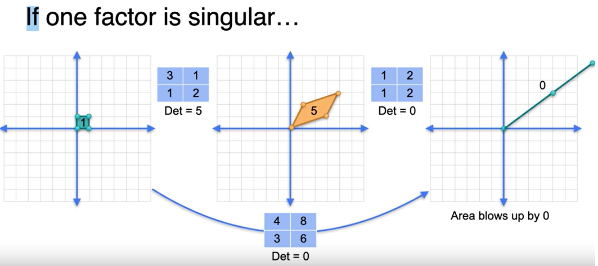
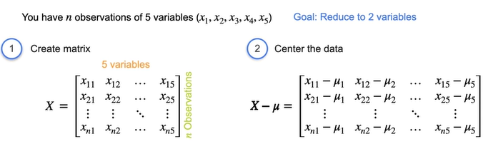

### 1. System of linear equations
#### 1.1 What: 
In a linear equation, only numbers or scalars can attach to variables, as compared to non-linear.  
#### 1.2 Types:
-  **non-singular** system: unique solution for unknown variables because of complete information
-   **singular** system: infinite or no solutions for unknown variables due to redundant or contradictory info.    

#### 1.3 Visualization:   
Linear equations can be represented as lines in the coordinate plane, and systems of linear equations can be represented as arrangements of lines. By plotting these lines, you can visualize their solutions and determine if the system is singular or non-singular.

#### 1.5 System of equations as Matrix  
Constants of a system of linear equations don't matter for singularity. Therefore, we can turn the constants to zero, and simplify a system of linear equations into a matrix.
#### 1.6 Linear dependence (singularity)
It refers to the situation where one equation or row in a system can be expressed as a linear combination of other equations or rows in the system. In other words, one equation or row carries the same information as another equation or row.  
Determining whether a system of equations or a matrix is linearly dependent or independent is important because it affects the solutions and properties of the system or matrix.
#### 1.7 Determinant
The determinant provides information about the matrix's invertibility, linear dependence or independence of its rows or columns, and the scaling factor of linear transformations. In simple terms, the determinant tells us whether a matrix is singular (has no inverse) or non-singular (has an inverse).  
If the determinant of a matrix is non-zero, then the matrix is said to be non-singular or invertible. In this case, the matrix has an inverse, and we can use it to solve systems of linear equations and perform other operations.  

**Determinant is only defined for square matrices.** That's because square matrices move vectors from 
\[n\]-dimensional space to 
\[n\]-dimensional space, so we can talk about volume changing. For nonsquare matrices, linear algebra has the concepts of null space and range.

### 2. Solving a system of linear equations

2.1 Matrix row reduction, also known as **Gaussian elimination**, is a process of manipulating the rows of a matrix to solve systems of linear equations and gain insights into the properties of the matrix.

2.2 Row operations that preserve singularity: row switching, multiplying a row by a non-zero scalar, addition of rows.

2.3 **Rank** of a Matrix: The rank of a matrix is a measure of how non-singular it is. It represents the maximum number of linearly independent rows or columns in the matrix. In other words, it tells us the **number of independent equations or variables in a system of linear equations** associated with the matrix.

2.4 To determine the rank of a matrix, we can use various methods, such as:

- **Row Echelon Form**: By performing row operations on the matrix and transforming it into its row echelon form, we can count the **number of non-zero rows (or pivots)**. This count corresponds to the rank of the matrix.

- **Reduced Row Echelon Form**: Similar to the row echelon form, we can transform the matrix into its reduced row echelon form and count the number of non-zero rows. This count also gives us the rank of the matrix.

- Determinants: The rank of a matrix is also related to the determinants of its submatrices. By calculating the determinants of all possible submatrices, we can determine the rank based on the number of non-zero determinants.

2.5 Properties of row echelon form

In the row echelon form, 
- each row has a pivot (leftmost non-zero entry in each row) and it is to the right of the pivot in the row above it.
- All entries below a pivot are zeros.
- pivots don't need to be 1 or have zeros above and below them.

e.g. 

|1|1|2|  
|0|-6|-7|  
|0|0|6|

In the reduced row echelon form, 
- the row echelon form conditions are met, and additional conditions are satisfied.
- The pivots are equal to 1.
- any number above each pivot has to be 0.
- The reduced row echelon form is unique for a given matrix.

e.g. 
$\begin{bmatrix}1 & 1 & 2 \\ 0 & -6 & -7 \\ 0 & 0 & 6\end{bmatrix}$

A matrix is NON-singular if and only if there are only ones and no zeros in the diagonal.

2.6 Guassian Elimination Algorithm

1) Create the augmented matrix
2) get the matrix into reduced row echelon form
3) complete back substitution
4) Stop if you encounter rows of 0s (infinite or no solutions)

### 3. Vector Algebra

3.1 Properties

Magnitude: Size or length. Vectors can have different norms, such as the L1-norm (taxicab distance) and the L2-norm (helicopter distance). The L1-norm is the sum of the absolute values of the vector's components, while the L2-norm is the square root of the sum of the squares of the components.

Direction: indicates the angle it makes with the horizontal axis.

There are row vectors and column vectors.

3.2 Vector Operations

1) The sum/difference of two vectors x and y of the same length is obtained by adding/subtracting their components component-wise.
2) Distance between Vectors:   
   - The difference between two vectors can be used to measure their distance or dissimilarity.
   - The L1 distance or norm is the sum of the absolute values of the components. ||x||₁ = |x₁| + |x₂| + ... + |xₙ|
   - The L2 distance or norm is the square root of the sum of the squares of the components. ||x||₂ = sqrt(x₁² + x₂² + ... + xₙ²)

3) Scalar multiplication
4) Vector/Matrix transpose: turning columns into rows.
5) Dot product: u · v = u₁v₁ + u₂v₂ + ... + uₙvₙ
- used to find the total cost of multiple items.
- Geometric interpretation - Relationship with the angle between vectors:  
  - u · v = ||u|| ||v|| cos(theta), where theta is the angle between the vectors.
  - If the dot product of two vectors is zero, it means that the vectors are **perpendicular/orthogonal** to each other.
  - The dot product of a vector with itself is equal to the square of the vector's L2 norm. u · u = ||u||^2.
  - positive dot product indicates the vectors are in the same general direction. Negative suggests that they are in opposite directions. 
  - Applications i.e. calculate similarity measures (cosine similarity in NLP), make predictions, and perform feature selection in various ML algorithms
1) Multiplying a matrix by a vector:
   - Given a matrix A with dimensions m x n and a vector x with dimensions n x 1, the product of A and x, denoted as Ax, is a vector with dimensions m x 1. Each element of the resulting vector is obtained by taking the dot product of each row of the matrix A with the vector x.
   - We can rewrite this system of equations using matrix notation as: Ax = b, Where: 
     - A is an m x n matrix, known as the coefficient matrix, which contains the coefficients of the variables in the system of equations.
     - x is an n x 1 column vector, which contains the unknown variables.
     - b is an m x 1 column vector, which contains the constants on the right-hand side of the equations.
  
### 4. Linear Transformation

4.1 A linear transformation is a structured way of sending each point in a plane to another point in the plane. Matrices can be seen as a representation of linear transformations.  
4.2 A linear transformation takes a vector as input and produces another vector as output. It follows two important properties:

- Linearity: preserves addition and scalar multiplication. 
  -  T(u + v) = T(u) + T(v) This means that if you have two vectors u and v, and a scalar c, the transformation of the sum of u and v is equal to the sum of the transformations of u and v.  
  - T(cu) = cT(u) Similarly, the transformation of c times u is equal to c times the transformation of u.

- Preservation of the origin: T(0) = 0. The transformation maps the origin (0,0) to the origin (0,0) in the output space.  
4.3 The matrix that corresponds to the linear transformation has columns based on where the fundamental vectors are sent. 

4.3 Matrix Multiplication
- Intuition: can be seen as combining linear transformations and also calculated as a series of dot products between rows and columns of the matrices., i.e.

- Dimension of resulting matrix: 
  - if the first matrix has dimensions m x n, the second matrix need to have dimensions n x p. The number of columns in the first matrix (n) must be equal to the number of rows in the second matrix (also n).
  - resulting matrix will have the number of rows from the 1st matrix (m) and the number of columns from 2nd matrix (p).

4.4 The identity matrix, when multiplied by any other matrix, gives the same matrix. The corresponding linear transformation of the identity matrix is to leave the plane intact.

4.4 Matrix inverse
- when multiplied with the original matrix, gives the identity matrix. The inverse matrix undoes the transformation performed by the original matrix. 
- To find the inverse matrix, you can solve a system of linear equations.

- **Non-singular matrix always have an inverse.** -> invertible matrix. Singular matrix is un-invertible and the determinant is 0.

4.5 Common matrix transformations
- Rotation: To rotate a vector in the plane by an angle of $\theta$ (radians), the matrix related to this transformation is given by:

$$M = \begin{bmatrix} \cos \theta & - \sin \theta \\ \sin \theta & \cos \theta \end{bmatrix} $$

- Stretching by a non-zero scalar: horizontal scaling by a and vertical scaling by b
$$M = \begin{bmatrix} a & 0 \\ 0 & b \end{bmatrix} $$

### 5. Determinant in-depth

#### 5.1 Singularity and rank of linear transformations

if the points obtained by multiplying the matrix by vectors cover the entire plane, the linear transformation is non-singular. If the points only cover a line or a point, the linear transformation is singular.

The rank of a linear transformation is the dimension of its image, which is the set of points it covers after multiplying it by a matrix.

#### 5.2 Determinant as an area

A non-singular matrix has a determinant different than 0, while a singular matrix has a determinant of 0. Negative determinants can occur when the order of the basis vectors is changed. 

#### 5.3 Determinant of a product

det(AB) = det(A) * det(B)

In the case of multiplying a singular matrix with a non-singular matrix, the resulting matrix is always singular.

#### 5.4 Determinant of inverses

det(A^-1) = 1 / det(A)  

This relationship holds true when the matrix A is invertible.

### 6. Eigenvalues and Eigenvectors

#### 6.1 What are bases

The general definition of a basis in linear algebra is a set of vectors that are **linearly independent** and span the entire vector space. In other words, a basis is a set of vectors that can be used to **represent any vector in the vector space through linear combinations**. The number of vectors in a basis is called the dimension of the vector space.

The **span** of a set of vectors is the set of points that can be reached by walking in the direction of these vectors in any combination.

A basis needs to be a minimal spanning set, meaning that each vector in the basis is necessary to span the space.

To determine if a set of vectors is linearly dependent or independent, you can follow these steps:

- Write the vectors as columns of a matrix. Let's call this matrix A.

- Set up the equation Ax = 0, where x is a column vector of coefficients.

- Solve the system of equations Ax = 0. This can be done by row reducing the augmented matrix A | 0.

- If the system has a non-trivial solution (i.e., a solution other than x = 0), then the vectors are linearly dependent. The non-zero solution represents a linear combination of the vectors that equals the zero vector.

- If the only solution to the system is x = 0, then the vectors are linearly independent. This means that no non-zero linear combination of the vectors equals the zero vector.

#### 6.2 Eigenbases

The eigenbasis consists of eigenvectors, which are vectors that remain in the same direction after a linear transformation, only getting scaled by a factor (eigenvalue).

The eigenbasis simplifies the representation by expressing the transformation as a combination of stretchings along the eigenvectors, which reduces the transformation to a diagonal matrix (eigenvalues along the diagonal).

Eigenvectors and eigenvalues come in pairs, and they can be used to simplify matrix computations. By using eigenvectors as a basis, matrix multiplication can be reduced to scalar multiplication
#### 6.3 Calculating Eigenvalues and Eigenvectors

1. Finding Eigenvalues: To find the eigenvalues of a matrix, we look at the characteristic polynomial, which is obtained by subtracting the identity matrix multiplied by the eigenvalue from the given matrix (A - λI). The roots of the characteristic polynomial are the eigenvalues.

2. Finding Eigenvectors: Once we have the eigenvalues, we can find the corresponding eigenvectors by solving the equation (A - λI)v = 0.

Eigenvalues and eigenvectors can be found only for square matrices. 

#### 6.4 On the number of eigenvectors

The number of eigenvectors associated with a matrix depends on the eigenvalues in the following ways:

1. Different eigenvalues: If all eigenvalues of a matrix are different, then we can always find the same number of distinct eigenvectors as the dimension of the matrix. 

2. Repeated eigenvalues: If the same eigenvalue is repeated multiple times, there can be any number of eigenvectors associated with it, ranging from one to the dimension of the matrix. The eigenvectors span a subspace of the corresponding dimension.
  

If the matrix A is singular, it will always have at least one eigenvalue equal to zero. This is because λ=0 is always a solution to det(A) = 0 and det(A-λI)=0. 

Infinite Solutions: It is possible to have infinitely many eigenvectors for a given eigenvalue. This means that there are multiple vectors that satisfy the equation (A - λI)v = 0. In terms of matrix A, this means:
- it is not diagonalizable: Diagonalization requires a matrix to have a full set of linearly independent eigenvectors.
- repeated eigenvalue

### 7. Application 1 - Dimension Reduction with PCA

#### 7.1 Intuition

PCA moves data points into a vector space with fewer dimensions, called a projection. The projection is achieved by multiplying the dataset by a vector and dividing by its norm.  

The **spread** of the projected points is important because more spread out points preserve more information from the original dataset. The goal of PCA is to find the projection that preserves the maximum spread of the data while reducing its dimensionality. 

#### 7.2 Variance and covariance

The mean is the average value of a dataset, while variance measures how spread out the data is.

**$Variance = (1/n) * Σ(x_i - μ)^2$**

Where:

- n is the number of data points in the dataset
- $x_i$ represents each individual data point
- μ is the mean of the dataset
- Σ denotes the summation of all the squared differences

Covariance, on the other hand, measures the **direction of the relationship between two variables**.

**$Cov(x,y) = (1/n) * Σ(x_i - μ_x)(y_i - μ_y)$**

A positive covariance indicates a positive relationship between the variables, meaning that as one variable increases, the other tends to increase as well, vice versa. 

A covariance of zero indicates no linear relationship between the variables.

#### 7.3 Covariance Matrix

The covariance matrix is a way to store the relationships between variables in a dataset. 

The matrix notation for computing the covariance matrix from data: 

Its applications:
- identifying highly correlated variables in feature selection.
- data preprocessing tasks such as data normalization and standardization.
- modeling data with a multivariate normal distribution

How is it different from correlation coefficient?

- Covariance can detect the presence of a relationship between variables, whether it is positive or negative. However, it **cannot distinguish between linear and non-linear relationships**. 
- Standardization: Correlation provides a standardized measure that is easier to interpret and compare, while covariance is not standardized and depends on the scale of the variables.
- The Pearson correlation coefficient measures the **linear relationship** between variables: **$r(X, Y) = Cov(X, Y) / (σ_x * σ_y)$**
- There are other types of correlation coefficients, such as Spearman's rank correlation coefficient, which measure the monotonic relationship between variables.

#### 7.4 Key components of Principal Component Analysis (PCA)

1. Centering the dataset: The dataset is centered by subtracting the mean of each variable from the corresponding data points. This ensures that the data is centered around the origin.

2. Calculating covariance matrix: The covariance matrix represents the relationships between the variables in the dataset.

3. Calculating eigenvalues and eigenvectors: The eigenvectors represent the directions in which the data varies the most, while the eigenvalues represent the magnitude of this variation.

4. Choosing the principal components: The eigenvector with the largest eigenvalue is chosen as the first principal component. Subsequent eigenvectors are chosen in order of decreasing eigenvalues.

5. Projection: The data is projected onto the chosen principal components, reducing the dimensionality of the dataset. This projection preserves the maximum amount of variance in the data.

#### 7.5 Math Formulation

#### 7.6 Explained Variance

When deciding how many components to use for the dimensionality reduction, one good criteria to consider is the explained variance.

The explained variance is measure of how much variation in a dataset can be attributed to each of the principal components (eigenvectors). In other words, it tells us how much of the total variance is “explained” by each component.

In practical terms, the explained variance of a principal component is the ratio between its associated eigenvalue and the sum of all the eigenvalues.

### 8. Application 2 - Discrete Dynamical Systems

#### 8.1 Overview

A **discrete dynamical system** describes a system where, as time goes by, the state changes according to some process. It can be represented by a transition matrix $P$, which indicates, given a particular state, what are the chances or probabilities of moving to each of the other states.

A **Markov matrix**, or **transition matrix**, is a square matrix with **non-negative values that add up to one in each column**, and used to represent the transition probabilities between different states of the system. 

Starting with an initial state $X_0$, the transition to the next state $X_1$ is a linear transformation defined by the transition matrix $P$: $X_1=PX_0$. That leads to $X_2=PX_1=P^2X_0$, $X_3=P^3X_0$, and so on. This implies that $X_t=PX_{t-1}$ for $t=0,1,2,3,\ldots$. In other words, we can keep multiplying by `P` to move from one state to the next. By taking the dot product between the transition matrix and a state vector, you can predict the probabilities of the system evolving to different states in the future.   

As you iterate this process, the state vectors tend to stabilize, and you reach an equilibrium state known as the **equilibrium vector**. This equilibrium vector represents the long-run probabilities of the system being in different states. It is essentially the eigenvector associated with the transition matrix, with 1 as the eigenvalue.

#### 8.2 Application

One application of discrete dynamical systems is to model browsing web pages. Web pages often contain links to other pages, so the dynamical system would model how a user goes from one page to another by hopping from link to link. It is useful to predict the probabilities in  $𝑋_𝑚$ when  𝑚 is large, and thus determine what pages a browser is more likely to visit after a long period of browsing the web. Eigenvalues and eigenvectors can help here significantly reducing the amount of calculations when we have enourmously large matrices.

As transition matrices are Markov matrices, they have a handy property - they always have an eigenvalue equal to 1. As you learned in the lectures, in the case of transition matrices, the eigenvector associated with the eigenvalue  1 will determine the state of the model in the long run , after evolving for a long period of time.

