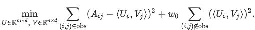

### Background: What and Why

Two kinds of recommendations are commonly used:

- Homepage recommendations

    Homepage recommendations are personalized to a user based on their known interests. Every user sees different recommendations.

    i.e. Google Play Apps homepage "Recommended for You" Section

- Related item recommendations

    Related items are recommendations similar to a particular item. In the Google Play apps example, users looking at a page for a math app may also see a panel of related apps, such as other math or science apps.

The purpose of a Recommendation System is to help users find compelling content in a large corpus and engage more with the application. 

For example, 40% of app installs on Google Play come from recommendations. 60% of watch time on YouTube comes from recommendations.

### Background: Terminology

- Items (also as documents): The entities a system recommends. For the Google Play store, the items are apps to install. For YouTube, the items are videos.
- Query (also known as context): The information a system uses to make recommendations. 
  
  Queries can be a combination of the following:
  - user information
    - the id of the user
    - items that users previously interacted with
  - additional context
    - time of day
    - the user's device

- Embedding: A mapping from a discrete set (in this case, the set of queries, or the set of items to recommend) to a vector space called the embedding space. 
  
  Many recommendation systems rely on learning an appropriate embedding representation of the queries and items.

### Common architecture Overview
One common architecture for recommendation systems consists of the following components:

**Candidate Generation &rarr; Scoring &rarr; Re-ranking**

1. Candidate generation: the system starts from a potentially huge corpus and generates a much smaller subset of candidates.

    For example, the candidate generator in YouTube reduces billions of videos down to hundreds or thousands. 
    
    The model needs to evaluate queries quickly given the enormous size of the corpus. A given model may provide multiple candidate generators, each nominating a different subset of candidates.

2. Scoring: another model scores and ranks the candidates in order to select the set of items (on the order of 10) to display to the user. 

    Since this model evaluates a relatively small subset of items, the system can use a more precise model relying on additional queries.

3. Re-ranking: the system must take into account additional constraints for the final ranking. 

    For example, the system removes items that the user explicitly disliked or boosts the score of fresher content. Re-ranking can also help ensure diversity, freshness, and fairness.

### First Stage: Candidate Generation

- Two common approaches:

| Type | Definition | Example |
|----| -----| -----|
|content-based filtering|	Uses **similarity between items** to recommend items similar to what the user likes.|	If user A watches two cute cat videos, then the system can recommend cute animal videos to that user.|
|collaborative filtering|	Uses **similarities between queries and items** simultaneously to provide recommendations.|	If user A is similar to user B, and user B likes video 1, then the system can recommend video 1 to user A (even if user A hasn’t seen any videos similar to video 1).|

- Embedding Space

    Both content-based and collaborative filtering map each item and each query (or context) to an embedding vector in a common embedding space $E=R^d$. 
    
    Typically, the embedding space is low-dimensional (that is, $d$
 is much smaller than the size of the corpus), and captures some latent structure of the item or query set. 
 
    Similar items, such as YouTube videos that are usually watched by the same user, end up close together in the embedding space. The notion of "closeness" is defined by a similarity measure.

- Similarity Measures

    A similarity measure is a function $s: E \times E$ &rarr; $R$ that takes a pair of embeddings and returns a scalar measuring their similarity. 

    Embeddings can be used for candidate generation as follows:

    Given a query embedding $q \in E$, the system looks for item embeddings $x \in E$ that are close to $q$, that is, embeddings with high similarity $s(q,x)$

    Common choices of similarity measure:
    - Cosine: $s(q,x)=cos(q,x)$, cosine of the angle between two vectors 
    - Dot product: 
      - $s(q,x)=\sum^d_{i=1}q_ix_i$, 
      - also given by $s(q,x)=||x||||q||cos(q,x)$, the cosine of the angle multiplied by the product of norms
      - if the embeddings are normalized, then dot-product and cosine coincide.
    - Euclidean distance: 
      - $s(q,x)=||q-x||=[\sum^d_{i=1}(q_i-x_i)^2]^{1/2}$
      - A smaller distance means higher similarity.
      - when the embeddings are normalized, the squared Euclidean distance coincides with dot-product (and cosine) up to a constant, since in that case $1/2||q-x||^2=1-||x||||q||cos(q,x)$
  
- Which similarity measure?

  Example: 

    
      

    - Item A has the highest norm, and is ranked higher according to the dot-product.
    - Item C has the smallest angle with the query, and is ranked first based on the cosin similarity
    - Item B is physically closest to the query so Euclidean distance favors it.

  Compared to the cosine, the **dot product similarity is sensitive to the norm of the embedding**. That is, the larger the norm of an embedding, the higher the similarity (for items with an acute angle) and the more likely the item is to be recommended. This can affect recommendations as follows:
    - **Items that appear very frequently** in the training set (for example, popular YouTube videos) tend to have embeddings with **large norms**. If capturing **popularity information** is desirable, then you should prefer dot product.
    - However, if you're not careful, the popular items may end up dominating the recommendations. In practice, you can use other variants of similarity measures that put less emphasis on the norm of the item. i.e. $s(q,x)=||x||^a||q||^acos(q,x)$ for some $a \in (0,1)$
    - Items that appear very rarely may not be updated frequently during training. Consequently, if they are initialized with a large norm, the system may recommend rare items over more relevant items. To avoid this problem, be careful about **embedding initialization**, and use **appropriate regularization**. 

#### Content-based Filtering
----

  Content-based filtering uses **item features** to recommend other items similar to what the user likes, based on their previous actions or explicit feedback.

  1. Pick a similarity metric
  2. Set up the system to score each candidate item according to this similarity metric
  3. Note that the recommendations are specific to this user, as the model did not use any information about other users.

- Advantages
  - The model **doesn't need any data about other users**, since the recommendations are specific to this user. This makes it easier to scale to a large number of users.
  - The model can **capture the specific interests of a user**, and can recommend niche items that very few other users are interested in.

- Disadvantages

  - Since the feature representation of the items are hand-engineered to some extent, this technique **requires a lot of domain knowledge**. Therefore, the model can only be as good as the **hand-engineered features**.
  - The model can only make recommendations based on existing interests of the user. In other words, the model has **limited ability to expand on the users' existing interests**.

#### Collaborative Filtering
----

To address some of the limitations of content-based filtering, collaborative filtering uses **similarities between users and items simultaneously** to provide recommendations. 

This allows for serendipitous recommendations; that is, collaborative filtering models can **recommend an item to user A based on the interests of a similar user B**. Furthermore, the **embeddings can be learned automatically**, without relying on hand-engineering of features.

- Movie recommendation example:

  Consider a movie recommendation system in which the training data consists of a **feedback matrix** in which:
  - Each row represents a user.
  - Each column represents an item (a movie).

  The feedback about movies falls into one of two categories:
  - Explicit — users specify how much they liked a particular movie by providing a numerical rating.
  - Implicit — if a user watches a movie, the system infers that the user is interested.

  To simplify, we will assume that the feedback matrix is binary; that is, a value of 1 indicates interest in the movie.

  When a user visits the homepage, the system should recommend movies based on both:
  - similarity to movies the user has liked in the past
  - movies that similar users liked

  For each (user, item) pair, we would like the dot product of the user embedding and the item embedding to be close to 1 when the user watched the movie, and to 0 otherwise.

   

  Note: We represented both items and users in the same embedding space. This may seem surprising. After all, users and items are two different entities. However, you can think of the embedding space as an abstract representation common to both items and users, in which we can measure similarity or relevance using a similarity metric.

In practice, the embeddings can be learned automatically, which is the power of collaborative filtering models.

The collaborative nature of this approach is apparent when the model learns the embeddings. Suppose the embedding vectors for the movies are fixed. Then, the model can learn an embedding vector for the users to best explain their preferences. Consequently, embeddings of users with similar preferences will be close together. 

Similarly, if the embeddings for the users are fixed, then we can learn movie embeddings to best explain the feedback matrix. As a result, embeddings of movies liked by similar users will be close in the embedding space.

#### Matrix Factorization (Technique for Collaborative Filtering)
----
  
Matrix factorization is a simple **embedding model**. **Given the feedback matrix $A \in R^{m \times n}$**, where $m$ is the number of users (or queries) and $n$ is the number of items, the model learns:
  - A user embedding matrix $U \in \reals^{m\times d}$, where row i is the embedding for user i.
  - An item embedding matrix $V \in \reals^{n\times d}$, where row j is the embedding for item j.

   

The embeddings are learned such that **the product $UV^T$ is a good approximation of the feedback matrix A**. Observe that the $(i,j)$ entry of $UV^T$ is simply the dot product $u_i\cdot v_i$ of the embeddings of user $i$ and item $j$, which you want to be close to $A_{ij}$.

Note: Matrix factorization typically gives a **more compact representation** than learning the full matrix. The full matrix has $O(nm)$ entries, while the embedding matrices $U, V$ have $O((n+m)d)$ entries, where the embedding dimension $d$ is typically much smaller than $m$ and $n$. As a result, matrix factorization finds latent structure in the data, assuming that observations lie close to a low-dimensional subspace. 

- Choosing the objective function

   

  - **Observed Only MF**: One intuitive objective function is the squared distance. To do this, minimize the sum of squared errors over all pairs of observed entries:

    

    In this objective function, you only sum over observed pairs (i, j), that is, over non-zero values in the feedback matrix. 
  
    However, only summing over values of one is not a good idea — a matrix of all ones will have a minimal loss and produce a model that can't make effective recommendations and that generalizes poorly.

  
  - Perhaps you could treat the unobserved values as zero, and sum over all entries in the matrix. This corresponds to minimizing the squared Frobenius distance between $A$ and its approximation $UV^T$: 

    You can solve this quadratic problem through **Singular Value Decomposition (SVD)** of the matrix. 
  
    However, SVD is not a great solution either, because in real applications, the matrix may be very sparse. The solution $UV^T$ (which corresponds to the model's approximation of the input matrix) will likely be close to zero, leading to poor generalization performance.

  - In contrast, **Weighted Matrix Factorization** decomposes the objective into the following two sums:
    - A sum over observed entries.
    - A sum over unobserved entries (treated as zeroes).

    

    $w_0$ is a hyperparameter that weights the two terms so that the objective is not dominated by one or the other. Tuning this hyperparameter is very important.

  - In practical applications, you also need to weight the observed pairs carefully. For example, frequent items (for example, extremely popular YouTube videos) or frequent queries (for example, heavy users) may dominate the objective function. You can correct for this effect by **weighting training examples to account for item frequency**. In other words, you can replace the objective function by: 

     

    where $w_{i,j}$ is a function of the frequency of query i and item j.

- Minimizing the objective function

  Common algorithms to minimize the objective function include:
  - **Stochastic gradient descent (SGD)** is a generic method to minimize loss functions.
  - **Weighted Alternating Least Squares (WALS)** is specialized to this particular objective.

  The objective is **quadratic in each** of the two matrices U and V (and hence convex in each matrix separately). However, the problem is **not jointly convex** (the interaction between U and V through products like $UV^T$ introduces non-convexity). Hence we cannot guarantee finding a global minimum using standard convex optimization techniques.

  &rarr; Due to the inidividual convexity (in U or V), **alternating minimization** (fix one and solve for the other) often works well in practice.
  
  WALS works by initializing the embeddings randomly, then alternating between:
  - Fixing U and solving for V
  - Fixing V and solving for U

  Each stage can be solved exactly (via solution of a linear system) and can be distributed. This technique is guaranteed to converge because each step is guaranteed to decrease the loss.

  | Optimization Technique | Loss Functions | Parallelized | Convergence | Unobserved Entries|
  |---| ----| ---| ---| ---|
  |SGD | Very flexible—can use other loss functions | Can be parallelized | Slower—does not converge as quickly | Harder to handle the unobserved entries (need to use **negative sampling** or gravity) |
  | WALS| Reliant on Loss Squares only | Can be parallelized | Converges faster than SGD | Easier to handle unobserved entries |

Collaborative filtering Pros & Cons:

- Advantages
  - **No domain knowledge necessary**: We don't need domain knowledge because the embeddings are automatically learned.
  - **Serendipity**: The model can help users discover new interests. In isolation, the ML system may not know the user is interested in a given item, but the model might still recommend it because similar users are interested in that item.
  - **Great starting point**: To some extent, the system needs only the feedback matrix to train a matrix factorization model. In particular, the system doesn't need contextual features. *In practice, this can be used as one of multiple candidate generators.*

- Disadvantages
  - **Cannot handle fresh items**: if an item is not seen during training, the system can't create an embedding for it and can't query the model with this item. This issue is often called the **cold-start problem**.

    Some workarounds:

     
  - **Hard to include side features for query/item**: Including available side features could improve the quality of the model. 
  
    Although it may not be easy to include side features in WALS, a generalization of WALS makes this possible.

    To generalize WALS, **augment the input matrix with features** by defining a block matrix $\bar{A}$, where:
    - Block (0,0) is the original feedback matrix $A$
    - Block (0,1) is a multi-hot encoding of the user features
    - Block (1, 0) is a multi-hot encoding of the item features

    Note: Block (1, 1) is typically left empty. If you apply matrix factorization to $\bar{A}$, then the system learns embeddings for side features, in addition to user and item embeddings.

#### Recommendation using Deep Neural Network Models
-----

