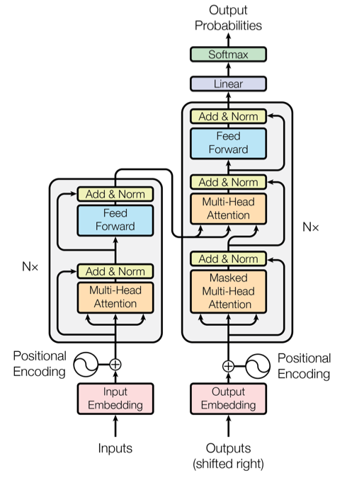
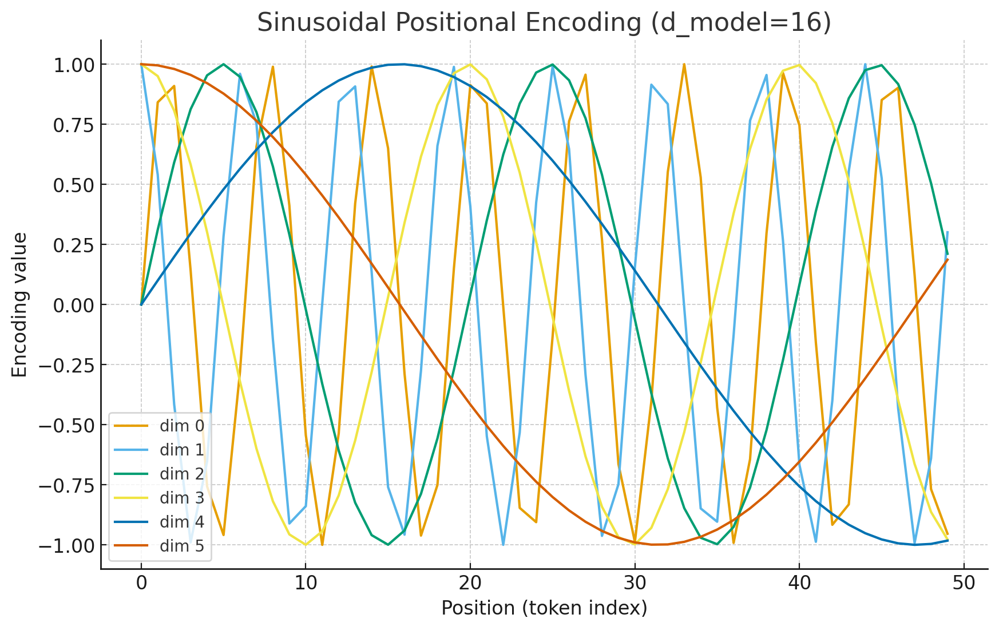
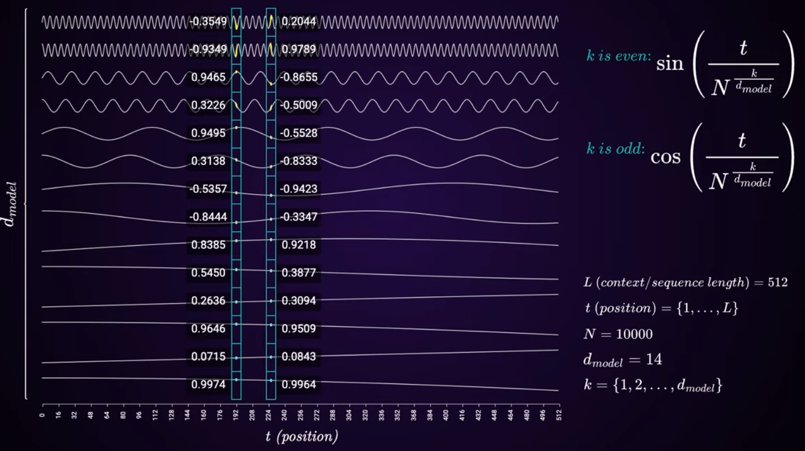
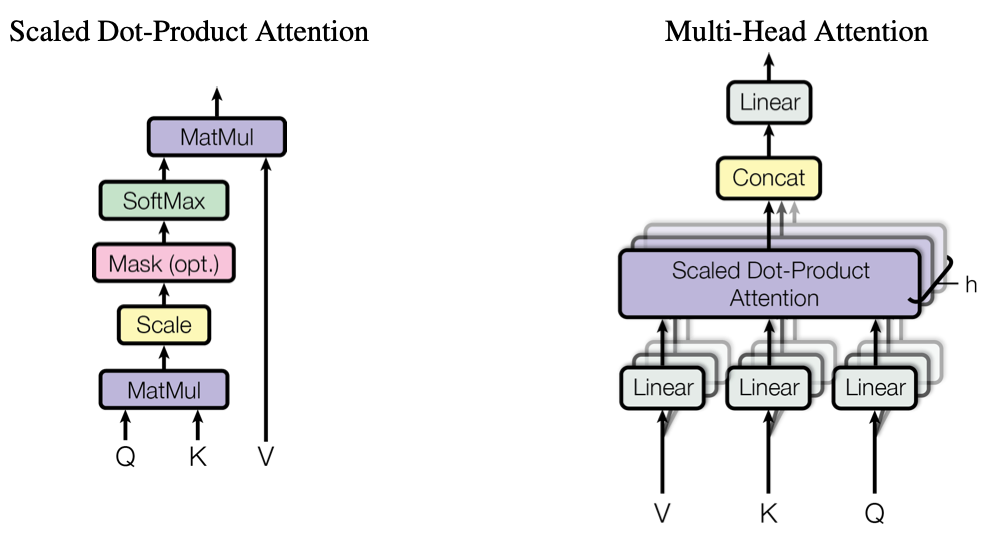
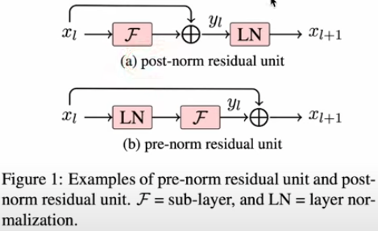
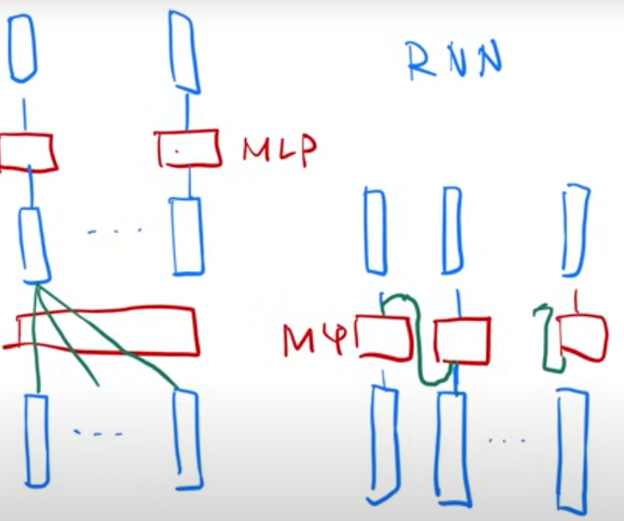

### 1. **High-Level Architecture**

The Transformer consists of two main parts:

* **Encoder** (on the left): Processes the input sequence and encodes it into contextual representations.
    - **Encoder stack**: A stack of N identical layers (commonly N=6).
* **Decoder** (on the right): Uses those encoded representations (plus attention over them) to generate the output sequence step by step.
    * **Decoder stack**: Another stack of N identical layers, also usually 6.

The original paper designed Transformers for **sequence-to-sequence tasks** like translation.

  

---

### 2. **Input Representation**

#### **Token Embeddings**: Each word/subword token is mapped to a dense vector.
- Embedding Dimension: [n, $d_{model}$] where n = sequence length, $d_{model}$ = embedding size (e.g., 512, 768, 1024).
#### **Positional Encoding**: 
- Why: the transformer model has a very limited capacity to keep track of word order:
    - attention connections are not directional, and
    - there are no other interactions between the columns
- Ensure differences between ABC and CBA
- Intuition: define a math function that given a position it will give us back a vector that will encode the position info kind of semantically in its structure.
- Sinusoidal or learned position embeddings are **added** to the input embeddings so the model knows the order of tokens. It requires the positional encoding output has the same dimension as [n, $d_{model}$]
- Transformer used a **Frequency-based positional encoding**: 
    
    - Frequency oscillation scheme: based on sine and cosine frequencies for these vectors, higher positions oscillate more frequently.
    - Overcome the limitation that the set of positions needs not to be decided ahead of time (compared to absolute position encoding)
  * At even dimension $2i$:

    $$
    PE(pos, 2i) = \sin\!\left(\tfrac{pos}{10000^{2i/d_{\text{model}}}}\right)
    $$
  * At odd dimension $2i+1$:

    $$
    PE(pos, 2i+1) = \cos\!\left(\tfrac{pos}{10000^{2i/d_{\text{model}}}}\right)
    $$

    where

    * $pos$: scalar (position index, e.g., 0 … $n-1$)
    * $i$: scalar (dimension index, 0 … $d_{\text{model}}-1$)

  * **Output dimension for each token**: A vector of length $d_{\text{model}}$.

- Why use **sine for even indices** and **cosine for odd indices**?

    * By alternating sine and cosine, each position is represented as a **unique combination** of waves at different frequencies. The model can easily infer **relative positions**:

        $$
        \sin(a+b), \cos(a+b) \quad \text{can be expressed using } \sin(a), \cos(a)
        $$

         → This lets the network learn relationships like “word B is 5 steps after word A”. It also gives the model the ability to generalize to sequence lengths beyond what it saw in training.

    - Here’s a plot of **sinusoidal positional encodings** with $d_{\text{model}} = 16$, showing the first 6 dimensions across 50 token positions.

          

    - When looking at vectors at different positions we can estimate their distances.

          

---

### 3. **Encoder Layer**

Each encoder block has two main sub-layers (multi-head self-attention and feed-forward) and other 3 important components.

#### 3.1. **Multi-Head Self-Attention**

    

- Input: Let the input to the encoder layer be $X \in \mathbb{R}^{n \times d_{\text{model}}}$, where $n$ is the sequence length and $d_{\text{model}}$ is the embedding dimension.

* For each head:
    - Linear projections: The model computes **queries (Q), keys (K), and values (V)** by applying **different learned linear transformations** to the same input $X$.

        $$
        Q = X W^Q, \quad K = X W^K, \quad V = X W^V
        $$

        * $W^Q, W^K, W^V \in \mathbb{R}^{d_{\text{model}} \times d_k}$ (or $d_v$ for V). 
        * These are separate learned weight matrices for each projection.
        - Note that Q and K must share $d_k$ to ensure the dot product works. V doesn't participate in the dot product, so it can live in its own dimensionality space $d_v$.

        Even though Q, K, and V come from the same input $X$, the linear projections make them **different representations**:

        * **Q** determines which tokens attend to which others.
        * **K** represents the content to be matched against Q.
        * **V** contains the actual information to be aggregated according to attention scores.
    * Scaled Dot-Product Attention:

        $$
        \text{Attention}(Q, K, V) = \text{softmax}\left(\frac{QK^\top}{\sqrt{d_k}}\right)V
        $$

        - Scaled by $1/\sqrt{d_k}$ for numerical stability: prevents the dot products from becoming too large and producing very small gradients during backprop. This slows learning and can make the network unstable.
        * Each token attends to all tokens in the sequence (including itself).

* Multiple "heads" allow the model to capture different types of relationships.

    - In practice, designers often set $d_k=d_v=d_{model}/h$ (where h=number of heads). Each head produces an **output of dimension $n \times d_v$**.

    - Concatenate all heads **horizontally**:

        $$
        \text{Concat}(\text{head}_1, \text{head}_2, \dots, \text{head}_h) \in \mathbb{R}^{n \times (h \cdot d_v)}
        $$

        * Here $n$ is sequence length.
        * The concatenated output now has dimension $n \times d_{\text{model}}$ if $d_v = d_{\text{model}} / h$.
    - Final linear projection

        After concatenation, apply a **learned output matrix** $W^O$:

        $$
        \text{MultiHead}(Q,K,V) = \text{Concat}(\text{head}_1, \dots, \text{head}_h) \, W^O
        $$

        * $W^O \in \mathbb{R}^{(h \cdot d_v) \times d_{\text{model}}}$
        * This projects back to the original model dimension $d_{\text{model}}$.

#### ✅ Full formula

$$
\text{MultiHead}(Q,K,V) = \text{Concat}(\text{head}_1, \dots, \text{head}_h) W^O
$$

with

$$
\text{head}_i = \text{Attention}(Q W_i^Q, K W_i^K, V W_i^V)
$$

---

#### 3.2. **Position-wise Feed-Forward Networks**

- Formula

    For each position in the sequence, the FFN applies **two linear transformations with a ReLU in between**:

    $$
    \text{FFN}(x) = \text{max}(0, x W_1 + b_1) W_2 + b_2
    $$

    Or equivalently:

    $$
    \text{FFN}(x) = \text{ReLU}(x W_1 + b_1) W_2 + b_2
    $$

    Where:

    * $x \in \mathbb{R}^{d_{\text{model}}}$ is the input vector for **one position**.
    * $W_1 \in \mathbb{R}^{d_{\text{model}} \times d_{\text{ff}}}$
    * $b_1 \in \mathbb{R}^{d_{\text{ff}}}$
    * $W_2 \in \mathbb{R}^{d_{\text{ff}} \times d_{\text{model}}}$
    * $b_2 \in \mathbb{R}^{d_{\text{model}}}$

- Input and output dimensions: both are **$n \times d_{\text{model}}$**, but it expands to a higher-dimensional space $d_{\text{ff}}$ in between for nonlinearity.

    If the **sequence length** is $n$, the input $X \in \mathbb{R}^{n \times d_{\text{model}}}$.

    * **First linear layer:** $X W_1 + b_1$ → shape $n \times d_{\text{ff}}$
    * **ReLU activation:** $n \times d_{\text{ff}}$
    * **Second linear layer:** → $n \times d_{\text{model}}$
    * Typically, $d_{\text{ff}} = 4 \times d_{\text{model}}$ in the original Transformer

- Positionwise Processing

    * FFN is applied **independently to each position** (hence “position-wise”). It does not mix information across positions—that’s handled by the attention layer.
    * **Same weights $W_1, W_2$ are used for all positions**

- Why Needed
    - Introduce nonlinearity (use of ReLu): 
        - Self-attention is essentially a **weighted sum** of values across the sequence. On its own, attention is **linear with respect to the input embeddings**, which limits the model’s ability to learn complex transformations.
        - FFN applies two linear layers with a ReLU in between, allowing the model to capture more complex feature interactions at each position. 
    
    - increase representational capacity: 
        - hidden dimension is typically larger than the model dimension. Expanding to a higher dimensional space allows the model to capture more complex patterns before projecting back to the original embedding size.

---

### 3.3. **Residual Connections** around each sub-layer

A residual connection (or skip connection) is when the input to a layer is added back to the layer’s output:

$$
y = x + F(x)
$$

- $x$: input to the sublayer
- $F(x)$: transformation by the sublayer (i.e. attention, feed-forward)
- $y$: Layer Output combines the new representation $F(x)$ with the original input $x$

#### 1. The problem: vanishing / exploding gradients

When training very deep networks (many stacked layers), the gradient of the loss with respect to early layer parameters is obtained by repeated multiplication of Jacobians (derivatives of each layer).

Formally, if you have $L$ layers:

$$
\frac{\partial \mathcal{L}}{\partial x_0} = \frac{\partial \mathcal{L}}{\partial x_L} \prod_{l=1}^L \frac{\partial x_l}{\partial x_{l-1}}
$$

* Each $\frac{\partial x_l}{\partial x_{l-1}}$ is a matrix (Jacobian).
* Multiplying them many times tends to either:

  * Shrink towards **zero** → *vanishing gradient*
  * Blow up towards **infinity** → *exploding gradient*

Result:

* Early layers learn **extremely slowly** (vanishing) or
* Training becomes unstable (exploding).

This is why naive very-deep MLPs were almost impossible to train before ResNets/normalization.

#### 2. How residual connections help

A residual connection rewrites the layer transformation:

$$
x_{l+1} = x_l + F(x_l)
$$

Instead of:

$$
x_{l+1} = F(x_l)
$$

Take the derivative of $x_{l+1}$ w\.r.t. $x_l$:

$$
\frac{\partial x_{l+1}}{\partial x_l} = I + \frac{\partial F(x_l)}{\partial x_l}
$$

* The **identity matrix $I$** guarantees that some gradient always flows directly back.
* Even if $\frac{\partial F}{\partial x_l}$ is small (vanishing) or unstable, the identity path prevents total collapse.
* This makes optimization much more stable.

Intuition:

* Without residual: each layer must learn a *complete transformation* from scratch.
* With residual: each layer only needs to learn a *small refinement* $F(x_l)$.
* The base representation flows unchanged through the network, so the model can start as an identity function and gradually improve.

#### 3. Why is it needed in Transformers

* Enable deeper models: 
    - Transformers can have **dozens or hundreds of layers**. 
    - Residual connections allow training hundreds of layers without collapse.
* Helps gradient flow ans Stablize training: 
    - With residuals, the gradient can flow directly through the identity path (y=x), bypassing nonlinear transformations. This makes training much more stable. 
- Preserve original information
    - Self-attention and FFN layers may distort or lose some information.
    - The residual ensures that the original representation is preserved and only modified incrementally.

### 3.4. **Layer Normalization** 

**LayerNorm** normalizes the activations **within a single sample** (across the feature dimension), instead of across the batch.

For an input vector $x \in \mathbb{R}^{d}$:

$$
\text{LayerNorm}(x) = \frac{x - \mu}{\sqrt{\sigma^2 + \epsilon}} \cdot \gamma + \beta
$$

Where:

* $\mu = \frac{1}{d}\sum_{i=1}^{d} x_i$ (mean over features for one token)
* $\sigma^2 = \frac{1}{d}\sum_{i=1}^{d} (x_i - \mu)^2$ (variance over features for one token)
* $\gamma, \beta \in \mathbb{R}^{d}$ are learnable scale and shift parameters
* Normalization is applied **independently for each token**

So for input of shape `(batch_size, seq_len, d_model)`, LayerNorm normalizes across `d_model` for each `(batch, position)` pair.

#### 1. LayerNorm vs BatchNorm

- What is BatchNorm (Batch Normalization)

    - computes statistics (mean, variance) **across the batch** and optionally across sequence length.
    * Works well in CNNs where batch sizes are large and features are spatially consistent.
    * But in Transformers, **batch sizes can be small** (especially in NLP with long sequences, or in autoregressive generation where batch = 1 at inference).
    * Relying on batch statistics in these cases is unstable.

- **LayerNorm advantages in Transformers**

    1. **Independent of batch size**

        * LayerNorm computes mean/variance **per token**, not across the batch.
        * This makes it stable even when batch size = 1 (important for inference/generation).

    2. **Respects sequence structure**

        * Tokens can have very different distributions depending on context.
        * Normalizing across features per token makes each representation well-conditioned without mixing information across tokens.

    3. **Stability in training deep architectures**

        * Transformers stack many layers. LayerNorm helps keep activations in a stable range, improving gradient flow (similar motivation as BatchNorm in CNNs, but applied differently).

    &rarr; Used instead of BatchNorm because it’s **batch-size agnostic**, works with **variable sequence lengths**, and is **more stable** for NLP/sequence modeling tasks.

#### 2. Placement of Normalization: Pre-norm vs Post-norm

  

In the **original Transformer (Vaswani et al., 2017)**, LayerNorm is applied **after each sub-layer (attention/FFN) with residual connections**.

$$
x_{l+1} = \text{LayerNorm}(x_l + \text{Sublayer}(x_l))
$$

* Sublayer = multi-head attention or feed-forward
* LayerNorm is applied **after** the residual connection

Modern architectures sometimes move it **before** the sublayer (“Pre-LN Transformers”), which improves training stability further.

$$
x_{l+1} = x_l + \text{Sublayer}(\text{LayerNorm}(x_l))
$$

* LayerNorm normalizes the input **before** passing it into attention/FFN.
* The residual connection is now a **clean identity path** — gradients can flow directly backward without being distorted by normalization.

**Problem with post-norm**:

* In very **deep Transformers**, gradients have to flow through many LayerNorms.
* The residual connections don’t act as clean “identity shortcuts” because they’re always followed by normalization.
* This makes optimization harder: deep post-norm Transformers often suffer from **vanishing/exploding gradients** and require careful warm-up schedules.

- Tradeoff: Post-norm tends to achieve slightly better *final* performance when training is stable (since normalization happens after adding new info).

**Why pre-norm is better**

1. **Stable training in deep networks**

    * Pre-norm allows Transformers to scale to **hundreds of layers** without the training instability seen in post-norm.

2. **Better gradient flow**

    * Residual connections act as true identity shortcuts, improving gradient propagation.

3. **Easier optimization**

    * Pre-norm models train reliably with larger learning rates and **without the need for elaborate warm-up schedules**.

---

### 3.5. **Dropout** for regularization.

#### 1. Where dropout is applied in the Transformer

---

## 4. **Decoder Layer**

Each decoder block has three main sub-layers:

### 4.1. **Masked Multi-Head Self-Attention**

   * Similar to encoder self-attention, but prevents attending to "future" tokens (causal masking).

### 4.2. **Cross-Attention (Encoder–Decoder Attention)**

   * Queries come from the decoder’s previous layer.
   * Keys and values come from the encoder’s output.
   * Lets the decoder look at the encoder's sequence.

### 4.3. **Feed-Forward Network (FFN)**

   * Same as in the encoder.

With residual connections, normalization, and dropout as well.

---

## 5. **Output Layer**

* The decoder’s final output vectors are passed through a **linear layer + softmax** to generate a probability distribution over the vocabulary for the next token.

---

### **Key Innovations**

* **Self-Attention**: Enables modeling of long-range dependencies without recurrence.
* **Multi-Headed Attention**: Captures different types of relationships in parallel.
* **Parallelization**: Unlike RNNs, all tokens are processed simultaneously.
* **Scalability**: Much more efficient for large datasets and long sequences.

---

How Transformer and RNN use the positional/sequential info differently:

Tranformer aggregates the info based on all positions globally through the attention layer, and then pass these position-weighted value vectors through a MLP for each position to project to semantic space.

RNN uses the MLP output from prior positions as inputs to the MLP layer of current position.  

  