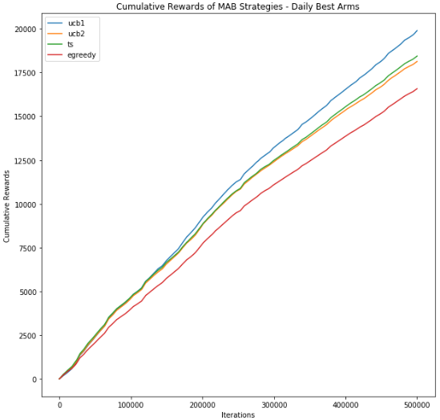
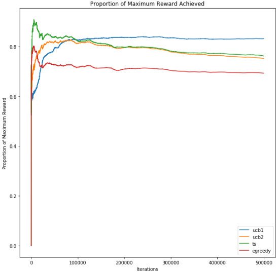
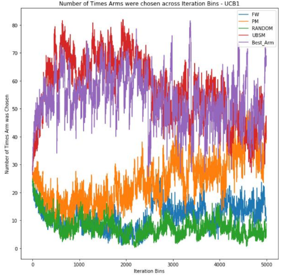
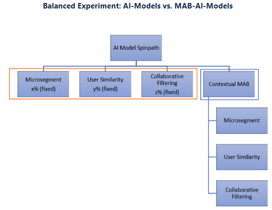

### Stage 1: Use MAB to optimzie the spinpath allocation

### 1. Business Problem

The aim of ‘Next Best Action’ is to provide or recommend to participants who visit the NetBenefits website a set of actions (ranked in order of likelihood to get clicked) that will enable them to plan a life they envision and take the next steps to execute on that plan. Currently, there are 4 methods or spinpaths to show the actions to the participants: 
- Random selection of the action cards
- Financial wellness heuristics
- User similarity model
- Micro-segmentation of participants model

These 4 methods are allocated to participants randomly but manually at regular intervals and the impact or click-through-rates of the methods are assessed through experiments. **Based on the performance of the spinpaths, the percentages are reallocated manually and the process repeats**. 

#### Business Objective

  To reduce manual intervention, we require a process that will **automatically modify the percentage allocations as and when the spinpaths outperform each other**. This is to identify the best Spinpath for a particular timeframe, but also identify other spinpaths that could potentially be the best at a future time.

#### Business Constraints / Requirements

- We needed to cap the floor and ceiling of each spinpath. i.e. ensuring that at least 3% of traffic receive randomized treatment to establish the baseline. 
- There can be clear performance ladder among spinpaths most of the time. Like random and business rule almost always underperform model spinpaths.

### 2. Choosing the right method: Why MAB?

Unlike static A/B tests, MAB can **dynamically shifts traffic** toward better-performing spinpaths and **reduce the opportunity cost** of waiting until the end of an experiment.

MAB can **handle non-stationary changes** over time, i.e. due to seasonality, market changes, model failure, participant preference shifted and this led to disproportional impact on all the spinpaths. Bandit algorithms can adapt to shifting distributions.

Because of the relatively stable spinpath performance ladder, we chose **Thompson Sampling** where we could incorporate empirical knowledge. **Priors in its beta distribution reflect the CTR ladder**. It can reduce unnecessary exploration on clearly weak arms while still allow surprises.

### 3. Frame the Problem as ML Task

- ML Objective

    Maximize the cumulative rewards (clicks) by optimally allocating user traffic among all the spinpaths while balancing exploration (trying underused spinpaths) and exploitation (using the best-performing spinpath at present).

- System Inputs
    - Context：User features - age, balance, tenure, etc.
    - Constraints: floors/ ceilings for allocation
    - Web sessions with click rewards from different spinpaths (arms) 

- System Outputs

    Raw:
    - Chosen arm: the spinpath chosen for this session
    - Propensity: prob that this arm was selsected under the current policy
  
    Batch output:

    - Updated posteriors for each arm (stored alpha, beta)
    - Allocation policy: proportion of users to route to each spinpath in real time
    - Spinpath performance estimates: expecetd CTR or reward distribution

### 4. Data Processing

- Create User Neighborhoods

    based on internal customer segmentations + age / balance -> total dimension over 1000
- Data aggregation

    Raw data for 6 months at the impression level had trilions of records, not efficient to run simulation. Hence we aggregated the data based on treatment group, content, time window (3 options: month, week, day), and user neighborhoods (~1000), and defined the reward function accordingly.

    &rarr; reduced the data size to up to 30M records

- How data was leveraged for MAB

    In contextual MAB, for running simulations offline, we need the following historical data:
    - **Reward function** – click (1 or 0) as **binary** reward. For this, we define the reward as [if num_clicks > 0, 1, else 0] and call it 'CTR Flag'. Since we are not using impression level data, the next best binary reward function is **whether there is a click or not for each record in the aggregated data**
    - **Contexts** – user features that define the neighborhood
    - **Arms** – Treatment group (User Similarity, Microsegment, Random, Financial Wellness)

    Given historical data, we synthetically generate random samples that serve as scenarios in MAB based on the performance of the arms under specific user neighborhood:
    - For each of the MAB strategies, based on reward function calculated at each iteration, new samples favoring arms with rewards are generated and iterated
    - For each of the MAB strategies, 500,000 iterations were performed for each combination of contexts to see the effects of the strategies on a long-term basis

### 5. Model Development

#### Running MAB Simulations Offline

For each of the 1000 neighborhoods we run simulations of the 4 MAB strategies - Epsilon Greedy, UCB1, UCB2 and Thompson sampling. For each strategy and each context combination, 
- Multiple simulations were run using different arm pull frequency (monthly, weekly, daily) and different strategy params, each simulation having 500,000 iterations. 
- Each arm pull is iterated 500,000/N times, where N is the number of arm pulls (vary based on monthly, weekly, daily cadence).
- The below data was recorded for each iteration:
    - Chosen arm
    - 1 or 0 click reward
    - Cumulative rewards till that iteration 
    - The maximum cumulative reward obtainable by always playing the best arm
    - Proportion of maximum reward obtained so far
    - For epsilon greedy, we also record epsilon, and for UCB2, we record alpha
    - For Thompson sampling, beta distribution parameters a and b are recorded at every iteration
- The iterations (1 to 500k) are binned into 5000 bins, each with 100 iterations sequentially for better analysis of chosen arms - we call these 'Iteration Bins'

- We want to identify from our analysis which strategy works best for which neighborhood. When we say 'works best', we refer to getting more rewards in smaller number of iterations. This is useful for having minimal loss or 'regret' and also adapting quickly to more rewarding arms in case the best arm changes over time.

#### Simulation Evaluation

1. In reality the policy could update the best arm at multiple frequencies (daily, weekly, monthly, etc.). What would be the right update cadence and which policy works the best?

    - Measure: Cumulative rewards over iterations

            

    - when we change the best arm infrequently, MAB strategies struggle with shifting to the new best arm quickly. The likelihood of choosing an arm completely depends on its past performance in the simulation so it would take a very long time for another arm to take over in these cases. 
    - when we look at the daily change plot, since for each day the number of iterations are not that long, the strategies are able to adapt better to a future changing arm and accumulate more rewards in the end. 
    - Since UCB1 is better at this adaptation, it emerges as the best strategy overall. 

2. How quickly do we reach the maximum reward possible for each MAB strategy? 
   
     - Cumulative rewards over iterations
     - Proportion of maximum reward obtained over iterations
  
          

    This gives a clearer picture as to why UCB1 is the best strategy for daily changing rewards. It is stable across all 87 daily arm pulls but what should be noted is its poor performance during the beginning of the simulation - it took ~150k iterations or 26 days to become the most stable strategy.

3. How does the chosen arm change as we go forward in the iterations for each MAB strategy? 
     - Number of times each arm was pulled over iterations

       

    In the simulation, we took the binary CTR flag for a day and not any rolling average (like over last 3 or 5 days) as the reward. This setting allows different arms to be the best on the daily basis and expose the simulation to sudden changes in the rewards.

    All the strategies (except UCB1) start off initially by identifying the best arm but cannot adapt quickly to changing best arms.

4. Which MAB strategy works the best for which neighborhood?

    - We see that UCB1 emerges as the best strategy in most cases. 
    - However, Thompson Sampling favors certain contexts:

        **When there's a clear and consistent best-performing treatment group and not too much change in best arm** at a daily level for specific neighborhoods, TS tend to perform the best. 

    - Epsilon Greedy is consistently the worst performer across most contexts. 
  
- Impact of policy parameters over iterations
  - Epsilon in the Epsilon-Greedy Strategy:

    Smaller epsilon denotes lesser exploration and more exploitation of the best arm. A lower epsilon value starting off slow but ultimately becoming the best simulation within sufficient (~70k) iterations.

  - alpha in UCB2 Strategy

    Lower alphas are able to more quickly reach better rewards. This is because alpha is proportional to tau, which is inversely proportional to the bonus of each arm. Since alpha is lower, it could indicate a higher chance of the best arm being picked.

  - Beta Distributions over Iterations in Thompson Sampling

    - Beta distribution across arms
  
        Though all arms start off with alpha = beta = 1, we can see the winning spinpath having a larger and more right-skewed distribution than the rest. 

#### Choice of MAB Algorithms

- Thompson Sampling and Epsilon Greedy are faster in exploiting the best arm. UCB1 and UCB2 have more balancing between exploration and exploitation therefore adapt to changing best arms better.
- For above reason, when best arms do not change much, Thompson Sampling and UCB2 are the more successful strategies. TS is the top winner according to cumulative rewards obtained as of 500k iterations.
- When the best arms do change often such as the “daily best arm” scenario, UCB1 is the winner due to its excellence in adaption. However, UCB1 takes longer time to reach good performance. In the “daily best arm” scenario UCB1 took 150K iterations/26 days (of total 87 days) to reach the winner position.

### 6. Deployment and Serving

#### Differences in Online Serving

|      | Offline Simulation        | Online Serving | 
| ----------- | ----------- | ------------------------------- |
| choose strategy |    Iterate through the different MAB strategies to see which performs the best   | Choose UCB1 and TS as two competitors for online testing | 
| choose arm |    An arm is chosen at the start of each iteration based on rewards accumulated till that iteration    | An arm is chosen for the participant the instant they create the impression on the NetBenefits page based on spinpath allocation. |
|  reward function | Binary click flags are sampled from bernoulli distribution as the reward at the aggregated level | Actual clicks recorded during the visit |
| input time window | Used all historical days' data | Rolling 90-day's input data |

&rarr; MAB performs on accumulated rewards.We expect that when MAB is set up to consume only recent days’ inputs instead, Thompson Sampling could come back to a winner position due to its fast exploitation.

#### Online Evaluation: Ran a Balanced A/B test design to prove the success of MAB

MAB's success in comparison to static spinpath allocation is best measured by **balanced A/B test design**, illustrated by the example below (Graph below). 
- A: Static spinpath allocation where X, Y and Z are pre-determined percentages for each treatment group.
- B: Contextual MAB where each treatment group's proportions are dynamically determined by daily MAB runs. 

      

Outcome: overall CTR using MAB to dynamically allocate treatments doubled.

#### Evolution on Context Creation

We later compared our code base with the open-source library called MABWiser developed by anohter AI group in our firm and decided to adopt the context creation methods in their work.

That library supports multiple neighborhood models (K Nearest Neighbor, Radius, or Cluster) to create context. Context is assigned as feedback data flow in. Context model also gets rebuilt/updated as new feedback data come in.

Major limitation is that reporting by context is not possible.

#### Leading to Stage 2 employing CMAB directly to predict cards themselves

