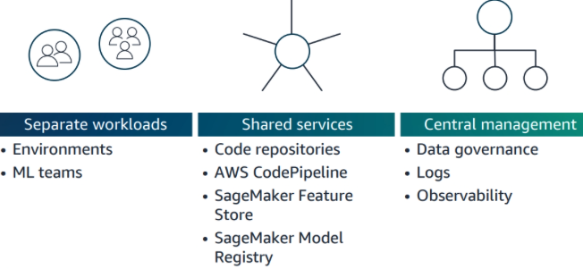
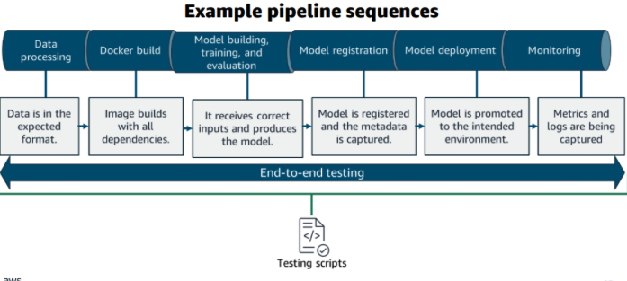
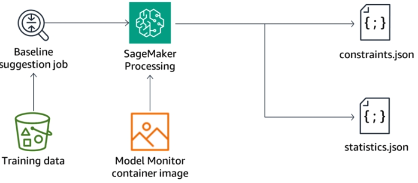

### 1. Intro to MLOps

 

MLOps—a combination of Machine Learning and Operations—combines people, technology, and processes to deliver collaborative ML solutions. MLOps requires the integration of software development, operations, data engineering, and data science. You need the right people, with the right skills, following the same standardized processes to successfully operate machine learning at scale. 

In this module, you will learn how to:
- Define MLOps.
- Compare and contrast DevOps and MLOps.
- People: List the roles that need to collaborate for MLOps.
- Processes: 
    - Describe the machine learning lifecycle and how it relates to MLOps.
    - Describe the phases in the MLOps maturity model.
    - Define ML governance. 

- Technology: Describe the importance of ML training and deployment pipelines. 

ML Lifecycle:

 

DevOps vs MLOps

 

Associated roles along ML lifecycle:

  

- MLOps engineers standardize ML systems development (dev) and ML systems deployment (ops) for continuous delivery of high-performing production ML models.

#### MLOps Technology Overview

Implementation considertaions for ML:
- Consistency – Using the benefits of containerization can minimize variance between environments, for example. 
- Flexibility – Data scientists have the flexibility to choose different frameworks and experiment with their ML model.
- Reproducibility – You can trace back and reproduce how the model was crested. 
- Scalability – You can test ML models on a single CPU, and then scale massively according to demand.
- Auditability – It is a requirement to capture logs, model drift, and dependencies of artifacts.
- Explainability – You can explain how the ML model arrived at the prediction, providing transparency to guard against bias.

Two main technology components:

   

Why ML Governance?

 

Understanding MLOps maturity levels:

  

### 2. Experimentation Environments in SageMaker

Amazon SageMaker uses Docker containers when performing the steps of the ML lifecycle:
- Running scripts to preprocess training and testing data
- Running training jobs to create and test models
- Deploying models to perform inference

Your level of engagement with containers depends on your use case. 
- SageMaker-managed container images – SageMaker provides prebuilt containers for common ML frameworks. These images are the easiest way to train models in SageMaker: 
    - You can use the built-in training algorithms included in these containers.
    - You can use the ML Framework, settings, libraries and dependencies included in these container images, but provide your own custom training algorithms. This approach is referenced as Bring your own Script (BYOS) or script mode.
- Customer-managed container images – If the prebuilt containers do not meet your requirements, SageMaker supports the following:
    - To meet requirements for additional dependencies or libraries, you can extend the prebuilt containers. SageMaker provides toolkits to make this easier. 
    - You can build custom containers (BYOC) if you need more control over the algorithm, framework, dependencies, or settings. 
    - You can bring your own model (BYOM), either locally trained or trained outside of SageMaker, by adapting the model container to work with SageMaker. 
    - Some industries might require BYOC or BYOM to meet regulatory and auditing requirements.

Model Training Container:
- **code**: The SageMaker containers library places the scripts that the container will run in the SAGEMAKER_SUBMIT_DIRECTORY, /opt/ml/code/. You store the custom decision tree algorithm, ‘train.py,’ in this directory
- **input**: When you run a model training job, the SageMaker container uses SM_INPUT_DIR, which defaults to the /opt/ml/input/ directory. The JSON files that configure the hyperparameters for the algorithm and the resources used for distributed training are stored in the opt/ml/input/config directory. The input directory also contains a subdirectory within the /opt/ml/input/data directory for each channel of training data stored in Amazon S3. 
- **checkpoints**: If you use checkpointing, Amazon SageMaker saves checkpoints locally in the checkpoint_local_path, /opt/ml/checkpoints, and synchs them to the checkpoint_s3_uri.
- **outputs**: The outputs of a training job are sent from /opt/ml/output/data to the output data uri in S3 as output.tar.gz
- **model**: The script must write the model generated by your algorithm to SM_MODEL_DIR, which defaults to /opt/ml/model/. When training is finished, the final model artifact in the /opt/ml/model folder is written to the output data uri in S3 as model.tar.gz.
- **…/WORKDIR/**: Training job operations that are distributed across multiple containers use the WORKDIR/.

   

Model Inference Container:

  

Package training code and inference code in the same container:

 

You must also add the code required to perform inference using a web application. You place the following files in the /opt/ml/code directory:
- serve.py – the program started when the container is created for hosting. It launches the gunicorn server which runs multiple instances of the web application defined in predictor.py.
- predictor.py – the program that implements the web server and the decision tree predictions for this app.
- webserver.conf – the configuration file for the front end.
- wrapper.py – is a small wrapper used to invoke the web application.

### 3. Repeatable MLOps

- Workflow orchestration Tools
    - [Amazon SageMaker Pipelines](https://github.com/aws/amazon-sagemaker-examples/blob/09f6fad6de75a4520f6f71d661f4b7a8139ce736/sagemaker-pipelines/tabular/abalone_build_train_deploy/sagemaker-pipelines-preprocess-train-evaluate-batch-transform.ipynb)
    - AWS Step Functions: serverless way to orchestrate pipelines, including ML-based ones. 
    - Amazon Managed Workflows for Apache Airflow (Amazon MWAA): using Directed Acyclic Graphs (DAGs) written in Python.

          

    - third-party tools: 
        - MLflow: open-source platform to manage the ML lifecycle, including experimentation, reproducibility, deployment, and a central model registry
        - Kubernetes / Kuberflow
        - Jenkins

- Model Deployment Architecture

    Sample real-time hosting inference architecture:

     

    - An API gateway provides an endpoint for RESTful API calls. The API gateway secures, monitors, and manages traffic between the host and client. For example, when using an identity and access management system or a token system, these credentials can be required and authenticated with the API gateway. 
    - Requests are routed to a load balancer, which distributes traffic between multiple servers. 
    - In this example, each server hosts both a web server application and an inference engine. The web server consumes and responds to the API requests. The web server is a client of the inference engine.

    In AWS we can create SageMaker endpoints for real-time inference.  

      

- Inference Options

     

    - Batch transform provides offline inference for large datasets. Batch transform is helpful for preprocessing datasets or gaining inference from large datasets. It also is useful when running inference if a persistent endpoint is not required, or associating input records with inference to support interpretation of results.
    - Real-time inference is ideal for inference workloads where you have real-time, interactive, low latency requirements. You can deploy your model to SageMaker hosting services and get an endpoint that can be used for inference. These endpoints are fully managed and support autoscaling.
    - Serverless inference can be used to serve model inference requests in real time without directly provisioning compute instances or configuring scaling policies to handle traffic variations.
    - Asynchronous inference queues incoming requests for asynchronous processing. This option is ideal for requests with large payload sizes (up to 1 GB), long processing times (up to 1 hour), and near-real-time latency requirements. 

- Best practices for deploying models
    - Use endpoints and model variants in testing
    - modify endpoints with minimal downtime
    - Update endpoint configuration before changing resources
    - Use batch transforms to get inferences on entire datasets

- Componentes of a repeatable MLOps framework

      

    - Version control – Git and Bitbucket are supported by SageMaker
    - CI/CD –  Jenkins, or AWS CodePipeline and AWS CodeBuild provide the CI/CD functionality.
    - ML model builder –  SageMaker training jobs will provide this functionality.
    - ML model deployment – SageMaker model deployment will provide this functionality.
    - Monitoring – SageMaker Model Monitor and SageMaker Clarify will provide this functionality.
    - Workflow security – IAM roles will provide this functionality.
    - Model registry – SageMaker Model Registry will provide this functionality.
    - Training data – Amazon S3 will provide this functionality.
    - Orchestration – AWS Step Functions will provide this functionality.
    - Testing and evaluation – AWS Lambda will provide this functionality

### 4. Reliable MLOps

The components of reliable MLOps are automated testing, using multiple accounts and monitoring

#### 4.1 Resource Scaling Strategy

- Cost-efficient endpoint options for deploying multiple models

     

- Considerations for your scaling strategy

    - Request pattern: Understanding the patterns of the your workload is key to setting up efficient auto scaling. As soon as you understand request patterns, you can determine which metrics these patterns affect the most. 
    - Metric assessment: Which metric is the inference logic sensitive to (such as GPUUtilization, CPUUtilization, MemoryUtilization, or Invocations) per instance? Is the inference logic GPU bound, memory bound, or CPU bound?
    - Cooldown durations: The cooldown period helps to prevent continuous scale-in or scale-out events. This period helps your instances to start handling traffic before another scaling action occurs.
    - Policy test: You should also should plan to test your scaling policies to evaluate the expected outcome of both increasing and decreasing capacity on your endpoint. Are your policies starting scale-out actions early enough to provide additional capacity as it is needed? Are they timing scale-in actions to minimize the cost of unused capacity?

- Methods for Scaling SageMaker Resources

    - Target tracking: Scale based on a specificAmazon CloudWatch metric (policy) .
        1. Select a scaling metric i.e. average number of times per minute that each instance for a variant is invoked.
        2. Set the target value for the metric
        3. SageMaker manages autoscaling

    - Step: Advanced type of scaling. Define additional policies to dynamically adjust instances based on the size of the alarm breach (policy). 
        1. choose scaling metrics and threshold values for the CloudWatch alarms that invoke the scaling process
        2. define how your scalable target should be scaled when a threshold is in breach for a specified number of evaluation periods

          

    - Scheduled: Supports a one-time schedule, a recurring schedule, or cron expressions (policy).
        - You can scale your endpoint in response to predictable load changes at a specific date and time
    - On-demand: Increase or decrease the number of instances manually i.e. new product launch, traffic spikes (ticket sales for an event), special promotions or ad campaigns.

- Multi-account Strategy: Organizing ML workloads over multiple accounts

      

#### 4.2 Automated Testing
- Integration Testing 

    Integration tests focus on validating that the different steps in your pipelines interact well and that outputs flow correctly from one step to the next. 

      

    - Data processing integration test consideration: 
        - Verify that the output data from this step is in the expected format, for example, all expected transformations have been applied.
        - Test whether the processed data correctly feeds into the model building step.
    - Docker build data processing integration test consideration: 
        - The image builds successfully and includes all necessary dependencies. 
    - Model building, training, and evaluation integration test consideration:
        - The model building process successfully takes input from the data processing step. 
        - The training step correctly picks up the model and the data for training. 
        - Validate that the evaluation step can access the trained model and generate a performance report.
    - Model registration integration test consideration: 
        - Test that the model registration component can correctly receive and register the trained model from the previous step.  
        - Check that versioning works correctly.
        - Verify that metadata is captured. 
    - Model deployment pipeline integration test consideration: 
        - Validate that the deployment process correctly pulls the model from the model registry and successfully deploys it to the target environment. 
        - Ensure that, post-deployment, the model is accessible for inference.
    - Monitoring pipeline integration test consideration: 
        - Test that the monitoring process can correctly access the deployed model&apos;s performance metrics. 
        - Ensure that it can correctly log or report this information for further

- Stress and load testing

    - Simulates heavy inputs and Reveals system limits
    - Aids in performance optimization
    - Evaluates system scalability and resilience
    - Is automated by using SageMaker Inference Recommender

- Testing production model against replacement - “Should we continue with the current production model or deploy the new one?”

    1. A/B testing: 
        - The inference requests are randomly routed to A (current production variant) or B (candidate variant). 
        - This method is directly supported by the traffic-routing capabilities of the multi-model endpoint deployment in SageMaker. Here, you could set the traffic routing weights to 0.5 (or 50 percent) for both endpoint variants.
    2. Shadow testing:
        - the production model and candidate replacement model are tested with live data side-by-side, but on a dedicated environment for testing. 
        - Live production data is feeding these tests, but the responses do not impact the production system. 

           
    
    Two options for routing requests: weighted or targeted

- Traffic shifting strategies for model deployment

    1. All at once: Shifts all of the traffic to the new fleet in a single step.

          

        The baking period feature helps you to monitor the performance and functionality of your new instances before terminating your old instances. Thus, it ensures that your new fleet is fully operational.

    2. Canary: Traffic shifts in two steps. Test a portion of your endpoint traffic on the new fleet while the old fleet serves the remaining traffic.
        - Canary traffic shifting provides you with more safety during your deployment because any issues with the updated model only impact the canary.

         

    3. Linear: A fixed portion of the traffic shifts in a pre-specified number of equally spaced steps.

         

        - minimizes the chance of a disruption to your endpoint
        - gives you the most granular control over traffic shifting
    - Decide which approach is right for your specific use case

        - All at once: Use this option to minimize update time and cost.
        - Canary: Use this option to balance between minimizing the impact of regressive updates and the time that two fleets are operational.
        - Linear: Use this option to minimize risk by spreading out deployment across multiple steps.

#### 4.3 Monitoring

Monitoring in machine learning encompasses hosting infrastructure, model performance, and data quality. 

1. Hosting infrastructure

    - Monitoring endpoint metrics

      

    - Monitoring SageMaker model endpoint resources

      

    SageMaker uses infrastructure metrics such as instance utilization to drive automatic scaling of hosting instances. Data about these scaling events are also recorded in CloudWatch. SageMaker delivers status change events, including security-related events to EventBridge, in near-real time. 

    - Case study: How would these metrics affect KPIs of listening time for a music playlist

           

2. Model Performance and Data Quality

    Potential causes for changes in data quality include shifting data characteristics, changing environmental factors, or changing relationships among features. These changes might be temporary (for example, because of some short-lived, real-world events) or permanent. 

    In order to monitor model quality metrics, you need ground truth data to compare to the model predictions. Ground truth data might be the same (or similar to) the business KPIs. 

    - 4 Types of Drift Dectable in the Monitoring Phase

        - Data quality drift – Production data distribution differs from data that is used for training.
        - Model quality drift – Predictions that a model makes differ from actual ground truth labels that the model attempts to predict.
        - Feature attribution drift – The contribution of individual features to model predictions differs from the baseline that was established during model training.
        - Bias drift – Bias was introduced because of change in production data distribution or application

              

            Bias occurs when an ML model produces results that are systematically prejudiced because of erroneous assumptions i.e. biased datasets in the ML process.

            Bias drift represents an increase in the bias that affects predictions that the model makes over time. Bias drift can be introduced by changes in the live data distribution, such as:
            - Bias could be present in data that is used to train the model. For example, training data is too small or not representative of live data, and cannot teach the model. Training data incorporates existing societal assumptions, which introduces those biases into the model. An important data point is excluded from training data because of lack of recognition of its importance.
            - The selected algorithm incorporates assumptions that produce incorrect results for one or more groups.
            - Bias could result from the way that the model is deployed. For example, a blue/green deployment scenario might differentiate which model a user interacts with, based on the user’s location. In this case, the user populations that access the two models might be significantly different.
            - Bias could be introduced in the real-world data that the model interacts with. After an ML model is deployed in production, the real-world data might start to differ from the data that was used to train the model. As a result, it might lead to deviations in model quality and (eventually) less accurate models. This outcome is data drift. For example, input data units might change from Fahrenheit to Celsius. Or, all of a sudden, null values might come in and impact model quality. Or, retail consumer purchase preferences might change over time. Changes that impact different populations differently can be  a source of bias.
    - To use SageMaker Model Monitor, you must complete the following steps:
        1. Characterize the baseline statistics and constraints.

            The output of the baseline job consists of two files:

            - constraints.json – Lists the features with inferred data type, and completeness for each.
            - statistics.json – Provides statistical analysis of each feature in the dataset. Data includes count, missing data, mean, sum, standard deviation, minimum, maximum, and distribution.

               

        2. Configure and run data capture.

             

            Data capture condiguration is specified when deploying an endpoint. 

        3. Schedule or run your monitoring jobs. 

              