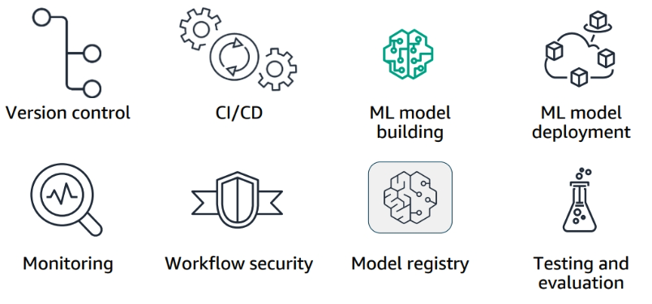

### 1. Intro to MLOps

 

MLOps—a combination of Machine Learning and Operations—combines people, technology, and processes to deliver collaborative ML solutions. MLOps requires the integration of software development, operations, data engineering, and data science. You need the right people, with the right skills, following the same standardized processes to successfully operate machine learning at scale. 

In this module, you will learn how to:
- Define MLOps.
- Compare and contrast DevOps and MLOps.
- People: List the roles that need to collaborate for MLOps.
- Processes: 
    - Describe the machine learning lifecycle and how it relates to MLOps.
    - Describe the phases in the MLOps maturity model.
    - Define ML governance. 

- Technology: Describe the importance of ML training and deployment pipelines. 

ML Lifecycle:

 

DevOps vs MLOps

 

Associated roles along ML lifecycle:

  

- MLOps engineers standardize ML systems development (dev) and ML systems deployment (ops) for continuous delivery of high-performing production ML models.

#### MLOps Technology Overview

Implementation considertaions for ML:
- Consistency – Using the benefits of containerization can minimize variance between environments, for example. 
- Flexibility – Data scientists have the flexibility to choose different frameworks and experiment with their ML model.
- Reproducibility – You can trace back and reproduce how the model was crested. 
- Scalability – You can test ML models on a single CPU, and then scale massively according to demand.
- Auditability – It is a requirement to capture logs, model drift, and dependencies of artifacts.
- Explainability – You can explain how the ML model arrived at the prediction, providing transparency to guard against bias.

Two main technology components:

   

Why ML Governance?

 

Understanding MLOps maturity levels:

  

### 2. Experimentation Environments in SageMaker

Amazon SageMaker uses Docker containers when performing the steps of the ML lifecycle:
- Running scripts to preprocess training and testing data
- Running training jobs to create and test models
- Deploying models to perform inference

Your level of engagement with containers depends on your use case. 
- SageMaker-managed container images – SageMaker provides prebuilt containers for common ML frameworks. These images are the easiest way to train models in SageMaker: 
    - You can use the built-in training algorithms included in these containers.
    - You can use the ML Framework, settings, libraries and dependencies included in these container images, but provide your own custom training algorithms. This approach is referenced as Bring your own Script (BYOS) or script mode.
- Customer-managed container images – If the prebuilt containers do not meet your requirements, SageMaker supports the following:
    - To meet requirements for additional dependencies or libraries, you can extend the prebuilt containers. SageMaker provides toolkits to make this easier. 
    - You can build custom containers (BYOC) if you need more control over the algorithm, framework, dependencies, or settings. 
    - You can bring your own model (BYOM), either locally trained or trained outside of SageMaker, by adapting the model container to work with SageMaker. 
    - Some industries might require BYOC or BYOM to meet regulatory and auditing requirements.

Model Training Container:
- **code**: The SageMaker containers library places the scripts that the container will run in the SAGEMAKER_SUBMIT_DIRECTORY, /opt/ml/code/. You store the custom decision tree algorithm, ‘train.py,’ in this directory
- **input**: When you run a model training job, the SageMaker container uses SM_INPUT_DIR, which defaults to the /opt/ml/input/ directory. The JSON files that configure the hyperparameters for the algorithm and the resources used for distributed training are stored in the opt/ml/input/config directory. The input directory also contains a subdirectory within the /opt/ml/input/data directory for each channel of training data stored in Amazon S3. 
- **checkpoints**: If you use checkpointing, Amazon SageMaker saves checkpoints locally in the checkpoint_local_path, /opt/ml/checkpoints, and synchs them to the checkpoint_s3_uri.
- **outputs**: The outputs of a training job are sent from /opt/ml/output/data to the output data uri in S3 as output.tar.gz
- **model**: The script must write the model generated by your algorithm to SM_MODEL_DIR, which defaults to /opt/ml/model/. When training is finished, the final model artifact in the /opt/ml/model folder is written to the output data uri in S3 as model.tar.gz.
- **…/WORKDIR/**: Training job operations that are distributed across multiple containers use the WORKDIR/.

   

Model Inference Container:

  

Package training code and inference code in the same container:

 

You must also add the code required to perform inference using a web application. You place the following files in the /opt/ml/code directory:
- serve.py – the program started when the container is created for hosting. It launches the gunicorn server which runs multiple instances of the web application defined in predictor.py.
- predictor.py – the program that implements the web server and the decision tree predictions for this app.
- webserver.conf – the configuration file for the front end.
- wrapper.py – is a small wrapper used to invoke the web application.

### 3. Repeatable MLOps

- Workflow orchestration Tools
    - [Amazon SageMaker Pipelines](https://github.com/aws/amazon-sagemaker-examples/blob/09f6fad6de75a4520f6f71d661f4b7a8139ce736/sagemaker-pipelines/tabular/abalone_build_train_deploy/sagemaker-pipelines-preprocess-train-evaluate-batch-transform.ipynb)
    - AWS Step Functions: serverless way to orchestrate pipelines, including ML-based ones. 
    - Amazon Managed Workflows for Apache Airflow (Amazon MWAA): using Directed Acyclic Graphs (DAGs) written in Python.

          

    - third-party tools: 
        - MLflow: open-source platform to manage the ML lifecycle, including experimentation, reproducibility, deployment, and a central model registry
        - Kubernetes / Kuberflow
        - Jenkins

- Model Deployment Architecture

    Sample real-time hosting inference architecture:

     

    - An API gateway provides an endpoint for RESTful API calls. The API gateway secures, monitors, and manages traffic between the host and client. For example, when using an identity and access management system or a token system, these credentials can be required and authenticated with the API gateway. 
    - Requests are routed to a load balancer, which distributes traffic between multiple servers. 
    - In this example, each server hosts both a web server application and an inference engine. The web server consumes and responds to the API requests. The web server is a client of the inference engine.

    In AWS we can create SageMaker endpoints for real-time inference.  

      

- Inference Options

     

    - Batch transform provides offline inference for large datasets. Batch transform is helpful for preprocessing datasets or gaining inference from large datasets. It also is useful when running inference if a persistent endpoint is not required, or associating input records with inference to support interpretation of results.
    - Real-time inference is ideal for inference workloads where you have real-time, interactive, low latency requirements. You can deploy your model to SageMaker hosting services and get an endpoint that can be used for inference. These endpoints are fully managed and support autoscaling.
    - Serverless inference can be used to serve model inference requests in real time without directly provisioning compute instances or configuring scaling policies to handle traffic variations.
    - Asynchronous inference queues incoming requests for asynchronous processing. This option is ideal for requests with large payload sizes (up to 1 GB), long processing times (up to 1 hour), and near-real-time latency requirements. 

- Best practices for deploying models
    - Use endpoints and model variants in testing
    - modify endpoints with minimal downtime
    - Update endpoint configuration before changing resources
    - Use batch transforms to get inferences on entire datasets

- Componentes of a repeatable MLOps framework

      

    - Version control – Git and Bitbucket are supported by SageMaker
    - CI/CD –  Jenkins, or AWS CodePipeline and AWS CodeBuild provide the CI/CD functionality.
    - ML model builder –  SageMaker training jobs will provide this functionality.
    - ML model deployment – SageMaker model deployment will provide this functionality.
    - Monitoring – SageMaker Model Monitor and SageMaker Clarify will provide this functionality.
    - Workflow security – IAM roles will provide this functionality.
    - Model registry – SageMaker Model Registry will provide this functionality.
    - Training data – Amazon S3 will provide this functionality.
    - Orchestration – AWS Step Functions will provide this functionality.
    - Testing and evaluation – AWS Lambda will provide this functionality