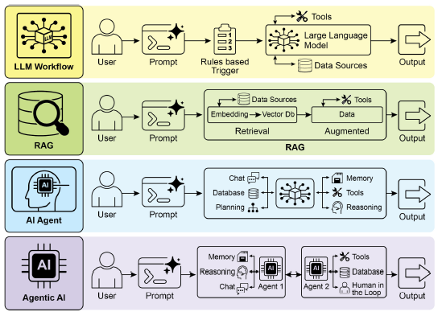
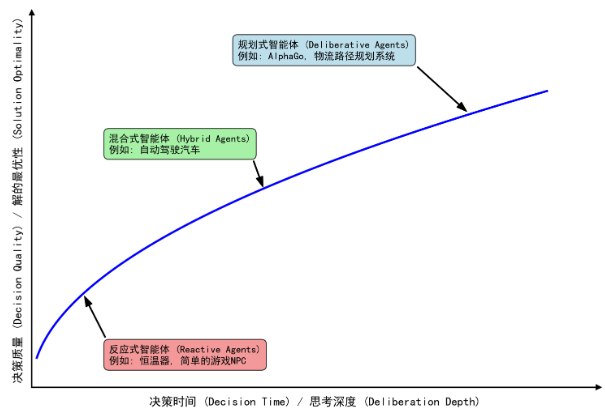
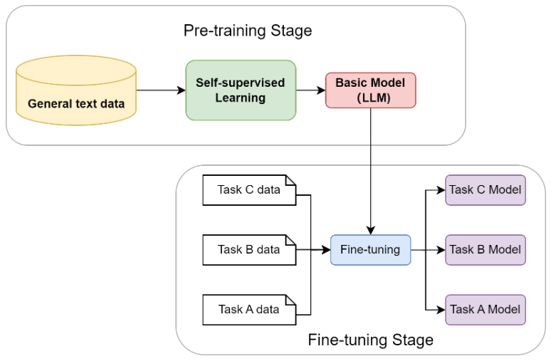
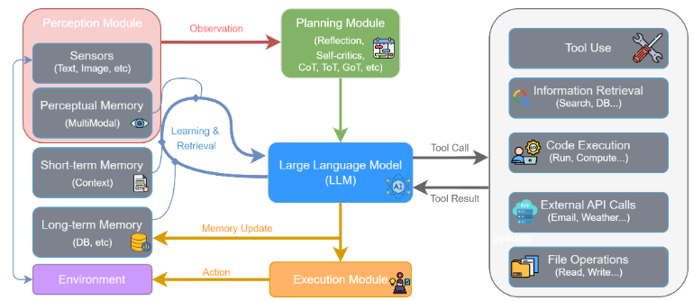
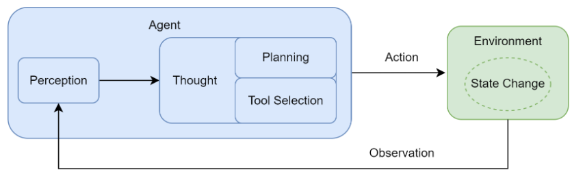

### 1. Agent Introduction

#### 1.1 What is an LLM-Based Agent

In simple terms, an AI agent is a system designed to **perceive** its **environment** and take **actions** to achieve a specific **goal**. It's an evolution from a standard Large Language Model (LLM), enhanced with the abilities to **plan, use tools, and interact** with its surroundings.


 

- LLM Workflows initially relied on basic prompts and triggers to process data with LLMs based on predefined steps. In essense, it is a static and precise flowchart.
- This evolved with Retrieval-Augmented Generation (RAG), which enhanced reliability by **grounding models on factual information**. 
  
- Single-Agent Autonomous Loop: We then saw the development of individual AI Agents capable of **using various tools**. i.e. coding assistants (Claude Code, Cursor, Copilot). They are autonomous systems that dynamically take actions to achieve goals, compared to workflows and RAG.
 
- Multi-Agent Collaboration: Today, we are entering the era of Agentic AI, where a **team of specialized agents works in concert** to achieve complex goals, marking a significant leap in AI's collaborative power.
  
    - **Role-Playing Dialogues**: Frameworks like CAMEL assign **clear roles** (e.g., “programmer” and “product manager”) and communication protocols to agents. Agents collaborate through structured conversations to complete tasks.
    - **Organized Workflows**: 
      - Frameworks like MetaGPT and CrewAI simulate a well-defined “virtual team”.
      - Each agent has **predefined responsibilities and standard operating procedures (SOPs)**, collaborating hierarchically or sequentially to produce complex outputs (e.g., full codebases or research reports).
      - **AutoGen** and AgentScope offer more flexible dialog-based architectures, allowing developers to customize complex interaction networks among agents.
    - **Advanced Control Flow Architectures**
      - Frameworks like **LangGraph** focus on providing robust engineering foundations.
      - They model agent execution as a **state graph**, enabling flexible and reliable handling of loops, branches, backtracking, and human intervention.

#### 1.2 Comparison to traditional RL Agents

- Traditional RL agents learn by interacting with an environment to maximize cumulative rewards. 
  
   

  - RL agents learn decision-making strategies/policy through interaction. As a result, they often **lack prior knowledge at the beginning** and must build an understanding of the task from scratch.
  - The solution to this problem has emerged in the field of NLP and LLM-based  agents can possess a broad understanding of the world through data-based pre-training before they begin learning specific tasks.

     

    When the scale of a model (in terms of parameters, data, and computation) crosses a certain threshold, it begins to exhibit **emergent abilities** that were not directly trained or anticipated. For example:

    - **In-context Learning**: Without adjusting the model's weights, simply providing a few examples (few-shot) or even no examples (zero-shot) in the input allows the model to understand and perform new tasks.

    - **Chain-of-Thought Reasoning**: By prompting the model to output step-by-step reasoning before answering complex questions, its accuracy in tasks involving logic, arithmetic, and common-sense reasoning can be significantly improved.


- LLM agents use large language models as their core reasoning engine, often augmented with tools, memory, and planning capabilities.

     

#### 1.3 Agent Loop: Thought-Action-Observation

 

1. 感知 (Perception)：这是循环的起点。智能体通过其传感器（例如，API的监听端口、用户输入接口）接收来自环境的输入信息。这些信息，即观察 (Observation)，既可以是用户的初始指令，也可以是上一步行动所导致的环境状态变化反馈。
    
2. 思考 (Thought)：接收到观察信息后，智能体进入其核心决策阶段。对于LLM智能体而言，这通常是由大语言模型驱动的内部推理过程。如图所示，“思考”阶段可进一步细分为两个关键环节：
    - 规划 (Planning)：智能体基于当前的观察和其内部记忆，更新对任务和环境的理解，并制定或调整一个行动计划。它通过反思 (Reflection) 和自我批判 (Self-criticism) 等机制，将宏观目标分解为更具体、可执行的步骤。
    - 工具选择 (Tool Selection)：作为中枢的LLM 接收来自规划模块的指令，并与记忆模块 (Memory) 交互以整合历史信息。LLM进行深度推理，最终决策出下一步要执行的具体操作，这通常表现为一个工具调用 (Tool Call)。

3. 行动 (Action)：决策完成后，智能体通过其执行器（Execution Module）执行具体的行动。这通常表现为调用一个选定的工具（如代码解释器、搜索引擎API），从而对环境施加影响，意图改变环境的状态。

行动并非循环的终点。智能体的行动会引起环境 (Environment) 的状态变化 (State Change)，环境随即会产生一个新的观察 (Observation) 作为结果反馈。这个新的观察又会在下一轮循环中被智能体的感知系统捕获，形成一个持续的“感知-思考-行动-观察”的闭环。智能体正是通过不断重复这一循环，逐步推进任务，从初始状态向目标状态演进。


实践中需要一套明确的交互协议 (Interaction Protocol) 来规范其与环境之间的信息交换。这一协议体现在对智能体每一次输出的结构化定义上。智能体的输出不再是单一的自然语言回复，而是一段遵循特定格式的文本，其中明确地展示了其内部的推理过程与最终决策。

这个结构通常包含两个核心部分：
 - Thought (思考)：这是智能体内部决策的“快照”。它以自然语言形式阐述了智能体如何分析当前情境、回顾上一步的观察结果、进行自我反思与问题分解，并最终规划出下一步的具体行动。
  - Action (行动)：这是智能体基于思考后，决定对环境施加的具体操作，通常以函数调用的形式表示。

```
Thought: 用户想知道北京的天气。我需要调用天气查询工具。
Action: get_weather("北京")
```

感知系统的一个重要职责就是扮演传感器的角色：将这个原始输出处理并封装成一段简洁、清晰的自然语言文本，即观察。

```
Observation: 北京当前天气为晴，气温25摄氏度，微风。
```
