## 1. Rec System Architecture Ovreview

A large-scale recommendation system typically follows a **multi-stage architecture**, optimized for both **accuracy** and **latency**. It usually consists of **three main layers**:

1. **Candidate Generation (Retrieval)**
2. **Scoring / Ranking**: can be further split to pre-rank + rank
3. **Re-ranking / Post-ranking**

These stages sit on top of strong **data and infrastructure layers** for feature engineering, model serving, and feedback loops.

```
User → Logging → Feature Store → Candidate Generation → Ranking → Re-ranking → UI Delivery
```

**Components:**

| Layer                                | Goal                                                                    | Typical Models / Techniques                                             |
| ------------------------------------ | ----------------------------------------------------------------------- | ----------------------------------------------------------------------- |
| **Data & Logging**                   | Collect user-item interactions (clicks, views, dwell time, likes, etc.) | Event pipelines (Kafka, Flink, Spark Streaming)                         |
| **Feature Store**                    | Store precomputed user/item/context features                            | Feast, Vertex AI Feature Store, custom pipelines                        |
| **Candidate Generation (Retrieval)** | Narrow billions of items to hundreds                                    | Two-tower (Siamese) networks, Approximate Nearest Neighbor (ANN) search |
| **Ranking**                          | Score and sort candidates by relevance                                  | DNNs, Gradient Boosted Trees, Wide & Deep, Transformer-based rankers    |
| **Re-ranking / Post-processing**     | Enforce diversity, freshness, fairness, business rules                  | Multi-objective optimization, MMR, bandits                              |
| **Serving**                          | Real-time inference, caching                                            | TensorFlow Serving, PyTorch Serve, Faiss/ScaNN for ANN                  |
| **Feedback Loop**                    | Collect results, retrain models                                         | Airflow/SageMaker pipelines, online learning                            |


### A/B Testing


## 2. Retrieval Stage

### 2.1 ItemCF: Item Based Collaborative Filtering

#### 💡 Principle of ItemCF

* If a user likes item $i_1$, then the system recommends other items $i_2$ that are **similar to $i_1$**.

- Estimate users' interest in an unseen candidate item based on the item's similarity to the user-interacted items

    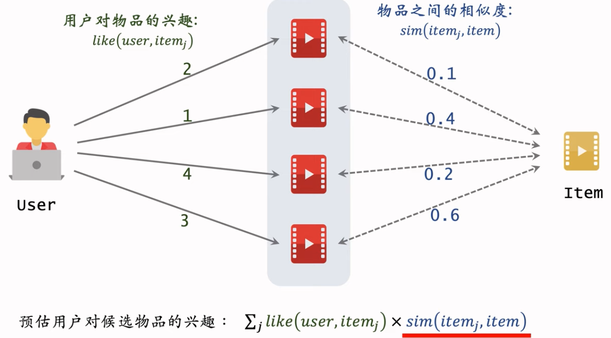 

#### 🔢 Item Similarity sim(item1, item2)

* If there is a large overlap in users who like both $i_1$ and $i_2$, then $i_1$ and $i_2$ are considered **similar**.
* The similarity formula is:

    $$
    \text{sim}(i_1, i_2) = \frac{|w_{i_1} \cap w_{i_2}|}{\sqrt{|w_{i_1}| \cdot |w_{i_2}|}}
    $$

    where:

    * $w_{i_1}$: set of users who liked item $i_1$
    * $w_{i_2}$: set of users who liked item $i_2$
    * $V = |w_{i_1} \cap w_{i_2}|$: number of users who liked both items

- Embed each item as a sparse vector where each element in the vector represent a user.
- the sim() function is the cosine similarity of the two vectors
- When considering the degree a user likes an item (instead of binary) the formula is below:

    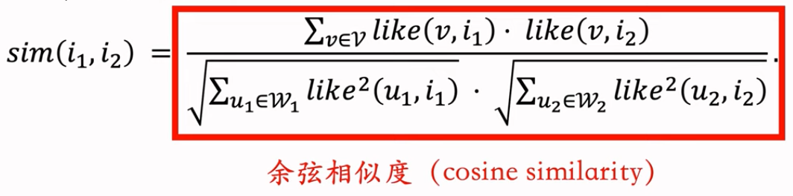 

✅ **Summary:**
ItemCF measures **item-to-item similarity** based on **user co-engagement overlap** (i.e., users who liked both items). The higher the overlap, the more similar the two items are — enabling the system to recommend related content when a user interacts with one.

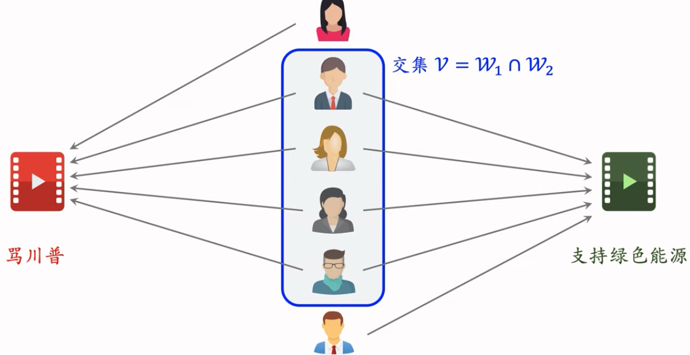  

Note that itemCF also has variations such as **ContentCF** that derive item similarity based on contents or item features directly instead of using co-engagement data. 

#### Offline Preprocessing

1.  Build **User → Item** Index

    * Record each user’s most recent clicked or interacted item IDs.
    * Given any user ID, you can find the list of items they recently showed interest in.

    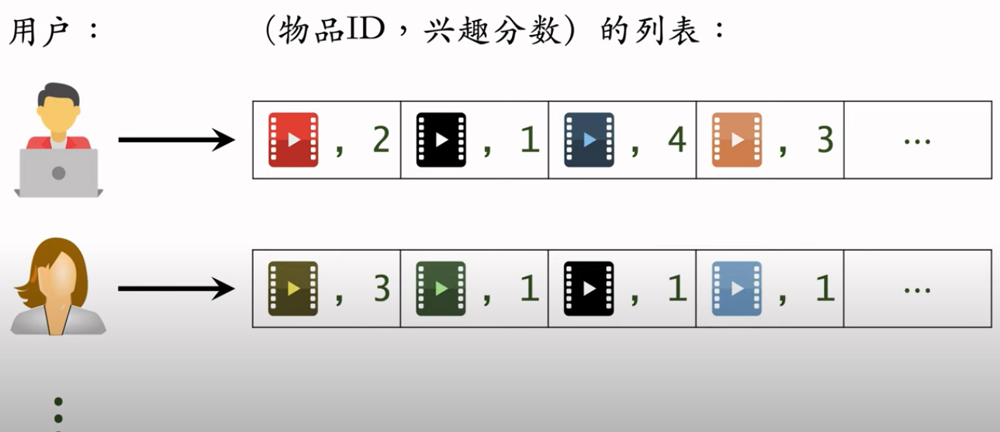  

2. Build **Item → Item** Index

    * Compute pairwise similarity between items.
    * For each item, index its top-k most similar items.
    * Given any item ID, you can quickly find its k most similar items.

    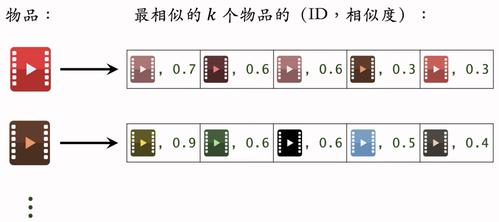 

User-item interactions and item-item similarities are computed and stored in indices,
so that during **online serving**, recommendations can be fetched in real time using these precomputed relationships.

#### ⚙️ Online Retrieval (Real-Time Recommendation)

1. Given a **user ID**, use the **User → Item** index to find the list of items the user has recently shown interest in (**last-n** items). i.e. n=200
2. For each item in the **last-n** list, use the **Item → Item** index to find its **top-k similar items**. i.e. k=10
3. For all the retrieved similar items (**up to n×k items**), compute the user’s interest score for each item using a defined formula.
4. Return the **top 100 items with the highest scores** as the final recommendation results.


✅ The precomputed indices from offline processing allows us to quickly find similar items for a user’s recent interactions, estimate interest scores, and output the top-ranked items in real time.

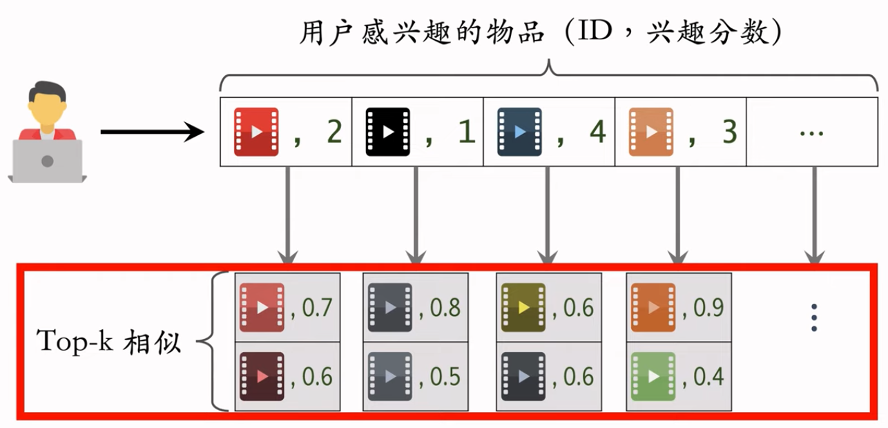  

### 2.2 Swing Model

#### Limitations of ItemCF

If the overlapped users come from a small social circle (like a social media group which often share items), the system could falsely use the signal to predict two items are similar, where in reality they are not.

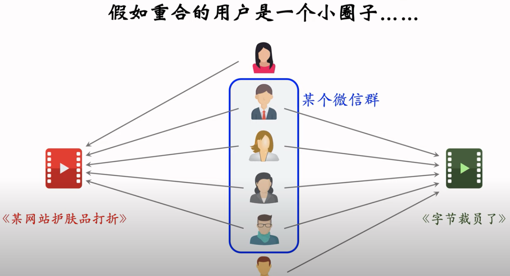  

#### ⚙️ Core idea of Swing Model

Swing Model adjusts user–item co-occurrence similarity by penalizing users who share too many common items (to reduce overfitting to small groups). It’s an improvement over traditional ItemCF that adds **user-level de-correlation weighting**.

* Let the set of items liked by user $u_1$ be $\mathcal{J}_1$.
* Let the set of items liked by user $u_2$ be $\mathcal{J}_2$.
* Define the **overlap** between two users as:
  
  $$
  overlap(u_1, u_2) = |\mathcal{J}_1 \cap \mathcal{J}_2|
  $$
  
* If users $u_1$ and $u_2$ have a **high overlap**, it means they may come from a **small user circle (tight community)**, so their weight should be **downscaled** to avoid overemphasizing niche clusters.

#### Item Similarity

This is the **core similarity formula of the Swing model**:

* Let the set of users who liked item $i_1$ be $\mathcal{W}_1$.
* Let the set of users who liked item $i_2$ be $\mathcal{W}_2$.
* Define their intersection as $\mathcal{V} = \mathcal{W}_1 \cap \mathcal{W}_2$.
* The similarity between two items is defined as:

  $$
  sim(i_1, i_2) = \sum_{u_1 \in \mathcal{V}} \sum_{u_2 \in \mathcal{V}} \frac{1}{\alpha + overlap(u_1, u_2)}
  $$


✅ **Explanation:**

* It aggregates contributions from all pairs of users $(u_1, u_2)$ who both interacted with the two items.
* The term $overlap(u_1, u_2)$ penalizes users who have high behavioral overlap (i.e., belong to the same tight community).
* $\alpha$ is a smoothing constant to avoid division by zero.
* Intuitively, users who are **too similar** contribute **less** to item similarity — reducing bias toward small, dense user clusters.


#### ⚖️ Comparison Between Swing and ItemCF

* The **only difference** between Swing and ItemCF lies in how they define **item similarity**.
* **ItemCF:**
  If two items share a large proportion of common users, they are considered **similar**.
* **Swing:**
  Additionally considers whether the **overlapping users** come from a **small, dense user circle**.

  * Let $\mathcal{V}$ be the set of users who liked both items.
  * For any two users $u_1$ and $u_2$ in $\mathcal{V}$, define their overlap as $overlap(u_1, u_2)$.
  * If $u_1$ and $u_2$ have a **high overlap**, they are likely from the **same small user circle**, so their **weight is reduced**.

✅ **Summary:**
Swing refines ItemCF by **penalizing correlations caused by tightly connected user groups**, making the similarity measure more robust and less prone to overfitting to niche communities.

### 2.3 UserCF: User Based Collaborative Filtering

#### Principle


* There are many users whose interests are very similar to mine.
* One of these users liked or shared a certain post.
* I haven’t seen this post before.
  
  → **The system recommends this post to me.**

💡 Rednote Example: How does the recommendation system find users whose interests are similar to mine?

* **Method 1:** Users who have a high overlap in the posts they **click, like, favorite, or share**.
* **Method 2:** Users who **follow many of the same authors**.

UserCF finds **like-minded users** based on overlapping behaviors or follow patterns. Then it recommends items (posts, videos, products, etc.) that these similar users have interacted with but I haven’t — leveraging **user-to-user similarity** for discovery.

#### Predicting User Interest

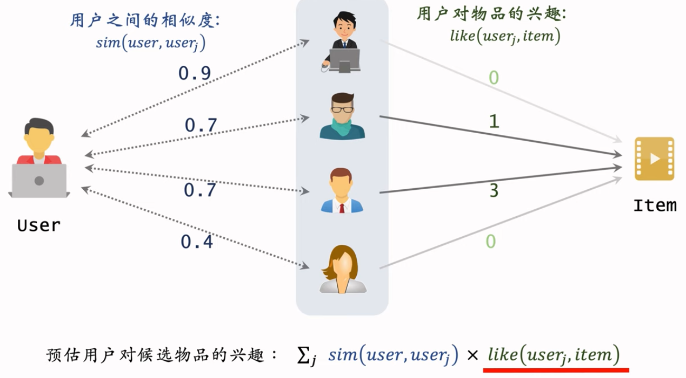  

UserCF assumes *“similar users like similar items.”* It estimates interest in an unseen item by aggregating the preferences of **neighboring users**, weighted by their similarity.

$$\sum_j sim(user, user_j) \times like(user_j, item)$$


#### ⚙️ Calculating Similarity Between Two Users

* Represent each user as a **sparse vector**, where each element corresponds to an item.
* The similarity $sim$ between two users is the **cosine of the angle** between their vectors.


**UserCF** measures **user–user similarity** using **cosine similarity** over their interaction sets — i.e., the more overlapping items two users like (normalized by how many items each has liked), the more similar their interests are.

* Let the set of items liked by user $u_1$ be $\mathcal{J}_1$.
* Let the set of items liked by user $u_2$ be $\mathcal{J}_2$.
* Define their intersection as $I = \mathcal{J}_1 \cap \mathcal{J}_2$.
* The similarity between two users is defined as:

  $$
  sim(u_1, u_2) = \frac{|I|}{\sqrt{|\mathcal{J}_1| \cdot |\mathcal{J}_2|}}
  $$

#### Reducing the Weight of Popular Items

$$
sim(u_1, u_2) = \frac{\sum_{l \in I} \frac{1}{\log(1 + n_l)}}{\sqrt{|\mathcal{J}_1| \cdot |\mathcal{J}_2|}}
$$

where:
- $n_l = \text{the number of users who liked item } l$, which reflects the **popularity level of item $l$**.

- Items that are liked by many users (high $n_l$) contribute **less** to user similarity. 
- Rare or niche items (low $n_l$) contribute **more**, helping the system discover more *personalized* relationships instead of those dominated by universally popular content.

Here’s the extracted and translated content from the image:


#### 🧮 Offline Preprocessing

1. Build a **User → Item** Index (same as ItemCF)

    * Record each user’s most recent clicked or interacted item IDs.
    * Given any user ID, you can find the list of items they have recently shown interest in.

2. Build a **User → User** Index

    * For each user, index their top-k most similar users.
    * Given any user ID, you can quickly find their k most similar users.

    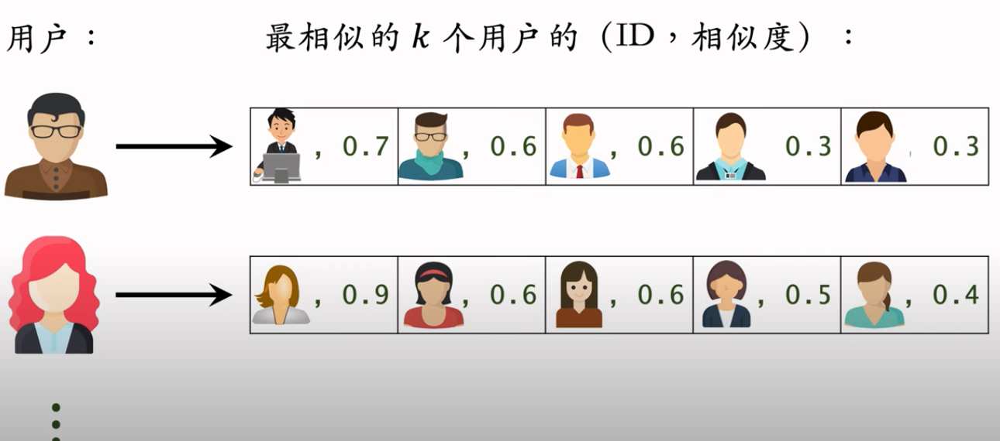   

user–item and user–user relationships are computed and stored, so that during **online serving**, the system can quickly look up similar users and recommend items they liked.


#### ⚙️ Online Retrieval (Real-Time Recommendation)

1. Given a **user ID**, use the **User → User** index to find the **top-k similar users**.
2. For each of these top-k similar users, use the **User → Item** index to find the list of items they have recently shown interest in (**last-n items**).
3. For all the retrieved **n×k similar items**, estimate the target user’s **interest score** for each item using a defined formula.
4. Return the **top 100 items** with the highest scores as the recommendation results.

     

### 2.4 Matrix Completion

#### Processing Discrete Features

1. Build a dictionary: map each category to a unique index/ID (e.g., China→1, USA→2, India→3). 
2. Vectorize that index using either:
     - One‑hot encoding (high‑dimensional sparse vector). 
     - Embedding (low‑dimensional dense vector).
  
    Limitation: When category count is huge (e.g., words: tens of thousands; item IDs: hundreds of millions), one‑hot becomes impractical due to very high dimensionality.

#### Embeddings

- Idea: Map each category index to a learned low‑dimensional dense vector (an “embedding”). 
- Parameter count: embedding dimension $\times$ number of categories

  - Example — Nationality: 4‑dim vectors × 200 categories = 800 parameters. 
  - Example — Item IDs (10,000 movies), 16‑dim: 160,000 parameters. 

- Implementation: Deep‑learning frameworks (TensorFlow/PyTorch) provide an embedding layer whose parameters are stored as a matrix of shape $d×K$. 
  - Input is the category index (e.g., USA→2); 
  - Output is the corresponding column/row vector from this matrix. 
- Equivalence to matrix multiplication:
Selecting an embedding for index k equals multiplying the parameter matrix by the one‑hot vector $e_k$​:
$Embedding=E×e_k$ (where $E$ is the embedding matrix). 

#### Matrix Completion Concept

*   Represent **users** and **items** with **separate embedding layers** (two parameter matrices).
*   Predicted interest for user $i$ and item $j$ is the **inner product**:
    $$
    s_{ij}=\langle \mathbf{u}_i,\mathbf{v}_j\rangle
    $$
    where $\mathbf{u}_i$ is the user embedding and $\mathbf{v}_j$ is the item embedding.
*   **Parameters are not shared** between user and item embeddings.

  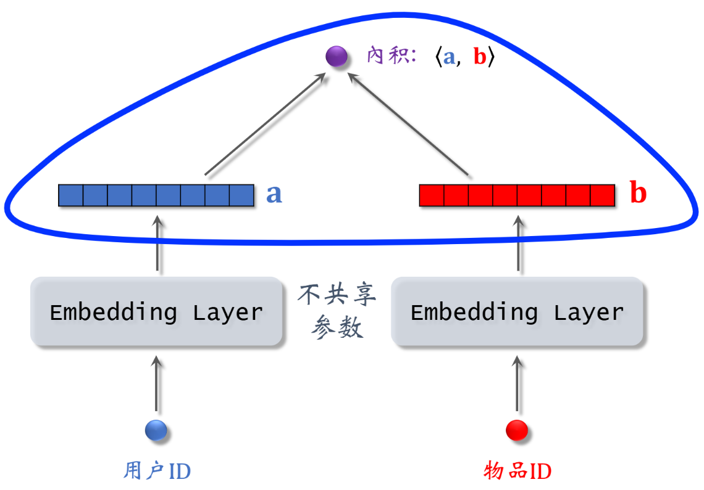 

#### Dataset & Labeling

*   Each record is a triple **(user ID, item ID, interest score)**; the set of observed pairs is $\Omega$.
*   Example scoring scheme:
    *   **Exposed but no click** → **0**
    *   **Click / Like / Favorite / Share** → each contributes **+1**
    *   Scores range from **0** to **4**

#### Training Objective

*   Map user $i$ → vector $\mathbf{u}_i$; item $j$ → vector $\mathbf{v}_j$.
*   Learn embedding matrices $U$ and $V$ by minimizing squared error over observed entries:
    $$
    \min_{U,V} \sum_{(i,j)\in \Omega}\left(r_{ij}-\langle \mathbf{u}_i,\mathbf{v}_j\rangle\right)^2
    $$
    where $r_{ij}$ is the labeled interest score.

#### Intuition

  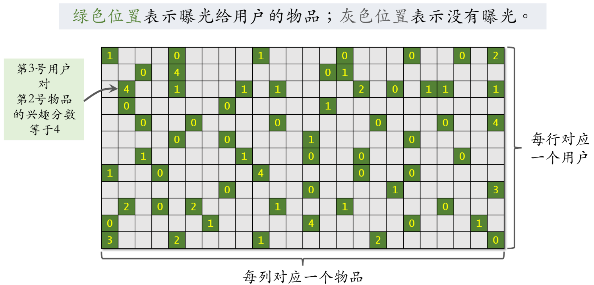 

*   Think of a large matrix with **rows = users**, **columns = items**, **cells = interest scores**.
*   Entries are **observed** only when exposure/interactions occur; many cells are missing.
*   Training aims to **complete** (predict) the missing cells via learned embeddings.


#### Practical Drawbacks (as highlighted)

1.  **Limited features**
    *   Using only **ID embeddings** ignores rich **item attributes** (category, keywords, geo, author) and **user attributes** (gender, age, location, interest categories).
    *   A **two‑tower model** is an “upgrade” that incorporates these features.

2.  **Negative sampling pitfalls**
    *   Treating “**exposed then no interaction**” as negatives is flagged as an **incorrect** sampling strategy.

3.  **Similarity & loss choices**
    *   **Cosine similarity** can outperform pure **inner product** for matching.
    *   **Cross‑entropy loss (classification)** can outperform **squared error (regression)** for engagement prediction in practice.

4.  **Bottom line**
    *   **Matrix Completion** in this basic form has **multiple shortcomings** and often **underperforms** stronger baselines.

#### Online Serving (Recall Pipeline)

1.  **Model storage**
    *   After training, keep matrices $U$ and $V$.
    *   Store **user embeddings** in a **key–value store** keyed by user ID; lookup returns $\mathbf{u}$.
    *   **Item embeddings** require more complex storage and indexing due to catalog size.

2.  **Retrieval**
    *   Given a request, fetch the user’s embedding $\mathbf{u}$.
    *   Retrieve top‑$k$ items by maximizing inner product $\langle \mathbf{u}, \mathbf{v}_j \rangle$.
    *   **Brute force** over all items is too slow (linear in catalog size) → use **ANN**.

#### Approximate Nearest Neighbor (ANN)

*   Use vector databases/libraries for fast top‑$k$ search:
    *   Examples: **Milvus**, **Faiss**, **HnswLib**
*   Supported similarity metrics:
    *   **Euclidean (L2)**
    *   **Inner product**
    *   **Cosine similarity**

      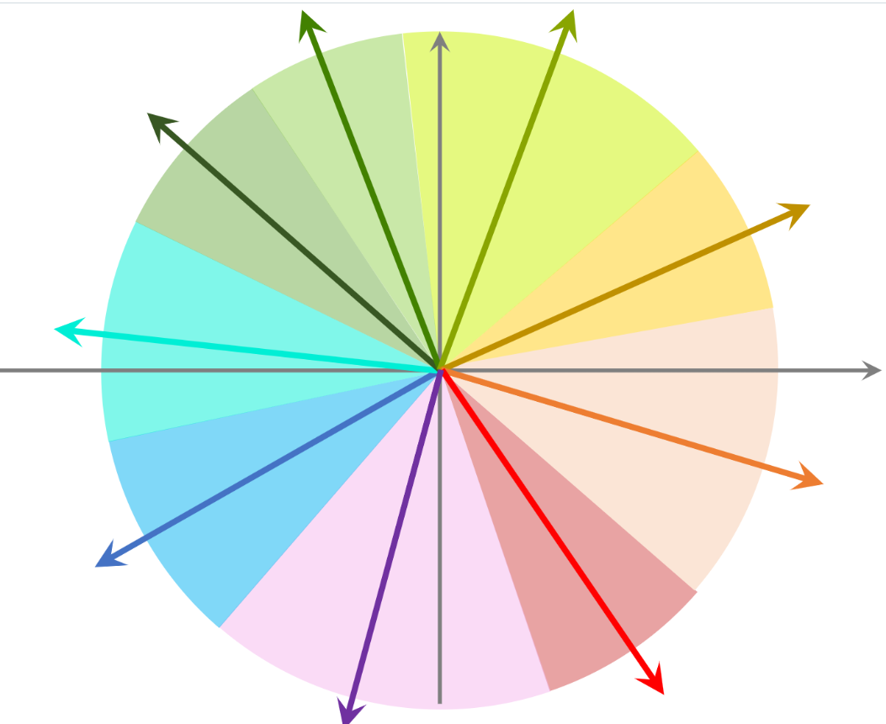 
      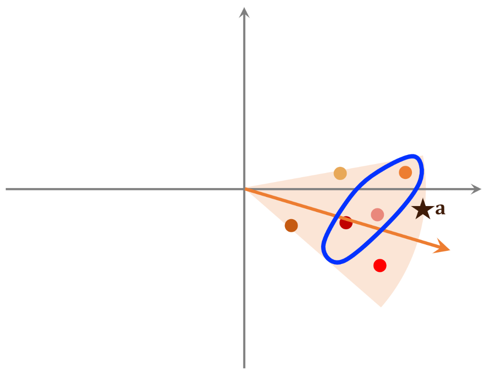 
 
#### Quick Cheat‑Sheet

*   **Predict**: $s_{ij}=\langle \mathbf{u}_i,\mathbf{v}_j\rangle$
*   **Train**: minimize MSE on observed entries $\Omega$
*   **Labels**: 0–4 based on exposure + interactions
*   **Serve**: lookup $\mathbf{u}$ → ANN over $\{\mathbf{v}_j\}$ → top‑$k$
*   **Caveats**: enrich features (two‑tower), fix negative sampling, consider cosine similarity + cross‑entropy

### 2.5 Two-Tower Model: Architecture and Training

#### Concept

The **Two-Tower Model** (also known as **Dual Encoder** or **Siamese Architecture**) is a large-scale **retrieval model** used in recommendation and search systems.
It learns **vector representations (embeddings)** for both users and items, enabling efficient **similarity-based retrieval** via inner product or cosine similarity.

#### 1. User Tower

* **Inputs:**

  * User ID
  * Discrete user features (e.g., gender, location, device)
  * Continuous user features (e.g., activity level, time since last login)
* **Processing:**

  * Embedding layers for categorical features
  * Normalization / bucketing for continuous features
  * Concatenation of features → passed through a neural network

* **Output:** User embedding vector **a**

    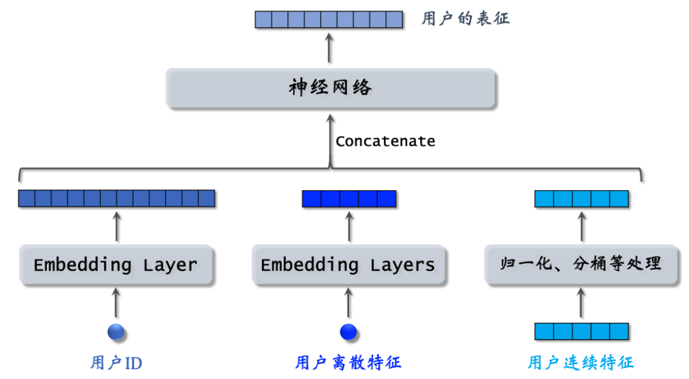   

#### 2. Item Tower

* **Inputs:**

  * Item ID
  * Discrete item features (e.g., category, brand)
  * Continuous item features (e.g., popularity, price)
* **Processing:**

  * Embedding + transformation + neural network
* **Output:** Item embedding vector **b**

    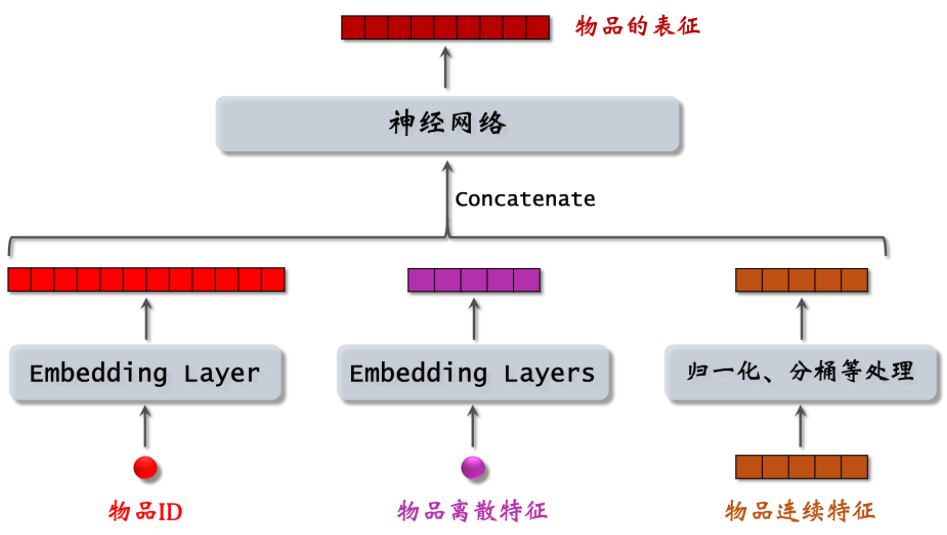  

#### 3. Similarity Computation

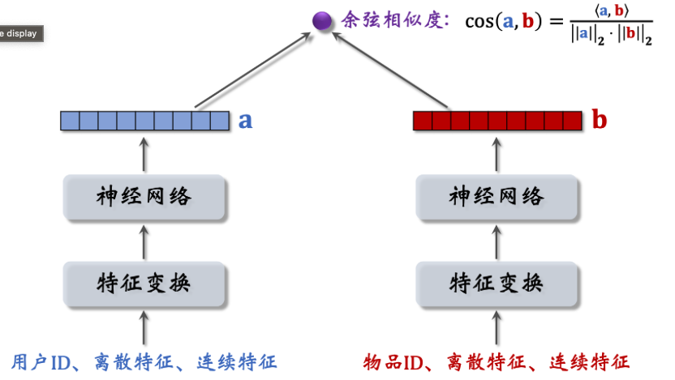 

$$\text{score} = a \cdot b \quad \text{or} \quad \cos(a, b) = \frac{a \cdot b}{|a||b|}$$

This score represents the **predicted interest** or **relevance** between the user and item. Cosine is more commonly used now.

#### Training Methods

(1) **Pointwise Training**

* Treats retrieval as a **binary classification** task.
* Each (user, item) pair is labeled as **positive** (clicked) or **negative** (not clicked).
* Encourages:

  * Positive samples → cosine similarity ≈ +1
  * Negative samples → cosine similarity ≈ −1
* Typical positive:negative ratio = 1:2 or 1:3 (industry convention)

(2) **Pairwise Training**: Sample one positive and negative item pair for a user

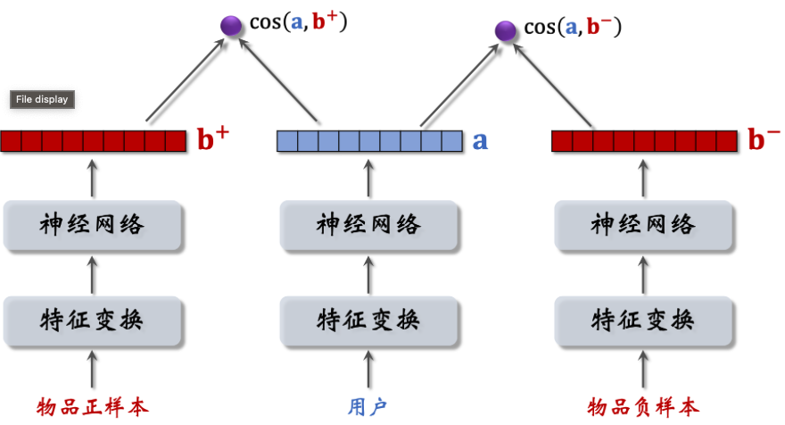  

* Shared parameters across positive and negative item encoders.
* Objective: Encourage cosine similarity with positive item > negative item by a margin $m$. That is, make sure the predicted user interest in positive item is higher than that in negative item.
* Uses **Triplet-based** loss with one user, one positive item, one negative item

    If $\cos(a, b^+)) > \cos(a, b^-))+m$ &rarr; no loss; 
    
    Else, loss is measured below:

    - **Triplet hinge loss:**

    $$L(a, b^+, b^-) = \max(0, \cos(a, b^-) + m - \cos(a, b^+))$$


    - **Triplet logistic loss:**

    $$L(a, b^+, b^-) = \log(1 + \exp[\sigma(\cos(a, b^-) - \cos(a, b^+))])$$

(3) **Listwise Training**

* One user → one positive sample + multiple negative samples.
* Encourages:

  * $\cos(a, b^+)$ → large
  * $\cos(a, b^-)$ → small

**Procedure:**

1. Compute cosine similarities between user embedding and all (positive + negative) items.
2. Apply **Softmax** over similarities to get probabilities $s_i$.
3. Use **Cross-Entropy Loss**:
    $$L = -\log(s_{positive})$$
   
    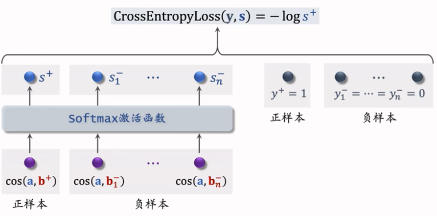  

References:

* Pairwise training: Jui-Ting Huang et al., *Embedding-based Retrieval in Facebook Search*, KDD 2020.
* Listwise training: Xinyang Yi et al., *Sampling-Bias-Corrected Neural Modeling for Large Corpus Item Recommendations*, RecSys 2019.


#### Comparison: Two-Tower for Retrieval vs Ranking 

Below model architecture is designed for ranking and not for retrieval, because it outputs interest scores for every user and item pair. This is only possible when the item pool is limited in the ranking stage.

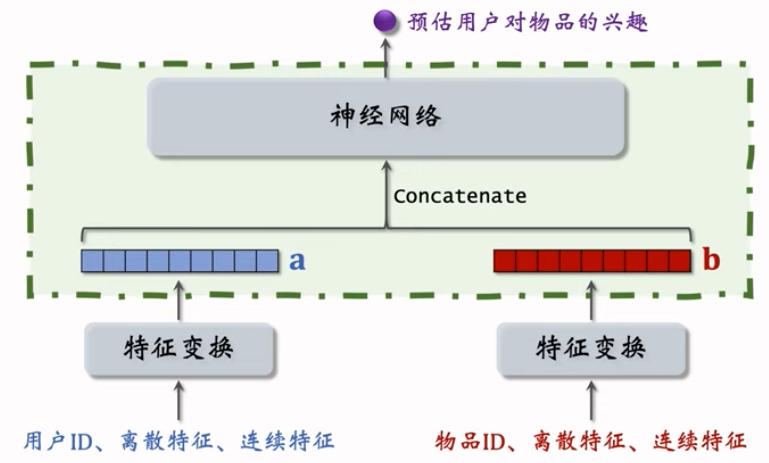  

| Aspect      | Two-Tower for Retrieval                    | Ranking  |
| ----------- | ---------------------------------- | --------------------------- |
| Structure   | Two separate encoders (user, item) | Single concatenated network |
| Efficiency  | Enables ANN search (Faiss, ScaNN)  | Requires full pair input    |
| Application | Retrieval / Recall stage           | Ranking / Scoring stage     |
| Output      | Separate embeddings                | Combined interest score     |


#### 🧠 Summary

* The **two-tower model** outputs:

  * **User embedding** (from user tower)
  * **Item embedding** (from item tower)
* Their **cosine similarity** predicts user interest.
* Supports **three training paradigms:**

  1. **Pointwise:** single pair (binary classification)
  2. **Pairwise:** one positive + one negative (triplet loss)
  3. **Listwise:** one positive + multiple negatives (softmax CE loss)
* Scalable to large corpora — efficient for **ANN-based retrieval**.

### 2.6 Negative Sampling Strategies

#### Position in the Recommendation Pipeline

*   Typical flow: **Recall → Coarse Rank → Fine Rank → Re‑rank**.
*   Catalog size shrinks from **billions** (full set) → **thousands** (recall) → **hundreds** (ranking) → **final slate**.
*   Sampling strategies must align with the **stage** being trained (recall vs. rank).

#### Positive Samples

*   **Definition**: user–item pairs that were **exposed and clicked** (indicating interest).
*   **Popularity bias**: a small subset of **hot items** attracts most clicks; positives become dominated by popular content.
*   **Mitigations**:
    *   **Up‑sampling**: duplicate under‑represented **cold items** among positives.
    *   **Down‑sampling**: discard some over‑represented **hot items** to balance the training set.
  
#### Negative samples

  1. Simple negatives from the **full catalog**: Items not retrieved at all. 

      **Rationale**: items **not recalled** are likely **not of interest**; approximate this by sampling from **all items**.

      **Uniform vs. popularity‑aware sampling**:
       *   **Uniform** tends to over‑sample **cold items**, which may be unfair if exposure is skewed toward hot items.
       *   **Popularity‑aware** ($sampling prob ∝ click count^{0.75}$) intentionally **penalizes hot items** to counter bias.
  
  2. **In‑batch** simple negatives
    
       *   **Setup**: a training batch has $m$ **positive** user–item pairs.  
    For each user in the batch, pairing with the other $m-1$ items yields **$m-1$** negatives (**simple** by construction).
       *   **Bias caveat**: item appearance in batches is **proportional to click count**, making **popular items** far more likely to become negatives than intended ($click count^{0.75}$).
       *   **Score adjustment (conceptual)**: compensate for sampling bias using each item’s sampling probability $p_j$ ($p_j ∝ click count$):
       $$
       \text{adjusted\_interest\_score} = \cos(\mathbf{u}, \mathbf{v}_j) \;-\; \log p_j
       $$
        
        where $\cos(\cdot,\cdot)$ is cosine similarity between user and item embeddings.

        Reference: Xinyang Yi et al., *Sampling-Bias-Corrected Neural Modeling for Large Corpus Item Recommendations*, RecSys 2019.

  3. **Hard negatives**: Items retrieved but filtered out by ranking.

       *   **Moderately hard**: items **eliminated by coarse rank** (near the decision boundary).
       *   **Very hard**: items that the **fine rank** scored low but are semantically close to positives (near‑misses).
       *   **Why include them**: models easily separate positives from **easy** negatives; **hard negatives** improve discrimination where it matters most.
  
  4. Industry strategy: **Mixture policy** 

   *   Combine sources, e.g., **50% simple negatives** (full catalog) + **50% hard negatives** (not selected by ranking).
   *   Tune the mix to balance **training stability** and **expressiveness**.

#### What Not to Use as Negatives for **Recall**

*   **Exposed but not clicked** items: the user may still have interest (position bias, timing, chance).
*   These are **valid negatives for ranking** (post‑exposure behavior), **not** for **recall** (pre‑exposure candidate generation).

#### Cosine Similarity (Common Two‑Tower Score)

*   Embeddings: user vector $\mathbf{u}$, item vector $\mathbf{v}$.
*   **Cosine similarity** (scale‑invariant, focuses on directional alignment):
    $$
    \cos(\mathbf{u}, \mathbf{v}) = \frac{\mathbf{u}^\top \mathbf{v}}{\|\mathbf{u}\|_2\,\|\mathbf{v}\|_2}
    $$
*   Frequently used as the **matching score** in recall; can be combined with **bias corrections** (e.g., subtract $\log p_j$ for in‑batch negatives).

#### Key Takeaways

*   A robust two‑tower recall dataset = **well‑defined positives** + a **mixture of negatives** (simple + hard), with **popularity and sampling‑bias corrections**.
*   Distinguish strictly between **recall** (pre‑exposure) and **ranking** (post‑exposure) when constructing negatives.
*   Use **cosine similarity** for stable matching; consider **$-\log p_j$** adjustments for in‑batch negatives to reduce bias.

### 2.7 Two-Tower Model: Online Recall and Model Updates

#### 1) Overview

*   The **two‑tower model** has a **user tower** and an **item tower**, each producing an embedding vector.
*   The **cosine similarity** between the user vector $\mathbf{u}$ and item vector $\mathbf{v}$ serves as the predicted interest:
    $$
    \text{cos}(\mathbf{u}, \mathbf{v}) = \frac{\mathbf{u}^\top \mathbf{v}}{\|\mathbf{u}\|_2\,\|\mathbf{v}\|_2}
    $$
*   Training styles can be **pointwise**, **pairwise**, or **listwise**.
*   **Positives**: items the user clicked.
*   **Negatives**: sampled from the **full catalog** (simple) and items **rejected by ranking** (hard).

#### 2) Online Recall — Architecture & Flow

- Offline preparation

  1.  **Compute item vectors** with the **item tower** for all items (e.g., billions).
  2.  **Store item vectors** in a **vector database** and **build indexes** to accelerate nearest‑neighbor search.

- Online serving

  1.  Given a request, compute the **user vector** $\mathbf{u}$ via the **user tower** using **user ID + features**.
  2.  Use $\mathbf{u}$ as the **query** to the vector database.
  3.  Retrieve the **top‑k items** with the **highest cosine similarity** to $\mathbf{u}$ as the **recall results**.

- Why compute user vectors online (and store item vectors offline)?

  *   **Cost**: computing item vectors online for every request is prohibitive; precomputing and indexing is efficient.
  *   **Dynamics**: **user interests** change quickly, while **item features** are relatively stable.
  *   **Effectiveness**: caching user vectors offline is possible but typically **hurts recommendation freshness**; computing them **on the fly** reflects current context.

#### 3) Model Updates — Full vs. Incremental

- Full (daily) update

  *   **Train at midnight** on **yesterday’s data**, starting from **yesterday’s parameters** (not random init).
  *   Use **1 epoch** (each data point used once) with **random shuffling**.
  *   Publish the **updated user tower** and **new item vectors** for online recall.
  *   **Systems impact**: simpler data flow and lower operational complexity.

- Incremental (online) update
  - Why: user interests change any time.
  *   Continuously **collect real‑time data** and create streaming training inputs in TFRecord format.
  *   Perform **online learning** that **updates ID embeddings**; keep other network layers (i.e. fully connected layers) **fixed**.
  *   **Publish refreshed user ID embeddings** every few hours so the user tower can compute **up‑to‑date user vectors** online.

- Combined strategy (practical)

  *   Use **both**: daily **full updates** to reset drift and ensure robust generalization, plus **frequent incremental updates** (e.g., every tens of minutes) to track short‑term interest shifts.

  - RedNote Example

    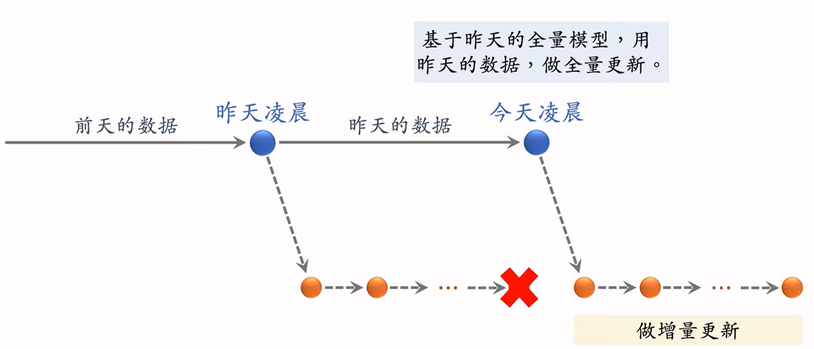 

#### 4) Can we rely only on incremental updates?

*   **No.** Incremental training processes data in **temporal order** (from morning to night), which introduces **order/batch bias**.
*   Full updates **randomly shuffle** a day’s data, yielding **better generalization**.
*   Therefore, **full training** remains necessary; incremental updates should be **additive**, not a replacement.

#### 5) Operational Checklist

*   **After training**:
    *   Compute and store **item vectors** in the vector DB.
    *   Build/refresh **ANN indexes** (e.g., IVF/HNSW/PQ variants).
*   **At request time**:
    *   Compute **user vector**; **L2‑normalize** if using cosine.
    *   Query **top‑k** by cosine; optionally **re‑rank** with exact cosine and business rules (diversity, freshness).
*   **Update cadence**:
    *   **Daily full** model refresh.
    *   **Frequent incremental** embedding refresh for user tower.

#### 6) Key Takeaways

*   Two‑tower recall = **user vector online** + **item vectors offline** + **ANN search with cosine**.
*   Use **full updates** for stability and **incremental updates** for responsiveness.
*   Combine **simple** and **hard** negatives in training; adopt **pointwise/pairwise/listwise** losses as appropriate for your objectives.
*   Keep infrastructure ready for **index rebuilds**, **feature freshness**, and **real‑time publishing** of **user ID embeddings**.

### 2.8 Two‑Tower Model + Self‑Supervised Learning (Google)

#### 1) Problem: Head vs. Long‑Tail

*   A small set of **hot items** gets most clicks ⇒ embeddings learn well for hot items.
*   **Long‑tail items** have few clicks ⇒ their representations are **under‑trained**.
*   Solution: improve representation quality for **low‑exposure** and **new** items via data augmentation in self-supervised learning.
*   Reference:  Tiansheng Yao et al. Self-supervised Learning for Large-scale Item Recommendations.
In CIKM, 2021.

#### 2) Recap: Listwise Training with In‑Batch Negatives

*   **Batch construction**: each batch contains multiple **positive** user–item pairs (clicked).
*   For a given user $u$ with its positive item $i^+$, the **other items** in the batch act as **negatives** $\{i^-_1, \dots, i^-_{m-1}\}$.
*   **Softmax + cross‑entropy** over the list (one positive, many negatives):
    $$
    \mathcal{L}_{\text{list}} = -\log \frac{\exp\big(\text{cos}(\mathbf{u}, \mathbf{v}_{i^+})\big)}
    {\sum_{j \in \{i^+\} \cup \{i^-_k\}} \exp\big(\text{cos}(\mathbf{u}, \mathbf{v}_{j})\big)}
    $$

    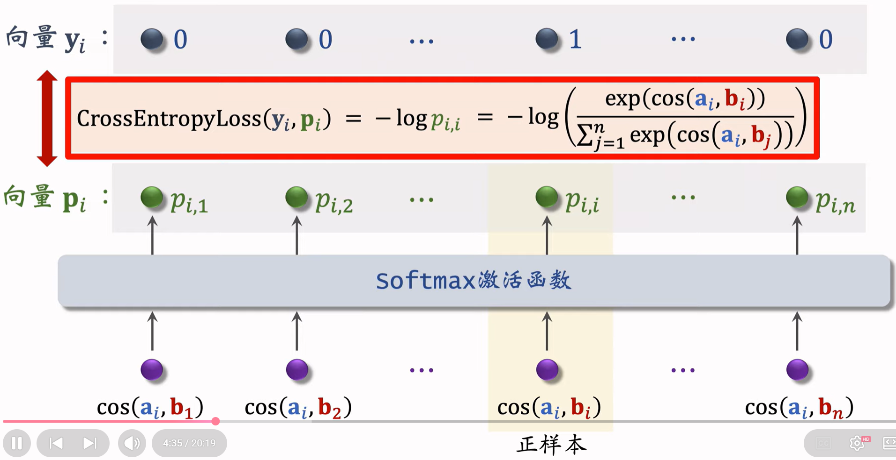 

*   **Sampling‑bias correction** for in‑batch negatives: adjust the score with item sampling probability $p_j$:
    $$
    \tilde{s}(u,j) = \text{cos}(\mathbf{u}, \mathbf{v}_{j}) - \log p_j
    $$
    and plug $\tilde{s}$ into the softmax.

#### 3) Self‑Supervised Learning (SSL) for Item Embeddings

**Idea**: create two **augmented views** of the **same item** via **feature transformations**, then **maximize** their similarity while **minimizing** similarity to other items (contrastive learning).

  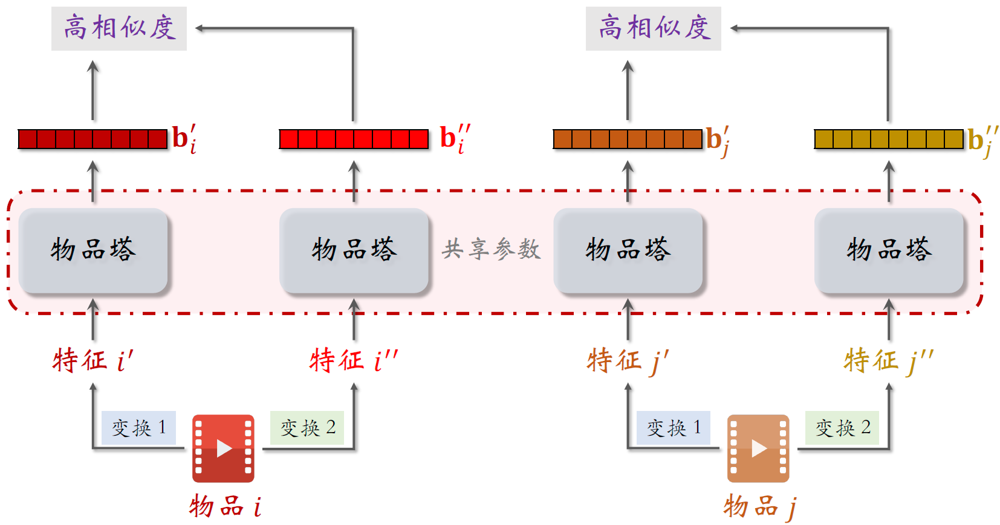 
  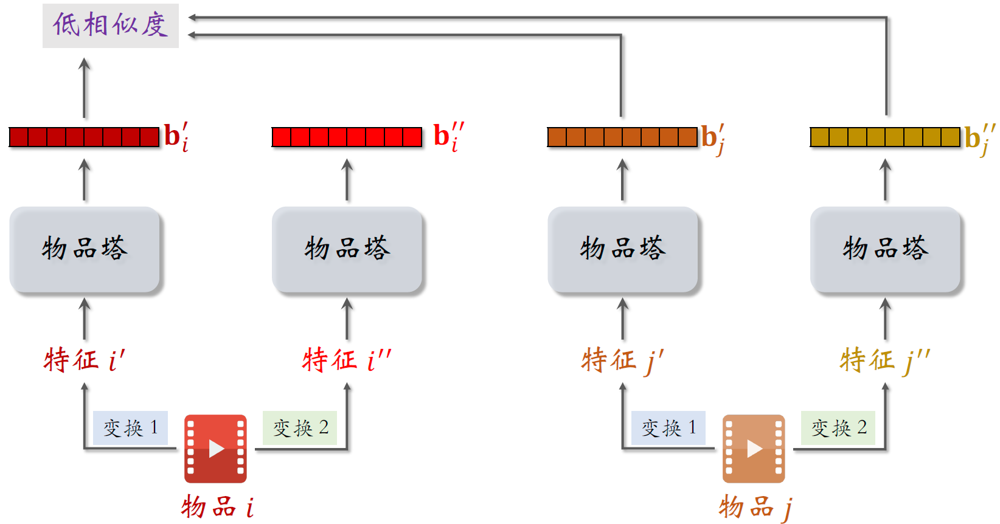  

**Contrastive Objective** (Item‑only tower):

*   For item $i$, produce two embeddings $\mathbf{v}_i^{(A)}$ and $\mathbf{v}_i^{(B)}$ via two separate augmentations.
*   Treat $(i^{(A)}, i^{(B)})$ as the **positive pair**; all other items’ views are **negatives**.
*   **Softmax + cross‑entropy**:
    $$
    \mathcal{L}_{\text{ssl}}(i) = -\log \frac{\exp\big(\text{cos}(\mathbf{v}_i^{(A)}, \mathbf{v}_i^{(B)})\big)}
    {\sum_{j} \exp\big(\text{cos}(\mathbf{v}_i^{(A)}, \mathbf{v}_j^{(B)})\big)}
    $$

**Feature Transformations** (Augmentations):

*   **Random Mask**: randomly mask selected **discrete features** (e.g., category) → replace with a **default** token.
*   **Dropout for multi‑valued discrete features**: randomly drop \~50% of values in a discrete feature (e.g., categories = {beauty, photo} → {beauty}).
*   **Complementary features**: split the feature set into two **complementary groups** (e.g., group A: {ID, keywords}; group B: {category, city}).
    *   Build two views using each group; **encourage** the two resulting vectors to be **similar** (same item).
*   **Mask correlated feature group**:
    *   Offline compute **feature–feature association** (e.g., via **mutual information**) and select a **seed** feature plus its top‑$k$ correlated features.
  
        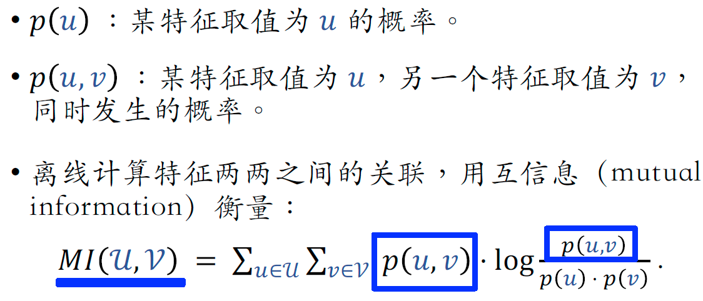 

    *   **Mask** the seed group in view A and **keep** the remaining features; vice versa for view B.
    *   **Pros**: better than random masks and simple dropout.
    *   **Cons**: more complex to implement and maintain.

#### 4) Training Procedure (Combined)

*   **Supervised two‑tower loss** (from clicks) over user–item pairs:
    $$
    \mathcal{L}_{\text{twotower}} = \sum_{(u,i)} \mathcal{L}_{\text{list}}(u,i)
    $$
*   **Self‑supervised item loss** (contrastive):
    $$
    \mathcal{L}_{\text{ssl}} = \sum_{i} \mathcal{L}_{\text{ssl}}(i)
    $$
*   **Total loss**:
    $$
    \mathcal{L} = \mathcal{L}_{\text{twotower}} + \lambda \cdot \mathcal{L}_{\text{ssl}}
    $$
    where $\lambda$ balances supervised and SSL signals.
*   **Batching**:
    *   From **click logs**, sample a batch of n user–item **positives** for the two‑tower listwise loss.
    *   From the **full item catalog**, sample a batch of m items uniformly; apply **two augmentations** to each for the SSL loss.

        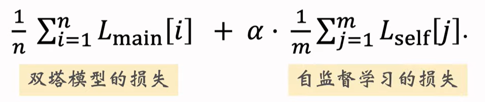  

#### 5) What Improves with SSL

*   **Low‑exposure (long‑tail) items**: stronger, more robust vectors due to augmentation‑based supervision.
*   **New items**: better cold‑start performance.
*   **Generalization**: item tower learns to be less reliant on a single feature and more on **multi‑feature consistency**.
*   Combine **supervised clicks** and **SSL augmentations** into a **single training regimen** for robust recall and better downstream ranking.

### 2.9 Deep Retrieval (TicTok)

### 2.10 Other Retrieval Channels: Geo, Author, Cache

### 2.11 Exposure Filter & Bloom Filter


## 3. Ranking

### 3.1 Multi‑Objective Ranking Model

#### 1) Interaction metrics tracked per item

*   **Impressions** (views)
*   **Clicks**
*   **Likes**
*   **Collects / Favorites**
*   **Shares**

From these, define stage‑wise rates:

*   **CTR** = clicks / impressions
*   **Like rate** = likes / clicks
*   **Collect rate** = collects / clicks
*   **Share rate** = shares / clicks

#### 2) Ranking model inputs & outputs

*   A **multi‑head neural network** outputs **four probabilities** per (user, item, context):
    *   $\hat{p}_{\text{click}}$ — CTR
    *   $\hat{p}_{\text{like} \mid \text{click}}$
    *   $\hat{p}_{\text{collect} \mid \text{click}}$
    *   $\hat{p}_{\text{share} \mid \text{click}}$

- **Inputs (features):**

  *   **User features** (profile, history)
  *   **Item features** (metadata, content descriptors)
  *   **Statistical features** (popularity, recency, RFM)
  *   **Context features** (device, time, placement, traffic source)

- Architecture pattern:

  Concatenate features → shared towers/layers (i.e. wide & deep) → **task‑specific heads** (Dense + Sigmoid per objective).

    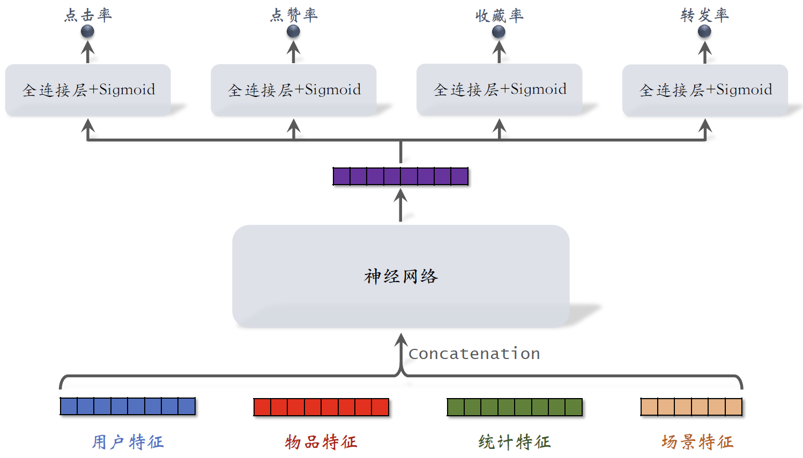  

#### 3) Training objective (multi‑task)

*   Each head uses **binary cross‑entropy** with labels $y_t \in \{0,1\}$:
    $$
    \mathcal{L}_t = -\,y_t \log \hat{p}_t - (1-y_t) \log (1-\hat{p}_t)
    $$
*   Total loss is a **weighted sum** across tasks:
    $$
    \mathcal{L} = \sum_{t \in \{\text{click}, \text{like}|c, \text{collect}|c, \text{share}|c\}} 
    \lambda_t \,\mathcal{L}_t
    $$
*   Optimize with **gradient descent** over impression‑level samples.

#### 4) Class imbalance & downsampling

*   Reality:
    *   **Clicks are sparse** relative to impressions.
    *   **Likes/collects/shares are even sparser** relative to clicks.
*   Practical fix: **negative downsampling**
    *   Keep all positives.
    *   Retain only a fraction $s \in (0,1]$ of negative samples to balance classes and reduce training cost.

#### 5) Probability calibration after downsampling

Downsampling changes **class priors**, so raw head outputs overestimate true probabilities.  
*   **True CTR (expected):**
    $$
    p_{\text{true}} \;=\; \frac{n_{+}}{\,n_{+} + n_{-}\,}
    $$
    where $n_{+}$ = number of positive samples (clicks), $n_{-}$ = number of negative samples (non‑clicks).

*   **Predicted CTR under downsampling (expected):**
    $$
    p_{\text{pred}} \;=\; \frac{n_{+}}{\,n_{+} + \alpha\,n_{-}\,}
    $$
    where $\alpha \in (0,1]$ is the **negative downsampling rate** (fraction of negatives kept).

*   **Calibration formula (derived from the two equations above):**
    $$
    p_{\text{true}} \;=\; \frac{\alpha\,p_{\text{pred}}}{(1 - p_{\text{pred}}) \;+\; \alpha\,p_{\text{pred}}}
    $$

    Reference: Xinran He et al. Practical lessons from predicting clicks on ads at Facebook. In the 8th International Workshop on Data Mining for Online Advertising.

Equivalent calibration by **adjusting log-odds (logits)** before the sigmoid:

*   Let $\text{odds}'=\hat{p}'/(1-\hat{p}')$ and $\ell'=log(odds')$. 
*   Downsampling negatives by $s$ scales the odds by $s$: $\text{odds} = s\cdot \text{odds}'$ 
*   The **calibrated logit** is:
    $$
    \ell = \ell' + \log s
    $$
*   The **calibrated probability** is $\hat{p} = \sigma(\ell)$, where $\sigma(\cdot)$ is the sigmoid.
*   Equivalent form using probabilities:
    $$
    \hat{p} \;=\; \frac{\hat{p}'}{\hat{p}' + \frac{1-\hat{p}'}{s}}
    $$

This ensures the estimated CTR (and other rates) reflect **true event frequencies** under original class priors.

#### 6) How to combine multiple objectives

*   Compute a **fusion score** (e.g., weighted sum or learned aggregator):
    $$
    \text{Fusion}(u,i) = w_c \,\hat{p}_{\text{click}} + w_l \,\hat{p}_{\text{like} \mid \text{click}}
    + w_f \,\hat{p}_{\text{collect} \mid \text{click}} + w_s \,\hat{p}_{\text{share} \mid \text{click}}
    $$
*   Use this fusion score to **sort** and **truncate** the candidate list.
*   Optionally add **business constraints** (diversity, fairness, safety, caps) in a re‑ranking stage.


#### 7) Takeaways

*   **Multi‑objective** ranking predicts several stage‑wise probabilities and fuses them to order candidates.
*   **Downsampling** makes training tractable but **requires calibration** to recover true probabilities.
*   Strong production performance comes from: **clean features**, **proper task weights**, **correct calibration**, and **policy‑aware re‑ranking**.

### 3.2 Multi-gate Mixture of Experts (MMoE)

#### 1) What MMoE is

*   **Purpose**: A multi‑task learning architecture that lets different tasks (e.g., CTR, Like‑rate) **share** several expert sub‑networks but **mix** them differently per task.
*   **Key idea**: Multiple **experts** (small neural networks) process the same input features; each **task‑specific gate** (a Softmax network) produces weights to form a **weighted combination** of expert outputs for that task.

#### 2) Architecture

  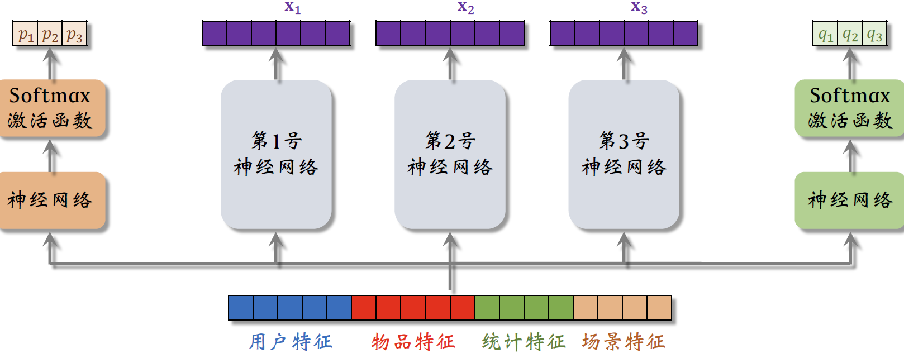  

*   **Feature groups**:
    *   **Item features**
    *   **User features**
    *   **Statistical features** (popularity, recency, counts, etc.)
    *   **Context/scene features** (placement, device, time)
*   **Experts**: $E_1, E_2, E_3$ (illustrated as three networks in the slides) each receives the **concatenated features** and outputs a vector $\mathbf{h}_k$.

- Task‑specific gates (Softmax) and mixing

  For each task $t$ (e.g., click vs. like):

  1.  A **gate network** produces a **Softmax** weight vector $\mathbf{w}^{(t)} = \text{softmax}(\mathbf{a}^{(t)}) \in \mathbb{R}^K$ over the $K$ experts.
  2.  The task’s mixed representation is the **weighted average**:
    $$
    \mathbf{z}^{(t)} \;=\; \sum_{k=1}^{K} w_k^{(t)} \, \mathbf{h}_k
    $$
  3.  Each task then feeds $\mathbf{z}^{(t)}$ into a **task head** (e.g., Dense + Sigmoid) to output the task’s probability (CTR, Like‑rate, etc.).

  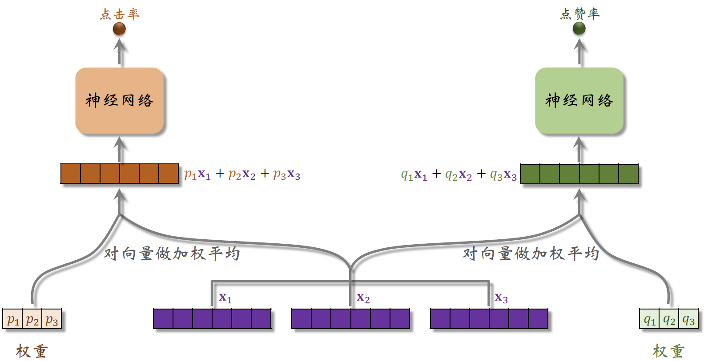  

  > Visual intuition from the slides: **two task gates** (for CTR and Like) each compute weights over the **same three experts**, then each task forms its own mixed vector and passes it to its **own head**.

- Example flow (two tasks: CTR & Like)

  1.  **Concatenate features** → feed into **experts** $E_1, E_2, E_3$ → get $\mathbf{h}_1, \mathbf{h}_2, \mathbf{h}_3$.
  2.  **CTR gate (Softmax)** → weights $\mathbf{w}^{(\text{CTR})}$.  
    **CTR mix**: $\mathbf{z}^{(\text{CTR})} = \sum_k w_k^{(\text{CTR})}\mathbf{h}_k$ → **CTR head** → $\hat{p}_{\text{click}}$.
  3.  **Like gate (Softmax)** → weights $\mathbf{w}^{(\text{Like})}$.  
    **Like mix**: $\mathbf{z}^{(\text{Like})} = \sum_k w_k^{(\text{Like})}\mathbf{h}_k$ → **Like head** → $\hat{p}_{\text{like}\mid\text{click}}$.

#### 3) Polarization phenomenon (gate collapse)

*   **Observed issue**: The **Softmax gate** for a task can **polarize**, outputting **one weight near 1** while the others are **near 0**.
*   **Consequences**:
    *   The task effectively uses **only one expert**.
    *   Other experts become **under‑utilized** (“dead” experts for that task).
    *   **Multi‑task sharing benefits diminish**, hurting generalization.

    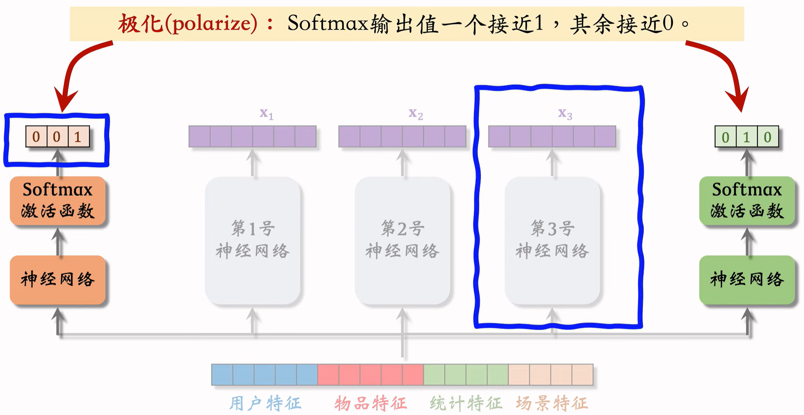

#### 4) Fixing polarization (training‑time regularization)

*   **Dropout on gate outputs**:
    *   With $K$ experts, each gate produces a $K$-dimensional Softmax vector.
    *   During training, **randomly mask** each gate weight with **≈10% probability**.
    *   Effect: each expert has a **\~10% chance** to be **dropped** for that step, forcing the gate to distribute mass across remaining experts and **prevent collapse**.
*   **Outcome**:
    *   Encourages **expert diversity** and **robust mixing**.
    *   Reduces the risk of single‑expert domination across tasks.

Reference:

1. Google Paper invented MMoE: Jiaqi Ma et al. Modeling Task Relationships in Multi-task Learning with Multi-gate Mixture-of-Experts. InKDD, 2018.
2. Youtube Paper Proposed fix: Zhe Zhao et al. Recommending What Video to Watch Next: A Multitask Ranking System. In RecSys, 2019.

#### 5) Quick summary

*   **MMoE**: shared **experts**, **task‑specific gates**, **task heads**.
*   **Problem**: gate **polarization** leads to **dead experts** and weak sharing.
*   **Fix**: **dropout** on gate outputs (≈10% mask), plus regularization to **promote diversity**.
*   **Result**: better **multi‑task performance** across CTR, Like‑rate, etc., with more **balanced expert usage**.
*   In practice, using MMoE does not always lead to improved performance for many reasons i.e. implementation, suitability, etc. 

### 3.3 Fusion of Predicted Scores for Ranking

#### 1) Goal & Inputs

*   **Goal**: Combine multiple predicted signals (e.g., click, like, collect, share, watch‑time) into a **single fusion score** for ordering candidates.
*   **Stage‑wise rates used in fusion** often include:
    *   **CTR** = #clicks / #impressions
    *   **Like rate** = #likes / #clicks
    *   **Collect rate** = #collects / #clicks
    *   **Share rate** = #shares / #clicks 

#### 2) Basic Fusion Patterns

- Simple weighted sum

  $$
  \text{Fusion} = w_c \,\hat{p}_{\text{click}} \;+\; w_l \,\hat{p}_{\text{like}\mid\text{click}} \;+\; w_f \,\hat{p}_{\text{collect}\mid\text{click}} \;+\; w_s \,\hat{p}_{\text{share}\mid\text{click}} \;+\; \cdots
  $$

  Use task weights $w_\cdot$ to reflect business priorities; sort by the Fusion score. 
- CTR‑anchored multiplicative blend

  $$
  \text{Fusion} = \hat{p}_{\text{click}} \times \Big(1 \;+\; w_l \,\hat{p}_{\text{like}\mid\text{click}} \;+\; w_f \,\hat{p}_{\text{collect}\mid\text{click}} \;+\; w_s \,\hat{p}_{\text{share}\mid\text{click}} \;+\; \cdots \Big)
  $$

  This treats CTR as the base engagement, then boosts by downstream rates.


#### 3) Domain Examples

1. Short‑video app: multiplicative stacking

     $$
     (1+w_1\cdot p_{time})^{\alpha_1} \cdot (1+w_2\cdot p_{like})^{\alpha_2}  ...
     $$
     
     A fusion score constructed by **multiplying** several “$1 + \text{weight} \times \text{metric}$” terms (e.g., watch‑time, interactions), yielding a compounded boost across metrics. While exact symbols are abbreviated in the slide OCR, the pattern shown is multiplicative stacking of transformed metrics. 

2. Short‑video app: rank‑based transforms + weighted sum

   *   **Step 1:** Sort candidates by **predicted watch‑time** and assign a **rank‑based score** to each (e.g., a decreasing function of rank).
   *   **Step 2:** Do similar **rank‑based scoring** for **click, like, share, comment** predictions. 
   *   **Step 3:** Compute the **final fusion** as a **weighted sum** of these rank‑based scores across metrics.
  
         $$
         \frac{w_1 }{r^{\alpha_1}_{time}+\beta_1} + \frac{w_2 }{r^{\alpha_2}_{click}+\beta_2} + \frac{w_3 }{r^{\alpha_3}_{like}+\beta_3} + ...
         $$ 
      
        where $\alpha$ and $\beta$ are hyperparameters
  
3. E‑commerce: expected revenue / GMV style

    For a funnel **exposure → click → add‑to‑cart → payment**, use model predictions for each step and **price** to form an expected‑value fusion:

      $$
      \text{Fusion} \;=\; \hat{p}_{\text{click}}^{\alpha_1} \times \hat{p}_{\text{add\_to\_cart}\mid\text{click}}^{\alpha_2} \times \hat{p}_{\text{payment}\mid\text{add\_to\_cart}}^{\alpha_3} \times \text{price}^{\alpha_4}
      $$

      where $\alpha$ are hyperparameters, and when they equals to 1, the score is essentially the revenue.

      This prioritizes items with high predicted conversion probability and value. 

#### 4) Practical Notes (from the slide context)

*   **Choose weights** $w_\cdot$ to align with objectives (e.g., watch‑time vs. interaction richness); tune via online experiments. 
*   **Rank‑based transformations** can stabilize fusion across heterogeneous scales by converting raw predictions into **position‑dependent scores**, then combining.
*   **Multiplicative stacking** emphasizes candidates strong on **multiple** metrics simultaneously; use with care to avoid exploding scores. 

### 3.4 Video Playing 


