### Background: What and Why

Two kinds of recommendations are commonly used:

- Homepage recommendations

    Homepage recommendations are personalized to a user based on their known interests. Every user sees different recommendations.

    i.e. Google Play Apps homepage "Recommended for You" Section

- Related item recommendations

    Related items are recommendations similar to a particular item. In the Google Play apps example, users looking at a page for a math app may also see a panel of related apps, such as other math or science apps.

The purpose of a Recommendation System is to help users find compelling content in a large corpus and engage more with the application. 

For example, 40% of app installs on Google Play come from recommendations. 60% of watch time on YouTube comes from recommendations.

### Background: Terminology

- Items (also as documents): The entities a system recommends. For the Google Play store, the items are apps to install. For YouTube, the items are videos.
- Query (also known as context): The information a system uses to make recommendations. 
  
  Queries can be a combination of the following:
  - user information
    - the id of the user
    - items that users previously interacted with
  - additional context
    - time of day
    - the user's device

- Embedding: A mapping from a discrete set (in this case, the set of queries, or the set of items to recommend) to a vector space called the embedding space. 
  
  Many recommendation systems rely on learning an appropriate embedding representation of the queries and items.

### Common architecture Overview
One common architecture for recommendation systems consists of the following components:

**Candidate Generation &rarr; Scoring &rarr; Re-ranking**

1. Candidate generation: the system starts from a potentially huge corpus and generates a much smaller subset of candidates.

    For example, the candidate generator in YouTube reduces billions of videos down to hundreds or thousands. 
    
    The model needs to evaluate queries quickly given the enormous size of the corpus. A given model may provide multiple candidate generators, each nominating a different subset of candidates.

2. Scoring: another model scores and ranks the candidates in order to select the set of items (on the order of 10) to display to the user. 

    Since this model evaluates a relatively small subset of items, the system can use a more precise model relying on additional queries.

3. Re-ranking: the system must take into account additional constraints for the final ranking. 

    For example, the system removes items that the user explicitly disliked or boosts the score of fresher content. Re-ranking can also help ensure diversity, freshness, and fairness.

### First Stage: Candidate Generation

- Two common approaches:

| Type | Definition | Example |
|----| -----| -----|
|content-based filtering|	Uses **similarity between items** to recommend items similar to what the user likes.|	If user A watches two cute cat videos, then the system can recommend cute animal videos to that user.|
|collaborative filtering|	Uses **similarities between queries and items** simultaneously to provide recommendations.|	If user A is similar to user B, and user B likes video 1, then the system can recommend video 1 to user A (even if user A hasn’t seen any videos similar to video 1).|

- Embedding Space

    Both content-based and collaborative filtering map each item and each query (or context) to an embedding vector in a common embedding space $E=R^d$. 
    
    Typically, the embedding space is low-dimensional (that is, $d$
 is much smaller than the size of the corpus), and captures some latent structure of the item or query set. 
 
    Similar items, such as YouTube videos that are usually watched by the same user, end up close together in the embedding space. The notion of "closeness" is defined by a similarity measure.

- Similarity Measures

    A similarity measure is a function $s: E \times E$ &rarr; $R$ that takes a pair of embeddings and returns a scalar measuring their similarity. 

    Embeddings can be used for candidate generation as follows:

    Given a query embedding $q \in E$, the system looks for item embeddings $x \in E$ that are close to $q$, that is, embeddings with high similarity $s(q,x)$

    Common choices of similarity measure:
    - Cosine: $s(q,x)=cos(q,x)$, cosine of the angle between two vectors 
    - Dot product: 
      - $s(q,x)=\sum^d_{i=1}q_ix_i$, 
      - also given by $s(q,x)=||x||||q||cos(q,x)$, the cosine of the angle multiplied by the product of norms
      - if the embeddings are normalized, then dot-product and cosine coincide.
    - Euclidean distance: 
      - $s(q,x)=||q-x||=[\sum^d_{i=1}(q_i-x_i)^2]^{1/2}$
      - A smaller distance means higher similarity.
      - when the embeddings are normalized, the squared Euclidean distance coincides with dot-product (and cosine) up to a constant, since in that case $1/2||q-x||^2=1-||x||||q||cos(q,x)$
  
- Which similarity measure?

  Example: 

    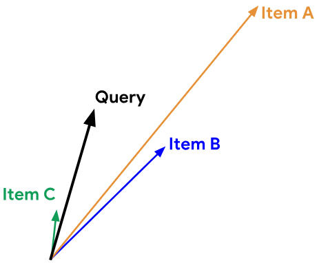
    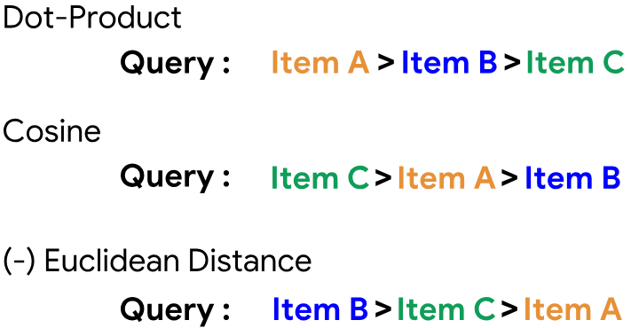  

    - Item A has the highest norm, and is ranked higher according to the dot-product.
    - Item C has the smallest angle with the query, and is ranked first based on the cosin similarity
    - Item B is physically closest to the query so Euclidean distance favors it.

  Compared to the cosine, the **dot product similarity is sensitive to the norm of the embedding**. That is, the larger the norm of an embedding, the higher the similarity (for items with an acute angle) and the more likely the item is to be recommended. This can affect recommendations as follows:
    - **Items that appear very frequently** in the training set (for example, popular YouTube videos) tend to have embeddings with **large norms**. If capturing **popularity information** is desirable, then you should prefer dot product.
    - However, if you're not careful, the popular items may end up dominating the recommendations. In practice, you can use other variants of similarity measures that put less emphasis on the norm of the item. i.e. $s(q,x)=||x||^a||q||^acos(q,x)$ for some $a \in (0,1)$
    - Items that appear very rarely may not be updated frequently during training. Consequently, if they are initialized with a large norm, the system may recommend rare items over more relevant items. To avoid this problem, be careful about **embedding initialization**, and use **appropriate regularization**. 

#### Content-based Filtering
----

  Content-based filtering uses **item features** to recommend other items similar to what the user likes, based on their previous actions or explicit feedback.

  1. Pick a similarity metric
  2. Set up the system to score each candidate item according to this similarity metric
  3. Note that the recommendations are specific to this user, as the model did not use any information about other users.

- Advantages
  - The model **doesn't need any data about other users**, since the recommendations are specific to this user. This makes it easier to scale to a large number of users.
  - The model can **capture the specific interests of a user**, and can recommend niche items that very few other users are interested in.

- Disadvantages

  - Since the feature representation of the items are hand-engineered to some extent, this technique **requires a lot of domain knowledge**. Therefore, the model can only be as good as the **hand-engineered features**.
  - The model can only make recommendations based on existing interests of the user. In other words, the model has **limited ability to expand on the users' existing interests**.

#### Collaborative Filtering
----

To address some of the limitations of content-based filtering, collaborative filtering uses **similarities between users and items simultaneously** to provide recommendations. 

This allows for serendipitous recommendations; that is, collaborative filtering models can **recommend an item to user A based on the interests of a similar user B**. Furthermore, the **embeddings can be learned automatically**, without relying on hand-engineering of features.

- Movie recommendation example:

  Consider a movie recommendation system in which the training data consists of a **feedback matrix** in which:
  - Each row represents a user.
  - Each column represents an item (a movie).

  The feedback about movies falls into one of two categories:
  - Explicit — users specify how much they liked a particular movie by providing a numerical rating.
  - Implicit — if a user watches a movie, the system infers that the user is interested.

  To simplify, we will assume that the feedback matrix is binary; that is, a value of 1 indicates interest in the movie.

  When a user visits the homepage, the system should recommend movies based on both:
  - similarity to movies the user has liked in the past
  - movies that similar users liked

  For each (user, item) pair, we would like the dot product of the user embedding and the item embedding to be close to 1 when the user watched the movie, and to 0 otherwise.

   

  Note: We represented both items and users in the same embedding space. This may seem surprising. After all, users and items are two different entities. However, you can think of the embedding space as an abstract representation common to both items and users, in which we can measure similarity or relevance using a similarity metric.

In practice, the embeddings can be learned automatically, which is the power of collaborative filtering models.

The collaborative nature of this approach is apparent when the model learns the embeddings. Suppose the embedding vectors for the movies are fixed. Then, the model can learn an embedding vector for the users to best explain their preferences. Consequently, embeddings of users with similar preferences will be close together. 

Similarly, if the embeddings for the users are fixed, then we can learn movie embeddings to best explain the feedback matrix. As a result, embeddings of movies liked by similar users will be close in the embedding space.

#### Matrix Factorization (Technique for Collaborative Filtering)
----
  
Matrix factorization is a simple **embedding model**. **Given the feedback matrix $A \in R^{m \times n}$**, where $m$ is the number of users (or queries) and $n$ is the number of items, the model learns:
  - A user embedding matrix $U \in \reals^{m\times d}$, where row i is the embedding for user i.
  - An item embedding matrix $V \in \reals^{n\times d}$, where row j is the embedding for item j.

  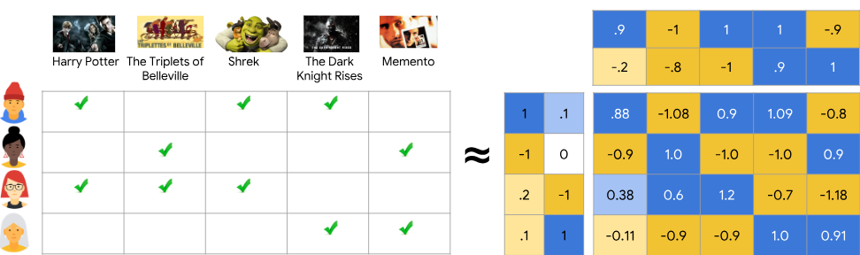 

The embeddings are learned such that **the product $UV^T$ is a good approximation of the feedback matrix A**. Observe that the $(i,j)$ entry of $UV^T$ is simply the dot product $u_i\cdot v_i$ of the embeddings of user $i$ and item $j$, which you want to be close to $A_{ij}$.

Note: Matrix factorization typically gives a **more compact representation** than learning the full matrix. The full matrix has $O(nm)$ entries, while the embedding matrices $U, V$ have $O((n+m)d)$ entries, where the embedding dimension $d$ is typically much smaller than $m$ and $n$. As a result, matrix factorization finds latent structure in the data, assuming that observations lie close to a low-dimensional subspace. 

- Choosing the objective function

  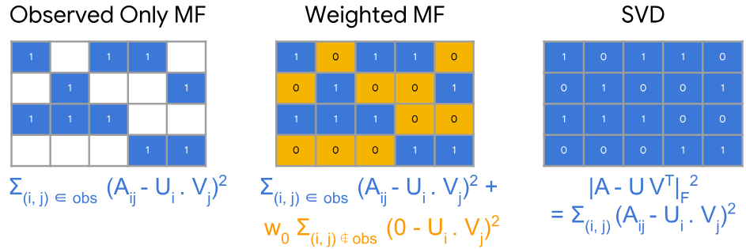 

  - **Observed Only MF**: One intuitive objective function is the squared distance. To do this, minimize the sum of squared errors over all pairs of observed entries:

    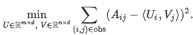

    In this objective function, you only sum over observed pairs (i, j), that is, over non-zero values in the feedback matrix. 
  
    However, only summing over values of one is not a good idea — a matrix of all ones will have a minimal loss and produce a model that can't make effective recommendations and that generalizes poorly.

  
  - Perhaps you could treat the unobserved values as zero, and sum over all entries in the matrix. This corresponds to minimizing the squared Frobenius distance between $A$ and its approximation $UV^T$: 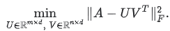

    You can solve this quadratic problem through **Singular Value Decomposition (SVD)** of the matrix. 
  
    However, SVD is not a great solution either, because in real applications, the matrix may be very sparse. The solution $UV^T$ (which corresponds to the model's approximation of the input matrix) will likely be close to zero, leading to poor generalization performance.

  - In contrast, **Weighted Matrix Factorization** decomposes the objective into the following two sums:
    - A sum over observed entries.
    - A sum over unobserved entries (treated as zeroes).

    

    $w_0$ is a hyperparameter that weights the two terms so that the objective is not dominated by one or the other. Tuning this hyperparameter is very important.

  - In practical applications, you also need to weight the observed pairs carefully. For example, frequent items (for example, extremely popular YouTube videos) or frequent queries (for example, heavy users) may dominate the objective function. You can correct for this effect by **weighting training examples to account for item frequency**. In other words, you can replace the objective function by: 

     

    where $w_{i,j}$ is a function of the frequency of query i and item j.

- Minimizing the objective function

  Common algorithms to minimize the objective function include:
  - **Stochastic gradient descent (SGD)** is a generic method to minimize loss functions.
  - **Weighted Alternating Least Squares (WALS)** is specialized to this particular objective.

  The objective is **quadratic in each** of the two matrices U and V (and hence convex in each matrix separately). However, the problem is **not jointly convex** (the interaction between U and V through products like $UV^T$ introduces non-convexity). Hence we cannot guarantee finding a global minimum using standard convex optimization techniques.

  &rarr; Due to the inidividual convexity (in U or V), **alternating minimization** (fix one and solve for the other) often works well in practice.
  
  WALS works by initializing the embeddings randomly, then alternating between:
  - Fixing U and solving for V
  - Fixing V and solving for U

  Each stage can be solved exactly (via solution of a linear system) and can be distributed. This technique is guaranteed to converge because each step is guaranteed to decrease the loss.

  | Optimization Technique | Loss Functions | Parallelized | Convergence | Unobserved Entries|
  |---| ----| ---| ---| ---|
  |SGD | Very flexible—can use other loss functions | Can be parallelized | Slower—does not converge as quickly | Harder to handle the unobserved entries (need to use **negative sampling** or gravity) |
  | WALS| Reliant on Loss Squares only | Can be parallelized | Converges faster than SGD | Easier to handle unobserved entries |

Collaborative filtering Pros & Cons:

- Advantages
  - **No domain knowledge necessary**: We don't need domain knowledge because the embeddings are automatically learned.
  - **Serendipity**: The model can help users discover new interests. In isolation, the ML system may not know the user is interested in a given item, but the model might still recommend it because similar users are interested in that item.
  - **Great starting point**: To some extent, the system needs only the feedback matrix to train a matrix factorization model. In particular, the system doesn't need contextual features. *In practice, this can be used as one of multiple candidate generators.*

- Disadvantages
  - **Cannot handle fresh items**: if an item is not seen during training, the system can't create an embedding for it and can't query the model with this item. This issue is often called the **cold-start problem**.

    Some workarounds:

     
  - **Hard to include side features for query/item**: Including available side features could improve the quality of the model. 
  
    Although it may not be easy to include side features in WALS, a generalization of WALS makes this possible.

    To generalize WALS, **augment the input matrix with features** by defining a block matrix $\bar{A}$, where:
    - Block (0,0) is the original feedback matrix $A$
    - Block (0,1) is a multi-hot encoding of the user features
    - Block (1, 0) is a multi-hot encoding of the item features

    Note: Block (1, 1) is typically left empty. If you apply matrix factorization to $\bar{A}$, then the system learns embeddings for side features, in addition to user and item embeddings.

#### Recommendation using Deep Neural Network Models
-----

Deep neural network (DNN) models can address some limitations of matrix factorization, like the difficulty of using side features, and capturing specific user interests. DNNs can easily incorporate query features and item features (due to the flexibility of the input layer of the network), which can help capture the specific interests of a user and improve the relevance of recommendations.

- Softmax DNN for Recommendation:

  One possible DNN model is **softmax**, which treats the problem as a multiclass prediction problem in which:
  - The input is the user query.
  - The output is a probability vector with size equal to the number of items in the corpus, representing the **probability to interact with each item**; for example, the probability to click on or watch a YouTube video.

- DNN Model Input can include:

  - Dense features (for example, watch time and time since last watch)
  - Sparse features (for example, watch history and country)

  Unlike the matrix factorization approach, you can add side features such as age or country. We'll denote the input vector by x.

- Model Architecture

  - Determines the complexity and expressivity of the model
  - By adding hidden layers and non-linear activation functions (i.e. ReLU), the model can capture more complex relatinoships in the data.
  - But increasing the number of parameters also typically makes the model harder to train and serve.

- Softmax Output: Predicted Probability Distribution

  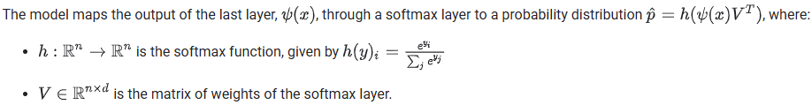 

  The softmax layer maps a vector of scores $y \in \reals^n$ (sometimes called the logits) to a probability distribution.

  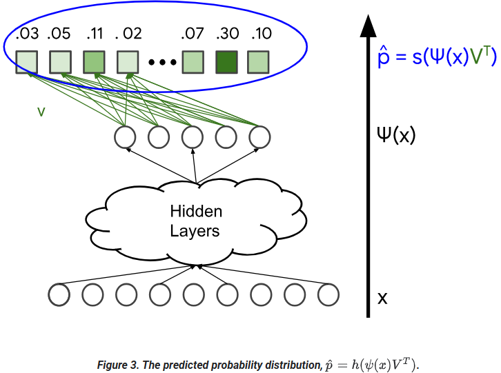  

  Note: The name softmax is a play on words. A "hard" max assigns probability 1 to the item with the largest score. By contrast, the softmax assigns a non-zero probability to all items, giving a higher probability to items that have higher scores.

- Loss Function 
  
  Defined to compared the following:
  - $\hat p$: the output of the softmax layer (a probability distribution)
  - $p$: the ground truth, representing the items the user has interacted with (for example, YouTube videos the user clicked or watched). This can be represented as a **normalized multi-hot distribution** (a probability vector).
  
  For example, **cross-entropy loss** can be used to compare two probability distributions.

- Softmax Embeddings
  
  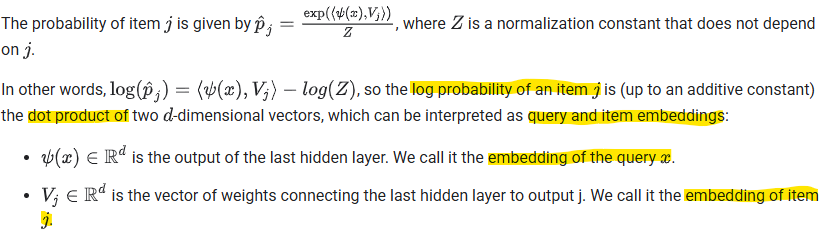  

  Note: Since log is an increasing function, items j with the highest probability $\hat p_j$ are the items with the highest dot product $\psi(x)\cdot V_j$. Therefore, the dot product can be interpreted as a similarity measure in this embedding space.

  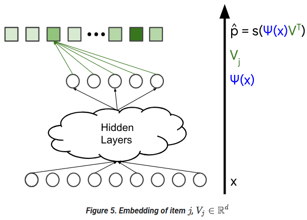  

- Embeddings in DNN and Matrix Factorization

  - Query Embeddings: 
    - MF learns one embedding $U_i$ per query i
    - DNN learns a mapping from the query feature x to an embedding $\psi(x) \in \reals^d$.
    - You can think of this DNN model as a generalization of matrix factorization, in which you replace the query side by a nonlinear function $\psi(\cdot)$.

  - Item Embeddings:
    - In both the softmax model and the matrix factorization model, the system learns **one embedding vector $V_j$ per item j**. What we called the item embedding matrix $V \in \reals^{n\times d}$ in matrix factorization is now the **matrix of weights of the softmax layer**.

- Can you use item features? 

  Can you apply the same idea to the item side? That is, instead of learning one embedding per item, can the model learn a nonlinear function that maps item features to an embedding?
  
  &rarr; Yes. To do so, use a **two-tower neural network**, which consists of two neural networks:
  - One NN maps query features $x_{query}$ to query embedding $\psi(x_{query}) \in \reals^d$
  - One NN maps query features $x_{item}$ to item embedding $\phi(x_{item}) \in \reals^d$
  
  The output of the model can be defined as the dot product of $\psi(x_{query}) \cdot \phi(x_{item})$. Note that this is not a softmax model anymore. The new model predicts one value per pair ($x_{query}$, $x_{item}$) instead of a probability vector for each query $x_{query}$.

- Softmax Model Training

  The softmax training data consists of the query features $x$ and a vector of items the user interacted with (represented as a probability distribution $p$). These are marked in blue in the following figure. 
  
  The variables of the model are the weights in the different layers. These are marked as orange in the following figure. 
  
  The model is typically trained using any variant of stochastic gradient descent.

  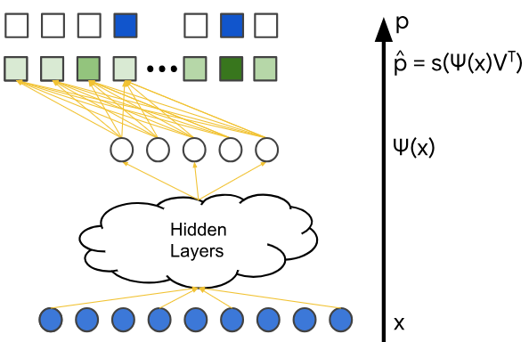 

  - Computational Issue and Folding

    Since the loss function compares two probability vectors $p, \hat p(x) \in \reals^n$ (the ground truth and the output of the model, respectively), computing the gradient of the loss (for a single query $x$) can be prohibitively **expensive if the corpus size $n$ is too big**.

    Naive idea: compute gradients only on the positive items (items that are active in the ground truth vector)

    &rarr; However, **if the system only trains on positive pairs, the model may suffer from folding**, as explained below.

    In the following figure, assume that each color represents a different category of queries and items. Each query (represented as a square) only mostly interacts with the items (represented as a circle) of the same color. For example, consider each category to be a different language in YouTube. A typical user will mostly interact with videos of one given language.

    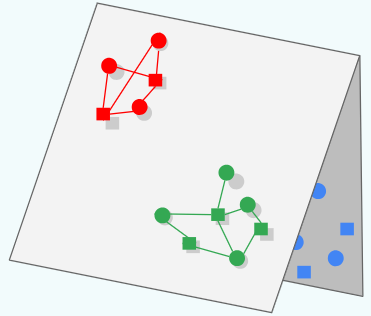 

    The model may learn how to place the query/item embeddings of a given color relative to each other (**correctly capturing similarity within that color**), **but embeddings from different colors may end up in the same region** of the embedding space, by chance. 

    &rarr; known as **folding**, can lead to spurious recommendations: at query time, the model may **incorrectly predict a high score for an item from a different group**.

  - Solution: **Negative Sampling**

    Negative examples are items labeled "irrelevant" to a given query. Showing the model negative examples during training teaches the model that embeddings of different groups should be pushed away from each other.

    Instead of using all items to compute the gradient (which can be too expensive) or using only positive items (which makes the model prone to folding), you can use negative sampling. 
    
    More precisely, you compute an approximate gradient, using the following items:
    - All positive items (the ones that appear in the target label)
    - A sample of negative items ($j$ in 1,...,$n$)
  
    There are different strategies for sampling negatives:
    - You can sample **uniformly**.
    - You can give higher probability to items j with higher score $\psi(x)\cdot V_j$. Intuitively, these are examples that contribute the most to the gradient; these examples are often called **hard negatives**.
  - Further Readings
    - [Deep Neural Networks for YouTube Recommendations](https://research.google/pubs/deep-neural-networks-for-youtube-recommendations/)
    - [Folding: Why Good Models Sometimes Make Spurious Recommendations](https://dl.acm.org/doi/10.1145/3109859.3109911)
  
- Training Comparison: MF versus Softmax

| | Matrix Factorization | Softmax DNN |
|----|---|---|
|Query Features| Mot easy to include | Can be included|
|Cold start | Does not easily handle out-of vocab queries or items. Some heuristics can be used (for example, for a new query, average embeddings of similar queries). | Easily handles new queries.|
|Folding | Folding can be **easily reduced by adjusting the unobserved weight in WALS.** | **Prone to folding. Need to use techniques such as negative sampling or gravity.**|
|Training scalability | **Easily scalable to very large corpora** (perhaps hundreds of millions items or more), but only if the input matrix is sparse. | **Harder to scale to very large corpora**. Some techniques can be used, such as hashing, negative sampling, etc.|
|Serving scalability | Embeddings U, V are static, and a set of candidates can be pre-computed and stored. | Item embeddings V are static and can be stored. The query embedding usually needs to be computed at query time, making the model more expensive to serve.|

  In summary:
  - **Matrix factorization is usually the better choice for large corpora**. It is easier to scale, cheaper to query, and less prone to folding.
  - **DNN models can better capture personalized preferences, but are harder to train and more expensive to query**. DNN models are preferable to matrix factorization for scoring because DNN models can use more features to better capture relevance. Also, it is **usually acceptable for DNN models to fold**, since you mostly care about **ranking a pre-filtered set of candidates assumed to be relevant**.

#### Retrieval: Suppose you have an embedding model. Given a query, how would you decide which items to recommend?

- At serve time, given a query, you start by doing one of the following:

  - For a matrix factorization model, the query (or user) embedding is known statically, and the system can simply look it up from the user embedding matrix.
  - For a DNN model, the system computes the query embedding $\psi(x)$ at serve time by running the network on the feature vector $x$.

- Once you have the query embedding $q$. search for item embeddings $V_j$ that are close to $q$ in the embedding space. This is a nearest neighbor problem. For example, you can return the top k items according to the similarity score $s(q, V_j)$.

#### Large-scale retrieval

To compute the nearest neighbors in the embedding space, the system can exhaustively score every potential candidate. Exhaustive scoring can be expensive for very large corpora, but you can use either of the following **strategies to make it more efficient**:

- If the query embedding is known statically, the system can perform exhaustive **scoring offline**, precomputing and storing a list of the top candidates for each query. This is a **common practice for related-item recommendation**.
- Use **approximate nearest neighbors**. Google provides an open-source tool on GitHub called **ScaNN** (Scalable Nearest Neighbors). This tool performs efficient vector similarity search at scale.

### Second Stage: Scoring

#### Overview

After candidate generation, **another model scores and ranks the generated candidates** to select the set of items to display. The recommendation system may have **multiple candidate generators** that use different sources, such as the following:
- Related items from a matrix factorization model.
- User features that account for personalization.
- "Local" vs "distant" items; that is, taking geographic information into account.
- Popular or trending items.
- A social graph; that is, items liked or recommended by friends.

The system combines these different sources into a common pool of candidates that are then scored by a single model and ranked according to that score. For example, the system can train a model to **predict the probability of a user watching a video on YouTube** given the following:
- query features (for example, user watch history, language, country, time)
- video features (for example, title, tags, video embedding)
  
The system can then rank the videos in the pool of candidates according to the prediction of the model.

#### Why not let the candidate generator score?

Since candidate generators compute a score (such as the similarity measure in the embedding space), you might be tempted to use them to do ranking as well. However, you should avoid this practice for the following reasons:
- Some systems rely on multiple candidate generators. The scores of these different generators might not be comparable.
- With a smaller pool of candidates, the system can afford to **use more features and a more complex model that may better capture context**.

#### Choosing an objective function for scoring

The choice of scoring function can dramatically affect the ranking of items, and ultimately the quality of the recommendations. For example:
- **Maimize Click Rate**
  
  If the scoring function optimizes for clicks, the systems may recommend **click-bait** videos. This scoring function generates clicks but does not make a good user experience. **Users' interest may quickly fade**.

- **Maximize Watch Time**

  If the scoring function optimizes for watch time, the system might recommend **very long videos**, which might lead to a **poor user experience**. Note that multiple short watches can be just as good as one long watch.
- **Increase Diversity and Maximize Session Watch Time**

  Recommend **shorter videos**, but ones that are more likely to keep the user engaged.

#### Positional bias in scoring

In reality, items that appear lower on the screen are less likely to be clicked than items appearing higher on the screen. Users' click probability depends on both the item's relevance and its position. 

However, when scoring videos, the **system usually doesn't know where on the screen a link to that video will ultimately appear**. There's a disconnect between model training/evaluation and real-world presentation. 

A naive fix would be to simulate how an item would perform at different positions. i.e. We could ask "What's the predicted CTR for the item at position 1, 2, 3" to better understand its true appeal independent of position bias. But there are two issues:
- Computing scores multiple times per item for all possible positions may be **computationally expensive**. 
- Even if querying multiple positions were feasible, items may have **inconsistent ranking depending on position** across multiple ranking scores. i.e. item A is ranked above B at position 1, but below B in position 2&3.

&rarr; So even with perfect position-aware scores, it becomes non-trivial to decide on a globally optimal ranking, breaking the simplicity of sorting items by score. 

Solutions:
- Training-time Debiasing
  
  Create position-independent rankings, that is, train the model to predict **relevance or utility of an item reardless of position**.

  Potential debiasing techniques: 
  - Inverse propensity weighting (IPW) to account for exposure bias in training data
  - Position-based models (PBM) to separate position effects

- Serving-time Standardization

  Rank all the candidates as if they are in the top position on the screen. i.e. If the model includes position as a feature, we fix the input at inference time to provide a fair comparision with a consistent scoring basis for all items. 

### Third Stage: Re-ranking

In the final stage of a recommendation system, the system can re-rank the candidates to consider **additional criteria or constraints (i.e. freshness, diversity, and fairness)**. One re-ranking approach is to use **filters that remove some candidates**.

Example: 
- Re-ranking on a video recommender by doing the following:
  - Training a separate model that detects whether a video is click-bait.
  - Running this model on the candidate list.
  - Removing the videos that the model classifies as click-bait.

- Re-ranking videos by modifying the score as a function of:
  - video age (perhaps to promote fresher content)
  - video length

#### Freshness

Most recommendation systems aim to incorporate the latest usage information, such as current user history and the newest items. Keeping the model fresh helps the model make good recommendations.

Solutions:
- **Re-run training** as often as possible to learn on the latest training data. 
  
  We recommend **warm-starting** the training so that the model does not have to re-learn from scratch. Warm-starting can **significantly reduce training time**. For example, in matrix factorization, warm-start the embeddings for items that were present in the previous instance of the model.

- Create an **"average" user to represent new users in matrix factorization models**. You don't need the same embedding for each user—you can create **clusters of users based on user features**.
- Use a DNN such as a **softmax model or two-tower model**. Since the model takes feature vectors as input, it can be run on a query or item that was not seen during training.

- Add **document age** as a feature. For example, YouTube can add a **video's age or the time of its last viewing** as a feature.

#### Diversity

If the system always recommend items that are "closest" to the query embedding, the candidates tend to be very similar to each other. This lack of diversity can cause a bad or boring user experience. For example, if YouTube just recommends videos very similar to the video the user is currently watching, such as nothing but owl videos (as shown in the illustration), the user will likely lose interest quickly.

Solutions:
- Train **multiple candidate generators** using different sources.
- Train **multiple rankers (scoring models)** using different objective functions.
- **Re-rank** items based on genre or other metadata to ensure diversity.

#### Fairness

Your model should treat all users fairly. Therefore, make sure your model isn't learning unconscious biases from the training data.

Solutions:
- Include diverse perspectives in design and development.
- Train ML models on comprehensive data sets. Add auxiliary data when your data is too sparse (for example, when certain categories are under-represented).
- Track metrics (for example, accuracy and absolute error) on each demographic to watch for biases.
- Make separate models for underserved groups.