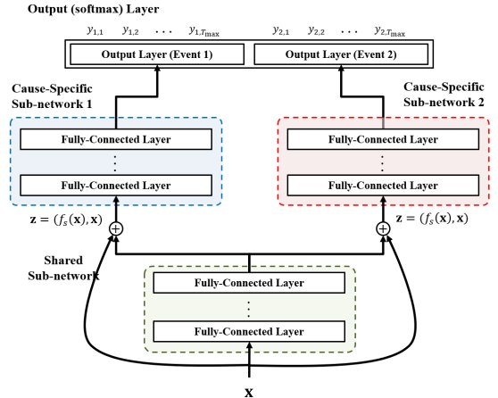

### 1. Business Problem, Objective, and Constraints

- Context

    We have an age-based automated email program aimed at delivering timely retirement education & decision support to help participants feel confident  and get ready in their retirement journey. Topic-driven messages are sent at ages based on business rules. for example, for participants at an age of 55-59 the retirement income planning (RI) message is sent annually on their birthday in support of the average retirement age of 61. We then surface a web engager for 30 days following the email. 

- Business Objective

    Everyone retires eventually. It's not a matter of WHO but WHEN. We want to model people's time to retire so that we can **identify who will take actions soon** and trigger email messages **at the right time**.
    
    Business success was measured by the **participant engagement and conversions** of the retirement-related email and web journeys.

### Business Constraints

- **Retirement proxies**: We do not have accurate info about whether people retired or not. We must come up with data proxies.
  &rarr; Consolidating retirement assets inside or outside of Fidelity i.e. moving their 401K to an IRA, could indicate they are choosing their retirement partner.

- **Incomplete event data**: We often don't get to observe a participant throughout their life. They could change jobs and as a result no longer active in our 401K records. Or they could pass away before retirement. In survival analysis these are called right censoring. We only know that the retirement did not happen up until certain time but we don't known when. It needed to be properly handled to prevent bias.

    &rarr; These right censored scenarios are coded as one class of events.

- **Competing risks**: From the business point of view, we also cared about where people moved assets to and needed to separate them out into different events. 

    &rarr; We defined two competing events: Consolidating their retirement funds within Fid vs moving retirement funds out of Fid.


### 2. Method Review and Why Deep Learning

* **Traditional methods**:

  * Cox Proportional Hazards (CPH): assumes proportional hazards and linear covariate-risk relationships.
  * Fine-Gray model: handles competing risks but assumes proportional hazard rates.
  * Random survival forests, Bayesian Gaussian processes, dependent logistic regressors: flexible but weak in competing risk settings.

* **Why Deep Learning**:

  * Can learn *non-linear* and *time-varying* covariate effects and avoid the proportional hazard assumption.

  * Can *jointly model multiple risks without assuming independence*.
  * *Multi-task architecture* captures shared and cause-specific representations.
  * **Outperforms prior methods** on synthetic and real datasets based on DeepHit Paper.

### 3. Frame the Problem into an ML Task

#### Supervised Learning Setting
- Dependent Variables 
  - Event Label: 
    - Retire and fund remain in Fid
    - Retire and fund out of Fid
    - No event
  - Event Time: # months since beginning of evaluation year at event time
- Probabilistic prediction – cause-specific cumulative incidence function (CIF):
  $$\hat{F}_k(t \mid x) = \sum{m}=0^t\hat{P}(s=m, k \mid x)$$
  
  This gives the predicted probability tha event $k$ occurs by time $t$ given covariates $x$.
* This is a **multi-task learning** problem (multiple event types/risks), combined with structured output (time + event).

#### Custom Loss Functions


The total loss is:
$$L_{\text{Total}} = \alpha\cdot{L_1} + \beta\cdot L_2$$

where we kept $\alpha = 0.5$ and $\beta=1$

1. Likelihood Loss ($L_1$)

    $L_1$ encourages the network to correctly estimate the joint probability of the first hitting time and corresponding event while accounting for censoring.
   $$L_1 = - \sum_{i=1}^N \Bigg[
   1(k^{(i)} \neq \emptyset) \cdot \log \Big( y^{(i)}_{k^{(i)}, s^{(i)}} \Big)
   + 1(k^{(i)} = \emptyset) \cdot \log \Big(1 - \sum_{k=1}^K \hat{F}_k(s^{(i)} \mid x^{(i)}) \Big)
   \Bigg]$$
   Where:
    - $(x^{(i)}, s^{(i)}, k^{(i)})$ = covariates, observed time, event type (or censoring).
    - $y^{(i)}_{k,s} = \hat{P}(s, k \mid x^{(i)})$ is the model’s predicted probability that patient i experiences event k at time s.
    - $\hat{F}k(s^{(i)} \mid x^{(i)}) = \sum{m=0}^{s^{(i)}} y^{(i)}_{k,m}$ is the estimated cumulative incidence function (CIF).

    Case 1: Uncensored $(k^{(i)} \neq \emptyset)$
    - We maximize the probability of the observed event at the observed time.
    - This is just standard log-likelihood.
    
    Case 2: Censored $(k^{(i)} = \emptyset)$
    - We maximize the probability that no event has occurred up to censoring time.
    - Equivalent to enforcing survival up to censoring.

2. Pairwise Ranking Loss ($L_2$)

    Inspired by the concordance index(C-index), it penalizes incorrect risk ordering: if participant A retires earlier than participant B from event k, then A should have higher predicted prob at their event time.
   $$L_2 = \sum_{k=1}^K \alpha_k \cdot \sum_{i \neq j} A_{k,i,j} \cdot \eta\!\Big( \hat{F}_k(s^{(i)} \mid x^{(i)}), \; \hat{F}_k(s^{(i)} \mid x^{(j)}) \Big)$$
    Where:
    - $A_{k,i,j} = 1$ if patient i experienced event k at time $s^{(i)}$ and patient j survived longer than $s^{(i)}$.
    - $\eta(x,y) = \exp\!\big(-(x-y)/\sigma\big)$ is a convex penalty that gets small when ordering is correct (x > y) and large otherwise.
    - $\alpha_k$ balances contribution of each event type (often all equal)
  
    So:
    - If model assigns higher CIF at time $s^{(i)}$ to the earlier patient i, penalty is low. If not, penalty is high.
    - This is essentially a concordance-driven ranking loss.
  
Putting It Together:
- Log likelihood loss: teaches the model the distribution of times and events (likelihood-style).
- Ranking Loss: refines the model to ensure discriminative ranking power (Ctd index–style).

    &rarr; The balance of both ensures that model learns both calibration (probabilities match data) and discrimination (correct ordering across observations).

#### Custom Model Evaluation Metrics (for time-dependent predictions)

1. Time-Dependent Accuracy, f1-score, Precision, Recall for two events on validation set in each evaluation period (up to 3, 6, 12 months)

2. **Cumulative dynamic AUC** (from ```scikit-survival```): how well the model can distinguish subjects who experience an event by time t from those who do not. 

3. **time-dependent concordance index ($C^{td}$-index)** to evaluate risk ranking over time.

   - Why not the standard Harrell's ordinary concordance index (C-index)?
     - It implicitly assumes the **risk ordering is static** and only evaluates concordance at the start (time 0). It assumes covariants influence survival in a time-invariant way (proportional hazards).
     - This doesn't align with our setting which we allow dynamic change of model predcitions over time.
   - $C^{td}$-index extends the C-index by evaluating concordance **at each time point**:

      $$C_{td} = P\big(\hat{F}_k(s_i \mid x_i) > \hat{F}_k(s_i \mid x_j) \;\big|\; s_i < s_j \big)$$

      where $\hat{F}_k$ is the estimated cumulative incidence function (CIF) for cause k.

      - It checks whether the person who experienced the event earlier had a higher predicted event probability by that time.
      - It properly captures time-varying and non-linear risk patterns.

   - On a test set, for each observation we calculate the estimated risk score of multiple events using the fitted model.

4. Average predicted probability differences between population with events and without events


### 4. Data Preparation

#### Data Setup
- Choose the time scale: 
  
  We aggregated event dates to the monthly level, as it aligns better with the expected model refresh frequency. This reduced the time dimension to 12 and allows us to make probability predictions on the monthly basis.

- Collected ~1M participants based on snapshot date 2021-12-31. 
  - Features were defined based on 12 months before the the snapshot date.   
  - GT labels were constructed based on a 12-month performance window following the snapshot date.
  - Survival time for right censored population is imputed with a number beyond 12 just to differentiate them from those that are not censored. &rarr; the choice of imputation doesn't impact optimization bcuz loss function only considers survival time up to 12.
  - Deceased during the performance window had survival time until then

- Handle Class Imbalance &rarr; Random Sampling on censored data

    Random Sampling was taken to the no events populations during evaluation period (majority) to make sure the minority (event 1 and event 2) are not dominated by majority.

#### Feature Engineering

- One-hot encoding on categorical features
- **Robust scaling** on numeric input features
  - It centers the data by subtracting the median and scales it by dividing by the  interquartile range (IQR).
  - Compared to standard scaling (Z-score norm) and min-max scaling, less sensitive to outliers.


- Data was randomlly split into 60% training, 20% validation and 20% testing.

#### Feature Selection

- We bult a separate tree-based ensemble model to prune the feature set based on feature importance.

- Feature importance is measured based on the average F1 score change if we drop it


### 5. Model Training

#### Model Architecture Design

We started with the network architecture and default hyperparameters proposed in the DeepHit paper:
- Learning rate 0.0001, batch size 50, dropout prob 0.6
- 4-layer network consisting of:
    - 1 fully-connected layer for the shared sub-network + ReLU
      - hidden dim = $3\times$ covariant dim, 
    - 2 fully-connected layers for each cause-specific sub-network + ReLU
      -  hidden dim 1 = $5\times$ covariant dim
      -  hidden dim 2 = $3\times$ covariant dim
    - 1 softmax layer as the output layer



What we modified:
- **Deepened the network** to 7 hidden layers: 5 shared layers + 2 layers for event-specific sub-network. 
- We explored more types of activation functions like leaky relu and tanh and switched to **leaky relu**.
  - Accordingly, we also switched to **He initialization** instead of Xavier as it is better designed for ReLu.
- **Re-tuned the hyperparameters** based on model validation
  - Instead of using a fixed multiplier times covariant dim to determine hidden layer dim, we tuned these hidden dimensions based on validation.
- **Added batch normalization** after each FC layer and before activation to regulate the inputs to ReLU functions, reducing the risks of gradient exploding or vanishing.


#### Hypterparameter Tuning

- Weight Initialization with **He normal initializer** (```tf.keras.initializers.HeNormal```)
  - It draws samples from a truncated normal distribution $N(0, \frac{2}{n_{in}})$ centered on 0 with stddev = sqrt(2 / fan_in) where fan_in is the number of input units in the weight tensor.
  - Designed specifically for networks using ReLU and its variants. It scales the variance differently than Xavier to account for ReLU's property of outputting zero for negative inputs. It helps prevent "dying ReLU" issues and maintains robust gradients in deep networks.
  - Why not zero initialization:
    - symmetry problem: every neuron in the same layer will receive the same gradient during backprop, failing to learn diverse features/patterns.
    - vanishing gradients for activation functions like ReLU when the inputs <=0 after applying zero weights.

* Param optimization for training network gradient flow: 
  * Adam optimizer + learning rate schedule using exponential decay
  * Total params: 112K

- Hyperband Tuner from KerasTuner
  
  - Optimization objective: weighted avg F1 score on validaiton set
  - Hyperband frames hyperparameter optimization as a multi-armed bandit problem, where different configurations are the "arms" to be pulled. It speeds up random search through a mechanism called "successive halving":
    - It breaks down param search into multiple rounds of successing having and each round adopts slightly different strategy to balance the **trade-off between number of configurations to explore and allocated resources**. 
    - Initial round would be **highly exploratory/aggressive**: it randomly samples a **large set of configurations** and trains them for a **small** fixed number of epochs. It reduces to a portion of top-performers based on their performance and train these configs for more epochs. Repeat untile one or k config finished the max epoch.
    - In subsequent rounds, it will sample slightly **fewer set of configs** but **allocate more epochs** for each. It varies the setting across multiple brackets bcuz it is unknown ahead of time whether the best configs will reveal themselves early with few epochs or late with many epochs. 

  - Hyperband Tuned Param
    - h_dim_shared': 64
    - h_dim_CS': 160
    - num_layers_shared': 5
    - num_layers_CS': 2
    - keep_prob': 0.7583727099261521
    - active_fn': 'leaky_relu'
    - alpha': 5
    - 'beta': 0.1
    - $\lambda$: 0.0001

  - Total Job Execution Time: over 1 day for 100 epochs

#### Regularization Techniques to prevent overfiting

- **Early stopping** based on validation
  - The training process is monitored using a validation dataset. When the model's performance on the validation set stops improving or begins to degrade, training is stopped. The model's weights from the best-performing epoch are used as the final model.
- **Dropout**:
  - Used a dropout probability to randomly drop out (setting to zero) a fraction of the neurons in a layer during each training step.
  - It forces the network to learn more robust and redundant representations because it cannot rely on any single neuron or a small set of neurons.
  - During inference, no neuron are dropped but the output of the neorons is scaled down by the dropout rate to balance the effect of using the full network.
- **weight decay** through L2 weight regularizer (Ridge)
  - Adds the sum of the squared values of the weights as a penalty to the loss function. It encourages weights in each layer to be small but rarely drives them to exactly zero. This helps to reduce the impact of less important features. 

### 6. Model Inference and Serving

- Monthly batch inference job
  - Scoring: 2M participants with age>50
  - Output: cumulative event probabilities for the next 12 months

#### Model Performance Tracking

- Business metrics: A/B Testing on email campaign and web engagers

    Web: compare the click-thru rates (CTR) and subsequent take actions between model selected audience and randomized audience and report the lift on CTRs as well as subsequent conversion rates. 

    Email: compare the email engagements between model selected audience with high likelihood to retire, and the business rule selected audience based on age.

- Model Metrics Tracking
  - Collected new ground truths over time to validate the model performance and assess if there's a performance degradation.