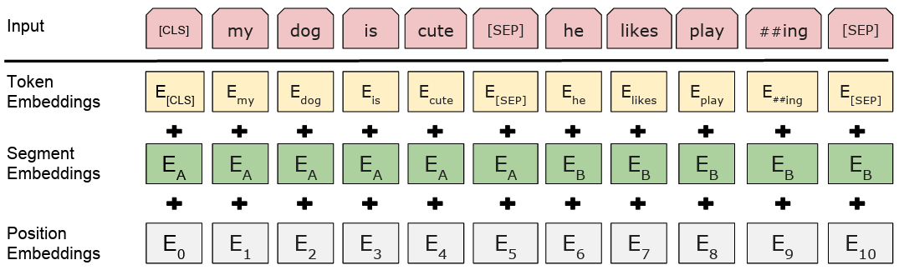
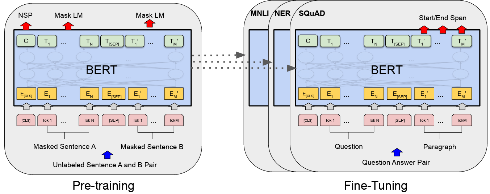
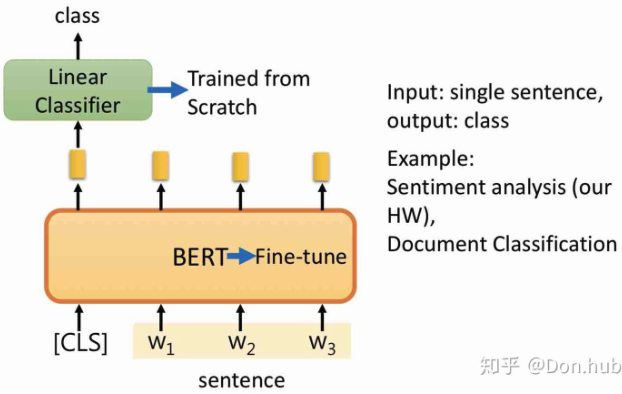
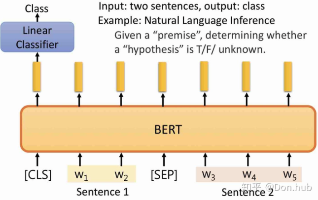
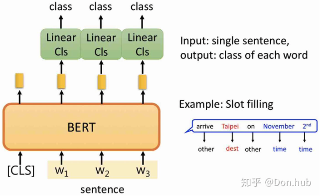
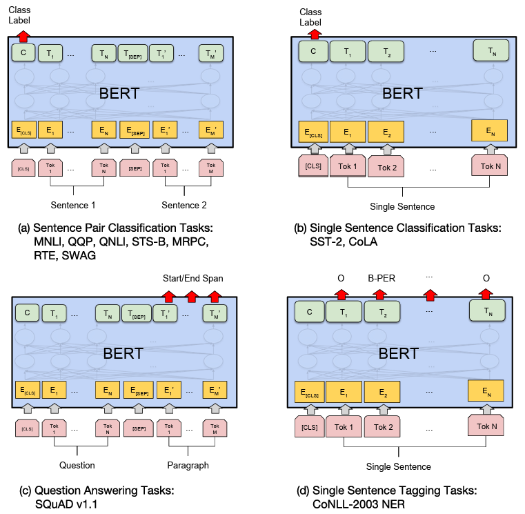

### 1. Problem Scoping & Requirement Analysis 

* **Business Objective:** To create a single, powerful, pre-trained language model that can be easily adapted to improve performance on a wide variety of Natural Language Processing (NLP) tasks for Google's services and the broader research community.
* **ML Problem:** The authors identified a key limitation in previous state-of-the-art language models like OpenAI GPT and ELMo: they are **unidirectional**. This means they process text in only one direction (either left-to-right or right-to-left), which is sub-optimal for tasks that require understanding the context from both directions simultaneously, such as question answering.
* **ML Task:** The goal is to create a pre-trained language representation model that can be fine-tuned for many downstream tasks, including sentence-level tasks (e.g., natural language inference) and token-level tasks (e.g., named entity recognition).

### 2. Data Deep Dive 

* **Data Sourcing (Pre-training Corpus):** The model is pre-trained on a large amount of unlabeled text data from two sources: the **BooksCorpus** (800M words) and the **English Wikipedia** (2,500M words).
* **Data Characteristics:** The authors emphasize the importance of using a document-level corpus, not a shuffled sentence-level corpus, to enable the extraction of long, contiguous text sequences. For Wikipedia, only the text passages were used, while lists, tables, and headers were ignored.
* **Labeling:** The pre-training process is **unsupervised**, meaning it learns from unlabeled text. "Labels" are generated automatically from the text itself for the two pre-training tasks (see Modeling section below). For the fine-tuning stage, labeled data from specific downstream tasks is used.

### 3. Feature Engineering 

BERT's input representation is a key part of its design, allowing it to handle both **single sentences** and **sentence pairs**.

* **Tokenization:** A WordPiece tokenizer with a 30,000-token vocabulary is used.
* **Input Representation:** For any given token, its input representation is constructed by summing three distinct embeddings (final hidden vector for the i-th input token is of a length $H$):
    1.  **Token Embeddings:** The embedding for the specific WordPiece token.
    2.  **Segment Embeddings:** A learned embedding indicating if the token belongs to the first sentence (A) or the second sentence (B).
    3.  **Position Embeddings:** A learned embedding that indicates the token's position in the sequence.
* **Special Tokens:** Two special tokens are used:
    * **`[CLS]`:** The first token of every sequence. Its final hidden state is used as the aggregate sequence representation for classification tasks.
    * **`[SEP]`:** A token used to separate sentences in a pair (e.g., question `[SEP]` answer).

  

### 4. Modeling 🧠

The BERT framework consists of two stages:
* **Pre-training:** The model is trained on the large unlabeled text corpus using the MLM and NSP objectives.
* **Fine-tuning:** The pre-trained model is initialized with the learned parameters. For a new downstream task, a single additional output layer is added, and all parameters are fine-tuned end-to-end on the labeled data for that specific task. This approach requires minimal task-specific architectural changes.

  

#### Masked Language Modeling (MLM)

MLM is a self-supervised objective. Here’s how it is framed:

1. **Masking**: prevents each word from seeing itself during bidirectional training 

   * Randomly select \~15% of the tokens in the input sequence.
   * Of those selected:

     * 80% of the time, replace with the special `[MASK]` token.
     * 10% of the time, replace with a random token from the vocabulary.
     * 10% of the time, keep the original token (no change).
   * This mixed strategy is to avoid a huge mismatch between pretraining (where `[MASK]` appears) and fine-tuning (where `[MASK]` usually doesn’t). This ensures the model does not known which words it will be asked to predict, forcing it to keep a distributional contextual representation of every input token instead of being over-dependent on special mask token.

2. **Model input**:

   The modified input (with some tokens masked / replaced) is fed into the encoder. Because the encoder is **bidirectional** (i.e. every token’s self-attention can attend to all tokens in the input, same as the encoder of the original Transformer), the model **sees both left and right context of a masked token**. 

3. **Prediction / loss**:

   * For each masked token, BERT tries to predict the original token (before masking) using its output (softmax over the vocabulary).
   * Only the selected masked positions (including the 20% replaced or unchanged) contribute to the MLM loss. You typically ignore predictions for unmasked tokens.
   * Cross-entropy loss over those predictions.

So MLM forces BERT to learn good contextual representations: to predict missing words, it must deeply understand context both sides.

#### Next Sentence Prediction (NSP)

NSP is a sentence-pair classification task. It uses the same encoder architecture as for MLM, but with a different “head” (output layer) and input formatting.

1. **Sampling sentence pairs**:

   * 50% of the time, you take *two consecutive sentences* from the same document. Call them Sentence A, Sentence B. Label = **“IsNext”**.
   * 50% of the time, you take Sentence A from one place, then sample Sentence B randomly from the corpus (so that it does *not* follow A). Label = **“NotNext”**. 
   - Combined sequence length <=512 tokens

2. **Input formatting**:

   * Construct: `[CLS] Sentence A [SEP] Sentence B [SEP]`
   * As mentioned, tokens from A get segment embedding type = 0, tokens from B get type = 1. Position embeddings as usual. All tokens are processed together by the encoder. 

3. **Prediction**:

   * Use the final hidden state of the `[CLS]` token (after all transformer encoder layers) as the representation of the sentence pair.
   * Apply a classification layer (a simple dense / linear layer + softmax / logistic) on top of that `[CLS]` representation to output probabilities for “IsNext” vs “NotNext”.
   * Compute a binary classification loss (cross-entropy).

#### Combined loss & training

* During *pretraining*, both MLM and NSP losses are optimized **together** (multi-task objective). So total loss = MLM\_loss + NSP\_loss. The model is trained on very large corpora (e.g. BookCorpus + Wikipedia) doing both tasks. 
* The encoder architecture is shared: same transformer blocks, same parameters. The difference is only in how inputs are masked / formed and which output layer (MLM vs NSP head) is used for which sample / part.

* **MLM** gives strong token-level context: the model must understand both previous and next context to predict missing words.
* **NSP** is meant to teach the model coherence / discourse / inter-sentence relationships — useful for downstream tasks like QA, entailment, etc., where understanding how sentences follow one another matters.

### 5. System Architecture & Serving (Results) 🚀

#### Model Architecture
* BERT’s architecture is a **multi-layer bidirectional Transformer encoder** based on the original implementation in "Attention Is All You Need".
* The paper reports on two main sizes:
    * **`BERT_BASE`**: 12 Transformer layers, 768 hidden units, 12 self-attention heads, and 110M total parameters. This size was chosen to be comparable to OpenAI GPT.
    * **`BERT_LARGE`**: 24 Transformer layers, 1024 hidden units, 16 self-attention heads, and 340M total parameters.

#### What's New Compared to Precedent Architectures?
1.  **Deep Bidirectionality:** This is BERT's main contribution. Unlike previous models that were unidirectional , BERT's Transformer encoder is designed to be deeply bidirectional. It uses its self-attention mechanism to jointly condition on both left and right context in all layers, allowing it to build a much richer understanding of language.

      

2.  **New Pre-training Tasks:** To enable bidirectionality (which is not possible with standard language models), the authors introduce two novel unsupervised pre-training tasks:
    * **Masked Language Model (MLM):** Instead of predicting the next word, BERT randomly masks 15% of the tokens in the input sequence and its objective is to predict these masked tokens based on the surrounding unmasked context[cite: 25, 133, 136]. This forces the model to fuse both the left and right context.
    * **Next Sentence Prediction (NSP):** The model receives two sentences (A and B) and predicts whether B is the actual sentence that follows A in the original text, or just a random sentence from the corpus. This helps BERT learn relationships between sentences, which is critical for tasks like Question Answering and Natural Language Inference.

#### BERT Outputs

When you feed input into BERT (encoder-only Transformer) you get:

1. Sequecne Output: Token-level hidden states

    For each token in the input sequence, after the final encoder layer, BERT produces a vector (hidden representation) of dimension 𝐻 (e.g. 768 in BERT-Base). So if your input has length 𝐿 (after tokenization), you get 𝐿 vectors of size 𝐻.

2. Pooled output (“[CLS]” vector)

    There is a special token [CLS] prepended at the beginning of every input. The hidden state corresponding to that token can be used as a representation of the whole input sequence. In the original BERT implementation, there is also a “pooler” layer (a dense / non-linear + tanh) applied to the [CLS] hidden state to produce a “pooled output” that’s often used for classification tasks. 

3. Vocabulary prediction (during pretraining)

    BERT has heads for its pretraining tasks:
    - MLM head — to predict masked token IDs over the vocabulary for the tokens that were masked.
    - NSP head — to predict a binary label (IsNext / NotNext) for sentence pairs.

#### Fine-tuning for Downstream Tasks

- Single Sentence Classification

  

- Sentence Pair Classification i.e. Natural Language Inference

   

- Token-level Classification: Named Entity Recognition (NER)

   

- Question Answering Tasks like SQuAD

    Given a context (a passage of text) + a question, the model must find the answer span in the context. The answer is defined by two positions: start token index and end token index in the context.

| Task type                                                                                                                                                                              | Input                                            | What output you need / how you use BERT’s outputs                                                                                                          |
| -------------------------------------------------------------------------------------------------------------------------------------------------------------------------------------- | ------------------------------------------------ | ---------------------------------------------------------------------------------------------------------------------------------------------------------- |
| **Sequence / sentence classification** (e.g. sentiment, entailment)                                                                                                                    | Single sentence, or sentence pair (with `[SEP]`) | Use the “\[CLS]” / pooled output vector → pass through one (or a few) dense layers → softmax (or other) over classes.                                      |
| **Token-level classification** (e.g. Named Entity Recognition, POS tagging)                                                                                                            | Sentence(s)                                      | Use each token’s final hidden state → pass through a classification layer (per token) to get label per token. Mask out special tokens / padding as needed. |
| **Question Answering (span prediction)** (like SQuAD)                                                                                                                                  | Context paragraph + question (concatenated)      | Use token hidden states: produce two outputs per token: start-position score, end-position score. Choose the span with highest combined score.             |
                                                                                                                                                                                                      
**Other tasks**: summarization, sequence generation, etc. BERT (without decoder) is less directly suitable for generation; often people adapt or use encoder-decoder models for those.

#### Results

* **State-of-the-Art Performance:** BERT achieved new state-of-the-art results on 11 NLP tasks.
* **General Language Understanding Evaluation (GLUE) Benchmark:** `BERT_LARGE` obtained a GLUE score of 80.5%, a 7.7% absolute improvement over the previous best.
* **Question Answering (SQuAD):**
    * On SQuAD v1.1, an ensemble of BERT models achieved a Test F1 score of **93.2**. A single BERT model outperformed the previous best ensemble system.
    * On SQuAD v2.0, BERT achieved a Test F1 score of **83.1**, a 5.1 point absolute improvement over the prior state-of-the-art.
* **Effect of Model Size:** The results clearly show that larger models lead to strictly better accuracy across all tasks, even those with very small training datasets, provided the model has been sufficiently pre-trained. `BERT_LARGE` significantly outperforms `BERT_BASE` on all tasks.

     

### 6. Limitations & Future Improvements 🔄

#### Limitations
* **Pre-train/Fine-tune Mismatch:** The `[MASK]` token is used during pre-training but never appears during fine-tuning, creating a mismatch. The authors mitigate this by not always replacing the chosen word with `[MASK]`, sometimes using a random word or the original word instead.
* **High Computational Cost:** Pre-training BERT is extremely computationally expensive. `BERT_LARGE` required 4 days to train on 16 Cloud TPUs (64 TPU chips total). Fine-tuning, however, is relatively inexpensive.
* **Slower Convergence:** The MLM objective converges slower than traditional left-to-right models because it only predicts 15% of the tokens in each batch. However, the paper shows the model's accuracy starts higher and far surpasses the LTR model despite this.

#### Future Improvements
* **Multi-Task Fine-Tuning:** The paper mentions that fine-tuning on multiple tasks at once could potentially push performance even further. They observed improvements on the RTE task when multi-tasking with MNLI.
* **Generalization of Bidirectionality:** The paper's core contribution is demonstrating the power of deep bidirectional architectures. This finding can be generalized to explore other pre-training tasks or architectures that leverage this principle.

### 7. Robustly Optimized BERT Pretraining Approach (RoBERTa)

