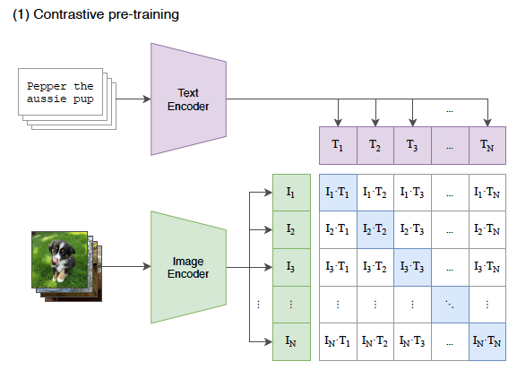
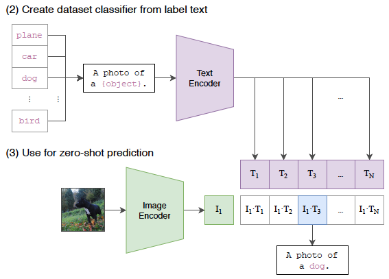
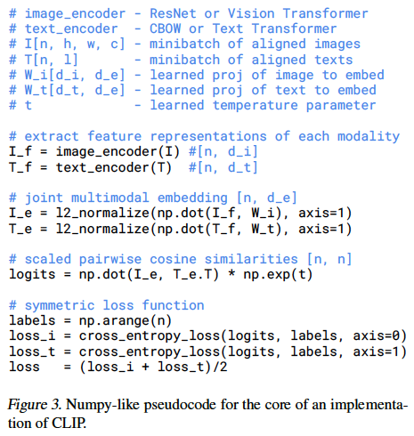

**"Learning Transferable Visual Models From Natural Language Supervision"** by Radford et al. (2021)

**CLIP (Contrastive Language-Image Pre-training)**

### 1. Problem Scoring and Motivation

*   **Problem:** State-of-the-art computer vision systems are typically trained on a fixed set of predetermined object categories (e.g., ImageNet). This approach limits their generality, as they require additional labeled data to learn any new visual concept. This is in contrast to NLP, where task-agnostic pre-training on raw web text has led to models like GPT-3 that can zero-shot transfer to many tasks.

*   **Motivation:** The paper aims to replicate the success of large-scale, task-agnostic pre-training from NLP in the computer vision domain. The core idea is to learn visual models directly from **natural language supervision**, leveraging the vast amount of (image, text) pairs available on the internet. This approach is motivated by its potential for:
    *   **Scalability**: It is easier to scale than creating crowd-labeled datasets.
    *   **Generality**: Natural language can supervise a much wider set of visual concepts than fixed softmax classifiers.
    *   **Flexibility**: It connects visual representations to language, enabling **zero-shot transfer** to downstream tasks without dataset-specific training.
*   **Prior Work Gap:** Previous attempts to learn from natural language supervision showed promise but had much lower performance on benchmarks (e.g., 11.5% zero-shot accuracy on ImageNet). The authors identified **scale** as the crucial difference between these attempts and other successful weakly-supervised models, which used millions or billions of images. This paper closes that gap by scaling up natural language supervision.

### 2. Dataset and Feature Engineering

*   **Dataset:** The authors constructed a new dataset called **WebImageText (WIT)**, consisting of **400 million (image, text) pairs** collected from various public sources on the internet.
    *   To ensure a broad coverage of visual concepts, the dataset was built by searching for pairs where the text included one of 500,000 queries derived from Wikipedia and WordNet.
    *   The dataset was approximately class-balanced, with up to 20,000 pairs per query.
*   **Feature Engineering:**
    *   **Image Features:** A random square crop from resized images is the only data augmentation used during training. The final feature representation is extracted from an image encoder (either a ResNet or ViT).
    *   **Text Features:** Text is represented using a lower-cased byte pair encoding (BPE) with a 49,152-word vocabulary. The sequence is bracketed with `[SOS]` and `[EOS]` tokens. The feature representation is the activation of the highest transformer layer at the `[EOS]` token, which is then layer-normalized.

### 3. Modeling

* **Core Idea**: The model employs a dual-encoder architecture: one encoder processes images, and the other processes text. Both encoders project their inputs into a shared embedding space.

* Model Architecture for **CLIP (Contrastive Language-Image Pre-training)**:

    1.  **Image Encoder:** 
    
        Two architectures were tested: a modified ResNet-50 and a Vision Transformer (ViT). The ResNet was modified with ResNet-D improvements, antialiased pooling, and an attention pooling mechanism instead of global average pooling. The ViT implementation was largely standard.

    2.  **Text Encoder:** A 12-layer, 512-wide Transformer with 8 attention heads was used as the base model. Masked self-attention was used to allow for future integration with language modeling objectives.
  * **Projection Head**: Both encoders output embeddings that are projected into a shared space using a linear layer.

     

*   **Training Procedure:**
    * **Initialization**: train CLIP from scratch without initializing the image encoder with ImageNet weights or the text encoder with pre-trained weights. 
    * **Objective / Loss Function**: The model is trained using a contrastive loss, where the objective is to maximize the similarity between the correct image-text pairs and minimize the similarity for incorrect pairs.
    - Procedure
    
        For a batch of N (image, text) pairs, the model learns a multi-modal embedding space by maximizing the cosine similarity of the N correct (image, text) embeddings while minimizing the similarity for the N² - N incorrect pairings. This is optimized using a **symmetric cross-entropy loss**.
    *   **Scale and Compute:** A series of 8 models were trained for 32 epochs on the 400M pair dataset. The largest ResNet model (RN50x64) trained for 18 days on 592 V100 GPUs, while the largest ViT model (ViT-L/14) took 12 days on 256 V100s. A very large minibatch size of 32,768 was used, enabled by techniques like mixed-precision and gradient checkpointing.

*   **What's New (Compared to Prior Architectures):**
    *   **Efficient Pre-training Method:** 
    
        The authors found that a **contrastive objective** was significantly more efficient than predictive objectives like generating image captions. The contrastive approach was 4x more efficient than a bag-of-words prediction baseline and learned 3x faster than a transformer language model baseline.
    *   **Simplified Contrastive Learning:** 
    
        Compared to prior work like ConVIRT, CLIP's implementation is simplified. It is trained from scratch without pre-trained weights, uses only a linear projection to the embedding space (not a non-linear one), and uses minimal data augmentation (only random cropping).
### 4. Model Inference Procedures

*   **Zero-Shot Classification:** CLIP's pre-trained ability to match images and text is repurposed for zero-shot classification.
    1.  For a given dataset, the class names (e.g., "dog", "cat") are transformed into textual descriptions using prompt templates like "**A photo of a {label}.**".
    2.  The text encoder computes feature embeddings for all class descriptions, creating the weights of a "zero-shot" linear classifier.
    3.  The image encoder computes the feature embedding for a given input image.
    4.  The cosine similarity between the image embedding and each text embedding is calculated. These scores are normalized via a softmax function to produce a probability distribution over the classes. The class with the highest probability is predicted.

    

*   **Prompt Engineering and Ensembling:** 

    Zero-shot performance is significantly improved by customizing prompts for specific tasks (e.g., "a satellite photo of a {label}.") and by ensembling predictions over multiple different prompt templates. These techniques boosted ImageNet accuracy by almost 5%.
*   **Representation Learning (Linear Probes):** To evaluate the learned representations, a standard logistic regression classifier is trained on the image features extracted from CLIP's image encoder.

### 5. Evaluation and Results

The model achieves competitive performance on over 30 different computer vision datasets, often matching or exceeding fully supervised baselines without the need for task-specific training.

* **Metrics**: Zero-shot accuracy on various downstream tasks.

* **Baselines**: The model's performance is compared against fully supervised models trained on task-specific datasets.

*   **Zero-Shot Performance:**
    *   The best CLIP model matches the accuracy of a fully supervised ResNet-50 on ImageNet without using any of its 1.28 million training examples.
    *   It outperforms a fully supervised linear classifier on ResNet-50 features on 16 out of 27 datasets.
    *   It excels at action recognition and general object classification but performs poorly on specialized tasks like satellite imagery, tumor detection, and counting.
    *   Zero-shot CLIP's performance is equivalent to a **4-shot** linear classifier trained on its own features, demonstrating the power of specifying concepts via language versus inferring them from a few examples.

* **Ablation Studies**: The impact of different components, such as the choice of encoders and the contrastive loss, is evaluated.
    *   When evaluated with linear probes, the best CLIP model **outperforms the best publicly available models** (like Noisy Student EfficientNet-L2) on average across a broad 27-dataset evaluation suite.
    *   CLIP's Vision Transformer models are about **3x more compute-efficient** than its ResNet models.
* **Robustness / Sensitivity**: The model demonstrates robustness across a wide range of vision tasks without task-specific fine-tuning.
    *   Zero-shot CLIP is **significantly more robust to natural distribution shifts** than standard ImageNet models, reducing the gap between in-distribution and out-of-distribution accuracy by up to 75%.
    *   Adapting CLIP's features to ImageNet with a supervised linear classifier increases its ImageNet accuracy but slightly *decreases* its average robustness on distribution shift datasets, suggesting the adaptation overfits to the ImageNet distribution.

### 6. Limitations and Future Work

The paper discusses scenarios where the model's performance may degrade, particularly in tasks requiring fine-grained visual understanding.

*   **Limitations:**
    *   **Performance on Niche Tasks:** CLIP struggles with fine-grained classification (e.g., car models, flower species), abstract tasks like counting, and truly out-of-distribution data like handwritten MNIST digits.
    *   **Efficiency:** CLIP does not solve the poor data efficiency of deep learning; it compensates by using a massive dataset. Reaching SOTA performance via scaling alone would require an infeasible 1000x compute increase.
    *   **Bias:** Trained on unfiltered internet data, CLIP learns social biases, such as associating crime-related labels with certain demographics and misclassifying images of Black people into non-human categories at higher rates.
    *   **Methodology:** Development was guided by performance on validation sets, which is not a true zero-shot scenario, and the evaluation suite was co-adapted with the model's development.
*   **Future Work:**
    *   Improving the computational and data efficiency of the method.
    *   Combining the contrastive objective with a generative one to gain the flexibility of image captioning models.
    *   Developing better methods to combine CLIP's strong zero-shot performance with efficient few-shot learning to bridge the gap with human sample efficiency.
    *   Community exploration is needed to better characterize the model's capabilities and biases, and to develop more robust testing schemes and benchmarks.

### 7. Implementation Details

* **Frameworks**: The model is implemented using PyTorch.

* **Code Availability**: The authors have released the code and pre-trained model weights at [https://github.com/OpenAI/CLIP](https://github.com/OpenAI/CLIP).

 