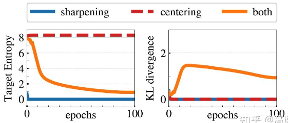
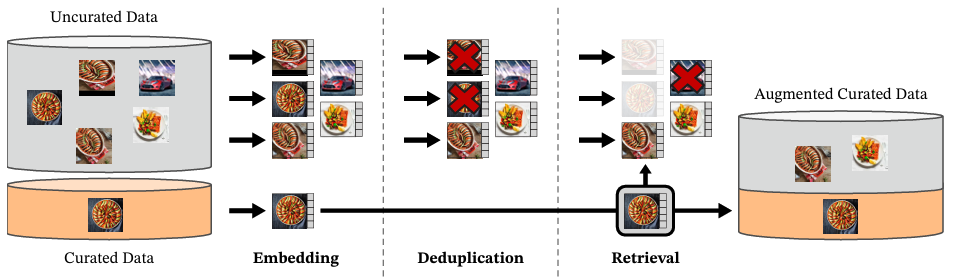

## DINO (self-Distillation with NO labels)

### Motivation


* **Transformers in vision lacked unique advantages under supervised learning.** While Vision Transformers (ViTs) had shown competitiveness with convolutional networks (CNNs), they required more data and compute, and their features did not show distinctive properties.

* **Inspired by NLP success.** In natural language processing, the real breakthrough of Transformers came from *self-supervised pretraining* (e.g., BERT’s masked language modeling, GPT’s language modeling). The authors questioned whether ViTs had not reached their potential in vision because they were mostly pretrained with supervision.

* **Limitation of supervised vision training.** Supervised image classification reduces rich image information to a single label, which may hinder the emergence of richer visual features.

* **Motivation to test self-supervised learning with ViTs.** The authors wanted to investigate whether self-supervised pretraining would unlock new and unique properties in ViTs, just as it did in NLP. Indeed, they observed that self-supervised ViTs:

  * Naturally learn *object boundaries and scene layout* (emerging segmentation ability).
  * Perform exceptionally well with simple classifiers (e.g., k-NN), unlike supervised ViTs or convnets.

* **Goal.** Build a simple yet effective self-supervised framework (DINO) that:

  * Works with both convnets and ViTs,
  * Is computationally efficient,
  * Enables ViTs to show new “emergent properties” not seen in supervised training.

In short: The motivation is to explore whether self-supervised pretraining can unlock the same kind of transformative benefits for Vision Transformers as it did for Transformers in NLP, and to show that this approach gives ViTs unique emergent properties like unsupervised segmentation and strong k-NN performance.

### Framework (self-Distillation with NO labels)

DINO follows a **student–teacher setup**:

1. **Input Views (Multi-crop):**

   * Generate multiple augmentations (global and local crops) of the same image.
   * **Teacher** only sees the global views, while **student** sees all views.
   * Encourages *local-to-global consistency*.

2. **Teacher Network:**

   * Not fixed; built as an **Exponential Moving Average (EMA)** of the student parameters (a momentum encoder).
   * This means the teacher is always a smoothed version of the student, guiding it with more stable features.

3. **Student Network:**

   * Trained with gradient descent to match the teacher’s output distributions.

4. **Loss Function:**

   * A **cross-entropy loss** between teacher and student outputs (softmaxed embeddings with temperature).
   * **Stop-gradient** applied to the teacher → gradients only update the student.


     

**Model Architecture**

* **Backbone**: Can be either a **Vision Transformer (ViT)** or a **ResNet** (convolutional network).
* **Projection Head**: On top of the backbone, DINO adds a **3-layer MLP** (hidden dim = 2048) followed by:

  * ℓ2 normalization
  * A weight-normalized fully connected layer producing **K-dimensional embeddings**.
* Both **student** and **teacher** networks share the *same architecture*.

### Loss Function Design and Stop Gradient

**General Idea**

The loss encourages the **student network** to match the output distribution of the **teacher network**, across different augmented views of the same image.

* Teacher = EMA of student (no gradients).
* Student = trained with backpropagation.

This is why they call it **self-distillation with no labels**.

**Formulation**

1. Both student and teacher map an input image $x$ to a feature vector via the backbone + projection head:

   $$
   g_{\theta_s}(x), \quad g_{\theta_t}(x)
   $$

   where $g$ is the network, $\theta_s$ = student params, $\theta_t$ = teacher params.

2. Apply **softmax with temperature** to convert features into probability distributions:

   * Student distribution:

     $$
     P_s(i|x) = \frac{\exp(g_{\theta_s}(x)_i / \tau_s)}{\sum_{k=1}^K \exp(g_{\theta_s}(x)_k / \tau_s)}
     $$
   * Teacher distribution:

     $$
     P_t(i|x) = \frac{\exp((g_{\theta_t}(x)_i - c_i) / \tau_t)}{\sum_{k=1}^K \exp((g_{\theta_t}(x)_k - c_k) / \tau_t)}
     $$

     where:

     * $\tau_s$ = student temperature (higher, e.g. 0.1).
     * $\tau_t$ = teacher temperature (lower, e.g. 0.04–0.07 → makes sharper distributions).
     * $c$ = centering vector (EMA of batch mean) to prevent collapse.

3. **Cross-entropy loss** between teacher and student:

   $$
   \mathcal{L} = H(P_t(x), P_s(x)) = - \sum_{i=1}^K P_t(i|x) \log P_s(i|x)
   $$

4. **Multi-crop extension:**

   * Crop large (global) and small (local) patches from the same image.
   - Two **global views** ($x^g_1, x^g_2$) → teacher.
   * Several **local views** ($x^\ell$) → student.
   * Loss compares teacher distributions from global views with student distributions from *all other views*:

   $$
   \mathcal{L} = \sum_{x \in \{x^g_1, x^g_2\}} \sum_{x' \in V, x' \neq x} H(P_t(x), P_s(x'))
   $$
    - Encourages the network to learn the "local-to-global" consistency.

**Design Choices (Why This Works)**

* **Cross-entropy (distribution matching)**:
  Instead of contrastive InfoNCE, they simply align distributions. This avoids the need for negative samples or large batches.

- **Centering + Sharpening:** Both are needed to prevent collapse of representations.

    The model could collapse in two ways: uniform distribution in all output dimensions, or single output dimension become dominant.

     * **Centering**: removes bias by normalizing teacher outputs.
     &rarr; Prevents the model from collapsing into a trivial solution where one dimension dominates.
     * **Sharpening (low τt)**: avoids uniform distributions by using low temperature in teacher softmax.
    &rarr; Prevents collapse to a uniform distribution by making teacher outputs more “peaky”.

      

* **Stop-gradient on teacher**:
  Ensures only the student learns — teacher serves as a stable moving target.

* **Momemtum Encoder / EMA teacher update**:
  Teacher weights are updated as:

  $$
  \theta_t \leftarrow \lambda \theta_t + (1-\lambda) \theta_s
  $$

  (λ \~ 0.996 → 1), which acts like model ensembling during training.


✅ **In summary:**
The DINO loss = **cross-entropy between teacher and student softmax outputs over multiple views**, with **centering + sharpening** to prevent collapse, and a **momentum teacher** to provide stable targets. This simple design allows ViTs to learn rich, structured representations *without labels*.

- Pseudo Code

```python
# gs, gt: student and teacher networks
# C: center (K)
# tps, tpt: student and teacher temperatures
# l, m: network and center momentum rates
gt.params = gs.params
for x in loader: # load a minibatch x with n samples
    x1, x2 = augment(x), augment(x) # random views

    s1, s2 = gs(x1), gs(x2) # student output n-by-K
    t1, t2 = gt(x1), gt(x2) # teacher output n-by-K

    loss = H(t1, s2)/2 + H(t2, s1)/2
    loss.backward() # back-propagate

    # student, teacher and center updates
    update(gs) # SGD
    gt.params = l*gt.params + (1-l)*gs.params
    C = m*C + (1-m)*cat([t1, t2]).mean(dim=0)

def H(t, s):
    t = t.detach() # stop gradient
    s = softmax(s / tps, dim=1)
    t = softmax((t - C) / tpt, dim=1) # center + sharpen
    return - (t * log(s)).sum(dim=1).mean()
```

## DINOV2: Scaling Up

### Motivation

1. **Inspired by NLP foundation models**

   * In NLP, pretrained foundation models (e.g., GPT, BERT, T5) learn *general-purpose features* that transfer well across tasks **without fine-tuning**.
   * The vision community expects similar models: visual encoders that produce *task-agnostic features* that work for image-level tasks (classification, retrieval) and pixel-level tasks (segmentation, depth).

2. **Limits of text-supervised vision models (like CLIP, OpenCLIP)**

   * These rely on *caption supervision*, which only weakly approximates the rich content of images.
   * Captions often miss detailed pixel-level information.
   * Training requires massive **aligned text–image corpora**, which are costly and less flexible than raw image data.

3. **Potential of self-supervised learning (SSL)**

   * SSL can, in principle, learn strong image + pixel features using only raw images.
   * Early SSL work (DINO, iBOT, etc.) showed promise, but most progress came from **ImageNet-scale datasets** (small and curated).
   * Attempts to scale SSL to massive **uncurated web data** often led to poor quality features — lack of control over data quality/diversity causes *performance drops*.

4. **Need for curated large-scale data + stable training**

   * DINOv2 is motivated by testing if **large-scale curated image datasets + improved SSL training** can yield robust *general-purpose vision foundation models*.
   * Their contributions include:

     * Building a **curated dataset (LVD-142M)** from raw web data via *automatic deduplication + retrieval* pipelines (no text labels).
     * Revisiting and stabilizing SSL methods (combining DINO + iBOT + SwAV ideas).
     * Scaling to **1B parameter ViTs** with efficient training (faster, less memory, more stable).

In short: The motivation of **DINOv2** is to **create self-supervised vision foundation models** that, like NLP’s pretrained models, can produce **general-purpose, robust, transferable features** without needing text supervision or fine-tuning — overcoming the data quality and scalability issues of earlier SSL methods.


### Core Innovation: Data Processing

**Summary:**

The authors realized that most failures of scaling SSL in vision come from *poor data quality* in uncurated web dumps. So, they designed an **automatic curation pipeline** to build a diverse but clean dataset without relying on labels or text.

The authors constructed **LVD-142M** by starting from curated datasets as anchors, deduplicating a 1.2B web image pool, and then retrieving visually similar images in a self-supervised way. This produced a **large, diverse, curated dataset** without labels or text — a key enabler for DINOv2’s success.

 


**Data Pipeline Overview**

They built **LVD-142M**, a curated dataset of **142M images** using a **retrieve-and-filter** strategy:

1. **Start with curated + uncurated sources**

   * **Curated datasets**: ImageNet-22k, ImageNet-1k (train split), Google Landmarks, and several fine-grained datasets.
   * **Uncurated pool**: 1.2B raw images collected from web repositories (via `` tags on crawled webpages).

2. **Deduplication**

   * Remove near-duplicates within uncurated data and with evaluation/test sets (e.g., ImageNet val/test).
   * Used **copy-detection hashing** (Pizzi et al., 2022) and PCA-hash deduplication.
   * Also applied **NSFW filtering** and face blurring for safety/privacy.

3. **Self-supervised retrieval (curation step)**

   * Compute embeddings for all images using a **self-supervised ViT-H/16** trained on ImageNet-22k.
   * Cluster uncurated images (k-means).
   * For each curated “query image,” retrieve visually similar neighbors from the uncurated pool.
   * Typically retrieved **N=4 nearest neighbors** per query (tradeoff: larger N → more collisions).

4. **Balancing / reweighting concepts**

   * Naive clustering + retrieval ensured the dataset wasn’t dominated by frequent web categories (like people, pets).
   * This balanced the representation of diverse concepts across domains.

Key Properties of the Dataset

* **Size:** 142M images (10× bigger than ImageNet-22k).
* **Diversity:** Mix of curated anchors + diverse neighbors from uncurated pool.
* **No reliance on text or metadata:** Unlike CLIP/LAION, curation uses *image similarity only*.
* **Efficiency:** Pipeline ran on 20 compute nodes (8×V100 GPUs each), finished in <2 days.

#### Data Curation Comparison with OpenCLIP

| Aspect                    | **DINOv2 (LVD-142M)**                                                                | **LAION (CLIP/OpenCLIP)**                                                  |
| ------------------------- | ------------------------------------------------------------------------------------ | -------------------------------------------------------------------------- |
| **Data Source**           | Raw images from curated datasets + 1.2B web images (no text)                         | Web-crawled image–text pairs (Common Crawl alt-text)                       |
| **Supervision Signal**    | Self-supervised **visual similarity** (retrieval from curated anchors)               | **Text–image alignment** (contrastive training with captions)              |
| **Quality Control**       | Deduplication (hashing), NSFW removal, face blurring, balanced retrieval             | Noisy captions, duplicates, memes; filtered with CLIP score + NSFW filters |
| **Diversity & Balance**   | Anchors from curated datasets, neighbors added for semantic balance across concepts  | Skewed toward frequent web categories (people, pets, products, memes)      |
| **Scale**                 | 142M curated images (smaller but cleaner)                                            | \~5B image–text pairs (very large, noisier)                                |
| **Best Suited For**       | General-purpose **visual features** (classification, retrieval, segmentation, depth) | Vision–language tasks (image–text retrieval, zero-shot via prompts)        |
| **Pixel-level Structure** | Strong (good for segmentation, depth, dense prediction)                              | Weak (captions often miss pixel-level details)                             |


## DINOV3


