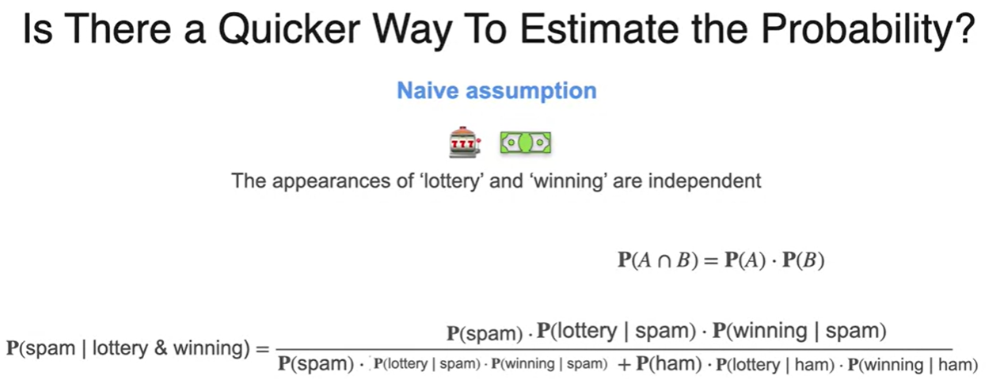
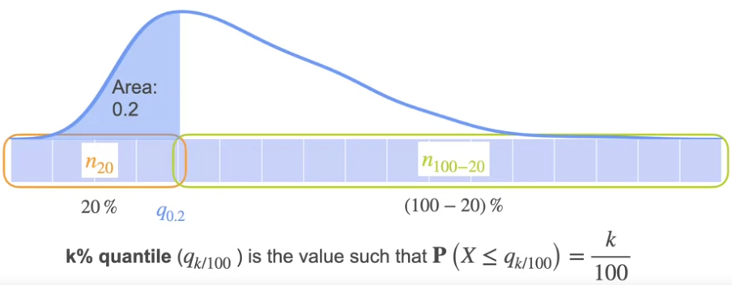
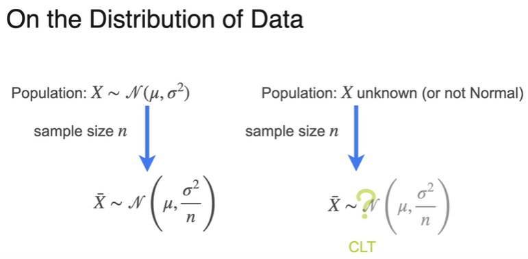
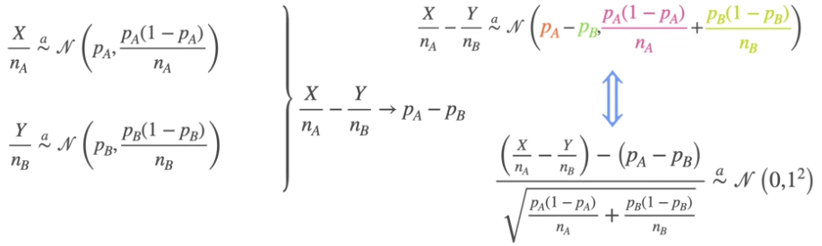

### 1. Intro to Probability

#### 1.1 Concept

- Probability is a measure of how likely an event is to occur. In mathematics, we use probability to quantify uncertainty. By calculating probabilities, we can make informed decisions and understand the likelihood of different outcomes.  

- The complement of an event is basically the probability that the event does not happen: $P(not A) = 1 - P(A)$
- Sum of probabilities (disjoint events): P(A OR B) = P(A) +P(B)
- Sum of probabilities (joint events): P(A OR B) = P(A) + P(B) - P(AB)

- Independence: the occurrence of one event does not affect the probability of another event happening. 
  - product rule for independent events: $P(AB) = P(A)*P(B)$

- Conditional Probability:  the probability of an event happening, given that another event has already occurred. It helps us see how new information can change the probability of an event. It's like adjusting our expectations based on what we already know.
  - General product rule: $P(AB) = P(A)*P(B|A)$, where P(B|A)=P(B) when independent.
  - $P(B|A) = P(AB) / P(A)$

#### 1.2 Bayes Theorem

- Intuition  
Bayes' theorem is a fundamental concept in probability and is widely used in various fields, including machine learning. It helps calculate the probability of an event occurring given certain conditions. In the context of a medical test, Bayes' theorem can be used to determine the probability of having a disease given a positive test result. 

If a person receives a positive test result, the probability of actually having the disease is influenced by the base rate.  The base rate of a condition refers to the prevalence or likelihood of that condition in a population. When interpreting test results, the base rate plays a crucial role in determining the probability of having the condition given a positive or negative test result.

- Formula

- Prior and Posterior

The **prior** probability is the initial probability, the event provides new information, and the **posterior** probability is the updated and more accurate probability based on that information.

- Naive Bayes Model
  
The naïve Bayes algorithm is a machine learning method used for classification tasks, such as determining if an email is spam or not.

It calculates the probability of a certain class (spam or ham) given the presence of specific words in the document.

The algorithm assumes that the appearance of each word is independent of the others, even though this is not always true in reality.

It calculates the prior probabilities of each class (spam or ham) based on the frequency of those classes in the dataset.

The algorithm also calculates the conditional probabilities of each word given each class.

To classify a new document, it multiplies the prior probability of each class by the conditional probabilities of the words in the document given each class.

The class with the highest probability is assigned as the predicted class for the document.

Despite the simplifying assumption, the naïve Bayes algorithm can still provide useful results in many cases.

- ML Applications

### 2. Probability Distributions

 
- Deterministic variables are associated with a fixed outcome, and random variables with an uncertain outcome. 
   
- The **probability mass function (PMF)** is a function that describes the probability distribution of a discrete random variable. It assigns probabilities to each possible outcome of the random variable. 
 

#### 2.1 Bernoulli Distribution

- Bernoulli distribution is a probability distribution that represents a random experiment with two possible outcomes - success and failure. 
- Random variable (denoted as x): In the context of the Bernoulli distribution, we use a random variable to represent the number of successes in the experiment.
- Probability of success (denoted as p): the likelihood of obtaining a success in the experiment. 
- Parameter of the Bernoulli distribution: only one is the probability of success (p). This parameter determines the shape and characteristics of the distribution.
- The probability mass function (PMF) of the Bernoulli distribution is given by:

  $P(X = x) = p^x * (1 - p)^(1 - x)$, where:
  - X is the random variable representing the outcome of the experiment (0 for failure, 1 for success).
  - p is the probability of success.
- The mean (expected value) of the Bernoulli distribution is given by: E(X) = p
- The variance of the Bernoulli distribution is given by: Var(X) = p * (1 - p)

#### 2.2 Binomial Distribution

- The binomial distribution is a discrete probability distribution that models a series of independent Bernoulli trials, where each trial has two possible outcomes - success and failure. It is defined by two parameters: the number of trials, n, and the probability of success in each trial, p.
- The probability mass function (PMF) of the binomial distribution is given by:

  $P(X = k) = C(n, k)  p^k  (1 - p)^(n - k)$, where:
  - X is the random variable representing the number of successes in the n trials.
  - k is the specific number of successes.
  - n is the total number of trials.
  - p is the probability of success in each trial.
  - C(n, k) is the binomial coefficient, which represents the number of ways to choose k successes from n trials and is calculated as C(n, k) = n! / (k! * (n - k)!), where ! denotes the factorial function.  
- The mean (expected value) of the binomial distribution is given by: E(X) = n * p
- The variance of the binomial distribution is given by: Var(X) = n  p  (1 - p)
- The **binomial coefficient**, denoted as "n choose k" or "C(n, k)", is a mathematical term that represents the number of ways to choose k items from a set of n items, without regard to the order of selection: $C(n, k) = n! / (k! * (n - k)!)$, where "!" denotes the factorial function. 
 
- The binomial coefficient has several properties, such as symmetry ($C(n, k) = C(n, n - k)$) and the fact that it represents the coefficients in the expansion of a binomial expression, such as (a + b)^n. 
- In the context of the binomial distribution, the binomial coefficient is used to calculate the number of ways to obtain a specific number of successes (k) in a fixed number of trials (n).  
  
  
  
  

#### 2.3 Continuous Probability Distributions

Discrete distributions involve events that can be listed and have specific values, while continuous distributions involve events that cannot be listed and have a range of values within an interval.

Discrete distributions:
- Events can be listed and take on specific values.
- Examples include the number of times a coin is tossed, the number of people in a town, or the number of cars passing by in an hour.
- The probabilities of each possible value can be represented as bars in a histogram or a probability mass function.
- The sum of the probabilities of all possible values is equal to 1.

Continuous distributions:
- Events cannot be listed and take on a range of values within an interval.
- Examples include the amount of time spent waiting on the phone, the height of individuals in a population, or the temperature in a given location.
- The probabilities are represented as a curve, often called a probability density function.
- The area under the curve represents the probability, and the height of the curve at a specific point does not directly represent the probability of that exact value.
- The probability of a specific value in a continuous distribution is typically zero, as there are infinitely many possible values within any given interval.
    

Probability Density Function (PDF): The PDF is a function that represents the rate at which probability accumulates around each point in a continuous distribution. It is denoted as lowercase f and is used to calculate probabilities by finding the area under the PDF curve between two points.

    

Cumulative Distribution Function (CDF): 
- The CDF shows the probability that a random variable is less than or equal to a certain value. It is a more convenient way to calculate probabilities compared to finding areas under a curve.
- The CDF starts at 0 and ends at 1, always positive and increasing, representing the entire range of probabilities.
- For discrete distributions, the CDF has jumps at the possible outcomes of the random variable. The height of each jump represents the probability of that specific outcome.
- For continuous distributions, the CDF is a smooth curve without jumps. The CDF is obtained by adding up the areas under the PDF curve from the beginning to a specific value.

   

  #### 2.4 Uniform Distribution

  - In uniform distribution, all values within a given interval have the same probability of occurring. 
  - The PDF of a uniform distribution is constant within the interval and 0 outside the interval. The height of the PDF is determined by the length of the interval.  
  - The CDF of a uniform distribution is a straight line with a slope of 1 within the interval. It starts at 0 and ends at 1.  
  - The uniform distribution has two parameters, a and b, which represent the beginning and end of the interval. The PDF is 1/(b-a) within the interval.
 
 

#### 2.5 Normal/Guassian Distribution

Intuition: When the number of trails n in binomial distribution is very large, the binomial distribution can be approximated with guassian distribution pretty well.

 

- The formula for the normal distribution includes parameters such as the mean (mu) and standard deviation (sigma), which determine the center and spread of the data. 
- The standard normal distribution is a special case with a mean of 0 and a standard deviation of 1. 
 
 
 
 

#### 2.6 Chi-Squared Distribution

  
- CDF of Chi-sqaure distribution with one degree of freedom can be obtained from PDF of the standard normal distribution.
  
- PDF is the derivative of the CDF  

- The distribution of the accumulated noise power over multiple transmissions is described using the Chi-squared distribution with different degrees of freedom. 
The distribution becomes more spread and symmetrical as the number of transmissions k increases.
 

#### Sampling from a distribution

1. Sampling from CDF of a discrete distribution
   

2. Sampling from CDF of a continuous distribution
     

### 3. Describing Distributions

#### 3.1 Meansures of central tendency

- Mean, or Expected Value, is calculated by taking the weighted average of the values of a variable, where the weights are the probabilities of each possible value. 

 

- Median is the middle value when the data is arranged in order, and it is less affected by extreme values. 

- Mode is the value that occurs most frequently in the distribution. 

- Expected value of a function: 
   
  - $E[aX+b] = aE[X]+b$
  - $E[X_1+X_2]=E[X_1]+E[X_2]$

#### 3.2 Measuring Spread: Variance and Standard Deviation

- Deviation: $x-E[X]$  
- Expected/Average Deviation: $E[X-E[X]]$. In the case when there are deviations in positives and negatives, they will cancel out.
- Absolute Deviation: $|X-E[X]|$
- Squared Deviation: $(x-E[X])^2$
- Expected Squared Deviation, aka, Variance: $E[(X-E[X])^2]$
   
  - $Var(X) = E[(X-E[X])^2] = E[X^2] - E[X]^2$
    
  - $Var(aX+b) = a^2Var(X)$
- Standard Deviation: take the squared root of the variance to measure the spread of a distribution using the same units of the distribution
  
   
- **Sum of Gaussians is still Gaussian**: in general, if you have a linear combination of variables where X and Y are both Gaussian, and both of them are independent, then the resulting variable follows a Gaussian distribution
 

- Standardization: everything is nicer when the mean is 0 and the standard deviation is 1. Some benefits: 
  1) it transforms datasets into a standard scale, making it easier to compare between different datasets. 
  2) it simplifies statistical analysis, particularly when using techniques that assume a standard normal distribution. 
  3) standardizing features in machine learning can improve the convergence rate of optimization algorithms and prevent some features from dominating others, leading to improved model performance.
   

#### 3.3 Skewness and Kurtosis
- Moments of a Distribution are statistical measures that help us understand the characteristics of a random variable.
 

- Skewness: $(E[(X - μ)^3]) / (σ^3)$, using the 3rd moment of a distribution. It tells us whether the distribution is skewed to the left (negative skewness) or to the right (positive skewness). A skewness of 0 indicates a symmetric distribution.
 

- Kurtosis: $(E[(X - μ)^4]) / (σ^4)$, using the 4th moment of a distribution. measures the thickness of the tails of a distribution. It tells us whether the distribution has heavy tails (positive kurtosis) or light tails (negative kurtosis). A kurtosis of 0 indicates a distribution with tails similar to a normal distribution. 
  

#### 3.4 Visualization

1. Box-Plots with quantiles

To identify outliers:
   - Calculate the **interquartile range (IQR)**, which is the difference between the third quartile (Q3) and the first quartile (Q1).
   - Draw the whiskers of the box plot. The lower whisker extends from Q1 to Q1 - 1.5 IQR, and the upper whisker extends from Q3 to Q3 + 1.5 IQR.
   - Any data points that fall outside the whiskers are considered outliers.

2. Histograms: Histograms are a way to visualize the distribution of data for continuous variables. However, they are not a great approximation for PDFs because they are not smooth and may have discontinuities.

3. **Kernel Density Estimation**: Kernel density estimation is a method to approximate the PDF of data from a histogram. To do so, 
     - Place a small Gaussian curve (kernel) on top of each data point, with the spread determined by the value of Sigma. 
     - Multiply each curve by one over n (the number of data points) and sum them all together. This results in a smooth function that resembles the PDF.
     - The accuracy of the approximation depends on the number of data points. With more data points, it becomes a better representation of the PDF.
     - The choice of Sigma allows you to control the level of smoothing in the estimated density. A smaller Sigma leads to a more detailed and localized representation, while a larger Sigma leads to a smoother and more spread-out representation.

4. Violin Plots: combination of box-plots and KDE

5. QQ Plots: using quantile-quantile plots (QQ plots), we can compare the quantiles of your data to the quantiles of a standard normal distribution.  If the data is normally distributed, the points on the QQ plot should be close to a diagonal line.
   

### 4. Multivariate Probability Distribution

#### 4.1 Discrete and Continuous Joint Distribution

For independent discrete variables, the joint distribution $P_{XY}(x,y) = P(x)*P(y)$  

#### 4.2 Marginal and Conditional Distribution

Marginal distribution summarizes the behavior of one variable while ignoring the other variables. To find the marginal distribution for a specific variable, we add up the probabilities for each value of that variable.

Conditional distribution focuses on the distribution of one variable given a specific value of another variable. To find the conditional distribution, we take a slice of the dataset by fixing the value of one variable. 

#### 4.3 Covariance and Correlation

Covariance measures the relationship between two random variables, while correlation measures the strength and direction of the relationship. 

Covariance can be calculated by centering the data and taking the average of the product of the centered coordinates:

$cov(X, Y) = E[(X - E[X])(Y - E[Y])]$ , where:

- cov(X, Y) represents the covariance between X and Y.
- E[X] and E[Y] represent the expected values (means) of X and Y, respectively.
- (X - E[X]) and (Y - E[Y]) represent the deviations of X and Y from their respective means.

**Covariance Matrix**: a square matrix that contains the variances of each variable on the diagonal and the covariances between variables on the off-diagonal. It is denoted by sigma and is used to represent the relationships between variables in a dataset.

**Correlation coefficient** is a number between -1 and 1, where -1 indicates a strong negative correlation, 1 indicates a strong positive correlation, and 0 indicates no correlation. It is calculated by dividing the covariance of the two variables by the product of their standard deviations.

$r = cov(X, Y) / (σX * σY)$, where:

- covariance(X, Y) is the covariance between variables X and Y,
- σX is the standard deviation of variable X,
- σY is the standard deviation of variable Y.

#### Multivariate Gaussian Distribution

- For univatiate, we work with scalar values and variances. For multivariate, we work with vectors and the convariance matrix.

This general expression is actually valid in the dependent case as well. The only difference is the covariance matrix is no longer diagonal, and now the off-diagonal amounts correspond to the covariances between variables.

### 5. Sampling
#### 5.1 Population and sample

A population refers to the entire group of individuals or items that we want to study, while a sample is a smaller subset that we actually observe or measure. 

- We can estimate the average height of a population by taking a small sample and calculating the average height of that sample. This estimate is called the **sample mean**. A sample mean based on a larger sample size provides a better estimate of the population mean compared to a sample mean based on a smaller sample size.   

- Population Proportion: The population proportion, denoted by P, is the number of items with a given characteristic divided by the total population size. 
  
- Sample Proportion: In cases where the population size is unknown, we can estimate the population proportion using a random sample. The sample proportion, denoted by P hat, is the number of items with a given characteristic divided by the sample size. 
- Sample Variance: 

#### 5.2 Law of Large Numbers

The law of large numbers states that as the sample size increases, the average of the sample will tend to get closer to the average of the entire population.

Certain conditions: 
1) Sample is randomly drawn
2) Sample size must be sufficiently large
3) Independent observations

#### 5.3 Central Limit Theorem

The central limit theorem states that if we take samples from any distribution, regardless of its shape, and calculate the average of those samples, the distribution of those averages will tend to follow a normal distribution. This is a fascinating result and is considered one of the pinnacles of statistics.

In general, a safe rule is that you usually need about 30 variables before the bell-shaped distribution comes in. It all depends on the original distribution of the data. If the original population is very skewed, then you usually need more samples than if you are working with a symmetric distribution. 

As n increases, the mean stays the same, and the variance gets smaller.

### 6. Point Estimation

Point estimation provides a single value as an estimate for the unknown parameter, which simplifies the interpretation and communication of results. Two flavors of point estimators are covered here - MLE and MAP.

#### 6.1 Maximum Likelihood Estimation

MLE is a commonly used method in statistics and machine learning. It involves finding the parameter value that maximizes the likelihood function, which measures the probability of observing the given data. MLE provides a point estimate that is most likely to have generated the observed data.

1. Motivation: This process of maximizing the conditional probability is known as maximum likelihood. In machine learning, MLE is used to estimate the probability of observing a given data set under different models, and the model with the highest probability is chosen as the most likely one.

2. Bernoulli Example: 

3. Gaussian Example

4. MLE Math Formulation for Gaussian population

- The likelihood function, denoted as L(θ | x), represents the probability of observing the given data x, assuming a specific set of parameter values θ. The MLE seeks to find the values of θ that make the observed data most probable.

- Formally, the MLE can be defined as: θ_hat = argmax L(θ | x), where θ_hat represents the estimated parameter values that maximize the likelihood function.

- To find the MLE, one typically takes the derivative of the likelihood function with respect to the parameters, sets it equal to zero, and solves for the parameter values that satisfy the equation. In some cases, it may be necessary to use numerical optimization techniques to find the maximum likelihood estimates.

5. MLE: Linear Regression
   - For each data point, a Gaussian distribution is centered at the point where the line intersects the horizontal line. A point is then sampled from this Gaussian distribution. 
   - The likelihood of generating each data point is calculated using the formula of the Gaussian distribution. Since the data points are assumed to be independent, the overall likelihood is the product of the individual likelihoods.
   - The goal is to maximize the overall likelihood, which is equivalent to minimizing the sum of squared distances between the data points and the line. This is known as the least square error.  
  

#### 6.2 Maximum a Posteriori Estimation (MAP)

1. Intuition from Bayesian Statistics

- Revisit example: What we actually want to maximize is not just the conditional probability, but the probability of the condition and observations happening together.

- Frequentist vs. Bayesian

2. Maximum a Posteriori (MAP)

MAP is a Bayesian version of a point estimator. It incorporates prior knowledge or beliefs about the parameter into the estimation process. MAP combines the likelihood function with a prior probability distribution to find the parameter value that maximizes the posterior probability. It can be thought of as a regularized version of MLE, where regularization helps prevent overfitting.

- Updating priors:

When both x and y are continuous random variables, replace the probability mass function by the probability density function for both variables.

3. Bernoulli Example

- We assumed there's no prior beliefs about the probability the coin comes up heads so any value between 0 and 1 seems eqaully likely. Hence prior is set to 1.

- The probability of observing the data you saw is some constant value that ensures the total area under the PDF is equal to 1 and hence can be ignored.
- Uninformative priors are just constants, and just like the constant in the denominator, they don't affect the shape of the curve or the location of the maximum, so you can ignore them. The only term you're left with is the probability of the data given the model, and maximizing that probability is all MLE does.

- What about an informative prior? When you want to incorporate new data, you just make your posteriors your new priors and repeat the process from before.

#### 6.3 Relationship between MLE, MAP and Regularization

1. Regularization is a technique used in machine learning to prevent overfitting and find the simplest model that fits the data well. It involves applying a penalty to more complex models to discourage their selection. 

In the case of L2 regularization, the penalty is the sum of the squares of the coefficients of the polynomial, excluding the constant term. By adding this penalty to the loss function, we can choose a model that balances fitting the data well and generalizing to new data. 

2. Bayesian approach can add penalty like regularization does

The probability of a model， P(Model), represents the likelihood of the model being the true representation of the data, while the likelihood of a model, P(data|Model) quantifies the probability of obtaining the observed data given a specific model. For example, P(Model) can be the product of probabilities of obtaining specific coefficient values from standard normal distributions

### 7. Confidence Intervals

#### 7.1 Intuition
  
- Confidence intervals are used to estimate the true value of a parameter, such as the mean height of a population.
- As the percentage confidence level increases, the range of values (width of the confidence interval) also increases. This is because higher confidence levels require capturing a larger proportion of the probability distribution, leading to wider intervals.  
- The interval is constructed around a best guess of the parameter's location, with a buffer on each side to account for uncertainty.   
- It's important to understand that there is only one true value for the parameter, and the interval represents the range of guesses that are likely to contain it.

  

A 95% confidence interval means that if we were to repeat the process of estimating a parameter (such as the mean) from a sample many times, approximately 95% of the resulting confidence intervals would contain the true population parameter. In other words, when we calculate a 95% confidence interval, we are saying that we are 95% confident that the true parameter lies within that interval.

  

Effect of Sample Size: Increasing the sample size at the same confidence level typically decreases the margin of error. This is because larger sample sizes provide more precise estimates of the population parameter, resulting in a smaller margin of error while maintaining the same level of confidence.

  

#### 7.2 Constructing a confidence interval (when standard deviation is known)

Central limit theorem assures us that even if we don't know the population distribution, as long as the sample size is large enough, the distribution of the sample mean will be approximately normal. This allows us to construct confidence intervals and make statistical inferences about the population mean.  
  

- The two main ingredients of a confidence interval are the sample mean and the margin of error. 
- The margin of error is determined by the size of the sample and the confidence level. 
- You can calculate the margin of error by multiplying the critical value (obtained from the standard normal distribution) by the standard error. The standard error is equal to the population standard deviation divided by the square root of the sample size. 

  
  
  
Up until this point, we have an estimated range of values for sample mean as below:
  

Steps to construct a CI:
1. Collect a random sample from the population of interest.
2. Calculate the sample mean, which is the average of the observations in the sample.
3. Determine the desired confidence level alpha, which represents the level of certainty you want in your estimate.
4. Find the critical value(s) from the standard normal distribution or t-distribution corresponding to the chosen confidence level.
5. Calculate the standard error, which is the standard deviation of the sample divided by the square root of the sample size.
6. Multiply the critical value(s) by the standard error to obtain the margin of error.
7. Add and subtract the margin of error from the sample mean to get the lower and upper limits of the confidence interval.
8. Interpret the confidence interval. It represents a range of values within which the population parameter (e.g., mean) is likely to fall with the chosen level of confidence.

Two assumptions to make the calculation valid:
1) The sample used is random
2) Sample size > 30, or, population is approximately normal.

- Calculating minimum required sample size for a desired margin of error:

- The population mean is either in the interval or not; it does not change (not random) or have a probability of being within the interval.

#### 7.3 Unknown Standard Deviation

In many cases, we do not know the population standard deviation. In such situations, we can use the sample standard deviation instead. This introduces the concept of the student t distribution, which is similar to the normal distribution but has fatter tails. To calculate confidence intervals when the standard deviation is unknown, we replace sigma with s (the sample standard deviation) and use the t score instead of the z score. 

The t distribution is defined by the degrees of freedom, which is determined by the number of samples minus one. The larger the degrees of freedom, the closer the t distribution is to the normal distribution.

#### 7.4 Confidence Intervals for Proportions

### 8. Hypothesis Testing

Hypothesis testing is a way to determine if a belief about a population is likely to be true or false. The null hypothesis is the base assumption, while the alternative hypothesis is the competing statement. These hypotheses are mutually exclusive and have a true or false answer. 

Null Hypothesis (H0): The null hypothesis is the default assumption or the baseline belief about the population. It states that there is no significant difference or relationship between variables, or that there is no effect or change in the population. It is often denoted as the status quo or the absence of an effect.

Alternative Hypothesis (H1): The alternative hypothesis is the statement that contradicts or challenges the null hypothesis. It represents the researcher's or analyst's belief that there is a significant difference, relationship, effect, or change in the population. It is the hypothesis that the researcher is interested in proving or supporting.

If there is enough evidence against the null hypothesis, it is rejected and the alternative hypothesis is accepted. However, if there is not enough evidence, the null hypothesis is not rejected, but it does not mean the null hypothesis is true. It simply means that we do not have enough evidence to support the alternative hypothesis. 

#### 8.1 Type I and II errors

- Type 1 Error: Type 1 error occurs when the null hypothesis is rejected when it is actually true. 
- The significance level (alpha) represents the maximum probability of committing a type 1 error. 
- Type 2 Error: occurs when the the null hypothesis is not rejected while it is actually false.

To determine the significance level, you need to decide the maximum probability of type I error you are willing to tolerate. A typical value is 0.05, which means you will consider a ham email as spam 5% of the time. Another common value is alpha equals 0.01. However, reducing the probability of type I error too much can increase the probability of type II error. 

#### 8.2 Right-Tailed, Left-Tailed and Two-Tailed Tests

- Test Statistic: The test statistic is a value calculated from the sample data that is used to make inferences about the population. In hypothesis testing, we compare the test statistic to a critical value or calculate its probability under the null hypothesis.

#### 8.3 P-Values

- The p-value is a measure of the strength of evidence against the null hypothesis. It represents the probability of observing a test statistic as extreme as, or more extreme than, the one observed, **assuming the null hypothesis is true**. 

In a right-tail test, the alternative hypothesis is that the population mean is greater than a specified value. The p-value is the probability of observing a sample mean greater than the observed value, assuming the null hypothesis is true.

In a two-tailed test, the alternative hypothesis is that the population mean is different from a specified value. The p-value is the probability of observing a sample mean as extreme as, or more extreme than, the observed value in both directions, assuming the null hypothesis is true.

A small p-value indicates strong evidence against the null hypothesis. If the p-value is less than a predetermined significance level (alpha), typically 0.05, we reject the null hypothesis in favor of the alternative hypothesis. This suggests that the observed data is unlikely to occur if the null hypothesis is true.

When the p-value is less than or equal to the significance level, we reject the null hypothesis, and the probability of committing a type 1 error is equal to the p-value. When the p-value is greater than the significance level, we fail to reject the null hypothesis, and the probability of committing a type 1 error remains at the significance level.

- Z-statistic is often used in hypothesis testing to determine the probability of observing a particular value or more extreme values, assuming a normal distribution.

We compare the calculated Z-statistic to critical values from the standard normal distribution table. These critical values depend on the chosen significance level (α) and the type of hypothesis test (one-tailed or two-tailed).

#### 8.4 Critical Values (k-value)
- Critical values represent the most extreme sample values that would still lead to rejecting the null hypothesis. It depends on the significance level (Alpha) chosen for the test. Different significance levels result in different critical values.

The probability of type II error (failing to reject the null hypothesis when it is false) is also known as **false negative rate** or **beta** in hypothesis testing.

#### 8.5 Power of a Test

The power of the test is the probability of making the right decision and rejecting the null hypothesis when it is not true. It is complementary to the type II error probability (beta), and can be calculated for different values of the population mean in the alternative hypothesis.

Trade-off between type I and type II error: As the significance level (alpha) decreases, the probability of a type II error (beta) increases, vice versa. 

Decreasing the significance level reduces the chances of a type I error but increases the chances of a type II error, leading to a decrease in the power of the test.

#### 8.6 Steps for Performing Hypothesis Testing

#### 8.8 t-Tests when population standard deviation is unknown

#### 8.9 Test for proportions

#### 8.10 Two-sample t-Test for population mean
  

#### 8.11 Two-sample test for proportions

#### 8.12 Paired t-Test

 Paired t-tests are used to compare two groups that are not independent. 

 
 

#### 8.13 A/B Testing

 

