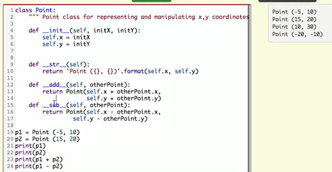

### 1. Constructing Classes

#### 1.1 User Defined Classes

Class definitions can appear anywhere in a program, but they are usually near the beginning (after the import statements). Class name is typically capitalized.  

Every class should have a method with the special name $__init__$. This initializer method, often referred to as the **constructor**, is automatically called whenever a new instance of Point is created. It gives the programmer the opportunity to **set up the attributes** required within the new instance by giving them their initial state values.

```Python
class Point:
    """ Point class for representing and manipulating x,y coordinates. """

    def __init__(self):

        self.x = 0
        self.y = 0

p = Point()         # Instantiate an object of type Point
q = Point()         # and make a second point
}
```

**Instantiation**: It may be helpful to think of a class as a factory for making objects. The class itself isn’t an instance of a point, but it contains the machinery to make point instances. Every time you call the constructor, you’re asking the factory to make you a new object. 

p and q are each bound to different Point instances. Even though both have x and y instance variables set to 0, they are different objects. Thus p is q evaluates to False.

#### 1.2 Adding parameters to the constructor

We can make our class constructor more generally usable by putting extra parameters into the $__init__$ method, as shown in this example.

```Python
class Point:
    """ Point class for representing and manipulating x,y coordinates. """

    def __init__(self, initX, initY):

        self.x = initX
        self.y = initY

p = Point(7,6)
```
This is a common thing to do in the $__init__$ method for a class: take in some parameters and save them as **instance variables**.  

The $__init__$ method does more than just save parameters as instance variables. For example, it might parse the contents of those variables and do some computation on them, storing the results in instance variables. It might even make an Internet connection, download some content, and store that in instance variables.

#### 1.4 Adding other methods to the class

A method behaves like a function but it is invoked on a specific instance. Methods are accessed using dot notation. 

All methods defined in a class that operate on objects of that class will have self as their first parameter. Again, this serves as a reference to the object itself which in turn gives access to the state data inside the object.

- special underscore methods
  



#### 1.5 Public and private instance variables

- Idea of abstraction: Others should not need to know exactly how you implemented your class; they should just be able to call the methods you have defined.

- How: Python does not “enforce” the idea of private instance variables. Using underscores in instance variable names (e.g., _iv or __iv) is a way to signal that an instance variable should be private.

- Python “mangles” any instance variables that start with two underscores to make them more difficult to access, by adding the name of the class to the beginning of the instance variable name (_classname__variablename). For example, __age becomes _Person__age. 


#### 1.6 Comparison of functions and methods
Python functions and methods are similar in many ways. They are both callable objects that can be invoked with arguments and return a value.  
The main difference between functions and methods is that **methods are defined within a class and are associated with instances of that class**. Methods are often considered "selfish" because they always put their self (the instance they belong to) first.  
Functions, on the other hand, live outside of any individual instance or object.  

#### 1.7 Testing Classes

To test a user-defined class, you will create test cases that check whether instances are created properly, and you will **create test cases for each of the methods** as functions, by invoking them on particular instances and seeing whether they produce the correct return values and side effects.

There are two types of tests depending on what the methods try to do:  
1. Return value test: whether they produce the correct return values
2. Side effect test: To test a method that changes the value of an instance variable

#### 1.8 Class Decorators

Python has a “decorator” syntax” that allows us to modify the behavior of functions or classes. 

A decorator is a function that accepts a function as an argument and returns a new function. The new function is usually a “wrapped” version of the original function. 

The decorator syntax is to place an @ symbol followed by the name of the decorator function on the line before the function definition. 

There are two ways we can use decorators with classes: (1) by decorating individual class methods or (2) by decorating the class itself.

```Python
def addLogging(func): # The argument, func is a method of a class

    def wrapper(self, x): # x is the argument that we're going to pass to func
        print(f"About to call the method with argument {x}")
        result = func(self, x) # actually call the method and store the result
        print(f"Done with the method invocation with argument {x} on instance {self}. Result: {result}")
        return result # return whatever our function returned

    return wrapper # return our new function

def addBeep(cls):
    cls.beep = lambda self: print(f"{self.model} says 'Beep!'")
    return cls

@addBeep # decorating the class itself
class Car:
    def __init__(self, make, model, color, mileage):
        self.make = make
        self.model = model
        self.color = color
        self.mileage = mileage

    @addLogging # decorating class methods
    def drive(self, miles):
        self.mileage += miles
        return self.mileage

    @addLogging
    def rePaint(self, color):
        self.color = color

    def __str__(self):
        return(f"***{self.color} {self.make} {self.model} with {self.mileage} miles***")

corvette = Car("Chevrolet", "Corvette", "red", 0)

corvette.drive(100)
corvette.beep()
```

### 2. Objects and Instances

#### 2.1 Sorting list of Instances
1. Using sorted function and specify key as the state of the instance to comapare on.
2. Define a method named $__lt__$ which stands for “less than”. It takes two instances as arguments: self and an argument for another instance. It returns True if the self instance should come before the other instance, and False otherwise. Python translates the expression a < b into $a.__lt__(b)$. When we call sorted(L) without specifying a value for the key parameter, it will sort the items in the list using the $__lt__$ method defined for the class of items.

#### 2.2 Class variables and instance variables

Instance variables: Every instance of a class can have its own instance variables. These variables represent the properties or attributes of a specific instance.  

Class variables: Classes can also have their own class variables. These variables are shared among all instances of the class and belong to the class itself. They are **defined outside of any method in the class**. Class methods are also a form of class variables. 

- When the interpreter sees an expression of the form obj.varname, it:
  1) Checks if the object has an instance variable set. If so, it uses that value.
  2) If it doesn’t find an instance variable, it checks whether the class has a class variable. If so it uses that value.
  3) If it doesn’t find an instance or a class variable, it creates a runtime error.

```Python
class MyClass:
    def __init__(self):
        self.f = lambda: 20
    def f(self):
        return 30

inst_1 = MyClass(5)
inst_1.f() # 20
```
```Python
class MyClass:
    class_lst = [1, 2]
    def __init__(self):
        self.instance_lst = [3, 4, 5]
        
inst_1 = MyClass()
inst_2 = MyClass()

print(inst_1.instance_lst is inst_2.instance_lst,
      inst_1.class_lst is inst_2.class_lst)
# False, True
```

### 3. Inheritance

Classes can “inherit” methods and class variables from other classes. It’s useful when someone else has defined a class in a module or library, and you just want to override a few things without having to reimplement everything they’ve done.
#### 3.1 Inheriting Varibales and Methods

In the definition of the inherited class, you only need to specify the methods and instance variables that are different from the parent class (the **parent class**, or the **superclass**).

```Python
# Here's the new definition of class Cat, a subclass of Pet.
class Cat(Pet): # the class name that the new class inherits from goes in the parentheses, like so.
    sounds = ['Meow'] # existing class variables can be updated 

    def chasing_rats(self):
        return "What are you doing, Pinky? Taking over the world?!"

```

This is how the interpreter looks up attributes:

1. First, it checks for an instance variable or an instance method by the name it’s looking for.

2. If an instance variable or method by that name is not found, it checks for a class variable.

3. If no class variable is found, it looks for a class variable in the parent class.

4. If no class variable is found, the interpreter looks for a class variable in THAT class’s parent (the “grandparent” class).

5. This process goes on until the last ancestor is reached, at which point Python will signal an error.

If a method is defined for a class, and also defined for its parent class, the subclass’ method is called and not the parent’s. This follows from the rules for looking up attributes.

#### 3.2 Invoking Parent Class's Method

Sometimes the parent class has a useful method, but you just need to execute a little extra code when running the subclass’s method. You can override the parent class’s method in the subclass’s method with the same name, but also invoke the parent class’s method with **super().method()**. 

```Python
class Dog(Pet):
    sounds = ['Woof', 'Ruff']

    def feed(self):
        # equivalent: Pet.feed(self)
        super().feed()
        print("Arf! Thanks!")

d1 = Dog("Astro")

d1.feed()

```

Pet.feed(self) is equivalent to super().feed(). However it is less flexible in cases when parent classes change names or the hierarchy.

#### 3.3 Multiple inheritance

In Python, a class can inherit from more than one parent class. This is called multiple inheritance.  

 It’s generally a good rule to avoid multiple inheritance unless it provides a clear and significant benefit. Always consider simpler alternatives, such as composition (using an instance of one class as an instance variable inside of another class) or single inheritance, before turning to multiple inheritance.