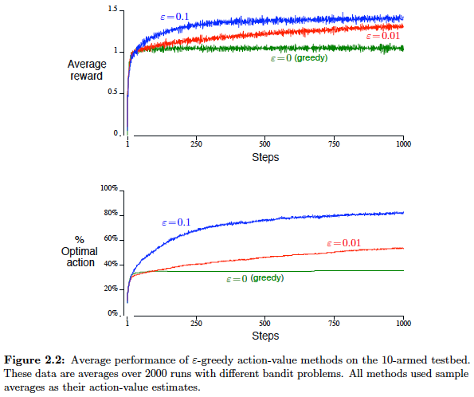
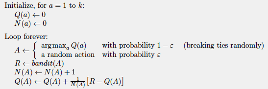
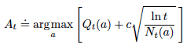
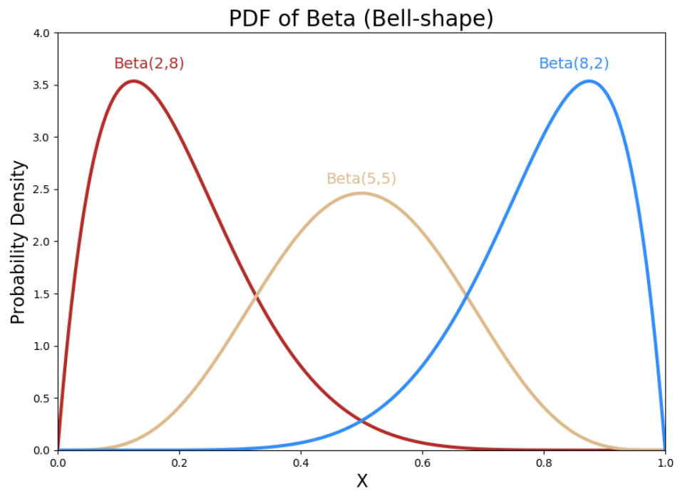
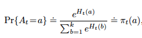
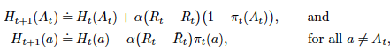

**Reinforcement Learning's Distinctive Feature**: The chapter highlights that reinforcement learning primarily uses **evaluative feedback**, which assesses the quality of actions taken rather than providing explicit instructions on correct actions. This necessitates **active exploration** to discover good behaviors, distinguishing it from supervised learning, which relies on instructive feedback.

**Nonassociative Setting**: The multi-armed bandit problem is a nonassociative task, meaning there's no need to associate different actions with different situations. This simplified context allows for a clear examination of evaluative feedback before moving to more complex reinforcement learning problems.

### K-armed Bandit Problem

*   **Definition**: An agent repeatedly chooses among *k* different actions (or options). After each choice, it receives a numerical reward from a probability distribution specific to the chosen action. The objective is to **maximize the total expected reward** over a period.
*   **Analogy**: It's likened to a slot machine ("one-armed bandit") with *k* levers, where each lever pull is an action and payoffs are rewards.
*   **Action Values**: The true value of an action *a*, denoted $q_*(a)$, is its expected reward. $q_*(a)=\mathbf{E}[R_t|A_t=a]$

- The agent's goal is to learn or estimate these values, denoted *$Q_t(a)$* at time *t*. We assume that you do not know the action values with certainty (otherwise it would be trivial to solve the problem), although you may have estimates. We would like *$Q_t(a)$* to be close to $q_*(a)$.

*   **Exploration vs. Exploitation Dilemma**: This is a central challenge in reinforcement learning.
    *   **Exploitation**: Choosing the action currently believed to be the best to maximize immediate reward. These are called *greedy actions*.
    *   **Exploration**: Trying out less-favored *nongreedy* actions to gather more information and potentially discover better actions in the long run.
    *   Exploitation is the right thing to do to maximize the expected reward on the one
step, but exploration may produce the greater total reward in the long run after you have discovered
the better actions.

### Key Learning Methods: **Action-Value Methods**

Estimate the values of actions and use the estimates to make action selection decisions

- Action-value Estimation
    *   **Sample-Average Technique**: Estimates action values by averaging all rewards received so far for that action. 
        - Appropriate for **stationary** bandit problems in which the reward probabilities do not change over time.
    - Tracking nonstationary problems - **Weighted Average Approach**: give more weight to recent rewards than
to long-past rewards. (See more under incremental implementation) 
- Action Selection Method
    *   **ε-Greedy Methods**: Implement exploration by selecting the action with the highest estimated value (greedy action) with probability `1-ε` and a random action with probability `ε`. This ensures all actions are sampled over time, leading to convergence of action-value estimates. 
    - Greedy vs ε-Greedy:

        On the **10-armed testbed** (a set of 2000 randomly generated problems with *k*=10), ε-greedy methods outperform purely greedy ones in the long run by continuing to explore.

        

        - Choice of `ε`: A larger `ε` value would allow more exploration, and usually find the optimal action earlier, but it never selects that action more than 1-`ε` of the time. The smaller `ε` (i.e. 0.01) improves more slowly, but eventually would perform better than the `ε` = 0.1 method on both performance measures shown in the figure. It is also possible to reduce `ε` over time to try to get the best of both high and low values.
        - The advantage of `ε`-greedy over greedy methods depends on the task. i.e. If the reward variances were zero, then the greedy method would know the true value of each action after trying it once. But even in the deterministic case there is a large advantage to exploring if we weaken some of the other assumptions. For example, suppose the **bandit task were nonstationary**, that is, the true values of the actions changed over time (very common). Then exploration is needed even in the deterministic case to make sure one of the nongreedy actions has not changed to become better than the greedy one.

*   **Incremental Implementation**: Enables efficient computation of sample averages with constant memory (only for $Q_n$ and $n$) and per-time-step computation, using an update rule of the form:
        
    - NewEstimate &larr; OldEstimate + StepSize * [Target - OldEstimate].

    - The expression [Target−OldEstimate] is an error in the estimate. It is reduced by taking a step toward the “Target”.
    - Take sample average as example: given $Q_n$ and the nth reward, $R_n$ for action a, the new average of all n rewards can be computed by $Q_{n+1} = Q_n + 1/n[R_n - Q_n]$. 

    - Pseudocode for a complete bandit algorithm using incrementally computed sample averages and ε-greedy action selection:

         

    - Weighted average (exponential recency-weighted average) estimation for nonstationary problems using a **constatnt step-size parameter $\alpha$**:

        $Q_{n+1} = Q_n + \alpha[R_n - Q_n]$, where $\alpha \in (0,1]$

        The weight given to $R_i$ decreases as the number of intervening rewards increases.

*   **Optimistic Initial Values**: Initialize action-value estimates with high values to encourage initial exploration. This bias eventually disappears for sample-average methods once all actions are tried.

    Why: Whichever actions are initially selected, the reward is less than the starting estimates; the learner switches to other actions, being “disappointed” with the rewards it is receiving. The result is that all actions are tried several times before the value estimates converge.

### Key Learning Methods: Upper-Confidence-Bound (UCB) Action Selection

Selects actions by considering both the estimated value and a **measure of uncertainty (or variance) in that estimate**. Actions with lower value estimates or less frequent selections are subtly favored for exploration. 

Intuition: If an arm has been tried many times, its confidence bound shrinks, and it’s picked mostly if its mean reward is good.

For each arm we maintain:
- $Q_t(a)$: the empirical mean reward (average observed reward so far).
- $N_t(a)$: the number of times arm a has been pulled.
- $t$: the total number of pulls (time steps)

UCB selects the best arm based on:
     

- The first term encourages exploitation (pick the best average reward so far).
- The second term encourages exploration (try arms that have been pulled less often, since their estimates are more uncertain).
- c is a tuning parameter that scales exploration vs exploitation.
- UCB initializes by pulling each arm once (to get at least one reward sample). Note that UCB does not need to set optimistic initial values at start, as it already handles exploration explicitly through confidence bounds to ensure **arms not tried much to get inflated scores**.

UCB often performs well but is harder to extend to more general reinforcement learning problems with large state spaces or nonstationary environments.

### Key Learning Methods: Thompson Sampling Action Selection

Thompson Sampling (aka **posterior sampling** or **Bayesian bandits**) is a **probabilistic exploration** method for the multi-armed bandit problem. It learns distributions over action values (belief about expected reward for each arm).

The core idea: At each round, **randomly select** an action according to the probability that it is the best action, **based on your current belief**.

So instead of always taking the arm with the highest estimated mean (like greedy) or adding an exploration bonus (like UCB), **TS samples from its uncertainty distribution**. &rarr; induces exploration naturally

How Thompson Sampling Works:
1. Model Uncertainty with Priors
    - Each arm’s reward distribution is assumed to come from a prior (e.g., Beta for Bernoulli rewards, Gaussian for normal rewards). Maintain priors for each arm a.
    - Example: For a Bernoulli bandit (success/failure), start with Beta(1,1) (uniform prior).

       

      - When alpha = beta, the distribution is symmetric with its peak increasing as alpha and beta increase together
      - When alpha > beta, the distribution shifts to the right, the higher alpha is compared to beta, the more right it goes and the peak also increases
      - When alpha < beta, the distribution shifts to the left, the higher beta is compared to alpha, the more left it goes and the peak also increases

2. Update Posterior with Observations
    - After pulling an arm and seeing a reward, update its posterior reward distribution.
    - For example, in Bernoulli rewards: If arm a has been pulled s times with r successes, posterior = Beta(r+1,s−r+1).
    - Thus, more successful arms will shift to the right (like the blue distribution in above diagram) and will have a higher chance of being picked, but there is still some chance for the other arms to get picked as they will be present at the lower ends of the distributions.
3. Action Selection (The Thompson Step)
    - For each arm, sample a “candidate mean reward” from its posterior.
    - Select the arm with the **highest sampled value**.
4. Repeat: Collect reward, update posterior, and continue.

Key Characteristics:
- Arms with high uncertainty get more variability in their sampled estimates, so they’re more likely to be chosen early (exploration).
- Arms with strong evidence of high reward get consistently high samples, so they dominate later (exploitation).
- This balances exploration and exploitation naturally, without tuning an exploration parameter like in ϵ-greedy.

### Key Learning Methods: Gradient Bandit Algorithms (Softmax Learning Policy)

Unlike ϵ-greedy, UCB, or Thompson Sampling, which are about estimating action values and picking the best, the gradient bandit method directly learns a policy (a probability distribution over actions). 

The agent maintains a numerical **preferences $H_t(a)$** for each action rather than action values. Higher value 
means action a is more likely. These preferences are turned into an action probability distribution using the **softmax** function:

  

So the policy is a softmax over action preferences. 
- Initially all action preferences are the same (e.g., $H_1(a)$ = 0, for all a) so that all actions have an equal probability of being selected.
- After choosing an action $A_t$ and receiving reward $R_t$, the preferences are updated with **stochastic gradient ascent** to increase the likelihood of good actions.

     

    - $\alpha>0$ is a step-size parameter or learning rate
    - $R_t$ reward at time t
    - $R̄_t$ **reward baseline** (often the average reward before t), which the current reward is compared against to adjust preferences.
        - The baseline reduces variance; without it, updates are noisier.
    - $\pi_t(a)$ the probability of taking action a at time t
    
Key characteristics:
- Exploration is inherent: since softmax never assigns zero probability, all actions keep some chance of being tried.
- Policy-gradient flavor: this is like a baby version of REINFORCE (the classic policy-gradient method in RL).
- Stationary assumption: works best when reward distributions don’t change.

---
### **Associative Search (Contextual Bandits)** 

This section introduces a stepping stone to the full reinforcement learning problem. It deals with tasks where the best action depends on the *situation* or *context*. The agent learns a policy that maps situations to actions, but unlike full MDPs, actions here only affect immediate rewards, not subsequent situations.

The core idea: instead of treating each arm as having a fixed expected reward, we assume the reward depends on the context (features) observed at each decision point. So we replace:

$q_*(a) = \mu_a = expected reward of arm a$

with:

$q_*(a, x) = \mu_a(x) = expected reward of arm a given context x$

where x could be user features, environment variables, etc.

---

You need a model that predicts the **expected reward given the user’s context and the chosen arm**:

$$
\hat{r}(x, a) = \mathbb{E}[r \mid x, a]
$$

Now, how to set this up depends on **whether you model arms separately or jointly**:

**Option 1: One model per arm**

* For each arm $a$, train a separate supervised model:

  $$
  \hat{r}_a(x) \approx \mathbb{E}[r \mid x, a]
  $$
* At decision time: plug the current user’s features $x$ into each model, compare predictions, pick the arm with highest $\hat{r}_a(x)$.
* **Pros**:

  * Very flexible: each arm can have its own reward distribution and feature importance.
  * Works well if arms are very different (e.g., ads for cars vs. cosmetics).
* **Cons**:

  * If there are **100 arms**, you really need **100 models**.
  * Data sparsity: some arms may not get enough samples to train well.
  * Expensive to maintain.

**Option 2: One joint model across arms**

* Train a single model that takes both **user features $x$** and **arm features / ID $a$** as inputs.

  * E.g., represent arms with one-hot vectors or embeddings.
  * Model predicts:

    $$
    \hat{r}(x, a) \approx \mathbb{E}[r \mid x, a]
    $$
* At decision time: for a given user $x$, compute predictions for all arms and pick the best.
* **Pros**:

  * Much more **data-efficient**: all arms share statistical strength.
  * Easy to scale to large numbers of arms (with embeddings).
  * This is how industry-scale recommenders (ads, videos, items) usually do it.
* **Cons**:

  * May force arms to share structure even if they’re fundamentally different.

🔑 In practice:

* **Small # of arms (say 5–10)** → per-arm models are fine.
* **Large # of arms (hundreds/thousands)** → joint model is almost always used, often with embeddings (like in YouTube’s and TikTok’s recommender systems).
* The greedy step is the same:

  * **predict CTR for all candidate arms**
  * **choose the argmax**

---

### 🎯 Example Setup: News Article Recommendation

* Goal: At each time step, recommend **1 of 3 news articles** to a user.
* Context = **user features** (age, location, browsing history, device, etc.).
* Reward = **1 if user clicks the article, 0 otherwise**.

We want to maximize clicks (CTR) while balancing exploration (trying different articles) and exploitation (showing the best article).

 🔹 1. **Greedy with Context**

- Two Options: Modeling arms separately or jointly
* Each article has a predictive model of click probability given user features.

  * e.g. Logistic regression:

    $$
    P(\text{click}|x, a) = \sigma(x^\top \theta_a)
    $$

* For each user context $x$, predict CTR for all articles, pick the one with **highest predicted CTR**.

    ✅ **Pros**: Simple, interpretable.

    ❌ **Cons**: No exploration → may get stuck recommending the same article and miss discovering better ones.

🔹 2. **UCB with Context (LinUCB)**

* Modeling assumption:
    - Each arm a has its own parameter vector $\theta_a$ &rarr; separate linear model per arm
        - Why separate?
            - The algorithm’s confidence bounds are arm-specific.
    - Expected reward (click probability) is linear in features

  $$
  \hat{r}_a(x) = x^\top \hat{\theta}_a
  $$
* Add an **exploration bonus** proportional to uncertainty:

  $$
  UCB_a(x) = x^\top \hat{\theta}_a + \alpha \cdot \sqrt{x^\top A_a^{-1} x}
  $$
* Choose the article with the **largest UCB score**.

    ✅ **Pros**: Balances exploration and exploitation, considers feature uncertainty.

    ❌ **Cons**: Assumes linearity (may underperform if relationships are nonlinear).

🔹 3. **Thompson Sampling with Context (Linear TS)**

* Modeling assumption:
    - Expected reward (click probability) is linear in features

    $$
    r \sim \mathcal{N}(x^\top \theta_a, \sigma^2)
    $$
    - Each arm a has its own posterior distribution over $\theta_a$ &rarr; separate model per arm
        - Why separate?
            - The algorithm’s confidence bounds are arm-specific.
- Implementation
    - Place a prior on the parameters $\theta_a$.
    * Maintain posterior distribution $\theta_a$ over each arm as new data comes in.
    * Each round:

        1. Sample $\theta_a$ from posterior for each article.
        2. Predict reward $\tilde{r}_a(x) = x^\top \theta_a$.
        3. Choose article with highest sampled reward.

    ✅ **Pros**: Natural exploration via posterior uncertainty, Bayesian grounding.
    
    ❌ **Cons**: Needs priors and posterior updates (heavier math/compute than UCB).

🔹 4. **Softmax (Gradient Bandit) with Context**

* Modeling assumption:
    * Define preference score:

    $$
    H(a|x) = x^\top \theta_a
    $$
    * Convert to action probabilities with softmax:

    $$
    \pi(a|x) = \frac{\exp(H(a|x))}{\sum_b \exp(H(b|x))}
    $$
* Sample an article according to $\pi(a|x)$.
* Update $\theta_a$ via gradient ascent based on observed reward (policy-gradient style).
* **Does this mean one model per arm?**
  ✅ Yes, typically you maintain one parameter vector $\theta_a$ per arm.

  * Together, all arms’ parameters define the policy.
  * In practice, you can implement this as a **single multinomial logistic regression** (softmax regression).

    * This way, you don’t think of it as “many models” but as **one joint classifier** with arm-specific parameters.

    ✅ **Pros**: Learns policy directly, always explores (since probabilities never 0).
    
    ❌ **Cons**: Sensitive to learning rate, may converge slowly.

🔹 5. **Neighborhood Policies**

A neighborhood policy defines how to **find "similar" past observations (based on user/item/context features) and use those to estimate the expected reward** for each arm.

Instead of fitting a global model across all contexts (like LinUCB or logistic regression), neighborhood-based methods make decisions **locally**:
- Given the current context (e.g., a user’s features), find past interactions with similar contexts (**neighbor filering**).
- Estimate the reward for each arm using only those "neighbors".
- Select the arm based on specified learning policy (possibly with exploration, e.g., ε-greedy or TS).

In MABWiser, you’ll see policies like:
- k-Nearest Neighbors (kNN): Use the average reward of the k most similar contexts for each arm.
- Radius-based neighborhood: Consider all past contexts within a distance threshold.
- Clustering-based: Cluster contexts first, then use cluster-level reward estimates.

✅ Neighborhood policies: Flexible, non-parametric, no strong assumptions about linearity of reward in features.

❌ But: They may struggle with high-dimensional contexts (curse of dimensionality), and are slower with large histories.

When combining a neighborhood policy with other contextual learning policies like LinUCB:

Instead of fitting one global linear model per arm, you fit local linear models per arm within each neighborhood. This lets you capture heterogeneity that is not easily modeled as a single linear function.
- When it’s helpful
    - Nonlinear reward structure: If the true reward function is not globally linear in context, then restricting LinUCB to local neighborhoods makes it more flexible.
    - Heterogeneous users/items: If different user groups behave very differently (e.g., teenagers vs. retirees in recommendations).
    - Large datasets: When you have enough data per neighborhood to fit reliable local models.
- When it’s risky
    - Sparse data: If each arm-context combination is rarely observed, restricting to neighbors may leave LinUCB with too little data → unstable estimates.
    - Too small neighborhoods: May lead to high variance in parameter estimation.
    - Computational cost: Neighborhood search adds overhead, especially in high dimensions.

🔑 Summary
* **greedy+context** → freely choose “one model per arm” vs “one joint model”
* **LinUCB** → per-arm linear models ($\theta_a$ and covariance matrix per arm).
* **Linear Thompson Sampling** → per-arm posteriors over $\theta_a$.
* **Softmax contextual bandit** → per-arm parameter vectors, but can be viewed as one joint softmax regression model.
* **Neighborhood + bandit** → non-parametric, a local variant of bandits.
---

✅ Putting It Together (User Flow)

Suppose a **user comes in** with context:

* Age = 25, Device = Mobile, Interests = Tech.

* **Greedy**: Predict CTR for each article via regression → always pick the top one (say, Tech news).

* **UCB**: Predict CTR + exploration bonus → maybe try Sports article if it hasn’t been shown much to young mobile users.

* **Thompson Sampling**: Sample click probabilities → maybe Tech looks best most of the time, but sometimes Politics gets a high sample, so it gets tried.

* **Softmax**: Convert preferences to probabilities → recommend Tech 60% of the time, Politics 25%, Sports 15%.

Over time, the system **learns which articles work best for which types of users**, while still testing new possibilities.

---

### ⚡️ In industry

| Company         | Bandit Variant                 | Application                 | Key Advantage                                      |
| --------------- | ------------------------------ | --------------------------- | -------------------------------------------------- |
| Microsoft       | Hybrid LinUCB                  | News recommendation         | Balances global vs arm-specific effects            |
| Google/YouTube  | Thompson Sampling              | Ads & video recommendations | Efficient traffic allocation, Bayesian exploration |
| LinkedIn        | Thompson Sampling (contextual) | Feed & notifications        | Robust personalization under uncertainty           |
| Facebook/Meta   | Contextual Bandits (TS + Deep) | News feed & ads             | Leverages deep user/content features               |
| Netflix (early) | Softmax / Gradient bandit      | Movie recommendations       | Simple probabilistic exploration                   |

**1. Microsoft — Hybrid LinUCB (News Recommendation, MSN Explorer project)**

* **Problem**: Recommending news articles to users in real time (click-through rate prediction).
* **Technique**: **Hybrid LinUCB**

  * Combines **global parameters** (shared across arms, capturing common effects of user features like age, device type)
  * With **arm-specific parameters** (per-article effects, capturing unique preferences).
* **Why LinUCB?**

  * Strong cold-start handling (linear models + confidence bounds).
  * Good balance between exploration (confidence term) and exploitation.
* **Impact**: Improved CTR by reducing bias toward already-popular articles.

**2. Google / YouTube — Thompson Sampling (Content Recommendation & Ads)**

* **Problem**:

  * YouTube: video recommendations, ad allocation.
  * Google Ads: optimizing which ads to show to maximize CTR or conversions.
* **Technique**: **Thompson Sampling (Bayesian Bandits)**

  * Bayesian framework fits naturally into large-scale A/B testing.
  * Helps efficiently allocate traffic between ads/content while still exploring.
* **Why TS?**

  * Simple, scalable, and **probabilistic exploration** (avoids UCB’s deterministic bias).
  * Works well with delayed feedback (common in ads/conversions).
* **Impact**: Reduced regret during live experiments compared to $\epsilon$-greedy or UCB.

**3. LinkedIn — Thompson Sampling (Feed Ranking & Notifications)**

* **Problem**: Which posts to show in feed, which notifications to send.
* **Technique**: **Thompson Sampling with contextual features**.
* **Why TS?**

  * Feed/notifications have delayed and sparse feedback (only a few actions observed per user).
  * TS’s posterior sampling makes it robust to uncertainty.
* **Impact**: Improved personalization and user engagement without spamming users.

**4. Facebook / Meta — Contextual Bandits (News Feed & Ads)**

* **Problem**: Selecting posts, ads, and recommendations from a large pool.
* **Technique**: **Contextual bandits (TS + Deep learning extensions)**

  * Uses context (user profile, session features, content embeddings).
  * Sometimes combined with **Deep Neural Networks** → “Deep Contextual Bandits”
* **Why Contextual Bandits?**

  * Pure A/B testing wastes traffic.
  * Bandits allow efficient exploration of personalization strategies.
* **Impact**: Faster iteration cycles in product experiments, reduced user churn due to irrelevant content.

**5. Netflix — Softmax / Gradient Bandits (Early Content Recommendation)**

* **Problem**: Which movies or shows to recommend (before the deep learning era).
* **Technique**: **Softmax bandit / multinomial logistic regression with exploration temperature.**
* **Why Softmax?**

  * Smooth probabilistic selection across multiple arms (explores naturally).
* **Later evolution**: Moved toward contextual bandits with deep embeddings, now fully **RL-based sequential decision-making**.

✅ **Summary**:

* **LinUCB / Hybrid LinUCB**: Great when you assume **linear reward structure** and want cold-start performance.
* **Thompson Sampling**: Industry favorite — simple, scalable, Bayesian exploration.
* **Softmax**: Early exploration method, less used now at scale (replaced by TS/UCB).
* **Contextual bandits (deep variants)**: Where modern recommendation systems have gone (Meta, Netflix today).

| Era         | Method                          | Typical Use                     | Example Companies           |
| ----------- | ------------------------------- | ------------------------------- | --------------------------- |
| Early 2000s | Greedy, A/B tests               | Simple recs                     | Netflix (DVD era)           |
| Mid 2000s   | Softmax, ε-Greedy               | Baseline personalization        | Amazon, Netflix             |
| Late 2000s  | UCB                             | Ads, news recs                  | Microsoft MSN, Google Ads   |
| 2010s       | Contextual Bandits (LinUCB, TS) | Personalized feeds & ads        | Microsoft, LinkedIn, Google |
| Late 2010s  | Deep Contextual Bandits         | Feed, video, notifications      | Facebook, YouTube           |
| 2020s+      | Full RL                         | Long-term engagement, retention | Netflix, TikTok, Meta       |

- Bandits are still heavily used for exploration & short-term optimization.
- But most big tech platforms now run hybrid systems: 
    - Bandits for exploration / cold-start.
    - Deep RL for long-term optimization.

---

### Comparison with A/B Testing

#### Scenarios for MAB to work better than AB Testing

- Time sensitivity to exploit and maximize the rewards i.e. recommending holiday deals
- Cost of mistake is low so that MAB can explore and make low stake mistakes. i.e. exploring optimal guest fee % in Airbnb
- Personalization - no universal best but situational best i.e. what if there're no meaningful differences of success between two variants overall, but there could be segmentwise differences (heterogeneous treatment effect).

#### Limitation

- Bandits are not good at optimizing multiple objectives

  - Short-term greedy policy and long-term trade-off

    Policies derived from the contextual bandit formulation are greedy in the sense that they do not take long-term effects of actions into account. These policies effectively **treat each visit to a website as if it were made by a new visitor uniformly sampled from the population of the website’s visitors**. By **not using the fact that many users repeatedly visit the same websites**, greedy policies do not take advantage of possibilities provided by long-term interactions with individual users.

- Bandits take acions based on cumulative rewards and hence are not well suited in nonstationary environments i.e. distringuishing weekday patterns

- Challenges on making causal inference and ensuring consistent user experiences
